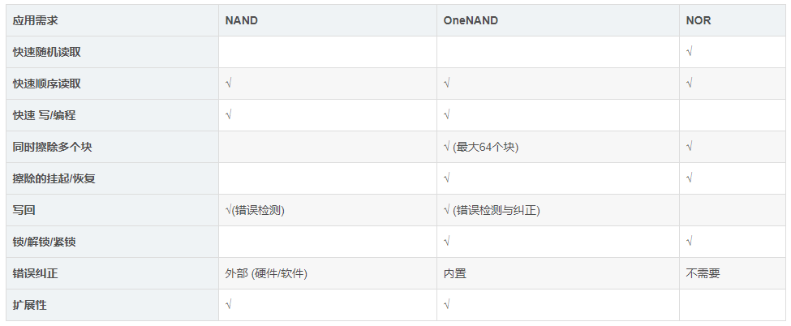

# nand flash

相比与nor flash，nand flash的一个缺点是容易产生坏块。

因此在使用nand flash的时候，需要使用校验算法来发现并标注坏块。

nand  flash没有地址和数据总线。

**nand flash以page为单位进行读写，以block为单位进行擦除。**

**坏块是指block。**

page内部有分为2个区：

main和spare。

main就是存放数据。

spare存放附加信息。例如坏块标记、块的逻辑地址、ECC校验和。

因为nand flash的工艺限制，在nand flash的生产和使用过程中，会产生坏块。

**坏块的特性是：在擦除和写入的时候，不能将某些位拉高。**

坏块可以分为两种：

1、固有坏块。生产过程中产生的，厂家会在坏块block的第一个page的spare区的第六个bit进行标记。

2、使用坏块。

坏块有可能是假坏块。

mini2440上使用的nand flash是256MB。

page是2K+64.

block是128K+4K。

NAND Flash 在嵌入式系统中的地位与PC机上的硬盘是类似的。

用于保存系统运行所必需的操作系统，应用程序，用户数据，

运行过程中产生的各类数据，系统掉电后数据不会丢失。

读写是以页为单位的，擦除是以块为单位的。
对于Nand的写操作，只能由1变成0，而不能由0变成1。所以必须先对nand执行erase操作，即将0变成1，然后再写（使对应的1变成0）

存储在Nand中的数据容易发生错误，所以采取一定的算法对数据进行编码和解码很有必要。在数据存储到nand flash之前进行编码，连同校验数据一同存储到nand之中；在数据从nand读出之后进行解码，以验证数据是否出错。

## 相关术语

a)、ONFI标准

b)、Block Management(坏)块管理

c)、Wear-Leveling 负载平衡

d)、ECC 错误校验码

e)、SLC 和MLC

## 坏块处理

Nand Flash两种坏块管理方式

本文章介绍的两种坏块管理方式为：**非顺序映射** 和 **顺序映射**

两种管理方式都有优缺点；一般像UCOS等小系统，已经有FAT32等文件系统管理机制，建议使用顺序映射；像linux系统，已经有mtd机制，则可以使用非顺序映射，这样更能保证数据的完整性。

参考资料

1、

https://blog.csdn.net/weixin_37981492/article/details/113348534

## 参考资料

1、NandFlash详解

https://blog.csdn.net/Golden_Chen/article/details/89470673

# nor flash

像访问SDRAM一样，所以可以片内执行。

读时序类似与SDRAM。

可以用来存放代码。

nand flash：

不能片内执行。地址线宽度不确定，是8位、16位或者32位。

主要用来存放数据。U盘的内部就是nand flash。

spi flash则是外挂的flash，不是在芯片的寻址空间里。

优点是便宜。

缺点是速度较慢。

这种spi接口的flash也可以作为mtd设备。

并口flash和串口flash。

对于nor flash而言，CFI接口 = JEDEC接口= 并行接口。

对于S3C2410平台而言，外接的nor flash直接映射在CPU的内存空间上，可以直接用通用的drivers/mtd/maps/physmap.c的驱动。

驱动开发者需要做的事情就是在bsp文件里，配置一下resource。

# nand和nor对比

nor的特点：

1、贵。

2、慢。

3、可靠。

所以nor一般用来保存关键数据。

nand的特点：

1、偏移。

2、快。

3、不太可靠。

所以nand一般用来保存大容量的数据。

# OneNand是什么

是三星推出的一种存储技术。是一种混合存储器。

基础概念是把Nand Flash、SRAM芯片和逻辑芯片继承为一颗单芯片。采用的是Nor Flash接口。

所以集合了Nand的高容量和Nor的读取速度快优点于一身。其中的SRAM是作为高速缓存。

因为集成的SRAM是1K，所以OneNand在最前面的1K，是具有片内执行的能力的。

https://blog.csdn.net/baidu_37973494/article/details/82257606

# Linux flash驱动

参考资料

1、

https://blog.csdn.net/Golden_Chen/article/details/89472163

# 参考资料

1、

https://www.cnblogs.com/lifexy/p/7737174.html

2、mini2440硬件篇之Nand Flash

https://blog.csdn.net/hyq458941968/article/details/45269799