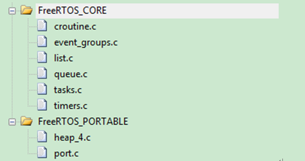

--

接触了几个国内mcu厂家的开发包，都使用了freertos来做基础os的。

看起来，freertos的接受度还是很高的。

应该是稳定，免费，足以让厂家基于这个构建自己的一套开发包。

所以，我还是有必要把freertos梳理一下的。

我手里有一份10.1.1的代码。

目录分布

```
Demo
	这下面放到就在各个板子上的demo例子。
	我就看CORTEX_STM32F103_Primer_GCC这个例子就好了。
Source
	include
	portable
		这个下面列出了不同的ide、工具链的。
		我就看gcc/ARM_CM3这个目录下的。
			这个下面就2个文件：port.c和portmacro.h。
		另外有个memmang目录需要注意。
		这个下面有5个heap_x.c文件。x为1到5，表示5种heap策略。
	7个C文件。
	croutine.c
	event_groups.c
	list.c
	queue.c
	stream_buffer.c
	tasks.c
	timers.c
```

在移植的时候,主要裁剪FreeRTOS/Source/portable文件夹,该文件夹用来针对不同MCU做的一些处理

- **heap_4:** 优点在于可以有效的利用内存碎片来合并为一个大内存.缺点在于只能用来一个ram里.
- **heap_5:** 一般针对有外部RAM才用到,优点在于可以同时利用内部ram和外部ram来进行内存碎片合并.



最后需要添加到我们工程里的freertos相关C文件就是上图这8个。

CORTEX_STM32F103_Primer_GCC 从这个目录开始看。

```
 * In line with software engineering best practice, FreeRTOS implements a strict
 * data hiding policy, so the real structures used by FreeRTOS to maintain the
 * state of tasks, queues, semaphores, etc. are not accessible to the application
 * code.  However, if the application writer wants to statically allocate such
```

采用了隐藏数据具体内容的方法。

````
struct xSTATIC_LIST_ITEM
{
	TickType_t xDummy1;
	void *pvDummy2[ 4 ];
};
````

所以只能通过接口来使用，不能直接访问这些结构体的成员变量。


参考资料

1、

https://www.cnblogs.com/lifexy/p/10463050.html