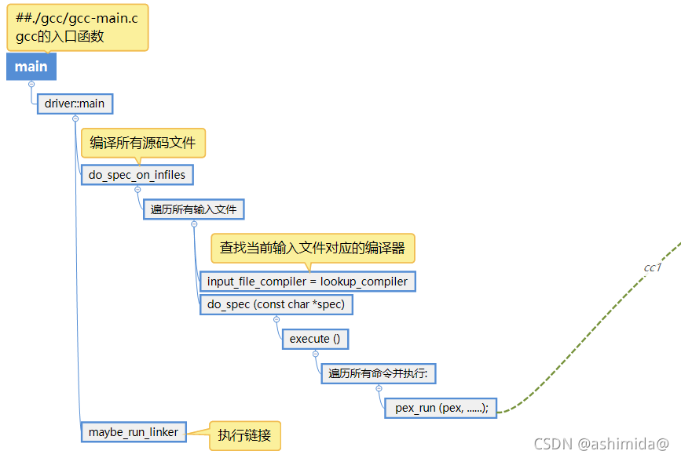

--



# 从零编译一个gcc交叉工具链

## 为什么需要

为了避免和host的编译系统耦合，很多sdk和需要和客户联编的软件都会提供自己的工具链或者要求客户的系统满足某种工具链要求。

大概梳理下来独立的ToolChain 有如下一些好处： 

\1. 不用关心host操作系统，只要下载toolchain，随时随地(前提是x86的Linux操作系统，Windows和arm的Linux上也可以做，不过需要单独做，每增加一套，会有更多的维护成本)可以编译。
\2. 部分编译器补丁，操作系统不一定会发，这时需要对toolchain单独打补丁，如果用host的编译工具，要考虑补丁之后和OS本身的兼容性。
\3. arm当前本身性能比x86还是差不少，而且公司内部arm的服务器数量有限，这都要求在x86服务器上进行交叉编译。 

## 搭建环境

先安装基本的工具。

```
apt-get install libgmp-dev libmpfr-dev libmpc-dev  g++ make gawk
```

下载需要的代码。

 下载编译需要的源代码包(上面用apt命令下载的gmp，mpfr和mpc也可以下载源代码包编译，上面为了省事直接下载了安装源上的包)

```
wget http://ftp.wayne.edu/gnu/mpfr/mpfr-4.1.0.tar.xz

wget http://ftp.wayne.edu/gnu/gmp/gmp-6.2.1.tar.xz

wget http://ftp.wayne.edu/gnu/mpc/mpc-1.2.1.tar.gz
```

 如果这3个组建是源代码编译的话，记得在gcc编译目录下面建立软连接，方便编译器能自动搜索到，否则需要单独指定代码目录

```
ln -s ../mpfr-4.1.0 mpfr
ln -s ../gmp-6.2.1 gmp
ln -s ../mpc-1.2.1 mpc
```

 binutils也可以取最新版本的，这个无所谓：

```
wget http://ftpmirror.gnu.org/binutils/binutils-2.28.1.tar.xz
```

 gcc取了ubuntu18和ubuntu20上的7.x和9.x系列的最新版本，也可以取11.x，一般来说版本越新，功能越强大：

```
wget http://mirror.team-cymru.com/gnu/gcc/gcc-7.5.0/gcc-7.5.0.tar.xz
wget http://mirror.team-cymru.com/gnu/gcc/gcc-9.4.0/gcc-9.4.0.tar.xz
wget http://mirror.team-cymru.com/gnu/gcc/gcc-5.4.0/gcc-5.4.0.tar.bz2 
```

 内核版本之前下载这个只是为了和host上的尽量保持一致，这样内核版本和glibc的版本匹配关系不用自己摸索了，实际上其他匹配的组合也可以：

```
wget https://www.kernel.org/pub/linux/kernel/v4.x/linux-4.15.1.tar.xz
```

 ==glibc的版本很重要，决定了编译出来的版本能运行的最小支持版本，如果目标机器上的glibc版本比这个更老，则无法运行，2.23是ubuntu 16上的glibc版本：==

```
wget http://ftpmirror.gnu.org/glibc/glibc-2.23.tar.xz
```

 为什么都下载xz版本的？因为比其他版本小啊。 


https://www.cnblogs.com/zhouronghua/p/15236755.html


# libgcc-initial和libgcc区别

`libgcc` 和 `libgcc-initial` 都是 GCC（GNU Compiler Collection）中的库，但它们在 Yocto 构建系统中的作用和用途有所不同。

- **libgcc**: `libgcc` 是 GCC 的运行时库之一，它包含了一些 GCC 生成的辅助函数和支持代码，用于支持某些特定的编译器功能和运行时功能。这些功能可能包括数学函数、异常处理以及一些其他的辅助函数等。这个库通常是为目标系统构建的，用于支持目标系统上的程序运行。

- **libgcc-initial**: `libgcc-initial` 则是 GCC 初始阶段的一个版本或变体的库。它通常是为交叉编译工具链（cross-compilation toolchain）的构建过程提供的一个临时版本，用于构建 GCC 本身的工具链或交叉编译器。在交叉编译器的构建过程中，需要一个初始的、最小化的库版本，这个版本用于构建过程中的一些基础步骤，以便生成最终的交叉编译器。

因此，在 Yocto 构建系统中，`libgcc` 是用于目标系统的运行时库，而 `libgcc-initial` 则是在构建交叉编译器工具链时使用的一个初始版本的库。它们的用途和构建阶段不同，分别用于目标系统上的运行时支持和构建过程中的初始支持。

# 参考资料

1、

https://blog.csdn.net/lidan113lidan/article/details/119942740