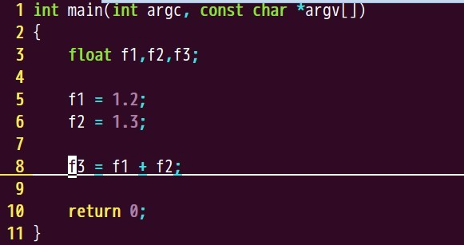
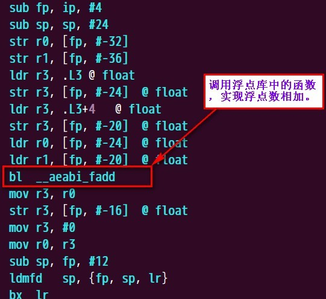

--

-W{all,xxx}

可以这样来加选项。


当您调用 GCC 时，它通常会进行预处理、编译、汇编和链接。

 “总体选项”允许您在中间阶段停止此过程。

例如， -c 选项表示不运行链接器。然后输出由汇编器输出的目标文件组成。请参阅控制输出类型的选项。

其他选项被传递到一个或多个处理阶段。

一些选项控制预处理器，另一些选项控制编译器本身。

还有其他选项控制汇编器和链接器；

其中大部分都没有在这里记录，因为您很少需要使用它们中的任何一个。

许多选项的名称很长，以“ -f ”或“ -W ”开头，

例如， -fmove-loop-invariants 、 -Wformat 等。

其中大多数都有积极和消极的形式； -ffoo 的否定形式是 -fno-foo 。本手册仅记录这两种形式中的一种，以非默认形式为准。

# 简介

GCC（GNU Compiler Collection）是一套由GNU项目开发的编程语言编译器集合。它最初由理查德·斯托曼（Richard Stallman）创建，旨在提供免费的编译器工具，以支持自由软件开发。GCC支持多种编程语言，包括C、C++、Objective-C、Fortran、Ada和Go等。

GCC提供了广泛的编译器功能，包括优化器、代码生成器、调试支持等。它是跨平台的，可以在各种操作系统上运行，包括Linux、macOS、Windows等。由于其开放源代码的特性，GCC也经常被用于嵌入式系统和其他定制编译需求的场景中。

GCC的架构模块化，易于扩展和定制，这使得它成为了许多其他编译器的基础，包括LLVM编译器基础设施。GCC被广泛应用于各种项目中，从个人项目到大型开源项目，如Linux内核等。

总的来说，GCC作为一款免费、开源、功能强大且经过广泛验证的编译器集合，在软件开发领域扮演着非常重要的角色。

# 发展历史

GCC的发展历史可以追溯到1980年代初，它起源于GNU项目，由理查德·斯托曼（Richard Stallman）等人开发。以下是GCC的主要发展阶段和里程碑：

1. **1987年：** GCC 1.0发布。这是第一个公开发布的版本，支持C语言。

2. **1988年：** GCC 1.2发布，添加了对C++的支持。这是GCC首次支持多种编程语言之一。

3. **1991年：** GCC 2.0发布，添加了对Objective-C的支持，并改进了C++支持。

4. **1997年：** GCC 2.95发布，这是一个里程碑，为后续版本奠定了基础。它引入了许多重要的优化和特性，成为当时最稳定和最广泛使用的版本之一。

5. **2003年：** GCC 3.3发布，引入了新的优化器，并对C++标准的支持进行了改进。

6. **2005年：** GCC 4.0发布，带来了全面的C99支持、大规模的重构和改进，以及新的优化器架构（称为SSA）。

7. **2008年：** GCC 4.3发布，引入了对C++0x的初步支持，并改进了性能和稳定性。

8. **2012年：** GCC 4.7发布，带来了对C++11标准的完整支持，并引入了更多的优化和特性。

9. **2015年：** GCC 5.1发布，增强了对C++14的支持，并引入了对C11的完整支持。

10. **2017年：** GCC 7.1发布，引入了对C++17标准的支持，以及一系列性能改进和新特性。

11. **2019年：** GCC 9.1发布，引入了对C++20的初步支持，并进一步提升了性能和稳定性。

12. **2020年：** GCC 10.1发布，进一步改进了对C++20的支持，增强了优化和调试功能。

13. **2021年：** GCC 11.1发布，继续改进和优化编译器，并扩展了对新的C++标准的支持。

随着时间的推移，GCC持续发展，不断改进其性能、功能和支持的编程语言版本，成为了软件开发领域中不可或缺的编译器工具之一。

# 基本用法

GCC的基本用法是通过命令行进行编译，以下是一些常见的用法示例：

1. **编译C程序：**
   ```
   gcc -o output_file source_file.c
   ```
   这条命令将会编译名为`source_file.c`的C源代码文件，并生成可执行文件`output_file`。

2. **编译C++程序：**
   ```
   g++ -o output_file source_file.cpp
   ```
   这条命令编译名为`source_file.cpp`的C++源代码文件，并生成可执行文件`output_file`。

3. **指定编译器优化级别：**
   ```
   gcc -o output_file -O3 source_file.c
   ```
   这里的`-O3`选项表示使用最高级别的优化进行编译。可以使用`-O0`到`-O3`之间的数字来指定不同级别的优化，或者使用`-Os`来进行大小优化。

4. **生成调试信息：**
   ```
   gcc -o output_file -g source_file.c
   ```
   使用`-g`选项可以生成调试信息，便于在调试器中进行调试。

5. **链接外部库：**
   ```
   gcc -o output_file source_file.c -lm
   ```
   这条命令将链接数学库`libm`，使用`-lm`选项。

6. **指定编译器输出警告级别：**
   ```
   gcc -o output_file -Wall source_file.c
   ```
   使用`-Wall`选项可以显示所有警告信息。

7. **编译多个源文件：**
   ```
   gcc -o output_file source_file1.c source_file2.c
   ```
   这条命令将会编译名为`source_file1.c`和`source_file2.c`的源代码文件，并生成可执行文件`output_file`。

这些是一些基本的用法示例，GCC还有很多其他选项和功能，可以根据具体需求进行调整和使用。

# 选项分类和记忆

对于GCC的选项，可以按照它们的功能进行分类和记忆。以下是一些常见的选项分类：

1. **编译选项（Compiling Options）：**
   这些选项控制编译器的行为，例如指定输出文件名、设置优化级别、生成调试信息等。
   - `-o output_file`: 指定输出文件名。
   - `-O[level]`: 设置优化级别，`-O0`到`-O3`之间。
   - `-g`: 生成调试信息。

2. **警告选项（Warning Options）：**
   这些选项控制编译器生成警告的行为。
   - `-Wall`: 显示所有警告信息。
   - `-Werror`: 将警告视为错误。

3. **链接选项（Linking Options）：**
   这些选项用于指定链接器的行为，例如链接外部库等。
   - `-l library_name`: 指定要链接的库。
   - `-L directory`: 指定库文件的搜索路径。

4. **预处理选项（Preprocessing Options）：**
   这些选项用于控制预处理器的行为，例如定义宏、指定包含文件路径等。
   - `-Dmacro`: 定义宏。
   - `-I directory`: 指定包含文件的搜索路径。

5. **目标选项（Target Options）：**
   这些选项用于指定编译目标的体系结构和操作系统。
   - `-march=arch`: 指定目标处理器架构。
   - `-mcpu=cpu`: 指定目标处理器型号。

6. **调试选项（Debugging Options）：**
   这些选项用于控制调试信息的生成和调试器的行为。
   - `-ggdb`: 生成适用于GDB调试器的调试信息。

7. **优化选项（Optimization Options）：**
   这些选项用于控制编译器的优化行为。
   - `-Os`: 进行大小优化。
   - `-funroll-loops`: 循环展开优化。

8. **其他选项（Other Options）：**
   这些选项包括一些其他的功能和杂项选项。
   - `-v`: 显示编译器执行的详细信息。
   - `-help`: 显示帮助信息。

通过将选项按照功能分类，可以更容易地记忆和理解它们的作用。可以根据具体的编译需求选择相应的选项组合。

# gcc命令help信息查看

就把gcc当成一个普通的命令，从这个角度来学习它的用法。

gcc --help

```
gcc -print-search-dirs 
	这个是查看搜索了哪些路径。
	输出：
	hanliang.xiong@walle01-sz:~$ gcc -print-search-dirs 
install: /usr/lib/gcc/x86_64-linux-gnu/9/
programs: =/usr/lib/gcc/x86_64-linux-gnu/9/:

 gcc -print-libgcc-file-name
 	输出：
	/usr/lib/gcc/x86_64-linux-gnu/9/libgcc.a
```


有这3个选项：

```
  -Wa,<options>            Pass comma-separated <options> on to the assembler.
  -Wp,<options>            Pass comma-separated <options> on to the preprocessor.
  -Wl,<options>            Pass comma-separated <options> on to the linker.
```

还可以这样：

```
  -Xassembler <arg>        Pass <arg> on to the assembler.
  -Xpreprocessor <arg>     Pass <arg> on to the preprocessor.
  -Xlinker <arg>           Pass <arg> on to the linker.
```

这4个基本选项：

```
  -E                       Preprocess only; do not compile, assemble or link.
  -S                       Compile only; do not assemble or link.
  -c                       Compile and assemble, but do not link.
  -o <file>                Place the output into <file>.
```

-pie作用是这个：

```
-pie                     Create a dynamically linked position independent
                           executable.
```

创建动态库

```
-shared                  Create a shared library.
```


https://blog.csdn.net/Decisiveness/article/details/44303489

## gcc --help=common

help信息分为这些类：

optimizers, target, warnings, undocumented, params.

这个的选项非常多。

选一些说明一下。

| 选项                            | 说明                        |
| ------------------------------- | --------------------------- |
| -O                              | 后面跟数字，说明优化等级，  |
| -Ofast                          | 为速度优化                  |
| -Og                             | 为调试优化                  |
| -Os                             | 为size优化                  |
| -Waggregate-return              | 返回结构体，union时进行警告 |
| -Waggressive-loop-optimizations |                             |
| -Wdeprecated                    |                             |
| -Werror                         |                             |
| -Wfatal-errors                  |                             |
| -Wextra                         |                             |
| -Winline                        |                             |
| -Wreturn-local-addr             |                             |
| -Wstrict-aliasing               |                             |
| -Wswitch-unreachable            |                             |
| -Wuninitialized                 |                             |
| -Wunused                        |                             |
| -fPIC                           |                             |
| -fPIE                           |                             |
| -fabi-version=                  |                             |
| -fpic                           |                             |
| -fpie                           |                             |
| -fplt                           |                             |
| -fstack-check                   |                             |
| -g                              |                             |
|                                 |                             |
|                                 |                             |
|                                 |                             |


```

```


# PIC

PIC是Position Independent Code。位置无关代码。

编译Linux共享库的时候，为什么要加PIC选项。

写如下的测试代码：

```
void func()
{

}
int test()
{
    func();
    return 0;
}
```

编译：

```
all:
	gcc -o fpic-no-pic.s -S test.c
	gcc -fpic -o  fpic.s -S test.c
```

对比2个汇编文件。

可以看到只有一行不同：


pic版本的，是通过PLT（Procedure Linkage Table）来调用函数。

加上pic的，效率会高一些。


# 强符号和弱符号

对于链接器来说，所有的全局符号可分为两种：

强符号（Strong symbols），弱符号（Weak symbols）。

**gcc**的attribute中有个`__attribute__((weak))`，就是用来声明这个符号是弱符号的。


一般来说，函数和已初始化的变量是强符号，而未初始化的变量是弱符号。

对于它们，下列三条规则适用：

1. 同名的强符号只能有一个。

2. 有一个强符号和多个同名的弱符号是可以的，但定义会选择强符号的。

3. **有多个弱符号时，链接器可以选择其中任意一个。**

这三条规则看起来很好理解，其实不然，尤其是当这些弱符号类型和强符号不同时！表面上看起来正确的程序会导致严重的错误！考虑下面这个[csapp中](http://www.cs.cmu.edu/afs/cs.cmu.edu/academic/class/15213-f06/www/lectures/class13.pdf)的例子：

===a.c===
int x=7;
int y=5;
p1() {}

===b.c===
double x;
p2() {}

我们把它们一起编译，并且在p2()函数中给x赋值，你会发现，y也改变了（因为double占用了8个字节，而y紧挨着x）！ 虽然x被看作是double，但其定义会取a.c中的int x，也就是说，在b.c中会把a.c中的int x当double来用！这当然是错误！之所以会这样，就是因为上面的规则2。避免这种错误的一个方法是，给**gcc**加上-**fno-common**选项。

# -fmessage-length=0

默认情况下，GNU工具链编译过程中，控制台输出的一行信息是不换行的，这样，当输出信息过长时(如编译错误时的信息)，会导致你无法看到完整的输出信息，加入-fmessage-length=0后，输出信息会根据控制台的宽度自动换行，这样就能看全输出信息了。


# -fno-exceptions

-fno-rtti 禁用运行时类型信息
-fno-exceptions 禁用异常机制

一般只有对程序运行效率及资源占用比较看重的场合才会使用, 如果要做这两个的话最好连libstdc++和其他所有的的c++库都用这两个参数重新编译一遍, 否则光是你自己的程序禁用了这两个特性, 而别的库依然开着, 效果就大打折扣了


# -ffunction-sections -fdata-sections

有时我们的程序会定义一些暂时使用不上的功能和函数，

虽然我们不使用这些功能和函数，

但它们往往会浪费我们的ROM和RAM的空间。

这在使用静态库时，体现的更为严重。

有时，我们只使用了静态库仅有的几个功能，

但是系统默认会自动把整个静态库全部链接到可执行程序中，

造成可执行程序的大小大大增加。


为了解决前面分析的问题，我们引入了标题中的几个参数。

**GCC链接操作是以section作为最小的处理单元**，

只要一个section中的某个符号被引用，该section就会被加入到可执行程序中去。

因此，GCC在编译时可以使用 -ffunction-sections和 -fdata-sections 将每个函数或符号创建为一个sections，

其中每个sections名与function或data名保持一致。

**而在链接阶段， -Wl,–gc-sections 指示链接器去掉不用的section**

（其中-wl, 表示后面的参数 -gc-sections 传递给链接器），

这样就能减少最终的可执行程序的大小了。


# -fomit-frame-pointer

可以看到不加-fomit-frame-pointer选项编译出来的代码少了一些，

最主要的区别是少了栈帧的切换和栈地址的保存，

栈是从高地址向低地址扩展，

而堆是从低地址向高地址扩展。

在x86体系结构中，栈顶寄存器是esp，栈底寄存器位ebp，esp的值要小于ebp的值。

函数调用时先将函数返回值、传入参数依次压入栈中，CPU访问时采用0x8(%esp)方式访问传入的参数，使用-fomit-frame-pointer会由于没有保存栈调用地址，而导致无法追踪函数调用顺序，我想gcc，vs等编译器记录函数调用顺序都是采用这种方式吧。


```
-Wall 打开所有警告
-Wextra 打印额外的信息
-w 小写，表示关闭所有警告信息。
-Wshadow 这个表示当一个局部变量覆盖另外一个局部变量或者全局变量时，给出警告。-Wall并没有打开这个。
-Wpointer-arith 当对void *指针进行数学运算时给出警告。-Wall没有打开这个。
-Wcast-qual 当强制类型转化丢掉了类型修饰符的时候，给出警告。-Wall没有打开这个。
-Waggregate-return 返回结构体的时候，给出警告。
-Winline 如果你的函数不能内联，给出警告。
-Wunreachable-code 如果代码里有永远执行不到的代码，给出警告。
-Wundef 当一个没有定义的符号出现在#if 里的时候，给出警告。
```

标准：

```
-ansi
-std=c89
-std=c99
-std=c++98
-std=gnu9x

```

# gcc和ld 中的参数 --whole-archive 和 --no-whole-archive

首先 **--whole-archive** 和 **--no-whole-archive** 是**ld**专有的命令行参数，**gcc** 并不认识，要通gcc传递到 ld，需要在他们前面加**-Wl**，字串。

--whole-archive 可以把 在其后面出现的静态库包含的函数和变量输出到动态库，--no-whole-archive 则关掉这个特性。

比如你要**把 liba.a libb.a libc.a 输出到 libabc.dll(或libabc.so)**时应该这么写：

libabc.dll:liba.c libb.a libc.a

​    gcc -shared -o $@ -L. -Wl,--whole-archive -la -lb -lc -Wl,--no-whole-archive

https://blog.csdn.net/weixin_30699235/article/details/97744931

# ld的选项

要查看ld的选项，要：

```
ld --help
```

```
--as-needed 
	Only set DT_NEEDED for following dynamic libs if used
```

# -march=xx

This specifies the name of the target ARM architecture. GCC uses this name to determine what kind of instructions it can emit when generating assembly code. This option can be used in conjunction with or instead of the -mcpu= option.

这个指定了生成的汇编代码所使用的指令集。

==可以跟-mcpu=这个选项一起使用，也可以替代-mcpu=选项。==

可能的取值有：

```
‘armv4t’, ‘armv5t’, ‘armv5te’, ‘armv6’, ‘armv6j’, ‘armv6k’, ‘armv6kz’, ‘armv6t2’, ‘armv6z’, ‘armv6zk’, ‘armv7’, ‘armv7-a’, ‘armv7ve’, ‘armv8-a’, ‘armv8.1-a’, ‘armv8.2-a’, ‘armv8.3-a’, ‘armv8.4-a’, ‘armv8.5-a’, ‘armv8.6-a’, ‘armv9-a’, ‘armv7-r’, ‘armv8-r’, ‘armv6-m’, ‘armv6s-m’, ‘armv7-m’, ‘armv7e-m’, ‘armv8-m.base’, ‘armv8-m.main’, ‘armv8.1-m.main’, ‘armv9-a’, ‘iwmmxt’ and ‘iwmmxt2’.
```

==大多数的架构都支持extension。==

==所以可以在架构名字后面加上+xx的extension==

==这些extension按照顺序解析，可以加上多个extension。==

一个extension会自动把自己依赖的基础extension使能。

例如+crypto会自动使能+simd这个。

要禁用某个特性，则使用+noxx这样。

```
-march=armv7-a+simd+nofp+vfpv4
等价于
-march=armv7-a+vfpv4

因为
simd会被nofp关闭掉。
```

这个有个表格来列举各个架构支持的extension。

如果没有列出来的，那就是不支持的。

## vfp


### 浮点计算的分类

(1)硬浮点(hard-float)

编译器将代码直接编译成**硬件浮点协处理器**(浮点运算单元FPU)能识别的指令，

这些指令在执行的时候**ARM核直接把它转给协处理器执行**。

**FPU 通常有一套额外的寄存器来完成浮点参数传递和运算。**

使用实际的硬件浮点运算单元(FPU)会带来性能的提升。

(2)软浮点(soft-float)

编译器把浮点运算转成浮点运算的函数调用和库函数调用，

**没有FPU的指令调用，也没有浮点寄存器的参数传递。**

浮点参数的传递也是通过ARM寄存器或者堆栈完成。

现在的Linux系统默认编译选择使用hard-float,

如果系统没有任何浮点处理器单元，这就会产生非法指令和异常。

**因而一般的系统镜像都采用软浮点以兼容没有VFP的处理器。**


用一句话总结，软浮点是通过浮点库去实现浮点运算的，效率低；硬浮点是通过浮点运算单元(FPU)来完成的，效率高。

### 软浮点的举例

一、使用浮点库实现浮点运算(soft-float)

例如:我想实现两个浮点数相加，代码如下:



使用GNU ARM编译器翻译成的部分汇编代码如下:



从图中我们可以知道，默认情况下，编译器使用的是软浮点，

图中`__aeabi_fadd`这个函数是在浮点库中实现。

如果想让代码能正常的运行，还需要在连接的时候静态连接一下浮点库。

### 硬浮点使用举例

使用硬件浮点实现浮点运算(hard-float)

使用硬件浮点的时候，**我们需要给编译器传递一些参数**，让编译器编译出硬件浮点单元处理器能识别的指令。

(1)-mfpu=name

参数-mfpu就是用来指定要产生那种硬件浮点运算指令,常用的右vfp和neon等。

浮点协处理器指令:

ARM10 and ARM9:
    -mfpu=vfp(or vfpv1 or vfpv2)
    Cortex-A8:
    -mfpu=neon

(2) -mfloat-abi=value

-mfloat-abi=soft 使用这个参数时，其将调用软浮点库(softfloat lib)来支持对浮点的运算，GCC编译器已经有这个库了，一般在libgcc里面。这时根本不会使用任何浮点指令，而是采用常用的指令来模拟浮点运算。但使用的ARM芯片不支持硬浮点时，可以考虑使用这个参数。在使用这个参数时，连接时一般会出现下面的提示：

undefined reference to `__aeabi_fdiv'

或者类似的提示，主要因为一般情况下连接器没有去主动寻找软浮点库，这时使用将libgcc库加入即可。

-mfloat-abi=softfp

-mfloat-abi=hard

这两个参数都用来产生硬浮点指令，至于产生哪里类型的硬浮点指令，需要由

-mfpu=xxx参数来指令。这两个参数不同的地方是：

-mfloat-abi=softfp生成的代码采用兼容软浮点调用接口(即使用-mfloat-abi=soft时的调用接口)，这样带来的好处是：兼容性和灵活性。库可以采用-mfloat-abi=soft编译，而关键的应用程序可以采用-mfloat-abi=softfp来编译。特别是在库由第三方发布的情况下。

-mfloat-abi=hard生成的代码采用硬浮点(FPU)调用接口。这样要求所有库和应用程序必须采用这同一个参数来编译，否则连接时会出现接口不兼容错误。


VFP--ARM浮点体系结构机介绍【转】

https://www.cnblogs.com/sky-heaven/p/13391788.html

ARM 浮点运算，软浮点，硬浮点

https://blog.csdn.net/boyemachao/article/details/104018363


## 参考资料

1、

https://gcc.gnu.org/onlinedocs/gcc/ARM-Options.html


# neon和fpu是什么关系

Neon是适用于ARM Cortex-A系列处理器的一种128位SIMD(Single Instruction, Multiple Data,单指令、多数据)扩展结构。

NEON 可增强许多多媒体用户体验：


[浮点运算器](https://link.zhihu.com/?target=https%3A//baike.baidu.com/item/%E6%B5%AE%E7%82%B9%E8%BF%90%E7%AE%97%E5%99%A8)（英文：floating point unit，简称FPU）是计算机系统的一部分，它是专门用来进行浮点数运算的。典型的运算有加减乘除和开方。一些系统（尤其是比较老的，基于[微代码](https://link.zhihu.com/?target=https%3A//baike.baidu.com/item/%E5%BE%AE%E4%BB%A3%E7%A0%81)体系的）还可以计算超越函数，例如指数函数或者三角函数，

尽管对大多数现在的处理器，这些功能都由软件的函数库完成。


浮点数运算常常是用特别的总线传输的。在早期的没有[中断机制](https://link.zhihu.com/?target=https%3A//baike.baidu.com/item/%E4%B8%AD%E6%96%AD%E6%9C%BA%E5%88%B6)的大尺度架构（的处理器）中，[浮点运算](https://link.zhihu.com/?target=https%3A//baike.baidu.com/item/%E6%B5%AE%E7%82%B9%E8%BF%90%E7%AE%97)有时与整数运算独立传输。今时今日，许多CPU或架构都有超过一个[浮点运算器](https://link.zhihu.com/?target=https%3A//baike.baidu.com/item/%E6%B5%AE%E7%82%B9%E8%BF%90%E7%AE%97%E5%99%A8)，例如PowerPC 970 和基于Netburst和AMD64架构的处理器（分别例如奔腾（Pentium）4和[速龙](https://link.zhihu.com/?target=https%3A//baike.baidu.com/item/%E9%80%9F%E9%BE%99)（Athlon）64）


# -mtune=name

For some ARM implementations better performance can be obtained by using this option. 

可能带来一些性能提升。

Additionally, this option can specify that GCC should tune the performance of the code for a big.LITTLE system. Permissible names are: ‘cortex-a15.cortex-a7’, ‘cortex-a17.cortex-a7’, ‘cortex-a57.cortex-a53’, ‘cortex-a72.cortex-a53’, ‘cortex-a72.cortex-a35’, ‘cortex-a73.cortex-a53’, ‘cortex-a75.cortex-a55’, ‘cortex-a76.cortex-a55’.

华为麒麟980 2大(高频*A76*) 2中(中频*A76*)4小(*A55*魔改) 

就是A76做大核，A55做小核。

https://zhuanlan.zhihu.com/p/56294793

# gcc代码架构

GCC的代码架构非常庞大且复杂，主要分为几个关键部分：

1. **前端（Frontend）：** 前端负责语言的特定处理，例如针对C、C++、Fortran等语言的语法解析、语义分析等。每种语言都有自己的前端模块，负责将特定语言的源代码转换成中间表示形式（Intermediate Representation，IR）。

2. **中间层（Middle-end）：** 这一部分是语言无关的，负责对前端生成的中间表示进行优化。它执行各种优化技术，例如常量折叠、循环优化、内联等，以提高生成代码的质量和性能。

3. **后端（Backend）：** 后端负责将经过优化的中间表示翻译成特定目标架构的汇编代码。每个后端对应一个特定的硬件架构或操作系统，负责生成针对该架构的优化代码。

4. **通用库和工具：** 除了编译器核心外，GCC还包括一些通用库和工具，用于处理目标文件、链接器、调试器等。

GCC的架构允许它支持多种语言和多种目标架构。它的模块化设计使得可以独立地扩展语言支持或优化技术，同时保持了整体的一致性。这种结构也使得GCC在不同平台上适应性强，能够为多种硬件和操作系统生成高质量的代码。

# gcc选项很多，怎样进行分类理解和记忆？

理解和记忆GCC的选项可以采取一些分类和组织的方法，以便更容易地掌握和应用这些选项：

1. **功能性分类：** 将选项按照功能或用途进行分类，例如：
   - **优化选项：** 包括控制代码生成、优化级别、调试信息等。
   - **警告选项：** 控制编译器发出的警告信息。
   - **目标平台选项：** 用于指定目标硬件或操作系统。
   - **语言特性选项：** 针对不同语言的特定选项，如C、C++、Fortran等。
   - **调试和输出选项：** 控制调试信息、输出格式等。

2. **命令行参数长度和缩写：** 有些选项有长格式和缩写格式，理解这些缩写可以帮助快速记忆和使用。例如，`-O`表示优化选项，`-W`表示警告选项等。

3. **文档和参考手册：** GCC有详细的文档和参考手册，其中包含了对每个选项的详细说明和示例。熟悉文档能够帮助更系统地理解和记忆选项。

4. **实践和尝试：** 通过实际编译和调试代码来熟悉常用选项。逐渐积累经验可以帮助记忆并理解哪些选项适用于特定的情况。

5. **记忆技巧：** 可以尝试将一些常用的选项和其功能进行记忆和归类。例如，`-Wall`表示开启所有警告，`-O2`表示中等级别的优化，`-march=`用于指定目标架构等。

综合利用以上方法，逐渐积累对GCC选项的了解和熟悉度，能够更高效地使用和记忆这些选项。

# gcc主要有哪些版本，改动的细节有哪些？

GCC有很多不同的版本，每个版本都带来了一些改进和变化。以下是一些主要版本的简要概述：

1. **GCC 2.x系列：** 这是早期版本，从2.0到2.9，开发于1990年代初期。这些版本改进了编译器的功能和稳定性，逐步扩展了对C++的支持，并增加了新的优化技术。

2. **GCC 3.x系列：** 这个系列的版本带来了许多重大改进，包括更好的C++支持、更多的优化、更丰富的警告信息和更好的标准符合性。GCC 3.4版本引入了新的优化框架，并引入了SSA（Static Single Assignment）形式的中间表示。

3. **GCC 4.x系列：** 这个系列在性能、标准符合性和功能方面有了大幅改进。GCC 4.0版本增加了对Fortran 95的支持，并提供了新的优化选项。GCC 4.5版本引入了Link-Time Optimization（LTO）功能，允许在链接阶段进行更全局的优化。

4. **GCC 5.x系列：** 这个系列的版本继续改进了C++11和C++14标准的支持，增加了新的警告、优化和安全性功能。GCC 5.1版本开始默认启用C++11支持。

5. **GCC 6.x系列：** 这个系列继续改进了对C++17标准的支持，并引入了一些新的优化和警告。GCC 6.1版本默认启用C++14支持。

6. **GCC 7.x系列：** GCC 7版本增加了对C++17标准的支持，并引入了更多的优化。它还改进了对新硬件和指令集的支持。

7. **GCC 8.x系列：** 这个系列的版本继续改进了对C++17标准的支持，并引入了一些新的优化和警告。GCC 8.1版本开始默认启用C++17支持。

8. **GCC 9.x系列：** GCC 9版本带来了对C++2a标准的初步支持，并引入了一些新的优化和功能。它还改进了诊断信息和性能。

9. **GCC 10.x系列：** 这个系列的版本进一步改进了对C++20标准的支持，并带来了更多的优化和警告功能。GCC 10.1版本开始默认启用C++17支持。

10. **GCC 11.x系列：** 这个系列的版本继续完善对C++20标准的支持，并引入了更多的优化、警告和安全性改进。

每个版本都有详细的发布说明，其中包含了具体的改动和修复列表。针对特定版本的详细信息，可以查阅相应版本的官方发布说明文档。

# gcc有多少维护者？核心开发者是谁？

GCC项目由一个大型的开发者社区维护，这个社区包括了来自全球范围的贡献者和维护者。虽然没有固定的核心开发者名单，但有一些长期致力于GCC项目并对其发展做出巨大贡献的人士。

其中一些著名的核心贡献者和维护者包括：

1. **Richard Stallman（理查德·斯托曼）：** 作为GNU项目的创建者和GCC的初始开发者之一，他对GNU编译器集的发展有着深远的影响。然而，他在2019年宣布辞去GNU项目的领导职务。

2. **Diego Novillo：** 作为GCC项目的重要贡献者之一，他在优化、中间表示和代码生成方面做出了重要贡献。

3. **Jeff Law：** 他是GCC项目的另一位重要贡献者，在编译器优化、代码生成等方面有着丰富的经验。

4. **Jakub Jelinek：** 作为GCC的贡献者和维护者，他在代码优化、诊断信息等方面有着广泛的贡献。

5. **Martin Sebor：** 他在GCC项目中负责C和C++标准库的维护和改进。

这些人都是GCC项目的长期贡献者，在其领域内有着丰富的经验和专业知识，并在项目的不同方面做出了重要的贡献。GCC的开发是一个开放的社区项目，许多人通过提交补丁、报告问题和参与讨论来共同推动GCC的发展和改进。

# libgcc.a 里有哪些符号

`libgcc.a` 是GCC的运行时库之一，其中包含了一系列用于支持编译后程序运行所需的函数和符号。这些符号通常用于处理一些与语言无关但在程序运行时可能需要的功能，例如异常处理、整数溢出检查、浮点运算支持等。

具体包含的符号可能因不同的GCC版本而有所不同，但通常会包含以下一些常见的类型：

1. **异常处理：** 包括用于C++异常处理的相关函数，如`__gxx_personality_v0`等。

2. **整数操作：** 包括处理整数溢出、除法操作等的函数，例如`__muldi3`、`__divdi3`等。

3. **浮点运算支持：** 包括浮点数的基本运算、转换等功能的函数，如`__addsf3`、`__divdf3`等。

4. **辅助功能：** 还包括一些辅助性质的函数，用于支持编译后程序的正常运行，如`__register_frame_info`等。

这些函数和符号的具体列表可以通过查看`libgcc.a`文件中的符号表或者使用`nm`命令来获取。每个函数都有特定的用途，它们构成了编译后程序在运行时所需的基本支持。


# -Wl,--build-id=none

`-Wl,--build-id=none` 是GCC编译器的一个选项，用于控制链接器（ld）的行为。

这个选项主要用于在生成可执行文件时==禁用构建标识（build ID）。==

构建标识是一个用于唯一标识二进制文件的标识符，

通常基于文件内容或其他唯一性的信息。

==构建标识的存在有助于在调试和跟踪问题时追踪二进制文件的来源。==

使用`-Wl,--build-id=none`选项，您告诉链接器不生成构建标识。

这在某些情况下可能有用，

==例如当您希望生成的二进制文件在每次构建时都具有相同的内容，而不受构建标识的影响。==

请注意，禁用构建标识可能会影响某些调试和性能分析工具的功能，因为它们可能依赖于构建标识来识别和跟踪二进制文件。因此，在使用这个选项时，需要权衡是否需要构建标识的唯一性和对调试工具的需求。

# -ffile-prefix-map=$(BASE_DIR)=buildroot

`-ffile-prefix-map` 是GCC编译器的一个选项，

用于指定源文件路径到目标文件路径的映射规则。

在你提供的例子中，使用了变量 `$(BASE_DIR)`，它的值被映射到 `buildroot`。

具体来说，这个选项的语法是 `-ffile-prefix-map=old=new`，

其中 `old` 表示源文件路径的前缀，`new` 表示对应的目标文件路径的前缀。

在你的例子中，`$(BASE_DIR)` 是一个变量，它的值将被替换为实际的基础目录。

这样的映射规则在编译过程中经常用于改变输出的目录结构，

例如将源代码的绝对路径映射为相对路径，或者将源代码从一个目录结构映射到另一个目录结构。

在你的例子中，它的效果可能是将源文件的路径中以 `$(BASE_DIR)` 开头的部分替换为 `buildroot`。这种操作对于构建系统和代码管理工具中需要使用相对路径的情况可能很有用。

# `-D__FILE__=\"\" -D__BASE_FILE__=\"\" -Wno-builtin-macro-redefined`

在你提供的GCC编译器选项中：

1. `-D__FILE__=\"\"` 和 `-D__BASE_FILE__=\"\"` 是用于定义预处理器宏的选项。这两个宏通常用于标识当前源文件的名称。通过将它们定义为空字符串，实际上是禁用了它们的默认定义。这可能是为了在代码中自定义这两个宏的值，而不使用编译器默认提供的源文件路径。

2. `-Wno-builtin-macro-redefined` 是用于抑制编译器警告的选项。编译器通常会发出警告，如果用户尝试重新定义一些内建的宏，而这个选项的作用就是禁止对于这类宏的重新定义的警告。在这个特定的情况下，可能是为了避免 `-D__FILE__=\"\"` 和 `-D__BASE_FILE__=\"\"` 导致的预处理器宏被重新定义的警告。

总体而言，这些选项可能用于一些定制的编译环境中，其中需要对预定义宏进行更细粒度的控制，或者在一些特殊的情况下需要禁止某些警告。

# -mno-fused-madd

`-mno-fused-madd` 是 GCC 编译器的一个选项，用于禁用浮点数乘加（fused multiply-add，FMA）指令的使用。

==FMA 指令是一种特殊的浮点运算指令，==

==能够在一条指令中执行乘法和加法操作，从而提高运算效率。==

使用 `-mno-fused-madd` 选项告诉编译器不要生成使用 FMA 指令的代码，即使目标架构本身支持 FMA 指令。

这个选项在一些情况下可能会被使用，例如：

1. **精度要求：** FMA 指令的使用可能会引入舍入误差，因此在一些需要更严格精度控制的应用中可能会选择禁用 FMA。

2. **调试和可读性：** 有时禁用 FMA 可能会使生成的代码更容易调试，或者更容易阅读。

使用示例：

```bash
gcc -mno-fused-madd -o output_file source_file.c
```

这会告诉 GCC 在编译过程中不使用 FMA 指令。需要注意的是，对于某些目标架构和编译器版本，这个选项可能不适用或不产生任何效果。在特定情况下，可能需要查阅目标架构和编译器的文档以了解详细信息。

# -ffp-contract=off

`-ffp-contract=off` 是 GCC 编译器的一个选项，

用于控制浮点操作的合同（contract）优化。

==浮点合同优化是一种编译器优化，旨在通过重新排列和组合浮点操作来提高性能。==

通过使用 `-ffp-contract=off` 选项，

你告诉编译器禁用浮点操作的合同优化。

合同优化的一个例子是将两个相邻的浮点乘法和加法操作合并为一个 FMA（fused multiply-add）操作，从而提高计算效率。

禁用浮点合同优化可能有一些原因：

1. **精度要求：** 在一些应用中，对浮点数的精度要求可能很高，而浮点合同操作可能引入舍入误差。禁用合同优化可以确保更精确的浮点计算。

2. **调试和可读性：** 禁用合同优化可能使生成的代码更容易调试和阅读，因为它保留了原始的浮点操作顺序。

使用示例：

```bash
gcc -ffp-contract=off -o output_file source_file.c
```

这会告诉 GCC 在编译过程中禁用浮点合同优化。需要注意，对于某些特定的目标架构和编译器版本，该选项可能不适用或者不产生任何效果。在特定情况下，可能需要查阅目标架构和编译器的文档以获取详细信息。

# -Wl,-elf2flt

`-Wl,-elf2flt` 是 GCC 编译器的链接器选项，用于传递附加的参数给链接器。

具体而言，这个选项会将 `-elf2flt` 传递给链接器，影响链接过程中的一些行为。

`-elf2flt` 通常用于嵌入式系统中，特别是针对使用 ELLCC（Embedded Linux Cross-Compiling Toolkit）的情况。

ELLCC 是一个嵌入式 Linux 交叉编译工具包，其中的 `-elf2flt` 选项是与 FLAT（FLexible Asynchronous Transfer）二进制格式相关的。

==FLAT 是一种紧凑的二进制格式，用于嵌入式系统中的可执行文件。==它的设计旨在减小可执行文件的大小，并提高在嵌入式环境中的加载速度。

因此，`-Wl,-elf2flt` 的作用是将这个参数传递给链接器，可能用于指示链接器生成 FLAT 格式的可执行文件。

使用示例：

```bash
gcc -Wl,-elf2flt -o output_file source_file.c
```

这告诉 GCC 将 `-elf2flt` 选项传递给链接器，影响生成的可执行文件的格式。请注意，具体的效果可能依赖于所使用的交叉编译工具链和目标系统。

# `__attribute__((__cleanup__))`

结合 `__attribute__((__cleanup__))` 和 D-Bus 消息处理，可以用来自动释放 D-Bus 消息和连接资源，避免资源泄漏。以下是一个实际的例子，展示如何结合这个特性高效管理资源。

### 示例代码

```c
#include <stdio.h>
#include <stdlib.h>
#include <dbus/dbus.h>

// 清理函数，用于释放 D-Bus 消息
void cleanup_dbus_message(DBusMessage **msg) {
    if (msg && *msg) {
        printf("Cleaning up D-Bus message: %p\n", *msg);
        dbus_message_unref(*msg); // 释放 D-Bus 消息
        *msg = NULL;
    }
}

// 清理函数，用于释放 D-Bus 连接
void cleanup_dbus_connection(DBusConnection **conn) {
    if (conn && *conn) {
        printf("Cleaning up D-Bus connection: %p\n", *conn);
        dbus_connection_unref(*conn); // 释放 D-Bus 连接
        *conn = NULL;
    }
}

int main() {
    DBusError error;
    dbus_error_init(&error);

    // 连接到系统总线
    __attribute__((__cleanup__(cleanup_dbus_connection))) DBusConnection *conn = 
        dbus_bus_get(DBUS_BUS_SYSTEM, &error);

    if (dbus_error_is_set(&error)) {
        fprintf(stderr, "D-Bus connection error: %s\n", error.message);
        dbus_error_free(&error);
        return 1;
    }

    if (!conn) {
        fprintf(stderr, "Failed to connect to D-Bus system bus\n");
        return 1;
    }

    // 创建 D-Bus 方法调用消息
    __attribute__((__cleanup__(cleanup_dbus_message))) DBusMessage *msg = 
        dbus_message_new_method_call(
            "org.freedesktop.DBus",       // 目标服务名
            "/org/freedesktop/DBus",      // 目标对象路径
            "org.freedesktop.DBus.Peer",  // 接口名
            "Ping"                        // 方法名
        );

    if (!msg) {
        fprintf(stderr, "Failed to create D-Bus message\n");
        return 1;
    }

    // 发送消息并等待回复
    __attribute__((__cleanup__(cleanup_dbus_message))) DBusMessage *reply = 
        dbus_connection_send_with_reply_and_block(conn, msg, -1, &error);

    if (dbus_error_is_set(&error)) {
        fprintf(stderr, "D-Bus error: %s\n", error.message);
        dbus_error_free(&error);
        return 1;
    }

    if (reply) {
        printf("D-Bus reply received successfully.\n");
    }

    // 资源清理在作用域结束时自动完成
    return 0;
}
```

### 代码说明

| 资源类型       | 清理方式                                  |
| -------------- | ----------------------------------------- |
| **D-Bus 连接** | 使用 `dbus_connection_unref()` 自动释放。 |
| **D-Bus 消息** | 使用 `dbus_message_unref()` 自动释放。    |
| **错误处理**   | 检查并释放 `DBusError` 中的错误信息。     |

### 特点与优势

1. **简化资源管理**
    使用 `__cleanup__` 属性自动管理 `DBusConnection` 和 `DBusMessage` 的生命周期，无需显式调用清理函数。
2. **减少泄漏风险**
    即使在函数中多次 `return`，资源仍会在作用域结束时自动释放。
3. **清晰易读**
    代码结构更简洁，减少显式释放代码，使主逻辑更易理解。

### 编译与运行

使用 GCC 编译时需要链接 `libdbus-1`：

```bash
gcc -o dbus_cleanup_example dbus_cleanup_example.c $(pkg-config --cflags --libs dbus-1)
```

运行程序后，资源会在作用域结束时自动释放，避免手动管理的复杂性。

# 参考资料

1、编译GNU/Linux共享库, 为什么要用PIC编译?( 转)

https://blog.csdn.net/chenji001/article/details/5691690

2、gcc中no-common的说明

https://blog.csdn.net/cybertan/article/details/5867191

3、gcc编译参数详解一

https://www.bbsmax.com/A/x9J2e3qjz6/

4、gcc编译参数详解概述

https://www.bbsmax.com/A/LPdoqkQGJ3/

5、C性能调优---GCC编译选项-fomit-frame-pointer

https://www.cnblogs.com/islandscape/p/3444122.html

6、GCC 参数

这个表格总结清晰。很好。

https://blog.csdn.net/orzlzro/article/details/6459665

7、MMD MP

https://blog.csdn.net/eydwyz/article/details/90296048