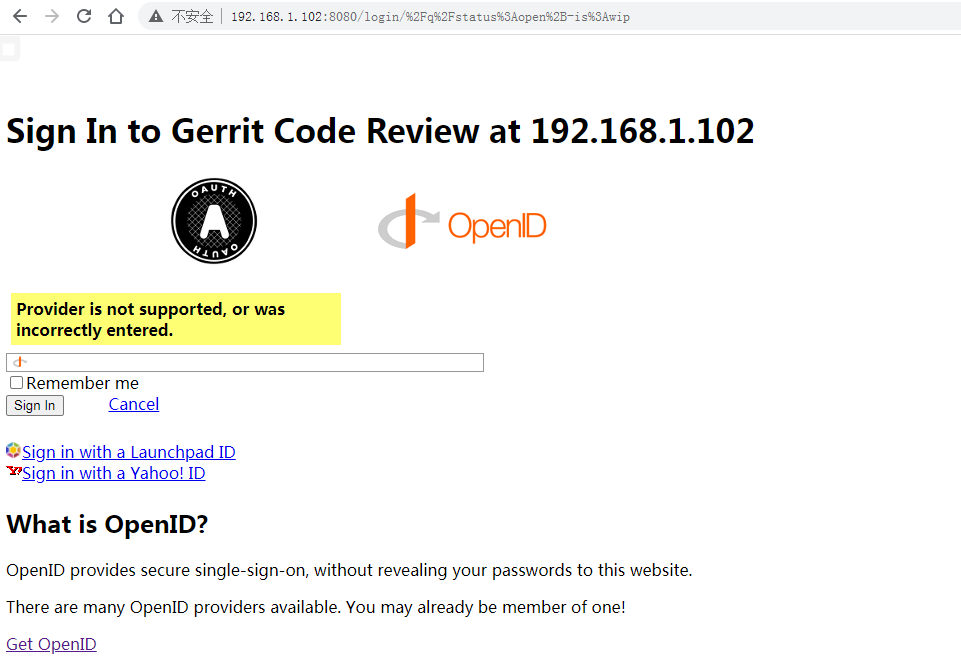

1

# 简介

Gerrit 是一个免费、开放源代码的代码审查软件，使用网页界面。

利用网页浏览器，同一个团队的软件程序员，可以相互审阅彼此修改后的程序代码，

决定是否能够提交，退回或者继续修改。

它使用 Git 作为底层版本控制系统。

它分支自Rietveld，作者为Google公司的Shawn Pearce，原先是为了管理Android计划而产生。

这个软件的名称，来自于荷兰设计师赫里特&middot;里特费尔德（Gerrit Rietveld）。

最早它是由Python写成，在第二版后，改成用Java与SQL。使用Google Web Toolkit来产生前端的JavaScript。

# 搭建

基于docker来快速搭建。

```
docker pull openfrontier/gerrit
```

 创建目录，

```
mkdir ~/gerrit_volume
```

创建此目录是为了把在docker里的gerrit相关程序与数据映射出来，

当程序运行时，增删改了数据能够保存在磁盘上。也便于我进行下一步的目录讲解。

运行镜像

```
docker run -d -v ~/gerrit_volume:/var/gerrit/review_site -p 8080:8080 -p 29418:29418 openfrontier/gerrit
```

然后就可以输入：http://192.168.1.102:8080 这样的地址进行访问了。

很顺利就搭建好了。

接下来，加几个用户，测试一下评审过程。

点击右上角的sign in。跳转到这个界面。

我输入teddyxiong53 这个name，点击sign in，提示不对。



是需要一个合法的openid。

# 配置

这个需要修改一下gerrit的配置。

在~/gerrit_volume/etc目录下，

可以看到29418这个是ssh端口。

修改配置如下~/gerrit_volume/etc/gerrit.config

```
[gerrit]
	basePath = git
	canonicalWebUrl = http://192.168.1.102/ # 这里改成这样。靠nginx做前端。
	serverId = b26bfacc-408c-4084-85e2-010b6857ca27
[container]
	javaOptions = "-Dflogger.backend_factory=com.google.common.flogger.backend.log4j.Log4jBackendFactory#getInstance"
	javaOptions = "-Dflogger.logging_context=com.google.gerrit.server.logging.LoggingContext#getInstance"
	user = gerrit2
	javaHome = /usr/lib/jvm/java-1.8-openjdk/jre
[index]
	type = lucene
[auth]
	type = HTTP # 改成HTTP授权方式。
	gitBasicAuthPolicy = HTTP
[receive]
	enableSignedPush = false
[sendemail]
	smtpServer = smtp.163.com
	enable = false
	smtpServerPort = 465
	smtpUser = teddyxiong53@163.com
	smtpPass = XXX # 这里要改成自己的授权码。
	smtpEncryption = ssl
	sslVerify = false
	from = teddyxiong53@163.com
[sshd]
	listenAddress = *:29418
[httpd]
	listenUrl = http://*:8080/ #这个还是要保持8080
[cache]
	directory = cache
[plugins]
	allowRemoteAdmin = true
[plugin "events-log"]
	storeUrl = jdbc:h2:/var/gerrit/review_site/db/ChangeEvents
[gitweb]
	type = gitweb
	cgi = /usr/share/gitweb/gitweb.cgi
```

然后需要修改nginx的配置。

修改/etc/nginx/sites-enabled/default的内容如下：

```
server {
    listen 80;
    server_name 192.168.1.102;

    location / {
        auth_basic "Welcome to Gerrit Code Review";
        auth_basic_user_file    /etc/nginx/gerrit.passwd;
        proxy_pass              http://127.0.0.1:8080;
        proxy_set_header        X-Forwarded-For $remote_addr;
        proxy_set_header        Host $host;
    }

    location /login/ {
        proxy_pass              http://127.0.0.1:8080;
        proxy_set_header        X-Forwarded-For $remote_addr;
        proxy_set_header        Host $host;
    }
}
```

我们采用http basic授权方式。不是很安全，但是测试够用了。

auth_basic_user_file    /etc/nginx/gerrit.passwd;

这里是指定了授权文件的位置。

我们用htpasswd工具来生成用户和密码。

```
sudo htpasswd -c gerrit.passwd gerrit 
```

根据提示输入密码。

```
teddy@thinkpad:/etc/nginx$ cat gerrit.passwd 
gerrit:$apr1$HaijtdE2$5zLQ/ZbguLeQ.lhD8YR/V1
```

然后重启nginx。

```
sudo nginx -s reload
```

重启docker容器。xx改成容器的id。用docker ps可以查看到容器id。

```
docker restart xx
```

然后访问：http://192.168.1.102，就会弹出窗口，输入用户名gerrit和密码。就可以登陆进去了。

gerrit这个只是测试用的，我们更加正式一点，用一个邮箱来做名字。

看看怎么新增用户。不加-c参数，就是在后面新增。

```
sudo htpasswd  gerrit.passwd 1073167306@qq.com
```

后面发现用邮箱来做登录名还是不妥当的。

因为有需要用户名进行ssh登陆，这样就多了一个@符号。导致了问题。

# 尽量不改动的配置

现在进行一次新的搭建。

使用docker方式。

尽量不要再引入其他的http服务器之类的东西。

尽量减少改动。


# 新建仓库

网上看到，是可以在网页上新建仓库的。

但是我没有看到新建仓库的按钮。

可能是权限问题。

在`Gerrit系统`自带下面的群组

- Anonymous Users
- Change Owner
- Project Owners
- Registered Users


所有用户都是`匿名用户`成员, 所有用户都能继承`Anonymous Users`所有访问权限. 
当前只有`Read access`权限值得赋予给`Anonymous Users`群组, 因为其他权限都需要认证.


## Administrators

`Administrators`是`Gerrit root`角色, 在Gerrit初始化时`Administrate Server`权限被赋予给这个`Predefined Groups`群组. 
在`Administrators`组的成员可以管理所有项目, 但是不意味着任何其他权限. `Administrators`组不会自动获得代码审查批准和提交权限.


gerrit的默认db是什么？

另一个就是gerrit数据库的选择，可以选择默认的H2，无须任何配置即可使用。

就是H2数据库，这个是java写的小型数据库。


# 认证方式

## Openid：

指的是公共账号，

比如你在Google或者Yahoo上建立的账号。

用户通过OpenID认证源的认证后，

gerrit会自动从认证源获取相关属性如用户全名和邮件地址等信息创建账号。

当然，任何人都可以为自己创建一个Google或者Yahoo账号，

因此OpenID模式支持用户自建账号，适用于开源项目，不适用与相对封闭的公司使用。


Gerrit 为 Git引入的代码审核是强制性的，

就是说除非特别的授权设置，

向 Git 版本库的推送（Push）必须要经过 Gerrit服务器，

修订必须>经过代码审核的一套工作流程之后，才可能经批准并纳入正式代码库中…


目前gerrit支持google和yahoo提供的openid. 


## http：

Gerrit可以配置成运行在一个第三方的web server后面，

比如最常用的apache。

用户登录apache时输入用户名和密码，一旦验证成功，系统重定向到gerrit进行后面的操作。


## http_ldap: 

从第三方web server里登录，但是用户名和密码的验证是通过LDAP Server。

这和下面的ldap认证有什么区别呢？

为什么会有人多此一举要从web server登录，

直接在gerrit里做ldap认证不是更方便？

这是因为有些系统会需要这样的架构。

比如说SSO（Single Sign-On），

也就是用户只需要登录验证身份一次就可以访问多个应用程序（包括gerrit），

在apache里可以做SSO，但是gerrit不提供这个功能。


## development_become_any_account: 

故名思意，就是不需要身份认证，每个登录者都是匿名登录，用在gerrit的开发或者演示的时候。


网上讨论最多的是http的方式。

这种方式听上去很好实现，

只要搭个apache server就行了，

而且很多服务器上本身就有apache server在执行其他的网页访问服务，多整合一个gerrit不是很好么？

做为一个在apache反向代理方式上挣扎了两周最后以失败告终的过来人，

我要说这种配置方式其实很复杂，

必须深入了解各个配置参数的含义，

而且http认证方式登录之后很难退出也是众所周知的问题。

如果你已经成功配置好了http的认证方式，

你也不需要再看我这篇搭配ldap server配置的文章了。

## LDAP

下面来看LDAP，

全称Lightweight Directory Access Protocol，

在网络上获取和维护distributed directory information service的协议。

在功能上和关系数据库比较类似，

用于组织和存储任意类型的信息，通常用于集中式地身份认证。

**这里的directory不是操作系统上的目录，而是信息的目录。**

比如，

一个telephone directory就是一个用户名和地址电话的列表，

再比如DNS directory就是域名和对应的IP地址的列表。

Directory在这里的意思更接近于某种类型的数据列表。

该协议提供这样的一个接口模型：

一个entry由一组属性（attribute）组成；

每个attribute都有一个name和若干个value，

所有的attribute都定义在一个schema中；

每个entry都有一个唯一的DN(Distinguished Name)。


https://www.cnblogs.com/zhangshuli-1989/p/4487955.html


https://www.jianshu.com/p/cb6917502957

https://www.cnblogs.com/zhangshuli-1989/p/4487955.html


https://blog.csdn.net/irene_jia/article/details/18727093

# 问题

## push review

git push review HEAD:refs/for/master

一般是用上面这个来推送到review。

上面这一句具体是什么意思？

refs/for/master怎么理解？


refs/for :意义在于我们提交代码到服务器之后是需要经过code review 之后才能进行merge的

refs/heads 不需要


参考资料

https://blog.csdn.net/u010312474/article/details/107915694


# 参考资料

1、Gerrit使用简介

https://www.cnblogs.com/lexuele/p/5133601.html

2、

https://www.oschina.net/p/gerrit

3、

https://www.cnblogs.com/luohanguo/p/9685806.html

4、gerrit-申请id跟本地配置

https://www.cnblogs.com/zhangshuli-1989/p/4487955.html

5、

https://www.dazhuanlan.com/2019/12/10/5deec99ecc2a7/

6、Gerrit服务器搭建

https://www.mywiki.cn/hovercool/index.php/Gerrit%E6%9C%8D%E5%8A%A1%E5%99%A8%E6%90%AD%E5%BB%BA

7、docker运行gerrit(代码审查工具)

这里讲了如何配置管理员

但是是基于ldap授权方式。

https://www.jianshu.com/p/2740a3f9e9ba

8、

https://www.cnblogs.com/jiangzhaowei/p/7874168.html

9、

https://blog.csdn.net/chezhi7768/article/details/100639409

10、

https://blog.csdn.net/irene_jia/article/details/18727093

11、官网教程

https://gerrit-review.googlesource.com/Documentation/config-gerrit.html