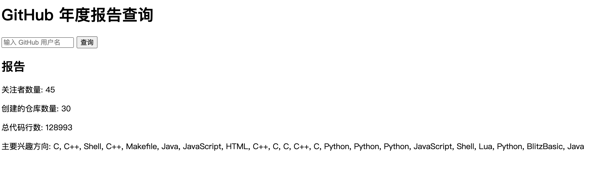

--

有网易云音乐等年度总结，而我每年用的多的应用就是github了。

我希望可以有方式可以来生成这种年度报告。

因为这个需求其实很简单，非常适合用来让ai来进行实现。

顺便用这个来摸索一些知识技能。

先看最简单的实现。

# 后端方式

后端用flask和requests。获取到结果后，渲染生成网页。

app.py

```
from flask import Flask, render_template, request
import requests

app = Flask(__name__)

def get_github_data(username):
    user_url = f"https://api.github.com/users/{username}"
    repos_url = f"https://api.github.com/users/{username}/repos"
    
    user_response = requests.get(user_url)
    repos_response = requests.get(repos_url)

    if user_response.status_code != 200 or repos_response.status_code != 200:
        return None

    user_data = user_response.json()
    repos_data = repos_response.json()

    # 计算活动数据
    num_followers = user_data['followers']
    num_repos = len(repos_data)
    total_lines_of_code = sum(repo['size'] for repo in repos_data)

    return {
        'followers': num_followers,
        'repos': num_repos,
        'lines_of_code': total_lines_of_code,
        'interests': [repo['language'] for repo in repos_data if repo['language']]
    }

@app.route('/', methods=['GET', 'POST'])
def index():
    report = None
    if request.method == 'POST':
        username = request.form['username']
        report = get_github_data(username)
    return render_template('index.html', report=report)

if __name__ == '__main__':
    app.run(debug=True)
```

然后新建templates/index.html

```
<!DOCTYPE html>
<html lang="en">
<head>
    <meta charset="UTF-8">
    <meta name="viewport" content="width=device-width, initial-scale=1.0">
    <title>GitHub 年度报告</title>
</head>
<body>
    <h1>GitHub 年度报告查询</h1>
    <form method="POST">
        <input type="text" name="username" placeholder="输入 GitHub 用户名" required>
        <button type="submit">查询</button>
    </form>
    
        <h2>报告</h2>
        <p>关注者数量: {{ report.followers }}</p>
        <p>创建的仓库数量: {{ report.repos }}</p>
        <p>总代码行数: {{ report.lines_of_code }}</p>
        <p>主要兴趣方向: {{ report.interests | join(', ') }}</p>
    
</body>
</html>
```

运行可以正常得到结果：



# 纯前端方式

这个才是我想要的。

因为这个没有必要搞个服务端。前端完全就可以搞定。

```
<!DOCTYPE html>
<html lang="en">
<head>
    <meta charset="UTF-8">
    <meta name="viewport" content="width=device-width, initial-scale=1.0">
    <title>GitHub 年度报告</title>
    <style>
        body {
            font-family: Arial, sans-serif;
            padding: 20px;
        }
        input, button {
            margin: 10px 0;
        }
    </style>
</head>
<body>
    <h1>GitHub 年度报告查询</h1>
    <input type="text" id="username" placeholder="输入 GitHub 用户名" required>
    <button id="fetchData">查询</button>

    <div id="report"></div>

    <script>
        document.getElementById('fetchData').onclick = async function () {
            const username = document.getElementById('username').value;
            const reportDiv = document.getElementById('report');

            // 清空上次的结果
            reportDiv.innerHTML = '';

            try {
                const userResponse = await fetch(`https://api.github.com/users/${username}`);
                if (!userResponse.ok) throw new Error('用户不存在');

                const userData = await userResponse.json();
                const reposResponse = await fetch(`https://api.github.com/users/${username}/repos`);
                const reposData = await reposResponse.json();

                const numFollowers = userData.followers;
                const numRepos = reposData.length;
                const totalLinesOfCode = reposData.reduce((sum, repo) => sum + repo.size, 0);
                const interests = [...new Set(reposData.map(repo => repo.language).filter(lang => lang))];

                reportDiv.innerHTML = `
                    <h2>报告</h2>
                    <p>关注者数量: ${numFollowers}</p>
                    <p>创建的仓库数量: ${numRepos}</p>
                    <p>总代码行数: ${totalLinesOfCode}</p>
                    <p>主要兴趣方向: ${interests.join(', ')}</p>
                `;
            } catch (error) {
                reportDiv.innerHTML = `<p style="color: red;">错误: ${error.message}</p>`;
            }
        };
    </script>
</body>
</html>
```

这个也可以显示。

# github api分析


