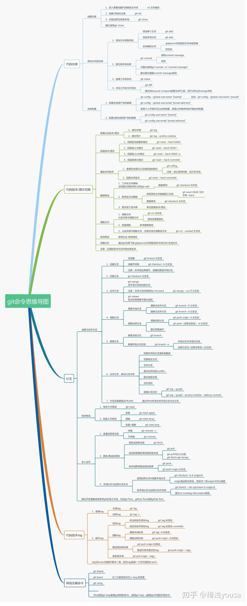

没有系统学习git的使用，有时候会跟github打交道。把碰到的问题及解决记录下来。

# 取指定版本的代码

先把代码clone下来。

然后git log。找到对应版本的sha字符串。

然后git checkout sha字符串就好了。

但是这样就完全回退到指定版本了，怎么再继续到较新的版本呢？现在本地已经看不到更多的log信息了。

我觉得还是要下载多份，一份完全不动。只能用这种方式来做了。

这样查看版本，比较清晰。

```
git log --pretty=oneline
```


## 放弃本地修改，强制更新

```
git reset hard
```

# 查看某个文件的修改历史

```
git log -- xx.c
```

# git remote命令

1、查看远程的仓库情况。列出已经存在的远程分支。

```
git remote
```

后面加上-v，则得到更加详细的信息。


git远程建立仓库。

# git命令思维导图

这里，可以帮助梳理思路。

https://zhuanlan.zhihu.com/p/59616525

我下载放在这里了：




# 全局忽略.vscode目录

因为使用vscode，经常会在目录下产生.vscode目录，在一个个仓库下去加.gitignore就太麻烦了。

可以全局忽略这个目录。

参考这个做就好了。

https://blog.csdn.net/zhangchilei/article/details/105538854

# git am的用法

 git-am - Apply a series of patches from a mailbox

从这个说明就可以看出命令命令的由来。是指通过邮件发送patch的场景。

 因为在git使用当中，会有很多时候别人（供应商或者其他的开发人员）发过来一系列的**patch**，这些patch通常的是类似这样的名字：

```
0001--JFFS2-community-fix-with-not-use-OOB.patch
0002--Community-patch-for-Fix-mount-error-in.patch
```

里面包含了提交的日志，作者，日期等信息。

你想做的是把这些patch引入到你的代码库中，

最好是也可以把日志也引入进来， 方便以后维护用

传统的打patch方式是

```
 patch -p1 < 0001--JFFS2-community-fix-with-not-use-OOB.patch
```

这样来打patch，但是这样会把这些有用的信息丢失。

由于这些**patch显然是用git format-patch来生成的**，

所以用git的工具应该就可以很好的做好。

git-am 就是作这件事情。

在使用git-am之前， 你要首先git am –abort 一次，

来放弃掉以前的am信息，

这样才可以进行一次全新的am。

不然会遇到这样的错误。

```
.git/rebase-apply still exists but mbox given.
```


在解决完冲突以后， 比如用git add来让git知道你已经解决完冲突了。

- 如果你发现这个冲突是无法解决的， 要撤销整个am的东西。 可以运行git am –abort，
- 如果你想只是忽略这一个patch，可以运行git am –skip来跳过这个patch.

# hooks脚本

## 常用的git hook脚本有哪些

Git 提供了一系列的钩子（hooks），它们在 Git 仓库的特定事件发生时触发。这些钩子位于 `.git/hooks` 目录下，通常以.sample结尾，表示它们是示例文件。要启用一个钩子，你需要去掉.sample后缀，并确保它们是可执行的。
以下是一些常用的 Git 钩子：
1. **pre-commit**: 在 `git commit` 执行前触发，可以用来检查代码风格、运行测试、检查日志消息格式等。
2. **post-commit**: 在 `git commit` 执行后触发，通常用于通知或记录提交信息。
3. **pre-push**: 在 `git push` 执行前触发，可以用来检查推送是否满足某些条件，比如是否有足够的测试覆盖率。
4. **post-push**: 在 `git push` 执行后触发，可以用来清理工作副本或通知团队成员。
5. **pre-receive**: 在服务器端接收推送之前触发，可以用来阻止不满足特定条件的推送，比如提交消息格式错误或推送的分支不符合命名规范。
6. **post-receive**: 在服务器端接收推送后触发，可以用来部署应用程序、发送通知邮件等。
7. **update**: 与 `pre-receive` 类似，但在每个更新的引用上触发。它接收旧对象名称、新对象名称和引用名称作为参数。
8. **post-update**: 在 `git push` 成功更新引用后触发，可以用来更新服务器上的辅助文件或通知用户。
9. **pre-merge-commit**: 在 `git merge` 执行前触发，可以用来检查合并是否应该进行。
10. **applypatch-msg**: 在 `git am` 应用补丁前触发，可以用来检查补丁的提交消息。
11. **commit-msg**: 在 `git commit` 创建提交对象前触发，可以用来修改提交消息。
12. **pre-applypatch**: 在 `git am` 应用补丁后触发，可以用来运行测试。
13. **pre-auto-gc**: 在自动垃圾回收前触发，可以用来防止垃圾回收在某些情况下运行。
这些钩子为自定义 Git 工作流程提供了极大的灵活性。开发团队可以根据自己的需求编写相应的脚本来增强代码的质量控制和流程管理。

# lfs

## git从哪个版本开始支持lfs

Git LFS 从 Git 1.8.2 版本开始支持，但它是一个独立的扩展工具，不是 Git 的核心功能。要使用 Git LFS，你需要安装 Git LFS 客户端，支持的 Git 版本通常是 1.8.2 及以上。

### 重要信息：
- **安装 Git LFS**：需要单独安装并初始化。
- **兼容性**：建议使用较新版本的 Git 和 Git LFS，以确保最佳性能和功能支持。

## 安装lfs

```
# 安装
sudo apt-get install git-lfs

# 验证
git lfs --version
# 查看工具位置
which git-lfs
/usr/bin/git-lfs
```


## 查看当前指定的lfs track

要查看当前指定的 Git LFS 跟踪文件，可以使用以下命令：

```bash
git lfs track
```

### 该命令的输出包括：
- 所有被 LFS 跟踪的文件模式和路径。
- 这些信息通常存储在 `.gitattributes` 文件中。

### 额外步骤：
1. **查看 `.gitattributes` 文件**：
   - 你也可以直接打开项目中的 `.gitattributes` 文件，查看被 LFS 跟踪的文件模式。

2. **示例输出**：
   
   - 输出可能类似于：
     ```
     *.jpg filter=lfs diff=lfs merge=lfs -text
     *.zip filter=lfs diff=lfs merge=lfs -text
     ```

这样可以帮助你确认哪些文件类型正在被 Git LFS 跟踪。

# lfs实际操作

我的服务器是gitea的服务器。打开了lfs的支持。

然后我的操作机器上git lfs也是安装好的。

我有一个test1的仓库。

```
cd test1
git lfs install
```

输出了：

```
Updated git hooks.
Git LFS initialized.
```

现在我添加*.img文件为要进行lfs支持的文件类型。

```
git lfs track *.img
```

当前就生成了一个.gitattributes 文件。

查看内容如下：

```
cat .gitattributes 
*.img filter=lfs diff=lfs merge=lfs -text
```

然后我用dd生成一个1M的img文件。

```
dd if=/dev/zero of=./1.img bs=1024 count=1024
```

可以看到img文件还是加入track的。

```
Untracked files:
  (use "git add <file>..." to include in what will be committed)
        .gitattributes
        1.img
```

当前整个仓库的大小是1.3M。

先提交push。

我在服务器上的对应gitea目录下：

```
~/work/tools/gitea-dir/data/lfs$ tree
.
├── 30
│   └── e1
│       └── 4955ebf1352266dc2ff8067e68104607e750abb9d3b36582b8af909fcb58
└── tmp
```

目录的大小是1.1M。

我现在改动这个1.img文件。

```
dd if=/dev/zero of=./1.img bs=1024 count=1025
```

现在目录下的大小：

```
hanliang.xiong@rd03-sz:~/work/test/test1$ du -sh
2.3M    .
hanliang.xiong@rd03-sz:~/work/test/test1$ git add .
hanliang.xiong@rd03-sz:~/work/test/test1$ du -sh
3.4M    .
```

这个大小还是在膨胀啊。

而服务器这边，大小也是在变大的。

```
hanliang.xiong@rd03-sz:~/work/tools/gitea-dir/data/lfs$ du -sh
2.1M    .
```

用git blame查看

```
git blame 1.img
41db3a86 (hanliang.xiong 2024-08-14 12:21:03 +0000 1) version https://git-lfs.github.com/spec/v1
e2fd26b4 (hanliang.xiong 2024-08-14 12:26:42 +0000 2) oid sha256:c4aca32864436a55dd96b60917b04b84ad22dd2765937129234b22782b9d4fd7
e2fd26b4 (hanliang.xiong 2024-08-14 12:26:42 +0000 3) size 1049600
```


# 高级教程

这篇文章非常不错。

https://www.cnblogs.com/fly_dragon/p/10339724.html

# git workflow

https://www.cnblogs.com/fly_dragon/p/10339724.html

这篇文章太棒了。

https://github.com/xirong/my-git/blob/master/git-workflow-tutorial.md

在开发者提交自己功能修改到中央库前，需要先`fetch`在中央库的新增提交，`rebase`自己提交到中央库提交历史之上。 

这样做的意思是在说，『我要把自己的修改加到别人已经完成的修改上。』

**最终的结果是一个完美的线性历史，就像以前的`SVN`的工作流中一样。**

```
git pull --rebase origin master
```

如果你忘加了这个选项，`pull`操作仍然可以完成，但每次`pull`操作要同步中央仓库中别人修改时，提交历史会以一个多余的『合并提交』结尾。 

对于集中式工作流，最好是使用`rebase`而不是生成一个合并提交。

**`rebase`操作过程是把本地提交一次一个地迁移到更新了的中央仓库`master`分支之上。** 

这意味着可能要解决在迁移某个提交时出现的合并冲突，而不是解决包含了所有提交的大型合并时所出现的冲突。 

这样的方式让你尽可能保持每个提交的聚焦和项目历史的整洁。

反过来，简化了哪里引入`Bug`的分析，如果有必要，回滚修改也可以做到对项目影响最小。

接着小红编辑这些文件。修改完成后，用老套路暂存这些文件，并让[`git rebase`](https://www.atlassian.com/git/tutorial/rewriting-git-history#!rebase)完成剩下的事：

```
git add <some-file> 
git rebase --continue
```

如果你碰到了冲突，但发现搞不定，不要惊慌。只要执行下面这条命令，就可以回到你执行[`git pull --rebase`](https://www.atlassian.com/git/tutorial/remote-repositories#!pull)命令前的样子：

```
git rebase --abort
```

小红完成和中央仓库的同步后，就能成功发布她的修改了：

```
git push origin master
```


# github 技巧

https://github.com/tiimgreen/github-cheat-sheet/blob/master/README.zh-cn.md

# 常用命令

https://github.com/xirong/my-git/blob/master/useful-git-command.md

# nodejs实现git

https://blog.csdn.net/xgangzai/article/details/125454285

# 使用nodejs搭建一个git server

https://blog.csdn.net/hwytree/article/details/124818166

# 探秘 StackDot 的 Node.js Git Server：一款轻量级的自托管 Git 服务

https://blog.csdn.net/gitblog_00087/article/details/138210391

代码：

https://github.com/stackdot/NodeJS-Git-Server

https://github.com/gabrielcsapo/node-git-server

# git branch看到的remotes是什么

remotes是一个复数，所以是表示多个remote。

而remote，指的是origin这些远程地址。

remotes当然就是指包括origin在内的多个远程地址。

而在使用repo工具来管理git仓库的时候，默认的remote名字，是跟你在manifest.xml里写的remote名字一致的。

当你clone一个远程仓库时，

git命令会自动为远程仓库的每个分支在本地创建一个名为 remotes/origin/branch_name的引用。

例如：remotes/origin/master 就是表示远程仓库origin的master分支在本地的引用。

这个引用可以让你在本地直接查看远程分支的信息，进行本地分支和远程分支的比较这些操作。

你在本地创建了一个跟远程分支名一样的分支时，例如master，

git会自动在你的本地分支和远程分支之间建立跟踪关系。

# 对remote进行重命名

```
git remote rename origin myremote
```

# git checkout --track的track怎么理解

执行这个命令时，

git会根据指定的远程分支在本地创建一个同名分支。

例如，远程origin有一个分支名叫`feature/new-feature`，

执行：

```
git checkout --track origin/feature/new-feature
```

会在本地创建一个名为`feature/new-feature`的分支。

同时，因为track，

新创建的本地分支被设置为跟踪对应的远程分支，（相当于建立了bind关系）

这个意味着：

* 你使用git pull的时候，git 会自动从对应的远程分支pull。
* git push的时候，也会自动push到对应的远程分支上。

这个对于开发时是非常方便的。

分支名里的 / 对应了.git/refs/origin/下面的分支名的目录层次关系。


# 参考资料

1、git命令之git remote的用法

https://www.cnblogs.com/wuer888/p/7655856.html

2、菜鸟教程

http://www.runoob.com/git/git-branch.html

3、

https://www.liaoxuefeng.com/wiki/0013739516305929606dd18361248578c67b8067c8c017b000/0013744142037508cf42e51debf49668810645e02887691000