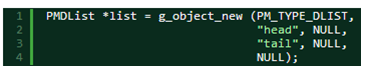
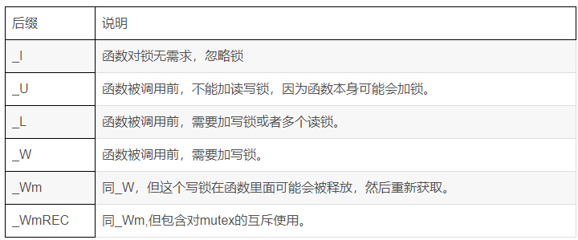

大多数现代计算机语言都带有自己的类型和对象系统，并附带算法结构。

GObject对象系统提供了一种灵活的、可扩展的、容易映射的（到其他语言）的面向对象C语言框架。

它的实质可以概括为：

1、一个通用类型系统。

2、一个基本类型的实现集。

3、一个信号系统。


GObject 是基于GType的。

GType是glib运行时类型认证和管理系统。

**理解GType是理解GObject的关键。**


GObject 的动态类型系统允许程序在运行时进行类型注册，它的最主要目的有两个：

1 ）使用面向对象的设计方法来编程。 

GObject 仅依赖于 [GLib](http://zh.wikipedia.org/wiki/GLib) 和 [libc](http://zh.wikipedia.org/w/index.php?title=Libc&action=edit&redlink=1) , 通过它可使用纯 C 语言设计一整套面向对象的软件模块。

2 ）多语言交互。

在为已经使用 GObject 框架写好的函数库建立多语言连结时，可以很容易对应到许多语言，包括 C++ 、 Java 、 Ruby 、 Python 和 .NET/Mono 等。 

GObject 被设计为可以直接使用在 [C](http://zh.wikipedia.org/wiki/C语言) 程序中，也 [封装](http://zh.wikipedia.org/w/index.php?title=封装&action=edit&redlink=1) 至其他语言。 


C 的 API 是常常是一些从二进制文件中导出的函数集和全局变量。

C 的函数可以有任意数量的参数和一个返回值。

每个函数有唯一的由函数名确定的标识符，

并且由 C 类型来描述参数和返回值。

类似的，由 API 导出的全局变量也是由它们的名字和类型所标识。

一个 C 的 API 可能仅仅定义了一些类型集的关联。


如果你了解函数调用和 C 类型至你所在平台的机器类型的映射关系，

你可 以在内存中解析到每个函数的名字从而找 到这些代码所关联的函数的位置，

并且构 造出一个用在这个函数上的参数列表。

 最后，你可以用这个参数列表来调用这 个目标 C 函数。

第一个指令在堆栈上建立了 十六进制的值 0xa （十进制为 10 ）作为一个 32 位的整型，并调用了 function_foo 函数。

就如你看到的， C 函数的调用由 gcc 实现成了 本地机器码的调用（这是实现起来最快的 方法）。


GLib 用的解决办法是， 

使用 GType 库来保存 在当前运行环境中的 所有由开发者描述的 对象的描述。

这些“ 动态类型”库将被特 殊的“通用粘合代码”

来自动转换函数参数和进行函数调用在不同的运行环境之间。


在GObject系统里，对象由三部分组成。

1、对象的id标识。

2、对象的类结构。

3、对象的实例。


C语言里模拟面向对象。只能靠结构体。

但是有不少的缺陷。需要通过设计来解决。

缺陷有：

```
1、语法比较别扭。
2、类型安全问题。
3、缺少封装。
4、空间的浪费。这个是最严重的。
	就是实例方法和类方法，其实都是一样的。
	这样定义一份就可以了。
```

所以进行了分开设计。

```
struct _GTypeClass //这个用来定义类型。
{
  GType g_type;//就是ulong类型。
};
struct _GTypeInstance //这个用来定义实例。
{
  GTypeClass *g_class;
};
```

实际使用是这样：

```
typedef strct _XxxOject XxxObject;
struct _XxxObject {//这个放所有的成员变量。
	GTypeInstance gtype;
	gint m_a;
	gchar *m_b;
	gfloat m_c;
};
typedef struct _XxxObjectClass XxxObjectClass;
struct _XxxObjectClass {//这个放函数。
	GTypeClass gtypeclass;
	void (*func1)(XxxObject *self, gint );
	void (*func2)(XxxObject *self, gchar *);
	void (*func3)(XxxObject *self, gfloat);
};
```


所以，就是说，GObject每个类，都需要定义两个结构体。

例如，People类，就需要定义People和PeopleClass这2个结构体。

遵循下面的原则：

当第一次产生People类的实例的时候，会先分配PeopleClass的空间。否则直接只分配People结构体的空间。


需要定义这些工具宏。

```
//获取类型
#define JC_TYPE_BOY (jc_boy_get_type())
//实例类型转化
#define JC_BOY(obj)  (G_TYPE_CHECK_INSTANCE_CAST((obj), JC_TYPE_BOY, JcBoy))
//实例类型判定
#define JC_IS_BOY(obj)  (G_TYPE_CHECK_INSTANCE_TYPE((obj), JC_TYPE_BOY))
//类结构转化
#define JC_BOY_CLASS(klass) (G_TYPE_CHECK_CLASS_CAST((klass), JC_TYPE_BOY, JcBoyClass))
//类结构判定
#define JC_IS_BOY_CLASS(klass)  (G_TYPE_CHECK_CLASS_TYPE((klass), JC_TYPE_BOY))
//获取类结构
#define JC_BOY_GET_CLASS(obj)  (G_TYPE_INSTANCE_GET_CLASS((obj), JC_TYPE_BOY, JcBoyClass))
//获取私有结构，如果没有，可以不定义这个宏。
#define JC_BOY_GET_PRIVATE(obj)  (G_TYPE_INSTANCE_GET_PRIVATE((obj), JC_TYPE_BOY, JcBoyPrivate))
```

命名规律是：`域名_类名_xx`

域名，就是为了防止类型名字冲突。例如gtk的GTK_前缀。

上面代码，就是定义了JC这个域名（随便写的）下的Boy这个类。

然后就需要定义对应的结构体了。

```
typedef struct _JcBoy JcBoy;

struct _JcBoy {
	JcBaby parent_instance;
	/*public*/
	//...
	/*private*/
	JcBoyPrivate *priv;
};
typedef struct _JcBoyClass JcBoyClass;
struct _JcBoyClass {
	JcBabyClass parent_class;
	//class member var
	//...
	//virtual method or signal
	void (*play)(JcBaby *self);
};

typedef struct _JcBoyPrivate JcBoyPrivate;
struct _JcBoyPrivate {
	gchar *name;
	guint age;
	gchar *hobby;
};

```

我们把上面的代码，放入到jc_boy.h里。

现在开始写jc_boy.c文件。

```
static void jc_boy_init(JcBoy *self)
{
	JcBoyPrivate *priv = NULL;
	priv = self->priv = JC_BOY_GET_PRIVATE(self);
	priv->name = g_strdup("no-name");
	priv->hobby = g_strdup("nothing");
	priv->age = 0;
}

static void jc_boy_class_init(JcBoyClass *klass)
{
	g_type_class_add_private(klass, sizeof(JcBoyPrivate));
	klass->play = play;
}

void play()
{
	g_print("the boy is playing football \n");
}
```

首先写的是实例结构体和类结构体的初始化函数。

需要向GObject系统注册类型。

g_type_register_xx 这个函数是用来注册类型的。可以注册为static、dynamic、fundamental的。

fundamental是指没有父类的普通类。

static的最简单，我们先只了解这个。

```
GType g_type_register(
	GType parent_type, 
	const gchar *type_name, 
	const GTypeInfo *info,//这个是最复杂的。
	GTypeFlags flags
);
```

为了简化程序员的工作，GObject提供了宏来帮助我们快速定义类型。

例如G_DEFINE_TYPE。

```
G_DEFINE_TYPE(JcBoy, jc_boy, G_TYPE_OBJECT);
```

# 继承GObject类的好处

1、基于引用计数的内存管理。

2、对象的构造和析构函数。

3、可设置对象属性的set/get方法。

4、易于使用的信号机制。


GType API是GObject的基础。

提供了用来注册和管理所有基础类型、用户定义对象类型和接口类型。

对于类型注册和创建，所有类型可以分为2类：static和dynamic。

static的用g_type_register_static这个函数，传递的参数是GTypeInfo

dynamic的用g_type_register_dynamic，传递的参数是GTypePlugin。

还有第三个函数g_type_register_fundamental。但是这个内部就帮我们做好了。不需要我们去调用这个。

结构体大小的限制是64K。

如果有超过这个的需求，用GArray来进行扩展。

类型名字长度，至少3个字符。

```
if (!type_name[0] || !type_name[1] || !type_name[2])
    {
      g_warning ("type name '%s' is too short", type_name);
      return FALSE;
    }
```

gtype.c这个文件是最重要的。


GBoxed，这个是对结构体进行包装的。例如GValue这些，并没有定义成class的形式。

为了注册到类型系统里，就需要用GBoxed包装一下。

glib目录下的GMainLoop这些，都是普通的结构体。


# 实现面向对象的特性

## 实现封装

很简单，我们只需要建立自己的头文件，并添加一些宏定义G_DEFINE_TYPE即可。

Gtype API 是 Gobject 系统的 基础 ，

它提供注册和管理所有基本数据、用户定义对象和接口类型的技术实现。

如： G_DEFINE_TYPE 宏、 G_DEFINE_INTERFACE 宏、 g_type_register_static 函数等都在 GType 实现。

## 实现继承

前面我们已经介绍，在 GObject 世界里， 类 是两个结构体的组合，一个是 实例结构体 ，另一个是 类结构体 。

GOBJECT 的继承需要实现实例结构体的继承和类结构体的继承。

## 构造函数

object 对象的初始化可分为 2 部分：类结构体初始化和实例结构体初始化。

类结构体初始化函数只被调用一次，

而实例结构体的初始化函数的调用次数等于对象实例化的次数。

**这意味着， 所有对象共享的数据，可保存在类结构体中，**

**而所有对象私有的数据，则保存在实例结构体中 。**

## 实现多态

用 C 的 struct 可以实现对象。

普通的结构体成员可以实现为成员数据，

而对象的成员函数则可以由函数指针成员来实现。

很多开源的软件也正是这么做的。


这样的实现有一些严重的缺陷：

别扭的语法、类型安全问题、缺少封装，

更实际的问题是 空间浪费严重 。

每一个实例化的对象需要 4 字节的指针来指向其每一个成员方法，

而这些方法对于类的每个实例（对象）应该都是相同的，所以是完全冗余的。

假设一个类有 4 个方法， 1000 个实例，那么我们将浪费接近 16KB 的空间。


很明显，我们不需要为每个实例保存这些指针，我们只需要保存一张包含这些指针的表。


（1）Gobject为每个子类在内存中保存了一份包含成员函数指针的表. 

这个表，就是我们在C++经常说到的虚方法表（vtable）。

当你想调用一个虚方法时，

你必须先向系统请求查找这个对象所对应的虚方法表。

这张表包含了一个由函数指针组成的结构体。

在调用这些函数时，需要在运行时查找合适的函数指针，这样就能允许子类覆盖这个方法，我们称之为“虚函数”。

(2)  Gobject系统要求我们向它注册新声明的类型，系统同时要求我们去向它注册（对象的和类的）结构体构造和析构函数（以及其他的重要信息），这样系统就能正确的实例化我们的对象。

（3）Gobject系统通过枚举化所有的向它注册的类型来记录新的对象类型，并且要求所有实例化对象的第一个成员是一个指向它自己类的虚函数表的指针，每个虚函数表的第一个成员是它在系统中保存的枚举类型的数字表示。


g_object_new 能够为我们进行对象的实例化 . 所以它必然要知道对象对应的 类的数据结构 .



除第一个参数外， 很容易猜想后面的参数都是 “ 属性名 - 属性值 ”的配对。

第一个参数其实是一个宏： 具体细节可以不去管它，可以知道它是去获取数据类型


要想实现前面讲述的让 g_object_new 函数中通过“属性名 - 属性值”结构为 Gobject 子类对象的属性进行初始化，我们需要完成以下工作：

（1）实现xx_xx_set_property与xx_xx_get_property函数，完成g_object_new函数“属性名-属性值”结构向Gobject子类属性的映射;

 (2)在Gobject子类的类结构体初始化函数中，让Gobject基类的两个函数指针set_property与get_property分别指向xx_xx_set_property与xx_xx_get_property。

（3）在Gobject子类的类结构体初始化函数中，为Gobject子类安装具体对象的私有属性。

**可以看出，set_property是Gobject的虚函数实现，是运行时的多态。**

## 实现泛型

假设我们需要一种数据类型，

可以实现一个可以容纳多类型元素的链表，

我想为这个链表编写一些接口，可以不依赖于任何特定的类型，

并且不需要我为每种数据类型声明一个多余的函数。

这种接口必然能涵盖多种类型，我们称它为GValue（Generic Value，泛型）。


要编写一个泛型的属性设置机制，

我们需要一个将其参数化的方法，

以及与实例结构体中的成员变量名查重的机制。

从外部上看，我们希望使用C字符串来区分属性和公有API，

但是内部上来说，这样做会严重的影响效率。

因此我们枚举化了属性，使用索引来标识它们。


属性规格，在Glib中被称作!GParamSpec，

它保存了对象的gtype，对象的属性名称，属性枚举ID，属性默认值，边界值等，类型系统用!GParamSpec来将属性的字符串名转换为枚举的属性ID，

**GParamSpec也是一个能把所有东西都粘在一起的大胶水。**

## 实现闭包

一个Closure是一个抽象的、通用表示的回调（callback）。它是一个包含三个对象的简单结构：

   （1）一个函数指针（回调本身） ，原型类似于：

  return_type function_callback (… , gpointer user_data);

   （2） user_data指针用来在调用Closure时传递到callback。

  （3）一个函数指针，代表Closure的销毁：当Closure的引用数达到0时，这个函数将被调用来释放Closure的结构。

### 闭包给多语言绑定带来了方便

## 消息系统：Signal机制

使用 GObject 信号机制，一般有三个步骤：

（1）信号注册，主要解决信号与数据类型的关联问题

（2）信号连接，主要处理信号与闭包的连接问题；

（3）信号发射,  调用callback进行处理。

## 实现单例

在gobject\tests\object.c这个测试代码里。

```c
typedef GObject MySingletonObject;
typedef GObjectClass MySingletonObjectClass;

GType my_singleton_object_get_type (void);

G_DEFINE_TYPE (MySingletonObject, my_singleton_object, G_TYPE_OBJECT)

static MySingletonObject *singleton;

//下面实现实例初始化函数，构造函数，析构函数，class初始化函数4个函数。
static void
my_singleton_object_init (MySingletonObject *obj)
{
}

static GObject *
my_singleton_object_constructor (GType                  type,
                                 guint                  n_construct_properties,
                                 GObjectConstructParam *construct_params)
{
  GObject *object;

  if (singleton)
    return g_object_ref (singleton);

  object = G_OBJECT_CLASS (my_singleton_object_parent_class)->
    constructor (type, n_construct_properties, construct_params);
  singleton = (MySingletonObject *)object;

  return object;
}

static void
my_singleton_object_finalize (MySingletonObject *obj)
{
  singleton = NULL;

  G_OBJECT_CLASS (my_singleton_object_parent_class)->finalize (obj);
}

static void
my_singleton_object_class_init (MySingletonObjectClass *klass)
{
  GObjectClass *object_class = G_OBJECT_CLASS (klass);

  object_class->constructor = my_singleton_object_constructor;
  object_class->finalize = my_singleton_object_finalize;
}
```

测试代码

```c
MySingletonObject *one, *two, *three;
one = g_object_new (my_singleton_object_get_type (), NULL);
two = g_object_new (my_singleton_object_get_type (), NULL);
g_assert (one == two);
```

## private属性

gobject\tests\private.c

```c
#include <glib-object.h>

typedef struct {
  GObject parent_instance;
} TestObject;

typedef struct {
  int dummy_0;
  float dummy_1;
} TestObjectPrivate;

typedef struct {
  GObjectClass parent_class;
} TestObjectClass;

```


tests\gobject

# glib里函数后缀含义说明



# gstreamer里的实践

Gstreamer的类型系统来源于GLib Object System，

GLib 对基本类型进行了重新映射，

同时实现了如Lists，hash表等等算法，

它比Gobject的类型更通用。

Gobject和它的底层类型系统Gtype被用在 GTK+（图形用户界面工具包）和大多数GNOME 库(Linux上的图形桌面环境库)。

Gtype用C的方式实现了面向对象，

用来兼容不同类型的语言和提供透明的跨语言交叉访问，

比如Python和C程序的互相访问。


开发者用定义在gtype.h 文件中的

g_type_register_static(), 

g_type_register_dynamic() 和
 g_type_register_fundamental() 

来注册一个新一Gtype类型到类型系统中。

一般不需要用g_type_register_fundamental() 函数来注册基本类型到类型系统。


Fundamental type基类型是最顶层的类型，

不从任何类型派生而来，是类型系统的核心，其他类型则从基类型派生，

GtypeFundamentalFlags用来描述基类型的特性，

注册为class且为可以实例化的Type极其像object。


GStreamer提供了类型及其参数的定义框架，但是对于类型的含义，需要element的开发者去定义。

类型定义的策略如下：

* 如果已有满足需求的类型存在，则不要创建新的Type。
* 创建新的类型前需要就类型参数等等和其他GStreamer开发者进行沟通，交流。
* 新的Type名字不能与现存的的类型名冲突，并且类型名最好能够体现类型细节，不要取"audio/compressed"这类比较通用的类型名字，因为较为通用的名字已经存在的可能性较大，容易和现存类型冲突。
* 描述清楚新创建的类型并加它加入到已知类型中方便其他开发者使用。
* 不推荐创建和其他系统相同类型名但含义不同的类型。

# 生成python binding

# gobject手册

https://www.geany.org/manual/gtk/gobject/index.html

# gobject-builder

https://www.jirka.org/gob2.1.html

GObject 构建器是一个简单的预处理器，用于轻松创建 GObject 对象。它不解析任何 C 代码，也不忽略任何 C 错误。在精神上，它类似于 lex 或 yacc 这样的东西。在某些方面，它也类似于 Java。但它实际上只是一个简单的预处理器，用于在 C 或 C++ 中创建 GObjects，并不是一个编程语言。


## typename

因为我们需要解析 typename 的不同部分，

有时需要使用一些特殊的语法来指定 typename。

类型以大写字母形式指定，

单词之间用':'分隔。

类型的第一部分（可以为空）是“命名空间”。

这一事实用于类型检查宏和类型宏。

对于"Gtk:New:Button"，

宏将为 GTK_IS_NEW_BUTTON 和 GTK_TYPE_NEW_BUTTON。

typename 用分号分隔的格式在类声明头文件和方法参数类型中使用。

## 输出文件

文件名由 typename 创建。

单词之间用'-'分隔（可以通过--file-sep 选项更改），

全部转换为小写。

例如，对于名为"Gtk:New:Button"的对象，

文件为 gtk-new-button.c 和 gtk-new-button.h。

如果你使用 C++模式，输出的.c 文件实际上是一个.cc 文件。

如果有任何私有数据成员，还会创建一个名为-private.h 的私有头文件（在上述示例中为 gtk-new-button-private.h）。

公共头文件用于人类可读和作为对象的参考。

.c 源文件不是人类可读的源文件，充斥着#line 语句，这些语句使编译器在解析错误时尝试指向你的.gob 文件中的正确行。

==输出不应手动编辑，你应该只编辑.gob 文件。==

## 在输出的c文件里包含一些指定的内容

在输出 C 文件中直接包含一些代码，

请在空白行上开始和结束代码，

分别使用'%'{}'。

这些部分将按照给出的顺序出现在输出文件中。

还有其他几个可以放置代码的区域。

你可以将代码放在'header'部分（可以简写为'h'），它将进入公共头文件。

你也可以将代码放在'privateheader'部分（简写为'ph'），

这会使代码进入私有头文件。

有时你希望在 extern "C"和保护定义之前包含一些代码（其他包含）。

为此，你可以将它们放入'headertop'（或'ht'）部分。

你可能希望在所有文件中包含代码或注释，

可以通过将它们放入'all'（或'a'）部分来实现。

同样，你希望在所有文件顶部出现的代码应放入'alltop'（或'at'）部分。

当你希望代码像'alltop'那样出现，但只在 cfile 中时，使用'ctop'（或'ct'）部分。

请注意，ctop 需要 2.0.18 版本。

最后，'afterdecls'在声明和方法实现之间包含代码，但请注意，'afterdecls'需要 2.0.16 版本。

例如：

```
  %alltop{
        /* this will be at the very top of all output files */
  %}

  %ctop{
        /* this will be at the very top of the C file */
        /* Requires 2.0.18 */
  %}

  %headertop{
        /* this will be on top of the public header */
  %}

  %privateheader{
        /* this will go into the private header file */
  %}

  %h{
        /* will be included in the header */
        void somefunc(int i);
  %}

  %a{
        /* will be included in all files */
  %}

  %afterdecls{
        /* between the declarations and the method implementations */
        /* Requires gob version 2.0.16 */
  %}

  %{
        /* will be included in the C file */
        void somefunc(int i)
        {
              /* some code */
        }
  %}

```


Gob 将在 .c 源文件的顶部自动包含类头文件。

如果您希望在其他位置包含它，

请将包含放入一些 %{ %} 部分的上方，

且在类定义之前，Gob 将不会自动包含。

这样，您可以避免循环包含，并控制您希望在文件中包含头文件的位置。


如果创建了任何私有数据成员，gob 也会生成一个源文件，该文件将被命名为 -private.h。

对于这个文件的规则与常规头文件相同。

如果你明确包含常规头文件，你应该始终在它下面包含这个私有头文件。

也就是说，如果你使用了任何私有数据成员。

如果不这样做，私有头文件会自动包含公共头文件，因此公共头文件将间接在文件的最顶部被包含。

# gob2的代码

https://github.com/dov/gob2

可以看这个例子。

https://github.com/dov/gob2/blob/main/examples/my-person.gob

# 让gpt写python脚本实现gobject代码生成

```python
import os

# 定义生成GObject模块的模板
HEADER_TEMPLATE = """
#ifndef __{module_upper}_H__
#define __{module_upper}_H__

#include <glib-object.h>

G_BEGIN_DECLS

#define {module_upper}_TYPE_{class_upper} ({module_lower}_{class_lower}_get_type())
G_DECLARE_FINAL_TYPE({ModuleClass}, {module_lower}_{class_lower}, {MODULE_LOWER}, {CLASS_LOWER}, GObject)

struct _{ModuleClass}
{{
    GObject parent_instance;
}};

struct _{ModuleClass}Class
{{
    GObjectClass parent_class;
}};

{ModuleClass} *{module_lower}_{class_lower}_new(void);

G_END_DECLS

#endif /* __{module_upper}_H__ */
"""

SOURCE_TEMPLATE = """
#include "{module_lower}-{class_lower}.h"

struct _{ModuleClass}
{{
    GObject parent_instance;
}};

G_DEFINE_TYPE({ModuleClass}, {module_lower}_{class_lower}, G_TYPE_OBJECT)

static void {module_lower}_{class_lower}_class_init({ModuleClass}Class *klass)
{{
    /* class initialization code */
}}

static void {module_lower}_{class_lower}_init({ModuleClass} *self)
{{
    /* instance initialization code */
}}

{ModuleClass} *{module_lower}_{class_lower}_new(void)
{{
    return g_object_new({module_upper}_TYPE_{class_upper}, NULL);
}}
"""

# Python 脚本生成 GObject 模块
def create_gobject_module(module_name, class_name):
    # 创建目录
    os.makedirs(module_name, exist_ok=True)
    
    # 设置宏和命名
    module_lower = module_name.lower()
    module_upper = module_name.upper()
    class_lower = class_name.lower()
    class_upper = class_name.upper()
    ModuleClass = f"{module_name.capitalize()}{class_name.capitalize()}"
    MODULE_LOWER = module_name.upper()
    CLASS_LOWER = class_name.upper()

    # 创建头文件
    header_content = HEADER_TEMPLATE.format(
        module_upper=module_upper,
        module_lower=module_lower,
        ModuleClass=ModuleClass,
        class_upper=class_upper,
        class_lower=class_lower,
        MODULE_LOWER=MODULE_LOWER,
        CLASS_LOWER=CLASS_LOWER
    )

    with open(os.path.join(module_name, f"{module_lower}-{class_lower}.h"), "w") as header_file:
        header_file.write(header_content)

    # 创建源文件
    source_content = SOURCE_TEMPLATE.format(
        module_lower=module_lower,
        module_upper=module_upper,
        ModuleClass=ModuleClass,
        class_upper=class_upper,
        class_lower=class_lower
    )

    with open(os.path.join(module_name, f"{module_lower}-{class_lower}.c"), "w") as source_file:
        source_file.write(source_content)

    print(f"GObject module '{module_name}-{class_name}' created successfully!")


# 示例用法：输入模块和类名
module_name = input("Enter module name: ")
class_name = input("Enter class name: ")
create_gobject_module(module_name, class_name)

```

# gobject编程里的PROP枚举

在 GObject 编程中，`PROP_0` 和其他 `PROP_*` 常量通常用于定义对象的属性。这些常量是在 GObject 相关类中注册和使用的，目的是提供一种方便的方式来处理对象属性。下面是对这些常量的详细解释。

### 常量解析

1. **`PROP_0`**
   - **描述**: 常用于占位符，表示没有属性。这通常是属性枚举的起始值。它的存在是为了确保后续属性的索引从 1 开始。
   - **用途**: 在属性的注册和访问过程中，通常不使用该值。
2. **`PROP_NAME`**
   - **描述**: 代表一个名为 `name` 的属性。这个属性可以用来存储对象的名称或标识符。
   - **用途**: 在对象中实现时，可以使用 `g_object_set()` 和 `g_object_get()` 函数来访问该属性。
3. **`PROP_PROPERTIES`**
   - **描述**: 代表一个名为 `properties` 的属性。它可以用于存储与对象相关的其他属性或特征。
   - **用途**: 这可以是一个复杂的结构，允许用户通过该属性访问多个子属性。

然后会有xx_set_property和xx_get_property这2个处理函数。

在xx_new的时候，会注册属性进去：

```
WpConf *
wp_conf_new (const gchar * name, WpProperties * properties)
{
  g_return_val_if_fail (name, NULL);
  g_autoptr (WpProperties) props = properties;
  return g_object_new (WP_TYPE_CONF, "name", name, //这里注册property
                       "properties", props,
                       NULL);
}
```

# g_autofree 和g_autoptr区别

`g_autofree` 和 `g_autoptr` 都是 GLib 提供的宏，用于自动管理内存，避免内存泄漏，但它们的使用场景不同。

### g_autofree

- **作用**：用于自动释放通过 `g_malloc()`、`g_new()` 等函数分配的内存。
- **类型**：通常用于指针类型，如 `char*` 或其他基本类型的指针。
- **使用示例**：

  ```c
  g_autofree char *str = g_strdup("Hello, World!");
  ```

  在这个例子中，`str` 会在作用域结束时自动释放。

### g_autoptr

- **作用**：用于自动管理 GLib 对象的引用计数，适用于 GObject 类型。
- **类型**：主要用于 GObject 派生类型，例如 `GObject*`、`GList*`、`GHashTable*` 等。
- **使用示例**：

  ```c
  g_autoptr(GList) list = g_list_append(NULL, "Item");
  ```

  在这个例子中，`list` 会在作用域结束时自动释放，减少了手动调用 `g_object_unref()` 的需要。

### 总结

- 使用 `g_autofree` 处理基本内存分配的情况。
- 使用 `g_autoptr` 处理 GObject 类型的引用计数管理。

通过这两种宏，可以有效地减少内存管理中的错误和复杂性。

# 参考资料

1、GObject对象系统

https://www.ibm.com/developerworks/cn/linux/l-gobject/

2、GObject学习手册

https://wenku.baidu.com/view/14d8ea8cec3a87c24028c4da.html?from=search

3、GObject:用C实现类是如何做到的

https://blog.csdn.net/xbl1986/article/details/6702336

4、Gobject的闭包

https://blog.csdn.net/evsqiezi/article/details/82695585

5、C语言面向对象开发法--GObject

这个讲得比较基础，比较好懂。

https://wenku.baidu.com/view/d7c8787f1711cc7931b716e1.html?sxts=1564108386035

6、GObject学习教程---第一章：GObject是有用并且简单的

这个教程似乎不错。

https://blog.csdn.net/knowledgebao/article/details/82387743

7、GObject 的子类继承

http://garfileo.is-programmer.com/2011/3/8/inherition-of-gobject.25106.html

8、GObject接口定义和实现

这个是翻译。

https://blog.csdn.net/lp525110627/article/details/71082293

这个是原文。

https://developer.gnome.org/gobject/stable/howto-interface.html

9、Gstreamer基础之Gobject

https://blog.csdn.net/yingmuliuchuan/article/details/78491776

10、wiki百科

https://zh.wikipedia.org/zh-hans/GObject

11、从零开始成为GStreamer专家——GStreamer类型系统

https://blog.csdn.net/intel1985/article/details/122692791

12、

https://pygobject.readthedocs.io/en/latest/