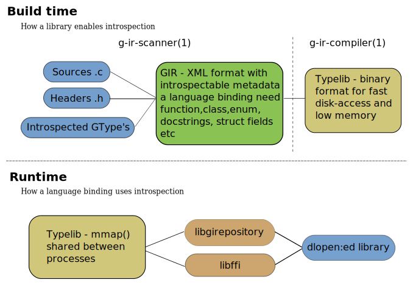
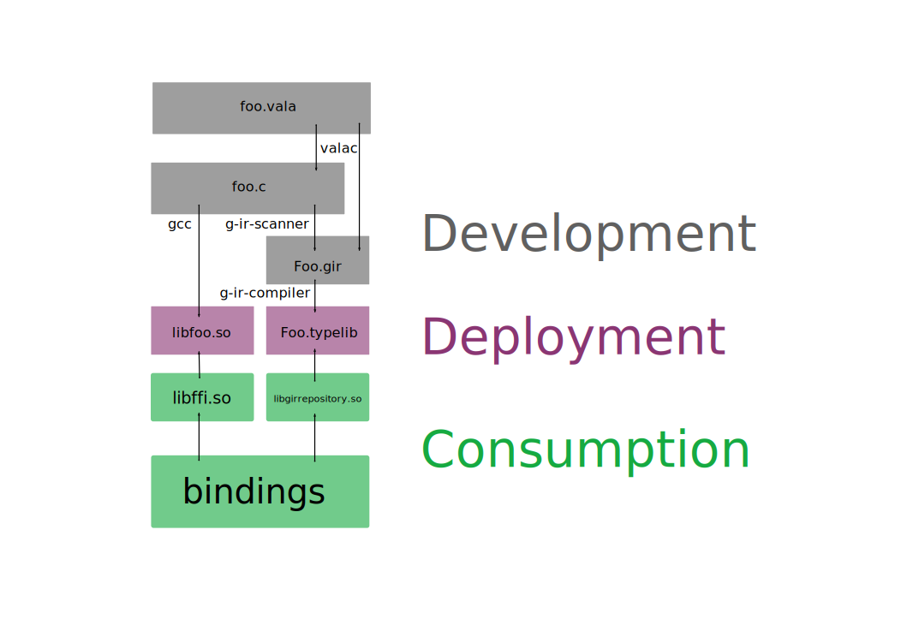

--

# glib的python 库为什么叫gi

GObject-Introspection（GI）是一个**用于动态分析和生成多种编程语言的库的工具，**

它允许开发人员在不编写硬编码绑定的情况下与GLib库及其相关的库进行交互。

GI库的Python绑定通常称为"pygobject"，

而这个库的命名为"gi"是因为它主要用于与GI相关的内容。

GI库的目标是提供一种自动化的方式来生成不同编程语言的绑定，

以便开发人员可以轻松地使用GLib、GTK+、GNOME等库，

而不需要手动编写大量的绑定代码。

**通过GI，开发人员可以通过元数据信息访问库的功能，而不需要直接处理底层的C库。**


GI库的Python绑定，即"gi"库，充分利用了Python的动态特性，

允许开发人员以一种更加Pythonic的方式与GLib等库进行交互。

这种库的命名为"gi"是为了反映其关注点和目标，即与GObject-Introspection相关的内容。

因此，"gi"库是一种Python绑定库，用于在Python中使用GObject-Introspection生成的元数据信息，以访问GLib和相关库的功能。


# GObject-Introspection 介绍

GObject-Introspection（GI）是一个用于动态分析和生成多种编程语言的库的工具，旨在帮助开发人员轻松地与GObject库及其相关的库进行交互，而无需手动编写大量的绑定代码。GI的主要目标是促进跨语言开发，使开发人员能够在多种编程语言中使用这些库。

以下是GI的一些重要特点和概念：

1. **元数据信息：** GI通过分析库的头文件和类型信息，生成元数据信息。这些元数据信息描述了库中可用的函数、类、方法、属性、信号等。这些元数据允许开发人员在不需要了解底层C库的情况下，了解库的结构和功能。

2. **多语言支持：** GI生成的元数据信息可以用于多种编程语言，如Python、JavaScript、C#、Vala等。这意味着开发人员可以使用其首选的编程语言与库进行交互。

3. **动态类型系统：** GI允许开发人员在运行时查询和操作库的元数据信息。这使得动态语言（如Python和JavaScript）能够以更灵活的方式与库进行交互。

4. **版本管理：** GI支持库的不同版本和多个命名空间，因此可以处理不同库版本之间的差异。

5. **自动绑定生成：** 基于元数据信息，GI可以自动生成编程语言的绑定，这消除了手动编写绑定的繁琐任务。

6. **增强的工具和文档：** GI提供了一些工具来帮助生成绑定和文档。这有助于使库的使用更加方便。

GI最常用于与GNOME桌面环境相关的库，如GLib和GTK+。

开发人员可以使用GI来访问这些库的功能，并在不同编程语言中编写GNOME应用程序。

总的来说，GObject-Introspection是一个有助于使多语言开发更加容易和高效的工具，它允许开发人员在不同编程语言中使用现有的C库，提高了跨语言开发的便利性和互操作性。

# 支持 GObject Introspection 的语言

支持 GObject Introspection（GI）的语言主要有以下几种：

1. **Python**: GObject Introspection 提供了 Python 的绑定，使得可以在 Python 中方便地使用 GObject 基于的库。通过 GI，Python 开发者可以直接使用 GObject 基于的库的 API，而无需手动编写 C 扩展模块。

2. **JavaScript**: GObject Introspection 同样提供了 JavaScript 的绑定，使得可以在 JavaScript 中使用 GObject 基于的库。这使得开发者可以在 Web 开发中使用 GNOME 生态系统中的库，例如 GTK+ 等。

3. **Vala**: Vala 是一种基于 GObject 的面向对象语言，它本身就是为了简化 GNOME 开发而设计的。因此，Vala 与 GObject Introspection 高度集成，可以直接调用 GObject 基于的库的 API，而无需显式地编写 GObject 代码。

4. **其他语言**: GObject Introspection 还支持其他一些语言，如 Ruby、Lua、Rust 等。虽然支持的程度可能不如 Python、JavaScript 和 Vala 那么完善，但也可以使用 GObject 基于的库的 API。

# 官方文档

https://gi.readthedocs.io/en/latest/

GObject 自省是 C 库（使用 GObject）和语言绑定之间的中间件层。

除了实际的本机 C 库之外，还可以在编译时扫描 C 库并生成元数据文件。

然后语言绑定可以读取此元数据并自动提供绑定以调用 C 库。



GI项目包括：

- 称为 GIR 的 XML 格式，包含机器可解析格式的内省信息
- 用于创建和解析 GIR 格式的 Python 包
- 一个从 C 源代码和头文件生成 GIR 格式的扫描器
- 类似于 xpcom/msole 的 typelib，它以二进制格式将信息存储在磁盘上
- 从 xml 格式编译 typelib 的编译器（反之亦然）
- C库读取typelib、libgirepository。

代码在这里：

```
git clone https://gitlab.gnome.org/GNOME/gobject-introspection.git
```

项目还是在积极维护的。

今年就更新了好几个版本。

## 目标

内省项目有两个主要目标，以及各种更次要的目标。

### 两级应用程序 - C 和您最喜欢的运行时

使用（至少）两种不同的级别和语言构建多种应用程序是有意义的——

一种用于低级元素，与操作系统和/或硬件交互；

另一种用于低级元素，与操作系统和/或硬件交互。

一个用于高级应用程序逻辑。 

C 适合图形、多媒体和较低级别的系统工作。

然而，用 C 语言编写复杂的软件非常困难并且容易出错。 

JavaScript、Python、Perl、Java、Lua、.NET、Scheme 等托管运行时对于配置、布局、对话框等非快速路径应用程序逻辑非常有意义。

==为了实现这个目标，您需要使用 GObject 约定编写代码。==有关详细信息，请参阅 GObject 教程


因此，GObject 内省项目的主要目标之一是成为这两个世界之间的便捷桥梁，

并允许您为工作选择正确的工具，而不是局限于其中一个。

通过内省项目，您可以用 C 语言编写 ClutterActor 或 GtkWidget 子类，

然后无需任何额外工作即可在您选择的高级语言中使用该类。


### 共享绑定基础设施工作，并使平台更加绑定友好

从历史上看，在 GNOME 中，核心平台对绑定相对友好，

但是 C+GObject 层中没有捕获绑定所需的一些细节。

例如，引用计数语义和 GList 内的项目类型。

到目前为止，各种语言绑定（例如 Python、Mono、java-gnome 等）都具有手动维护的元数据的重复副本，这导致了一种情况，即绑定往往会滞后，直到完成这些手动修复，或者根本就是错误的，当调用一个更晦涩的函数时，你的应用程序会崩溃。


内省项目通过在注释中==使用注释将所有元数据放入 GObject 库本身来解决这个问题。==

这将减少绑定作者的重复工作，并为绑定消费者带来更可靠的体验。

此外，由于内省构建过程将发生在 GObject 库本身内部，

因此目标是鼓励 GObject 作者从一开始就考虑将其 API 塑造得更加绑定友好，而不是事后才想到。


### 其他目标和用途

API 验证 - 有时我们堆栈中的库的 API 会意外更改。通常由经验不足的开发人员进行更改，但没有意识到这会破坏应用程序。内省每个版本的库中可用的 API 并将其与上一个版本进行比较，可以轻松了解发生了什么变化

文档工具 - GObjectIntrospection 内部编写的工具可以轻松地重用来改善该问题。本质上替换 gtk-doc。我们想要记录我们导出的内容，因此将其与上面提到的 API 验证结合在一起是有意义的

UI设计师基础设施

序列化/RPC/DBus

## 架构



```
BUILD TIME:

          +-----------------------------------------------------------+
          |   foo.c                                                   |
          |   foo.h                                                   |
          |                                                           |
          | Library sources, with type annotations                    |
          +-----------------------------------------------------------+
              |                                      |
             gcc                                 g-ir-scanner
              |                                      |
              |                                      V
              |                              +------------------------+
              |                              |    Foo.gir             |
              |                              |                        |
              |                              |    <GI-name>.gir       |
              |                              |                        |
              |                              | XML file               |
              |                              |                        |
              |                              | Invocation information |
              |                              | Required .gir files    |
              |                              | API docs               |
              |                              |                        |
              |                              +------------------------+
              |                                          |
              |                                     g-ir-compiler
              |                                          |
  DEPLOYMENT TIME:                                       |
              |                                          |
              V                                          V
        +-----------------------------+      +---------------------------+
        |   libfoo.so                 |      |    Foo.typelib            |
        |                             |      |                           |
        |                             |      | Binary version of the     |
        |  ELF file                   |      | invocation info and       |
        |                             |      | required .typelib files   |
        |  Machine code, plus         |      +---------------------------+
        | dynamic linkage information |                  A
        | (DWARF debug data, etc)     |                  |
        +-----------------------------+                  |
                     A                                   |
                     |                       +---------------------------+
                     |                       |  libgirepository.so       |
                +-----------+                |                           |
                | libffi.so |                |  Can read typelibs and    |
                |           |<-------+------>|  present them in a        |
                +-----------+        |       |  libffi-based way         |
                                     |       |                           |
                                     |       +---------------------------+
                                     |
                                     |
                           +----------------------------+
                           | Specific language bindings |
                           +----------------------------+
```

------

## 哪些库使用了gi

挺多的。

我关注pygobject这个项目。

## 编写可以binding的API

### 要避免的事情

#### 具有自定义内存管理的结构

避免使用自定义内存管理创建 C 结构，除非它们注册为装箱类型。

如果您不将它们注册为盒装类型绑定，则会退回到简单的内存复制，这可能不是您想要的。

还可以考虑使用完整的 GObject，因为它允许绑定更好地将这些对象与绑定语言集成，例如跨语言边界保留用户定义的状态。

不用这样做：

```
struct _GstMiniObject {
  GTypeInstance instance;
  /*< public >*/ /* with COW */
  gint refcount;
  guint flags;
```

#### 只能通过 C 宏或内联函数访问的功能

扫描仪不支持 C 宏作为 API。

解决方案 - 添加函数访问器而不是宏。

这还具有使 C 代码调试更容易的副作用。

同样，内联函数不能从动态库加载。确保提供非内联等效项。

#### 对象的直接 C 结构访问

让 GObject 也有字段可能很难绑定。创建访问器函数。

```
struct _SoupMessage {
        GObject parent;

        /*< public >*/
        const char         *method;

        guint               status_code;
...
}

const char * soup_message_get_method (SoupMessage *message);  /*  Or use a GObject property */
```

#### va_list

使用可变参数对于 C 来说很方便，但它们很难绑定。

解决方案：保留 C 函数以方便 C 程序员，但添加另一个采用数组（以零结尾或带有长度参数）的函数。

**Good** example:

```
GtkListStore *gtk_list_store_new              (gint          n_columns,
                                               ...);
GtkListStore *gtk_list_store_newv             (gint          n_columns,
                                               GType        *types);
```

#### 多个输出参数

内省支持多个输出参数，但并非所有语言都对多个输出值有明显的映射。盒式结构可以作为替代方案。

考虑的示例（这里，可能有一个装箱的 struct GtkCoordinate { gint x; gint y; } 结构）。

## 编写指南

决定是否要创建与实现无关的语言绑定或特定于实现的语言绑定。

某些语言（例如 Python）具有可跨实现使用的库。 

Python 模块 ctypes 是 libffi 语言绑定的绑定，

它在几个不同的 Python 实现中实现。

通常更容易针对特定的解释器或编译器实现，因此如果您不确定，请编写一个特定的解释器或编译器实现。


对于解释型语言实现，请在 libgirepository 库之上构建语言绑定，而不是编写代码生成器。

这将使开发人员更容易使用您的语言绑定，因为他们将能够在运行时读取类型库，而无需额外的中间步骤来生成特定于语言的元数据。 


libgirepository 库还可以用于基于代码生成器的绑定作为优化，从 typelib 读取元数据比从 GIR XML 文件中提取元数据要快得多。

在单元测试中使用 Everything 库，旨在测试其中的所有功能。在绑定开发过程中尽早进行测试，因为代码可能比您预期的更复杂。

使用与您的语言相同的编码风格。如果您的语言的库通常使用下划线，也可以这样做。例如，Java 绑定在其 GtkButton 包装器上应该有一个名为 setLabel 而不是 set_label 的方法。

如果存在现有的 GObject 绑定，请重用它们以提高兼容性。能够同时使用静态绑定和内省绑定是一个很好的功能。 Perl 和 Python 绑定可以做到这一点。

尽量接近 C 语言语义，例如 GObject 应该映射到一个类，而 gtk_button_set_label 应该映射到该类的方法：

## 命令行工具

[g-ir-compiler](https://gi.readthedocs.io/en/latest/tools/g-ir-compiler.html)

Typelib compiler

[g-ir-doc-tool](https://gi.readthedocs.io/en/latest/tools/g-ir-doc-tool.html)

Documentation builder

[g-ir-generate](https://gi.readthedocs.io/en/latest/tools/g-ir-generate.html)

Typelib generator

[g-ir-scanner](https://gi.readthedocs.io/en/latest/tools/g-ir-scanner.html)

Extracting C metadata from sources and headers

# 给出一个基本的例子使用gi

下面是一个简单的Python示例，演示如何使用GObject-Introspection（GI）来访问GLib库中的一些功能。

在这个示例中，我们将使用GI来获取系统当前时间。

首先，确保你已经安装了`pygobject`（GI的Python绑定）。

你可以使用以下命令在Ubuntu中安装：

```bash
sudo apt-get install python3-gi
```

或者在Fedora中安装：

```bash
sudo dnf install python3-gobject
```

然后，可以使用以下Python代码示例：

```python
# 导入GI库
from gi.repository import GLib

# 获取当前的时间戳（以微秒为单位）
current_time = GLib.get_real_time()

# 将时间戳转换为秒
current_time_seconds = current_time / 1000000.0

# 打印当前时间戳和时间
print(f"当前时间戳（微秒）: {current_time}")
print(f"当前时间戳（秒）: {current_time_seconds}")

# 使用GLib提供的函数格式化时间戳
formatted_time = GLib.DateTime.new_from_unix_utc(current_time_seconds).format('%Y-%m-%d %H:%M:%S')
print(f"当前时间（格式化）: {formatted_time}")
```

这个示例导入GLib模块，使用`GLib.get_real_time()`获取当前时间戳（以微秒为单位），然后将其转换为秒并格式化成易读的时间格式。

你可以运行上述代码来查看当前时间戳和格式化的时间。这只是GI的一个简单示例，它展示了如何使用GI来访问GLib库中的功能，而无需手动编写与GLib的绑定代码。

# 例子分析

GObject Introspection（简称 GI）用于产生与解析 C 程序库 API 元信息，以便于动态语言（或托管语言）绑定基于 C + GObject 的程序库。

为了正确的生成 C 库的 API 元信息，

- GI 要求 C 库的实现者要么使用一种特定的代码注释规范，即 Gtk-Doc [[1\]](http://www.gtk.org/gtk-doc)，
- 要么使用带有类型自省功能的 GObject 库。

首先来看如何基于 Gtk-Doc 注释产生 API 元信息，见下面的示例

```
#ifndef FOO_H
#define FOO_H

void foo_hello (void);

#endif
```


```

#include <stdio.h>
#include "foo.h"

/**
 * foo_hello:
 *
 * This function just for test.
 */
void
foo_hello (void)
{
        printf ("hello foo!\n");
}
```

使用 gcc 编译上述 C 代码，生成一个共享库：

```
$ gcc -fPIC -shared foo.c -o libfoo.so
```

然后使用 g-ir-scanner 产生 libfoo.so 库的 API 元信息：

```
$ g-ir-scanner --namespace=Foo --nsversion=1.0 --library=foo foo.h foo.c -o Foo-1.0.gir
```

所生成的 Foo-1.0.gir 文件是 XML 格式，其中记录了 libfoo.so 库的 API 元信息，如下：

```
<?xml version="1.0"?>
<!-- This file was automatically generated from C sources - DO NOT EDIT!
To affect the contents of this file, edit the original C definitions,
and/or use gtk-doc annotations.  -->
<repository version="1.2"
            xmlns="http://www.gtk.org/introspection/core/1.0"
            xmlns:c="http://www.gtk.org/introspection/c/1.0"
            xmlns:glib="http://www.gtk.org/introspection/glib/1.0">
  <namespace name="Foo"
             version="1.0"
             shared-library="libfoo.so"
             c:identifier-prefixes="Foo"
             c:symbol-prefixes="foo">
    <function name="hello" c:identifier="foo_hello">
      <doc xml:whitespace="preserve">This function just for test.</doc>
      <return-value transfer-ownership="none">
        <type name="none" c:type="void"/>
      </return-value>
    </function>
  </namespace>
</repository>
```


认真观察 Foo-1.0.gir 文件内容，

可以发现其中有一部分信息是我们在运行 g-ir-scanner 命令时提供的，

还有一部分信息来源于 foo.c 源文件中的代码注释。


Foo-1.0.gir 文件的作用就是以一种固定的格式描述 libfoo.so 库的 API 元信息，我们可以将这种文件称为 GIR 文件。

有了 GIR 文件，就可以不用再通过库的头文件来获取所需的函数符号了。

在实际使用中，加载并解析 Foo-1.0.gir 这样的 XML 文件，效率较低，

因此 GObject Introspection 定义了一种二进制格式，即 Typelib 格式，并提供 g-ir-compiler 工具将 GIR 文件转化为二进制格式，例如：

```
$ g-ir-compiler Foo-1.0.gir -o Foo-1.0.typelib
```

一旦有了 Typelib 格式的文件，我们就可以通过它来调用它所关联的程序库的 API，例如：

```c
#include <girepository.h>
 
int
main (void)
{
        GIRepository *repository;
        GError *error = NULL;
        GIBaseInfo *base_info;
        GIArgument retval;
 
        g_type_init();
 
        g_irepository_prepend_search_path ("./");
        repository = g_irepository_get_default ();
        g_irepository_require (repository, "Foo", "1.0", 0, &error);
        if (error) {
                g_error ("ERROR: %s\n", error->message);
                return 1;
        }
 
        base_info = g_irepository_find_by_name (repository, "Foo", "hello");
        if (!base_info) {
                g_error ("ERROR: %s\n", "Could not find Foo.hello");
                return 1;
        }
 
        if (!g_function_info_invoke ((GIFunctionInfo *)base_info,
                                     NULL,
                                     0,
                                     NULL,
                                     0,
                                     &retval,
                                     &error)) {
                g_error ("ERROR: %s\n", error->message);
                return 1;
        }
 
        g_base_info_unref (base_info);
 
        return 0;
}
```

上述代码所完成的主要工作如下：

- `g_irepository_prepend_search_path` 函数将当前目录添加到 Typelib 文件搜索目录列表；
- `g_irepository_get_default` 函数获取默认的 GIRepository 实例；
- `g_irepository_require` 函数可载入指定的 Typelib 文件；
- `g_irepository_find_by_name` 函数可从给定的 GIRepository 实例中根据指定的命名空间与 API 名称获取 API 的元信息，将其存入一个 `GIBaseInfo` 实例并返回；
- `g_function_info_invoke` 函数可以执行 `GIBaseInfo` 实例中所记载的 API 元信息对应的 API，本例即 `foo_hello` 函数；
- `g_base_info_unref` 函数用于释放一个 `GIBaseInfo` 实例的引用。

编译上述的 test.c 文件，可使用以下命令：

```
gcc `pkg-config --cflags --libs gobject-introspection-1.0` test.c -o test
```

运行所生成的程序，它便会正确的调用 libfoo.so 库中定义的 `foo_hello` 函数。

从上面的 libfoo.so 与 Typelib 文件的生成及其应用可以看出，

GI 可以根据 C 库的实现者提供的代码注释产生 API 元信息，

库的使用者则可以通过 GI 与 API 元信息去调用相应的 API。

这样做有什么好处？

试想，假如许多 C 库都采用同一种代码注释规范，

那么 g-ir-scanner 就可以生成它们的 API 元信息文件。

如果我们使用动态语言（托管语言）对这些 C 库进行绑定时，就不需要对这些 C 库逐一实现绑定，只需对 GI 库进行绑定，

通过它来解析 Typelib 文件，从而直接调用这些 C 库 API。

==也就是说，GI 是让 C 库开发者多做了一点工作，从而显著降低了 C 库绑定的工作量。==

事实上，GI 并没有让 C 库开发者多做什么工作，因为对 API 进行详细的注释是每个 C 库开发者都要去做的工作，

==GI 只是要求 C 库开发者使用 Gtk-Doc 格式的注释而已。==


使用 Gtk-Doc 格式的注释可以帮助 g-ir-scanner 生成详细且正确的 API 元信息，这是 GI 提供的一种约定。

但是如果程序库是基于 GObject 实现的，由于 GObject 类型系统具有自省功能，

而 GI 可以利用这一功能在不借助 Gtk-Doc 注释的情况下自动生成『类』（即面向对象编程中的类的概念）的元信息。


http://garfileo.is-programmer.com/2012/2/20/gobject-introspection-introduction.32200.html

# 另外一个简单例子

GLib通过GObject Introspection系统实现对其他语言的绑定。GObject Introspection提供了一种通用的方式来描述C库的API，并使其可以被其他编程语言访问。以下是具体实现方法和流程：

| 步骤           | 描述                                                         |
| -------------- | ------------------------------------------------------------ |
| **元数据生成** | 使用`g-ir-scanner`工具从C代码中提取元数据，生成XML格式的描述文件（`.gir`文件）。 |
| **编译元数据** | 将`.gir`文件编译成二进制格式的元数据文件（`.typelib`文件），供运行时使用。 |
| **运行时绑定** | 使用语言特定的运行时库（如PyGObject）加载和解释`.typelib`文件，以便在目标语言中使用C库。 |

### 详细步骤

1. **生成GIR文件**：
   使用`g-ir-scanner`工具扫描C源代码和头文件，生成包含API描述的GIR文件。
   ```sh
   g-ir-scanner --namespace=MyLib --nsversion=1.0 \
     --warn-all --output=MyLib-1.0.gir \
     MyLib.h MyLib.c \
     --library MyLib
   ```

2. **编译GIR文件**：
   使用`g-ir-compiler`工具将GIR文件编译成Typelib文件。
   ```sh
   g-ir-compiler MyLib-1.0.gir --output MyLib-1.0.typelib
   ```

3. **在目标语言中使用**：
   使用目标语言的绑定库（如PyGObject）加载并使用Typelib文件。
   ```python
   import gi
   gi.require_version('MyLib', '1.0')
   from gi.repository import MyLib
   ```

### GLib/GObject Introspection 的核心组件

| 组件                | 说明                                                 |
| ------------------- | ---------------------------------------------------- |
| **g-ir-scanner**    | 从C源码中提取API信息，生成GIR文件。                  |
| **g-ir-compiler**   | 将GIR文件编译成Typelib文件。                         |
| **libgirepository** | 提供运行时加载和解析Typelib文件的库。                |
| **语言绑定库**      | 例如PyGObject，用于在目标语言中加载并调用GObject库。 |

### 优势

1. **自动化**：
   - 自动生成绑定，减少手动编写绑定代码的工作量。
2. **一致性**：
   - 确保所有语言访问相同的API，减少文档和实现上的差异。
3. **扩展性**：
   - 方便支持更多语言，只需实现相应的运行时库即可。

### 示例

以GTK库为例，说明如何在Python中使用GObject Introspection生成的绑定。

1. **C代码库（假设为MyLib）**：
   ```c
   // MyLib.h
   #ifndef MYLIB_H
   #define MYLIB_H
   
   #include <glib-object.h>
   
   G_BEGIN_DECLS
   
   #define MY_TYPE_OBJECT (my_object_get_type())
   G_DECLARE_FINAL_TYPE(MyObject, my_object, MY, OBJECT, GObject)
   
   MyObject* my_object_new(void);
   void my_object_do_something(MyObject *self);
   
   G_END_DECLS
   
   #endif // MYLIB_H
   ```

2. **生成GIR文件**：
   ```sh
   g-ir-scanner --namespace=MyLib --nsversion=1.0 \
     --warn-all --output=MyLib-1.0.gir \
     MyLib.h MyLib.c \
     --library MyLib
   ```

3. **编译Typelib文件**：
   ```sh
   g-ir-compiler MyLib-1.0.gir --output MyLib-1.0.typelib
   ```

4. **在Python中使用**：
   ```python
   import gi
   gi.require_version('MyLib', '1.0')
   from gi.repository import MyLib
   
   obj = MyLib.MyObject.new()
   obj.do_something()
   ```

通过这种方式，GLib/GObject Introspection系统实现了对其他语言的绑定，使得使用GObject库的API变得更加简便和一致。
