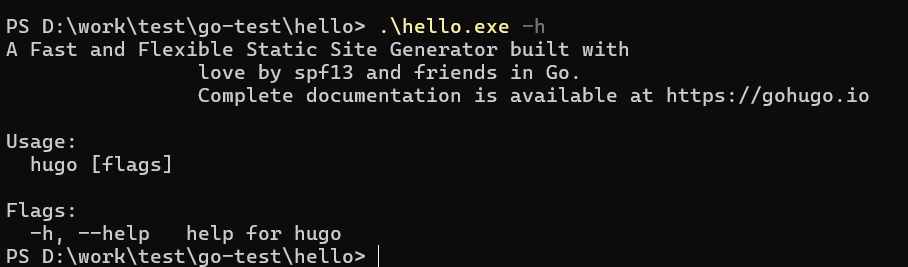
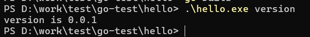
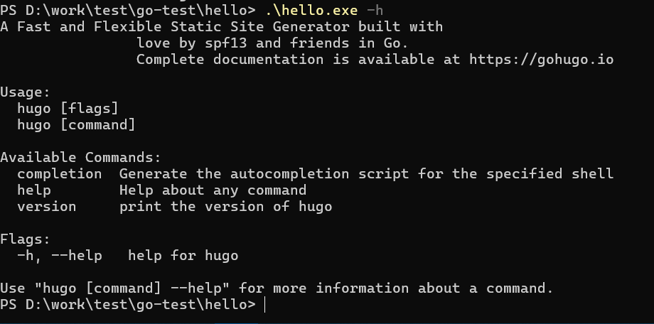

--

# 资源收集

go语言设计与实现

https://draveness.me/golang/

有趣的Golang开源项目

https://github.com/tabalt/interesting-golang-opensource-project


# 开始

我现在其实不是很想学新的语言，但是看到很多人推荐go语言，我就了解一下。

我先解答自己的这些疑问：

```
1、为什么需要go语言？是为了解决什么痛点？擅长哪些领域？
2、有哪些大项目用了go语言？
```


# go语言有哪些优势？

```
简洁、快速、安全
并行、有趣、开源
内存管理、数组安全、编译迅速
```

Go 语言被设计成一门应用于搭载 Web 服务器，存储集群或类似用途的巨型中央服务器的系统编程语言。


# go语言相对于c++的优势？

Go 语言相对于 C++ 具有以下优势：

1. 简洁的语法和易于学习：Go 语言采用了简洁的语法和少量的关键字，使得代码易于阅读和编写。它摒弃了一些复杂的语法和特性，减少了语言的复杂性，使得学习和使用起来更加容易。

2. 并发编程的原生支持：Go 语言内置了轻量级的协程（Goroutine）和通道（Channel）机制，使得并发编程更加简单和高效。协程和通道的设计使得并发编程变得安全和可控，可以轻松地编写高效的并发代码。

3. 内置的垃圾回收机制：Go 语言具有自动内存管理机制，即垃圾回收（Garbage Collection），它可以自动管理内存的分配和释放，减轻了开发者的负担，避免了常见的内存错误，如内存泄漏和悬空指针。

4. 强调代码的可读性和可维护性：Go 语言鼓励编写清晰、简洁、自解释的代码，注重代码的可读性和可维护性。它强制执行一些代码风格和约定，使得代码库保持一致的风格，便于团队合作和代码维护。

5. 丰富的标准库：Go 语言提供了丰富的标准库，包括网络、文件操作、并发、加密、数据结构等方面的功能。标准库的设计和接口一致性使得开发者可以方便地使用和扩展，提高了开发效率。

6. 高效的编译和执行性能：Go 语言的编译器具有高度优化的编译器，生成高效的机器码。它还具有快速的启动时间和低内存占用，使得 Go 语言适用于构建高性能的应用程序。

总体而言，Go 语言在语法简洁、并发编程、内存管理、可读性和可维护性等方面具有优势，使得它成为一种流行的选择，特别适合构建高并发、高效率和易于维护的应用程序。然而，C++ 仍然是一种强大且灵活的编程语言，适用于对性能和底层细节有严格要求的应用场景。选择使用哪种语言应该根据具体需求和项目要求来决定。


# go语言相对于python的优势？

Go 语言相对于 Python 具有以下优势：

1. 高性能：Go 语言的编译器生成高效的机器码，执行性能优秀。相比之下，Python 是一种解释型语言，执行速度较慢。

2. 并发编程：Go 语言内置了轻量级的协程（Goroutine）和通道（Channel）机制，使得并发编程更加简单和高效。相比之下，Python 的并发编程需要使用线程或进程，需要更多的开销和注意事项。

3. 静态类型和编译型语言：Go 语言是一种静态类型和编译型语言，编译器在编译时进行类型检查，提前发现潜在的错误。相比之下，Python 是一种动态类型和解释型语言，类型检查发生在运行时。

4. 内存管理：Go 语言具有自动内存管理机制，即垃圾回收（Garbage Collection），可以自动管理内存的分配和释放。相比之下，Python 也有垃圾回收机制，但它是基于引用计数的，无法处理循环引用等情况。

5. 可执行文件：Go 语言的程序可以编译为可执行文件，可以在不安装 Go 运行时的情况下运行。相比之下，Python 程序需要在安装了 Python 解释器的环境下运行。

6. 广泛的并发库支持：Go 语言的标准库提供了丰富的并发编程相关的库，如并发安全的数据结构、同步原语等。相比之下，Python 的并发库相对较少，需要使用第三方库扩展。

总体而言，Go 语言在性能、并发编程、静态类型和编译型、内存管理等方面具有优势，适用于构建高性能和高并发的应用程序。Python 则注重开发效率和易读性，适合快速开发和简化任务。选择使用哪种语言应该根据具体需求、项目类型和团队技术栈来决定。

# go语言相对于python的劣势？

Go 语言相对于 Python 存在一些劣势：

1. 学习曲线较陡：相比于 Python，Go 语言的学习曲线较陡峭。Go 语言使用了一些新的概念和语法，对于没有背景的开发者来说可能需要一定的时间和努力才能掌握。

2. 开发效率相对较低：Go 语言相比于 Python 在代码编写的复杂性和冗长性上存在一定差距。Go 语言在一些方面更强调显式的类型声明和错误处理，这可能导致编写代码的速度相对较慢。

3. 生态系统相对较小：相比于 Python，Go 语言的生态系统相对较小。Python 拥有丰富的第三方库和工具支持，而在 Go 语言中可能需要自己编写一些功能或者依赖较少的第三方库。

4. 限制的动态性：Go 语言是一种静态类型的语言，相比于 Python 的动态类型特性，在某些情况下可能显得更为受限。需要在编译时定义类型，对于一些需要动态类型的场景可能需要额外的转换和处理。

5. 兼容性问题：Go 语言在版本更新时可能会引入一些不兼容的变化，这可能导致一些代码在迁移或者升级时需要进行修改和适配。

需要注意的是，这些劣势并不意味着 Go 语言不好或者不适合开发，它们只是相对于 Python 在某些方面的不足之处。选择使用哪种语言应该根据具体需求、项目类型、团队技术栈和个人喜好来决定。


# go语言适合使用的场景

Go语言（又称Golang）适合用于各种不同的应用场景，由于其设计目标和特点，它特别擅长处理以下类型的任务：

1. **并发编程：** Go具有强大的并发编程支持，通过轻量级的goroutines和通道（channels）模型，可以轻松实现高并发的程序。这使得Go成为开发网络服务、高吞吐量系统、实时应用程序和并发任务处理的理想语言。

2. **网络应用程序：** Go内置了丰富的标准库，包括HTTP服务器、HTTP客户端、WebSocket支持等，这使得Go非常适合编写Web应用程序、API服务、代理服务器和网络工具。

3. **分布式系统：** Go的并发性和网络库使其成为构建分布式系统、微服务架构和容器化应用的好选择。一些知名的分布式系统，如Docker和Kubernetes，都是用Go编写的。

4. **系统编程：** Go允许访问底层操作系统功能，因此它适用于编写系统级应用程序、驱动程序和操作系统组件。Go的内存管理和安全性特点有助于编写高效且可靠的系统代码。

5. **嵌入式系统：** Go的支持交叉编译，使其适用于嵌入式系统开发。它可以用于开发IoT设备、传感器和其他嵌入式应用。

6. **云计算和云服务：** 由于Go的轻量级特性，它适用于云计算环境中的应用程序和服务。Go程序启动迅速，资源占用较低，适合云端部署。

7. **高性能应用：** Go的编译器和运行时系统针对性能进行了优化，使其适用于高性能的计算任务和数据处理。

8. **开发工具和CLI：** Go的可执行文件非常紧凑，适合用于构建命令行工具和CLI应用。许多开发工具，如Docker、Kubectl、Terraform等，都是用Go编写的。

需要注意的是，Go不适用于所有应用场景。例如，如果你需要进行大规模科学计算或图形处理，Go可能不是最佳选择。此外，Go的静态类型系统和编译时类型检查可能会让一些开发者觉得有些受限，但这也有助于提高代码的稳定性和可维护性。

综上所述，Go是一种通用编程语言，适用于各种不同的应用场景，尤其擅长于并发编程、网络应用、分布式系统和系统编程领域。


其实Go语言主要用作服务器端开发，

其定位是用来开发“大型软件”的，

适合于很多程序员一起开发大型软件，并且开发周期长，支持云计算的网络服务。

Go语言能够让程序员快速开发，并且在软件不断的增长过程中，它能让程序员更容易地进行维护和修改。

它融合了传统编译型语言的高效性和脚本语言的易用性和富于表达性。

Go语言作为服务器编程语言，很适合处理日志、数据打包、虚拟机处理、文件系统、分布式系统、数据库代理等；

网络编程方面，Go语言广泛应用于Web应用、API应用、下载应用等；

除此之外，Go语言还可用于内存数据库和云平台领域，目前国外很多云平台都是采用Go开发。


# ubuntu 安装或者升级go版本

https://zhuanlan.zhihu.com/p/453462046

# 下载了一个go语言项目后怎么编译运行

https://www.modb.pro/db/497323

```
git clone https://github.com/sakeven/httpproxy.git
```

以这个项目为例。

观察一下项目代码，发现里面没有Makefile，有一个入口程序 main.go

在项目目录中没有 go.mod 和 go.sum 模块文件，但有一个 Godeps 和 vendor 目录。这两个目录下一步再讲是做什么的，其它目录都是代码目录。

此时如果直接使用 go build 编译会报错：

单文件的go代码可以直接编译，当代码中有依赖时就需要使用 go modules 来组织。

执行 go mod init 来初始化项目依赖：

```
$ go mod init
```

从命令输出可以了解到 go 从 Godeps 中获取了项目的依赖。Godeps 是由 godep 工具创建的，在原始项目中这个目录是自带的，应该是项目作者自己本机安装了 godep 并用 godep 生成了项目依赖。

此时项目目录中已经有了 go.mod 文件：

此时执行 go build 会报错，提示要更新 vendor 目录：

按照提示执行 go mod vendor，再次报错，从报错信息了解到缺 go.sum，我们通过 go mod tidy 添加 go.sum 文件。

添加完 go.sum 后再执行 go mo vendor 不再报错。

此时再执行 go build 已经可以正常编译了。

默认编译的是 windows 版本的可执行文件，如果需要编译 linux 版本的可执行文件，可以执行如下命令，通过更改环境变量进行交叉编译。

```
CGO_ENABLED=0 GOOS=linux GOARCH=amd64 go build -o main_linux_amd64
```

# vscode创建基础工程并运行

在main.go中写入以下程序

```go
package main
func main(){
    fmt.Println("Hello")
}
```

使用go mod 命令建立项目

```bash
go mod init github.com/Breeze0806/test
go mod tidy
go run main.go
```

https://www.cnblogs.com/tianqing/p/18064596


# IDE

对应的ide是jetbrain的GoLand。

环境搭建

就下载Goland，会提示你没有配置golang的sdk。选择download，直接帮你安装。

下面的内容都在goland里来做。

HelloWorld

```
package main

import "fmt"

func main() {
	fmt.Println("hello world")
}
```

然后直接右键运行就好了。

也有package的概念。

模块的概念。但是引入的方式，跟包含头文件类似，要引号。

func main是入口函数。

注释跟C语言一样。

标识符如果首字母是大写的，那么就外部可见。如果是小写字母开头的，那么外部不可见。

这个处理有点类似python的下划线。

如果命令行方式来编译：

```
go build test.go
然后运行
./test
```

也可以直接运行：

```
go run test.go
```

对左大括号也有了强制要求。

```
func main() { //放这里是对的。

}
```

```
func main()
{//放这里是错的。

}
```

可以不要分号了。

字符串可以直接相加。

数据类型

```
bool类型
var isGood bool = true;
数字类型
uint8这样的名字。
还有float32、float64、complex64、complex128
字符串类型
是unicode的。
派生类型
包括：
	指针类型
	数组类型
	struct
	Channel类型
	函数类型
	切片类型
	接口类型
	Map类型
```


定义变量

```
var 变量名1 变量名2 ... 类型
```

类型是可选的。

还可以这样：

```
str1 := "xxx"
等价于
var str1 string = "xxx"
```

也有值类型和引用类型的概念。

如果你声明了一个局部变量却没有在相同的代码块中使用它，同样会得到编译错误，

但是全局变量是允许声明但不使用的。


定义常量

```
const 常量名 [类型] = 值
```

还可以定义枚举

```
const (
	Female = 1,
	Male = 2
)
```

运算符

跟C语言的一样。

&都还是表现取地址。

不过`*`的含义变化了。表示指针类型。

```
var ptr *int //表示ptr是int指针类型。
```

条件判断

跟C语言一样。多了一个select。select跟case有点像。

但是select会随机执行一个可运行的case。如果没有case可运行，它将阻塞，直到有case可运行。

循环语句

还是for循环。

死循环这样写：

```
for true {

}
```

函数

```
func 函数名([参数]) [返回类型] {

}
```

跟python也有点像。都是后置返回类型。

可以返回多个值。

```
//这个函数表示交换2个字符串
func swap(x, y string) (string, string) {
	return y,x
}
```


数组

```
var 变量名 [大小] 类型
```

例如：

```
var arr [10] int ;//
```

初始化数组

```
var arr = [5]int32{1,2,3,4,5}
```

可以不指定尺寸。

```
var arr = [...]int32{1,2,3,4,5}//根据后面值的个数来自动推断大小
```


当一个指针被定义后没有分配到任何变量时，它的值为 nil。

nil 指针也称为空指针。

nil在概念上和其它语言的null、None、nil、NULL一样，都指代零值或空值。

一个指针变量通常缩写为 ptr。


定义结构体

```
type Books struct {
	title string
	author string
	subject string
	book_id int
}
```


切片slice

切片是对数组的抽象。

Go 数组的长度不可改变，在特定场景中这样的集合就不太适用，

Go中提供了一种灵活，功能强悍的内置类型切片("动态数组"),

与数组相比切片的长度是不固定的，可以追加元素，在追加时可能使切片的容量增大。


一个未指定大小的数组，就是一个切片。

```
var myslice []int
```

还可以有make这个内置函数来定义切片。

```
var myslice []int = make([]int, 10)
```


range关键字

Go 语言中 range 关键字用于 for 循环中迭代数组(array)、切片(slice)、通道(channel)或集合(map)的元素。

在数组和切片中它返回元素的索引和索引对应的值，在集合中返回 key-value 对。

```
func main() {
	nums := []int{1,2,3}
	sum := 0
	for _,num := range nums {
		sum += num
	}
	fmt.Println(sum)
}
```

map类型

Map 是一种无序的键值对的集合。Map 最重要的一点是通过 key 来快速检索数据，key 类似于索引，指向数据的值。

Map 是一种集合，所以我们可以像迭代数组和切片那样迭代它。不过，Map 是无序的，我们无法决定它的返回顺序，这是因为 Map 是使用 hash 表来实现的。

```
func main() {
	var countryCapitalMap map[string]string
	countryCapitalMap = make(map[string]string)
	countryCapitalMap["中国"] = "北京"
	countryCapitalMap["日本"] = "东京"
	for country := range countryCapitalMap {
		fmt.Println(country, "的首都是", countryCapitalMap[country])
	}
}
```

类型转换

跟C语言类似。


接口

定义接口

```
type 名字 interface {
	函数名1 [返回类型]
	
}
```

```
type Phone interface {
	call()
}
type NokiaPhone struct {

}
func (nokiaPhone NokiaPhone) call() {
	fmt.Println("nokia call")
}
type IPhone struct {

}
func (iPhone IPhone) call() {
	fmt.Println("iphone call")
}
func main() {
	var phone Phone
	phone = new(NokiaPhone)
	phone.call()
	phone = new(IPhone)
	phone.call()
}
```

错误处理

Go 语言通过内置的错误接口提供了非常简单的错误处理机制。

error类型是一个接口类型，这是它的定义：

```
import "fmt"

type DivideError struct {
	dividee int
	divider int
}

func (de *DivideError) Error() string {
	strFormat := `
		can not divide 0	, dividee:%d
`
	return fmt.Sprintf(strFormat, de.dividee)
}

func Divide(varDividee int, varDivider int) (result int, errorMsg string) {
	if varDivider == 0 {
		dData := DivideError{
			dividee:  varDividee,
			divider: varDivider,
		}
		errorMsg = dData.Error()
		return
	} else {
		return  varDividee/varDivider,""
	}
}
func main() {
	if result, errMsg := Divide(100, 10); errMsg == "" {
		fmt.Println("100/10=", result)
	}
	if _,errMsg := Divide(100,0); errMsg != "" {
		fmt.Println("errmsg is:", errMsg)
	}
}
```


Go 语言支持并发，我们只需要通过 go 关键字来开启 goroutine 即可。

```
import (
	"fmt"
	"time"
)

func say(s string) {
	for i:=0; i<5; i++ {
		time.Sleep(100*time.Microsecond)
		fmt.Println(s)
	}
}
func main() {
	go say("hello ")
	say("world")
}
```


通道（channel）是用来传递数据的一个数据结构。

通道可用于两个 goroutine 之间通过传递一个指定类型的值来同步运行和通讯。

操作符 `<-` 用于指定通道的方向，发送或接收。如果未指定方向，则为双向通道。

```
ch <- v    // 把 v 发送到通道 ch
v := <-ch  // 从 ch 接收数据
           // 并把值赋给 v
```

声明一个通道很简单，我们使用chan关键字即可，通道在使用前必须先创建：

```
ch := make(chan int)
```


```
import "fmt"

func sum( s []int, c chan int) {
	sum := 0
	for _,v := range s {
		sum += v
	}
	c <- sum//把sum发送到通道c
}
func main() {
	s := []int{1,2,3,4,5,6}
	c := make(chan int)
	go sum(s[:len(s)/2], c)
	go sum(s[len(s)/2:], c)
	x,y := <-c, <-c
	fmt.Println("x:",x,"y:", y, "x+y:",x+y)
}
```


通道可以设置缓冲区，通过 make 的第二个参数指定缓冲区大小：

```
ch := make(chan int, 100)
```

```
func main() {
	ch := make(chan int, 2)
	ch <- 1
	ch <- 2
	fmt.Println(<- ch)
	fmt.Println(<- ch)
}
```


现在基本语法看完了。接下来看看练手小项目。

https://gitee.com/longfei6671/gocaptcha

运行这个项目试一下。有点小错误。

还有需要配置go get的代理。

做练习有点不合适。

另外，在命令行go run main.go可以。在goland里右键运行，目录有点对不上。

# beego

beego是一个go语言的web框架。


beego 是基于八大独立的模块构建的，是一个高度解耦的框架。

当初设计 beego 的时候就是考虑功能模块化，

用户即使不使用 beego 的 HTTP 逻辑，也依旧可以使用这些独立模块，

例如：

你可以使用 cache 模块来做你的缓存逻辑；

使用日志模块来记录你的操作信息；

使用 config 模块来解析你各种格式的文件。

所以 beego 不仅可以用于 HTTP 类的应用开发，

在你的 socket 游戏开发中也是很有用的模块，这也是 beego 为什么受欢迎的一个原因。

大家如果玩过乐高的话，应该知道很多高级的东西都是一块一块的积木搭建出来的，

而设计 beego 的时候，这些模块就是积木，高级机器人就是 beego。

至于这些模块的功能以及如何使用会在后面的文档逐一介绍


直接看框架也有点步子太大了。

https://gobyexample.com/ 这个网站的例子似乎还可以。


可变参数

```
func sum(nums ...int) {
	fmt.Print(nums, " ")
	total := 0
	for _,num := range nums {
		total += num
	}
	fmt.Println(total)
}
func main() {
	sum(1,2,3)
	nums := []int{2,3,4,5}
	sum(nums...)
}
```

闭包

```
func intSeq() func() int {
	i := 0
	return func() int {
		i++
		return i
	}
}

func main() {
	nextInt := intSeq()
	fmt.Println(nextInt())
	fmt.Println(nextInt())
	fmt.Println(nextInt())
	newInt := intSeq()
	fmt.Println(newInt())
}
```

输出：

```
1
2
3
1
```

递归

```
func fact(n int) int {
	if n == 0 {
		return 1
	}
	return n*fact(n-1)
}

func main() {
	fmt.Println(fact(5))
}
```

结构体

```
type person struct {
	name string
	age int
}

func newPerson(name string) *person {
	p := person{name: name}
	p.age = 10
	return &p
}

func main() {
	//各种构造方式
	fmt.Println(person{"aa", 20})
	fmt.Println(person{name: "bb", age: 21})
	fmt.Println(person{name:"cc"})
	fmt.Println(newPerson("dd"))
}
```

输出：

```
{aa 20}
{bb 21}
{cc 0}
&{dd 10}
```

methods

```
type rect struct {
	width, heigth int
}

func (r *rect) area() int {
	return r.width * r.heigth
}
//周长
func (r rect) perim() int {
	return 2*r.width + 2*r.heigth
}

func  main()  {
	r := rect{width: 10, heigth: 5}
	fmt.Println("area:", r.area())
	fmt.Println("perim:", r.perim())
}
```

interface

```
type geometry interface {
	area() float64
	perim() float64
}

type rect struct {
	width, height float64
}

type circle struct {
	radius float64
}

func (r rect) area() float64 {
	return r.width * r.height
}

func (r rect) perim() float64 {
	return 2*r.width + 2*r.height
}

func (c circle) area() float64 {
	return math.Pi * c.radius * c.radius
}
func (c circle) perim() float64 {
	return 2*math.Pi*c.radius
}

func measure(g geometry) {
	fmt.Println(g)
	fmt.Println(g.area())
	fmt.Println(g.perim())
}

func main() {
	r := rect{width: 3, height: 4}
	c := circle{radius: 5}
	measure(r)
	measure(c)
}
```

# channel

channel是go语言的核心类型。

你可以把它看成一个管道。

通过它可以发送接收数据来进行通信。

它的操作符是反箭头<-

```
ch <- v //发送值v到channel ch里
v := <- ch//从ch里接收数据，赋值给v
```

箭头的指向就是数据的流向。

跟map、slice一样，channel必须先创建再使用。

```
ch := make(chan int)
```

channel的定义格式：

```
chan T  //可以接收发送T类型的数据
chan<- float64 //只能用来发送float64类型的数据
<-chan int //只能用来接收int类型的数据
```

<-总是优先跟最左边的类型结合。

有这些一些复杂一些的用法。

```
chan<- chan int //等价于chan<- (chan int)
chan<- <-chan int //等价于chan<- (<- chan int)
```

你可以在多个goroutine从/往 一个channel 中 receive/send 数据, 不必考虑额外的同步措施。

Channel可以作为一个先入先出(FIFO)的队列，接收的数据和发送的数据的顺序是一致的。

```
v, ok := <-ch
```

它可以用来检查Channel是否已经被关闭了。

往一个已经被close的channel中继续发送数据会导致**run-time panic**。

缺省情况下，发送和接收会一直阻塞着，直到另一方准备好。这种方式可以用来在gororutine中进行同步，而不必使用显示的锁或者条件变量。

make的第二个参数指定缓存的大小：`ch := make(chan int, 100)`。

通过缓存的使用，可以尽量避免阻塞，提供应用的性能。


我们看一下关于时间的两个Channel。
timer是一个定时器，代表未来的一个单一事件，你可以告诉timer你要等待多长时间，它提供一个Channel，在将来的那个时间那个Channel提供了一个时间值。下面的例子中第二行会阻塞2秒钟左右的时间，直到时间到了才会继续执行。


Go 语言中的通道（Channel）是一种用于在协程（Goroutine）之间进行通信和同步的机制。下面是 Go 语言中通道的语法：

1. 创建通道：

   使用 `make` 函数来创建一个通道：
   ```go
   ch := make(chan T)
   ```
   其中，`T` 是通道中元素的类型。例如，`int` 类型的通道可以创建为 `ch := make(chan int)`。

   你还可以指定通道的容量（缓冲大小）：
   ```go
   ch := make(chan T, capacity)
   ```

2. 发送和接收数据：

   使用箭头操作符 `<-` 来发送和接收数据。箭头指向通道的方向决定了数据的发送和接收操作。

   发送数据到通道：
   ```go
   ch <- value
   ```

   从通道接收数据：
   ```go
   value := <-ch
   ```

   通道的发送和接收操作会阻塞，直到发送方和接收方都准备好进行操作。这样确保了通道在协程之间的同步。

3. 关闭通道：

   使用 `close` 函数可以关闭一个通道：
   ```go
   close(ch)
   ```

   关闭通道后，接收方仍然可以接收通道中已有的数据，但不能再向通道发送数据。

4. 通道的选择操作：

   使用 `select` 语句可以同时等待多个通道操作。`select` 语句会选择其中一个已经准备好的通道操作执行，如果有多个通道都准备好了，会随机选择一个执行。

   ```go
   select {
   case <-ch1:
       // 从 ch1 接收数据
   case value := <-ch2:
       // 从 ch2 接收数据，并赋值给 value
   case ch3 <- data:
       // 向 ch3 发送数据
   }
   ```

这些是 Go 语言中通道的基本语法。通道提供了一种简单而强大的方式来实现协程之间的通信和同步，帮助解决并发编程中的共享数据访问问题。通过发送和接收数据，协程可以安全地进行通信，并实现有效的并发控制。


以下是一个 Go 语言中使用通道（Channel）的示例：

```go
package main

import (
	"fmt"
	"time"
)

func worker(id int, jobs <-chan int, results chan<- int) {
	for j := range jobs {
		fmt.Printf("Worker %d started job %d\n", id, j)
		time.Sleep(time.Second) // 模拟工作时间
		fmt.Printf("Worker %d finished job %d\n", id, j)
		results <- j * 2
	}
}

func main() {
	jobs := make(chan int, 5)
	results := make(chan int, 5)

	// 启动三个 worker
	for w := 1; w <= 3; w++ {
		go worker(w, jobs, results)
	}

	// 发送任务到通道
	for j := 1; j <= 5; j++ {
		jobs <- j
	}
	close(jobs) // 关闭通道，表示任务发送完成

	// 接收任务结果
	for a := 1; a <= 5; a++ {
		result := <-results
		fmt.Printf("Result: %d\n", result)
	}
}
```

上述示例中，我们创建了一个 `worker` 函数，它接收一个任务通道 `jobs` 和一个结果通道 `results`。`worker` 函数会不断从 `jobs` 通道中接收任务，执行相应的工作，并将结果发送到 `results` 通道中。

在 `main` 函数中，我们创建了一个有缓冲的任务通道 `jobs` 和结果通道 `results`，并启动了三个 worker 来处理任务。然后，我们通过循环将一些任务发送到 `jobs` 通道中，最后关闭 `jobs` 通道以表示任务发送完成。

接着，我们通过循环从 `results` 通道中接收任务的结果，并进行处理。

该示例展示了如何使用通道在并发环境中进行任务的分发和结果的收集，其中每个 worker 并行地处理任务，最后将结果汇总。这是 Go 语言中常见的并发编程模式之一。


# 函数名字前面的内容作用

有的函数是这样：

```
func (r rect) area() float64 {
	return r.width * r.height
}
```

(r rect)这个部分，它写在函数名字前面，不能算是参数。那它是什么？

这个函数和方法是不同的。

func和名字之间有内容的，叫做方法。

func和名字之间没有内容的，叫函数。

func和名字之间的内容，叫做接收者。

接收者有两种类型：

1、值类型。

2、指针类型。

我觉得相当于关联的类的意思。

# 错误处理

```
package main

import (
	"errors"
	"fmt"
)

func f1(arg int) (int, error) {
	if arg == 42 {
		return -1, errors.New("can not work with 42")
	}
	return arg+3, nil
}

type argError struct  {
	arg int
	prob string
}

func (e *argError) Error() string {
	return fmt.Sprintf("%d - %s", e.arg, e.prob)
}

func f2(arg int) (int, error) {
	if arg == 42 {
		return -1, &argError{arg, "can not work with it"}
	}
	return arg+3, nil
}

func main() {
	for _,i := range []int{7, 42} {
		if r,e := f1(i); e != nil {
			fmt.Println("fi fail:", e)
		} else {
			fmt.Println("f1 worked:",r)
		}
	}

	for _,i := range []int{7,42} {
		if r,e := f2(i); e != nil {
			fmt.Println("f2 failed:", e)
		} else {
			fmt.Println("f2 worked:", r)
		}
	}
	_,e := f2(42)
	if ae, ok := e.(*argError); ok {
		fmt.Println(ae.arg)
		fmt.Println(ae.prob)
	}
}
```

输出

```
f1 worked: 10
fi fail: can not work with 42
f2 worked: 10
f2 failed: 42 - can not work with it
42
can not work with it
```

# goroutine

```
import (
	"fmt"
	"time"
)

func f(from string) {
	for i:=0; i<3; i++ {
		fmt.Println(from, ":", i)
	}
}

func main() {
	go f("goroutine")
	f("direct")
	go func(msg string) {
		fmt.Println(msg)
	}("going")
	time.Sleep(time.Second)
}
```

输出：

```
direct : 0
direct : 1
direct : 2
going
goroutine : 0
goroutine : 1
goroutine : 2
```

# select

`select` 是 Go 语言中的一个控制结构，

主要用于在多个通信操作中选择一个可执行的分支。

`**select` 通常与通道（channel）一起使用，**

**用于实现并发编程中的非阻塞操作。**

以下是 `select` 的主要作用：

1. **多路复用通信：** **`select` 允许你同时监听多个通道的数据到达，**然后执行第一个就绪的分支，从而实现多路复用。这对于处理多个并发操作非常有用，例如等待多个通道中的数据到达或处理多个任务的结果。

2. **非阻塞操作：** `select` 语句允许你在等待多个通道操作时不被阻塞。如果没有通道准备好，`select` 会立即返回，而不会等待。这有助于避免应用程序在等待I/O操作时变得不响应。

3. **超时控制：** **你可以在 `select` 语句中包含带有定时器通道的分支，以实现超时控制**。这允许你在特定时间内执行某个操作，或者在等待太长时间后执行特定的处理逻辑。

下面是一个简单的示例，演示了 `select` 的用法：

```go
package main

import (
	"fmt"
	"time"
)

func main() {
	ch1 := make(chan int)
	ch2 := make(chan int)

	go func() {
		time.Sleep(2 * time.Second)
		ch1 <- 1
	}()

	go func() {
		time.Sleep(1 * time.Second)
		ch2 <- 2
	}()

	select {
	case val := <-ch1:
		fmt.Println("Received from ch1:", val)
	case val := <-ch2:
		fmt.Println("Received from ch2:", val)
	}
}
```

在上面的示例中，我们有两个通道 `ch1` 和 `ch2`，两个匿名函数分别向它们发送数据。使用 `select`，我们等待哪个通道先就绪，然后执行相应的分支。

总之，`select` 是 Go 语言中用于处理并发通信的强大工具，它使你可以更好地管理并发操作，以及处理非阻塞通信和超时等情况。


# timeout

```
func main() {
	c1 := make(chan string, 1)
	go func() {
		time.Sleep(2*time.Second)
		c1 <- "result 1"
	}()
	fmt.Println("1111")
	select {
	case res := <- c1:
		fmt.Println(res)
	case <- time.After(time.Second):
		fmt.Println("timeout 1")
	}
	fmt.Println("2222")
	c2 := make(chan string, 1)
	go func() {
		time.Sleep(2*time.Second)
		c2 <- "result 2"
	}()
	fmt.Println("3333")
	select {
	case res := <- c2:
		fmt.Println(res)
	case <- time.After(3*time.Second) :
		fmt.Println("timeout 2")
	}
}
```

输出：

```
1111
timeout 1
2222
3333
result 2
```

定时器的After，也是一个channel。

# 非阻塞的channel操作

```
func main() {
	messages := make(chan string)
	//signals := make(chan bool)
	select {
	case msg := <- messages:
		fmt.Println("received msg:", msg)
	default:
		fmt.Println("no msg received")
	}
	msg := "hi"
	select {
	case messages <- msg:
		fmt.Println("sent message:", msg)
	default:
		fmt.Println("no message sent")
	}

}
```

输出：

```
no msg received
no message sent
```

# 关闭channel

```
func main() {
	jobs := make(chan int, 5)
	done := make(chan bool)

	go func() {
		for {
			j,more := <- jobs
			if more {
				fmt.Println("received job:", j)
			} else {
				fmt.Println("received all jobs")
				done <- true
				return
			}
		}
	}()
	for j:=1; j <=3; j++ {
		jobs <- j
		fmt.Println("sent job", j)
	}
	close(jobs)
	fmt.Println("sent all jobs")
	<- done
}
```

输出：

```
sent job 1
sent job 2
sent job 3
sent all jobs
received job: 1
received job: 2
received job: 3
received all jobs
```

# 对channel使用range

```
func main() {
	queue := make(chan string, 2)
	queue <- "one"
	queue <- "two"
	close(queue)
	for elem := range queue {
		fmt.Println(elem)
	}
}
```

# timers

```
func main() {
	fmt.Println("111")
	timer1 := time.NewTimer(2*time.Second)
	<- timer1.C
	fmt.Println("222")

	timer2 := time.NewTimer(time.Second)
	go func() {
		<- timer2.C
		fmt.Println("timer2 ")
	}()
	stop2 := timer2.Stop()
	if stop2 {
		fmt.Println("timer2 stop")
	}
	time.Sleep(2*time.Second)
	fmt.Println("333")
}
```

输出：

```
111
222
timer2 stop
333
```

# ticker

ticker是周期性的。

```
func main() {
	ticker := time.NewTicker(500*time.Millisecond)
	done := make(chan bool)

	go func() {
		for {
			select {
			case <- done:
				fmt.Println("return from for loop")
				return
			case t := <- ticker.C:
				fmt.Println("tick at ", t)
			}
		}
	}()
	time.Sleep(1600*time.Millisecond)
	ticker.Stop()
	done <- true
	fmt.Println("ticker stop")
}
```

输出：

```
tick at  2020-11-14 14:16:31.912 +0800 CST m=+0.506000001
tick at  2020-11-14 14:16:32.412 +0800 CST m=+1.006000001
tick at  2020-11-14 14:16:32.912 +0800 CST m=+1.506000001
ticker stop
```

# worker pool

```
func worker(id int, jobs <-chan int, results chan<- int) {
	fmt.Println("111")
	for j:= range jobs {
		fmt.Println("worker", id , "started job", j)
		time.Sleep(time.Second)
		fmt.Println("worker", id, "finished job", j)
		results <- j*2
	}
}
func main() {
	const numJobs = 5
	jobs := make(chan int, numJobs)
	results := make(chan int, numJobs)
	//3个人做5个人的工作
	//先准备3个个人，工作还没有准备好。
	for w:= 1; w <=3; w++ {
		fmt.Println("222")
		go worker(w, jobs, results)
	}
	fmt.Println("333")
	//这里就把工作准备好。
	for j :=1; j<=numJobs; j++ {
		jobs <- j
	}
	fmt.Println("444")
	close(jobs)
	//等待所有工作完成，取结果。
	for a:=1; a<=numJobs; a++ {
		res := <- results
		fmt.Println("work result:", res)
	}
}
```

输出：

```
222
222
222
333
444
111
worker 1 started job 1
111
111
worker 3 started job 2
worker 2 started job 3
worker 2 finished job 3
worker 2 started job 4
work result: 6
worker 1 finished job 1
worker 1 started job 5
work result: 2
worker 3 finished job 2
work result: 4
worker 1 finished job 5
work result: 10
worker 2 finished job 4
work result: 8
```

这个比较接近现实场景了。

# WaitGroups

```
func worker(id int, wg *sync.WaitGroup) {
	defer wg.Done()
	fmt.Printf("worker %d starting\n", id)
	time.Sleep(time.Second)
	fmt.Printf("worker %d done\n", id)
}

func main() {
	var wg sync.WaitGroup
	for i:=1; i<=5; i++ {
		wg.Add(1)
		go worker(i, &wg)
	}
	wg.Wait()
}
```

输出：

```
worker 1 starting
worker 5 starting
worker 3 starting
worker 2 starting
worker 4 starting
worker 1 done
worker 2 done
worker 3 done
worker 5 done
worker 4 done
```

## defer关键字

很多现代的编程语言中都有 `defer` 关键字，

Go 语言的 `defer` 会在当前函数或者方法**返回之前执行传入的函数**。

它会经常被用于关闭文件描述符、关闭数据库连接以及解锁资源。

使用 `defer` 的最常见场景就是在函数调用结束后完成一些收尾工作，

例如在 `defer` 中回滚数据库的事务：


defer是在return之前执行的。这个在 [官方文档](http://golang.org/ref/spec#defer_statements)中是明确说明了的。要使用defer时不踩坑，

最重要的一点就是要明白，**return xxx这一条语句并不是一条原子指令!**

函数返回的过程是这样的：

先给返回值赋值，然后调用defer表达式，最后才是返回到调用函数中。

defer表达式可能会在设置函数返回值之后，在返回到调用函数之前，修改返回值，使最终的函数返回值与你想象的不一致。

其实使用defer时，用一个简单的转换规则改写一下，就不会迷糊了。

改写规则是将return语句拆成两句写，return xxx会被改写成:

```
返回值 = xxx
调用defer函数
空的return
```


普通的函数返回时，汇编代码类似：

```
add xx SP
return
```

如果其中包含了defer语句，则汇编代码是：

```
call runtime.deferreturn，
add xx SP
return
```


https://tiancaiamao.gitbooks.io/go-internals/content/zh/03.4.html

# RateLimiting

```
func main() {
	requests := make(chan int, 5)
	for i:=1 ; i<=5; i++ {
		requests <- i
	}
	close(requests)

	limiter := time.Tick(200*time.Millisecond)

	//limiter 200ms，这样就限制了打印的时间间隔，跟sleep 200ms一个意思。
	for req := range requests {
		<- limiter
		fmt.Println("request", req, time.Now())
	}

	burstyLimiter := make(chan time.Time, 3)
	for i:=0; i<3; i++ {
		burstyLimiter <- time.Now()
	}
	go func() {
		for t:= range time.Tick(200*time.Millisecond) {
			burstyLimiter <- t
		}
	}()
	burstyRequests := make(chan int, 5)
	for i:=1; i<=5; i++ {
		burstyRequests <- i
	}
	fmt.Println("*******************")
	close(burstyRequests)
	for req := range burstyRequests {
		<- burstyLimiter
		fmt.Println("request", req, time.Now())
	}
}
```

输出：

```
request 1 2020-11-14 15:43:05.2895 +0800 CST m=+0.205000001
request 2 2020-11-14 15:43:05.4895 +0800 CST m=+0.405000001
request 3 2020-11-14 15:43:05.6895 +0800 CST m=+0.605000001
request 4 2020-11-14 15:43:05.8895 +0800 CST m=+0.805000001
request 5 2020-11-14 15:43:06.0895 +0800 CST m=+1.005000001
*******************
request 1 2020-11-14 15:43:06.0895 +0800 CST m=+1.005000001
request 2 2020-11-14 15:43:06.0895 +0800 CST m=+1.005000001
request 3 2020-11-14 15:43:06.0895 +0800 CST m=+1.005000001
request 4 2020-11-14 15:43:06.2895 +0800 CST m=+1.205000001
request 5 2020-11-14 15:43:06.4895 +0800 CST m=+1.405000001
```

# atomic

```
func main() {
	var ops uint64
	var wg sync.WaitGroup

	for i:=0;i <50; i++ {
		wg.Add(1)
		go func() {
			for c:=0; c<1000; c++ {
				atomic.AddUint64(&ops, 1)
				//换成下面的，则会小于50000
				//ops += 1
			}
			wg.Done()
		}()
	}
	wg.Wait()
	fmt.Println("ops:", ops)
}
```

结果是50000，如果不是原子的。则会小于50000

# mutex

```
func main() {
	var state = make(map[int]int)
	var mutex = &sync.Mutex{}
	var readOps uint64
	var writeOps uint64

	for r:=0; r<100; r++ {
		go func() {
			total := 0
			for {
				key := rand.Intn(5)
				mutex.Lock()
				total += state[key]
				mutex.Unlock()
				atomic.AddUint64(&readOps, 1)
				time.Sleep(time.Millisecond)
			}
		}()
	}
	for w:=0; w<10; w++ {
		go func() {
			for {
				key := rand.Intn(5)
				val := rand.Intn(100)
				mutex.Lock()
				state[key] = val
				mutex.Unlock()
				atomic.AddUint64(&writeOps, 1)
				time.Sleep(time.Millisecond)
			}
		}()
	}
	time.Sleep(time.Second)
	readOpsFinal := atomic.LoadUint64(&readOps)
	fmt.Println("readOps:", readOpsFinal)
	writeOpsFinal := atomic.LoadUint64(&writeOps)
	fmt.Println("writeOps:", writeOpsFinal)

	mutex.Lock()
	fmt.Println("state:", state)
	mutex.Unlock()
}
```

输出：

```
readOps: 98263
writeOps: 9841
state: map[0:29 1:74 2:72 3:31 4:45]
```

# stateful goroutine

上一个例子，我们是用mutex在多个goroutine之间同步。

还可以通过channel来达到同样的目的。

```
package main

import (
	"fmt"
	"math/rand"
	"sync/atomic"
	"time"
)

type readOp struct {
	key int
	resp chan int
}
type writeOp struct {
	key int
	val int
	resp chan bool
}

func main() {
	var readOps uint64
	var writeOps uint64
	reads := make(chan readOp)
	writes := make(chan writeOp)

	go func() {
		var state = make(map[int]int)
		for {
			select {
			case read := <- reads:
				read.resp <- state[read.key]
			case write := <- writes:
				state[write.key] = write.val
				write.resp <- true
			}
		}
	}()
	for r:=0; r<100; r++ {
		go func() {
			for {
				read := readOp{
					key: rand.Intn(5),
					resp: make(chan int),
				}
				reads <- read
				<- read.resp
				atomic.AddUint64(&readOps, 1)
				time.Sleep(time.Millisecond)
			}
		}()
	}
	for w:=0; w<10; w++ {
		go func() {
			for {
				write := writeOp{
					key: rand.Intn(5),
					val: rand.Intn(100),
					resp: make(chan bool),
				}
				writes <- write
				<- write.resp
				atomic.AddUint64(&writeOps, 1)
				time.Sleep(time.Millisecond)
			}

		}()
	}
	time.Sleep(time.Second)
	readOpsFinal := atomic.LoadUint64(&readOps)
	fmt.Println("readOpsFinal:", readOpsFinal)
	writeOpsFinal := atomic.LoadUint64(&writeOps)
	fmt.Println("writeOpsFinal:", writeOpsFinal)
}
```

# 排序

```
func main() {
	strs := []string{"c", "a", "b"}
	sort.Strings(strs)
	fmt.Println("strings:", strs)
	ints := []int{3,2,1}
	sort.Ints(ints)
	fmt.Println("ints:", ints)
	fmt.Println("ints are sorted:", sort.IntsAreSorted(ints))
}
```

专门有个sort模块来负责排序。

# 通过函数排序

```
type byLength []string

func (s byLength) Len() int {
	return len(s)
}

func (s byLength) Swap(i,j int) {
	s[i], s[j] = s[j], s[i]
}

func (s byLength) Less(i,j int) bool {
	return len(s[i]) < len(s[j])
}

func main() {
	fruits := []string{"apple", "banana", "peach"}
	sort.Sort(byLength(fruits))
	fmt.Println(fruits)
}
```

这个例子是通过字符串的长度来排序。

# panic

```
func main() {
	panic("a problem")
	_,err := os.Create("1.txt")
	if err != nil {
		panic(err)
	}
}
```

panic 是一个 Go 内置函数，

它用来停止当前常规控制流并启动 panicking（运行时恐慌）过程。

当函数 F 调用 panic 函数时，函数 F 的执行停止，

函数 F 中已进行了求值的 defer 函数都将得到正常执行，

然后函数 F 将控制权返还给其调用者。

对于函数 F 的调用者而言，函数 F 之后的行为就如同调用者调用的函数是 panic 一样，该 panicking（运行时恐慌）过程将继续在栈上进行下去，直到当前 goroutine 中的所有函数都返回为止，此时程序将崩溃退出。


olang 语言是静态强类型语言，在编译时，大多数问题就会被发现。

但是一些会触发 panic 的问题只能在运行时才会被发现。

panic 触发方式有两种，

除了上面讲到的，在运行时遇到错误触发 panic，

比如越界访问数组，不相同类型的变量强制类型转换等，

还可以通过直接调用 panic 函数触发 panic。


怎么通过显式调用 panic 函数触发 panic，

panic 函数接收一个 interface{} 空接口类型的参数，

也就是说，panic 函数可以接收一个任意类型的参数，代码如下：


直接调用recover是不能正常恢复的。

```
func main() {
	println("this is a panic example")
	panic("this is a panic")
	r := recover()
	fmt.Println("panic recover:%s", r)
}
```

需要用defer来调用。

```
func main() {
	println("this is a panic example")
	defer func() {
		if r := recover(); r != nil {
			fmt.Printf("panic recover:%s", r)
		}
	}()
	panic("this is a panic")
}

```


https://cloud.tencent.com/developer/article/1799265

# defer

```
func main() {
	f := createFile("1.txt")
	defer closeFile(f)
	writeFile(f)
}

func createFile(p string) *os.File {
	fmt.Println("create file")
	f, err := os.Create(p)
	if err != nil {
		panic(err)
	}
	return f
}

func writeFile(f *os.File) {
	fmt.Println("writing")
	fmt.Fprintln(f, "data")
}
func closeFile(f *os.File) {
	fmt.Println("close")
	err := f.Close()
	if err != nil {
		fmt.Fprintf(os.Stderr, "error:%v\n", err)
		os.Exit(1)
	}
}
```

# collection操作

```
//在集合里找到值所对应的索引值
func Index(vs []string, t string) int {
	for i,v := range vs {
		if v == t {
			return i
		}
	}
	return -1
}
func main() {
	strs := []string{"apple", "banana", "grape", "pear"}
	i := Index(strs, "pear")
	fmt.Println("index of pear:", i)
}
```

# string函数

```
var p = fmt.Println

func main() {
	p("Contains:", strings.Contains("test", "es"))
	p("Count:", strings.Count("test", "t"))
	p("HasPrefix:", strings.HasPrefix("test", "te"))
	p("HasSuffix:", strings.HasSuffix("test", "st"))
	p("Index:", strings.Index("test", "e"))
	p("Join:", strings.Join([]string{"aa", "bb"}, "-"))
	p("Repeat:", strings.Repeat("**", 10))
	p("Replace All:", strings.Replace("foo", "o", "0", -1))
	p("Replace Part:", strings.Replace("foo", "o", "0", 1))
	p("Split:", strings.Split("a-b-c", "-"))

	p("ToLower:", strings.ToLower("ABC"))
	p("ToUpper:", strings.ToUpper("xyz"))
	p("Len:", len("hello"))
	p("Char:", "hello"[1])
}
```

# json


# 大小写问题

首字母是大写的，则是public的。

首字母是小写的，则是private的。

这就是为什么我们看到标准库的函数都是大写字母开头的。


go中根据首字母的大小写来确定可以访问的权限。 

无论是方法名、常量、变量名还是结构体的名称，

**如果首字母大写，则可以被其他的包访问；如果首字母小写，则只能在本包中使用**。 

可以粗暴的理解为首字母大写是公有的，首字母小写是私有的。 

类属性如果是小写开头，则其序列化会丢失属性对应的值，同时也无法进行Json解析。


# 构建webapp

这个教程比较简单，可以看看。

https://github.com/astaxie/build-web-application-with-golang/blob/master/zh/preface.md

相当于实现了一个web框架，类似于tornado的。

https://github.com/astaxie/build-web-application-with-golang/blob/master/zh/03.4.md

是beego的作者写的，是个中国人。

这里搜集了一些不错的教程代码

https://www.cnblogs.com/xueweihan/p/13997806.html

# 7天学golang

一些项目都是几天可以做完的，非常适合学习。

https://github.com/geektutu/7days-golang


# go语言 := 和 = 区别

在 Go 语言中，`:=` 和 `=` 是用于变量赋值的两个不同的操作符。

1. `:=` 赋值操作符（短变量声明）：
   `:=` 用于声明并初始化一个新的变量，并根据初始值自动推导出变量的类型。**它只能在函数体内使用。**

   示例：
   ```go
   func main() {
      name := "John" // 声明并初始化 name 变量
      age := 25      // 声明并初始化 age 变量
   
      fmt.Println(name, age)
   }
   ```

   在上述示例中，使用 `:=` 来声明并初始化了 `name` 和 `age` 变量。

2. `=` 赋值操作符：
   `=` 用于将一个值赋给一个已经存在的变量。它可以在任何作用域内使用。

   示例：
   ```go
   func main() {
      var name string // 声明一个字符串变量
      name = "John"   // 将 "John" 赋值给 name 变量
   
      var age int     // 声明一个整数变量
      age = 25        // 将 25 赋值给 age 变量
   
      fmt.Println(name, age)
   }
   ```

   在上述示例中，使用 `=` 将值赋给了 `name` 和 `age` 变量。

总结：
- `:=` 用于声明并初始化新变量，并根据初始值自动推导出变量的类型，只能在函数体内使用。
- `=` 用于将一个值赋给已经存在的变量，可以在任何作用域内使用。


# go.mod文件的作用

`go.mod` 文件是Go语言**模块管理的核心文件之一**，它用于定义和管理Go项目的依赖关系和版本信息。`go.mod` 文件的作用包括以下几个方面：

1. **依赖管理：** `go.mod` 文件记录了项目所依赖的外部包或模块，以及它们的版本信息。这有助于确保每个开发者使用相同的依赖版本，从而减少依赖管理的问题。

2. **版本信息：** `go.mod` 文件包含了每个依赖模块的版本信息，包括模块的名称、版本号和存储库的URL。这有助于确保项目的稳定性，因为它明确了每个依赖项的版本。

3. **自动下载：** Go工具可以根据`go.mod`文件中的依赖信息自动下载和安装所需的依赖项。这使得项目的构建和部署更加简单和可重复。

4. **模块路径管理：** `go.mod` 文件中指定了项目的模块路径，这是项目在代码仓库中的位置。这使得项目可以作为一个模块发布，以供其他项目引用。

5. **升级依赖：** 开发者可以使用Go工具来升级项目的依赖版本，以修复漏洞或获取新的功能。`go.mod`文件中的版本信息使得升级变得相对容易，因为你可以明确指定要使用的版本范围。

6. **私有依赖：** `go.mod` 文件允许项目引用私有或本地存储库，从而确保项目可以访问非公开的代码。

一个典型的`go.mod`文件看起来像这样：

```go
module example.com/myproject

go 1.16

require (
    github.com/somepackage/foo v1.2.3
    github.com/anotherpackage/bar v0.4.0
)

replace (
    example.com/mypackage => ../mypackage
)
```

在这个示例中，`go.mod` 文件指定了模块的路径、Go的版本要求，以及依赖的模块和版本信息。`require` 部分列出了所需的依赖项，而 `replace` 部分允许你替换依赖项，例如将一个公共库替换为本地修改版。

总之，`go.mod` 文件对于Go项目的依赖管理和版本控制非常重要，使得项目更加可维护和可靠。

## mod生成

`go.mod` 文件是 Go 语言的模块管理系统的核心文件，它定义了模块的依赖关系。在 Go 1.11 及以后的版本中，当你使用模块时，`go.mod` 文件会被自动创建和管理。下面是如何生成和使用 `go.mod` 文件的基本步骤：
1. **启用模块支持**：
   确保你的 Go 版本至少是 1.11。然后设置环境变量 `GO111MODULE` 为 `on` 以启用模块支持。在 Go 1.16 及以后版本中，模块模式是默认开启的。
2. **创建新的模块**：
   在你的项目目录中，执行以下命令来初始化一个新的模块。这个命令会创建一个 `go.mod` 文件。
   ```
   go mod init [模块名]
   ```
   其中 `[模块名]` 是你的模块的路径，通常是你的仓库的导入路径。
3. **添加依赖**：
   当你添加新的依赖或更新现有依赖时，可以使用 `go get` 命令。例如：
   
   ```
   go get example.com/mymodule
   ```
   这个命令会自动更新 `go.mod` 文件，添加或修改依赖项的版本记录。
4. **编译和运行代码**：
   当你编译或运行你的代码时，Go 会自动解析 `go.mod` 文件中的依赖，并下载它们（如果尚未在本地缓存中）。
   
   ```
   go build ./...
   go run main.go
   ```
5. **维护 `go.mod` 文件**：
   如果你移除了代码中对某个依赖的引用，你可以使用 `go mod tidy` 命令来清理 `go.mod` 文件，移除不再需要的依赖。
6. **版本选择**：
   `go.mod` 文件会记录每个依赖的特定版本。这些版本可以是语义化版本（如 `v1.2.3`），也可以是伪版本号（如 `v0.0.0-20200102193040-0232cb4c06c8`），用于精确指定依赖的提交。
7. **升级依赖**：
   要升级到依赖的最新版本，可以使用 `go get -u` 命令。如果你只想升级到最新的次要版本或补丁版本，可以使用 `go get -u=patch` 或 `go get -u=minor`。
8. **解决冲突**：
   如果你的代码依赖了不同版本的两个模块，Go 会尝试解决这些冲突，选择一个合适的版本。如果自动解决失败，你可能需要手动调整 `go.mod` 文件。
   `go.mod` 文件是 Go 模块化系统的关键组成部分，它使得依赖管理变得简单和可靠。通过以上步骤，你可以有效地使用和管理 `go.mod` 文件。

# go语言项目的pkg目录作用

在Go语言项目中，通常会创建一个名为 `pkg` 的目录，它有以下主要作用：

1. **包的封装：** `pkg` 目录用于存放项目中的自定义包（包含Go源代码文件的目录）。这有助于组织和封装项目中的功能，使得代码更具可读性和可维护性。

2. **可重用性：** `pkg` 目录中的包通常是可重用的，可以在项目的不同部分或其他项目中引用。这提高了代码的可重用性，减少了冗余代码的编写。

3. **代码结构清晰：** 将相关功能或模块的代码放在 `pkg` 目录下有助于保持项目的代码结构清晰和有组织。这使得开发人员更容易理解和维护代码。

4. **避免循环依赖：** 在Go中，循环依赖是一个常见问题，可能会导致构建错误。将相关包放在 `pkg` 目录下可以帮助减少循环依赖的问题，因为这些包可以在项目的其他部分引用，而不会导致循环依赖。

5. **版本控制：** `pkg` 目录通常包含项目的内部库，这些库不需要公开给外部使用者。这些库可以根据需要进行版本控制，而不必考虑与外部API的兼容性。

6. **测试：** `pkg` 目录中的包通常容易测试，因为它们是项目内部的核心功能单元。这有助于编写单元测试和集成测试，以确保包的正确性。

总之，`pkg` 目录在Go语言项目中用于组织和存放可重用的、内部使用的包，以提高代码的可维护性、可读性和组织性。这有助于将项目拆分为更小的、相互独立的模块，从而更好地管理和开发大型项目。

# cgo是什么

`cgo` 是 Go 语言中的工具，用于与C语言进行交互和集成。

它提供了一种方法，

允许你在Go程序中调用C语言的函数和使用C语言的代码库。

`cgo` 的名称是 "C Go" 的缩写，

它为Go语言提供了一种桥接到C语言的方式，

这对于与现有C代码交互或利用C语言的功能非常有用。

`cgo` 主要用于以下情况：

1. **与现有C代码集成：** 你可以使用 `cgo` 将现有的C代码库集成到Go程序中，而不必重写这些库。这对于使用Go语言编写新的功能，同时保留旧的C代码库非常有用。

2. **调用C函数：** 你可以使用 `cgo` 调用C语言中定义的函数，这使得你可以使用C语言库中的功能或系统API。例如，你可以使用 `cgo` 调用C标准库函数，如`printf`、`malloc`等。

3. **使用C数据类型：** `cgo` 允许你在Go程序中使用C语言数据类型，这对于处理C数据结构或与C代码进行数据交互非常有用。

4. **构建C扩展：** 有时，你可能需要将Go代码编译成一个C共享库，以便将其用作其他C语言程序的插件或扩展。

**使用 `cgo` 需要一些小心和谨慎，因为Go语言和C语言有不同的内存管理和安全性模型。**

在与C代码交互时，需要确保正确地管理内存、处理错误和遵循Go的安全性规则。

为了使用 `cgo`，你需要在Go源文件中包含 `import "C"` 并在Go代码中编写与C代码的交互部分。在构建项目时，`cgo` 会将Go代码和C代码一起编译成可执行程序或共享库。你还需要提供一个包含C代码的`.c`或`.h`文件。

总之，`cgo` 是Go语言中用于与C语言进行交互和集成的工具，使得Go程序能够与现有的C代码库或使用C语言的功能进行集成。


# spf13介绍

Steve Francia（又称 spf13）是一位知名的开源开发者和计算机程序员，他在开源社区中非常活跃。以下是有关 Steve Francia 的一些介绍：

1. **开源社区贡献者：** Steve Francia 是一个积极的开源社区贡献者，他为多个开源项目提供了宝贵的贡献。他的工作和贡献涵盖了多个领域，包括编程语言、开发工具、内容管理系统和网络技术。

2. **Hugo 项目：** ==Steve Francia 是 Hugo 静态网站生成器的创始人之一，==这是一个非常受欢迎的开源项目，用于构建快速、高效的静态网站。Hugo 使用 Go 语言编写，以其速度和易用性而著称，吸引了许多开发者和网站管理员。

3. **Cobra 框架：** Steve Francia 是 Cobra CLI 框架的作者，Cobra 是 Go 语言中一个功能强大的命令行应用程序开发框架。Cobra 框架被广泛用于创建命令行工具和应用程序，它提供了一种简单而灵活的方式来定义和组织命令行界面。

4. **Go 开发者：** Steve Francia 是 Go 编程语言的积极支持者和贡献者。他为 Go 社区做出了重要的贡献，包括参与 Go 标准库的开发和维护。

5. **公司工作：** Steve Francia 曾在一些知名的技术公司担任高级职位，如MongoDB和Docker。在这些公司，他积极参与了开源项目的发展和推广。

总之，Steve Francia（spf13）是一位具有广泛影响力的开源社区成员，以他的贡献和工作在开发工具、静态网站生成、命令行应用程序开发和 Go 编程语言方面享有盛誉。他的工作和项目对于开发者社区产生了积极的影响，并为开发者提供了有力的工具和资源。

# embed库

`embed` 是 Go 1.16 版本引入的标准库，用于嵌入静态文件或资源到 Go 程序中。

这个库允许你在 Go 程序中包含文本文件、模板文件、配置文件、图像文件等资源，

而无需将它们作为独立文件存储或在程序运行时加载。

`embed` 库的主要目的是将资源文件编译到 Go 可执行文件中，以简化部署和分发，避免外部文件的依赖。

这对于创建独立的可执行文件、单个二进制文件的服务和工具以及将资源包含在容器化应用程序中非常有用。

使用 `embed` 库的一般步骤如下：

1. 导入 `embed` 包：首先，在你的Go源代码文件中导入 `embed` 包。

   ```go
   import "embed"
   ```

2. 声明嵌入资源：使用 `//go:embed` 指令来声明要嵌入的资源文件。你可以将该指令与字符串、切片或多行字符串文字一起使用。

   ```go
   //go:embed mydata.txt
   var data string
   ```

   这将嵌入 `mydata.txt` 文件的内容为字符串。

3. 使用嵌入的资源：现在，你可以在程序中使用 `data` 变量，就像它是一个常规的字符串一样。

   ```go
   fmt.Println(data)
   ```

4. 构建应用程序：在构建你的Go应用程序时，嵌入的资源将包含在可执行文件中。

请注意，`embed` 库不仅适用于文本文件，还可以嵌入二进制文件，例如图像、音频文件等。你可以将它用于任何需要嵌入文件资源的场景。

总之，`embed` 是Go标准库的一部分，它允许将静态文件或资源嵌入到Go程序中，以简化部署和分发。这对于创建自包含的可执行文件和容器化应用程序非常有用。这个库在Go 1.16及以后的版本中可用。

# make函数和new

`make` 函数通常用于在Go中创建切片、映射和通道，

==尤其是在动态分配内存以容纳数据元素时。==

以下是一些情况，当你可能需要使用 `make` 函数：

1. **创建切片：** 当你需要创建一个切片，但在创建时不知道切片的容量时，使用 `make` 函数是常见的。例如：

   ```go
   // 创建一个容量为10的整数切片
   slice := make([]int, 10)
   ```

2. **创建map：** 在创建映射时，使用 `make` 函数来初始化映射是一种常见的做法。这有助于分配内存并创建一个空映射，以后可以向其添加键值对：

   ```go
   // 创建一个字符串到整数的映射
   m := make(map[string]int)
   ```

3. **创建通道：** 使用 `make` 函数来创建通道，特别是在多个 goroutine 之间共享数据时。通道必须先被创建才能使用。

   ```go
   // 创建一个无缓冲的通道
   ch := make(chan int)
   ```

4. **动态调整切片容量：** 有时，你需要在运行时根据需要动态增加切片的容量。这通常涉及到创建一个新切片，然后使用 `copy` 函数将旧切片的内容复制到新切片中。

   ```go
   newSlice := make([]int, len(oldSlice), newCapacity)
   copy(newSlice, oldSlice)
   ```

需要注意的是，`make` 函数只适用于切片、映射和通道的创建，而不适用于数组。Go 中的数组是具有固定大小的，它们在声明时已经分配了内存。所以，如果需要创建动态大小的集合，通常会使用切片、映射或通道。

总之，`make` 函数在Go中用于创建切片、映射和通道，并且通常在需要动态分配内存的情况下使用，或者在创建切片或映射时不知道容量的情况下使用。


相比与复杂的 `make` 关键字，`new` 的功能就简单多了，它只能接收类型作为参数然后返回一个指向该类型的指针：

```
i := new(int)

var v int
i := &v
```


# 常用库

| 库             | 作用       |
| -------------- | ---------- |
| gin            | http+路由  |
| viper          | 项目配置   |
| zap            | 日志       |
| gorm           | orm库      |
| casbin         | 权限控制   |
| jwt            | 认证       |
| validator      | 参数验证   |
| asynq          | 消息队列   |
| golang-migrate | 数据库迁移 |
| go-i18n        | 国际化     |

自己搭建一套，不要用太过于全面的框架，够用了。

而且都是专精的库，自己修改升级都没有压力。

https://www.zhihu.com/question/504946676/answer/2820639521

## gin

https://www.zhihu.com/question/264610995/answer/2988763762

## urfave

这个用来快速写命令行工具的辅助库。


# go语言圣经

https://golang-china.github.io/gopl-zh/ch1/ch1-01.html


# Printf的格式有哪些

在 Go 语言中，`fmt.Printf` 函数用于根据格式说明符来格式化并输出文本。格式说明符是紧跟在 `%` 符号后面的字符，用于指定输出数据的类型、宽度、精度等。以下是一些常用的格式说明符：

- `%v`：默认格式的占位符，会自动选择变量的默认表现形式。
- `%+v`：类似 `%v`，但输出结构体会包括字段名。
- `%#v`：Go 语法格式的值，用于输出值的 Go 语法表示。
- `%T`：输出一个值的数据类型。
- `%d`：格式化整数类型（`int`、`int8`、`int16`、`int32`、`int64` 等）为十进制。
- `%b`：将整数以二进制形式输出。
- `%o`：将整数以八进制形式输出。
- `%x`、`%X`：将整数以十六进制形式输出，`%x` 输出小写字母，`%X` 输出大写字母。
- `%U`：输出一个 `rune` 类型的值（Unicode 码点）的 Unicode 字符。
- `%c`：输出一个 `rune` 类型的值（Unicode 码点）对应的字符。
- `%s`：输出字符串。
- `%q`：输出带引号的字符串，必要时会进行转义。
- `%f`、`%F`：格式化浮点数为小数形式，`%f` 和 `%F` 是等价的。
- `%e`、`%E`：格式化浮点数为科学计数法，`%e` 输出小写 `e`，`%E` 输出大写 `E`。
- `%g`、`%G`：自动选择 `%f` 或 `%e`（或 `%F` 或 `%E`）格式，以更紧凑的方式输出。
- `%p`：输出指针的地址，以十六进制表示。
- `%t`：输出布尔值 `true` 或 `false`。
- `%%`：输出一个 `%` 字符。

此外，可以在 `%` 和格式说明符之间插入一些修饰符，例如：

- `width`：输出字段的宽度。如果输出的数据小于这个宽度，会在左侧填充空格。
- `precision`：对于浮点数，表示小数点后的数字位数；对于字符串，表示输出字符的最大数量。
- `-`：左对齐输出，默认是右对齐。
- `+`：总是输出数值的正负号，即使是正数。
- ` `（空格）：对于数值，正数前输出一个空格，负数前输出负号。
- `0`：对于数值，用 `0` 填充空白而不是空格。


# go语言的switch需要break吗

在 Go 语言中，`switch` 语句的行为与传统的 C 或 Java 中的 `switch` 语句有所不同。

在 Go 中，`switch` 语句会自动在每一个 `case` 分支的末尾插入 `break` 语句，

这意味着执行完一个 `case` 分支后，程序会自动跳出 `switch` 语句，

而不会继续执行下一个 `case`。

**因此，在 Go 语言的 `switch` 语句中，通常不需要显式编写 `break` 语句。**
例如：

```go
package main
import "fmt"
func main() {
    fruit := "apple"
    switch fruit {
    case "apple":
        fmt.Println("The fruit is an apple.")
    case "banana":
        fmt.Println("The fruit is a banana.")
    case "orange":
        fmt.Println("The fruit is an orange.")
    default:
        fmt.Println("Unknown fruit.")
    }
}
```
在这个例子中，如果 `fruit` 的值是 "apple"，程序会打印 "The fruit is an apple."，然后自动退出 `switch` 语句，不会继续检查其他 `case`。
如果你想要在 Go 的 `switch` 语句中实现 "fallthrough" 行为（即不自动插入 `break`，继续执行下一个 `case`），可以使用 `fallthrough` 关键字。这与其他语言中的 `switch` 默认行为相似。
例如：
```go
package main
import "fmt"
func main() {
    number := 1
    switch number {
    case 1:
        fmt.Println("Case 1")
        fallthrough
    case 2:
        fmt.Println("Case 2")
    default:
        fmt.Println("Default case")
    }
}
```
在这个例子中，即使 `number` 的值匹配了 `case 1`，程序也会继续执行 `case 2`，因为 `case 1` 的末尾使用了 `fallthrough` 关键字。输出将是：
```
Case 1
Case 2
```
总的来说，Go 语言的 `switch` 语句通过默认在 `case` 分支末尾插入 `break` 来避免意外执行多个 `case`，从而简化了 `switch` 的使用并减少了错误。如果你需要连续执行多个 `case`，可以使用 `fallthrough`。

# goland ide

发现这个ide 2024.01版本里已经是带来AI自动补全功能的。

在学习阶段需要关闭这个，不然非常影响学习。

# 标准库文档

https://pkg.go.dev/net/http

https://www.topgoer.com/%E5%B8%B8%E7%94%A8%E6%A0%87%E5%87%86%E5%BA%93/http.html


# interface{}

func (c *Context) JSON(code int, obj interface{})   这个interface{}是什么意思


在 Go 语言中，`interface{}` 表示一个空接口，

它是对任何类型都满足的接口。

**由于 `interface{}` 不包含任何方法，**

**因此所有类型都实现了 `interface{}`。**

这使得 `interface{}` 成为一种通用的类型，可以用来表示任何值。

在你提供的函数 `func (c *Context) JSON(code int, obj interface{})` 中，`obj` 参数的类型被指定为 `interface{}`，这意味着这个函数可以接受任何类型的参数。

这个设计使得 `JSON` 函数非常灵活，可以接受各种数据类型，并将其序列化为 JSON 格式。

例如，你可以传递一个结构体、map、切片、字符串、整数等任何类型的数据给 `obj` 参数，`JSON` 函数会负责将这个数据转换为 JSON 格式的响应。

这种使用 `interface{}` 作为参数类型的设计在 Go 的标准库和许多第三方库中非常常见，因为它提供了极大的灵活性和通用性。开发者可以使用这种类型的参数来编写处理任意数据类型的函数，同时保持代码的简洁和可重用性。


需要注意的是，与 C 语言中的 `void *` 不同，`interface{}` 类型**不是任意类型**。如果我们将类型转换成了 `interface{}` 类型，变量在运行期间的类型也会发生变化，获取变量类型时会得到 `interface{}`。


# go语言常用库和框架

Go 语言有一个丰富的标准库，提供了广泛的内置功能，从网络编程到文件操作，从加密到数据处理等。除了标准库之外，还有很多第三方库和框架，它们在 Go 社区中非常流行，用于加速开发过程和提高生产力。以下是一些常用的第三方 Go 库和框架：
### Web 框架
1. **Gin**: 一个高性能的 HTTP Web 框架，它提供了一个轻量级、易用的API用于构建Web应用程序。
2. **Beego**: 一个全栈框架，包含了大多数Web开发所需的功能，如ORM、缓存、日志等。
3. **Echo**: 一个高性能、极简的Web框架，专注于高性能和易用性。
4. **Fiber**: 受 Express.js 启发的一个Web框架，它提供了简洁的API和高性能。
### 数据库
1. **GORM**: 一个流行的 ORM（对象关系映射）库，用于将 Go 结构体映射到数据库中的表。
2. **Ent**: 一个现代的ORM框架，用于构建和查询实体图。
3. **Bun**: 一个快速的SQL查询生成器和ORM，支持MySQL、PostgreSQL和SQLite。
### 配置管理
1. **Viper**: 一个完整的配置解决方案，用于处理配置文件，支持多种格式如JSON、TOML、YAML等。
2. **Config**: 一个用于处理JSON、TOML、YAML、HCL、envfile和Java properties格式配置文件的库。
### 测试
1. **/testify**: 提供了许多有用的工具来帮助你编写更好的测试代码，包括模拟对象（mocks）、断言等。
2. **GoConvey**: 一个用于Go的BDD（行为驱动开发）风格的测试框架，提供了丰富的测试报告和实时反馈。
### JSON Web Token (JWT)
1. **jwt-go**: 一个用于实现JWT的库，用于安全地传输信息。
2. **go-jose**: 一个实现了JSON Web签名和加密的库。
### 其他
1. **logrus**: 一个结构化的日志框架，支持多种日志输出和自定义插件。
2. **Gorilla WebSocket**: 一个WebSocket协议的实现，用于构建实时Web应用程序。
3. **Negroni**: 一个小巧的中间件库，用于构建HTTP中间件。
4. **grpc-go**: Google开发的gRPC的Go语言实现，用于构建高性能、分布式的系统。
5. **fx**: 一个用于构建Go应用程序的依赖注入框架。
这些库和框架只是Go生态系统中的一小部分。Go社区非常活跃，不断有新的库和工具被开发和维护，以满足不同的开发需求。在选择库或框架时，建议考虑项目的具体需求、社区的活跃度、文档的完善程度以及持续的支持和维护。

# package使用

# 安装依赖项

有一个hello.go，里面依赖了beego。

```
go get hello
```

这样就会下载对应的依赖。

靠goland运行就会自动提示你一个链接，你点一下就会自动下载的。

# 内置builtin变量、函数

https://pkg.go.dev/builtin@go1.22.2

常量

| 名字  | 说明                                                         |
| ----- | ------------------------------------------------------------ |
| false | 0!=0                                                         |
| true  | 0==0                                                         |
| iota  | iota 是一个预先声明的标识符，表示（通常带括号的）const 声明中当前 const 规范的无类型整数序数。它是零索引的。 |

变量

| 名字 | 说明                                                         |
| ---- | ------------------------------------------------------------ |
| nil  | nil 是一个预先声明的标识符，表示指针、通道、函数、接口、映射或切片类型的零值。 |

函数

| 名字    | 说明                                                         |
| ------- | ------------------------------------------------------------ |
| append  | append 内置函数将元素追加到切片的末尾。                      |
| cap     | cap 内置函数根据 v 的类型返回 v 的容量                       |
| clear   | 清除map和切片。                                              |
| close   | 关闭通道，该通道必须是双向的或仅发送的。它只能由发送方执行，而不能由接收方执行， |
| complex | 根据两个浮点值构造一个复数值， 实部和虚部必须具有相同的大小，可以是 float32 或 float64 |
| copy    | 将源切片中的元素复制到目标切片中。                           |
| delete  | 从map中删除具有指定键 (m[key]) 的元素。如果 m 为 nil 或者不存在这样的元素，则删除是无操作。 |
| imag    | 返回复数 c 的虚部。                                          |
| len     | 根据 v 的类型返回 v 的长度：                                 |
| make    | 分配并初始化 slice、map 或 chan类型的对象。                  |
| max     |                                                              |
| min     |                                                              |
| new     | 分配内存                                                     |
| panic   | panic会停止当前goroutine的正常执行。                         |
| print   | 以特定于实现的方式格式化其参数并将结果写入标准错误。         |
| println |                                                              |
| real    | 返回复数 c 的实部。                                          |
| recover | 允许程序管理恐慌 goroutine 的行为。                          |

类型

| 名字        | 说明                                                         |
| ----------- | ------------------------------------------------------------ |
| ComplexType | 仅用于文档目的。它是复杂类型的替代：complex64 或complex128。 |
| FloatType   | 仅用于文档目的。它是 float 类型的替代：float32 或 float64。  |
| IntegerType | 仅用于文档目的。它是任何整数类型的替代：int、uint、int8 等。 |
| Type        | 仅用于文档目的。它是任何 Go 类型的替代品，但代表任何给定函数调用的相同类型。 |
| Type1       | 仅用于文档目的。它是任何 Go 类型的替代品，但代表任何给定函数调用的相同类型。 |
| any         | any 是interface{} 的别名，并且在所有方面与interface{} 等效。 |
| bool        |                                                              |
| byte        | type byte = uint8                                            |
| comparable  | type comparable interface{ comparable }                      |
| error       | type error interface { 	Error() string } error类型就是实现了Error方法的接口。 |
| rune        | rune 是 int32 的别名，在所有方面与 int32 等效。按照惯例，它用于区分字符值和整数值。 |
| string      | string 是所有 8 位字节字符串的集合，通常但不一定表示 UTF-8 编码的文本。字符串可以为空，但不能为 nil。字符串类型的值是不可变的。 |
|             |                                                              |

# errors标准库

New 函数会创建错误，其唯一内容是文本消息。

## 自定义一个error类型

```
package main

import (
	"fmt"
	"time"
)

type MyError struct {
	When time.Time
	What string
}

func (e MyError) Error() string {
	return fmt.Sprintf("%v: %v", e.When, e.What)
}

func oops() error {
	return MyError{
		time.Now(),
		"this is error message ",
	}
}

func main() {
	if err := oops(); err != nil {
		fmt.Println(err)
	}
}
```

## error的As和Is

在 Go 语言中，`error` 类型是一个接口，用于表示可能发生的错误。`error` 接口有一个 `As` 方法和两个 `Is` 方法，这些方法提供了错误检查和转换的功能。
### `As` 方法
`As` 方法用于尝试将一个错误转换为指定的接口类型。如果转换成功，它将返回 `true` 和转换后的接口值；如果转换失败，它将返回 `false` 和原始错误值。
```go
func (e *Error) As(target interface{}) bool {
    if e == nil {
        return false
    }
    if target == nil {
        return false
    }
    // 判断 target 是否实现了 error 接口
    if reflect.TypeOf(target).AssignableTo(reflect.TypeOf((*error)(nil)).Elem()) {
        *target.(*error) = e
        return true
    }
    return false
}
```
### `Is` 方法
`Is` 方法用于检查一个错误是否实现了特定的接口类型。如果错误实现了该接口，它将返回 `true`；否则返回 `false`。

```go
func (e *Error) Is(target error) bool {
    if e == nil {
        return target == nil
    }
    if target == nil {
        return false
    }
    // 判断 e 是否实现了 target 接口
    return reflect.TypeOf(e).Implements(reflect.TypeOf(target))
}
```
### 示例
假设你有一个自定义的错误类型 `MyError`：
```go
type MyError struct {
    Message string
}
func (e *MyError) Error() string {
    return e.Message
}
func (e *MyError) As(target interface{}) bool {
    if target == nil {
        return false
    }
    if t, ok := target.(*MyError); ok {
        *t = *e
        return true
    }
    return false
}
func (e *MyError) Is(target error) bool {
    if target == nil {
        return false
    }
    if t, ok := target.(*MyError); ok {
        return *t == *e
    }
    return false
}
```
现在，你可以这样使用这些方法：
```go
var err MyError
err.Message = "Something went wrong"
var someOtherError error
if err.As(&someOtherError) {
    if err.Is(someOtherError) {
        fmt.Println("The errors are the same")
    }
}
```
这样，你可以更方便地处理错误，并检查它们是否属于特定的类型。

# fmt库

fmt 包使用类似于 C 语言的 printf 和 scanf 的函数来实现格式化 I/O。 “动词”格式源自 C 语言，但更简单。

%v 的默认格式是：

```
bool:                    %t
int, int8 etc.:          %d
uint, uint8 etc.:        %d, %#x if printed with %#v
float32, complex64, etc: %g
string:                  %s
chan:                    %p
pointer:                 %p
```

确实，`fmt` 库提供了丰富的打印格式，包括基本的格式化输出和更复杂的格式化选项。但是，实际上你并不需要记住所有的格式化选项，因为大多数情况下，你只需要使用一些基本的格式化字符串即可满足需求。
以下是一些常用的 `fmt` 格式化字符串和它们的作用：
1. **%v**：默认格式，根据变量的类型自动选择输出格式。
2. **%+v**：结构体或切片类型的默认格式，输出结构体字段名和字段值，或者切片的索引和值。
3. **%#v**：Go 语法格式的值。
4. **%T**：输出值的类型。
5. **%d**：格式化整数类型为十进制。
6. **%b**：将整数以二进制形式输出。
7. **%o**：将整数以八进制形式输出。
8. **%x**、%X**：将整数以十六进制形式输出，`%x` 输出小写字母，`%X` 输出大写字母。
9. **%U**：输出一个 `rune` 类型的值（Unicode 码点）的 Unicode 字符。
10. **%c**：输出一个 `rune` 类型的值（Unicode 码点）对应的字符。
11. **%s**：输出字符串。
12. **%q**：输出带引号的字符串，必要时会进行转义。
13. **%f**、%F**：格式化浮点数为小数形式，`%f` 和 `%F` 是等价的。
14. **%e**、%E**：格式化浮点数为科学计数法，`%e` 输出小写 `e`，`%E` 输出大写 `E`。
15. **%g**、%G**：自动选择 `%f` 或 `%e`（或 `%F` 或 `%E`）格式，以更紧凑的方式输出。
16. **%p**：输出指针的地址，以十六进制表示。
17. **%t**：输出布尔值 `true` 或 `false`。
18. **%%**：输出一个 `%` 字符。
在实际使用中，你只需要记住这些基本的格式化字符串，并根据需要调整格式。例如，当你需要输出一个整数时，你可以使用 `%d`；当你需要输出一个浮点数时，你可以使用 `%f`。
此外，`fmt` 库还提供了更多的复杂格式化选项，例如 `%+v`、`%#v`、`%T` 等，这些可以在需要时查阅文档。在大多数情况下，基本的格式化字符串已经足够满足需求。

对于结构体，`%+v` 和 `%#v` 的输出是相同的，因为它们都会包括字段名。但对于切片和映射，`%+v` 和 `%#v` 的输出是不同的，因为 `%+v` 不会输出索引或键值对，而 `%#v` 会。

# strings标准库

包 strings 实现了简单的函数来操作 UTF-8 编码的字符串。

# container/list

实现了双向链表。

```
package main

import (
	"container/list"
	"fmt"
)

func main() {
	l := list.New()
	e4 := l.PushBack(4)
	e1 := l.PushFront(1)
	l.InsertBefore(3, e4)
	l.InsertAfter(2, e1)

	for e := l.Front(); e != nil; e = e.Next() {
		fmt.Println(e.Value)
	}
}
```


# go的测试怎么编写

在 Go 语言中，编写测试是遵循“测试先行”原则的重要部分。Go 的测试框架非常强大且易于使用，它支持单元测试、基准测试和性能测试。
### 单元测试
单元测试是针对代码中的单个函数或方法编写的。在 Go 中，每个测试文件通常以 `_test.go` 结尾。
1. **编写测试函数**：
   **测试函数以 `Test` 开头，例如 `TestAdd`。**它们可以包含 `func` 关键字，也可以省略，因为测试函数通常不需要返回值。
2. **调用测试函数**：
   在测试文件中，你可以直接调用测试函数。在命令行中，你可以使用 `go test` 命令来运行测试。
3. **使用断言**：
   Go 的测试框架提供了断言函数，如 `Equal`、`NotEqual`、`Nil`、`NotNil` 等，用于检查预期结果和实际结果是否匹配。
   下面是一个简单的单元测试示例：
```go
package main
import "testing"
func Add(a, b int) int {
    return a + b
}
func TestAdd(t *testing.T) {
    result := Add(2, 3)
    expected := 5
    if result != expected {
        t.Errorf("Add(2, 3) = %d; want %d", result, expected)
    }
}
```
### 基准测试
基准测试用于评估代码的性能。基准测试文件通常以 `_bench.go` 结尾。
1. **编写基准测试函数**：
   基准测试函数以 `Benchmark` 开头，例如 `BenchmarkAdd`。
2. **使用 `Benchmark` 函数**：
   在基准测试函数中，你可以使用 `Benchmark` 函数来执行多次计算，并测量执行时间。
   下面是一个简单的基准测试示例：
```go
package main
import (
    "testing"
)
func Add(a, b int) int {
    return a + b
}
func BenchmarkAdd(b *testing.B) {
    for n := 0; n < b.N; n++ {
        Add(2, 3)
    }
}
```
### 性能测试
性能测试用于评估代码的性能，与基准测试类似，但提供了更详细的统计信息。性能测试文件通常以 `_perf.go` 结尾。
1. **编写性能测试函数**：
   性能测试函数以 `Perf` 开头，例如 `PerfAdd`。
2. **使用 `Perf` 函数**：
   在性能测试函数中，你可以使用 `Perf` 函数来执行多次计算，并测量执行时间。
   下面是一个简单的性能测试示例：
```go
package main
import (
    "testing"
)
func Add(a, b int) int {
    return a + b
}
func PerfAdd(b *testing.B) {
    for n := 0; n < b.N; n++ {
        Add(2, 3)
    }
}
```
### 运行测试
你可以使用 `go test` 命令来运行测试。这个命令会自动找到所有以 `_test.go` 结尾的文件，并运行它们。
```sh
go test
```
这会执行所有的单元测试、基准测试和性能测试。你也可以通过添加 `-run` 标志来指定要运行的测试函数，或者使用 `-bench` 和 `-perf` 标志来分别运行基准测试和性能测试。
```sh
go test -run TestAdd
go test -bench BenchmarkAdd
go test -perf PerfAdd
```
这样，你就可以有效地编写和运行 Go 语言的测试了。

# 维基百科的介绍切中要点

https://zh.wikipedia.org/zh-cn/Go


# cobra命令行库

https://darjun.github.io/2020/01/17/godailylib/cobra/

https://xie.infoq.cn/article/915006cf3760c99ad0028d895

Cobra 是一个 Go 语言开发的命令行（CLI）框架，

它提供了简洁、灵活且强大的方式来创建命令行程序。

它包含一个用于创建命令行程序的库（Cobra 库），

以及一个用于快速生成基于 Cobra 库的命令行程序工具（Cobra 命令）。

Cobra 是由 Go 团队成员 [spf13](https://xie.infoq.cn/link?target=https%3A%2F%2Fspf13.com%2F) 为 [Hugo](https://xie.infoq.cn/link?target=https%3A%2F%2Fgohugo.io%2F) 项目创建的，

并已被许多流行的 Go 项目所采用，

如 Kubernetes、Helm、Docker (distribution)、Etcd 等。

写一个demo.go文件：

```
package main

import (
	"fmt"
	"github.com/spf13/cobra"
	"os"
)

var rootCmd = &cobra.Command{
	Use:   "hugo",
	Short: "Hugo is a very fast static site generator",
	Long: `A Fast and Flexible Static Site Generator built with
                love by spf13 and friends in Go.
                Complete documentation is available at https://gohugo.io`,
	Run: func(cmd *cobra.Command, args []string) {
		fmt.Println("run hugo...")
	},
}

func Execute() {
	if err := rootCmd.Execute(); err != nil {
		fmt.Println(err)
		os.Exit(1)
	}
}

func main() {
	Execute()
}
```



增加一个子命令：

```
var versionCmd = &cobra.Command{
	Use:   "version",
	Short: "print the version of hugo",
	Long:  "long help ",
	Run: func(cmd *cobra.Command, args []string) {
		fmt.Println("version is 0.0.1")
	},
}

func Execute() {
	rootCmd.AddCommand(versionCmd)
	if err := rootCmd.Execute(); err != nil {
		fmt.Println(err)
		os.Exit(1)
	}
}
```



现在看到的help信息：



## 脚手架

安装脚手架工具：

```
go install github.com/spf13/cobra-cli@latest
```

`cobra-cli` 是一个命令行程序，用于生成cobra应用程序和命令文件。它将引导您的应用程序脚手架以快速开发基于 Cobra 的应用程序。这是将 Cobra 融入您的应用程序的最简单方法。

使用命令 `go install github.com/spf13/cobra-cli@latest` 安装 cobra 生成器。 Go 会自动将其安装在您的 `$GOPATH/bin` 目录中，该目录应该位于您的 $PATH 中。

`cobra-cli init [app]` 命令将为您创建初始应用程序代码。

它是一个非常强大的应用程序，它将用正确的结构填充您的程序，以便您可以立即享受 Cobra 的所有好处。

它还可以将您指定的许可证应用于您的应用程序。

随着 Go 模块的引入，Cobra 生成器已被简化以利用模块。 Cobra 生成器在 Go 模块内工作。

```
mkdir myapp
cd myapp
go mod init github.com/spf13/myapp
cobra-cli init
go run main.go
```

cobra-cli init 也可以从子目录运行，例如 cobra 生成器本身的组织方式。

如果您希望将应用程序代码与库代码分开，这非常有用。

Viper 是 Cobra 的配套产品，旨在提供对环境变量和配置文件的轻松处理，并将它们无缝连接到应用程序标志。

一旦 Cobra 应用程序初始化，您可以继续使用 Cobra 生成器向您的应用程序添加其他命令。执行此操作的命令是 `cobra-cli add` 。

假设您创建了一个应用程序，并且需要为其执行以下命令：

- app serve 应用程序服务
- app config 应用程序配置
- app config create 应用程序配置创建

在您的项目目录（main.go 文件所在的位置）中，您将运行以下命令：

```
cobra-cli add serve
cobra-cli add config
cobra-cli add create -p 'configCmd'
```

-p表示指定当前命令的parent。上面的意思是create是config的子命令。

`cobra-cli add` 支持与 `cobra-cli init` 相同的所有可选标志（如上所述）。

*注意：命令名称使用驼峰命名法（而不是蛇形命名法/短横线命名法）。否则，您将遇到错误。例如， `cobra-cli add add-user` 不正确，但 `cobra-cli add addUser` 有效。*

您现在已经启动并运行了一个基于 Cobra 的基本应用程序。

下一步是在 cmd 中编辑文件并为您的应用程序自定义它们。

可以提供一个全局的配置文件来制定cobra的特性。

示例 ~/.cobra.yaml 文件：

```
author: Steve Francia <spf@spf13.com>
license: MIT
useViper: true
```


https://github.com/spf13/cobra-cli/blob/main/README.md


# Go语言中结构体与json映射

实际中有一个Adset的结构体定义如下：

```
package main

import (
	"encoding/json"
	"fmt"
)

type Adset struct {
	Cost float64 `json:"cost"`
	Name string  `json:"name"`
	msg  string  // 小写的不会被json解析
}

func main() {
	a := Adset{
		1.2,
		"aaa",
		"bbb",
	}
	data, err := json.Marshal(a)
	if err == nil {
		fmt.Printf("%s\n", data)
	}
}

```

在实际中，虽然我们将结构体的cost字段定义成了float64类型的，

但是在与前端交互的时候（或者通过RPC调用获取别的渠道的数据的时候），

有可能别人传过来的是一个字符串类型的数据，

这时候我门需要使用strconv模块将字符串类型转成float类型再进行自己逻辑的处理。

本文介绍一下另外一种做法。

```
type Adset struct {
	Cost float64 `json:"cost,string"` //注意这里的string表示解析为string类型
	Name string  `json:"name"`
	msg  string  // 小写的不会被json解析
}

```

反序列化

```
	s := `{"name": "abc", "cost": "1.23"}`
	var obj Adset
	if err := json.Unmarshal([]byte(s), &obj); err != nil {
		fmt.Println(err)
	} else {
		fmt.Printf("%T \n", obj.Cost)
		fmt.Printf("%v \n", obj)
	}
```

https://www.cnblogs.com/paulwhw/p/14050240.html

# 泛型

https://www.kunkkawu.com/archives/shen-ru-li-jie-golang-de-fan-xing

如果没有泛型，可以用反射来达到类似的效果。

假设有函数：

```
func AddFloat(a, b float32) float32 {
	return a+b;
}
```

我们希望它能够对任意类型实现加的操作。

使用反射：

```
func Add (a interface{}, b interface{}) interface{} {
	switch a.(type) {
	case int:
		return a.(int) + b.(int)
	case float32:
		return a.(float32) + b.(float32)
	default:
		return nil
	}
}
```

# 并发

## Context

上下文与 Goroutine 有比较密切的关系，是 Go 语言中独特的设计，在其他编程语言中我们很少见到类似的概念。

是go语言在1.7版本引入的接口。

这个接口定义了4个需要实现的方法：

1、Deadline。任务的截止日期。

2、Done。返回一个ch。

3、Err。返回Context结束的原因。

4、Value。

在go http包的server里，

每个req都有一个对应的goroutine去处理。

而在每个处理的goroutine内部，又会额外启动goroutine去访问其他的服务，例如读取数据库，调用rpc。


为什么需要Context

主要是为了实现客户端调用服务端api的时候，进行超时控制。


https://www.topgoer.com/%E5%B8%B8%E7%94%A8%E6%A0%87%E5%87%86%E5%BA%93/Context.html

# sync.WaitGroup

`sync.WaitGroup` 是 Go 语言标准库中的一个同步原语，它用于等待一组 goroutine 完成执行。`sync.WaitGroup` 通常用于并发编程中，以确保在主 goroutine 完成执行之前，所有其他 goroutine 都已经完成。
以下是一个使用 `sync.WaitGroup` 的简单例子：
```go
package main
import (
	"fmt"
	"sync"
	"time"
)
func main() {
	// 创建一个新的 sync.WaitGroup
	var wg sync.WaitGroup
	// 设置 wg 的计数器，等待的 goroutine 数量
	wg.Add(2)
	// 创建两个 goroutine
	go func() {
		defer wg.Done() // 完成一个 goroutine
		fmt.Println("goroutine 1 is running")
		time.Sleep(time.Second * 2)
		fmt.Println("goroutine 1 is done")
	}()
	go func() {
		defer wg.Done() // 完成一个 goroutine
		fmt.Println("goroutine 2 is running")
		time.Sleep(time.Second * 1)
		fmt.Println("goroutine 2 is done")
	}()
	// 等待所有 goroutine 完成
	wg.Wait()
	fmt.Println("All goroutines are done")
}
```
在这个例子中，我们创建了一个 `sync.WaitGroup` 对象 `wg`，并将其计数器设置为 2。然后，我们创建了两个 goroutine，每个 goroutine 在执行完成后都会调用 `wg.Done()` 方法，这会将 `wg` 的计数器减 1。
在主 goroutine 中，我们调用 `wg.Wait()` 方法来等待所有 goroutine 完成。只有当 `wg` 的计数器变为 0 时，`wg.Wait()` 才会返回，这意味着所有 goroutine 都已经完成执行。
最后，我们输出 "All goroutines are done"，表示所有 goroutine 都已经完成执行。

# 参考资料

1、

https://www.runoob.com/go/go-basic-syntax.html

2、有什么适合 Go 语言初学者的 Starter Project？

https://www.zhihu.com/question/33241133

3、beego 简介

https://beego.me/docs/intro/

4、这个很好，我后面主要根据这个学习。

https://gobyexample.com/

5、Go语言函数声明语法：函数名之前括号中的内容

理解 Go 语言中的方法和接收者

https://segmentfault.com/a/1190000009643429

6、Go Channel 详解

https://colobu.com/2016/04/14/Golang-Channels/

