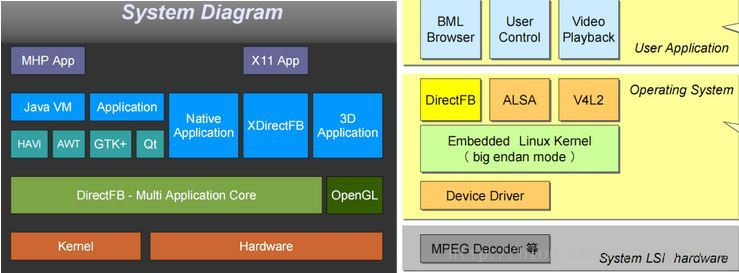
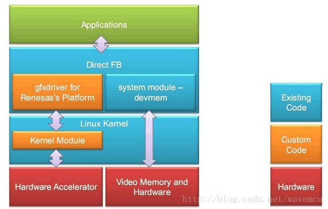
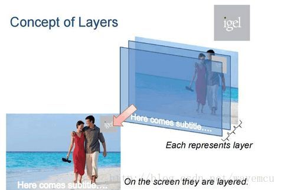
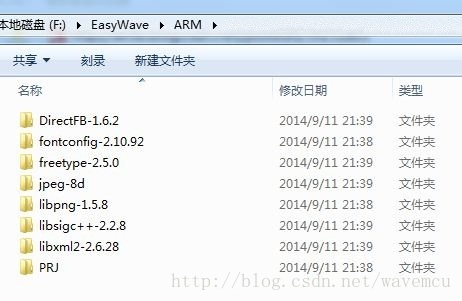
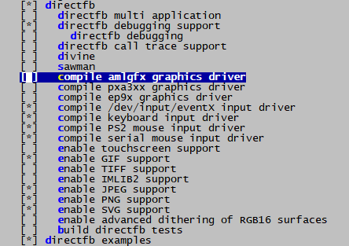
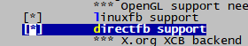
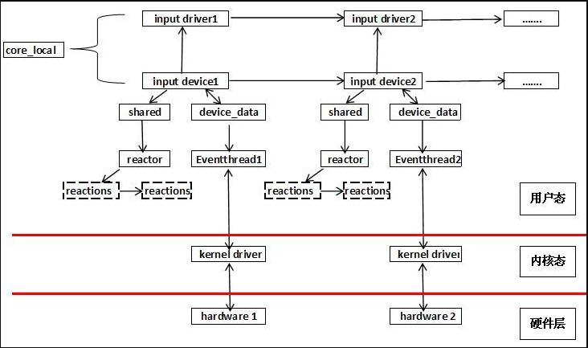
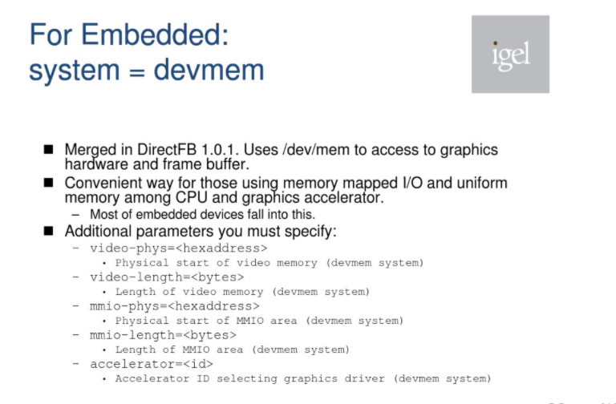

--

DirectFB是一个**轻量级**的**提供硬件图形加速**，输入设备处理和抽象的**图形库**，

它集成了支持**半透明的视窗系统**以及在LinuxFramebuffer驱动之上的**多层显示**。

它是一个用软件封装当前硬件无法支持的图形算法来完成硬件加速的层。

DirectFB是为嵌入式系统而设计。

**它是以最小的资源开销来实现最高的硬件加速性能。**


DirectFB是图形API

存在于Frame Buffer层之上

高级图形管理层如GTK+等之下的。


它可以以很小的系统资源占用来提供图形硬件加速功能，

提供类如多路a通道渲染模型等高级图像操作。

**它不修改Linux内核，除了标准C库没有其他库的依赖。**

应用在了基于Linux系统的DTV显示系统的研发和其他有关Linux显示界面的项目上。

支持市面上绝大多数显示卡，支持键盘、鼠标、遥控器、游戏手柄、触摸屏等输入设备。

支持JPEG、PNG、GIF、mpeg1/2、AVI、MOV、Flash、Video4Linux、DirectFB bitmap font和TrueType等音视频文件和字体。








 对于底层的驱动来说，DirectFB里面负责和硬件打交道的显卡的驱动（gfxdriver）和显示系统（system），**这里面gfxdriver是和各个硬件平台相关的，有可能需要自己写。** 为了更易于理解DirectFB，需要先介绍几个DirectFB里面的概念：

- Layers：代表互相独立的图形缓存。大多数嵌入式设备都有多个layer。多个layer根据对应的alpha值混合 在一起，从而显示出来。 
- Surface：代表一块预留的内存，来保存像素数据。**DirectFB中的Drawing，Bilitting操作就是基于 surface的**。Surface的内存根据设定，可以从系统中分配，也可以从显卡的内存中分配。
- Primary Surface：代表一个特殊layer的特殊surface。如果primary surface是单缓冲的，任何对于 primary surface的操作都会直接反应到显示屏上。
- Subsurface：是一个surface的子集，但是自身并不占有任何内存。
- Window/Windowstack：控制一个layer中的surface该显示什么。Window属于某个背景可以设定的layer。 **每个window有自己的surface，window用这个surface来组合图像**。 


 比如说下图中有三个Layer，最下面的Layer是一幅背景图，中间的Layer是一个透明的带有一个“igel”的Layer，最上面是一个透明的带有subtitle的Layer，**最后我们在显示器中看到的就是各个Layer的混合。**




**DirectFB的移植**

 如果要移植DirectFB需要用到以下的第三方库，如下图所示：




DirectFB需要用到第三方库简介：

- fontconfig-2.10.92：管理系统安装的字体，根据应用程序的字体配置，match（匹配）一种字体，填充match字体的各种属性。
- freetype-2.5.0：FreeType库是一个完全免费（开源）的、高质量的且可移植的字体引擎，它提供统一的接口来访问多种字体格式文件，包括TrueType, OpenType, Type1, CID, CFF, Windows FON/FNT, X11 PCF等。
- jpeg-8d：jpeg开源库
- libpng-1.5.8：PNG 库是用来创立和操作PNG 格式的图像文件，PNG 格式是设计来替代GIF，他对于更小范围的TIFF(标记图象文件格式)来说，有了非常多的进步和拓展并且减少了关于专利权的麻烦。
- libsigc++-2.2.8：libsigc++是实现类型安全回调的一个C++模板库。libsigc++提供了信号(signal)和槽(slot)的概念，实现了信号机制。slot对应一个回调函数，信号(signal)与槽(slot)相关联(attach)，当一个信号被发射(emit)时，相对应的槽被调用。
- libxml2-2.6.28：包含了对 XPath 表达式使用的支持来检索匹配一个指定准则的结点集。libxml2软件包提供允许用户操控XML文件的函数库,包含有读、修改和写XML和HTML文件支持。

directfb在buildroot里已经有集成了。所以不需要自己去移植了。

我们看看directfb的package里的内容。

这个就是指定gfx驱动的。我的当前是amlgfx这个名字。

```
DIRECTFB_GFX = \
	$(if $(BR2_PACKAGE_DIRECTFB_AMLGFX),amlgfx) \
	$(if $(BR2_PACKAGE_DIRECTFB_ATI128),ati128) \
	$(if $(BR2_PACKAGE_DIRECTFB_CYBER5K),cyber5k) \
	$(if $(BR2_PACKAGE_DIRECTFB_MATROX),matrox) \
	$(if $(BR2_PACKAGE_DIRECTFB_PXA3XX),pxa3xx) \
	$(if $(BR2_PACKAGE_DIRECTFB_I830),i830) \
	$(if $(BR2_PACKAGE_DIRECTFB_EP9X),ep9x)

ifeq ($(strip $(DIRECTFB_GFX)),)
DIRECTFB_CONF_OPTS += --with-gfxdrivers=none
else
DIRECTFB_CONF_OPTS += \
	--with-gfxdrivers=$(subst $(space),$(comma),$(strip $(DIRECTFB_GFX)))
endif
```

这样来指定input驱动。

```
DIRECTFB_INPUT = \
	$(if $(BR2_PACKAGE_DIRECTFB_LINUXINPUT),linuxinput) \
	$(if $(BR2_PACKAGE_DIRECTFB_KEYBOARD),keyboard) \
	$(if $(BR2_PACKAGE_DIRECTFB_PS2MOUSE),ps2mouse) \
	$(if $(BR2_PACKAGE_DIRECTFB_SERIALMOUSE),serialmouse) \
	$(if $(BR2_PACKAGE_DIRECTFB_TSLIB),tslib)

ifeq ($(BR2_PACKAGE_DIRECTFB_TSLIB),y)
DIRECTFB_DEPENDENCIES += tslib
endif

ifeq ($(strip $(DIRECTFB_INPUT)),)
DIRECTFB_CONF_OPTS += --with-inputdrivers=none
else
DIRECTFB_CONF_OPTS += \
	--with-inputdrivers=$(subst $(space),$(comma),$(strip $(DIRECTFB_INPUT)))
endif
```

在menuconfig里是这样呈现的。



当前qt的勾选了



qt这个选项表示设置默认的图形平台。

当前没有指定，所以运行qt example的时候，总要加上参数。

```
Available platform plugins are: linuxfb, minimal, offscreen, vnc.
```


1）dual frame buffers（双帧buffer）对于QT本身来说是不支持双buffer切换的，只能借助于DirectFB，但是实际测试的DirectFB会存在很多问题，比如有一些无法显示，效率不高，甚至还会crash等问题
2）目前我们使用的QT是直接使用GE2D将数据搬运到FB中，没有使用DirectFB


还是需要研究一下directfb。

我们的ge2d还是要借助directfb来做的。

我先不管ge2d的。现在把qt的后端配置为directfb。运行一下例子程序看看。

只需要改一下环境变量就好了。

但是现在运行完全看不到显示效果。

```
/usr/lib/qt/examples/quickcontrols2/wearable # ./wearable
(*) Direct/Thread: Started 'SigHandler' (2792) [CRITICAL - OTHER/0] <8388608>...

   ~~~~~~~~~~~~~~~~~~~~~~~~~| DirectFB 1.7.7 |~~~~~~~~~~~~~~~~~~~~~~~~~~
        (c) 2012-2015  DirectFB integrated media GmbH
        (c) 2001-2015  The world wide DirectFB Open Source Community
        (c) 2000-2004  Convergence (integrated media) GmbH
      ----------------------------------------------------------------

(*) DirectFB/Core: Single Application Core. (2021-05-11 03:34)
(*) Direct/Memcpy: Using libc memcpy()
(*) Direct/Thread: Started 'Fusion Dispatch' (2793) [MESSAGING - OTHER/0] <8388608>...
```

直接用dfbshow来测试看看。这个后面是跟一个图片的名字。

试了还是出不来。

先看一下directfb的代码。

directfb-1.7.7\gfxdrivers\amlgfx\ 这个下面，的确有ge2d的代码。


运行时的配置文件是/etc/directfbrc

```
#
system        = fbdev
fbdev         = /dev/fb0
mode = 720x720
depth = 32
pixelformat = ARGB
#no-hardware
hardware
#accelerator=49
# Disable Cursor
#no-cursor
#debug
#desktop-buffer-mode=backsystem
```

当前我是这样配置的。

选配directfb相关的组件，编译好，重新烧录镜像。

运行：

```
dfbshow ./home.png
```

可以正常显示。

```
export QT_QPA_PLATFORM=directfb
```

然后执行qt程序。显示的大小不对。

大概只显示了屏幕的1/4。

我改directfb的尺寸大小为1440x1440的。这个实际上跟屏幕尺寸对不上。

难道是pixelformat不对？

改一下看看。改成24bit，format为RGB的，大小还是改回720x720 。

还是不对。

跟format没有关系。

我现在再试，又是完全没有反应了。

现在看ge2d的中断，一个都没有。

那么就看看ge2d在设备树里有没有使能了。

是使能的。

ge2d有测试程序吗？

现在重新用dfbshow来显示图片。的确显示出来了。也不是我看错了。显示位置也正常。

但是ge2d的中断就是没有。

```
/usr/lib/qt/examples/quickcontrols2/wearable/images # dfbshow ./home.png
(*) Direct/Thread: Started 'SigHandler' (3344) [CRITICAL - OTHER/0] <8388608>...

   ~~~~~~~~~~~~~~~~~~~~~~~~~| DirectFB 1.7.7 |~~~~~~~~~~~~~~~~~~~~~~~~~~
        (c) 2012-2015  DirectFB integrated media GmbH
        (c) 2001-2015  The world wide DirectFB Open Source Community
        (c) 2000-2004  Convergence (integrated media) GmbH
      ----------------------------------------------------------------

(*) DirectFB/Core: Single Application Core. (2021-06-24 11:29) [ DEBUG ][ TRACE ]
(*) Direct/Memcpy: Using armasm_memcpy()
(*) Direct/Thread: Started 'Fusion Dispatch' (3345) [MESSAGING - OTHER/0] <8388608>...
(*) Direct/Thread: Started 'VT Switcher' (3348) [CRITICAL - OTHER/0] <8388608>...
(*) Direct/Thread: Started 'VT Flusher' (3349) [DEFAULT - OTHER/0] <8388608>...
(*) DirectFB/FBDev: Found 'OSD FB' (ID 0) with frame buffer at 0x3e300000, 24576k (MMIO 0x00000000, 0k)
(*) Direct/Thread: Started 'Keyboard Input' (3350) [INPUT - OTHER/0] <8388608>...
(*) DirectFB/Input: Keyboard 0.9 (directfb.org)
(*) Direct/Thread: Started 'PS/2 Input' (3351) [INPUT - OTHER/0] <8388608>...
(*) DirectFB/Input: IMPS/2 Mouse (1) 1.0 (directfb.org)
(*) Direct/Thread: Started 'PS/2 Input' (3352) [INPUT - OTHER/0] <8388608>...
(*) DirectFB/Input: IMPS/2 Mouse (2) 1.0 (directfb.org)
(*) Direct/Thread: Started 'Linux Input' (3353) [INPUT - OTHER/0] <8388608>...
(*) DirectFB/Input: aml_keypad (1) 0.1 (directfb.org)
(*) Direct/Thread: Started 'Linux Input' (3354) [INPUT - OTHER/0] <8388608>...
(*) DirectFB/Input: adc_keypad (2) 0.1 (directfb.org)
(*) Direct/Thread: Started 'Hotplug with Linux Input' (3355) [INPUT - OTHER/0] <8388608>...
(*) DirectFB/Input: Hot-plug detection enabled with Linux Input Driver
(*) DirectFB/Graphics: Generic Software Rasterizer 0.7 (directfb.org)
(*) DirectFB/Core/WM: Default 0.3 (directfb.org)
(*) Direct/Thread: Started 'Genefx' (3356) [DEFAULT - OTHER/0] <8388608>...
(*) FBDev/Mode: Setting 720x720 ARGB
(*) FBDev/Mode: Switched to 720x720 (virtual 720x720) at 32 bit (ARGB), pitch 2880
(*) FBDev/Mode: Setting 720x720 ARGB
(*) FBDev/Mode: Switched to 720x720 (virtual 720x720) at 32 bit (ARGB), pitch 2880
(*) Direct/Interface: Loaded 'PNG' implementation of 'IDirectFBImageProvider'.
(*) FBDev/Mode: Setting 720x720 ARGB
(*) FBDev/Mode: Switched to 720x720 (virtual 720x2160) at 32 bit (ARGB), pitch 2880
```

从这个运行打印看，这一句是不是表示当前使用的是软件的方式？

```
(*) DirectFB/Graphics: Generic Software Rasterizer 0.7 (directfb.org)
```

看了一下.config文件，的确是没有配置进来。

的确是我忘了配置了。

```
[*] GE2D library                          
()    amlogic libge2d local path (NEW)    
```

这个路径是需要指定的吧。

怎么指定呢？

参考这个

```
BR2_KERNEL_TOOLCHAIN_PATH [=$(TOPDIR)/../toolchain/gcc/linux-x86/aarch64/gcc-linaro-6.3.1-2017.02-x86_64_aarch64-linux-gnu]   
```

而路径，在这里有：

```
./ipc_driver.config:1:BR2_PACKAGE_AML_LIBGE2D_LOCAL_PATH="$(TOPDIR)/../hardware/aml-4.9/amlogic/libge2d"
```

选中 了libge2d，则自动把依赖的BR2_PACKAGE_AML_LIBION=y选上了。

这个也要配置路径。

路径是这里：

```
./ipc_driver.config:3:BR2_PACKAGE_AML_LIBION_LOCAL_PATH="$(TOPDIR)/../hardware/aml-4.9/amlogic/libion"
```

这样编译后，是不是只要把库放进去就好了。

重烧太耗费时间了。

先试一下。

应该就是这2个库。

```
./usr/lib/libge2d.so
./usr/lib/libion.so
```

不行的。

再看看配置，directfb应该也需要重新编译才行吧。怎么看有没有去调用ge2d的gfxdriver呢？

```
./a113_s400.config:2:#include "directfb.config"
```

directfb是一个单独的配置文件，默认有包含。

这个里面就这些。可能directfb默认就是用的fb。

```
BR2_PACKAGE_DIRECTFB=y
BR2_PACKAGE_FBDUMP=y
BR2_PACKAGE_FBGRAB=y
BR2_PACKAGE_FBSET=y
BR2_PACKAGE_FBTERM=y
BR2_PACKAGE_FB_TEST_APP=y
```

应该就是这个选项

```
./a113_s400.config:64:BR2_PACKAGE_DIRECTFB_AMLGFX=y
```

我当前是已经选中了的。

看这个变量怎么被使用的。

就是这里了。

```

DIRECTFB_GFX = \
        $(if $(BR2_PACKAGE_DIRECTFB_AMLGFX),amlgfx) \
        $(if $(BR2_PACKAGE_DIRECTFB_ATI128),ati128) \
        $(if $(BR2_PACKAGE_DIRECTFB_CYBER5K),cyber5k) \
        $(if $(BR2_PACKAGE_DIRECTFB_MATROX),matrox) \
        $(if $(BR2_PACKAGE_DIRECTFB_PXA3XX),pxa3xx) \
        $(if $(BR2_PACKAGE_DIRECTFB_I830),i830) \
        $(if $(BR2_PACKAGE_DIRECTFB_EP9X),ep9x)

ifeq ($(strip $(DIRECTFB_GFX)),)
DIRECTFB_CONF_OPTS += --with-gfxdrivers=none
else
DIRECTFB_CONF_OPTS += \
        --with-gfxdrivers=$(subst $(space),$(comma),$(strip $(DIRECTFB_GFX)))
endif
```

那么就把directfb都删掉重新编译一下。

看看编译时的打印，分析一下。

```
./configure 
--target=arm-linux-gnueabihf 
--host=arm-linux-gnueabihf 
--build=x86_64-pc-linux-gnu 
--prefix=/usr 
--exec-prefix=/usr 
--sysconfdir=/etc 
--localstatedir=/var 
--program-prefix="" 
--disable-gtk-doc 
--disable-gtk-doc-html 
--disable-doc 
--disable-docs 
--disable-documentation 
--with-xmlto=no 
--with-fop=no 
--disable-dependency-tracking 
--enable-ipv6 
--disable-nls 
--disable-static 
--enable-shared  
--enable-zlib 
--enable-freetype 
--enable-fbdev 
--disable-sdl 
--disable-vnc 
--disable-osx 
--disable-video4linux 
--disable-video4linux2 
--without-tools 
--disable-x11 
--disable-multi 
--disable-multi-kernel 
--enable-debug-support 
--enable-debug 
--enable-trace 
--disable-divine 
--disable-sawman 
--with-gfxdrivers=amlgfx 
--with-inputdrivers=linuxinput,keyboard,ps2mouse,serialmouse 
--enable-gif 
--disable-tiff 
--enable-png 
--enable-jpeg 
--enable-svg 
--disable-imlib2 
--with-dither-rgb16=none
```

重点是这里，已经配置了。

```
--with-gfxdrivers=amlgfx 
```

看到还有一个这样的so文件。

libdirectfb_amlgfx.so

直接重新烧录镜像吧。

再运行。

还是没有ge2d的。

这是为什么？

gfxdriver是怎么被使用的？

我估计是dlopen这种方式。


通过前面对DirectFB中用类似面向对象的设计方法分析后，同理可知我们的gfxdrivers也是一个个的so被加载进来的，那问题来，当gfxdrivers下存在多个gfx驱动的时它是匹配哪一个呢？

我们先找到初始化gfxdrivers的地方，它在文件src/core/gfxcard.c中，

```
/* Load driver */
     if (dfb_system_caps() & CSCAPS_ACCELERATION)
          dfb_gfxcard_find_driver( core );
```


这个从哪里获取硬件加速信息呢？

```cpp
int
dfb_system_get_accelerator( void )
{
     D_ASSERT( system_funcs != NULL );

     return system_funcs->GetAccelerator();
}
```

在directfbrc里，有这样的配置项：

```
system        = fbdev
fbdev         = /dev/fb0
```

这个是不是说默认使用的的fb呢？

如果我要改成ge2d的。配置应该怎么改？

```
[no-]hardware
Turns hardware acceleration on. By default hardware acceleration is auto-detected. If you disable hardware acceleration, the driver for your graphics card will still be loaded and used to access additional display layers (if there are any), but all graphics operations will be performed by the software renderer.
```

我还是先想办法测试一下ge2d是否正常。

这里有个测试报告，看看。不合适。这个里面提到的我操作不了。

https://wiki-china.amlogic.com/Platform/ChipBringup/AXG/TestReports/GE2D

ge2d_load_test 这个二进制在哪里？

在板端输入df，再按tab补全，可以看到不少的命令，这些都是directfb相关的命令。

例如df_dok。这个命令执行输入就可以了。是一直进行各种性能测试。

可以看到显示是正常的。

这个只能说directfb正常工作了。

要让ge2d工作，只需要在directfbrc里，把这一行打开：

```
#accelerator=49
```

这个是amlgfx对应的宏的数字。

现在运行df_dok。可以看到ge2d有中断了。

但是当前directfb+qt的方式，之前就验证是有问题。

所以采用的实际是：qt+ge2d的方式，直接给qt打patch来对接ge2d。

我没有打开directfb之前的配置，按道理就是应该qt+ge2d的方式了。

但是我当前调试的是5.12版本，而之前是在5.8版本里放的patch文件。


# directfbrc配置

我当前的打印信息比较少。可不可以在directfbrc文件里配置日志级别？

在src/misc/conf.c里，dfb_config_set函数里，有对各个参数的解析。这里可以看出支持哪些参数。

DFBConfig 还有这个结构体。

```
     bool      software_only;                     /* disable hardware acceleration */
     bool      hardware_only;                     /* disable software fallbacks */
```

config_usage_strings 这个列得很清楚了。

```

```


directfbrc 是 DirectFB 的配置文件。

 它被所有的 DirectFB 应用程序在启动时读取，

有 两个这样的文件，

一个是存放在 /etc/direcfbrc ，是个全局的，

另一个是存放在 $HOME/.directfbrc ，它是个局部的，可以覆盖系统的设置。

需要注意的是，这两个文 件都不是默认存在的，是需要你自己建立的

在 *directfbrc* 使用的参数也可以在命 令行里传递给 *DirectFB* 应用程序，只需要加上前缀： *--dfb:*

*directfbrc* 文件每一行包含一个变量。注释行以井号“ *#* ”开始，一直到行尾。空行被忽略。

许多参数只是一种开关， 控制着一些特性的开 */* 关。这些开关选项有一个 *no-* 变量，可以关闭相应的特性。下面介绍一些实用的参数和一些默认的参数。

## system

*system=<system>*

​    设定使用的图形系统。默认使用 *Linux frame buffer (fbdev)* ，但你也可以在 *SDL* （ *sdl* ）上运行 *DirectFB* 应用程序。其它的系统在将来可能会被扩展近来。

那么可以的取值是：x11、drmkms、fbdev。

```
if (getenv( "DISPLAY" ))
          dfb_config->system = D_STRDUP( "x11" );
     else if (!access( "/dev/dri/card0", O_RDWR ))
          dfb_config->system = D_STRDUP( "drmkms" );
     else if (!access( "/dev/fb0", O_RDWR ))
          dfb_config->system = D_STRDUP( "fbdev" );
```


# dfbinfo

当前我的板子的情况：

```
Screen (00) FBDev Primary Screen            (primary screen)
   Caps: VSYNC POWER_MANAGEMENT 

     Layer (00) FBDev Primary Layer             (primary layer)
        Type:    GRAPHICS 
        Caps:    SURFACE BRIGHTNESS CONTRAST SATURATION 


Input (01) tslib touchscreen 0             (primary mouse)
   Vendor  ID: 0x0000
   Product ID: 0x0000
   Type: MOUSE 
   Caps: AXES BUTTONS 
   Max. Axis: 1
   Max. Button: 0

Input (00) Keyboard                        (primary keyboard)
   Vendor  ID: 0x0000
   Product ID: 0x0000
   Type: KEYBOARD 
   Caps: KEYS 
   Min. Keycode: 0
   Max. Keycode: 127
```


# ge2d对接

```
static GraphicsDriverFuncs driver_funcs = {
     .Probe              = driver_probe,
     .GetDriverInfo      = driver_get_info,
     .InitDriver         = driver_init_driver,
     .InitDevice         = driver_init_device,
     .CloseDevice        = driver_close_device,
     .CloseDriver        = driver_close_driver
};
```

对接是这样一个结构体的实现。

driver_probe 这个直接返回1就好了（bool语义）

driver_get_info 这个就填充一些字符串信息。

driver_init_driver

```
这个就是重要入口。
2个数据结构
AMLGFX_DriverData
AMLGFX_DeviceData

amldrv->ge2d_fd = open("/dev/ge2d", O_RDWR);

GraphicsDeviceFuncs
这个是重要的函数结构体。需要实现十几个函数。

```


DFBAccelerationMask

这个枚举，列举了可以进行加速的操作。

```
fill rectangle
draw rectangle
draw line
fill triangle
fill trapezoid 不规则四边形
fill quadrangle 四边形。
fill span 
draw monoglyph
blit 块传输
stretch blit
text triangle
blit2 
tile blit
draw string
all
all drawn
all blit
```

总的调用逻辑是：填充一些结构体，然后ioctl传递下去。

目前看，只实现了这几个函数。

```
	funcs->CheckState    = amlCheckState;
	funcs->SetState      = amlSetState;
	funcs->EngineSync    = amlEngineSync;
	funcs->EngineReset   = amlEngineReset;
	funcs->FlushTextureCache  = amlFlushTextureCache;

	funcs->FillRectangle = amlFillRectangle;
	funcs->Blit          = amlBlit;
	funcs->StretchBlit = amlStretchBlit;
```

还有几个还是空函数。

可以对比看一下VMware的实现。

之前测试ge2d在df_dok测试时，可以生效。

但是现在再次测试，又没有ge2d的中断了。

偶尔有。

从打印看，驱动是找到了。

```
driver_probe find FB_ACCEL_AML_GE2D
amldrv->fb.phys is 0x3e300000, size is 25165824
(*) DirectFB/Graphics: aml vendor aml 0.1 (aml beijing)
```

从之前的结果看fill-rect是肯定有用的。

加打印看看。

可以看到是aml的ge2d，只支持ARGB这一种像素格式。

我加上配置。现在ge2d有中断。

但是之前的测试结果就是不对的。凡是用到了ge2d的。显示都没有动。

所以看起来cpu占用率就低了。

加打印跟踪一下。

填充函数主要是这3个。

```
funcs->FillRectangle = amlFillRectangle;
	funcs->Blit          = amlBlit;
	funcs->StretchBlit = amlStretchBlit;
```

FillRectangle 以这个为例。

上层的gfxcard.c。


# qt和directfb的对接

配置：

```
export QT_QPA_PLATFORM=directfb
export QT_QUICK_BACKEND=softwarecontext
```

执行：/usr/lib/qt/examples/quick/text

```
Not support amlBlit please check configure
=====GE2D_NOT_SUPPORT=====
!!!!!!aml_state.c 460 > DSPD_SRC_OVER flags[0x3]***NULL
Not support amlBlit please check configure
=====GE2D_NOT_SUPPORT=====
!!!!!!aml_state.c 460 > DSPD_SRC_OVER flags[0x3]***NULL
Not support amlBlit please check configure
=====GE2D_NOT_SUPPORT=====
!!!!!!aml_state.c 460 > DSPD_SRC_OVER flags[0x3]***NULL
Not support amlBlit please check configure
=====GE2D_NOT_SUPPORT=====
!!!!!!aml_state.c 460 > DSPD_SRC_OVER flags[0x3]***NULL
Not support amlBlit please check configure
=====GE2D_NOT_SUPPORT=====
!!!!!!aml_state.c 460 > DSPD_SRC_OVER flags[0x3]***NULL
Not support amlBlit please check configure
=====GE2D_NOT_SUPPORT=====
```

把/etc/directfbrc里的format从ARGB改成RGB。

至少可以显示图形出来了。

虽然尺寸还不对。

是因为directfb不能自动缩放导致的？

我找一个720x720的图片放进来看看。

```
(*) Direct/Interface: Loaded 'BMP' implementation of 'IDirectFBImageProvider'.
(!) IDirectFBImageProvider_BMP: Unsupported compression 3!
CreateImageProvider -> The requested operation or an argument is (currently) not supported

Caught exception!
  -- CreateImageProvider -> The requested operation or an argument is (currently) not supported
(*) FBDev/Mode: Setting 720x720 RGB16
```

用dfbshow来进行显示看看。

不行。

我把bmp文件转成jpg的再试一下。可以正常显示。

为什么直接使用fb可以素材自动适应屏幕的大小。

而directfb的不行？

看之前的邮件，还提到了directfb慢的问题。

当前首先是要解决显示尺寸的问题。

然后才能讨论效果和效率。

就选择wearable这个例子来看。


```
 fusion_skirmish_init( 0x4d3e4, 'Display Layer 0' )
 primaryInitLayer()
 dfb_fbdev_read_modes()
 dfb_fbdev_test_mode_simple( mode: 0x4d458 )
 dfb_fbdev_mode_to_var( mode: 0x4d458 )
   -> resolution   720x720
   -> virtual      720x720
   -> pixelformat  RGB32
   -> buffermode   FRONTONLY
   => SUCCESS

```


```
dfb_surface_lock_buffer2( accessor 0x1, access 0x3, role 1, count 0, eye 1 ) <- 320x480 ARGB
```


# directfb和tslib结合

```
tslib-devices=/dev/input/event1
```

不行，我看了一下板端的目录。

```
/usr/lib/directfb-1.7-7/inputdrivers # ls
libdirectfb_keyboard.so     libdirectfb_ps2mouse.so
libdirectfb_linux_input.so  libdirectfb_serialmouse.so
```

tslib我配置了，不知道为什么没有编译进来。

是编译配置过程有问题。

```
checking for TSLIB... no
checking for TSLIB... no
configure: WARNING: *** no tslib -- tslib driver will not be built.
```

```
checking for sysroot... no
checking for a working dd... /bin/dd
checking how to truncate binary pipes... /bin/dd bs=4096 count=1
checking for arm-linux-gnueabihf-mt... no
```

这里就涉及到configure过程，检查sysroot，是检查的服务器的，还是检查buildroot的host目录的。

按道理应该用host的。

但是这里为什么没有用呢？

这样指定sysroot。

```
DIRECTFB_CONF_OPTS += --with-sysroot=$(STAGING_DIR)
```

但是加上后，还是不行。

看一下config.log。

```
configure:24379: $PKG_CONFIG --exists --print-errors "tslib-1.0 >= 1.0.0"
Package tslib-1.0 was not found in the pkg-config search path.
Perhaps you should add the directory containing `tslib-1.0.pc'
```

那么问题的关键就在于指定pkg-config的搜索路径。

在package目录下grep搜索。找到有的package里的mk文件里有这个。

```
export PKG_CONFIG_PATH=$(STAGING_DIR)/usr/lib/pkgconfig:$(PKG_CONFIG_PATH)
```

那我也加上这个。

还是不行。

下面这个目录有。

```
ls ./output/axg_s400_a6432_release/target/usr/lib/pkgconfig/
++dfb.pc              directfb-internal.pc  directfb.pc           direct.pc             fusion.pc             tslib.pc 
```

要的就是tslib.pc 这个文件所在的目录。

搜索一下这个文件。

这里有：

```
./output/axg_s400_a6432_release/host/arm-linux-gnueabihf/sysroot/usr/lib/pkgconfig/tslib.pc
```

那就是这个目录没错啊。

这样来查看

```
PKG_CONFIG_PATH=/mnt/nfsroot/hanliang.xiong/work/s400_gui/code/output/axg_s400_a6432_release/host/arm-linux-gnueabihf/sysroot/usr/lib/pkgconfig pkg-config --list-all |grep tslib
tslib                               tslib - Touchscreen Access Library
```

是存在的。

我当前的版本是1.21的，也足够高。

关键是这里：

```
configure:24379: $PKG_CONFIG --exists --print-errors "tslib-1.0 >= 1.0.0"
```

tslib-1.0 这个是不对的，会找不到。写tslib就可以。

这个是哪里指定的？

这个是当前的configure文件里写死的。的确是directfb没有维护导致的。

改configure.in有用吗？

应该没用。当前是直接用configure文件的。

我看加amlgfx的，也是直接改configure文件的。

不对，configure.in也改了。

是都要改？

从编译打印看，是使用了configure.in。

```
aclocal: warning: autoconf input should be named 'configure.ac', not 'configure.in'
```

感觉确实年久失修。warning一大堆。

我先只改configure.in，看看有用没。

可能这样来做简单点：把tslib.pc改名为tslib-1.0.pc。看看行不行。

可以。改名后，把pc文件里的名字也改一下。

再重新编译directfb，可以看到已经报告可以检测到tslib了。

直接把编译出来的so文件，拷贝到板端对应的目录下。

运行qt程序。

```
(*) Direct/Thread: Started 'tslib Input' (24409) [INPUT - OTHER/0] <8388608>...
(*) DirectFB/Input: tslib touchscreen 0 0.1 (tslib)
```

可以看到tslib已经被枚举出来。

但是触摸没有效果。

有没有一个directfb的测试tslib的程序？

有一个df_input的测试程序。

看一下代码，device_id默认是0, 这个代表了那种设备？

```
DFBInputDeviceID  device_id = 0;
```

输入设备id的宏定义

```
#define DIDID_KEYBOARD        0x0000    /* primary keyboard       */
#define DIDID_MOUSE           0x0001    /* primary mouse          */
#define DIDID_JOYSTICK        0x0002    /* primary joystick       */
#define DIDID_REMOTE          0x0003    /* primary remote control */
#define DIDID_ANY             0x0010    /* no primary device      */
```

也没有看到tslib的。那么试一下mouse的行不行。

不对，tests目录的东西，默认没编译。

需要加上这个：

```
ifeq ($(BR2_PACKAGE_DIRECTFB_TESTS),y)
DIRECTFB_CONF_OPTS += --with-tests
endif
```

现在直接运行dfbtest_input，会退出。

打开debug。看看打印。

出错是这里：

```
(*) DFBTest/Input: Setting sensitivity to 0x100, please move mouse!
(-) [dfbtest_input    15772.126,495] (28743) DirectFB/CoreInputDevice:         IInputDevice_Real::SetConfiguration()
(-) [dfbtest_input    15772.126,563] (28743) Core/Input:                           dfb_input_device_set_configuration( 0x42a48, 0xffdb4d24 )
(!) DFBTest/Input: SetConfiguration() failed!
```

对应的错误码是DR_UNSUPPORTED

这个函数是枚举所有的input设备。

```
dfb_input_enumerate_devices( GetInputDevice_Callback, &context, DICAPS_ALL );
```

driver_open_device函数，这里注册名字的。

```
snprintf( info->desc.name,
               DFB_INPUT_DEVICE_DESC_NAME_LENGTH, "Keyboard" );
```

我修改传递给dfbtest_input的-d参数，0和1都不行。

2的错误就不一样了。直接是找不到。

```
(!) DFBTest/Input: GetInputDevice( 2 ) failed!
```

我到目录下，去把除了linux_input和tslib之外的so文件都删除。

现在按道理0就是tslib了。

但是报错。

```
(!) DFBTest/Input: GetInputDevice( 0 ) failed!
```

看directfb里的tslib的代码

```
info->desc.type       = DIDTF_MOUSE;
info->desc.caps       = DICAPS_AXES | DICAPS_BUTTONS;
info->desc.max_axis   = DIAI_Y;
info->desc.max_button = DIBI_LEFT;
```

可见，触摸屏是当成mouse来处理的。

能力只有坐标事件和按钮事件。

只有鼠标的单击能力。

那么当前就是这个函数出错

```
ret = dfb->GetInputDevice( dfb, device_id, &device );
```

那就要看初始化的时候，有没有把input设备找到并加入到链表。

从之前的打印里，可以看到

```
(-) [dfbtest_input    15756.132,206] (28743) Core/Input:                                                 -> probing 'tslib Input Driver'...
(-) [dfbtest_input    15756.160,060] (28743) Core/Input:                                                 -> 1 available device(s) provided by 'tslib Input Driver'.
(-) [dfbtest_input    15756.161,733] (28743) Direct/Thread:                                                direct_thread_create( INPUT, 0xf69b6d54(0x39e60), 'tslib Input' )
```

把keyboard放进去，就可以的。

枚举出来是这样：

```
xhl -- id:1,name:tslib touchscreen 0 
xhl -- id:0,name:Keyboard 
```

现在不是枚举不到设备，而是SetConfigure失败。

我把SetConfigure注释掉。

也还是没有效果。


看tools默认也没有编译，改一下directfb.mk，编译tools。

https://blog.csdn.net/csdnxw/article/details/2630389


direct_trace_print_stack

这个打印出错堆栈，一般的错误也会打印，例如没有实现的函数。


我自己写一个简单的测试程序来测试tslib吧。

evtest确认tslib工作正常。

然后用dfb的接口来写简单的测试程序。

不用dfbtest_input了。

IDirectFBEventBuffer_WaitForEvent

那么问题就在于ts_read函数没有得到内容。

这又是为什么？

把ts的测试工具运行一下看看。

在tslib/tests目录下。

我好像有点知道了。 

把ts.conf的module_raw input改成module input。

运行dfbtest_input会找不到tslib。

这样情况下，运行ts_finddev也会报错

```
No raw modules loaded.
ts_config: No such file or directory
```

--enable-input-evdev

那么可能是这个导致的。

不是。

我先把tslib里的ts_read改成ts_read_raw看看。

改了也还是不行。

现在又可以了。


## 最终的改法

一个疑问：tslib没有host编译，怎么在host下面有？

tslib.pc 这个文件只来自于tslib目录。

单独把tslib编译一下，看看打印。

这个就是取决于tslib里的编译脚本的行为了。默认就是安装的。

我需要给tslib.mk加上一行，把tslib.pc拷贝一个tslib-1.0.pc。


# argb还是rgb

当前argb是不行的，rgb是可以的。

这个是谁来决定的？

屏幕参数决定的？

不对，我现在试了，RGB和ARGB都是可以的。

而且效果没有区别。

但是使用ge2d的时候，

我试了这样是正常的：

```
depth = 24 #32也可以。
pixelformat = RGB
```

pixelformat是ARGB是一定不正常。

不要指定这2个参数。

运行qt会自动切换的。

```
(*) Direct/Thread: Started 'Genefx' (19068) [DEFAULT - OTHER/0] <8388608>...
(*) FBDev/Mode: Setting 720x720 RGB16
(*) FBDev/Mode: Switched to 720x720 (virtual 720x720) at 16 bit (RGB16), pitch 1440
(*) FBDev/Mode: Setting 720x720 RGB16
(*) FBDev/Mode: Switched to 720x720 (virtual 720x1440) at 16 bit (RGB16), pitch 1440
```

primarySetRegion这个函数打印的？

但是不对啊，现在为什么还是走fbdev的？

走应该还是要走。

```
Not support amlBlit please check configure
```

这个打印又是为什么呢？

现在先不管

重点先看这个。

```
 (!!!)  *** UNIMPLEMENTED [fusion_get_fusionee_pid] *** [fusion.c:4147]
```

这个函数的确是没有实现。

```
DirectResult
fusion_get_fusionee_pid( const FusionWorld *world,
                         FusionID           fusion_id,
                         pid_t             *ret_pid )
{
     D_UNIMPLEMENTED();

     return DR_UNIMPLEMENTED;
}
```

lcd支持的像素格式，是怎么确定的？

我用自己的fb_basic_info运行，得到的数据：

```
/data # ./fb_basic_info
-----------fix info-------------
                        id:OSD FB
                        smem_start:1043333120
                        smem_len:25165824
                        type:0
                        type_aux:0
                        visual:2
                        xpanstep:1
                        ypanstep:1
                        line_length:0
                        mmio_len:1440
                        accel:0

--------------------------------
-----------var info-------------
                                                xres:720
                        yres:720
                        xres_virtual:720
                        yres_virtual:720
                        xoffset:0
                        yoffset:0
                        bits_per_pixel:16
                        nonstd:0
                        activate:0
                        height:0
                        width:0
                        accel_flags:0
                        pixclock:0
                        left_margin:0
                        right_margin:0
                        upper_margin:0
                        lower_margin:0
                        hsync_len:0
                        vsync_len:0
                        vmode:0

--------------------------------
```

bits_per_pixel:16

现在需要看一下osd fb的驱动。

看看设备树

```
display_mode_default = "1080p60hz";
```

```
ret = of_property_read_u32_array(pdev->dev.of_node,
					"display_size_default",
					&var_screeninfo[0], 5);
这里是把display_size_default = <720 720 720 1440 32>;
这个信息给解析出来。填充给fb_var结构体。
但是按照这个，bpp应该是32位的啊。
```

重启一下机器，从kernel的开机打印

```
[   11.156859@0]- fb: init fbdev bpp is:32
[   11.161115@2]- fb: set osd0 reverse as NONE
[   11.174060@0]- fb: osd probe OK
```

可以看到是32bit的。

我这时候再执行一下fb_basic_info。看到的信息是这样：

```
-----------fix info-------------
                        id:OSD FB 
                        smem_start:104333312
                        smem_len:25165824
                        type:0
                        type_aux:0
                        visual:2
                        xpanstep:1
                        ypanstep:1
                        line_length:0
                        mmio_len:2880
                        accel:0

--------------------------------
-----------var info-------------
                                                xres:720
                        yres:720
                        xres_virtual:720
                        yres_virtual:1440
                        xoffset:0
                        yoffset:0
                        bits_per_pixel:32
                        nonstd:0
                        activate:0
                        height:0
                        width:0
                        accel_flags:0
                        pixclock:0
                        left_margin:0
                        right_margin:0
                        upper_margin:0
                        lower_margin:0
                        hsync_len:0
                        vsync_len:0
                        vmode:0

--------------------------------
```

难度变化的是因为directfb执行时修改导致的？

应该是的。

现在我不在directfbrc里填入depth和pixelformat。

运行基于directfb的qt，打印这个。

```
(*) FBDev/Mode: Setting 720x720 RGB32
(*) FBDev/Mode: Switched to 720x720 (virtual 720x720) at 32 bit (RGB32), pitch 2880
(*) FBDev/Mode: Setting 720x720 RGB32
(*) FBDev/Mode: Switched to 720x720 (virtual 720x1440) at 32 bit (RGB32), pitch 2880
```

但是这个是没有任何的显示。


我给一张720x720的jpg图片。用df_dok --load-image的方式显示，不正常。

用dfbshow的方式显示，图片正常。

这二者有什么不同？

df_dok里是这样：

```
IDirectFBImageProvider *provider;

          /* create a surface and render an image to it */
          DFBCHECK(dfb->CreateImageProvider( dfb, filename, &provider ));
          DFBCHECK(provider->GetSurfaceDescription( provider, &dsc ));
          if (imageformat)
               dsc.pixelformat = imageformat;
          if (!surface)
               DFBCHECK(dfb->CreateSurface( dfb, &dsc, &surface ));
          DFBCHECK(provider->RenderTo( provider, surface, NULL ));
          DFBCHECK(provider->Release( provider ));
```

dfbshow是c++ demo。继承了DFBApp这个类。

代码看起来很接近。

看一下二者的打印。

db_dok的最后几行打印

```
(*) FBDev/Mode: Setting 720x720 RGB32
(*) FBDev/Mode: Switched to 720x720 (virtual 720x720) at 32 bit (RGB32), pitch 2880
(*) Direct/Interface: Loaded 'PNG' implementation of 'IDirectFBImageProvider'.
(*) Direct/Interface: Loaded 'FT2' implementation of 'IDirectFBFont'.
(*) FBDev/Mode: Setting 720x720 RGB32
(*) FBDev/Mode: Switched to 720x720 (virtual 720x720) at 32 bit (RGB32), pitch 2880
(*) Direct/Interface: Loaded 'GIF' implementation of 'IDirectFBImageProvider'.
```

dfbshow的最后几行打印：

```
(*) FBDev/Mode: Setting 720x720 RGB32
(*) FBDev/Mode: Switched to 720x720 (virtual 720x720) at 32 bit (RGB32), pitch 2880
(*) FBDev/Mode: Setting 720x720 RGB32
(*) FBDev/Mode: Switched to 720x720 (virtual 720x1440) at 32 bit (RGB32), pitch 2880
(*) Direct/Interface: Loaded 'JPEG' implementation of 'IDirectFBImageProvider'.
(*) FBDev/Mode: Setting 720x720 RGB32
(*) FBDev/Mode: Switched to 720x720 (virtual 720x2160) at 32 bit (RGB32), pitch 2880
```

可以看到df_dok，virtual的尺寸不同。

而且是使用了png的provider。

那我直接给一张png格式的图片。

一闪而过。

这个不是关键。

关键还是qt为什么显示的尺寸不能铺满。

我显示一张320x320的图片看看。

用dfbshow来显示。这样即使是尺寸不够，也是居中显示的。

当前的directfb是1.7.7，看看有没有更新的版本。

最新的release确实是这个。

我自己写一个720x720的app来测试一下。

先运行我的demo_qt。

linuxfb的时候，是居中显示这个按钮，周围都是白色背景。

directfb的时候，则是在左上角显示这个按钮，剩余部分都是黑色。

还显示了一个鼠标。

我把directfb的input先都关闭。

我直接在directfbrc里，加上no-cursor。这样运行就卡住没有显示。

卡住不是加no-cursor导致的。好像是我/cat /dev/urandom > /dev/fb0 之后就会出现这种情况。

进一步测试发现，只要直接用过/dev/fb0，之后及时把当前的进程杀掉，directfb再用就会卡住。

这是为什么？


我把尺寸指定为720x720，则可以达到跟linuxfb一样的显示效果。

那就先这样吧。

fbdev的信息，可以从/sys/class/graphics/fb0目录下看到。


我先把wearable的保证在directfb正常跑起来。哪怕用最笨的方法。

我先把所有的素材都缩放到720x720对应的大小。

把tslib配置正常。

我先只把wearable.qml里的2个320改成720，没有什么变化。

我看background-light.png，就是当前的背景图片，大小是640x640的。

我直接用vexpress里的directfb来试一下看看。


amlogic支持的加速操作。

```
#define AML_SUPPORTED_DRAWINGFLAGS (DSDRAW_NOFX |DSDRAW_BLEND)

#define AML_SUPPORTED_DRAWINGFUNCTIONS (DFXL_FILLRECTANGLE)

#define AML_SUPPORTED_BLITTINGFLAGS ( DSBLIT_BLEND_ALPHACHANNEL | DSBLIT_BLEND_COLORALPHA | \
											DSBLIT_COLORIZE | \
											DSBLIT_SRC_PREMULTIPLY |DSBLIT_SRC_COLORKEY | \
											DSBLIT_ROTATE180 )

#define AML_SUPPORTED_BLITTINGFUNCTIONS (DFXL_STRETCHBLIT | DFXL_BLIT)
```

# directfb卡住

复现条件：

```
1、随便用某种方式直接使用一下/dev/fb0。例如 cat /dev/urandom > /dev/fb0，然后ctrl+c结束掉。
2、用directfb作为后端，打开一个qt程序，则会卡住。
```

打开directfb里的debug。可以看到最后的几行打印是：

```
(-) [animation        650.873,767] ( 3505) FBDev/VT:                         dfb_vt_initialize()
(-) [animation        650.873,882] ( 3505) FBDev/VT:                         vt_get_fb( 4 )
(-) [animation        650.873,925] ( 3505) FBDev/VT:                           -> -1
(-) [animation        650.873,949] ( 3505) FBDev/VT:                         vt_set_fb( 4, -1 )
```

这里的vt是指什么？VirtualTerminal

有必要使能这个吗？

是这样调用的：

```
if (dfb_config->vt) {
          ret = dfb_vt_initialize();
          if (ret)
               return DFB_INIT;
     }
```

那么就是vt这个默认是使能的。

在directfbrc里加上no-vt。

这样就不会再卡住了。


# directfbrc调整

```
# 需要加上这个，避免卡住。
no-vt 

```


# 像素深度

像素深度（bits per pixel，简称bpp）

一个像素的颜色在计算机中由多少个字节数据来描述。计算机中用二进制位来表示一个像素的数据，用来表示一个像素的数据位越多，则这个像素的颜色值更加丰富、分的更细，颜色深度就更深。

一般来说像素深度有这么几种：1位、8位、16位、24位、32位。

像素深度bpp和像素格式pix_format关系：

像素格式是人为规定的用来填充像素深度bpp的。比如像素深度为16，说明用16位二进制表示一个像素，那到底是怎样的数据形式来表示填充呢，人为可以规定RGB565,也可以规定BGR565。这个格式就要看具体驱动和应用代码了。


# df_dok

只需要研究这一个测试程序就可以了。

查看--help，可以看到很多的选项，可以测试不同的子项目。

以df_dok --fill-rect来作为典型测试。

当前使用硬件加速，不正常。并没有继续进行后面的测试。

直接使用fb，则是正常的。

查看ge2d的中断数，刚开始运行会有，过一会就没有中断增加了。


# directfb

面对嵌入式设备的特殊需求环境，我们为图形加速和图形增强支持开发了一个小巧、强大和易于使用的技术：directfb。

directfb是一个瘦函数库，

为开发者提供硬件加速，

输入设备处理，

并在Linux FB设备之上抽象、集成了支持**半透明窗口和多层显示**的窗口系统。

它是一个完全的硬件抽象层，

**在每个图形操作上都具有软件后备机制，**

用于那些不被底层硬件支持的功能。

DFB让嵌入式系统图形功能更强大，并在Linux上建立了一个新的标准。


DirectFB就是一个全能系统，麻雀虽小五脏俱全。

DirecttFB源码，可以了解很多方面的技术, 

包括Framebuffer, Graphics Accelerate Card,鼠标及键盘等外设的事件处理，

Font, Graphics Drawing等，

另外还可以看到一下很有用的编程技巧，

例如C++思想在C语言中的运用，动态加载链接库，双buffer的具体实现，进程通信，多进程的控制和管理等。


几个容易混淆的概念：surface, screen, layer。

surface：是用户作图的一块方形区域，对应一块内存，用户可以任意创建多个surface，surface与屏幕没有任何联系。

screen: 就是用户看到的屏幕，实际上对应的是系统中特定的一块内存，写到这块内存的东西会自动显示到屏幕上，这块内存可以通过grahics system操作，如frame buffer等， DFB的用户并不能直接操作这块内存。surface 上的东西只有拷贝到这块内存中才会显示出来。

layer: 一般是一个与graphics driver 有关的物理特性，不同的硬件可能支持的layer个数不同，种类也不同。不同的layer对应不同的graphics card中的不同内存。一个典型的应用是下面的一个layer显示video， 上面的layer显示字幕。layers上的内容在现实到屏幕之前需要做混合等处理。


**即使系统存在硬件加速，DFB仍然提供了上层用户绕过硬件加速而只使用纯软件的画图。**

**这在调试硬件或比较软硬件性能时很有帮助。这是通过directfbrc中的'hardware'指定的。**


我们先看一下用户是如何调DirectFB来画线的,一般流程如下：

 

·    DirectFBInit( &argc, &argv );

·    DirectFBCreate(&dfb);

·    dfb->CreateSurface(dfb, &sdsc, &primary);

·    primary->DrawLine(primary, 0, 0, 100, 200);

 

上面的代码就是创建一个surface并在其上画一条从（0,0）到（100,200）的斜线。


现在我们看看input_core的初始化。

在进入具体的代码之前，我们先总结一下input_core这个核心部件的主要功能。

我们知道计算机系统的外设有很多，不同的外设，接口不同，功能不同，

提供的数据类型也不尽相同。

例如键盘的事件是KEY_RELEASE 或KEY_PRESS, 

而鼠标的事件是BUTTON_PRESS或BUTTON_RELEAASE,

还有触摸屏，游戏杆等等。

所以input_core的功能之一就是统一不同输入设备的差异。

第二，上层可能有多个进程在等待某个输入，而下层的输入设备并不知道，

这种向多个进程分发事件的功能也是input core完成的。

第三，系统中可能有多个设备对应同一个driver，DFB需要建立设备与driver的对应关系。


上面有关fusion和reactor时，我们仍然只考虑单进程的情况。

在input_core_part初始化完成后，我们最终得到一个数据结构core_local, 将input drivers, input devices, reactors联系起来。其结构图如下：





双缓存是画图时一个常用的技术，它的基本原理是在其中一个缓存中作图，完成后提交显示，同时在另一块缓存中继续作图，这样两块缓存交替画图-显示，实现了两者的同步进行，提高了效率。

在DirectFB中,一个缓存实际就是一块内存。

DFB支持两种缓存分配方式:

(1)用户自己分配，并在createSurface是将该内存地址传递给DFB，这种方式需要在createSurface时指定DSCAPS_PREMULTIPLIED属性

(2）DFB自动分配，大部分用户使用这种方式。


DirectFB支持双缓存或三缓存，用户编程时，只需在调用dfb->CreateSurface 时指定DSCAPS_DOUBLE或DSCAPS_TRIPLE即可。而除此以外，多缓存对于用户是透明的。


我们在DirectFB初始化中了解到gfx driver, input driver等都是在DirectFBCreate（）时完成初始化，也就是说在用户真正使用之前，这些driver已经准备就绪。

 而字体（font）与此不同，只有用户明确使用字体时，才会进行初始化及资源分配，

**类似还有Image和Video，在DirectFB中它们通称为Interface。**

源码对应的目录就是DirectFB-1.4.0/Interfaces。

在DirectFB运行环境中，interface的存在形式也是动态链接库。对应的目录是：lib/directfb-1.4.0/interfaces/IDirectFBFont等。


当前的directfb支持三种字体文件：

（1）**FreeType2**。有关freetype2的资料，可以参考官方网站：http://freetype.sourceforge.net/。

  (2) **DGIFF字体**。 DGIFF是DirectFB Glyph Image File Format的简称，从名字就可以看出，这是DirectFB所特有的一种字体格式。 DFB在tools目录中有一个mkdgiff可以将TrueType的字体文件转化为一个DGIFF字体文件。（**命令为**：./mkdgiff -f A8 -s 10,20,30 one.ttf > one.dgiff, 将字体文件one.ttf转化为DGIFF格式，结果保存在one.dgiff中，指定字体的格式是A8, 大小支持10，20，30），DGIFF与FreeType2的一个重要区别是FreeType2可以支持无限大小的字体，而DGIFF只支持一定个数的字体大小，例如对于上面的one.dgiff它只支持10，20或30，三种大小的字体。

  (3) **缺省字体**。如果系统不支持FreeType2, 也不想是使用DGIFF,则可以使用DFB中提供了一种缺省字体，这种字体固定大小的，也就是说指定是non-scalable的字体。


*DirectFB*是图形*API*存在于*Frame Buffer*层之上与高级图形管理层如*GTK+*等之下的。

它可以以很小的系统资源占用来提供图形硬件加速功能，

提供类如多路*a*通道渲染模型等高级图像操作。

它不修改*Linux*内核，除了标准*C*库没有其他库的依赖。

应用在了基于*Linux*系统的*DTV*显示系统的研发和其他有关*Linux*显示界面的项目上。支持市面上绝大多数显示卡，支持键盘、鼠标、遥控器、游戏手柄、触摸屏等输入设备。支持*JPEG*、*PNG*、*GIF*、*mpeg1/2*、*AVI*、*MOV*、*Flash*、*Video4Linux*、*DirectFB bitmap font*和*TrueType*等音视频文件和字体


有这2个自动被调用的初始化和去初始化函数。

在lib/direct/init.c里。

```
__constructor__ void __D_init_all  ( void );
__destructor__  void __D_deinit_all( void );
```

是把一个init 函数表调用了一下，主要就是mutex lock的初始化。


# qt后端可选

就是plugins下面的platforms下的so的名字来作为参数。

```
/usr/lib/qt/plugins/platforms # ls
libqdirectfb.so   libqminimal.so    libqvnc.so
libqlinuxfb.so    libqoffscreen.so
```

除了directfb和linuxfb，其他的对我来说有用吗？

在代码目录下，还有更多。

```
README    direct2d/  integrity/  minimalegl/    qnx/      winrt/
android/  directfb/  ios/        offscreen/     vnc/      xcb/
bsdfb/    eglfs/     linuxfb/    openwfd/       wasm/
cocoa/    haiku/     minimal/    platforms.pro  windows/
```

大部分对我来说确实没用。


开发者可以选择以DirectFB为后端的Cairo图形库进行2D图形操作。实践证明，这是一种嵌入式系统中高效、通用的解决方案。


# opendfb

我在谷歌搜索“directfb不维护了”。找到了opendfb。

https://github.com/openDFB/OpenDFB

这个项目看是深圳的开发者在维护。但是热度看起来不高，只有2个star。

发展前景存疑。


DirectFB官方已经不再维护，但目前还有不少用户使用DirectFB，

该组件从某种程度上可以说是业界事实标准，

之所以这么流行原因是DirectFB天生就是针对嵌入式设备而设计，

以最小的资源来实现了最高的硬件加速性。

如今IOT设备流行，需要一种在RAM和ROM占用均小图形显示组件，

所以该项目从DirectFB-1.6.3拉出了一个分支，命名OpenDFB，

该项目主要是通过对DirectFB代码进行重构和精简，旨在建立一个IOT轻量级设备的显示服务组件。


OpenDFB定位为IOT设备显示服务组件，

因为DirectFB发展多年，

一方面存在历史代码导致代码陈旧，

另外一方面也存在发展中增加了很多背离最早轻量级设计目标的很多没有用的功能，

OpenDFB出现就是为了解决这些问题，

主要是通过明确显示服务的目标删除一些没有用的功能，甚至对外接口也会有些调整，目前调整的代码包括：

1. 将directfb内部C++代码统一整改成纯C代码，避免代码膨胀，保持代码简洁；(done)
2. 删除历史遗留的半吊子组件，包括++dfb, dvc, fusiondale, fusionsound, voodoo, input hub; (done)
3. 显示服务需要强化显示功能，对于显示之外的功能进行删除，包括IDirectFBVideoProvider,IFusionSound,IFusionSoundMusicProvider,IWater；（done）
4. 对外接口保留，但内部实现保留最简单实现，建议应用端实现， 包括Image provider, Font/Text. （done）
5. 对于2D接口保留Blitter相关功能，对于其他矢量绘制等功能均删除. （done）
6. 将游离directfb之外的库收编到内部直接编译，包括sawman, divine;（done）
7. 将内核fusion机制使用socket来代替，避免依赖linux内核依赖，方便移植到其他RTOS。（doing）

# 基于其他的方案

基于SDL/X11等其它GUI

这个很简单，只要修改一下DirectFB的配置/etc/directfbrc即可(也可以修改当前用户的配置文件)。如：
system=sdl
mode=240x320
wm=unique

这里的system=sdl指定以SDL作为显示后端，SDL通常是运行在X11之上的，所以要注意设置DISPLAY环境变量。mode=240x320指明分辨率为240像素宽，320像素高。wm=unique指定窗口管理器为unique。

如果前面的方式能够正常工作，那就没有必要使用基于framebuffer方式了。

但不幸的是前面的方式在多进程(基于fusion)时，非常容易死锁，

这主要是因为调用fusion_call_execute更新屏幕引起的。

这个问题在最新版本里，似乎也没有解决，我看了一下，要解决它也确实很麻烦。


基于framebuffer是唯一不会死锁的方式，

**所以在多进程运行时使用基于framebuffer的方式是比较明智的。**

但遗憾的是，PC上的framebuffer的分辨率一般在都640x480及以上大小（可以参考kernel中的文档Documentation/fb/vesafb.txt）。

看了网上一些文档，也做了一些尝试，但没有成功的把分辨率设置得更低。

# directfb examples

依赖的资源文件都安装在/usr/share/directfb-examples目录下。

# devmem

我当前一直是用的fbdev。

但是我看到有个文档里这么写的。难道是要用devmem的方式来做硬件加速的？



对我们当前应该是不行的。


Surface是一个概念简单而实现复杂的东西，

它在功能上和Windows中的DeviceContext类似，

提供基本绘图功能。

每个窗口都和一个Surface关联，

**窗口上的控件与一个SubSurface关联。**

**绘制结束后调用Flip更新到物理屏幕上。**

Surface一般是双缓冲，

这主要是避免闪烁，

Flip时并不总是BACK和FRONT交换。

**如果只是更新一个区域则是直接从BACK向FRONT拷贝这个区域的内容。**

*谁能更新物理屏幕?*对于fbdev，master和slave都可以更新。

对于x11只有master可以更新，slave通过fusion_call_execute请求master更新。

**IDirectFB_SetCooperativeLevel**设置指定的IDirectFB对象**与其它IDirectFB对象的协作级别，**

DFSCL_FULLSCREEN和DFSCL_EXCLUSIVE的处理方式是一样的，

与DFSCL_NORMAL的差别是它们有自己独立的Context，

也就是说设置为DFSCL_FULLSCREEN的DirectFB对象自成一个体系，

不会与其它DirectFB对象干扰。

在多进程情况下，一般是设置为DFSCL_NORMAL的，

它保证所有窗口由同一个窗口器管理。

(题外话，这个函数里调用了drop_window函数，drop_window的实现是有点问题的，它始终调用dfb_windowstack_cursor_enable去打开光标，这是不对的，应该根据据情况而定，在IDirectFB_Destruct里调用时就不应该打开光标，因为这可能会造成程序不正常退出。)


# directfb的鼠标隐藏

如果设置了no-cursor，那么触摸板输入就没有反应。

但是不设置的话，显示总是有一个鼠标的指针。

我在qt里通过代码隐藏cursor。但是qt的cursor没有了，而directfb的cursor就显示出来了。


/usr/share/directfb-1.7.7/cursor.dat

只要去掉这个文件就可以把directfb的鼠标也隐藏了。

在windowstack.c里：

```
#define CURSORFILE  DATADIR"/cursor.dat"
```


发现可以用更好的方式来隐藏cursor，同时保证触摸还正常。

有两个关于鼠标的选项，一个是no-cursor，一个是no-cursor-updates。前一个会使directfb屏蔽掉所有触摸信号，即gtk程序收不到触摸屏的任何信号。后一个即可以隐藏DFB的鼠标，但是又不会屏蔽掉触摸屏事件。

## 参考资料

https://blog.csdn.net/GMstart/article/details/6784362

# 画面花屏撕裂

当前同一个demo_qt程序，是一个覆盖整个屏幕的button。

进行点击会刷新按钮的文字。

使用linuxfb，不会有画面撕裂的问题。

使用directfb，会有画面撕裂的问题。

这个应该是一个关于多buffer的问题。

先分析linuxfb的，有没有用到双buffer这样的特性？

vsync有没有？它的作用如何体现？


双缓冲机制：
在绘制控件时，首先将要绘制的内容绘制在一张图片中，再将图片一次性绘制到控件上。

在Qt的早期版本中，为了用户界面更加清爽，经常用这个技术来消除闪烁。

自Qt5版本后，QWidget能够自动处理闪烁，因此我们不用再担心这个问题。

双缓冲机制的使用场合：

所需绘制的内容较复杂，并且需频繁刷新。

每次只需刷新整个控件的一小部分。


directfb有一个desktop-buffer-mode的参数，

取值有：

```
auto。
	默认是这个。取决于硬件能力。
	如果硬件支持blit存在，dfb会从video memory里分配一个back buffer
	如果没有硬件加速，那么就从system memory分配 back buffer。
	
backsystem
	指定back buffer在system memory里。
    如果你的硬件支持blit，但是不支持alpha blend，适合这个。
backvideo
frontonly
windows
tripple
```

Doublebuffer 模式。

设置：

在directfbrc配置文件中添加desktop-buffer-mode=backvideo，doublebuffer模式生效。

原理：

    Directfb 创建两块 buffer, 
    一块是backbuffer 在后台混合各个surface用的，
    一块是frontbuffer用来显示的。
    绘画的过程是：
    先将各个window上的surfaceblit到backbuffer,
    然后再算出需要更新的区域，
    将backbuffer指定的区域blit到frontbuffer中。

优点：

    用户看到的效果是backbuffer 的内容更新到frontbuffer的过程，
    不会看到各个window上的surface的混合过程。

缺点：

这种绘图过程引进了backbuffer，增加了内存的拷贝次数。


 Frontonly 模式。

在directfbrc配置文件中添加desktop-buffer-mode=frontonly，frontonly 模式生效。


使用建议：

   如果只使用到一个window,不需要多window的混合，frontonly 模式的效率会更高些。  

   如果同时使用到多个透明window叠加，使用double buffer效果应该会更好些。


当前我的板子上的表现：

```
backvideo，也是闪烁。
	GE2D在起作用。
backsystem，则不会闪烁。
	backsystem的情况，ge2d就没有起作用了。

frontonly，则花屏明显得不能再明显了。
windows
	跟backsystem效果一样，不花屏。但是ge2d没有作用。
triple
	花屏。
```

结论就是：使用了ge2d的，都花屏了。

还是要分析一下当前从上到下的完整的绘制过程。


看看使用devmem情况如何。


为什么要使用devmem驱动

相比使用fb驱动来说使用devmem驱动要显的更麻烦，

但是它给我们带来更大的灵活性，更适用于嵌入式系统。

**使用devmem驱动可以方便向dfb注册多个层，**

在一个系统中除了framebuff看作一个层外，

如果系统还可以有多个OSD，那每个OSD则被视为一个层，

即可以很方便的把系统中的OSD等层利用起来。

这在某些系统中是非常有用的，

比如在TV系统中有视频、菜单、字幕以及码流中的html应用等

当它们在一块屏幕显示时它们其实是会分属于不同的层上，

这些层可以通过dfb轻松的对应到硬件上的层，

**让它们的混合完全由硬件来完成，极大的充分利用硬件。**

要使用devmem驱动时我们要完善如下几个配置项并把他们写到directfbrc文件中被dfb读取到

```
system=devmem
video-phys=<hexaddress>
video-length=<bytes>
mmio-phys=<hexaddress>
mmio-length=<bytes>
accelerator=<id>
```

video-phys 这里是要我们告诉dfb我们显存的位置，是一个物理地址，

对于没有固定显存的嵌入式系统来说，

我们可以让linux系统启动的时候为我们预留一块内存区域来作为我们的显存，

比如通过内核启动参数mem来指定比实际物理内存少一点的内存。

mmio-phys 这里是要我们告诉我们的显示控制器或者说是显卡的物理起始地址，

这个其实是给我们自己在gfx驱动中用的，因为dfb并不知道要往里面写啥起作用。


我通过内核启动参数mem告诉内核我只有56M内存

从而预留出了高8M内存区域来作为我的显存区域，

查看数据手册可知n32926的显示控制器（VPOST）的起始地址为0xb1002000

这个即是我们想要的，后面我们会在gfx驱动中得到它然后直接对寄存器进行读写来控制它。


用devmem是不行的。

```
(!) IDirectFB_Construct: No layers available! Missing driver?
```

那就不管这种方式了。


点击界面，系统刷新了哪些东西？

QT_DIRECTFB_BLITTER_DEBUGPAINT

用这个也看不出什么。

那就要看看当前调用了ge2d的哪些功能。

把ge2d的打印打开。


在显示的时候被写到。

就是在qt render引擎绘制的时候，数据又被改到了？

render过程是怎么调度的？


显示第一屏

```
amldrv->fb.phys is 0x3e300000, size is 25165824
	为什么是在预留地址往后偏移3M的位置？大小为什么是24M？
	一屏的数据大小：
	我记得之前dump处理确实是24M。
	但是720x720，每个像素是个字节，那么应该是在2M左右。
	看内核的打印，osd0的是给了24M。
	大小先不管吧。先往后看。
amlgfx amlFillRectangle_ConfigEx 170> ------dst_info phys is 0x3e300000, mem_type is 0
amlgfx amlFillRectangle_ConfigEx 171> rect info x is 0, y is 0, w is 720, h is 720
amlgfx amlFillRectangle_ConfigEx 172> canvas_w is 720, canvas_h is 720
	这个表示，在fb内存的开头处，画了一个720x720的矩形。
amlgfx amlBlit_ConfigEx 405> src_info phys is 0x3e300000
amlgfx amlBlit_ConfigEx 406> dst_info phys is 0x3e4fa400
amlgfx amlBlit_Start 492> rect x is 0, y is 0, w is 720, h is 720
amlgfx amlBlit_Start 493> dx is 0, dy is 0
	然后进行了一次blit操作。移动的偏移量，就是720x720x4的。
	从(0,0)移动到(0,0)
qt.accessibility.cache: insert - id: 2147483648  iface: QAccessibleInterface(0x4bde0 name="click me" role=Button obj=QPushButton(0x4b368)"focusable|invisible")
amlgfx amlBlit_ConfigEx 405> src_info phys is 0x3e4fa400
amlgfx amlBlit_ConfigEx 406> dst_info phys is 0x3fafe700
amlgfx amlBlit_Start 492> rect x is 360, y is 360, w is 40, h is 40
amlgfx amlBlit_Start 493> dx is 0, dy is 0
	然后是绘制button的。这个dst_info的phys地址，是比较靠后的位置。
amlgfx amlBlend_Config_Ex 667> ------src_info phys is 0x3fafce00, mem_type is 0
amlgfx amlBlend_Config_Ex 668> ------dst_info phys is 0x3e4fa400, mem_type is 0
amlgfx amlBlend_Config_Ex 669> global alpha is 0x0. const color is 0x0
amlgfx amlBlend_Start 768> src_rect x is 0, y is 0, w is 40, h is 40
amlgfx amlBlend_Start 770> dst_rect x is 0, y is 0, w is 40, h is 40
amlgfx amlBlend_Start 771> dx is 360, dy is 360
amlgfx amlBlend_Start 791> colormode is 0, color src is 1, color dst is 7
amlgfx amlBlend_Start 793> alphamode is 0, alpha src is 1, alpha dst is 3
	然后是进行blend。
amlgfx amlBlit_ConfigEx 405> src_info phys is 0x3e4fa400
amlgfx amlBlit_ConfigEx 406> dst_info phys is 0x3e300000
amlgfx amlBlit_Start 492> rect x is 360, y is 360, w is 40, h is 40
amlgfx amlBlit_Start 493> dx is 360, dy is 360
	把button部分的进行blit。
amlgfx amlFillRectangle_ConfigEx 170> ------dst_info phys is 0x3e4fa400, mem_type is 0
amlgfx amlFillRectangle_ConfigEx 171> rect info x is 0, y is 0, w is 720, h is 720
amlgfx amlFillRectangle_ConfigEx 172> canvas_w is 720, canvas_h is 720
amlgfx amlBlend_Config_Ex 667> ------src_info phys is 0x3f902a00, mem_type is 0
amlgfx amlBlend_Config_Ex 668> ------dst_info phys is 0x3e4fa400, mem_type is 0
amlgfx amlBlend_Config_Ex 669> global alpha is 0x0. const color is 0x0
amlgfx amlBlend_Start 768> src_rect x is 0, y is 0, w is 720, h is 720
amlgfx amlBlend_Start 770> dst_rect x is 0, y is 0, w is 720, h is 720
amlgfx amlBlend_Start 771> dx is 0, dy is 0
amlgfx amlBlend_Start 791> colormode is 0, color src is 6, color dst is 7
amlgfx amlBlend_Start 793> alphamode is 0, alpha src is 1, alpha dst is 3
	再次blend。
```


双buffer的情况：

```
buffer0：0x3e300000
buffer1：0x3e4fa400
```

这个可以跟frontonly的情况进行对比得到。

这2个buffer，如何跟屏幕显示进行对应呢？

怎么决定是哪个buffer刷到屏幕上呢？


看看vsync在directfb里怎么调用的。

```
.WaitVSync     = primaryWaitVSync,
```

上层都是这个：

```
thiz->WaitForSync              = IDirectFBScreen_WaitForSync;
```

但是上层没有哪里调用了这个，只有df_fire.c这个例子里调用了。

```
/* Wait for vertical retrace. */
dfb->WaitForSync( dfb );
```

看看这个例子的运行效果。跑起来没有效果。

在qt里搜索不到WaitForSync的调用。


fb本身可以支持双缓冲。

framebuffer驱动框架原生支持双缓冲，如果fb底层驱动实现了双缓冲，应用层可以直接使用，非常方便。

framebuffer双缓冲原理是基于 virtual screen 平移实现，

平移实际上就是重新配置了显存的首地址。

当定义的显存大于LCD实际尺寸两倍以上时，

就可以通过 fb_var_screeninfo 中的 xoffset 和 yoffset 控制 x 轴或 y 轴方向的平移，

**一般来说只实现 y 轴上的平移就够了。**

***最后需要说明一点：单纯的双缓冲并不能有效解决撕裂问题，必须配合vsync才能彻底消灭撕裂！***

好消息是，NXP的fb驱动在fb_pan_display里已经实现vsync切换显存(值得新手学习)，可以在应用层直接使用双缓冲。


qt里为什么没有看到vsync相关的东西？

directfb里提供了vsync的接口，应该由directfb的使用者来调用。

但是qt为什么不调用呢？


kernel里，只有video下的fb才有FBIOPAN_DISPLAY的实现。

```
./drivers/video/fbdev/core/fbmem.c:1147:        case FBIOPAN_DISPLAY:
```

这个是通用的驱动，不是amlogic的驱动。

就是通用实现的。所以是有效的。

但是directfb里并没有用到FBIOPAN_DISPLAY这个来做双缓冲。


当前directfb的双缓冲是怎么工作的？是否合理有效？

qt好像只要opengl才使用了vsync。

先要搞清楚当前画面撕裂的原因是什么？

为什么软件方式不会导致撕裂？

自己写代码操作fb，就是映射720x720x4这么大的一块内存，然后往上面写数据。

我只管内存就好了。不管屏幕的。

操作fb实现双缓冲怎么做呢？

就是靠FBIOPAN_DISPLAY这个ioctl。


而当前directfb的双缓冲怎么实现的？


从这里我们也发现DirectFB为每个创建的Sufrace多提供了双缓冲的支持，

所以它在创建Primary Sufrace时会要求我们的FrameBuffer驱动支持双缓冲驱动，

当它发现我们的FrameBuffer驱动不支持双缓冲驱动的时候，

它就会自己从system memory里面分配出一块内存来实现双缓冲，

**而从system memory分配的内存是不支持2D硬件加速的，**

所以这也是为什么我之前对Primary Sufrace一直不能使用硬件加速的原因了。

我改一下设备树，把virtual_yres改成1440的看看。

偏移3M，大小为24M，是在fb的设备树里指定的。

前面保留的3M，是给logo用的。为了保持uboot到kernel的logo不变，所以这段内存要预留。

```
mem_size = <0x00300000 0x1800000 0x00000000>;
logo_addr = "0x3e000000";
```

看了dfb_fbdev_mode_to_var函数，里面有这样的代码：

```
switch (buffermode) {
          case DLBM_TRIPLE:
               if (shared->fix.ypanstep == 0 && shared->fix.ywrapstep == 0)
                    return DFB_UNSUPPORTED;

               var.yres_virtual *= 3;
               break;

          case DLBM_BACKVIDEO:
               if (shared->fix.ypanstep == 0 && shared->fix.ywrapstep == 0)
                    return DFB_UNSUPPORTED;

               var.yres_virtual *= 2;
               break;

          case DLBM_BACKSYSTEM:
          case DLBM_FRONTONLY:
               break;

          default:
               return DFB_UNSUPPORTED;
     }
```

可以看到，根据设置的buffer模式，修改了yres_virtual的值，所以设备树里的初值，改不改都无所谓。

triple的时候，可以看到，有这样的打印。确实改了。

```
(*) FBDev/Mode: Switched to 720x720 (virtual 720x2160) at 32 bit (ARGB), pitch 2880
```


改了yres_virtual，双缓冲具体如何生效呢？

DLBM_TRIPLE 搜索这个看看哪里用到了。


dfb里的这个sync是做什么的？

```
     /* Set sync options */
     var.sync = 0;
     if (mode->hsync_high)
          var.sync |= FB_SYNC_HOR_HIGH_ACT;
     if (mode->vsync_high)
          var.sync |= FB_SYNC_VERT_HIGH_ACT;
     if (mode->csync_high)
          var.sync |= FB_SYNC_COMP_HIGH_ACT;
     if (mode->sync_on_green)
          var.sync |= FB_SYNC_ON_GREEN;
     if (mode->external_sync)
          var.sync |= FB_SYNC_EXT;
     if (mode->broadcast)
          var.sync |= FB_SYNC_BROADCAST;
```


```
     DSCAPS_FLIPPING      = DSCAPS_DOUBLE | DSCAPS_TRIPLE /* Surface needs Flip() calls to make
                                                             updates/changes visible/usable. */
```

flip确实被多次调用

```
 Core/Surface:                       -> flips 2 <-----------------
 Core/Surface:                       -> flips 3 <-----------------
 Core/Surface:                       -> flips 4 <-----------------
 Core/Surface:                       -> flips 5 <-----------------
```

这个flip是交换buffer的操作吗？


blit操作的地址，为什么是2个buffer？

dfb最后还是调用了这个ioctl的。

```
     if (ioctl( dfb_fbdev->fd, FBIOPAN_DISPLAY, var ) < 0) {
```

```
/*
 * pans display (flips buffer) using fbdev ioctl
 */
static DFBResult
dfb_fbdev_pan( int xoffset, int yoffset, bool onsync )
```

所以，可以得到结论：

directfb的双缓冲，就是靠fb驱动的pan_display来实现的。


当前directfb里，把整个24M都映射过来了。

```
dfb_fbdev->framebuffer_base = mmap( NULL, shared->fix.smem_len,
                                         PROT_READ | PROT_WRITE, MAP_SHARED,
                                         dfb_fbdev->fd, 0 );
```


```
static void *
system_video_memory_virtual( unsigned int offset )
{
     return(void*)((u8*)(dfb_fbdev->framebuffer_base) + offset);
}
```


从打印看，是在2个buffer直接切换的。

```
xhl -- xoffset:0, yoffset:0, onsync:0 
amlgfx amlBlit_ConfigEx 405> src_info phys is 0x3e300000
amlgfx amlBlit_ConfigEx 406> dst_info phys is 0x3e4fa400

xhl -- xoffset:0, yoffset:720, onsync:0 
amlgfx amlBlit_ConfigEx 405> src_info phys is 0x3e4fa400
amlgfx amlBlit_ConfigEx 406> dst_info phys is 0x3e300000

我不太理解，
换buffer为什么要blit？
还是可以理解，
但是blit算是绘制过程。
应该要blit完成，再换buffer才正常吧。
```

看看是不是在绘制完成后再进行的切换。

怎么算绘制完成？


打开debug。因为打印很多，所以速度就非常慢，所以可以看到第一屏的显示过程是这样的：

先显示了界面，然后黑屏了一段时间，然后再显示了界面。

为什么会有黑屏这个过程？

dfb_fbdev_pan 有4次调用，都是primaryFlipRegion调用的。

看第一次flip前面做完了什么事情。在flip之后又做了什么。

最开始的buffermode

```
buffermode   FRONTONLY
```

到这里才设置过来

```

```


CoreGraphicsStateClient_Flush

这个函数的语义是什么？


会不会是因为ge2d比CPU慢导致的？

提交ge2d任务后，绘制实际上还没有完成，但是CPU往后执行了。


双buffer的话，怎么确定当前生效的是哪个？当前修改的又是哪个？

可以看到，当前fbdev.c里，有一些被patch改掉了。

本来有vsync的处理的，被注释掉了。

我先把这些改动改回来看看。

还是一样的撕裂。

```
DSFLIP_WAITFORSYNC  = DSFLIP_WAIT | DSFLIP_ONSYNC
```


一次点击导致的刷新，产生了2次buffer交换。


跑wearable的例子。则是明显速度很慢。

跟ge2d都没有关系。

可能是是waitvsync导致的。

把这个改回去。因为也没有解决花屏的问题。

改回去至少速度上来了。


目前有个思路，就是看ge2d在ioctl执行命令的时候，是否阻塞了当前进程。

我怀疑是否因为不阻塞，导致ge2d执行完成的时机不受控制。

从而ge2d和cpu绘制的内容不同步。导致结果出现混乱。

从kernel代码看，可以选择阻塞和不阻塞的模式。是这个标志。

```
cmd.wait_done_flag
```

看看有哪些命令，是否阻塞。

当前都是调用的阻塞方式的。

因为非阻塞的函数，对应的ioctl命令，都有_NOBLOCK的后缀，例如：GE2D_BLEND_NOBLOCK

那么此路就是不通的。

既然是阻塞调用的，那么就是同步的方式了。

跟CPU自己来绘制，还有什么不一样？


对比一下frontonly和backvideo的区别。

双缓冲的，在fill-rect之后，会从buffer0到buffer1进行一次blit操作，为什么？

在整个videoram的最后部分，是做临时绘制用的？

双缓冲和单缓冲的不同，就是多了很多的blit操作。


在qt的directfb适配里，只有fill-rect、blit、stretch-blit这3种调用，blit可以设置blend选项。

绘制引擎的整体流程是：

```

```

window是一种widget。widget的show函数怎么做的？


又好像跟ge2d没有关系。

因为我做这样的测试：

把所有的加速能力都关闭。使用frontonly的模式，这个是为了让现象暴露地更加明显。

采用linuxfb方式的，没有看到画面撕裂。

 使用directfb方式，每次都有画面撕裂。

这个就说明是directfb导致的问题。

那会不会是vsync导致的呢？

linuxfb方式，好像也没有看到双缓冲这样的机制。

qt本身是没有双缓冲机制的。也不管画面撕裂的。

还是不要以frontonly的来评估directfb吧。

以双缓冲来评估。

双缓冲的backsystem模式，把hardware明确关闭的情况，是没有画面撕裂的。

hardware打开的情况，即使硬件没有任何能力，运行wearable还是有明显的撕裂。demo_qt的撕裂倒是不明显了。

有hardware，和没有hardware，程序的运行路径差别有多大？

为什么会导致这样的结果差异？

backvideo的在repaint_stack的时候，flip_update的时候，指定了vsync和swap的flag。

```
case DLBM_BACKVIDEO:
               /* Flip the whole region. */
               dfb_layer_region_flip_update( region, bounding, flags | DSFLIP_WAITFORSYNC | DSFLIP_SWAP );
               
               
default:
               /* Flip the updated region .*/
               for (i=0; i<num_updates; i++) {
                    const DFBRegion *update = &flips[i];

                    DFB_REGION_ASSERT( update );

                    dfb_layer_region_flip_update( region, update, flags );
               }
               break;
```


没有hardware的，在这里就返回

```
     /* If there's no CheckState function there's no acceleration at all. */
     if (!card->funcs.CheckState)
          return false;
```

这个internal和external怎么理解？

```
     CSTF_INTERNAL       = 0x00000100,  /* system memory */
     CSTF_EXTERNAL       = 0x00000200,  /* video memory */
```

backsystem和backvideo的区别在这里

```
 dfb_surface_pool_allocate( 0x3b738 [0 - System Memory], 0x46198 )
dfb_surface_pool_allocate( 0x3d878 [2 - Frame Buffer Memory], 0x47168 )
```

backvideo的还多了这个

```
FBDev/Surfaces:                   fbdevAllocateBuffer( 0x47168 )
FBDev/Surfaces:                     -> primary layer buffer (index 0)

```

对于backvideo模式，有flip buffer的操作。

而backsystem模式，没有这种操作。

flip buffer具体是怎么进行的？

backsystem做了这个：

```
-> Copying content from back to front buffer...
```

```
dfb_layer_region_flip_update

backsystem
-> Going to copy portion...
backvideo
-> Going to swap buffers...
```


backsystem的拷贝行为：

```
dfb_back_to_front_copy_rotation
	CoreGraphicsStateClient_Blit
	CoreGraphicsStateClient_Flush
	dfb_state_stop_drawing
dfb_layer_wait_vsync
```

backsystem的cursor是在system memory里分配的。

```
-> 40x40 ARGB - SHARED CURSOR INTERNAL
而backvideo的cursor不知道是哪里分配的。各种flag都不属于。
-> 40x40 ARGB - SHARED CURSOR
```

把hardware和no-hardware的第一屏显示看了一遍。

我觉得问题的关键可能还是在于backsystem是采用拷贝的方式。

而backvideo是采用flip buffer的方式。

当前还有一个疑问没有解决，

我配置hardware，然后把buffermode配置为backsystem。

```
hardware
	设置frontonly，buffermode就是frontonly。撕裂严重。
	设置backsystem。就是backsystem。是进行拷贝行为。、
no-hardware
	设置为backvideo。有拷贝也有交换。绝大部分都是交换。
```

那我就可以no-hardware加backvideo。看看是不是也会闪烁。

如果会，说明就是backvideo导致的？

的确会有。

那我再把hardware指定backsystem看看。看起来也没有。

那把ge2d的加速都打开，看看能不能正常进行加速。

对于demo_qt的，backsystem方式，不会进加速。

对于wearable，backsystem方式，有少数情况可以进加速。


当前可以得出结论：

1、跟加速没有关系。

2、只有backsystem这一种情况不会出现屏幕撕裂。

3、如果不是directfb本身的问题，那么就可能是我们对fbdev的改动导致的问题。


我把之前其他人对fbdev的改动关闭。其实就是禁用掉了vsync的。

这样video模式也不会撕裂。但是ui变得非常慢。

这个是什么原因导致？我们的驱动有问题？还是硬件有什么问题？

vsync机制具体怎么发挥作用？

屏幕的刷新率是60HZ。

wait_vsync，是在等什么？

我可以用qemu来模拟看看。作为对比参照。

服务器我没有root权限。但是编译速度非常快。

所以把通过服务器编译qemu-x86-64的镜像，然后拷贝到我电脑虚拟机里运行。

为了避免频繁输入密码，用这个脚本来同步吧。

```
#!/usr/bin/expect
spawn rsync SRC DEST
expect "password:"
send "PASS\n"
expect eof
if [catch wait] {
    puts "rsync failed"
    exit 1
}
exit 0
```

我改成scp的吧。scp用起来简单些。

先看看驱动力vsync的怎么做的。

```
case FBIO_WAITFORVSYNC:
		if (info->node < osd_meson_dev.viu1_osd_count)
			vsync_timestamp = (s32)osd_wait_vsync_event();
		else
			vsync_timestamp = (s32)osd_wait_vsync_event_viu2();
		ret = copy_to_user(argp, &vsync_timestamp, sizeof(s32));
		break;
```

这个函数里

```
s64 osd_wait_vsync_event(void)
{
	unsigned long timeout;

	user_vsync_hit[VIU1] = false;

	if (pxp_mode)
		timeout = msecs_to_jiffies(50);
	else
		timeout = msecs_to_jiffies(1000);
```

pxpmode是指什么？

在fb的设备树里，有这样的：

```
pxp_mode = <0>; /** 0:normal mode 1:pxp mode */
```


```
DFBSurfaceFlipFlags 这个的取值的含义
DSFLIP_WAIT
	flip在vsync后返回。
DSFLIP_BLIT
	从back buffer拷贝到front buffer，而不是仅仅swap操作。
	这个行为在下面2种情况下是强制的：
		1、传递给flip的region不是NULL。
		2、被flip的surface是一个subsurface。
DSFLIP_ONSYNC
	在下一次vsync的时候，做实际的flip操作。
DSFLIP_WAITFORSYNC
	等于DSFLIP_WAIT + DSFLIP_ONSYNC
实际运行中，这些flags是哪里来的？

repaint_stack_for_window

DFBResult (*Flip) (
          IDirectFBSurface         *thiz,
          const DFBRegion          *region,
          DFBSurfaceFlipFlags       flags
     );
	 
IDirectFBSurface_Flip
```

在Qt里，DFBSurfaceFlipFlags只在2个函数里用到。

```
QDirectFbBackingStore::flush
	m_dfbSurface->Flip(m_dfbSurface.data(), &dfbReg, DFBSurfaceFlipFlags(DSFLIP_BLIT|DSFLIP_ONSYNC));
```

```
scrollSurface
	surface->Flip(surface, &region, DFBSurfaceFlipFlags(DSFLIP_BLIT));
```

FlipRegion 被哪些地方调用了？

```
dfb_layer_region_flip_update 这个函数是有被调用的。
repaint_stack的时候，强制指定了DSFLIP_WAITFORSYNC
case DLBM_BACKVIDEO:
               /* Flip the whole region. */
               dfb_layer_region_flip_update( region, bounding, flags | DSFLIP_WAITFORSYNC | DSFLIP_SWAP );
process_updates 这个函数被多次调用。里面调用了repaint_stack
DSFLIP_BLIT和DSFLIP_ONSYNC是一直都指定的。
那应该就是Qt的flush函数传递的。
所以调用其实都是这样的flags：DSFLIP_WAITFORSYNC | DSFLIP_SWAP | DSFLIP_BLIT
```


```
switch (buffer->policy) {
          case CSP_SYSTEMONLY:
               type |= CSTF_INTERNAL;
               break;

          case CSP_VIDEOONLY:
               type |= CSTF_EXTERNAL;
               break;

          default:
               break;
     }
```

还是要把dfb_layer_region_flip_update 这个看懂调用栈。

repaint_stack的时候，backvideo和backsystem的处理的区别如下。

```
case DLBM_BACKVIDEO:
               /* Flip the whole region. */
               dfb_layer_region_flip_update( region, bounding, flags | DSFLIP_WAITFORSYNC | DSFLIP_SWAP );

               /* Copy back the updated region. */

               if (!dfb_config->wm_fullscreen_updates)
                    dfb_gfx_copy_regions_client( region->surface, CSBR_FRONT, DSSE_LEFT, region->surface, CSBR_BACK, DSSE_LEFT, updates, num_updates, 0, 0, &wmdata->client );

               break;

          default:
               /* Flip the updated region .*/
               for (i=0; i<num_updates; i++) {
                    const DFBRegion *update = &flips[i];

                    DFB_REGION_ASSERT( update );

                    dfb_layer_region_flip_update( region, update, flags );
               }
               break;
```

区别主要还是flags有没有vsync。


对于backsystem的，并没有等vsync，为什么没有画面撕裂？这个条件是不满足的。

```
case DLBM_BACKSYSTEM:
               D_DEBUG_AT( Core_Layers, "  -> Going to copy portion...\n" );

               if ((flags & DSFLIP_WAITFORSYNC) == DSFLIP_WAITFORSYNC) {
                    D_DEBUG_AT( Core_Layers, "  -> Waiting for VSync...\n" );

                    dfb_layer_wait_vsync( layer );
               }
```

dfb_layer_region_flip_update函数具体逻辑

```
参数：
	参数1：CoreLayerRegion
	参数2：DFBRegion
	参数3：flags。
处理：
1、打印要更新的区域范围。
2、加锁。
3、打印region信息。
4、通过region的layer_id拿到layer_id指针。从而拿到layer的funcs。
5、调用 dfb_layer_region_realize，这一步的打印比较多。
6、调用 dfb_gfxcard_flush，这个就打印了2行。
7、第一次调用，直接调到这里。
	update_only:
     D_DEBUG_AT( Core_Layers, "  -> update\n" );
     然后直接dfb_surface_dispatch_update
8、通过dispatch调用到dfb_surface_globals里的_dfb_layer_region_surface_listener
9、打印done。
```


看到有single-window这个参数。

加入到配置文件看看。

出错了。

```
 (!!!)  *** ONCE [no mode found for 320x320] *** [fbdev.c:1360 in dfb_fbdev_find_mode()]
(!) Core/LayerRegion: Could not lock region surface for SetRegion()!
```

single-window方式是行不通的。


wm的unique这种方式，跟default有什么不一样？

unique的根本编译不过。不管了。

在大部分Android平台的设备上，Android系统是16ms刷新一次，也就是一秒钟60帧。

要达到这种刷新速度就要求在ui线程中处理的任务时间必须要小于16ms，

如果ui线程中处理时间长，就会导致跳过帧的渲染，

也就是导致界面看起来不流畅，卡顿。

如果用户点击事件5s中没反应就会导致ANR。


引擎渲染的过程是CPU提交数据，GPU进行渲染，渲染完的帧数据给显示器显示，

引擎的GPU渲染完成的速率可以称为引擎帧率，fps

显示器显示的速率可以被垂直同步信号控制，VSYNC

现在显示器一般会有一个主打的一个点就是刷新率，比如我买的这个显示器就是144hz，这个144hz是显示器刷新的频率，是VYSNC支持的上限。

引擎渲染帧率fps>显示器刷新率：比如引擎渲染出来120帧，但是显示器刷新率是60hz，这个时候开启了垂直同步会有什么影响？画面显示还是60帧，但是对于竞技类游戏，比如射击，动作游戏，开了垂直同步信号反而会让操作有延迟，降低手感。一般引擎渲染可以到120帧，说明主机的配置是不错的，显示器是卡点。

引擎渲染帧率fps=显示器刷新率：引擎60帧，显示器60hz，开启垂直同步，实际帧率会低于60帧。因为游戏是一个复杂的系统，不可能稳定60帧，如果有波动，垂直同步会放大这个影响。

引擎渲染帧率fps<显示器刷新率：引擎45帧，显示60hz，就没有开启垂直同步的意义了。

所以带来的问题是：

1，垂直同步信号要根据自己的硬件设备综合考虑

2，部分竞技类游戏比较考验操作，相信大家肯定也能想到，开了垂直同步，是肯定会对帧率有影响的，会影响到操作的实时性。


那么我就要得出现在的渲染帧率是多少。

如果渲染帧率低于屏幕刷新率，那么vsync就是没有意义的。

```
echo 1 > osd_fps
动几下画面
echo 0 > osd_fps
```

这样来看打开vsync前后的帧率变化，打开之前是108fps，打开之后是11fps。

之前是108fps，说明可以用vsync。但是vsync为什么导致慢了这么多？


qemu里运行qt程序，说/usr/lib/fonts找不到。

先不管。

qemu里运行wearable，用backvideo，也可以看到明显的画面撕裂。

qemu无论那种模式，都可以看到明显的画面撕裂。


dfb_config->layers_fps 这个参数是做什么的？

没有什么用途。不管。

把backvideo模式的swap buffer逻辑看懂。就是调用fb的FlipRegion。

FlipRegion调用dfb_surface_flip_buffers。swap参数是false。

swap参数用途就是这里：

```
if (swap) {
    int tmp = surface->buffer_indices[back];
    surface->buffer_indices[back] = surface->buffer_indices[front];
    surface->buffer_indices[front] = tmp;
}
else
	surface->flips++;
```

dfb_surface_flip 函数只被primaryFlipRegion调用了。


再看backsystem的行为。

```
这个在wm里，就设置了不会wait vsync。
调用dfb_back_to_front_copy_rotation
	从名字看，是从back拷贝到front。
	调用CoreGraphicsStateClient_Blit，client指定了不要加速。
	所以就是memcpy的行为。
	
调用dfb_surface_dispatch_update
	
```

驱动里这个函数，好像并没有使用从应用层传递过来的var->activate = FB_ACTIVATE_NOW; 这个属性。

```
osd_pan_display_hw(fbi->node, var->xoffset, var->yoffset);
```

那么效果就一定是异步的。

所以需要调用pan之后，再调用wait vsync？

每次vsync都是16ms。

FlipRegion调用次数却很多。

这个合理吗？


buffermode设置为windows，不行。

```
     -> No virtual resolution support or not enough memory?
        Falling back to system back buffer.
```

dfb_layer_region_flip_update有个这样的情况。

```
     if (flags & DSFLIP_UPDATE)
          goto update_only;
```

但是这个flag只在single-window的情况才被设置。所以不用管。


```
backsystem为什么不撕裂？
在没有wait vsync的前提下。
backsystem跟frontonly，多了什么操作，让画面不会撕裂？
就多了一个拷贝操作。dfb_back_to_front_copy_rotation

frontonly的相当于只调用了这个函数：dfb_surface_dispatch_update
dfb_surface_dispatch_channel
回调是这个：IDirectFBEventBuffer_SurfaceReact
但是这个react还是只把东西加入到队列里。
谁来处理队列的内容呢？
qt里来处理
QDirectFbInput::handleEvents()
这个事件就交给qt的各个widget去响应。
例如进行repaint等操作。
然后又调用回到directfb的wm的函数。
```


dfb_config->wm_fullscreen_updates 这个参数作用是啥？

加上也没有明显改善。

```
Force fullscreen updates in window manager
```


当前一次触摸导致的wearable的刷新，有两次，

第一次把周围6个圆圈刷新处理。

第二次把中间的圆圈刷新出来。


backvideo和backsystem的内存的区别具体是什么？


IDirectFB_CreateSurface 调用了多次。都是这种特性的。

```
DSCAPS_PREMULTIPLIED = 0x00001000,  /* Surface stores data with premultiplied alpha. */
```


```
switch (i) {
                    case 0:
                         surface->buffer_indices[CSBR_FRONT] = i;
                    case 1:
                         surface->buffer_indices[CSBR_BACK] = i;
                    case 2:
                         surface->buffer_indices[CSBR_IDLE] = i;
               }
```

dfb_surface_buffer_create


调用fbdevAllocateBuffer来分配内存。

```
/*
      * Mark the CoreSurfaceAllocation as having been read and written to by the CPU because it is possible
      * the CPU cache after allocation has some data due to a read/write performed as part of allocation.
      */
     allocation->accessed[CSAID_CPU] |= CSAF_READ | CSAF_WRITE;
```


**force-windowed**

Forces the primary surface to be a window. This allows to run applications that were written to do full-screen access in a window.


**force-desktop**

Forces the primary surface to be the background surface of the desktop.


https://www.systutorials.com/docs/linux/man/5-directfbrc/


backvideo 在视频内存中分配前端和后端缓冲区。

该值特别不建议设定，因为如果blit被加速的话，‘auto’模式下会选择该值。

没有加速的blit操作，该值不推 荐使用。

当前大部分的加速就是blit操作。


简单说来，

BACKVIDEO是将两个BUFFER存放在显存中，

BACKSYSTEM是将一个BUFFER存放在显存中，一个BUFFER存放在内存中。


## 参考资料

Double Buffered Graphics Driver Example

https://doc.qt.io/archives/qt-4.8/qt-qws-dbscreen-example.html

Qt双缓冲机制：实现一个简单的绘图工具（纯代码实现）

https://blog.csdn.net/rl529014/article/details/51658350

Directfb buffer mode分析

https://blog.csdn.net/haima1998/article/details/8626485

DirectFB学习之使用devmem驱动

这个作者有一个系列文章，可以看看。

https://blog.csdn.net/jxgz_leo/article/details/77601310


https://stackoverflow.com/questions/49657086/proper-double-buffering-with-linux-framebuffer

[正点原子i.MX6UL] v4l2+framebuffer预览USB摄像头(番外篇)：framebuffer双缓冲消灭撕裂测试

https://whycan.com/t_3912.html


https://blog.csdn.net/molibaobei90/article/details/40826791

DirectFB学习之修改FrameBuffer驱动支持双缓冲

https://blog.csdn.net/jxgz_leo/article/details/70216901

第001节_LCD硬件原理

http://wiki.100ask.org/%E7%AC%AC017%E8%AF%BE_LCD%E7%BC%96%E7%A8%8B

11 性能优化-卡顿优化和监控方案

https://www.jianshu.com/p/b14c4c90666a

垂直同步VSYNC，帧率，渲染缓存

https://blog.csdn.net/wangqing008/article/details/104066456

# unique wm

看看这种方式跟default的有什么不同。


## 参考资料

https://blog.51cto.com/u_15314083/3192810


# opengl + directfb


## 参考资料

https://huangong.gitbooks.io/art_as_programer/content/meet_chromium/opengl-egl-integration-with-directfb.html

# 关闭directfb的鼠标，用QTimer模拟点击事件

```
#include <QtWidgets>

int main(int argc, char ** argv) {
   bool clicked = {};
   QApplication app{argc, argv};
   QPushButton b{"Click Me"};
   QObject::connect(&b, &QPushButton::clicked, [&]{ clicked = true; qDebug() << "clicked"; });
   Q_ASSERT(!clicked);
   b.clicked(); // immediate call
   Q_ASSERT(clicked);
   clicked = {};
   // will be invoked second - i.e. in connect order
   QObject::connect(&b, &QPushButton::clicked, &app, &QApplication::quit);
   QTimer::singleShot(0, &b, [&]{ b.clicked(); }); // deferred call
   Q_ASSERT(!clicked);
   app.exec();
   Q_ASSERT(clicked);       
}
```


参考资料

https://stackoverflow.com/questions/23621257/how-to-programmatically-click-a-qpushbutton

# qt本身加速

对于嵌入式linux的qt，painting操作是纯软件实现的。

分为两步：

1、render window到一个surface上，使用painting engine来做这个事情。

2、拷贝数据到screen。

render的过程可以被加速。要两种加速方式

1、加速拷贝数据到screen的过程。这个靠graphic driver来实现。靠继承QScreen来做。当前就是QLinuxFbScreen。

2、加速painting操作。这个靠painting engine来实现。靠继承QRasterPaintEngine来做。

实现一般是这3个步骤：

1、创建一个自定义的Graphics Driver。

2、实现一个自定义的Paint Engine。

3、让widget可以意识到自定义的Paint Engine的存在。


https://doc.qt.io/archives/qt-4.8/qt-embedded-architecture.html

# 参考资料

1、DirectFB简介以及移植[一]

https://blog.csdn.net/sunjing_/article/details/90519808

2、

https://sites.google.com/site/myembededlife/Home/s3c2440/hidden-cursor-in-dfb

3、DirectFB图形加速在嵌入式系统中的应用

https://wenku.baidu.com/view/2e4a0ded102de2bd96058885.html

4、

http://www.cxyzjd.com/article/jxgz_leo/69787916

5、directfbrc文件的使用及参数的详细说明

https://blog.csdn.net/yangzhongxuan/article/details/6539711

6、man手册

https://linux.die.net/man/5/directfbrc

7、

https://elinux.org/DirectFB

8、DirectFB的接口详解

https://blog.csdn.net/yinjiabin/article/details/7674053

9、

https://www.raspberrypi.org/forums/viewtopic.php?t=22802

10、

https://blog.csdn.net/zhangliang_571/article/details/28265255

11、LCD显示问题-lcd中像素深度bpp和像素格式（比如RGB,YUV）的关系

https://blog.csdn.net/u013165704/article/details/80590652

12、

https://higfxback.github.io/DirectFB.html

13、

http://www.mianshigee.com/tutorial/tinyclub-elinux/dev_portals-multimedia-porting_directfb-porting_directfb.md

14、DirectFB 源码解读系列

这个看起来不错。写于2009年。

http://blog.sina.com.cn/s/articlelist_1569739200_1_1.html

15、DirectFB同时显示到X11和VNC上

https://blog.csdn.net/jggyff/article/details/87455496

16、在linux上移植xserver、tslib、gtk和桌面系统（用buildroot）

https://blog.csdn.net/w6980112/article/details/47155691

17、

https://www.cnblogs.com/sky-heaven/p/8116664.html

18、

这篇文章也碰到类似问题，提问者最后切换到sdl了。

https://www.avrfreaks.net/forum/directfb-tslib

19、

https://blog.csdn.net/deggfg/article/details/81093427

20、使用DirecetFB支持Qt4.7.0 (十分详细)

https://www.cnblogs.com/leaven/archive/2010/10/13/1850129.html

21、DirectFB和Cairo的嵌入式图形开发实践

https://blog.csdn.net/shenbin1430/article/details/4578865

22、DirectFB代码导读

李先静的博客。

https://blog.csdn.net/absurd/article/details/1001641

23、哪位大佬用过nuc972 linux下的2D图形加速？

这个讨论有启发性。

https://whycan.com/t_1232.html

24、

https://forum.odroid.com/viewtopic.php?t=21034&start=50

25、DirectFB运行机制介绍

https://blog.csdn.net/absurd/article/details/2596080

26、

https://blog.csdn.net/absurd/article/details/1880973

27、

https://www.cnblogs.com/pengxinglove/archive/2011/01/15/1936292.html

28、

https://www.cnblogs.com/zhangyunlin/archive/2008/06/29/6167636.html

# 末尾