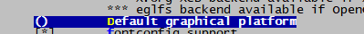

--

DirectFB是一个**轻量级**的**提供硬件图形加速**，输入设备处理和抽象的**图形库**，

它集成了支持**半透明的视窗系统**以及在LinuxFramebuffer驱动之上的**多层显示**。

它是一个用软件封装当前硬件无法支持的图形算法来完成硬件加速的层。

DirectFB是为嵌入式系统而设计。

**它是以最小的资源开销来实现最高的硬件加速性能。**


DirectFB是图形API

存在于Frame Buffer层之上

高级图形管理层如GTK+等之下的。


它可以以很小的系统资源占用来提供图形硬件加速功能，

提供类如多路a通道渲染模型等高级图像操作。

**它不修改Linux内核，除了标准C库没有其他库的依赖。**

应用在了基于Linux系统的DTV显示系统的研发和其他有关Linux显示界面的项目上。

支持市面上绝大多数显示卡，支持键盘、鼠标、遥控器、游戏手柄、触摸屏等输入设备。

支持JPEG、PNG、GIF、mpeg1/2、AVI、MOV、Flash、Video4Linux、DirectFB bitmap font和TrueType等音视频文件和字体。


 对于底层的驱动来说，DirectFB里面负责和硬件打交道的显卡的驱动（gfxdriver）和显示系统（system），**这里面gfxdriver是和各个硬件平台相关的，有可能需要自己写。** 为了更易于理解DirectFB，需要先介绍几个DirectFB里面的概念：

- Layers：代表互相独立的图形缓存。大多数嵌入式设备都有多个layer。多个layer根据对应的alpha值混合 在一起，从而显示出来。 
- Surface：代表一块预留的内存，来保存像素数据。DirectFB中的Drawing，Bilitting操作就是基于 surface的。Surface的内存根据设定，可以从系统中分配，也可以从显卡的内存中分配。
- Primary Surface：代表一个特殊layer的特殊surface。如果primary surface是单缓冲的，任何对于 primary surface的操作都会直接反应到显示屏上。
- Subsurface：是一个surfac的子集，但是自身并不占有任何内存。
- Window/Windowstack：控制一个layer中的surface该显示什么。Window属于某个背景可以设定的layer。 每个window有自己的surface，window用这个surface来组合图像。 


 比如说下图中有三个Layer，最下面的Layer是一幅背景图，中间的Layer是一个透明的带有一个“igel”的Layer，最上面是一个透明的带有subtitle的Layer，最后我们在显示器中看到的就是各个Layer的混合。


**DirectFB的移植**

 如果要移植DirectFB需要用到以下的第三方库，如下图所示：


DirectFB需要用到第三方库简介：

- fontconfig-2.10.92：管理系统安装的字体，根据应用程序的字体配置，match（匹配）一种字体，填充match字体的各种属性。
- freetype-2.5.0：FreeType库是一个完全免费（开源）的、高质量的且可移植的字体引擎，它提供统一的接口来访问多种字体格式文件，包括TrueType, OpenType, Type1, CID, CFF, Windows FON/FNT, X11 PCF等。
- jpeg-8d：jpeg开源库
- libpng-1.5.8：PNG 库是用来创立和操作PNG 格式的图像文件，PNG 格式是设计来替代GIF，他对于更小范围的TIFF(标记图象文件格式)来说，有了非常多的进步和拓展并且减少了关于专利权的麻烦。
- libsigc++-2.2.8：libsigc++是实现类型安全回调的一个C++模板库。libsigc++提供了信号(signal)和槽(slot)的概念，实现了信号机制。slot对应一个回调函数，信号(signal)与槽(slot)相关联(attach)，当一个信号被发射(emit)时，相对应的槽被调用。
- libxml2-2.6.28：包含了对 XPath 表达式使用的支持来检索匹配一个指定准则的结点集。libxml2软件包提供允许用户操控XML文件的函数库,包含有读、修改和写XML和HTML文件支持。

directfb在buildroot里已经有集成了。所以不需要自己去移植了。

我们看看directfb的package里的内容。

这个就是指定gfx驱动的。我的当前是amlgfx这个名字。

```
DIRECTFB_GFX = \
	$(if $(BR2_PACKAGE_DIRECTFB_AMLGFX),amlgfx) \
	$(if $(BR2_PACKAGE_DIRECTFB_ATI128),ati128) \
	$(if $(BR2_PACKAGE_DIRECTFB_CYBER5K),cyber5k) \
	$(if $(BR2_PACKAGE_DIRECTFB_MATROX),matrox) \
	$(if $(BR2_PACKAGE_DIRECTFB_PXA3XX),pxa3xx) \
	$(if $(BR2_PACKAGE_DIRECTFB_I830),i830) \
	$(if $(BR2_PACKAGE_DIRECTFB_EP9X),ep9x)

ifeq ($(strip $(DIRECTFB_GFX)),)
DIRECTFB_CONF_OPTS += --with-gfxdrivers=none
else
DIRECTFB_CONF_OPTS += \
	--with-gfxdrivers=$(subst $(space),$(comma),$(strip $(DIRECTFB_GFX)))
endif
```

这样来指定input驱动。

```
DIRECTFB_INPUT = \
	$(if $(BR2_PACKAGE_DIRECTFB_LINUXINPUT),linuxinput) \
	$(if $(BR2_PACKAGE_DIRECTFB_KEYBOARD),keyboard) \
	$(if $(BR2_PACKAGE_DIRECTFB_PS2MOUSE),ps2mouse) \
	$(if $(BR2_PACKAGE_DIRECTFB_SERIALMOUSE),serialmouse) \
	$(if $(BR2_PACKAGE_DIRECTFB_TSLIB),tslib)

ifeq ($(BR2_PACKAGE_DIRECTFB_TSLIB),y)
DIRECTFB_DEPENDENCIES += tslib
endif

ifeq ($(strip $(DIRECTFB_INPUT)),)
DIRECTFB_CONF_OPTS += --with-inputdrivers=none
else
DIRECTFB_CONF_OPTS += \
	--with-inputdrivers=$(subst $(space),$(comma),$(strip $(DIRECTFB_INPUT)))
endif
```

在menuconfig里是这样呈现的。


当前qt的勾选了


qt这个选项表示设置默认的图形平台。

当前没有指定，所以运行qt example的时候，总要加上参数。

```
Available platform plugins are: linuxfb, minimal, offscreen, vnc.
```





1）dual frame buffers（双帧buffer）对于QT本身来说是不支持双buffer切换的，只能借助于DirectFB，但是实际测试的DirectFB会存在很多问题，比如有一些无法显示，效率不高，甚至还会crash等问题
2）目前我们使用的QT是直接使用GE2D将数据搬运到FB中，没有使用DirectFB


参考资料

1、DirectFB简介以及移植[一]

https://blog.csdn.net/sunjing_/article/details/90519808