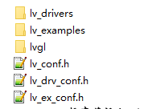
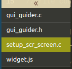

--

官网：

https://lvgl.io/

lvgl的demo运行，还需要开一个模拟器。

我直接把项目加入到buildroot里去运行。


资源也是转成C语言数组的方式。

也是比较繁琐的方式。


居然有也python的binding。看看。


网上还是有不少人用，在这种规模的gui库里，算是比较流行的。

采用MIT协议。还是有实用价值的。

lvgl还有硬件加速对接的接口。

看一下代码提交历史，是从2016年6月开始的项目。


可以对接linux的fb。

https://github.com/lvgl/lv_port_linux_frame_buffer


github readme提到的熟悉流程是：

1、看一下官方的demo。有3个demo：music player、printer demo、widgets demo。

2、读一下介绍文档。


# 特性

1、丰富的控件。

2、动画、抗锯齿、透明、平滑滚动。

3、支持触控板、鼠标、键盘、编码器等输入。

4、utf-8多语言支持。

5、多种显示介质支持。

6、用css风格来定制控件。

7、硬件无关。

8、最小需要的资源是64k flash和16K ram。

9、支持os、gpu，但是不强求。

10、single frame buffer？怎么说？

11、用C语言编写。

12、提供了一个模拟器，用来在pc上快速预览效果。

13、有micropython bingding。

14、有教程和示例、主题。

15、MIT协议。

# 相关仓库

- [lvgl](https://github.com/lvgl/lvgl) The library itself with many [examples](https://github.com/lvgl/lvgl/blob/master/examples/).
- [lv_demos](https://github.com/lvgl/lv_demos) Demos created with LVGL.
- [lv_drivers](https://github.com/lvgl/lv_drivers) Display and input device drivers
- [blog](https://github.com/lvgl/blog) Source of the blog's site (https://blog.lvgl.io)
- [sim](https://github.com/lvgl/sim) Source of the online simulator's site (https://sim.lvgl.io)
- [lv_sim_...](https://github.com/lvgl?q=lv_sim&type=&language=) Simulator projects for various IDEs and platforms
- [lv_port_...](https://github.com/lvgl?q=lv_port&type=&language=) LVGL ports to development boards
- [lv_binding_..](https://github.com/lvgl?q=lv_binding&type=&language=l) Bindings to other languages
- [lv_...](https://github.com/lvgl?q=lv_&type=&language=) Ports to other platforms

# 资源收集

这个中文系列教程

https://deepinout.com/lvgl-tutorials/lvgl-getting-started/lvgl-fonts.html


# 发布策略

x.y.z的格式。

x变动，则有不向前兼容的改动。

y变动，是有新增功能，对x兼容。

z变动，是修改问题。

## 发布周期

bugfix：不定期，有修改就发。

minor release：大概3到4个月。

major release：每年发布一次。

## 分支

master：主分支。patch直接合并到这个分支。

release/vX.Y：发布版本。

fix/xx：修复bug的临时版本。

feat/xx：特性开发版本。

当前最新版本是v8.0.0，每个minor版本的支持周期是一年。

v8.0.0的特性

v8带来了很多新的特性，例如更好的scroll支持、新的layout（受css flexbox和grid启动）、widget改进、事件改进。

v8对v7不向前兼容。


# 提问

论坛

https://forum.lvgl.io/

博客

https://blog.lvgl.io/

有开发相关的问题，直接在github的issue里提。

# 搭建simulator环境

simulator依赖于IDE。是通过给IDE安装一个插件来实现的。

支持的IDE有：

eclipse with sdl driver

https://github.com/lvgl/lv_sim_eclipse_sdl

vscode with sdl driver

https://github.com/lvgl/lv_sim_vscode_sdl

我就看vscode的方式吧。

在ubuntu下安装vscode。

```
git clone --recursive https://github.com/lvgl/lv_sim_vscode_sdl
```

`code .`打开当前的目录。

然后按F5编译并自动进入到调试。


# 板端linux fb方式运行

```
git clone --recursive https://github.com/lvgl/lv_port_linux_frame_buffer
```

然后直接make，得到一个demo的bin文件。

然后放到qemu里运行就可以了。

然后直接用arm工具链来编译，编译不过。

直接放到buildroot下。

直接把lv_port_linux_frame_buffer目录都放到目录下。

然后新建一个lvgl的package。

```
LVGL_VERSION = 1.0
LVGL_SITE = $(TOPDIR)/../vendor/amlogic/lv_port_linux_frame_buffer
LVGL_SITE_METHOD = local
define LVGL_BUILD_CMDS
    $(MAKE) CC=$(TARGET_CC) CXX=$(TARGET_CXX) -C $(@D) all
endef
```

make lvgl-rebuild ，就可以得到一个2M左右的demo文件。

放到板端，虽然显示不正常，但是至少不报错。可以跑起来。

把宽高改一下，就可以正常显示了。

然后看看输入的。

这就要看配置是怎么配置的。

在main函数里加上这个就可以了。

```
    evdev_init();
    lv_indev_drv_t indev_drv;
    lv_indev_drv_init(&indev_drv);
    indev_drv.type = LV_INDEV_TYPE_POINTER;
    indev_drv.read_cb = evdev_read;
    lv_indev_drv_register(&indev_drv);
```

另外lv_drv_conf.h里也要配置一下。


运行效果挺好的。拉到边沿还有弹性效果。


## 参考资料

Simplest C example for fbdev and evdev (no SDL)?

https://forum.lvgl.io/t/simplest-c-example-for-fbdev-and-evdev-no-sdl/2138

# 自己写HelloWorld

在main初始化好之后，在死循环之前调用myapp函数就好了。

这个实现的效果是按键按一下，数字就加1 。

```
static void event_cb(lv_event_t *event)
{
    static int cnt = 1;
    lv_obj_t *btn = lv_event_get_target(event);
    lv_obj_t *label = lv_obj_get_child(btn, 0);
    lv_label_set_text_fmt(label, "%d", cnt);
    cnt++;
}
void myapp()
{
    lv_obj_t *btn1 = lv_btn_create(lv_scr_act());
    lv_obj_set_size(btn1, 100, 50);
    lv_obj_center(btn1);
    lv_obj_add_event_cb(btn1, event_cb, LV_EVENT_CLICKED, NULL);
    lv_obj_t * label1 = lv_label_create(btn1);
    lv_label_set_text(label1, "click me!");
    lv_obj_center(label1);
}
```

# lv_sim_vscode_sdl分析

跟vscode集成做得很好，主要是.vscode下面的配置文件配置好了。

# lv_demo_widgets分析

对屏幕的适应，是靠这个来做的。

```
    if(LV_HOR_RES <= 320) disp_size = DISP_SMALL;
    else if(LV_HOR_RES < 720) disp_size = DISP_MEDIUM;
    else disp_size = DISP_LARGE;
```

电话这种图标，是靠utf-8字符来做的。

使用的grid布局，没有写死坐标，所以可以有很好的适应性。

# 合理的配置方法

当前我跑起来，还是改了一些配置，当然是希望改动可以合理一些。

在lvgl目录下，有一个lv_conf_template.h文件，正确的操作方法是：把这个文件拷贝到上一层目录，改名为lv_conf.h。然后在lv_conf.h里进行配置修改。

lv_drivers也是类似，把一个lv_drv_conf_template.h拷贝到上一层目录下，改名为lv_drv_conf.h。进行修改。



lv_conf.h里的配置项：

```
配置分为这么几大块：
颜色配置
内存配置
hal配置
feature配置
	drawing
	gpu
	log
	assert
	其他
编译配置
字体配置
文本配置
widget配置
extra组件
	widget配置
	主题配置
	布局
examples
===================================
颜色配置
    color depth
    是否使能透明
内存配置
    是否使用lv的malloc函数，否则使用标准C库的malloc
    是否使用std的memcopy和memset
hal配置
    刷新周期，默认是30ms
    input的scan周期，默认30ms
    是否使用自定义的tick，看起来只有arduino的是这个。
    dpi配置，默认是130
drawing配置
	是否绘制复杂图形，就是阴影效果这些，默认是1
gpu配置
	这个就是stm32这些芯片的配置。
log配置
	是否使能log。默认是否。
	打印级别。
assert配置
	对哪些使用断言。
feature的其他配置
	是否显示perf数据，就是CPU占用率、fps数据。
	是否显示mem使用情况。
	是否使能gc。默认是否。
编译器配置
	是否是大端，默认否。
字体配置
	默认是Montserrat字体14号。
text配置
	默认utf-8
	折行字符有： ,.-_;:
widget配置
	都使能了。
extra组件配置
	高级widget配置
		日历。
		chart。
		colorwheel
		keyboard
		msgbox
		tabview
		win
		span
	主题配置
		有深色和浅色主题。默认浅色。
	layout配置
		grid和flex都使能了。
examples配置
	默认使能了编译。
```

# lvgl 心跳

靠定时中断或者创建一个线程，调用lv_tick_inc函数。

# 任务处理器

**任务处理器(Task Handler)**要处理 LVGL 的任务，我们需要定期通过以下方式之一调用 lv_task_handler() ：

- mian 函数中设置 while(1) 调用
- 定期定时中断(低优先级然后是 lv_tick_inc()) 中调用
- 定期执行的 OS 任务中调用

计时并不严格，但应保持大约5毫秒以保持系统响应。

范例：

```c
while(1) {
  lv_task_handler();
  my_delay_ms(5);
}
```

# 字体转换

lvgl里的字体是C数组方式提供的。

lvgl支持哪些字体？

这里有个工具。

https://whycan.com/t_1350.html

https://blog.csdn.net/tianjianwudiwowudi/article/details/108636146

https://www.codeleading.com/article/63665097332/

增加中文显示，当前是显示不出来。

当前内置了哪些字体？这些字体支持了多少个符号？

增加一个完整的

https://blog.csdn.net/weixin_44007534/article/details/114009674


有内置仿宋体的字体。从注释看，是1000个最常用的中日韩字符。

```
#define LV_FONT_SIMSUN_16_CJK            1  /*1000 most common CJK radicals*/
```


改了配置，编译没有完整编译。需要先clean一下。


但是中文的“按钮”这2个字还是没有显示出来。

是因为字体里没有这2个字的，“左右”就可以显示出来。

当前这个仿宋字体，只有16号的。对应的o文件大小是164K。还能接受的大小。

怎么生成不同字号的同一个字体呢？


有2个工具

LvglFontTool

MCU_Font

都下载下来使用一下。

这2个工具都是QT写的，免安装的小工具。

## MCU_Font用法

（unicode编码E000-F8FF为私有区域，可以自定义使用，F000 之后的已被图标字体FontAwesome使用，因此我们的定制图标默认从E000开始）

这个官方教程就够用了。

https://gitee.com/WuBinCPP/MCU_Font_Release/blob/master/README.md

需要注意的是，

读取路径添加：添加需要提取字符的程序代码路径，可以选文件也可以选文件夹。如是文件夹的话会遍历该文件夹内部所有文件，但不会递归继续读取下层文件夹。这里我直接选择 demo 的.c文件 lv_demo_printer.c

它是扫描代码里用到的中文等数据，只提取需要的文字。

## LvglFontTool

这个使用简单，按照提示和直觉操作就可以了。

# 图片转换


# linux port编译分析

现在要用尽量优雅的方式来把lvgl集成到buildroot里。

所谓优雅，是要方便后续升级，尽量不要改到lvgl代码本身。

总的来说，很简单。

# 加入到buildroot里

package名字为lvgl-app，local的方式，需要在编译前，下载和解压lvgl和lv_drivers。
如果有自己增加的驱动、字库、图片，则自己加到lvgl-app目录下。
编译就一个可执行文件，不要动态库。
可以做脚本工具来辅助提取字库和图片。（这个先不做）

lvgl和lv_drivers的版本，要buildroot可以配置。加配置项。

lvgl的，就用v8.0.0的。

lv_drivers，也用v8.0.0的。

压缩包的下载地址，就用github的下载地址。

https://github.com/lvgl/lvgl/archive/refs/tags/v8.0.0.tar.gz

https://github.com/lvgl/lv_drivers/archive/refs/tags/v8.0.0.tar.gz

buildroot

# designer工具

GUI Guide

https://www.nxp.com.cn/design/software/development-software/gui-guider:GUI-GUIDER

下载需要注册nxp的账号，填写很多的信息，但是网上找资源也不好找。

所以还是注册了。

因为windows被限制了安装，所以在ubuntu下进行安装。

依赖了java。需要安装：

```
sudo apt-get install default-jre
```

ubuntu上运行，第一次崩溃了，第二次正常启动了。

从打印看，是基于electron开发的。

我新建一个test1的项目。

拖入一个button。然后点击在simulator上运行。正常。

选择生成代码。可以看到生成了4个文件。还有一个js文件。



这生成的文件，怎么导入到项目里使用呢？

直接把generated目录拷贝到lv_port_linux_framebuffer的目录下。然后稍微修改Makefile，保证把generated的内容编译进来。

然后在main.c里添加：

```
#include "gui_guider.h"
lv_ui guider_ui;
int main()
{
	setup_ui(&guider_ui);
    events_init(&guider_ui);
    while(1) {
    
    }
}
```

但是当前是编译不过的。

我还是还vscode sim里来看看。保证编译过且可以运行。

7.10.1版本。

需要对比这个配置文件，变化很大。

```
lv_conf_template.h
```

算了。我直接下载7.10.1版本对应的vscode sim版本就好了。

手动把各个目录的版本回退到7.10.1附近的版本，之所以说附近，是有的没有7.10.1这个版本。

但是有7.11.0的。也可以的。都回退到7.11.0的。

改一下代码。可以顺利跑起来。


## 参考资料

https://zhuanlan.zhihu.com/p/359639726

# benchmark

现在是要给出一个报告。所以需要benchmark数据。

demo里有一个benchmark程序。

但是需要先梳理一下相关的概念。

测试过程：

显示完全不透明的测试，然后是50%透明的测试。

左上角显示的是当前的测试名字和上一个测试的结果。

fps的计算方法是这样：

```
FPS = time_sum / render_cnt
```

对于简单测试，fps可能会很高。

例如一个rect在5ms里被绘制完成，那么fps就会得到200fps。

忽略了LV_DISP_REFR_PERIOD。

默认情况下，只有变化的区域被刷新。

如果只有少数像素在1ms里变动，那么得到的fps会是1000 

现在运行的后期有个错误打印，先把这个错误打印解决掉。

总共96个测试case。

这几个测试报错的。

```
{.name = "Text small",                   .weight = 20, .create_cb = txt_small_cb},
        {.name = "Text medium",                  .weight = 30, .create_cb = txt_medium_cb},
        {.name = "Text large",                   .weight = 20, .create_cb = txt_large_cb},

        {.name = "Text small compressed",       .weight = 3, .create_cb = txt_small_compr_cb},
        {.name = "Text medium compressed",      .weight = 5, .create_cb = txt_medium_compr_cb},
        {.name = "Text large compressed",       .weight = 10, .create_cb = txt_large_compr_cb},
```

```
#define LV_FONT_DEFAULT &lv_font_montserrat_14
```

把lv_conf.h里的这2个宏打开就好了。

```
#define LV_FONT_FMT_TXT_LARGE   1

/*Enables/disables support for compressed fonts.*/
#define LV_USE_FONT_COMPRESSED  1
```

# 截屏

还是写报告需要一些图片。需要从linux截屏出来。

fbdump -fb /dev/fb0 > 1.raw

截屏的图片不行。

算了。

# python运行

怎么把python写的lvgl代码在模拟器运行起来？

直接在github里，进gitpod，这个是一个完整的在线的类似vscode的环境。可以直接编辑运行代码。

```
cd /workspace/lv_micropython/examples
 ports/unix/micropython-dev -i lib/lv_bindings/examples/advanced_demo.py
```

这样就运行了一个代码。

暂时没有必要深入去看。实用价值不高。

## 参考资料

https://docs.lvgl.io/latest/en/html/get-started/micropython.html


# 代码分析

以8.3dev的为例进行分析。

目录分析

```
core
	包括了
	disp
		设置bg color、bg image、opa、load动画、theme。
	event、
	group、
	indev、
	obj_class
	obj_draw
	obj_pos
	obj_scroll
	obj_style_gen
	obj_style
	obj_tree
	obj
	refr
	theme
draw
	这个是对接下层绘图的。
	arc
	img
	label
	line
	mask
	rect
	transform
	triangle
	buf
	cache
	decoder
	
extra
	layouts
		flex和grid这2种布局。
	libs
		bmp、png等库。
	others
		fragment等实现。
	themes
		实现了3种theme。
		basic
		default
		mono
	widgets
		这个和外层的widget是什么关系呢？这里是复杂的高级的组件。
		这里有：
		animimg
		calendar
		chart
		colorwheel
		imgbtn
		keyboard
		led
		list
		menu
		meter
		msgbox
		span
		spinbox
		spinner
		spinner
		tabview
		tileview
		win
font
	一种基础字体的不同尺寸的文件。
hal
	3个东西：
	disp：输出
	indev：输入
	tick
misc
	anim_timeline
	anim
	area
	assert
	async
	bidi
	color
	fs
	gc
	ll
	log
	lru
	math
	mem
	printf
	style_gen
	style
	templ
	timer
	tlsf
	txt-ap
	txt
	utils
widgets
	arc
	bar
	btn
	btnmatrix
	canvas
	checkbox
	dropdown
	img
	label
	line
	objx_templ
	roller
	slider
	switch
	table
	textarea
	
```

event有哪些？

```
// input event 
pressed
pressing
press lost
short clicked
logn pressed
long pressed repeat
clicked
released
scroll begin
scroll end
scroll
gesture
key
focused
defocused
leave

hit test

// drawing event
cover check
refr ext draw size
draw main begin
draw main
draw main end
draw post begin
draw post
draw post end
draw part begin
draw part end

//special event
value changed
insert
refresh
ready
cancel

// other event
delete
child changed
child created
child deleted
screen unload start
screen load start
screen loaded
screen unloaded
size changed
style changed
layout changed
get self size

```

以btn为例进行分析。

```
typedef struct {
    lv_obj_t obj;
} lv_btn_t; // 只是简单集成，没有新的属性。

extern const lv_obj_class_t lv_btn_class;

//对外只暴露这个接口。
lv_obj_t * lv_btn_create(lv_obj_t * parent);
```

# 一些好的lvgl应用分析

## minipad

https://gitee.com/Jumping99/minipad?_from=gitee_search

这个是在linux上多进程实现了一个pad的操作逻辑。

有homepage，可以打开各个应用。

但是是进程独占窗口的方式。

不过可以了。这样实现起来简单。

### 百问网也有一个类似的桌面，看起来更强大

https://github.com/100askTeam/lv_100ask_linux_desktop

## 实现86盒子

其实“86盒”（86Box）是一种电工标准，我们家里常见的开关面板、电源插座等一般都是86盒标准，**其面板尺寸为86mm X 86mm，因此得名**。

https://www.sohu.com/a/669465847_121135949

https://bbs.21ic.com/icview-3371674-1-1.html

https://bbs.aw-ol.com/user/q1215200171

T113的资料

https://forums.100ask.net/t/topic/399

## phonegui

这个实现了对iphone的模仿。

主要是设计工具的熟练使用。和动画设计。

https://gitee.com/seafine/phonegui

## page manage

https://developer.aliyun.com/article/1170625


## 百问网的例子

https://github.com/100askTeam/lv_lib_100ask/blob/master/README_zh.md

## xterminal

这个是基于esp的。用c++写的，感觉应用框架写得很好。

https://github.com/lithiumice/XTerminal/

## cpp binding

https://github.com/lvgl/lv_binding_cpp


# 参考资料

1、Embedded GUI Using Linux Frame Buffer Device with LVGL

https://blog.lvgl.io/2018-01-03/linux_fb

2、qemu-vexpress-a9 bsp下运行LittlevGL图形库.

https://club.rt-thread.org/ask/question/6975.html

3、LittlevGL的Python绑定（非micropython）

https://whycan.com/t_2062.html

4、官网文档

https://docs.lvgl.io/master/intro/index.html