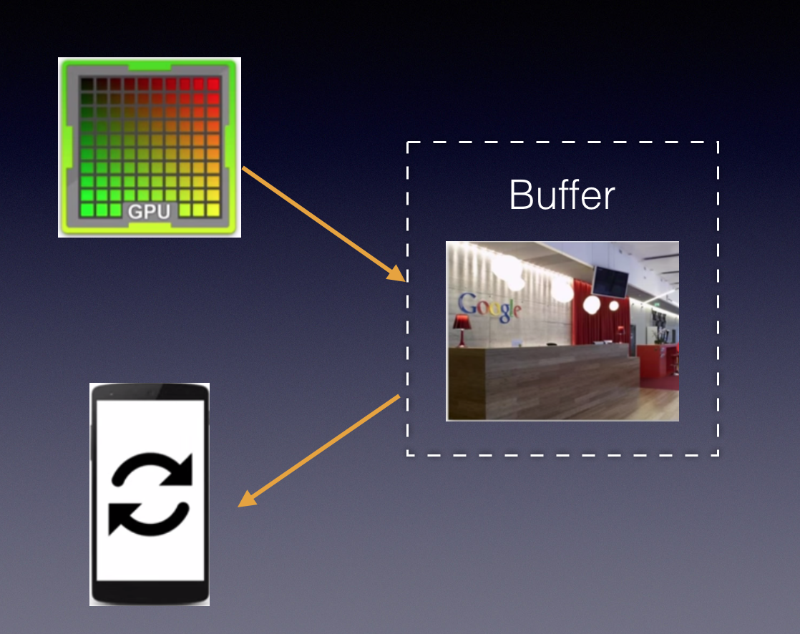
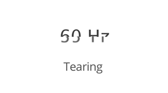
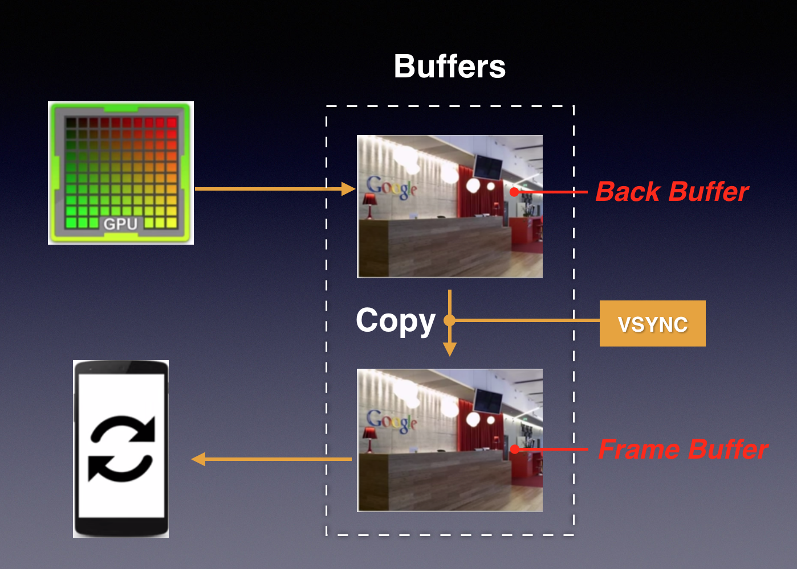
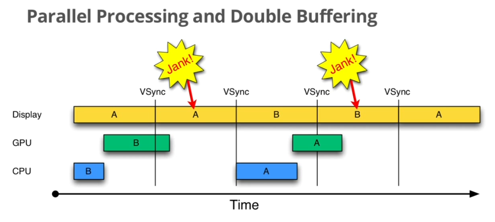

--

作为严重影响Android口碑问题之一的UI流畅性差的问题，

首先在Android 4.1版本中得到了有效处理。

其解决方法就是本文要介绍的Project Butter。

Project Butter对Android Display系统进行了重构，

引入了三个核心元素，

即VSYNC、Triple Buffer和Choreographer。

其中，VSYNC是理解Project Buffer的核心。

VSYNC是Vertical Synchronization（垂直同步）的缩写，

**是一种在PC上已经很早就广泛使用的技术。**

**读者可简单的把它认为是一种定时中断。**

接下来，本文将围绕VSYNC来介绍Android Display系统的工作方式。

在单缓冲区的情况下，这个问题很难规避。

所以引进了双缓冲技术，

基本原理就是采用两块buffer。

一块back buffer用于CPU/GPU后台绘制，

另一块framebuffer则用于显示，

**当back buffer准备就绪后，它们才进行交换。**

那么什么时候切换两个缓冲区最合适呢？

显示器有两个重要特性，行频和场频。

行频(Horizontal ScanningFrequency)又称为“水平扫描频率”，是屏幕每秒钟从左至右扫描的次数; 

场频(Vertical Scanning Frequency)也称为“垂直扫描频率”，是每秒钟整个屏幕刷新的次数。

由此也可以得出它们的关系：

行频=场频*纵坐标分辨率。

当扫描完一个屏幕后，设备需要重新回到第一行以进入下一次的循环，

此时有一段时间空隙，称为VerticalBlanking Interval(VBI)。

**这个时间点就是我们进行缓冲区交换的最佳时间。**

因为此时屏幕没有在刷新，也就避免了交换过程中出现screentearing的状况。

VSync是VerticalSynchronization的简写，

它利用VBI时期出现的vertical sync pulse来保证双缓冲在最佳时间点才进行交换。

在没有VSync信号同步下的绘图过程：

手机一般的屏幕刷新率是60hz。而CPU和GPU处理数据的速度一般是比这个快的。

有3个组件在相互配合：显示屏、CPU、GPU。

每收到VSYNC中断，CPU就开始处理各帧数据。

大部分的Android显示设备刷新率是60Hz,

这也就意味着每一帧最多只能有1/60=16ms左右的准备时间。

假如CPU/GPU的FPS(FramesPer Second)高于这个值，那么显示效果将很好。

但是，这时出现一个新问题：CPU和GPU处理数据的速度都能在16ms内完成，而且还有时间空余，

但必须等到VSYNC信号到来后才处理下一帧数据，

因此CPU/GPU的FPS被拉低到与Display的FPS相同。

Project Buffer的三个关键点：

需要VSYNC定时中断；

当双Buffer不够使用时，该系统可分配第三块Buffer；

图形buffer的绘制工作由VSYNC信号触发；

在 single buffer 的场景下，LCD user 和 LCD controller / gpu 总是在共用同一个 framebuffer，且没有同步机制。

LCD user 是写者，LCD controller / gpu 是读者。

由于存在竞争关系且读写没有同步机制，framebuffer 里必须会发生同时存在frame N 和 frame N-1 的数据，此时 LCD 将 framebuffer 的数据显示出来时，就会看到撕裂的效果：

**可以通过 double buffer+vsync 解决撕裂的问题。**

double buffer，顾名思义，就是有 2 个 framebuffer，其工作逻辑如下：

- LCD controller : draw fb0 to screen
- LCD user : write data to fb1
- LCD controller : draw fb1 to screen
- LCD user : write data to fb0
- 循环...

vsync 机制则用于确保一帧图像能不被打断地显示在屏幕。

安卓系统中有 2 种 VSync 信号：屏幕产生的硬件 VSync 和由 SurfaceFlinger 将其转成的软件 Vsync 信号。后者经由 Binder 传递给 Choreographer。

硬件 VSync 是一个脉冲信号，起到开关或触发某种操作的作用。

如上图，CPU/GPU 向 Buffer 中生成图像，屏幕从 Buffer 中取图像、刷新后显示。这是一个典型的生产者——消费者模型。

理想的情况是帧率和刷新频率相等，每绘制一帧，屏幕显示一帧。

而实际情况是，二者之间没有必然的大小关系，

如果没有锁来控制同步，很容易出现问题。

例如，当帧率大于刷新频率，当屏幕还没有刷新第 n-1 帧的时候，GPU 已经在生成第 n 帧了，从上往下开始覆盖第 n-1 帧的数据，当屏幕开始刷新第 n-1 帧的时候，Buffer 中的数据上半部分是第 n 帧数据，而下半部分是第 n-1 帧的数据，显示出来的图像就会出现上半部分和下半部分明显偏差的现象，我们称之为 “tearing”，

为了解决单缓存的“tearing”问题，双重缓存和 VSync 应运而生。双重缓存模型如下图：

两个缓存区分别为 Back Buffer 和 Frame Buffer。

**GPU 向 Back Buffer 中写数据，屏幕从 Frame Buffer 中读数据。**

**VSync 信号负责调度**从 Back Buffer 到 Frame Buffer 的**复制操作**，可认为该复制操作在瞬间完成。

其实，该复制操作是等价后的效果，

实际上双缓冲的实现方式是交换 Back Buffer 和 Frame Buffer 的名字，

更具体的说是交换内存地址（有没有联想到那道经典的笔试题目：“有两个整型数，如何用最优的方法交换二者的值？”），通过二位运算“与”即可完成，所以可认为是瞬间完成。

双缓冲的模型下，工作流程这样的：
在某个时间点，一个屏幕刷新周期完成，进入短暂的刷新空白期。此时，VSync 信号产生，先完成复制操作，然后通知 CPU/GPU 绘制下一帧图像。复制操作完成后屏幕开始下一个刷新周期，即将刚复制到 Frame Buffer 的数据显示到屏幕上。

在这种模型下，**只有当 VSync 信号产生时，CPU/GPU 才会开始绘制**。这样，**当帧率大于刷新频率时，帧率就会被迫跟刷新频率保持同步**，从而避免“tearing”现象。

注意，当 VSync 信号发出时，如果 GPU/CPU 正在生产帧数据，此时不会发生复制操作。屏幕进入下一个刷新周期时，从 Frame Buffer 中取出的是“老”数据，而非正在产生的帧数据，即两个刷新周期显示的是同一帧数据。这是我们称发生了“掉帧”（Dropped Frame，Skipped Frame，Jank）现象。

三重缓存（Triple Buffer）

双重缓存的缺陷在于：

当 CPU/GPU 绘制一帧的时间超过 16 ms 时，会产生 Jank。

**更要命的是，产生 Jank 的那一帧的显示期间，GPU/CPU 都是在闲置的。**

如下图，A、B 和 C 都是 Buffer。

蓝色代表 CPU 生成 Display List，

绿色代表 GPU 执行 Display List 中的命令从而生成帧，

黄色代表生成帧完成。

# 参考资料

1、Android Project Butter分析

https://blog.csdn.net/yangwen123/article/details/16344375

2、

https://github.com/huanzhiyazi/articles/issues/28

3、LCD（一）：LCD timing 时序参数总结

https://www.codenong.com/cs106837597/

4、

https://zhuanlan.zhihu.com/p/352484445

5、

https://wiki.phytec.com/pages/viewpage.action?pageId=91989486

6、LCD RGB 控制技术 时钟篇（上）

https://blog.csdn.net/richard_liujh/article/details/46352857

7、

http://wiki.100ask.org/%E7%AC%AC017%E8%AF%BE_LCD%E7%BC%96%E7%A8%8B

8、理解 VSync

https://blog.csdn.net/zhaizu/article/details/51882768