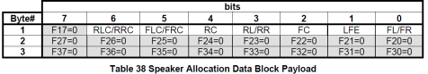
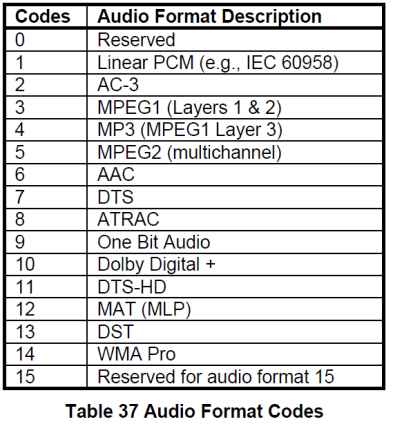

--

EDID的全称是Extended Display [Ide](http://www.haogongju.net/tag/IDE)ntification Data(扩展显示标识[数据](http://www.haogongju.net/tag/数据))，共有128字节。

其中包含有关显示器及其[性能](http://www.haogongju.net/tag/性能)的参数，

包括供应商信息、最大图像大小、颜色设置、厂商预设置、频率范围的限制以及显示器名和序列号的字符串等等。

形象地说，EDID就是显示器的身份证、户口本、技能证书等证件的集合，

目的就是告诉别人我是谁，我从哪来，我能干什么。


**为什么要使用EDID？**

为了能让PC或其他的图像输出设备更好的识别显示器属性

EDID并非古而有之，在古老的CRT时期是没有EDID这个概念的，那为什么后来会有呢？

因为随着显示设备的发展，显示器的种类越来越多，

模拟的、数字的、普屏的、宽屏的、17寸、19寸、22寸……

这让PC傻了眼，分辨率和时序的种类太多了，

而每种显示器又不可能支持所有的分辨率，

那怎么知道该给显示器一个什么样的分辨率啊？

显示出的效果是最佳效果吗？

不仅如此，**随便输出一个分辨率还有损坏显示器硬件的可能**，这可太危险了。

于是，EDID临危受命，担当起显示器和PC之前的传话筒。

“PC你好，我是A显示器，我能显示N种分辨率，最佳分辨率是XXX”。

“显示器你好，收到你的信息，现在就按最佳分辨率给你输出”。

这下大家明白了吧，EDID就是为了能让PC或其他的图像输出设备更好的识别显示器属性而出现的。


**Q5：每个显示器只有一个EDID吗？**

A5：不一定。

现在的显示器功能很强大，通常都提供多种[视频](http://www.haogongju.net/tag/视频)接口，常见的有DVI、VGA、HDMI、Display Port等，由于每种接口的特性和带宽不同，使得不同接口的EDID也不同。使用哪个接口，PC读到的就是哪个接口的EDID。我们的设备主要使用DVI、VGA、VIDEO几种接口。由于VIDEO接口的几种制式如PAL、NTSC等，其分辨率场频都是固定的，没有使用EDID的必要，故不在讨论之列。本文下面的问题都围绕DVI、VGA两种接口展开


# SpeakerAlloc的意义

根据Data Block结构，首字节的bit7~5为**Speaker Allocation Data Block** = 4，bit4~0为**Speaker Allocation Data Block**长度(固定为3)，后面跟的3字节，结构如下：

 

注：F为前置，L为左置，R为右置，C为中置，Fxx=0表示预留位

在代码上是这么写的：

```
  BYTE value[4] = {0};
  value[0] = (EDID_EXT_TAG_SPEAKER_ALLOCATION << 5) | 0x03;//EDID_EXT_TAG_SPEAKER_ALLOCATION就是4 
  value[1] = channles;//channels传递的是0x7f。相当于所有有意义的bit都设置为1了。
  value[2] = value[3] = 0;
```


# audio data block

根据Data Block结构，

首字节的bit7~5为Audio Data Block = 1，

bit4~0为Video Data Block长度，后面跟的字节为1个或多个CEA short Audio Descriptor,每个CEA short Audio Descripto由三个字节组级，分为LPCM，AC3，MPEG2等各种Audio Format Code,  Audio Format Code及CEA short Audio DZescriptor结构如下：



代码上这么写：

```
I2C_write(i2c_handle, REG_ADDR_HDMI_EDID_AudioDataBlock_0, edid+4, *edid_len);
```


HDMI 以增强型扩展显示识别数据 (E-EDID) 结构的形式引入信令，

允许源设备（例如机顶盒、游戏机）检测连接的接收设备（例如电视、条形音箱、A /V 接收器），

然后再发送任何音频或视频。

这确保源设备仅传输接收设备支持的格式，确保没有空白屏幕或静音扬声器。 

E-EDID 中的主要音频参数承载在一个或多个短音频描述符 (SAD) 中。

每个 SAD 都描述了一种支持的音频格式，

包括采样率、比特率和（对于 PCM）比特深度。

以下是来自电视的 HDMI EDID 示例：


由于杜比全景声不是编解码器，

而是作为现有编解码器的扩展进行携带，

因此每个 SAD 中都有一个“音频格式特定”字节，

指示设备是否支持杜比全景声。

想要将 Atmos 发送到接收设备的源设备

可以在每个杜比音频编解码器的 SAD 中检查杜比全景声支持


电视通常支持立体声 PCM、Dolby Digital、Dolby Digital Plus，

而 AVR 和条形音箱通常还支持 Dolby TrueHD。

当源设备连接到接收设备时，

它会在发送音频之前读取 E-EDID 以查看它支持哪些编解码器。

如果接收设备不支持源的音频编解码器，

源设备将解码音频并发送立体声或 5.1 PCM 音频。


当通过 HDMI 传输编码音频格式时，

通常由 PCM 音频数据占用的数据空间可以被视为一个大数据管道，

其中时钟速率决定了可以通过管道发送多少数据。

对杜比编解码器很重要的 3 个主要时钟速率是 48 kHz、192 kHz 和 768 kHz。

数据管道是 2 个通道，每个通道 16 位，

因此当您将管道大小和时钟速率相乘时，

您将分别获得 1.5 Mbps、6 Mbps 和 24.5 Mbps。

杜比音频编解码器适合不同的时钟速率，如下所示：


 一般在VGA、DVI和HDMI接口中会用到EDID相关信息。

DVI有多种规格，

分别是

DVI-A（实际上就是VGA）、

DVI-D（数据信号，TMDS电平）、

DVI-I（A+D，兼容模拟和数字信号）。

**HDMI就是在DVI-D的基础上封装了音频信号和具有加密传输的功能。**

EDID[基础版](https://www.baidu.com/s?wd=基础版&tn=24004469_oem_dg&rsv_dl=gh_pl_sl_csd)一共包含128字节有效信息。需要多字节表示一个信息项的，高地址处存储高字节，低地址处存储低字节。256字节的扩展版不是强制必须的


# 一篇文章分析

https://www.graniteriverlabs.com/zh-tw/technical-blog/edid-overview


edid的交互过程是：

1、显示器连接电脑后，显示器确认连接成功后，会把HPD电压拉高。

2、电脑确认HPD拉高后，会通过i2c向显示屏发起请求，读取edid信息。

3、电脑收到edid信息后，会选择对应的规格进行输出。


edid的发展，就是随着越来越大的显示格式、声音格式的出现。需要更大的空间来存放这些格式信息。

也需要新的格式来描述新的技术。

所以，最开始的edid的128字节的block，很快就不够用了。

现在的edid block数目可以到256个block，每个block 128字节。


我们需要先看block0的。

这个是最开始的edid block。最典型也最常用。

这128个字节里：

```
最前面20个字节：0x00-0x13
	叫做header。
    前面8个字节：固定格式。00 FF ... FF 00。
    接下来10个字节：厂家信息。
    最后2个字节：edid版本号。例如1.3版本。就是01 03
0x14-0x18
	5个字节。
	14：video input 定义。
	15/16：屏幕宽高。
	17：display传输格式。
	18：feature support。
0x19-0x22
	显示屏的色域范围。
0x23-0x25：
	各种分辨率信息。
0x26-0x35：
	还是分辨率。
0x36-0x7D：
	这72个字节。
	分为4组。每组18个字节。每组是一个descriptor。
	作用是最显示器的概念进一步补充。
	第一组descriptor：还是写分辨率。跟前面的分辨率的不同在于，它使用的更偏向于影视参数。而不是timing。
	第二组：monitor range descriptor。
	第三组：monitor name descriptor。
0x7E-0X7F：
	最后2个字节。
	0X7E表示后面还跟着的block的数量。
	0x7F则表示校验码。
	
```

block0已经对显示器的功能进行了基本的描述。

但是如果显示器还需要支持一些额外的参数，就需要extension block来支持。

block1的格式：

```
前面2个字节：
	00：表示这个是CEA-EXT
	01：CEA版本。
第3个字节：
	DTD offset，表示block1从哪个位置开始是DTD数据。
第4个字节：
	描述显示器是否支持音频输出，ycbcr色彩。
	
```

data block的分类：

```
0：保留。
1：audio data block。缩写ADB
2：video data block。缩写VDB
3：vendor specific data block。
4：speaker allocation data。缩写SAB。
5：VESA dtc data block。
6：保留。
7：use extended tag。
```

一个audio格式，用3个字节描述。

一个speaker allocation，也是3个字节描述。


# 参考资料

1、

https://blog.csdn.net/Jkf40622/article/details/48311455

2、

https://blog.csdn.net/weixin_34273481/article/details/93785478

3、

https://www.cnblogs.com/fire909090/p/10523604.html

4、

https://developer.dolby.com/blog/dolby-audio-over-hdmi-part-2-signaling-and-carriage/

5、高清多媒体接口（HDMI）EDID规范详解

http://www.cesi.cn/images/editor/20181031/20181031090234756.pdf

6、

这篇表格不错。

https://blog.csdn.net/dxpqxb/article/details/87864787