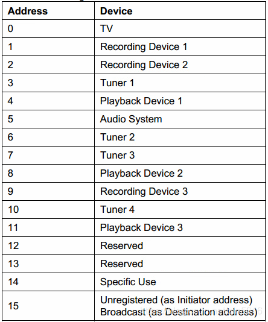

--

# 简介

HDMI CEC（Consumer Electronics Control）是一种HDMI功能，允许通过一根HDMI线连接的设备相互控制。通过CEC，用户可以使用一个遥控器来控制多个设备，简化了设备间的操作。以下是CEC的一些关键细节：

**1. 功能**
- **设备控制**：允许一台设备控制另一台设备，例如使用电视遥控器控制连接的Blu-ray播放器。
- **一键播放**：一台设备启动时，可以自动打开并切换其他设备到相应的输入源。
- **待机控制**：可以同时关闭所有连接的设备。
- **音频控制**：控制AV接收器的音量。

**2. 架构**
- **总线拓扑**：所有支持CEC的设备连接在同一条总线上，互相通信。
- **逻辑地址**：每个设备在CEC总线上都有一个唯一的逻辑地址，用于标识和通信。

**3. 报文**
- **单字节报文**：用于简单的命令和响应，例如请求设备信息。
- **多字节报文**：用于更复杂的数据传输，例如传输OSD名称。

**4. 协议**
- **协议版本**：CEC协议有多个版本，每个版本增加了新功能和改进。
- **命令集**：CEC协议定义了一组标准命令，例如`One Touch Play`、`Standby`等。

**5. 限制**
- **带宽**：CEC信号带宽较低，适用于简单命令传输，不适合大数据量传输。
- **兼容性**：不同品牌的设备可能存在兼容性问题，尽管CEC是标准化协议。

以下是一个简要的CEC功能表：

| **功能**   | **描述**                   |
| ---------- | -------------------------- |
| 设备控制   | 使用一个遥控器控制多个设备 |
| 一键播放   | 自动切换输入源并播放内容   |
| 待机控制   | 同时关闭所有连接的设备     |
| 音频控制   | 控制AV接收器的音量         |
| 逻辑地址   | 每个设备都有唯一的逻辑地址 |
| 单字节报文 | 简单命令和响应             |
| 多字节报文 | 复杂数据传输               |

通过CEC，HDMI连接的设备之间的互操作性得到了极大的提升，用户体验也更加便捷。

# cec只用一根线来实现通信的原理是什么

HDMI CEC（Consumer Electronics Control）使用一根线进行通信的原理如下：

**1. 单线通信**
CEC使用HDMI电缆中的第13根引脚进行通信，这根引脚专门用于CEC信号传输。由于所有支持CEC的设备都连接到这根引脚上，==形成一个单总线拓扑结构。==

**2. 电压信号**
CEC信号通过电压电平的变化来传输数据。通常，CEC总线处于高电平（逻辑1），当需要传输数据时，电平会被拉低（逻辑0）。

**3. 时序**
数据传输通过特定的时序协议进行编码和解码。CEC协议规定了信号电平变化的时间间隔，用于表示二进制0和1。例如：

- **逻辑0**：信号保持低电平的时间较短。
- **逻辑1**：信号保持低电平的时间较长。

**4. 报文结构**
CEC通信通过发送报文实现。每个报文包括报文头（包含源地址和目的地址）和数据字段。报文在总线上依次传输，设备通过识别报文头中的地址信息决定是否处理报文。

**5. 冲突避免**
由于所有设备共享一条总线，==CEC协议包含冲突避免机制==。设备在发送数据前会监听总线，确保没有其他设备在发送。如果同时有多个设备尝试发送数据，协议规定的优先级机制将决定哪台设备继续发送，哪台设备停止发送。

**工作原理总结：**
- **单总线拓扑**：所有设备通过HDMI电缆中的第13引脚连接在同一条总线上。
- **电压变化**：通过电压电平变化传输数据。
- **时序控制**：特定的时间间隔表示二进制数据。
- **报文结构**：报文包含源地址、目的地址和数据字段。
- **冲突避免**：通过监听总线和优先级机制避免通信冲突。

以下是HDMI CEC通信的原理总结表：

| **原理** | **描述**                           |
| -------- | ---------------------------------- |
| 单线通信 | 使用HDMI第13引脚进行信号传输       |
| 电压信号 | 通过电压电平变化表示逻辑0和1       |
| 时序控制 | 特定时间间隔表示二进制数据         |
| 报文结构 | 报文包含源地址、目的地址和数据字段 |
| 冲突避免 | 通过监听总线和优先级机制避免冲突   |

这种设计使得CEC能够在不增加额外线缆的情况下实现多设备间的控制和通信，极大地简化了用户操作。

# 一些信息

事实上HDMI升级到1.3时，人们就发现了HDMI多了一个CEC功能。ARC就是在HDMI版本升级到1.4出现的功能 

CEC，全称是Consumer Electronics Control，消费类电子控制。

CEC功能为用户带来许多方便，

它允许终端用户**使用一个遥控器控多个支CEC的HD设备**，

从而无需使用多个遥控器来控制电子设备，如：电视机(TV)、机顶盒和便携式HD设备。

HDMI-CEC功能，功能上大致都是**借着CEC信号让用户可以控制[HDMI接口](https://www.baidu.com/s?wd=HDMI接口&tn=44039180_cpr&fenlei=mv6quAkxTZn0IZRqIHckPjm4nH00T1Y3uhm1nHPhPjTYmWPWn1Pb0ZwV5Hcvrjm3rH6sPfKWUMw85HfYnjn4nH6sgvPsT6KdThsqpZwYTjCEQLGCpyw9Uz4Bmy-bIi4WUvYETgN-TLwGUv3EPWfYn1fzP1f)上所连接的装置**。

如单键播放(One Touch Play)，

系统待机(SystemStandby)。

即是如果用户将影碟放进[蓝光播放器](https://www.baidu.com/s?wd=蓝光播放器&tn=44039180_cpr&fenlei=mv6quAkxTZn0IZRqIHckPjm4nH00T1Y3uhm1nHPhPjTYmWPWn1Pb0ZwV5Hcvrjm3rH6sPfKWUMw85HfYnjn4nH6sgvPsT6KdThsqpZwYTjCEQLGCpyw9Uz4Bmy-bIi4WUvYETgN-TLwGUv3EPWfYn1fzP1f)时，

电视会由于CEC信号的通知而自动开机，

然后视频通道亦会自动切换到播放器连接的通道上。

而当用户关掉电视时，CEC信号亦会通知HDMI相连接的装置一同进入待机。

由于这样，所以就可以完全变成单一遥控器控制所有HDMI连接的装置。

CEC总线的基本技术起源于欧洲的SCART接口。

HDMI在SCART技术基础上进行借用并发展为HDIM-CEC总线，

允许在系统内的AV产品之间进行查询和通讯。

CEC使得建立于现有的点对点E-DDC的“插入并播放（Plug&Play）”自动操作的全局控制成为可能，

从而减少系统的遥控器数量和简化基本操作所需的按键次数。

不过可以简单的这么理解，

在HDMI CEC最小系统里，

所有通过HDMI连接在一起的设备（包括电视、DVD、机顶盒等等） 在物理连接上，

各自的CEC的是全部连接在一起，

**可以看做，在一条CEC线（标准HDMI接头的第13个腿）上挂着所有的设备。**

# cec调节音量

但是多了一个音响设备操作上就会麻烦很多，

用电视遥控器开电视、音响遥控器开音响和调节音量，

切换机顶盒、[游戏机](https://www.smzdm.com/fenlei/youxiji/)等信号源

还要看你把它们接到电视还是音响设备上，

用不同的遥控器去控制对应的设备。

**而标题里所说的CEC正是为了解决这一麻烦而存在的，**

**有了它就可以用一个遥控器控制所有的设备。**

比如音响会自动跟随电视开关机，就不用再担心关了电视忘记关音响了

用电视遥控器调整音量，它实际上会通过CEC去调整音响的音量，所以一个遥控器就能解决问题。

CEC全文为Consumer Electronics Control，

用来传送工业规格的AV Link协议信号，

以便支持单一遥控器操作多台AV机器。

简单来说它就是通过HDMI线传送控制信号，

[电视机](https://www.smzdm.com/fenlei/dianshi/)开关机就通过HDMI发送控制信号给音箱开关机，

电视机遥控音量时候也自动调整音箱的音量，

**就无需用到音响自己的遥控器了。**

现在多数电视机都支持这个功能，

但各个厂家都各自取了花骚的名字，

而不是简单就叫CEC：

Philips - EasyLink
Sony - BRAVIA Link and BRAVIA Sync
Samsung - AnyNet+
Sharp - Aquos Link
Hitachi - HDMI-CEC
AOC - E-Link
Pioneer - Kuro Link
Toshiba - CE-Link and Regza Link
Onkyo - RIHD (Remote Interactive over HDMI)
LG - SimpLink
Panasonic - HDAVI Control, EZ-Sync, VIERA Link

所以支持CEC一直是我对音响的基本要求。

其实惠威M200/M300之类2.0多媒体音响，

效果会远好于价格贵几倍的声吧类产品，但不支持HDMI及附带的CEC、ARC功能，实际使用起来会麻烦很多。

ARC全文为Audio Return Channel即音频回传，

这个功能可以把电视机的音频“上传”到音响设备去。

音响设备只要用一根HDMI线连到电视，

**然后游戏机、HTPC、机顶盒等设备也接到电视机，**

**电视就会自动把正在播放设备的音频“上传”到音响，**

而无需在音响上做切换信号源的操作。

ARC则是HDMI接口附带的另一个极有用的功能，

比如你把音响、游戏机、电脑等设备同时接到电视的HDMI接口，

就可以用电视遥控器在设备间随意切换，

**而这些设备的声音都会通过ARC功能回传到音响去放大。**

**可以说有了CEC和ARC的HDMI才能让所有设备形成一个整体，**

不再担心老人孩子开了这个忘记开那个，折腾半天看不成电视玩不成游戏，也不用担心关机时候会漏掉哪个设备。

HDMI中的DDC会为设备分配物理地址。

**有CEC的设备都具有物理地址和逻辑地址，而没有CEC的设备只有一个物理地址。**

发送消息后，期望响应时间应小于200ms；

发送一个消息并收到答复的最大时间为1s。

CEC总线仲裁

CEC发送一个消息后，丢失总线所有权。再次发送消息时，需要再次申请总线所有权。

更具发送消息的情况不一，Signal Free Time的时间标准也不一致。

主要命令

One Touch Play
System Standby
One Touch Record
Timer Programming
Deck Control
Tuner Control
Device Menu Control
Remote Control Pass Through
System Audio Control

Device OSD Name Transfer
Device Power Status
OSD Display
Routing Control
System Information
Vendor Specific Commands
Audio Rate Control

CEC是与其他HDMI信号分开的电信号。

这允许设备在睡眠模式下禁止其高速电路，

但是可以被CEC唤醒。

它是一个单独的共享总线，直接连接在设备上的所有HDMI端口间，可以流过所有完全断电的设备。

**总线是开路集电极线，有点像IIC，被动上拉至+3.3V，设备拉低进行数据传输。**

消费类电子控制（CEC）是HDMI的一项功能，

旨在允许用户通过仅使用一个遥控器来命令和控制HDMI连接的设备。

它是一种单总线双向串行总线，基于CENELEC标准AV.link协议，可执行远程控制。

CEC的布线是强制的，尽管产品中CEC的实施是可选的。

CEC在HDMI 1.0协议中定义，并在其后的标准中更新（将定时器和音频命令添加到总线）。（据百度了解目前，国内电视机大多数不支持CEC功能，国外使用CEC较为普遍）

# 参考资料

1、CEC、ARC功能介绍

https://www.cnblogs.com/yuanqiangfei/p/11023162.html

2、

https://blog.csdn.net/qq_30624591/article/details/106635069

3、居家DIY系列 篇二十三：音响、声吧失效了？五种方案解决机顶盒CEC缺陷

https://post.smzdm.com/p/738281/

4、

https://blog.csdn.net/ftswsfb/article/details/100183640

5、

https://blog.csdn.net/qin5016/article/details/104328502