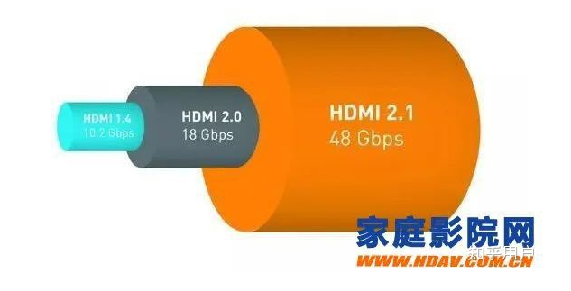
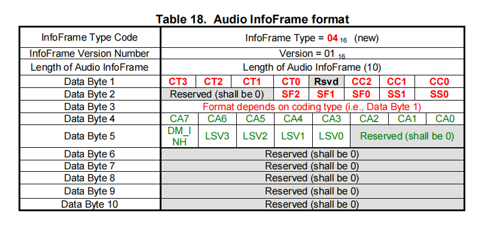

--

最近的工作涉及到较多的hdmi相关的概念。

在这篇文章统一进行学习梳理。

# hdmi官网规范

https://hdmi.org/spec/hdmi2_1_cn


# SCDC

SCDC：State and Control Data Channel；

 VSDB：Vendor-Specific Data Block


参考资料

1、

https://blog.csdn.net/lxm920714/article/details/114119926

# RSEN

The [HDCP specification](https://www.digital-cp.com/sites/default/files/HDCP_Specification Rev1_3.pdf) explained the use of HPD (hot-plug detection) and RSEN (receiver sense): 

When HPD is high, the source reads EDID through I2C from the sink. 

Then when the RSEN goes high, the source turns on the TMDS signal in an appropriate format.


参考资料

1、

https://electronics.stackexchange.com/questions/375077/hdmi-receiver-sense-logic-and-tmds-capacitor-coupling


# DVI和HDMI中的TMDS接口协议

DMI旨在解决DVI的缺陷，提供更优秀的解决方案。**HDMI也采用了和DVI一致的TMDS信号。**

TMDS（Transition Minimized Differential signal），即过渡调制差分信号，也被称为最小化传输差分信号，是指通过异或及异或非等逻辑算法将原始信号数据转换成10位，前8为数据由原始信号经运算后获得，第9位指示运算的方式，第10位用来对应直流平衡（DC-balanced，就是指在编码过程中保证信道中直流偏移为零，电平转化实现不同逻辑接口间的匹配），转换后的数据以差分传动方式传送。

这种算法使得被传输信号过渡过程的上冲和下冲减小，**传输的数据趋于直流平衡**，使信号对传输线的电磁干扰减少，**提高信号传输的速度和可靠性。**


参考资料

1、

https://blog.csdn.net/maopig/article/details/122667973


# hdmi2.1和hdmi2.0的区别

大多数中高端电视都提供至少一个HDMI 2.0端口，

如果你在过去几年买过一台电视机，那HDMI端口基本上是2.0a或2.0b甚至更低。

由于2.0a和2.0b之间的差异相对较小，所以我们今天直接讨论[2.0](https://www.zhihu.com/search?q=2.0&search_source=Entity&hybrid_search_source=Entity&hybrid_search_extra={"sourceType"%3A"answer"%2C"sourceId"%3A2251424834})与2.1之间的区别。



综合各种资料数据，我们可以看到，两种标准最明显的差距就是带宽。

HDMI 2.0的当前带宽容量为18 Gbps，

而HDMI 2.1则以48 Gbps的速率运行。

这种带宽的增加使得HDMI 2.1能够传输更多信息，也意味着经HDMI 2.1传输的画面将有更高分辨率和更高[帧速率](https://www.zhihu.com/search?q=帧速率&search_source=Entity&hybrid_search_source=Entity&hybrid_search_extra={"sourceType"%3A"answer"%2C"sourceId"%3A2251424834})。

目前，HDMI 2.0能够实现60 FPS的4K图像或30 FPS的8K图像。

而新的HDMI 2.1则可以显示120 FPS的4K图像或60 FPS的8K图像，甚至还可以支持10K分辨率显示。

HDMI 2.1还有许多其他优点。

例如，HDMI 2.1支持“动态HDR”内容，它允许在逐帧的基础上调整HDR元数据内容。

HDMI 2.1还具有eARC功能，这是一种增强型[音频回传通道](https://www.zhihu.com/search?q=音频回传通道&search_source=Entity&hybrid_search_source=Entity&hybrid_search_extra={"sourceType"%3A"answer"%2C"sourceId"%3A2251424834})，可通过HDMI线缆传输高质量的[无压缩音频信号](https://www.zhihu.com/search?q=无压缩音频信号&search_source=Entity&hybrid_search_source=Entity&hybrid_search_extra={"sourceType"%3A"answer"%2C"sourceId"%3A2251424834})。


**你可能还需要一条HDMI 2.1线缆**

与大多数接口标准一样，想要享受HDMI 2.1提供的完整服务，你还需要一条全新的HDMI 2.1线缆，

因为HDMI 2.1 48G的线缆以及信号源等跟目前的HDMI 1.4/2.0不同，

**厂商需要使用新的制造方法，**

而HDMI论坛也需要引入一套新的认证程序，来确保线缆能在高速率下正常工作并支持所有特性。

好消息是，在前不久，有媒体称HDMI论坛即将完成对第一个系列HDMI 2.1兼容电缆的认证，届时我们将看到“官方”的HDMI 48G线缆。


## 主要区别还是HDMI2.1可以支持8k60p，而HDMI2.0最大只能支持4k60p


https://www.zhihu.com/question/502594135


# IEC60958/61937协议

IEC60958/61937协议是我们[音频](https://so.csdn.net/so/search?q=音频&spm=1001.2101.3001.7020)开发中常见的一种协议，

 IEC60958/61937是一种传递数字音频的接口规范，相比I2S，IEC60958/61937通过一根线同时传递时钟信号和数据信号。

IEC60958和IEC61937的最大差别是：IEC 60958只能传递2个channel的音频数据，而IEC 61937可以传递更复杂的音频数据，如MPEG2那种多声道, AC3 或DTS。

https://blog.csdn.net/weixin_47702410/article/details/123360900

# CKDT

*CKDT*. [TMDS clock detection]

像素时钟检测（CKDT）

这个是属于Rx相关的检测。

TMDS Clock 就是Pixel Clock，即一个像素点所用的时钟频率。


# RSEN

这个是属于Tx的检测。有downstream的设备接入了。

HDMI Receiver Sense Logic 

# DSD

**Direct Stream Digital**（**DSD**）是一项属于[Sony](https://zh.wikipedia.org/wiki/Sony)和[飞利浦](https://zh.wikipedia.org/wiki/飛利浦)的专利，利用[脉冲密度调制](https://zh.wikipedia.org/wiki/脈衝密度調變)（pulse-density modulation）[编码](https://zh.wikipedia.org/wiki/編碼)将音频信号存储在数字媒体上的科技，这项技术的应用对象是[SACD](https://zh.wikipedia.org/wiki/SACD)。


参考资料

1、

https://zh.wikipedia.org/wiki/Direct_Stream_Digital

2、

https://www.whathifi.com/advice/what-dsd-audio-how-it-works-where-to-download-files-and-more

# bitstream vs pcm

从标题看，bitstream就是一个跟pcm分庭抗礼的概念，是一个级别的东西。

是两种工业标准，用来规定从发送器到喇叭的音频。

pcm就是熟悉的脉冲编码调制。

而bitstream则是一个泛指，指的是数字音频格式。经过编码的。

所以bitstream相对于pcm的一个优势就是传输的数据量更小。

pcm没法支持环绕声。


当您在电视菜单中选择比特流选项时，您设备的所有解码器都会被绕过。您的信号不是在本地解压缩文件，而是将音频发送到接收器。

换句话说，如果您在电视上将其设置为 PCM，您的新 PS5 将在将音频文件发送到电视之前对其进行解码。如果您将其设置为比特流，则解码是在电视而不是计算机上完成的。


设置bitstream，那么解码是在目标设备上做的。

## 如何选择

简单来说：

bitstream性能更好。

pcm兼容性更好。


参考资料

1、

https://playthetunes.com/pcm-vs-bitstream/

# CEA861-A

这个标准的全称是：

A DTV Profile for Uncompressed High Speed Digital Interfaces


https://ia803004.us.archive.org/12/items/CEA-861-B/CEA-861-B.pdf


# Audio InfoFrame

准确来说，我这里要讨论的概念是HDMI InfoFrame。

AVI/AUDIO InfoFrame属于辅助数据类别。

一个InfoFrame打包仅仅能够载送一个InfoFrame。

而且，依据HDMI的规范，其大小被限制在30个字节加上一个检验和(CheckSum)字节。


不论图像是YCbCr或RGB,传送它非常重要，

至少每两帧图像要传一次AVI InfoFrame. 

HDMI Source用它去告诉HDMI Sink关于要传输图像的各种特质，

比如:编码(RGB/YCbCr)，扫描方式(Overscan/Underscan),显示比例(16:9/4:3)，像素重复率，等等。


HDMI中的格式是以电视的立场为出发点而做的，

而且是直接从EIA/CEA-861-B “A DTV Profile for Uncompressed High Speed Digital Interfaces”标准参考而来。

EIA/CEA-861-B所制定的格式多达34种，

若是再加上一些如像素重复(Pixel Repetition)的小变化，就有348种之多。

因此，很多的字段都是来自于EIA/CEA-861B，内容细节上颇为繁复。


上面的图AVI InfoFrame的打包标头(Packet Header)与打包内涵(Packet Content)的格式，

简单掌握住一个重点，

AVI InfoFrame所包含的信息乃是为了实现与达成显示模式自动化(Display Mode Automation)而规划的一种方法或机制。

当然，所有的重点都处于打包中各个内涵的字段之中。


AVI InfoFrame的内容不去了解，

可以用一种比较形象的比喻来解释，

有些人拍影片的格式会有多种花样，

其内容不见得与消费者家中电视机的长宽比(Aspect Ratio)相符合，

因此即使您拥有**非常智能的电视机，想要将内容影像做最佳化的显示**，唯一的方法就是要了解所收到的影像状况，

这也就是AVI InfoFrame所要去完成的任务。


HDMI接口的源装置使用IEC 60958 Channel Status位、

IEC 61937 Burst Info以及Audio InfoFrame来表达有源音频串(Active Audio Stream)的特性，

Audio InfoFrame的传送是Data Island打包可以载送的任何时间点。


Audio InfoFrame所传送的额外数据，包含多轨道L-PCM扩音器喇叭的配置以及降混音量(Down-mix Volume)调整的修正


下面这个截图来自于CEA861文档。



我现在做的adv7674的hdmi repeater芯片里。

有个结构体使用了这个。刚好10个字节。

字节1到字节3，在用来识别一个音频的信息时很有用。

如果source设备支持除了basic audio之外的音频。

这里面包含的信息就很有用。

如果source只支持basic audio，那么不要求发送这个InfoFrame。但是还是推荐发一下。

在大多数情况下，通过解析音频数据本身，可以得到音频的格式信息。

（这个是靠IEC61937来做的）

如果InfoFrame里的信息，跟音频数据本身解析得到的信息不一致，以音频本来解析到的信息为准。


## 字节分析

```
字节1（从1开始数，从1到10）
	分为3个部分：
	高4个bit：命名为CT3到CT0
		CT表示codec type。编码类型。
		0000：表示要参考Stream Header的内容。
		0001：表示IEC69058的PCM
		0010：AC-3
		0011：MPEG1
		0100：MP3
		0101：MPEG2
		0110：AAC
		0111：DTS
		1000：ATRAC
		其余：保留。
	中间1个bit：保留。
	低3个bit：命名为CC2到CC0
		CC是Channel Count的意思。通道数。
		000：表示要参考Stream Header的内容。
		001：2ch
		010:3ch
		011:4ch
		...
		111:8ch。就在数值的基础上加1就是ch数。
		
		
字节2:
	分为3个部分。
	最高3个bit：保留。
	中间3个bit：命名为SF2到SF0
		SF是Sample Freq的意思。
		000：需要参考strea header
		001:32K
		010:44.1K
		011:48K。
		100:88.2K
		101:96K
		110:176.4K
		111:192K。
	最低2个bit：命名为SS1到SS0
		SS是Sample Size。
		00：表示要参考Stream Header
		01:16bit
		10:20bit
		11:24bit
字节3：
	format信息，根据字节1的内容而不同。
	
字节4和字节5，都只对多声道的LPCM有用。

字节4：
	一个整体，命名为CA7到CA0
	CA是Channel Allocation的意思。
	
	
```


参考资料

1、

https://blog.csdn.net/yyao1024/article/details/6398727

数字视频学习专栏

https://blog.csdn.net/qq_40215005/category_10214745.html

# IEC60958-3


参考资料

https://www.doc88.com/p-61799879064901.html

# CEA

CEA的英文全称是：Consumer Electronics Association，

中文意思是消费电子协会。

美国消费电子协会(CEA)由1000多家会员企业组成，

各会员企业的经营涉及音频、视频、移动电子、通信、信息技术、多媒体产品及附属配件的开发、生产和销售，以及相应的服务，并通过消费渠道提供给消费者。

CEA全体会员企业的年营业额总和超过800亿美元.

# CEA-861

CEA-861是美国电子消费品制造商协会（Consumer Electronics Association，CEA）制定的“未压缩数字视频标准”，最新版本为CEA-861-E


http://blog.chinaunix.net/uid-1827018-id-5167338.html


# CEA-861D

这个讲的是EDID扩展块的标准。


# IEC60958系列

```
79 IEC 60958-3:2003 Ed.2 数字音频接口 - 第3部分: 消费类应用
80 IEC 60958-4:2003 数字音频接口-第4部分：专业应用
```


https://zhidao.baidu.com/question/6186730.html

# HBR

HBR是High BitRate的缩写。

```
可以分为两种：
pcm的
	192K/8ch。
	这种情况比较少。但是可以有。
	数据量比较大。
bitstream的
	192K/8ch
	mat、truehd都属于这种情况。
```

# hdmi packet分类


# HDMI2.1

这个是官方介绍ppt。

https://hdmiforum.org/wp-content/uploads/2017/11/HDMI-Forum-2.1-November-Release-Presentation-EN.pdf

# one bit audio


https://www.sonicstudio.com/pdf/papers/1bitOverview.pdf

https://www.techbang.com/posts/22079-unlocking-the-mystery-of-dsd-the-dsd-digital-audio-coding-vs-pcm

# earc rx cap（也就是earc这个port的EDID）

```
earc rx cap数据结构
earc rx应该包括一个能力数据。
描述了earc rx接口的audio能力。
应该在进入到earc rx功能前，保证把这个能力已经设置好了。

earc能力描述结构
字节0：
	版本，固定为01
从字节1开始，是一个个data block。
如果字节内容是0了。表示后面没有内容了。
就是不用的部分，补零就好了。
反正要填满256个字节的空间。

block data的结构。
第一个字节：高3bit保留，低5个bit，从0到31，表示各个block的id。
	而id里面，0和4-31这些都是保留的。
	0之所以保留，是因为id=0时，这个字节整个就等于0x00。
	而0x00是作为无效数据的检测字符的。
	只有1/2/3这3个使用了。
	id=1：表示使用CTA-861-A描述符。
	id=2：表示CTA-861-A speaker allocation 描述符。
	id=3：表示audio stream layout。
第二个字节：
	表示后面的内容的字节数。
第二个字节到本block的结束：
	有效的数据。
	
id=1，表示这个数据库后面是跟这audio data block的。
	也可以是vendor specific audio data block。
	也可以同时包含了这2个内容。

id=3的时候，len固定为1，后面只跟一个字节。
这个字节的含义：
	bit7：如果是1，表示支持AI。
	bit6：保留。
	bit5到bit3：
		表示one bit audio layout。
		取值0到7.
		0：不支持one bit audio，或者是只支持6ch的one bit audio。
		1：6ch和12ch的one bit audio都支持。
		2到7：保留。
	bit2到bit0：
		这个部分是表示multiple channel lpcm的layout。
		取值0到7。
		0：2ch和8ch支持。
		1：2ch、8ch、16ch都支持。
		2：2ch、8ch、16ch、32ch都支持。
		3到7：保留。
	这个字节，我就给0x80就好了。
	
先看一下当前默认的数值吧。
（前面有2个0x00，我认为是故意写的非法值，去掉，然后后面就是可以解释的合法值。）
0x01 版本
0x01 0x1d id=1,0x1d表示后面有29个字节。25个字节的adb。加4个字节的speaker allocation。
0x38 
0x09 0x7f 0x07 
0x0f 0x7f 0x07 
0x15 0x07 0x50 
0x3d 0x07 0xc0 
0x4d 0x02 0x00 
0x57 0x06 0x00 
0x5f 0x7e 0x01 
0x67 0x7e 0x00 

0x83 0x4f 0x00 0x00 

0x03 0x01 0x80 这个部分就是id=3的情况，只有一个。
```


# 参考资料

1、HDMI设计3--HDMI 1.4/2.0 Transmitter Subsystem IP

https://blog.csdn.net/Archar_Saber/article/details/123018265

2、hdmi设计系列文章

https://blog.csdn.net/archar_saber/category_11616808.html

3、HDMI介绍与流程

这篇非常好。

https://www.cnblogs.com/taigacon/p/3840653.html