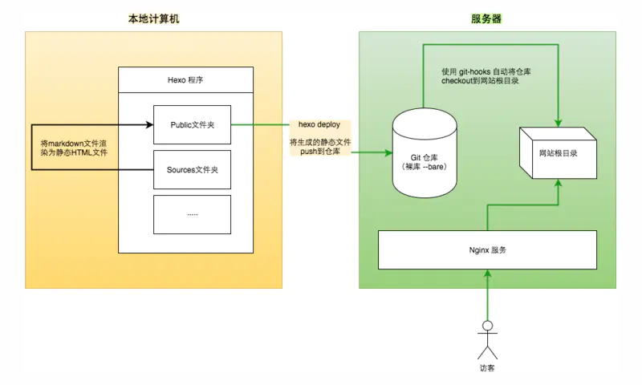
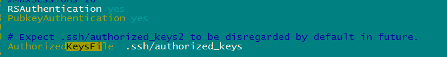
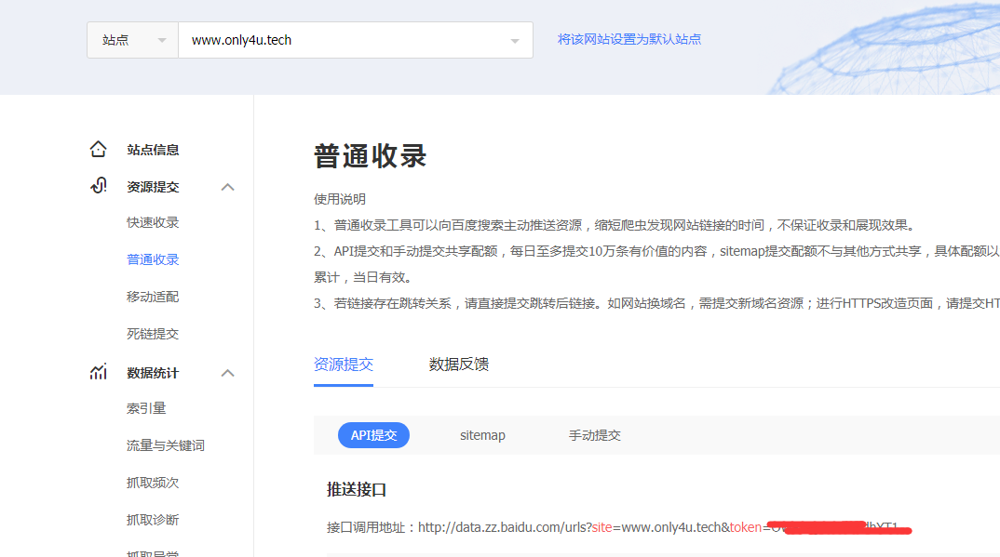
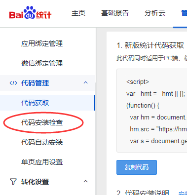

1

之前用hexo在github上搭建过个人博客。后面觉得麻烦，而且github上的内容无法被国内收录。

也就没有什么动力去写了。

现在有点想做自媒体，所以就打算立足国内，来考虑怎么把个人博客做好。

国内跟github对标的就是码云了。那就在码云上做。

下面操作尽量在git bash下来做。

先安装hexo-cli工具。

```
npm install -g hexo-cli # -g是为了全局安装，这样在任意命令行里都可以使用hexo这个命令。
```

安装部署工具：

```
npm install hexo-deployer-git --save # 这个必须是--save，不然会hexo d的时候，会提示找不到hexo-deployer-git
```

然后执行下面的操作：

```
$ cd /d/work/gitee/playopenwrt # playopenwrt这个名字是因为我想要做的是openwrt为主要方向的网站。
$ hexo init #这一步是下载安装依赖。
$ hexo s  # 这样就启动了本地的预览。访问http://localhost:4000 就可以看到。
# 然后就是需要生成静态页面，然后发布到码云上去。
$ hexo g # 这个是生成最终的html文件，可以发布到码云上的。
```


然后我们到gitee.com上，新建一个项目，就叫playopenwrt。

然后修改_config.yml文件。

修改最后面的deploy。

```
deploy:
  type: git
  repo: https://gitee.com/teddyxiong53/playopenwrt.git
  branch: master
  message: blog update
```

部署成功后。到gitee.com上，打开对应仓库的pages服务。然后通过下面的网址进行访问即可。

http://teddyxiong53.gitee.io/playopenwrt

可以访问到。但是当前的页面完全没有格式。css没有起作用。

这个是因为需要配置资源的路径。

还是修改_config.yml文件。改成这样。

```
url: http://teddyxiong53.gitee.io/playopenwrt
root: /playopenwrt/
```

然后重新部署：

```
hexo generate --deploy
```

但是还是没有改过了。

好像是要到服务里，执行更新才行。

这个太麻烦了。

希望达到的最终效果，应该是，

有2个仓库，一个就是当前这个，放生成的html页面。

另外一个仓库，就是放当前写代码的目录，名字就叫playopenwrt_source。排除掉node_modules、public等目录。


1、我写markdown。写完后，本机预览觉得没有问题。

2、我提交到playopenwrt_source。workflow自动触发生成和部署操作。

然后playopenwrt那边就可以看到自动更新后的网页了。

这样才是最好的。


先不管。先在本地完成必要的操作。

换一个主题。

next这个主题，比较简介。但是白色太扎眼了。

默认是landscape（地平线）这个主题。这个太普通。

wzpan这个作者有一个freemind的主题，看起来不错。考虑。

就用这个吧。

下载地址：

https://github.com/wzpan/hexo-theme-freemind

然后安装依赖：

```
npm install hexo-tag-bootstrap hexo-generator-search hexo-recommended-posts --save
```

上面这样安装会有问题。

需要下面这样才行。hexo-tag-bootstrap版本高了不行。

```
npm uninstall hexo-tag-bootstrap
npm install hexo-tag-bootstrap@0.0.8 --save
```

这里有说明。

https://github.com/wzpan/hexo-theme-wixo/issues/24

这个主题，还需要加一点东西才能完全正常。


这个主题内置了评论系统。

```
comment_js:
  type: "github"
  user: "wzpan"
  repo: "hexo-theme-freemind-blog"
  client_id: "bf7d4ba11877db88543e"
  client_secret: "bff8a6b06b745c0bfcdccbe225623ea8e2a057bb"
  count: 5
```


怎么实现的？

当前看起来加载比较慢，尤其是图片。能不能弄到gitee上来？

这里说了。这个不再维护，推荐使用gittalk或者gitment。

https://github.com/wzpan/comment.js

但是gittalk这个也是基于github的。国内速度不好。

所以还是要在gitee上找替代。

但是看comment.js，可以用gitee做后端。

但是现在感觉不对。

现在点击评论，是跳转到gitee.com的主页。也没法评论。

评论和图片。

这是当前需要解决的2个问题。

还是不要用当前主题默认的评论系统。还是有点非主流。

我希望是一次配置，后面不要再折腾。希望就是稳定可靠。

看网上很多人推荐valine。

还是尽量从gitee里找吧。


从当前freemind的主题看。里面只支持三种评论系统：

多说、disqus、commentjs。

那当前这个主题我得放弃了。


首先多说和网易云已经倒下了，其次畅言需要备案，

Disqus，Hypercomments和LiveRe都是国外的，加载速度贼慢，甚至有被墙的可能，

寻觅了很久之后，从Material主题换成next主题之后，终于找到了一个好用的评论系统，那就是 **valine**

我使用的是Next 5.1.3版本，本身就已经集成了valine，因此正常情况下是按照官方文档走就可以了，5分钟开启你的评论系统~


那就用next吧。不浪费时间在这个上面。


直接github搜索hexo-theme（因为规范要求搭建都这样命名hexo-theme-xx）

https://github.com/search?q=hexo-theme

最多的就是next。

但是这个是官方的新一代主题。

https://github.com/theme-next/hexo-theme-next

但是使用后，完全不显示，只有一些代码。

搜索了一下，是需要安装这个。


```
npm i hexo-renderer-swig --save
```

安装后好了。

现在评论系统配置好了。

就是在LeanCloud里配置一个应用。

然后配置valine评论系统。


然后就是看图片怎么存放？

就直接放当前目录下就好了。因为当前定位，一个网站不会特别大。

只专注一个主题。


在最外面的config.yml里，修改

```
post_asset_folder: true
```

还需要安装

```
npm install hexo-asset-image --save
```

然后新建一篇文章。

```
hexo new "test"
```

会在_post目录下，生成一个test目录。你把图片放在test目录下就好了。

这样用typora来写的时候，可以实时预览到图片。

但是hexo s的时候，看到的链接是这样的：

```
<p></p>
```

这样是看不到图片的。

怎么解决？


我的原则还是不要牵扯太多系统。

如果码云上可以一站式搞定。当然最好。

当前除了码云，还把LeanCloud也扯进来了。

希望不要再增加了。因为增加越多，风险越大。挂掉其中一个就导致系统不能正常工作。


如果hexo在处理本地图片有这么多问题。

那么我就要考虑放弃hexo了。

看官网上的讨论。这个还真是困扰了不少人。


这里有提到这个图片的问题。

https://github.com/xcodebuild/hexo-asset-image/issues/47


用下面的代码替换hexo-asset-image下的index.js内容，可以用的方式来插入和显示图片。但是这样很不爽。


经过研究，可以用picgo配置gitee.com作为图床。

而且typora还可以集成picgo，这样就可以进行无缝的插入图片的写作体验了。非常好。

具体做法在文章《markdown插入图片高效做法》里。


到现在，基本环境都有了。

1、平台2个：gitee.com，放文章和图床。LeanCloud，放评论数据。gitee.com现在发展很好，而且有国家站队。LeanCloud不知道，应该还行吧。评论不是重点，如果没了就没了吧。

2、生成软件，就用hexo。其他的也不是完美，至少hexo目前有的问题，我都找到了好的解决方案，而且hexo我也比较熟悉。

3、写作软件：还是用typora。我想要安装多个实例。因为我希望记笔记还是可以随意一点，而写博客，则需要认真写，注意排版格式，不希望把笔记的图片跟博客的图片混到一起去。这样typora就要分开设置。实际上无法安装多个typora。这个怎么处理呢？

那我的博客写作，就用vscode来做。这样反正是需要精细化的。所以就vscode来做。

4、仓库有这么几个：

playopenwrt：这个是最终的html文件，直接提供pages服务。

playopenwrt_source：这个放markdown文件。方便在不同的电脑上同步来写。

playopenwrt_pic：做图床。

应该有这么3个就够了。


现在还需要把主题设置一下。

home和archive点击都是无效链接。

```
hexo new page home
hexo new page categories
hexo new page tags
hexo new page about
hexo new page archives
```

把文章归入分类只需在文章的顶部标题下方添加`categories`字段，即可自动创建分类名并加入对应的分类中


现在对应的文件都生成了。

但是首页点击的链接不对。

是这种跳转地址。

```
http://127.0.0.1:4000/playopenwrt/about/%20
```

是因为有2点需要改：

1、config.yml里||和\之间不能有空格。

2、需要在home等生成的index.md里，加上type。类似这样。每个都加。

```
---
title: tags
date: 2020-11-27 13:28:03
type: tags
---
```

然后就可以了。

现在基本上好了。


现在还有一点比较坑的，就是push到gitee后，还比较手动到pages页面点一下更新，才能生效。

如果要自动更新，需要99元一年。这个也是坑。

安装 npm i gitee-publish -g 然后按照文档说明可以实现一键部署

安装不了。

用这个文章里的脚本来做看看。

https://www.jianshu.com/p/6460df84a099

这个也是依赖puppeteer这个。

还是安装不了。也是个麻烦。

那就手动点吧。

但是我至少可以让浏览器打开对应的网页吧。我只需要再点击一下更新按钮就够了。

能少做一点就少做一点。

写一个upload.sh脚本：

```
#!/bin/sh

hexo g
hexo d

explorer.exe "https://gitee.com/teddyxiong53/playopenwrt/pages"
```

后面改了内容后，就执行这个脚本就好了。


# valine评论系统分析

这个评论系统是怎么做的？数据我怎样进行保存呢？

leancloud如果服务不能用了，我该怎么办？

数据可以导出。

代码在这里：

https://github.com/xCss/Valine

是基于nodejs写的。

所以还是需要把hexo的代码框架看明白。

了解一下主题是怎么写的。

Valine 是一款样式精美，部署简单的评论系统， 第一次接触便被它精美的样式，无服务端的特性给吸引了。

它最大的特色是基于 LeanCloud 直接在前端进行数据库操作而无需服务端，极大的缩减了部署流程，**仅需要在静态页引入 Valine SDK 即可。**


以下是 Valine 官网提供的快速部署脚本，其中 `appId` 和 `appKey` 是你在 LeanCloud 上创建应用后对应的应用密钥。也正是基于这对密钥，Valine 在内部调用了 LeanCloud SDK 进行数据的获取，最终将数据渲染在 `#vcomments` 这个 DOM 上。这便是 Valine 的大概原理。

```
<head>
  ..
  <script src='//unpkg.com/valine/dist/Valine.min.js'></script>
  ...
</head>
<body>
  ...
  <div id="vcomments"></div>
  <script>
    new Valine({
      el: '#vcomments',
      appId: 'Your appId',
      appKey: 'Your appKey'
    })
  </script>
</body>
```

# 部署到云服务器

看了一下基本原理，是基于git的。

我先用宝塔面板安装一下基本环境。

网站现在等待备案。

先把目录上传再说。

原理是这样：



git默认安装好了。

添加git用户：

```
adduser git
```

会提示输入密码等信息。

然后把git用户添加到sudoer里。

```
sudo visudo
```

在最后添加一行：

```
git     ALL=(ALL)       ALL
```

然后修改/etc/passwd文件

```
把git用户对应的那一行的/bin/bash改成/usr/bin/git-shell
```

这样git就不能通过bash进行的登陆。是为了安全。

（这一步可以不做，我做了反而是无法登陆的，还是保持bash吧）。

然后git服务器开启rsa认证。

修改/etc/ssh/sshd_config文件。

保证下面3个被设置。

```
RSAAuthentication yes
PubkeyAuthentication yes
AuthorizedKeysFile  .ssh/authorized_keys
```



然后切换到git用户。

执行下面的操作。

```
su git
mkdir ~/.ssh
# 在windows本地电脑，把~/.ssh/id_rsa.pub的内容拷贝出来。
# 然后粘贴到服务器上的~/.ssh/authorized_keys里面。（这个文件默认没有）
chmod 600 ~/.ssh/authorized_keys
chmod 700 ~/.ssh
```

但是还是不行。

我还是得输入密码。


也就说明权限异常

1.查看文件权限

```
[boss@10-110-155-26 .ssh]$ ll -h
-rw-r--r-- 1 boss boss 1.6K Feb  1 15:28 authorized_keys
```

由于安全原因，authorized_keys权限不能被其它用户所读取，而该文件因为为手动建立，所以权限为644，`chmod 600`将其权限变更

将authorized_keys改为600权限后，然后发现ssh登录的时候，依然显示的目录权限异常

2.查看文件目录权限

```
[boss@10-110-155-26 ~]$ ll -d .ssh/
drwxr-xr-x 2 boss boss 99 Feb  1 16:38 .ssh/
```

将目录权限改为700，再次登陆，发现ssh ok。


因为ssh安全的原因，所以不管是文件，还是目录，很多权限设定为都不能被group和other用户所读取，当权限不满足时，ssh认证会失败，即使ssh-key完全正确


然后在git的home目录下，创建www.only4u.tech.git仓库。

以git的身份。

```
git init --bare www.only4u.tech.git
```

```
git@VM-0-17-ubuntu:~$ git init --bare www.only4u.tech.git
Initialized empty Git repository in /home/git/www.only4u.tech.git/
git@VM-0-17-ubuntu:~$ ls
www.only4u.tech.git
```

然后进入仓库，在hooks目录下，新建一个post-receive脚本。

```
#!/bin/bash
git --work-tree=/www/wwwroot/www.only4u.tech --git-dir=/home/git/www.only4u.tech.git checkout -f
```

给post-receive脚本加上可执行权限。

```
chmod 777 post-receive
```

服务端准备好了。

然后是修改hexo的部署目标。

```
deploy:
  type: git
  repo: git@only4u.tech:/home/git/www.only4u.tech.git
  branch: master
  message: blog update
```

注意服务端把/www/wwwroot下面增加可写权限。

现在可以成功了。

```
root@VM-0-17-ubuntu:/www/wwwroot/www.only4u.tech# ls
2020  404.html  about  archives  categories  css  home  images  index.html  js  lib  search.xml  tags
```

我后续改了博客，只需要hexo g在hexo d就可以了。

没有备案，只是域名解析不帮你做而已。你直接用ip地址访问是可以看到的。

当前js文件什么的，都解析不到，导致格式都没有。

我当前的url配置不对。

改成这样：

```
url: http://www.only4u.tech
root: /
```

重新部署就好了。

现在环境搭建完成了。

接下来就是认真写内容了。


# 主题优化

看了一下next主题的配置细节。

可以把搜索打开，就用hexo自带的搜索，效果就非常好了。

LeanCloud还可以支持阅读次数这些的统计。

也加上。

但是现在不行。

阅读次数的可以了，关键就是LeanCloud里要创建一个class。

阅读时长怎么做？

是需要安装这个插件。

https://github.com/willin/hexo-wordcount

```
npm i --save hexo-wordcount
```

然后在next主题配置文件里搜索wordcount，设置为enable为true就好了。

# seo

首先是要添加站点地图。

需要安装这2个插件。

```
npm install hexo-generator-sitemap --save
npm install hexo-generator-baidu-sitemap --save
```

然后在站点的config.yml文件里，添加sitemap。

```
sitemap:
  path: sitemap.xml
baidusitemap:
  path: baidusitemap.xml
```

执行hexo g，就会生成这2个xml文件。

然后在sources目录下新建robots.txt。

写入下面的内容：

```
User-agent: *
Allow: /
Allow: /archives/
Allow: /categories/
Allow: /tags/
Allow: /resources/
Disallow: /vendors/
Disallow: /js/
Disallow: /css/
Disallow: /fonts/
Disallow: /vendors/
Disallow: /fancybox/

Sitemap: http://only4u.tech/sitemap.xml
Sitemap: http://only4u.tech/baidusitemap.xml
```

最后的网址要改成自己的。

然后是需要验证网站的是不是属于你。

我的域名还没有备案通过。先暂停。

到这里提交你的链接。

https://ziyuan.baidu.com/linksubmit/url

就填入你的域名就可以了。

## 百度

主动推送最为快速的提交方式，是被百度收录最快的推送方式。主动推送可以通过安装插件实现：

```
npm install hexo-baidu-url-submit --save
```

修改网站的config.yml。增加下面的配置。

```
baidu_url_submit:
  count: 5 ## 提交最新的五个链接
  host:   ## 百度站长平台中注册的域名
  token: your_token ## 准入秘钥
  path: baidu_urls.txt ## 文本文档的地址， 新链接会保存在此文本文档里
```

token的获取方法：红色涂抹处就是。




最后deploy的时候，除了上传到你的网站外，还要上传给百度。

```
deploy:
  - type: git
    repo: git@only4u.tech:/home/git/www.only4u.tech.git
    branch: master
    message: blog update
  - type: baidu_url_submitter ## 添加这里内容即可
```

然后hexo d就可以提交到百度了。

## 谷歌

https://search.google.com/search-console/welcome?hl=zh-CN


# 增加百度统计

http://tongji.baidu.com/sc-web/22248394/home/site/getjs?siteId=16142489

到这里，代码里拿到一个key。

填入到next主题的config.yml里。写在这一行冒号后面。

```
baidu_analytics:
```

然后重新生成和上传网页。

点击检查。可以看到正常了。



# 建多个网站

https://blog.csdn.net/weixin_44567104/article/details/102485265

先放着，后面会用得上的。


# 运营

这个个人网站值得学习。知识很杂。但是不乱。

https://www.dujin.org


# 参考资料

1、Hexo（NexT 主题）评论系统哪个好？

https://www.zhihu.com/question/267598518

2、Valine - 一款快速、简洁且高效的无后端评论系统

https://valine.js.org/#/

3、Hexo博客集成码云评论系统

https://www.jianshu.com/p/f5c4633524c7

4、为你的Hexo加上评论系统-Valine

https://blog.csdn.net/blue_zy/article/details/79071414

5、hexo除了next有哪些简约大气华丽并支持valine的主题？

https://www.zhihu.com/question/311190272/answer/591426559

6、hexo的next主题个性化教程:打造炫酷网站

https://www.jianshu.com/p/f054333ac9e6

7、hexo写博客时怎么插入图片

https://blog.csdn.net/weixin_40688217/article/details/90110975

8、

https://www.jianshu.com/p/3a05351a37dc

9、

https://www.joewsearch.com/2019/11/13/next-theme-set-tags/

10、next主题的模板引擎swig语法介绍

https://www.jianshu.com/p/c5d333e6353c

11、基于 Serverless 的 Valine 可能并没有那么香

https://www.mdeditor.tw/pl/poZY

12、Hexo部署在阿里云服务器上

https://www.jianshu.com/p/e1ccd49b4e5d

13、Hexo Next主题 使用LeanCloud统计文章阅读次数、添加热度排行页面

https://blog.qust.cc/archives/48665.html

14、Hexo博客Next主题SEO优化方法

https://hoxis.github.io/Hexo+Next%20SEO%E4%BC%98%E5%8C%96.html

15、

https://blog.csdn.net/weixin_44567104/article/details/102485265

16、hexo的next百度统计

https://www.jianshu.com/p/6eb068a68b17

17、Hexo博客提交百度和Google收录

https://www.jianshu.com/p/f8ec422ebd52