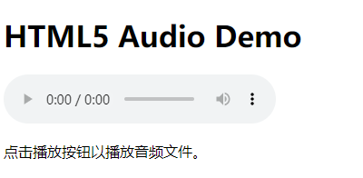
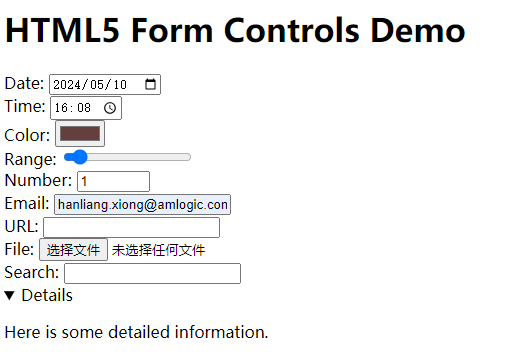

网站开发这一块，一直不太会。知识点都略懂。但是就是难以做出东西来。

现在还是以项目进行驱动，把相关知识点都理解一下。

# 简介

HTML（Hypertext Markup Language）是一种用于创建网页结构的标记语言。

它由一系列的元素（elements）组成，

这些元素用标签（tags）来标记，

例如 `<p>` 表示段落，`<h1>` 表示一级标题，等等。

==HTML被用来描述网页的结构，==

包括文本内容、图像、超链接以及多媒体等。

它是构建万维网的基础之一，与CSS（Cascading Style Sheets）和JavaScript一起，构成了现代网页的核心技术。

HTML文档通常包含在 `<html>` 元素中，并由两部分组成：

头部（`<head>`）和主体（`<body>`）。

头部包含了文档的元信息，如标题、字符集、引用的样式表等。

而主体则包含了页面的实际内容，如段落、标题、图像等。

HTML使用标签来定义不同类型的内容，并且这些标签可以嵌套在一起来创建更复杂的结构。

标签通常以开放标签（如 `<tag>`）和闭合标签（如 `</tag>`）的形式出现，闭合标签用于指示标签的结束。

总的来说，HTML是构建网页结构的基础，它为网页提供了框架和结构，使得内容可以以一种有意义且易于理解的方式呈现给用户。


# 发展历史

HTML的发展历史可以追溯到1989年至1990年间，当时由英国物理学家蒂姆·伯纳斯-李（Tim Berners-Lee）发明了WWW（World Wide Web）系统，这是第一个用于浏览因特网的系统。为了创建和呈现网页，伯纳斯-李设计了一种名为HTML的标记语言。

以下是HTML的主要发展阶段：

1. **HTML 1.0：** 1991年，蒂姆·伯纳斯-李创建了第一个HTML标准，其中包含了一些基本的标记元素，如标题、段落、列表等。这个版本的HTML非常简单，只有少数几种标记元素。

2. **HTML 2.0：** 1995年，HTML 2.0成为了第一个由Internet Engineering Task Force（IETF）发布的正式规范。这个版本增加了一些新的元素和属性，如表格、图像等，使得网页设计变得更加丰富和复杂。

3. **HTML 3.2：** 1997年，HTML 3.2成为了W3C（World Wide Web Consortium）发布的第一个HTML规范。这个版本引入了一些新的功能，如表单、框架等，为网页开发带来了更多的可能性。

4. **HTML 4.01：** 1999年，HTML 4.01成为了W3C发布的最后一个HTML 4规范。这个版本进一步扩展了HTML的功能，引入了样式表、脚本等新特性，并且更加严格地定义了语法和语义。

5. **XHTML：** 2000年，W3C发布了XHTML 1.0规范，它是HTML与XML的结合，旨在使HTML更加严格和模块化。XHTML强调了语法的规范性和可扩展性，但并没有取代HTML，而是作为HTML的一种变体存在。

6. **HTML5：** 2014年，W3C发布了HTML5规范，这是HTML的最新版本。HTML5引入了许多新的功能，如视频和音频支持、画布绘图、本地存储等，同时也改进了语义标记、表单控件等方面。HTML5的出现标志着HTML的现代化和多媒体化，为网页开发提供了更丰富和更强大的工具。

随着互联网的发展，HTML不断演进和完善，以适应不断变化的网络环境和用户需求。HTML仍然是构建网页结构的基础，同时也与CSS和JavaScript等技术密切配合，共同推动着Web开发的进步。

# <!DOCTYPE>`的理解

1、在html4.01里，有3种类型的`<!DOCTYPE>`声明。在html5里，只有一种，如下：

```
<!DOCTYPE html>
```

2、大小写不敏感。

# html5有了哪些改进？

1、新的图形库。html5引入了Canvas和WebGL函数库。可以让网站的内容变得更加丰富。

特别是WebGL库，几乎可以改变这一领域的游戏规则。雷神之锤II游戏的场景画面就是使用html5开发的。

2、更方便的多媒体内容。

3、地理定位。

4、拖放功能。

5、桌面通知。模糊了在线和本地应用的界限。

# html5的优势和劣势

优势：

1、html5是w3c推出的标准。是几百家公司一起酝酿的技术，像安卓一样。

2、更容易的跨平台。

3、自适应网页设计。自动适应电脑和手机。

4、可以很好地替代Flash。

5、被大量用于手机App和游戏。

劣势：

1、安全问题。

2、完善性。

3、技术门槛。

4、性能。

5、浏览器兼容性。

# html元素的属性有哪些

HTML元素可以有多种属性，这些属性可以控制元素的行为、外观和其他方面。以下是一些常见的HTML元素属性：

1. **id**: 元素的唯一标识符。
2. **class**: 元素的类名，可以用于CSS样式和JavaScript操作。
3. **style**: 元素的内联样式，用于设置元素的外观。
4. **src**: 用于图像、音频和视频等资源的URL。
5. **href**: 用于链接元素的URL。
6. **alt**: 图像的替代文本，当图像无法显示时显示。
7. **title**: 元素的标题，通常在鼠标悬停时显示。
8. **width** 和 **height**: 图像、表格等元素的宽度和高度。
9. **target**: 链接的打开方式，例如在新窗口中打开。
10. **type**: 输入元素的类型，例如文本框、按钮等。
11. **value**: 输入元素的值。
12. **checked**: 复选框和单选框的选中状态。
13. **disabled**: 元素的禁用状态。
14. **readonly**: 输入元素的只读状态。
15. **placeholder**: 输入框的占位符文本。
16. **rows** 和 **cols**: 文本域的行数和列数。
17. **for**: label元素关联的表单元素的id。
18. **name**: 表单元素的名称。
19. **action**: 表单提交的URL。
20. **method**: 表单提交的HTTP方法，通常是GET或POST。

这只是一小部分常见的HTML元素属性，实际上还有很多其他属性，可以根据需要选择合适的属性来控制和定制HTML元素的行为和外观。

## 这些属性是所有html元素例如div、input等共有的吗

不是所有的 HTML 元素都具有相同的属性，每个元素具有其自己特定的属性。虽然有一些属性是大多数元素通用的，但并不是所有元素都支持所有属性。例如，

`id` 属性是所有 HTML 元素共有的，它用于给元素指定一个唯一的标识符。而 `href` 属性则通常用于链接元素（如 `<a>` 标签）中，指定链接的目标 URL。 

一些属性像 `class` 和 `style` 则是许多元素都支持的，它们用于控制元素的样式。

其他一些属性，如 `src` 和 `alt`，通常用于图像元素（如 `` 标签），用于指定图像的源和替代文本。

还有一些属性是特定于某些元素的，比如 `rows` 和 `cols` 属性通常用于 `<textarea>` 标签，用于指定文本域的行数和列数。

因此，HTML 元素的属性是根据元素的类型和功能而变化的。在使用属性时，需要根据具体的元素和需求来选择合适的属性。

# html5引入的新特性说明

HTML5引入了许多新特性，以下是其中一些主要的：

1. **语义化标记：** HTML5引入了一系列新的语义化元素，如 `<header>`、`<footer>`、`<nav>`、`<article>`、`<section>` 等，用于更清晰地描述页面结构和内容，使得代码更具可读性和可维护性。

2. **多媒体支持：** HTML5提供了对音频和视频的原生支持，通过 `<audio>` 和 `<video>` 元素，可以在网页中直接嵌入音频和视频文件，而无需依赖第三方插件。

3. **Canvas绘图：** HTML5的 `<canvas>` 元素允许开发者使用JavaScript在网页上进行动态的图形绘制和渲染，从而实现丰富的交互效果和动画效果。

4. **本地存储：** HTML5引入了Web Storage和IndexedDB等新的API，允许网页在客户端存储数据，包括键值对、结构化数据等，以提高性能和用户体验。

5. **新的表单控件：** HTML5引入了一些新的表单控件，如日期选择器、颜色选择器、范围滑块等，使得表单的设计更加灵活和用户友好。

6. **语义化媒体元素：** HTML5引入了 `<figure>` 和 `<figcaption>` 元素，用于更好地描述图片和其他媒体内容的关系，提高了内容的可访问性和可理解性。

7. **拖放API：** HTML5提供了新的拖放API，允许开发者通过JavaScript实现网页元素的拖放操作，从而实现更丰富的用户交互和体验。

8. **地理位置API：** HTML5引入了Geolocation API，允许网页获取用户的地理位置信息，从而实现基于地理位置的个性化服务和功能。

9. **Web Workers：** HTML5引入了Web Workers API，允许开发者通过JavaScript创建后台线程，从而实现在网页中处理复杂的计算任务，提高了网页的性能和响应速度。

这些新特性使得HTML5成为了一个更加强大和丰富的Web开发平台，为开发者提供了更多的工具和功能，同时也为用户带来了更好的用户体验。

## html5的语义化tag举例说明

当然，以下是一些HTML5中常用的语义化标签及其用途的示例：

1. `<header>`：用于定义页面或区段的页眉，通常包含网站的标题、导航栏等。
   ```html
   <header>
       <h1>网站标题</h1>
       <nav>
           <ul>
               <li><a href="#">首页</a></li>
               <li><a href="#">关于我们</a></li>
               <li><a href="#">联系我们</a></li>
           </ul>
       </nav>
   </header>
   ```

2. `<nav>`：用于定义页面的导航链接。
   ```html
   <nav>
       <ul>
           <li><a href="#">首页</a></li>
           <li><a href="#">产品</a></li>
           <li><a href="#">服务</a></li>
           <li><a href="#">联系我们</a></li>
       </ul>
   </nav>
   ```

3. `<section>`：用于定义文档中的一个区段或节。
   ```html
   <section>
       <h2>产品介绍</h2>
       <p>这里是产品介绍的内容...</p>
   </section>
   ```

4. `<article>`：用于定义文档中独立的、完整的内容，如新闻文章、博客帖子等。
   ```html
   <article>
       <h2>新闻标题</h2>
       <p>新闻内容...</p>
   </article>
   ```

5. `<aside>`：用于定义页面内容之外的内容，通常用于侧边栏、广告等。
   ```html
   <aside>
       <h3>相关链接</h3>
       <ul>
           <li><a href="#">友情链接1</a></li>
           <li><a href="#">友情链接2</a></li>
       </ul>
   </aside>
   ```

6. `<footer>`：用于定义页面或区段的页脚，通常包含版权信息、联系方式等。
   ```html
   <footer>
       <p>&copy; 2024 版权所有</p>
       <p>联系我们：example@example.com</p>
   </footer>
   ```

这些标签不仅有助于提高网页的可读性和可访问性，还能更好地描述页面的结构和内容，使得网页更具语义化。

### 把这些tag放在一起demo

```
<!DOCTYPE html>
<html lang="en">
<head>
    <meta charset="UTF-8">
    <meta name="viewport" content="width=device-width, initial-scale=1.0">
    <title>HTML5 Demo</title>
    <style>
        /* 一些简单的样式 */
        body {
            font-family: Arial, sans-serif;
            margin: 0;
            padding: 0;
        }
        header, nav, section, article, aside, footer {
            padding: 20px;
            margin-bottom: 20px;
            background-color: #f0f0f0;
        }
        nav ul {
            list-style: none;
            padding: 0;
            margin: 0;
        }
        nav ul li {
            display: inline;
            margin-right: 10px;
        }
    </style>
</head>
<body>
    <header>
        <h1>网站标题</h1>
        <nav>
            <ul>
                <li><a href="#">首页</a></li>
                <li><a href="#">关于我们</a></li>
                <li><a href="#">联系我们</a></li>
            </ul>
        </nav>
    </header>

    <section>
        <h2>产品介绍</h2>
        <article>
            <h3>产品标题1</h3>
            <p>这是产品1的介绍...</p>
        </article>
        <article>
            <h3>产品标题2</h3>
            <p>这是产品2的介绍...</p>
        </article>
    </section>

    <aside>
        <h3>相关链接</h3>
        <ul>
            <li><a href="#">友情链接1</a></li>
            <li><a href="#">友情链接2</a></li>
        </ul>
    </aside>

    <footer>
        <p>&copy; 2024 版权所有</p>
        <p>联系我们：example@example.com</p>
    </footer>
</body>
</html>

```

## audio tag举例

```
    <!-- 嵌入音频文件 -->
    <audio controls>
        <source src="example.mp3" type="audio/mpeg">
        Your browser does not support the audio element.
    </audio>
```

这段代码是HTML5中用于嵌入音频文件的部分。让我来逐步解释：

1. <audio controls>: 这个标记定义了一个音频播放器，==并且controls属性表示会显示音频播放器的控制按钮，比如播放、暂停和音量控制。==

2. `<source src="example.mp3" type="audio/mpeg">`: 在这里，`<source>`标签用于指定音频文件的源文件和类型。`src`属性指向音频文件的位置，`type`属性指定了音频文件的MIME类型。

3. `Your browser does not support the audio element.`: 如果浏览器不支持`<audio>`元素或指定的音频格式，那么会显示这段文本，作为回退（fallback）机制。

综合来说，这段代码的主要功能是在网页中嵌入了一个带有控制按钮的音频播放器，并指定了要播放的音频文件。当浏览器不支持指定的音频格式或`<audio>`元素时，显示备用文本提示。




`<audio>` 标签有许多属性，以下是一些常用的属性：

1. **src：** 指定音频文件的URL。
   
2. **controls：** 如果存在这个属性，会在音频上显示浏览器的原生控件，包括播放、暂停、音量控制等。

3. **autoplay：** 如果存在这个属性，音频会在加载完毕后自动播放。

4. **loop：** 如果存在这个属性，音频会循环播放。

5. **preload：** 指定浏览器在页面加载时是否预加载音频。可选值包括 "auto"（默认值，浏览器自行决定是否预加载）、"metadata"（仅预加载元数据）、"none"（不预加载任何内容）。

6. **muted：** 如果存在这个属性，音频会静音播放。

7. **volume：** 指定音频的初始音量，取值范围为0.0（静音）到1.0（最大音量）。

8. **autoplay：** 如果存在这个属性，音频会在加载完毕后自动播放。

9. **preload：** 指定浏览器在页面加载时是否预加载音频。可选值包括 "auto"（默认值，浏览器自行决定是否预加载）、"metadata"（仅预加载元数据）、"none"（不预加载任何内容）。

10. **controlsList：** 指定显示哪些控件。可选值包括 "nodownload"（禁止下载按钮）、"nofullscreen"（禁止全屏按钮）、"noremoteplayback"（禁止远程播放）、"nodirection"（禁止播放方向控件）、"nodate"（禁止日期和时间控件）等。

11. **crossorigin：** 指定音频的CORS（跨域资源共享）设置。可选值包括 "anonymous"（匿名）、"use-credentials"（使用凭证）。

12. **controlsList：** 指定显示哪些控件。可选值包括 "nodownload"（禁止下载按钮）、"nofullscreen"（禁止全屏按钮）、"noremoteplayback"（禁止远程播放）、"nodirection"（禁止播放方向控件）、"nodate"（禁止日期和时间控件）等。

13. **disableremoteplayback：** 如果存在这个属性，禁止远程播放。

这些属性使得开发者可以控制音频的播放行为、外观和交互方式。

尽量使用这些属性给个demo：

```
    <!-- 嵌入音频文件 -->
    <audio 
        src="example.mp3" 
        controls
        autoplay
        loop
        preload="auto"
        muted
        volume="0.5"
        controlslist="nodownload nofullscreen"
        crossorigin="anonymous"
        disableremoteplayback
    >
        Your browser does not support the audio element.
    </audio>
```

## video tag举例

以下是一个使用 `<video>` 标签的简单示例，用于在网页中嵌入视频文件：

```html
<!DOCTYPE html>
<html lang="en">
<head>
    <meta charset="UTF-8">
    <meta name="viewport" content="width=device-width, initial-scale=1.0">
    <title>HTML5 Video Demo</title>
</head>
<body>
    <h1>HTML5 Video Demo</h1>

    <!-- 嵌入视频文件 -->
    <video controls autoplay loop preload="auto" muted volume="0.5" poster="video-poster.jpg">
        <source src="example.mp4" type="video/mp4">
        <source src="example.webm" type="video/webm">
        Your browser does not support the video element.
    </video>

    <p>点击播放按钮以播放视频文件。</p>
</body>
</html>
```

在这个示例中：

- `<video>` 标签用于嵌入视频文件，并使用 `controls` 属性显示浏览器的原生视频控件，包括播放、暂停、音量控制等。
- `<source>` 标签用于指定视频文件的来源，通过 `src` 属性指定文件路径，通过 `type` 属性指定文件类型。可以提供多个 `<source>` 标签，以便支持多种格式的视频文件，浏览器会选择最适合的格式进行播放。
- 如果浏览器不支持 `<video>` 标签，会显示包含 "Your browser does not support the video element." 文本的替代内容。
- `autoplay` 属性使得视频在加载完毕后自动播放。
- `loop` 属性使得视频循环播放。
- `preload` 属性设置为 "auto"，表示浏览器会自动预加载视频文件。
- `muted` 属性使得视频静音播放。
- `volume` 属性设置为 "0.5"，表示初始音量为50%。
- `poster` 属性指定了视频加载前显示的封面图像。

## canvas tag举例

```
    <!-- 使用canvas绘制图形 -->
    <canvas id="myCanvas" width="400" height="200" style="border:1px solid #000;"></canvas>

    <script>
        // 获取canvas元素
        var canvas = document.getElementById("myCanvas");
        // 获取2D绘图上下文
        var ctx = canvas.getContext("2d");
        // 设置绘制颜色
        ctx.fillStyle = "#FF0000";
        // 绘制矩形
        ctx.fillRect(50, 50, 100, 80);
    </script>
```

在这个示例中：

- `<canvas>` 标签用于创建一个画布，可以在上面绘制2D图形。
- 通过 `id` 属性指定了canvas的标识符，用于在JavaScript中获取该元素。
- `width` 和 `height` 属性用于设置画布的宽度和高度。
- 在 `<canvas>` 标签内部可以提供一些备选内容，这些内容会在不支持canvas的浏览器中显示。
- 在JavaScript中，使用 `getContext("2d")` 方法获取到2D绘图上下文，可以通过该上下文进行绘制操作。
- 在示例中，使用 `fillRect()` 方法绘制一个矩形，该方法接受四个参数：起始点的 x 和 y 坐标，以及矩形的宽度和高度。

这个示例展示了如何使用 `<canvas>` 标签绘制简单的图形，你可以在JavaScript中使用各种绘图方法来创建复杂的图形和动画。

### canvas主要用途

`<canvas>` 标签主要用于在网页中实现动态的图形和图像处理，其主要用途包括但不限于以下几个方面：

1. **绘制图形和图像：** `<canvas>` 允许开发者使用JavaScript绘制各种图形，如矩形、圆形、线条等，以及在画布上显示图像，从而创建丰富的视觉效果。

2. **绘制动画：** 通过在 `<canvas>` 上绘制多个图形，并在每一帧中更新图形的位置、颜色等属性，可以实现动画效果，如游戏、数据可视化等。

3. **交互式绘图：** 使用鼠标、键盘等用户输入设备，可以与 `<canvas>` 上的图形进行交互，如拖拽、点击、放大缩小等，从而实现交互式的绘图和图像处理。

4. **图像处理和过滤：** `<canvas>` 提供了丰富的绘图API，包括像素级的操作，开发者可以利用这些API对图像进行处理和滤镜，如颜色调整、模糊、裁剪等。

5. **图表和数据可视化：** 开发者可以利用 `<canvas>` 绘制图表、图形等来展示数据，如折线图、柱状图、饼图等，从而实现数据可视化的效果，帮助用户更好地理解和分析数据。

6. **游戏开发：** `<canvas>` 提供了丰富的绘图和动画功能，可以用于开发2D游戏，实现游戏中的图形绘制、动画效果、碰撞检测等功能。

总的来说，`<canvas>` 标签为开发者提供了一个灵活、强大的绘图区域，可以通过JavaScript在其中实现各种图形、动画和交互效果，是Web开发中不可或缺的重要工具之一。

#### canvas动画demo

下面是一个简单的使用 `<canvas>` 创建动画的示例，这个示例会绘制一个移动的小球：

```html
<!DOCTYPE html>
<html lang="en">
<head>
    <meta charset="UTF-8">
    <meta name="viewport" content="width=device-width, initial-scale=1.0">
    <title>Canvas Animation Demo</title>
</head>
<body>
    <canvas id="myCanvas" width="400" height="200" style="border:1px solid #000;"></canvas>

    <script>
        // 获取canvas元素
        var canvas = document.getElementById("myCanvas");
        var ctx = canvas.getContext("2d");

        // 设置小球的初始位置和速度
        var x = canvas.width / 2;
        var y = canvas.height - 30;
        var dx = 2;
        var dy = -2;
        var ballRadius = 10;

        function drawBall() {
            // 清空画布
            ctx.clearRect(0, 0, canvas.width, canvas.height);
            // 绘制小球
            ctx.beginPath();
            ctx.arc(x, y, ballRadius, 0, Math.PI*2);
            ctx.fillStyle = "#0095DD";
            ctx.fill();
            ctx.closePath();

            // 更新小球位置
            x += dx;
            y += dy;

            // 碰到边界反弹
            if(x + dx > canvas.width - ballRadius || x + dx < ballRadius) {
                dx = -dx;
            }
            if(y + dy > canvas.height - ballRadius || y + dy < ballRadius) {
                dy = -dy;
            }
        }

        function draw() {
            // 清空画布
            ctx.clearRect(0, 0, canvas.width, canvas.height);
            // 绘制小球
            drawBall();
            // 动画循环
            requestAnimationFrame(draw);
        }

        // 启动动画
        draw();
    </script>
</body>
</html>
```

在这个示例中：

- 使用 `<canvas>` 创建了一个画布，通过获取上下文对象 `ctx` 进行绘制操作。
- 使用 `requestAnimationFrame()` 函数创建了一个动画循环，用于实现连续的帧动画效果。
- 在 `draw()` 函数中，调用了 `drawBall()` 函数绘制小球，并在每一帧更新小球的位置和速度。
- 碰到画布边界时，小球会反弹。

你可以根据需要修改代码，实现更复杂的动画效果。

#### canvas实现交互式绘图

下面是一个简单的交互式绘图的示例，使用 `<canvas>` 实现了可以用鼠标绘制线条的功能：

```html
<!DOCTYPE html>
<html lang="en">
<head>
    <meta charset="UTF-8">
    <meta name="viewport" content="width=device-width, initial-scale=1.0">
    <title>Interactive Drawing with Canvas</title>
</head>
<body>
    <canvas id="myCanvas" width="400" height="200" style="border:1px solid #000;"></canvas>

    <script>
        var canvas = document.getElementById("myCanvas");
        var ctx = canvas.getContext("2d");
        var painting = false;

        // 鼠标按下时开始绘制
        canvas.addEventListener("mousedown", function(e) {
            painting = true;
            draw(e.clientX - canvas.offsetLeft, e.clientY - canvas.offsetTop, false);
        });

        // 鼠标移动时绘制
        canvas.addEventListener("mousemove", function(e) {
            if (painting) {
                draw(e.clientX - canvas.offsetLeft, e.clientY - canvas.offsetTop, true);
            }
        });

        // 鼠标松开时结束绘制
        canvas.addEventListener("mouseup", function() {
            painting = false;
        });

        // 绘制函数
        function draw(x, y, isDrawing) {
            if (!isDrawing) {
                ctx.beginPath();
            }
            ctx.lineWidth = 5;
            ctx.lineCap = "round";
            ctx.strokeStyle = "#000";
            ctx.lineTo(x, y);
            ctx.stroke();
            if (!isDrawing) {
                ctx.closePath();
            }
        }
    </script>
</body>
</html>
```

在这个示例中：

- 当鼠标按下时，开始绘制线条，并在鼠标移动时不断绘制。
- 当鼠标松开时，结束绘制。
- 绘制函数 `draw()` 接收鼠标的坐标作为参数，并根据这些坐标绘制线条。


#### canvas实现图像处理和过滤

下面是一个简单的示例，展示了如何使用 `<canvas>` 实现图像的处理和滤镜效果。在这个示例中，我们会将一个原始图像显示在 `<canvas>` 中，并添加一个按钮，当用户点击按钮时，将应用灰度滤镜。

```html
<!DOCTYPE html>
<html lang="en">
<head>
    <meta charset="UTF-8">
    <meta name="viewport" content="width=device-width, initial-scale=1.0">
    <title>Image Processing with Canvas</title>
</head>
<body>
    <h1>Image Processing with Canvas</h1>

    <canvas id="myCanvas" width="400" height="200" style="border:1px solid #000;"></canvas>
    <br>
    <button onclick="applyFilter()">Apply Grayscale Filter</button>

    <script>
        var canvas = document.getElementById("myCanvas");
        var ctx = canvas.getContext("2d");
        var image = new Image();

        // 加载图像
        image.onload = function() {
            ctx.drawImage(image, 0, 0);
        };
        image.src = "example.jpg"; // 替换成你的图像路径

        // 应用灰度滤镜
        function applyFilter() {
            var imageData = ctx.getImageData(0, 0, canvas.width, canvas.height);
            var data = imageData.data;

            for (var i = 0; i < data.length; i += 4) {
                var avg = (data[i] + data[i + 1] + data[i + 2]) / 3;
                data[i] = avg; // 红色通道
                data[i + 1] = avg; // 绿色通道
                data[i + 2] = avg; // 蓝色通道
            }

            ctx.putImageData(imageData, 0, 0);
        }
    </script>
</body>
</html>
```

在这个示例中：

- 我们首先创建了一个 `<canvas>` 元素，并在其中绘制了一张原始的图像。
- 我们创建了一个按钮，当用户点击按钮时，会调用 `applyFilter()` 函数。
- `applyFilter()` 函数首先调用 `getImageData()` 方法获取图像数据，然后遍历每个像素，计算其灰度值，并将其应用到图像数据上。
- 最后，我们调用 `putImageData()` 方法将修改后的图像数据放回到 `<canvas>` 中，从而应用了灰度滤镜效果。

你可以尝试修改 `applyFilter()` 函数来实现其他的图像处理和滤镜效果，例如反色、模糊等。

#### canvas 实现图表和数据可视化

在 `<canvas>` 中实现图表和数据可视化是一个常见的用途，下面是一个简单的示例，展示了如何使用 `<canvas>` 绘制一个简单的柱状图：

```html
<!DOCTYPE html>
<html lang="en">
<head>
    <meta charset="UTF-8">
    <meta name="viewport" content="width=device-width, initial-scale=1.0">
    <title>Chart with Canvas</title>
</head>
<body>
    <h1>Chart with Canvas</h1>

    <canvas id="myCanvas" width="400" height="200" style="border:1px solid #000;"></canvas>

    <script>
        var canvas = document.getElementById("myCanvas");
        var ctx = canvas.getContext("2d");

        // 数据
        var data = [20, 40, 30, 50, 25];
        var barWidth = 30;
        var barSpacing = 10;
        var startX = 10;

        // 绘制柱状图
        function drawChart() {
            var startY = canvas.height - 20;

            for (var i = 0; i < data.length; i++) {
                var barHeight = data[i];
                var x = startX + (barWidth + barSpacing) * i;
                var y = startY - barHeight;

                ctx.fillStyle = "blue";
                ctx.fillRect(x, y, barWidth, barHeight);

                ctx.fillStyle = "black";
                ctx.fillText(data[i], x + barWidth / 2 - 5, y - 5);
            }
        }

        // 绘制坐标轴
        function drawAxes() {
            ctx.beginPath();
            ctx.moveTo(5, 5);
            ctx.lineTo(5, canvas.height - 20);
            ctx.lineTo(canvas.width - 5, canvas.height - 20);
            ctx.stroke();
        }

        // 初始化
        function init() {
            drawAxes();
            drawChart();
        }

        init();
    </script>
</body>
</html>
```

在这个示例中：

- 我们首先定义了一组数据 `data`，表示每个柱状的高度。
- 在 `drawChart()` 函数中，我们遍历每个数据，根据数据的值绘制相应高度的柱状，并在柱状上方显示数据值。
- 在 `drawAxes()` 函数中，我们绘制了坐标轴，包括纵轴和横轴。
- 最后，我们调用 `init()` 函数初始化，绘制图表。

你可以根据需要修改数据和样式，实现各种不同类型的图表和数据可视化效果。

#### canvas游戏demo

下面是一个简单的使用 `<canvas>` 创建游戏的示例，实现了一个简单的小球移动游戏。玩家通过控制键盘上的箭头键，移动小球躲避障碍物。

```html
<!DOCTYPE html>
<html lang="en">
<head>
    <meta charset="UTF-8">
    <meta name="viewport" content="width=device-width, initial-scale=1.0">
    <title>Canvas Game Demo</title>
    <style>
        canvas {
            border: 1px solid black;
            display: block;
            margin: 0 auto;
        }
    </style>
</head>
<body>
    <h1>Canvas Game Demo</h1>

    <canvas id="myCanvas" width="480" height="320"></canvas>

    <script>
        var canvas = document.getElementById("myCanvas");
        var ctx = canvas.getContext("2d");

        var ballRadius = 10;
        var x = canvas.width / 2;
        var y = canvas.height - 30;
        var dx = 2;
        var dy = -2;

        var paddleHeight = 10;
        var paddleWidth = 75;
        var paddleX = (canvas.width - paddleWidth) / 2;

        var rightPressed = false;
        var leftPressed = false;

        document.addEventListener("keydown", keyDownHandler, false);
        document.addEventListener("keyup", keyUpHandler, false);

        function keyDownHandler(e) {
            if (e.key == "Right" || e.key == "ArrowRight") {
                rightPressed = true;
            } else if (e.key == "Left" || e.key == "ArrowLeft") {
                leftPressed = true;
            }
        }

        function keyUpHandler(e) {
            if (e.key == "Right" || e.key == "ArrowRight") {
                rightPressed = false;
            } else if (e.key == "Left" || e.key == "ArrowLeft") {
                leftPressed = false;
            }
        }

        function drawBall() {
            ctx.beginPath();
            ctx.arc(x, y, ballRadius, 0, Math.PI * 2);
            ctx.fillStyle = "#0095DD";
            ctx.fill();
            ctx.closePath();
        }

        function drawPaddle() {
            ctx.beginPath();
            ctx.rect(paddleX, canvas.height - paddleHeight, paddleWidth, paddleHeight);
            ctx.fillStyle = "#0095DD";
            ctx.fill();
            ctx.closePath();
        }

        function draw() {
            ctx.clearRect(0, 0, canvas.width, canvas.height);
            drawBall();
            drawPaddle();

            if (x + dx > canvas.width - ballRadius || x + dx < ballRadius) {
                dx = -dx;
            }
            if (y + dy < ballRadius) {
                dy = -dy;
            } else if (y + dy > canvas.height - ballRadius) {
                if (x > paddleX && x < paddleX + paddleWidth) {
                    dy = -dy;
                } else {
                    document.location.reload();
                    alert("Game Over");
                }
            }

            if (rightPressed && paddleX < canvas.width - paddleWidth) {
                paddleX += 7;
            } else if (leftPressed && paddleX > 0) {
                paddleX -= 7;
            }

            x += dx;
            y += dy;
            requestAnimationFrame(draw);
        }

        draw();
    </script>
</body>
</html>
```

在这个示例中：

- 我们首先定义了小球和挡板的初始位置和速度，以及键盘按键的状态。
- 在 `keyDownHandler()` 和 `keyUpHandler()` 函数中，我们分别处理键盘按下和松开事件，更新键盘按键状态。
- 在 `drawBall()` 和 `drawPaddle()` 函数中，我们分别绘制小球和挡板。
- 在 `draw()` 函数中，我们首先清空画布，然后绘制小球和挡板，并检测小球与边界、挡板的碰撞，以及挡板的移动。最后，使用 `requestAnimationFrame()` 方法创建一个动画循环，实现小球的移动和游戏逻辑。

玩家可以通过键盘上的箭头键控制挡板左右移动，躲避小球。

## html5 本地存储

HTML5 提供了一些本地存储的机制，使得开发者可以在客户端存储数据，并在需要时进行读取和修改。主要的本地存储技术包括：

1. **Web Storage（本地存储）：** Web Storage 提供了一种==简单的键值对存储方式==，包括 `localStorage` 和 `sessionStorage` 两种API。
   
   - `localStorage`：用于长期存储数据，数据在浏览器关闭后仍然保留。
   - `sessionStorage`：用于临时存储数据，数据在会话结束（例如关闭标签页或浏览器）后被清除。

   这两种存储方式都是同源的，即只能访问同源的数据，存储在其中的数据可以跨页面访问。

2. **IndexedDB（索引数据库）：** ==IndexedDB 是一个面向对象的数据库，==允许开发者在客户端存储大量结构化数据，并支持高效的查询和索引。
   
   IndexedDB 提供了更灵活和强大的功能，但也更复杂一些，需要学习 IndexedDB 的 API。

3. **Web SQL Database（Web SQL 数据库）：** ==Web SQL Database 是一个基于 SQL 的关系型数据库，已经被废弃，不推荐在新项目中使用。==

4. **File API（文件 API）：** File API 允许客户端访问本地文件系统，并读取、写入文件。这对于处理大型文件或需要离线访问文件的应用程序非常有用。

下面是一个使用 `localStorage` 的简单示例，演示了如何在客户端存储和读取数据：

```html
<!DOCTYPE html>
<html lang="en">
<head>
    <meta charset="UTF-8">
    <meta name="viewport" content="width=device-width, initial-scale=1.0">
    <title>Local Storage Demo</title>
</head>
<body>
    <h1>Local Storage Demo</h1>

    <button onclick="saveData()">Save Data</button>
    <button onclick="loadData()">Load Data</button>

    <script>
        function saveData() {
            var data = "Hello, World!";
            localStorage.setItem("myData", data);
            alert("Data saved successfully!");
        }

        function loadData() {
            var data = localStorage.getItem("myData");
            alert("Loaded data: " + data);
        }
    </script>
</body>
</html>
```

在这个示例中，当用户点击 "Save Data" 按钮时，将 "Hello, World!" 字符串保存到 `localStorage` 中。当用户点击 "Load Data" 按钮时，从 `localStorage` 中读取保存的数据并显示在一个警告框中。

### IndexedDB使用举例

下面是一个简单的示例，演示了如何使用 IndexedDB 在客户端存储和读取数据：

```html
<!DOCTYPE html>
<html lang="en">
<head>
    <meta charset="UTF-8">
    <meta name="viewport" content="width=device-width, initial-scale=1.0">
    <title>IndexedDB Demo</title>
</head>
<body>
    <h1>IndexedDB Demo</h1>

    <button onclick="saveData()">Save Data</button>
    <button onclick="loadData()">Load Data</button>

    <script>
        // 打开或创建数据库
        var request = indexedDB.open("myDatabase", 1);
        var db;

        request.onerror = function(event) {
            console.log("Database error: " + event.target.errorCode);
        };

        request.onsuccess = function(event) {
            db = event.target.result;
            console.log("Database opened successfully!");
        };

        request.onupgradeneeded = function(event) {
            var db = event.target.result;
            var objectStore = db.createObjectStore("myObjectStore", { keyPath: "id" });

            objectStore.transaction.oncomplete = function(event) {
                console.log("Object store created successfully!");
            };
        };

        function saveData() {
            var data = { id: 1, name: "John Doe", email: "john@example.com" };
            var transaction = db.transaction(["myObjectStore"], "readwrite");
            var objectStore = transaction.objectStore("myObjectStore");
            var request = objectStore.add(data);

            request.onsuccess = function(event) {
                console.log("Data saved successfully!");
            };

            request.onerror = function(event) {
                console.log("Error saving data: " + event.target.errorCode);
            };
        }

        function loadData() {
            var transaction = db.transaction(["myObjectStore"], "readonly");
            var objectStore = transaction.objectStore("myObjectStore");
            var request = objectStore.get(1);

            request.onsuccess = function(event) {
                var data = event.target.result;
                console.log("Loaded data: ", data);
            };

            request.onerror = function(event) {
                console.log("Error loading data: " + event.target.errorCode);
            };
        }
    </script>
</body>
</html>
```

在这个示例中：

- 我们首先打开或创建了一个名为 "myDatabase" 的数据库，并指定了版本号为 1。
- 如果数据库不存在或版本号比已有数据库版本高，则会触发 `onupgradeneeded` 事件，我们在该事件中创建了一个名为 "myObjectStore" 的对象仓库，并指定了一个主键 "id"。
- 当用户点击 "Save Data" 按钮时，我们向 "myObjectStore" 中添加了一条数据。
- 当用户点击 "Load Data" 按钮时，我们从 "myObjectStore" 中获取了 id 为 1 的数据，并打印到控制台上。

这个示例演示了如何使用 IndexedDB 在客户端创建数据库、存储数据以及读取数据。

## html5新的表单控件

HTML5 引入了一些新的表单控件，使得开发者可以更轻松地创建复杂的表单和提供更好的用户体验。以下是一些常见的新的表单控件：

1. **日期选择器（Date Picker）：** `<input type="date">` 控件可以让用户选择日期，浏览器会提供一个日历界面以方便用户选择。

2. **时间选择器（Time Picker）：** `<input type="time">` 控件可以让用户选择时间，浏览器会提供一个时间选择界面。

3. **颜色选择器（Color Picker）：** `<input type="color">` 控件可以让用户选择颜色，浏览器会提供一个颜色选择器界面。

4. **范围选择器（Range Slider）：** `<input type="range">` 控件可以让用户在一个范围内选择一个值，通常用于调整滑块来选择一个数值。

5. **数字输入框（Number Input）：** `<input type="number">` 控件可以让用户输入数字，浏览器会提供一个数字输入界面，并可以指定最小值、最大值和步长。

6. **电子邮件输入框（Email Input）：** `<input type="email">` 控件可以让用户输入电子邮件地址，浏览器会进行基本的电子邮件格式验证。

7. **URL输入框（URL Input）：** `<input type="url">` 控件可以让用户输入 URL 地址，浏览器会进行基本的 URL 格式验证。

8. **文件选择器（File Input）：** `<input type="file">` 控件可以让用户选择文件上传，用户可以浏览文件系统并选择文件上传。

9. **搜索框（Search Input）：** `<input type="search">` 控件可以用于创建搜索框，浏览器会提供一个搜索框界面，并可以提供搜索建议。

10. **详情摘要（Details and Summary）：** `<details>` 和 `<summary>` 元素可以用于创建可折叠的详细信息区域，用户可以点击摘要来展开或折叠详情内容。

这些新的表单控件使得开发者可以更加灵活地创建表单，并提供更好的用户体验。使用这些新的表单控件可以简化开发过程，减少对 JavaScript 的依赖。

好的，下面是一个包含常见HTML5新表单控件的统一演示：

```html
<!DOCTYPE html>
<html lang="en">
<head>
    <meta charset="UTF-8">
    <meta name="viewport" content="width=device-width, initial-scale=1.0">
    <title>HTML5 Form Controls Demo</title>
</head>
<body>
    <h1>HTML5 Form Controls Demo</h1>

    <!-- Date Picker -->
    <label for="date">Date:</label>
    <input type="date" id="date" name="date"><br>

    <!-- Time Picker -->
    <label for="time">Time:</label>
    <input type="time" id="time" name="time"><br>

    <!-- Color Picker -->
    <label for="color">Color:</label>
    <input type="color" id="color" name="color"><br>

    <!-- Range Slider -->
    <label for="range">Range:</label>
    <input type="range" id="range" name="range" min="0" max="100" value="50"><br>

    <!-- Number Input -->
    <label for="number">Number:</label>
    <input type="number" id="number" name="number" min="0" max="100" step="1"><br>

    <!-- Email Input -->
    <label for="email">Email:</label>
    <input type="email" id="email" name="email"><br>

    <!-- URL Input -->
    <label for="url">URL:</label>
    <input type="url" id="url" name="url"><br>

    <!-- File Input -->
    <label for="file">File:</label>
    <input type="file" id="file" name="file"><br>

    <!-- Search Input -->
    <label for="search">Search:</label>
    <input type="search" id="search" name="search"><br>

    <!-- Details and Summary -->
    <details>
        <summary>Details</summary>
        <p>Here is some detailed information.</p>
    </details>

</body>
</html>
```

这个示例中包含了常见的HTML5新表单控件，每个控件都有一个相关的标签和一个示例输入框。你可以在每个输入框中尝试输入不同的值来了解它们的功能。



## html5的语义化媒体元素

HTML5 引入了一些语义化的媒体元素，用于更清晰地标记网页中的各种媒体内容，提高网页的可访问性和可理解性。以下是一些常见的语义化媒体元素：

1. **`<audio>` 元素：** 用于在网页中嵌入音频内容。

2. **`<video>` 元素：** 用于在网页中嵌入视频内容。

3. **`<figure>` 元素：** 用于表示一个与主文本内容相关的独立单元，常用于包含图像、音频、视频等媒体内容。

4. **`<figcaption>` 元素：** 用于为 `<figure>` 元素提供标题或说明信息。

这些语义化媒体元素使得开发者可以更清晰地表示网页中的各种媒体内容，提高了网页的可访问性和可理解性。下面是一个简单的示例，演示了如何使用 `<audio>` 和 `<video>` 元素：

```html
<!DOCTYPE html>
<html lang="en">
<head>
    <meta charset="UTF-8">
    <meta name="viewport" content="width=device-width, initial-scale=1.0">
    <title>HTML5 Semantic Media Elements Demo</title>
</head>
<body>
    <h1>HTML5 Semantic Media Elements Demo</h1>

    <figure>
        <figcaption>Audio Example</figcaption>
        <audio controls>
            <source src="example.mp3" type="audio/mpeg">
            Your browser does not support the audio element.
        </audio>
    </figure>

    <figure>
        <figcaption>Video Example</figcaption>
        <video controls width="320" height="240">
            <source src="example.mp4" type="video/mp4">
            Your browser does not support the video element.
        </video>
    </figure>
</body>
</html>
```

在这个示例中，我们使用了 `<figure>` 元素来包含 `<audio>` 和 `<video>` 元素，并使用 `<figcaption>` 元素为媒体内容提供了标题或说明信息。 `<audio>` 和 `<video>` 元素分别用于嵌入音频和视频内容，并通过 `controls` 属性添加了控制条。

## html5的拖放API

HTML5 的拖放 API 提供了一种机制，使得开发者可以通过拖拽和放置来实现元素的交互。拖放 API 主要涉及两个方面：拖拽源（拖动元素）和放置目标（放置区域）。以下是拖放 API 的一些关键概念和常见事件：

1. **拖拽源（Drag Source）：** 拖拽源是指用户可以从其中拖拽元素的源元素。通过设置元素的 `draggable` 属性为 `true`，可以将其标记为可拖拽的。

2. **放置目标（Drop Target）：** 放置目标是指用户可以将拖拽元素放置到其中的目标元素。通过监听目标元素的 `dragover` 和 `drop` 事件，可以在其中处理拖拽元素的放置。

3. **拖拽事件（Drag Events）：** 拖拽事件包括 `dragstart`、`drag` 和 `dragend`。这些事件分别在拖拽开始、拖拽过程中和拖拽结束时触发，可以用于执行相应的操作。

4. **放置事件（Drop Events）：** 放置事件包括 `dragenter`、`dragover`、`dragleave` 和 `drop`。这些事件分别在拖拽元素进入放置目标、在放置目标上悬停、离开放置目标以及放置元素到放置目标时触发，可以用于执行相应的操作。

下面是一个简单的示例，演示了如何使用拖放 API 实现元素的拖拽和放置：

```html
<!DOCTYPE html>
<html lang="en">
<head>
    <meta charset="UTF-8">
    <meta name="viewport" content="width=device-width, initial-scale=1.0">
    <title>HTML5 Drag and Drop API Demo</title>
    <style>
        #drag-source {
            width: 100px;
            height: 100px;
            background-color: lightblue;
            margin: 20px;
            padding: 10px;
            display: inline-block;
            cursor: pointer;
        }

        #drop-target {
            width: 200px;
            height: 200px;
            background-color: lightgray;
            margin: 20px;
            padding: 10px;
        }
    </style>
</head>
<body>
    <h1>HTML5 Drag and Drop API Demo</h1>

    <div id="drag-source" draggable="true" ondragstart="dragStart(event)">Drag Me</div>
    <div id="drop-target" ondragover="dragOver(event)" ondrop="drop(event)">Drop Here</div>

    <script>
        function dragStart(event) {
            event.dataTransfer.setData("text/plain", event.target.id);
        }

        function dragOver(event) {
            event.preventDefault();
        }

        function drop(event) {
            event.preventDefault();
            var data = event.dataTransfer.getData("text/plain");
            var draggedElement = document.getElementById(data);
            event.target.appendChild(draggedElement);
        }
    </script>
</body>
</html>
```

在这个示例中，`#drag-source` 元素被标记为拖拽源，`#drop-target` 元素被标记为放置目标。当用户拖拽 `#drag-source` 元素时，会触发 `dragstart` 事件，并在其中设置数据传输（此处我们传输了拖拽元素的 id）。当拖拽元素进入 `#drop-target` 元素时，会触发 `dragover` 事件，并在其中阻止默认行为（即不执行默认的拖拽行为）。当用户释放鼠标并放置拖拽元素时，会触发 `drop` 事件，并在其中获取传输的数据，并将拖拽元素添加到放置目标中。

## html5的web worker

HTML5 的 Web Worker 提供了一种在后台运行 JavaScript 代码的机制，可以让开发者在不影响主页面性能的情况下执行一些耗时的任务。Web Worker 可以在单独的线程中运行，并与主页面进行通信。

以下是一些关于 Web Worker 的关键概念：

1. **主线程（Main Thread）：** 主线程是指执行页面 JavaScript 代码的线程，通常是页面的 UI 线程。主线程负责处理用户交互、渲染页面和执行 JavaScript 代码。

2. **Web Worker 线程：** Web Worker 线程是指在后台运行的 JavaScript 线程，独立于主线程。Web Worker 可以执行一些耗时的任务，如计算、数据处理等，并且不会阻塞主线程的执行。

3. **通信：** 主线程和 Web Worker 之间可以通过消息传递进行通信。主线程可以向 Web Worker 发送消息，而 Web Worker 也可以向主线程发送消息。这种通信方式是异步的，不会阻塞主线程或 Web Worker 的执行。

4. **限制：** Web Worker 有一些限制，例如不能访问 DOM，不能执行同步的 XMLHttpRequest 等。这些限制是为了保证 Web Worker 的安全性和性能。

下面是一个简单的示例，演示了如何创建和使用 Web Worker：

```html
<!DOCTYPE html>
<html lang="en">
<head>
    <meta charset="UTF-8">
    <meta name="viewport" content="width=device-width, initial-scale=1.0">
    <title>HTML5 Web Worker Demo</title>
</head>
<body>
    <h1>HTML5 Web Worker Demo</h1>

    <p>Result: <span id="result"></span></p>

    <button onclick="startWorker()">Start Worker</button>
    <button onclick="stopWorker()">Stop Worker</button>

    <script>
        var worker;

        function startWorker() {
            if (typeof(Worker) !== "undefined") {
                if (typeof(worker) == "undefined") {
                    worker = new Worker("worker.js");
                    worker.onmessage = function(event) {
                        document.getElementById("result").innerHTML = event.data;
                    };
                } else {
                    console.log("Worker already started.");
                }
            } else {
                console.log("Web Worker is not supported in this browser.");
            }
        }

        function stopWorker() {
            if (typeof(worker) != "undefined") {
                worker.terminate();
                worker = undefined;
            } else {
                console.log("Worker not started.");
            }
        }
    </script>
</body>
</html>
```

在这个示例中，我们首先检查浏览器是否支持 Web Worker。如果支持，我们就可以创建一个新的 Web Worker，并在其中执行名为 `worker.js` 的 JavaScript 文件中的代码。当 Web Worker 发送消息时，我们会在主线程中接收到消息，并将其显示在页面上。我们还提供了一个按钮来启动和停止 Web Worker。

`worker.js` 文件中的代码如下所示：

```javascript
// worker.js

self.onmessage = function(event) {
    var result = event.data * event.data;
    self.postMessage(result);
};
```

在这个示例中，我们定义了一个简单的 Web Worker，它会接收一个数字作为输入，计算其平方，并将结果发送回主线程。

# html5有多少种tag，怎样理解记忆

HTML5 中有很多种标签，但并不是每个标签都是常用的或者经常被提及的。理解和记忆这些标签可以通过以下几种方法：

1. **按照功能分类：** 将标签按照其功能特点进行分类，例如文本内容标签（如 `<p>`、`<span>`）、标题标签（如 `<h1>` 到 `<h6>`）、表单标签（如 `<input>`、`<select>`）、媒体标签（如 ``、`<video>`）等。这种分类方法有助于理解标签的用途和作用范围。

2. **按照页面结构理解：** 将标签按照它们在页面结构中的作用进行理解，例如页面的头部部分（如 `<head>`、`<title>`、`<meta>`）、页面的主体部分（如 `<body>`、`<header>`、`<footer>`）、页面的文本内容（如 `<p>`、`<span>`、`<div>`）等。这种方法有助于理解标签在页面布局和结构中的作用。

3. **实践和使用：** 通过实际的编码和使用，逐渐熟悉和记忆常用的标签。在编写 HTML 页面的过程中，经常会用到一些常见的标签，通过不断地实践和使用，可以加深对这些标签的理解和记忆。

4. **查阅文档和资料：** 在需要时可以查阅 HTML5 的官方文档或者其他相关资料，了解标签的具体用法和属性。HTML5 的文档通常会列出所有的标签，并提供详细的说明和示例，有助于对标签进行系统性的学习和理解。

综合使用以上方法，可以帮助你更好地理解和记忆 HTML5 中的标签。随着不断的学习和实践，对这些标签的掌握程度会逐渐提高。

# html5的meta信息

HTML5 中的 `<meta>` 元素用于提供关于 HTML 文档的元数据信息，这些元数据信息通常包括文档的字符编码、关键词、描述等。下面是一些常见的 HTML5 `<meta>` 元素及其作用：

1. **字符编码（Charset）：**
   ```html
   <meta charset="UTF-8">
   ```
   指定文档的字符编码，通常设置为 UTF-8，以支持更多的字符集和语言。

2. **关键词（Keywords）：**
   ```html
   <meta name="keywords" content="HTML, CSS, JavaScript">
   ```
   定义页面的关键词，有助于搜索引擎更好地索引页面内容。

3. **页面描述（Description）：**
   ```html
   <meta name="description" content="This is an HTML5 document.">
   ```
   提供页面的描述信息，有助于搜索引擎显示页面摘要。

4. **作者（Author）：**
   ```html
   <meta name="author" content="John Doe">
   ```
   指定页面的作者信息。

5. **视口（Viewport）：**
   ```html
   <meta name="viewport" content="width=device-width, initial-scale=1.0">
   ```
   定义移动设备的视口，以确保页面在移动设备上显示正确。

6. **缓存控制（Cache Control）：**
   ```html
   <meta http-equiv="cache-control" content="no-cache">
   ```
   控制浏览器的缓存行为，例如禁用缓存。

7. **页面重定向（Page Redirect）：**
   ```html
   <meta http-equiv="refresh" content="5;url=https://example.com">
   ```
   自动重定向到其他页面，可设置重定向的时间和目标 URL。

8. **X-UA-Compatible（IE 兼容模式）：**
   ```html
   <meta http-equiv="X-UA-Compatible" content="IE=edge">
   ```
   设置 IE 浏览器的文档模式，以确保在较新的 IE 浏览器中以最新的标准模式渲染页面。

9. **苹果移动设备图标（Apple Touch Icon）：**
   ```html
   <link rel="apple-touch-icon" href="apple-touch-icon.png">
   ```
   为苹果移动设备添加图标，以便在设备的主屏幕上显示。

10. **应用程序名称（Application Name）：**
    ```html
    <meta name="application-name" content="My Web App">
    ```
    指定 Web 应用程序的名称。

这些是一些常见的 HTML5 `<meta>` 元素及其作用。根据具体的需求和情况，可以选择合适的 `<meta>` 元素来为 HTML 文档提供正确的元数据信息。

## 把这些meta信息统一demo

好的，下面是一个包含常见 HTML5 `<meta>` 元素的统一示例：

```html
<!DOCTYPE html>
<html lang="en">
<head>
    <meta charset="UTF-8">
    <meta name="viewport" content="width=device-width, initial-scale=1.0">
    <meta name="keywords" content="HTML, CSS, JavaScript">
    <meta name="description" content="This is an HTML5 document.">
    <meta name="author" content="John Doe">
    <meta http-equiv="cache-control" content="no-cache">
    <meta http-equiv="X-UA-Compatible" content="IE=edge">
    <link rel="apple-touch-icon" href="apple-touch-icon.png">
    <meta name="application-name" content="My Web App">
    <title>HTML5 Meta Tags Demo</title>
</head>
<body>
    <h1>HTML5 Meta Tags Demo</h1>
    <!-- 页面内容 -->
</body>
</html>
```

在这个示例中：

- `<meta charset="UTF-8">` 指定了文档的字符编码为 UTF-8。
- `<meta name="viewport" content="width=device-width, initial-scale=1.0">` 定义了移动设备的视口，以确保页面在移动设备上显示正确。
- `<meta name="keywords" content="HTML, CSS, JavaScript">` 提供了页面的关键词信息。
- `<meta name="description" content="This is an HTML5 document.">` 提供了页面的描述信息。
- `<meta name="author" content="John Doe">` 指定了页面的作者信息。
- `<meta http-equiv="cache-control" content="no-cache">` 控制浏览器的缓存行为，禁用了缓存。
- `<meta http-equiv="X-UA-Compatible" content="IE=edge">` 设置了 IE 浏览器的文档模式为最新模式。
- `<link rel="apple-touch-icon" href="apple-touch-icon.png">` 为苹果移动设备添加了图标。
- `<meta name="application-name" content="My Web App">` 指定了 Web 应用程序的名称。

这些 `<meta>` 元素和 `<link>` 元素提供了页面所需的元数据信息，有助于提高页面的可访问性、搜索引擎优化和用户体验。

## viewport

`<meta name="viewport">` 是一个非常重要的 HTML `<meta>` 标签，它用于控制移动设备上的视口（viewport），以确保网页在移动设备上显示正确。视口是浏览器用来显示网页的可见区域，而移动设备的屏幕尺寸和分辨率各不相同，因此需要通过 `<meta name="viewport">` 标签来指定视口的行为。

通常情况下，`<meta name="viewport">` 标签的 `content` 属性包含以下一些常用的设置选项：

- `width=device-width`：将视口的宽度设置为设备的宽度，使得网页可以在移动设备上完整显示，不会被缩放或者拉伸。
- `initial-scale=1.0`：设置页面的初始缩放比例为 1.0，即不进行缩放。
- `user-scalable=yes|no`：指定用户是否可以手动缩放页面。设置为 `yes` 表示允许用户手动缩放，设置为 `no` 表示禁止用户手动缩放。

以下是一个示例：

```html
<meta name="viewport" content="width=device-width, initial-scale=1.0, user-scalable=yes">
```

这个示例中，`width=device-width` 设置了视口的宽度为设备的宽度，`initial-scale=1.0` 设置了初始缩放比例为 1.0，`user-scalable=yes` 设置了允许用户手动缩放页面。

通过正确设置 `<meta name="viewport">` 标签，可以确保网页在移动设备上的显示效果良好，提供更好的用户体验。

## http-equiv

`http-equiv` 是 HTML `<meta>` 元素中的一个属性，用于模拟 HTTP 头部（HTTP headers），它可以控制浏览器的行为，类似于服务器发送的 HTTP 头部信息。通过 `<meta http-equiv>` 标签，可以向浏览器提供一些额外的指令或信息。

常见的 `http-equiv` 属性值及其作用包括：

1. **`http-equiv="refresh"`：** 设置自动刷新页面的时间和目标 URL。
   
   ```html
   <meta http-equiv="refresh" content="5;url=https://example.com">
   ```
   这个示例中，页面会在加载后 5 秒钟自动跳转到指定的 URL。
   
2. **`http-equiv="cache-control"`：** 控制浏览器的缓存行为。
   ```html
   <meta http-equiv="cache-control" content="no-cache">
   ```
   这个示例中，禁用了浏览器的缓存，强制从服务器获取最新的页面内容。

3. **`http-equiv="X-UA-Compatible"`：** 设置 IE 浏览器的文档模式。
   ```html
   <meta http-equiv="X-UA-Compatible" content="IE=edge">
   ```
   这个示例中，强制 IE 浏览器使用最新的文档模式来渲染页面。

4. **`http-equiv="Content-Type"`：** 设置文档的字符编码。
   ```html
   <meta http-equiv="Content-Type" content="text/html; charset=UTF-8">
   ```
   这个示例中，指定了文档的字符编码为 UTF-8。

5. **`http-equiv="Content-Security-Policy"`：** 设置内容安全策略（Content Security Policy）。
   ```html
   <meta http-equiv="Content-Security-Policy" content="default-src 'self'">
   ```
   这个示例中，定义了默认的内容安全策略，只允许从同源地址加载内容。

通过使用 `http-equiv` 属性，可以在 HTML 页面中模拟一些 HTTP 头部信息，控制浏览器的行为，提高页面的安全性和性能。

### equiv 是什么意思

"equiv" 是 "equivalent" 的缩写，意思是 "等同于" 或者 "等效于"。在 HTML `<meta>` 元素中，`http-equiv` 属性用于模拟 HTTP 头部（HTTP headers），即使得 `<meta>` 元素可以提供与特定 HTTP 头部相同的效果。

# aria属性

当然可以！ARIA（Accessible Rich Internet Applications）属性是为了提高Web应用程序的可访问性而设计的，尤其是对于使用辅助技术（如屏幕阅读器）的用户。以下是一些关键点：

### 1. 什么是ARIA？

ARIA是一组属性，可以添加到HTML元素中，以增强无障碍性。它通过提供额外的信息，帮助辅助技术理解页面的结构和功能。

### 2. ARIA属性类型

- **角色（role）**：定义元素的功能或目的。例如：
  - `role="button"`：指示该元素是一个按钮。
  - `role="navigation"`：指示该元素是一个导航区域。

- **状态和属性**：提供有关元素状态的信息。例如：
  - `aria-checked`：指示复选框或切换的选中状态。
  - `aria-expanded`：指示可折叠元素的展开或收起状态。

- **标签和描述**：
  - `aria-label`：为元素提供一个可读的标签，通常用于没有可见文本的元素。
  - `aria-describedby`：提供额外的描述信息，通常与另一个元素相关联。

### 3. 使用示例

```html
<button aria-label="关闭" onclick="closeWindow()">X</button>
<div role="alert" aria-live="assertive">操作成功！</div>
```

### 4. 注意事项

- **合理使用**：不应滥用ARIA属性。尽量使用原生HTML元素，它们本身就具有良好的可访问性。
- **兼容性**：确保ARIA属性在所有主要浏览器和辅助技术中得到支持。
- **测试**：使用辅助技术进行测试，确保ARIA的使用符合预期并提高了可访问性。

### 5. 学习资源

- [W3C ARIA规范](https://www.w3.org/TR/wai-aria/)
- [MDN Web Docs关于ARIA](https://developer.mozilla.org/zh-CN/docs/Web/Accessibility/ARIA)

通过合理使用ARIA属性，可以显著改善Web应用的可访问性，让更多用户能够顺畅地使用你的产品。


# `data-*`属性的用途和最佳实践

当然可以！`data-*` 属性是 HTML5 中引入的自定义数据属性，允许开发者在 HTML 元素中嵌入非标准化的数据。以下是关于 `data-*` 属性的详细解释及最佳实践。

### `data-*` 属性的用途

1. **存储自定义数据**：
   - 使用 `data-*` 属性可以在元素上存储自定义的信息，而无需使用额外的 JavaScript 变量或全局存储。
   - 例如，可以存储与元素相关的标识符、状态或其他信息。

2. **与 JavaScript 交互**：
   - `data-*` 属性可以很方便地与 JavaScript 结合使用，允许开发者通过 DOM 操作访问这些数据。
   - 例如，可以使用 `element.dataset` 来获取或设置这些数据。

3. **增强可读性**：
   - 在 HTML 中直接使用 `data-*` 属性可以使代码更清晰，尤其是在需要传递与特定元素相关的上下文信息时。

### 使用示例

```html
<div class="product" data-id="12345" data-category="electronics" data-price="299.99">
  <h2>产品名称</h2>
  <p>产品描述...</p>
</div>
```

在这个示例中，`data-id`、`data-category` 和 `data-price` 属性分别存储了产品的 ID、类别和价格。

### 访问数据

使用 JavaScript 访问 `data-*` 属性非常简单：

```javascript
const productDiv = document.querySelector('.product');
const productId = productDiv.dataset.id; // "12345"
const productCategory = productDiv.dataset.category; // "electronics"
const productPrice = productDiv.dataset.price; // "299.99"
```

### 最佳实践

1. **使用小写字母和连字符**：
   - 在定义 `data-*` 属性时，使用小写字母和连字符（如 `data-user-id`），浏览器会自动转换为驼峰式命名（如 `dataset.userId`）。

2. **避免过度使用**：
   - 虽然 `data-*` 属性很方便，但应避免在不必要的情况下使用。确保使用它们存储的是真正需要与元素相关的数据。

3. **命名规范**：
   - 使用清晰且描述性的名称，便于其他开发者理解数据的用途。例如，使用 `data-user-role` 而不是 `data-x`。

4. **数据类型**：
   - 注意 `data-*` 属性的值总是以字符串形式存储。如果需要其他数据类型（如数字或布尔值），在使用时需要进行转换。

5. **不存储敏感信息**：
   - 不要在 `data-*` 属性中存储敏感信息，因为这些数据可以被用户访问和查看。

### 总结

`data-*` 属性是一个强大的工具，可以帮助开发者在 HTML 中存储和管理自定义数据。通过遵循最佳实践，您可以确保代码的可读性和可维护性，同时增强与 JavaScript 的交互性。