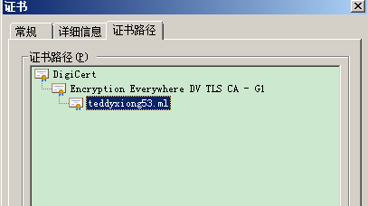

1

证书颁发机构，简称CA。

服务器管理员和网站站长是CA的客户。

CA分两种：

1、区域性的。

2、全球性的。

比较大的CA有：

```
Symantec
	全球信任的。
Go Daddy
Global Sign

数安时代
```


什么是根证书？


浏览器下载你的证书，并添加认证。

12306就是这么做的。


当连接一个https网站的时候，服务器会发送证书链。

但是，只有证书链，客户端是不能完成证书校验的。

必须有一张根证书才能迭代完成签名认证。

也就是说，客户端必须信任根证书才能构建信任基础。

那么，系统里的根证书在哪里呢？

在windows系统里，微软有专门的根证书库。

在Linux系统里，一般使用NSS根证书库。

macos里，也有自己的根证书库。


CA机构为了开展业务，第一步就是把自己的跟证书加入到操作系统的根证书库里。

如果这一步无法完成，就没法往下走。


NSS在开源领域用得多。因为透明。


buildroot里是否默认带了证书呢？

这些证书从哪里来的？


嵌入式开发如何引入https支持呢？


/etc/ssl/certs/ca-certificates.crt    Ubuntu下面的这个文件，是所有证书的集合。

把所有证书都集中到一个文件里了。

用这个命令可以定位到：

```
hlxiong@hlxiong-VirtualBox:~$ curl-config --ca
/etc/ssl/certs/ca-certificates.crt
```


什么是根证书？


怎样给系统安装证书？


https有两种方式：

1、单向认证。只是数据加密，不会校验客户端是否合法。就是只有客户端校验了服务端的合法性。

2、双向认证。


我的证书是从阿里云免费申请的。

在我的nginx里这样设置一下就好了。

```
server {
        listen 80 default_server;
        listen [::]:80 default_server;

        # SSL configuration
        #
         listen 443 ssl default_server;
         listen [::]:443 ssl default_server;
        #
        ssl on;
        ssl_certificate /root/https/teddyxiong53.ml.cert;
        ssl_certificate_key /root/https/teddyxiong53.ml.key;
```



没有任何问题。

这个需要chrome才能看到，QQ浏览器是不行的。至少我没有找到方法。

可以在详细信息这个标签里选择导出，导出的文件，右键可以看到安装证书的选项。

但是现在有个问题，http://teddyxiong53.ml这个网址无法访问了。


参考资料

1、

https://www.trustauth.cn/ca-question/1791.html

2、

https://www.zhihu.com/question/65649877

3、

https://blog.csdn.net/skdkjzz/article/details/17072969

4、一文解剖centos，curl，nss更新根证书的细节

https://www.jianshu.com/p/7d83aafd0f07

5、CA证书与Web服务器SSL安全通信的部署

http://www.slyar.com/blog/ca-web-ssl.html

6、linux命令：CA证书制作及httpd服务器证书签核实例

https://blog.51cto.com/woyaoxuelinux/1892091