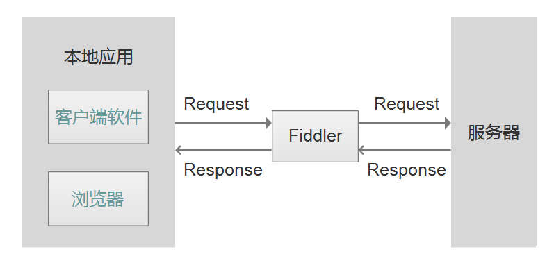
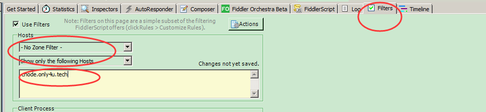

--

这个工具是c#写的，基于.net环境。

# 基本用法

1、本地化的工具，是一个使用本地 127.0.0.1:8888 的 HTTP 代理
（任何能够设置 HTTP 代理为 127.0.0.1:8888 的浏览器和应用程序都可以使用 Fiddler）

2、Fiddler本身对http协议支持较好，且操作简单容易上手

3、具有抓包和分析功能，省去了安装其他工具的必要

4、工具本身功能强大，如劫包、篡改数据、限速等

打开不用设置，直接就可以抓包。

只抓包指定网站

添加filter就可以。如下。

# 抓浏览器https包

按照参考资料2的操作可以正常了。

根据视频教程的经验，就是要设置后，重新启动fiddler。

反正多重启软件就好了。

# 抓手机https包

fiddler手机抓包的原理与抓pc上的web数据一样，都是把fiddler当作代理，网络请求走fiddler，fiddler从中拦截数据，由于fiddler充当中间人的角色，所以可以解密https

上面一步好了。这一步就简单了。只是设置一下的事情。

# 微信里的抓包

有公众号的需要抓包。

手机没有root 。

简单的办法就是微信电脑端登陆进行操作，直接抓微信的包。

很顺利的抓到了。

# 参考资料

1、超全fiddler详解|抓包神器爬虫必备

https://space.bilibili.com/119033458/channel/detail?cid=136755&ctype=0

2、强烈推荐（原创亲测）！！！Fiddler抓取https设置详解（图文）

https://www.cnblogs.com/joshua317/p/8670923.html

3、

https://www.cnblogs.com/yyhh/p/5140852.html