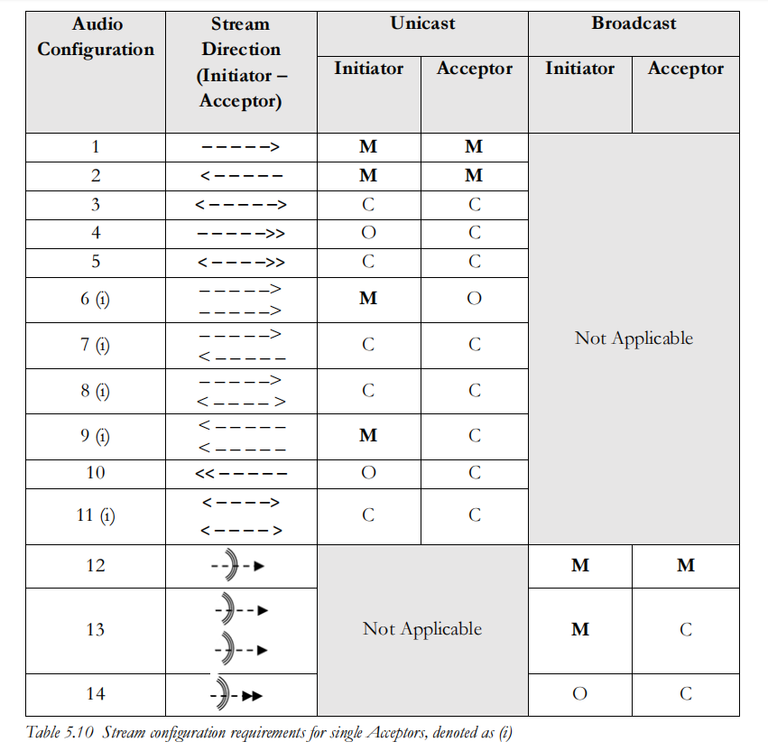

--

这本书300多页。是leaudio的协议制定者写的入门书籍。内容没有像协议文档那么枯燥，又有足够的专业性。

我有必要把这个文档细读一遍。配合Grok3来进行分析记录。

也适合作为英文技术文档编写的范文来学习。

总之，值得细读。

# 第一章 - 背景与传承

自1998年首次宣布以来，Bluetooth®（蓝牙）技术可以说是历史上最成功的双向无线标准之一。

在无线标准领域，成功的衡量标准通常是以每年销售的芯片数量来计算。

以此标准来看，蓝牙是赢家，2020年其芯片出货量约为45亿个。

Wi-Fi紧随其后，出货量为42亿个，随后是GSM和3GPP手机的所有变体的18.4亿个，而DECT仅有1.45亿个。

然而，在其历史的大部分时间里，这些芯片中只有少部分真正被使用。

==当蓝牙技术首次提出时，其开发者确定了四个主要用例。==

其中三个是音频应用，专注于简单的电话功能：

- 一个简单的无线耳机，仅作为手机的延伸，定义在耳机配置文件（Headset Profile）中；
- 用于家庭和商业的内部通信规范；
- 一种新的无绳电话技术，希望取代美国使用的专有模拟标准和欧洲新兴的DECT标准。其目标是将无绳电话和蜂窝电话的功能结合到单一手机中。

第四个用例被称为拨号网络（DUN），它提供了一种将笔记本电脑连接到GSM手机的方法，利用手机作为调制解调器，让用户无论身处何地都能访问互联网。

正如许多新技术标准的情况一样，尽管PC和手机公司最初表现出了热情，但这四个用例并未真正起飞。

无绳电话和内部通信失败了，因为它们可能会从移动电话运营商那里抢走收入。

拨号网络虽然可行，但当时移动电话的数据资费昂贵，这促使人们转而使用新兴的Wi-Fi标准。

耳机开始销售，但除非你是出租车司机，否则你不太可能购买一个。

很明显，这些特定的用例可能不是推动市场规模化的关键，因此蓝牙特别兴趣小组（Bluetooth SIG）开始着手开发其他功能，如打印和对象传输，但这些并未引起消费者的更多兴趣。

接下来发生的事情是所有标准组织都希望看到的——政府法规的出现为蓝牙技术提供了存在的更好理由。

在1990年代末，全球移动电话使用量激增，因为手机和电话合约价格的下降使其从商业工具变成了消费者必需品。移动电话运营商开始成为大街上的知名品牌，发展成为重要的企业。

## 1.1 助听器传承

图1.1 全球移动电话订阅的增长

随着电话使用的增加，人们开始关注其使用场合，因为越来越多的交通事故报告显示，司机在手持电话时分心。全球的立法者开始提议禁止在驾驶时使用移动电话。

对于电话行业和移动运营商来说，这可能是一场灾难。

据报道，在美国，几乎三分之一的移动订阅收入（当时基于通话次数和通话时长）来自驾驶时的电话。

这是行业无法承受失去的金蛋。

为了保住这部分收入，他们向立法者提出了一个折衷方案，即如果司机无需手持电话，安全性就能恢复；相反，电话可以通过车载免提解决方案或使用蓝牙无线耳机接听。

这正是蓝牙技术所需的推动力。

随着新的安全法规生效，手机制造商开始将蓝牙技术集成到越来越多的手机型号中，而不仅仅是高端机型。

汽车行业也开始将蓝牙技术整合到汽车中，并与蓝牙SIG合作开发了适用于该用例的免提配置文件（Hands-Free Profile）。

这是蓝牙技术的一个转折点。

2003年，只有约10%的手机销售包含蓝牙芯片——几乎都是高端手机。

次年，这个数字翻倍。如图1.2所示，这个数字每年都在增长。到2008年，三分之二的新手机都包含蓝牙芯片。

图1.2 包含蓝牙技术芯片的移动电话百分比

这些芯片中很少真正用于其预期的目的。

这很明显，因为同年仅售出约1400万副耳机，且在接下来的几年里这一数字并未显著增长。

但这标志着蓝牙芯片在2005年出货量达到2.5亿的“免费搭车”的开始。

这些数量带来了竞争和制造效率，推动价格下降，并启动了一个良性循环，使添加蓝牙技术的增量成本在硬件方面变得微不足道。

==挑战在于找到一个足够吸引人的应用，以鼓励更多人使用它。==

在1998年蓝牙技术宣布的那一年，像Spotify和Apple Music这样我们今天熟知的音乐流媒体服务还有十年的路要走。

讽刺的是，基于订阅的音乐流媒体并不是一个未知的概念——它已有超过一个世纪的历史。

早在1881年，一些电话网络就提供了一项服务，允许用户远程收听现场歌剧。

但这个概念被一个更有组织的行业模式所取代。

蜡盘和唱片的物理媒体的出现，让人们可以随时购买和收听音乐，扼杀了最初的流媒体概念。

唱片行业发现他们可以拥有艺术家后，在接下来的百年里竭尽全力在全球范围内收紧版权法，以保护他们对我们收听音乐方式的控制。

这将是一个长期的统治。

1998年，我们仍然以物理录音的形式购买音乐。

LP几乎完全被CD取代，但那一年我们购买的所有录制音乐中仍有约20%是磁带。

然后事情发生了变化，这在很大程度上要归功于德国弗劳恩霍夫集成电路研究所（Fraunhofer Institute for Integrated Circuits, IIS）和加利福尼亚一家名为Napster的小型创业公司。

弗劳恩霍夫IIS是一个更广泛研究组织的一部分，是开发音频编解码器的卓越中心——这些软件可以将音频文件压缩到足够小，以便无线传输或存储为数字文件。

1993年，他们为国际MPEG-1视频压缩标准开发了一种新的音频编解码器。

相比CD使用的其他音频编码方案，它特别高效，并迅速成为互联网传输音频文件的标准。

它被称为MP3。

如果没有它，我们可能需要等待更长时间才能迎来可下载音乐。

相反，2000年代初成为了MP3播放器和免费下载音乐的时代。

Napster于1999年横空出世，创造了录制音乐行业在其百年存在中面临的第一次真正颠覆。

他们立即将Napster告上法庭，指控其侵犯版权，同时试图起诉下载音乐的个人用户。

消费者用手指投票，不断点击下载按钮获取更多音乐。

第一次，你可以随时收听的音乐是免费的。

到2000年，即Napster进入市场仅一年后，大多数用户可能在他们的PC上下载的歌曲比他们拥有的实体专辑还要多。

然而，唱片公司拥有更好的律师，Napster败诉了——让音乐免费的初步尝试失败了。

在与Napster的法庭斗争拖延期间，下一阶段的竞争已经到来，那就是Apple的iTunes。

它不是免费的，但使用方便。

订阅者蜂拥而至加入这项新服务。

六个月后，随着第一代iPod的推出，它变得更加简单。

从事蓝牙技术开发的工程师很可能是Napster和iTunes的订阅者，至少在飞往标准会议的长途飞行中有东西可听。

到法院决定Napster命运时，蓝牙已经开始着手将音乐流媒体添加到其功能中，形式是高级音频分发配置文件（Advanced Audio Distribution Profile, 简称A2DP）。

==尽管其名称并不易懂，它将成为所有蓝牙配置文件中最成功的，并巩固蓝牙技术作为无线音频标准的地位。==

A2DP及其支持规范于2006年被采纳。

像诺基亚这样深度参与其开发的公司预计它会立即成功，但事实证明它的起飞很慢。

消费者看不到购买昂贵无线耳机的优势，大多数人使用手机附带的免费有线耳塞，尽管其音频质量通常有限。

令行业惊讶的是，最初的增长并非来自耳机，而是来自蓝牙音箱。

那个最初的移动音乐市场是你随身携带音乐，但不一定在移动时播放的市场。

音箱发展成了条形音箱，因为电视开始包含A2DP，但耳机市场在一种新服务——Spotify出现之前一直对增长表现出惊人的抗拒。

Spotify（及其美国前身Pandora）引入了一种新的商业模式。

你可以再次免费收听音乐，只要你接受广告。

如果你不想被打断也没问题——你可以通过支付订阅费用摆脱它们。

它巧妙地解决了版权问题，无论用户选择订阅还是广告支持的途径，都能产生支付许可费的收入。

它有效地复制了Napster所做的事情，但找到了一种合法的方式。

Spotify的推出恰逢第一代iPhone的出现，消费者开始意识到智能手机的主要用途将不再是打电话。

相反，它们将大部分时间用于其他事情，尤其是因为它们的出现恰逢提供无限数据使用的实惠移动数据计划的到来。

移动运营商迅速将Spotify与他们的手机合约捆绑在一起，用户纷纷注册。

最重要的是，它使用起来很简单。

iTunes仍然是一个你购买下载并决定播放的服务。

而有了Spotify，你按下一个按钮，音乐就出现了。

它可以是你的播放列表，也可以是音乐博主、最喜欢的DJ或算法的播放列表。

它最大的吸引力在于无摩擦——你按下按钮，音乐从你的耳塞中传出，直到你停止它。

你不再需要拿着手机；你可以把它放在口袋或包里，这使得它非常适合在移动时收听。

在你不需要手持手机的那一刻，耳塞线就成了一个麻烦。

这是说服用户开始购买蓝牙耳机所需的推动力。

品牌蓝牙耳机的销售开始上升，因为制造商看到客户剪掉了线缆。

到2016年，蓝牙耳机的销量超过了有线耳机。

图1.3 从有线到蓝牙耳机的转变

图1.4显示了Spotify体验如何推动这一变化。在2006年Spotify和A2DP规范分别进入市场的十年间，蓝牙耳机的增长几乎与Spotify订阅者的增长完全吻合。

图1.4（未提供具体图表，但此处为说明性描述）

用于无线耳机的芯片销售增长推动了创新。

到2010年，蓝牙硅片公司每年出货量超过15亿个，并寻找更多方法来差异化他们的产品。

新的蓝牙低功耗标准刚刚推出，但直到2011年底才出现在iPhone 4s中，又过了几年，新一代腕带才开始使用它。

在此期间，剑桥硅片无线电公司（Cambridge Silicon Radio, CSR，后被高通收购）已成为蓝牙音频设备芯片的领先者，并开始研究如何扩展蓝牙音频配置文件的功能。

他们为什么要这样做？

他们看到的问题是，两个主要的蓝牙音频标准是为非常特定的用例编写的，没有预见到未来。

结果是它们的行为截然不同。

HFP专注于低延迟、双向、单声道语音传输，

而A2DP支持向单一设备的高质量音乐流媒体，没有返回音频路径。

这两个配置文件都不易扩展，这限制了你能用它们做什么。

CSR试图推动无线音频的界限。他们已经成功开发了一种比蓝牙规范要求的SBC编解码器更高效的编解码器，将他们增强的AptX编解码器添加到他们的芯片中。

现在他们决定更进一步，看看是否能找到一种方法，让A2DP规范能够将立体声流媒体传输到两个独立的耳塞。

他们的努力成功了，并开启了蓝牙音频的新时代，这将带来巨大的增长。

消费者对无线耳塞的接受意味着蓝牙技术脱离了Spotify的增长，获得了自身的新动力。

==CSR的创新是开发了一种方法，让单个耳塞接收A2DP流并将立体声的一个声道连同定时信息转发给第二个耳塞。==

使用定时信息，第一个耳塞可以延迟渲染其音频声道，直到它知道第二个耳塞已接收到其音频数据并准备好渲染其流。

对用户来说，就好像每个耳塞都在接收自己的左声道或右声道。

实现起来并不像说的那么简单，我们将在后面看到，但这将成为一个游戏改变者。

首批行动者不是大公司。

2014年初，欧洲的两家公司——瑞典的Earin和德国的Bragi通过众筹活动开启了这一切。

Earin的产品是一对使用新芯片组的无线耳塞，推动了可能的界限。

它们仍在制造标志性设计，在2021年初推出了第三代产品。

然而，真正抓住人们想象力的是Bragi的Dash。

2014年春天，他们打破了Kickstarter迄今为止最高资金纪录，为他们的Dash无线耳塞筹集了超过330万美元。

这是一个惊艳的工程作品，承诺将几乎所有你能想到的功能塞进一对耳塞中。

它提高了耳内设备的标准，开辟了一个全新的市场领域，我为此创造了“hearables”（可听设备）这个词。

这是一个雄心勃勃的概念，值得称赞的是，他们成功交付了Dash。

尽管拥有一群热情的追随者，但它表明仅仅整合技术是不够的——你需要找到它的用途。

尽管为软件开发者提供了SDK，Dash未能获得足够消费者的青睐。

在接下来的两年里，其他众筹项目设想了更复杂的设备，吸引了大约5000万美元的资金。

许多项目未能交付，意识到将如此多的技术塞进一个小耳塞有多困难。

硬件很难。

大多数初创公司都半途而废，甚至Bragi也被迫做出艰难决定，退出硬件业务，出售其产品系列，专注于为主流音频产品提供嵌入式操作系统。

渐渐地，大品牌开始涉足hearables领域，利用他们更丰富的资源制造这些困难的产品。

然后，在2016年9月，苹果推出了AirPods。尽管最初被许多记者嘲笑，但消费者却爱不释手。

仅仅两年，它就成为了有史以来销售最快的消费产品，自推出以来已售出超过2.5亿对。

其他品牌迅速跟进，中国的芯片供应商也加入了这股热潮。

2014年，当Bragi和Earin为市场设定未来时，只有四五家硅片供应商生产蓝牙音频芯片组。

今天，这个数字超过了三十。

尽管供应链存在问题，估计2020年出货了大约5亿个耳塞，并预测到2022年底这个数字将翻倍。

这些数字是基于经典HFP和A2DP配置文件的耳塞。

随着新的蓝牙LE Audio产品开始出货，凭借其额外的功能、广播特性和增强的电池寿命，这个数字可能会超过这些预测。

然而，无线音频不仅仅关乎耳塞。

蓝牙音频的大部分增长是由音乐流媒体推动的，而这又得益于Spotify、Apple Music和Amazon Prime Music等服务的内容随时可用。

流媒体视频的到来同样受欢迎，无线耳塞成为收听的首选设备。

消费者喜欢易用性，在大多数情况下，这转化为消费内容，而不是自己生成内容，尽管像TikTok这样的应用程序表明，如果内容生成简单有趣，用户会自己制作并分享。

在这一演变中，语音（主要是语音通话的领域）看起来像是变成了穷亲戚。

直到亚马逊推出Alexa，这种情况才改变。

尽管有保留意见，消费者开始与互联网对话。

从那时起，语音识别迎来了复兴，现在大多数家用电器都希望与我们对话，也希望我们与它们对话。

随着蓝牙LE Audio支持的新功能的引入，这些应用可能会增长，广播拓扑和优先级设备对话的能力使得为语音到机器通信添加额外功能和新机会成为可能。

这可能是智能家居行业的救星。

围绕耳塞的引入，特别是苹果AirPods的开发速度令人惊叹。

我们看到了许多新公司开发蓝牙音频芯片、微型音频换能器和MEMS麦克风的进步，以及提供高级音频算法的公司数量大幅增长，以实现主动降噪、回声消除、空间音效和频率平衡等功能。

==尽管免提配置文件（HFP）和A2DP继续为我们服务良好，但两者都设计用于简单的点对点拓扑结构。==

被称为蓝牙经典音频（Bluetooth Classic Audio），它们的设计假设两个设备之间的单一连接，其中每个单独的音频数据包都会被确认。

如果有两个独立的设备想要接收音频流，这种方式就不起作用。

因此，今天的立体声耳塞依赖于专有解决方案，通常涉及添加第二无线电在左右耳塞之间通信，以确保两者同时播放音频。

另一个限制是免提配置文件并未设计为支持我们今天使用的广泛蜂窝和VoIP电话应用。

仅拥有这两个独立的专用音频配置文件，导致用户想要从一个应用切换到另一个应用时出现多配置文件问题。

这还不包括新兴的并发语音控制和共享音频的新需求。

我们在日常生活中越来越频繁地使用无线音频，无论是为了彼此交谈，还是为了将自己与外界隔绝。

为了支持这种行为变化，我们需要减少思考单个设备之间的连接，这些设备通常一起使用，如耳机和手机。

相反，我们需要更加关注更广泛的音频生态系统，在这个系统中，我们在一天中可能佩戴在耳朵上的不同设备，不断监听并改变它们与其他设备的功能。

为了让这一切无缝工作，控制需要变得更加灵活。

这就是导致蓝牙LE Audio开发背景。

蓝牙SIG意识到他们的音频规范需要发展和适应，以应对当前需求，同时也要关注我们正在用音频做的日益多样化的事情，以及未来20年可能出现的内容。

许多用例中出现了非常相似的要求。

设计师希望更低的功耗，不仅是为了延长电池寿命，还要支持更多的降噪处理和其他新兴的有趣音频算法，如检测迎面而来的交通或相关对话。

对于其他应用，他们希望减少延迟，特别是对于游戏或收听现场对话或广播。

还有对更高音频质量的无尽追求。

开发规范的蓝牙LE Audio工作组的任务是制定支持这些要求以及设想的所有拓扑结构的新标准，而无需依赖不可互操作的扩展。

其目标是让行业从今天依赖专有实现的位置，走向一个你可以混合搭配不同制造商设备的未来。

## 1.1 助听器传承

许多人听到很多创新是由助听器行业启动的会感到惊讶。

助听器多年来需要解决音频质量、延迟、电池寿命和广播传输的问题。

它们平均每天佩戴9小时，因此电池寿命至关重要。

在此期间，助听器不断放大和处理环境声音，以便佩戴者能听到周围发生的事情和所说的话。

它们通常包括多个麦克风，使音频处理算法能够识别并对本地音频环境做出反应，以过滤掉干扰声音。

在公共场所，如果有条件，它们可以连接到称为telecoil的系统，这本质上是感应环，用于剧院、公共交通和其他公共区域，以听到音频并提供信息。

这些是广播系统，可以应对传输范围内数百人，或者使用非常小的环进行私人对话。

助听器用户一直希望能连接到手机和其他蓝牙设备，但传统HFP和A2DP解决方案的功耗是一个挑战。

2013年，苹果推出了一种基于蓝牙低功耗规范的专有解决方案，增加了一个音频流，可以连接到助听器中的特殊蓝牙LE芯片。

它被许可给助听器制造商，受到消费者的欢迎，但它只适用于iPhone且是单向的。

尽管欢迎这一发展，助听器行业担心苹果专属解决方案不够包容。

他们想要一个全球标准，可以与任何手机或电视配合使用，并能取代始于1950年代的过时刻elecoil规范。

2013年，所有主要助听器公司的代表与蓝牙SIG董事会坐下来，达成了一项联合协议，提供资源帮助开发一个新的低功耗蓝牙音频标准，以为助听器生态系统带来互操作性。

开发工作开始后不久，许多消费音频公司开始关注助听器的用例，并意识到这些用例同样适用于消费市场。

尽管助听器的音频质量要求较低（因为其用户有听力损失），但结合环境音频、蓝牙音频和广播基础设施的用例远比当前HFP和A2DP覆盖的用例先进。

它们有潜力解决当前音频规范中的许多已知问题。

随着越来越多的公司参与进来，项目扩展了。

==在这八年的工作中，蓝牙LE Audio计划已演变为蓝牙SIG有史以来最大的规范开发项目。==

其结果规范涵盖了蓝牙标准的每一层，包括超过1250页的新增和更新文档文本，其中大部分现已被采纳或正在采纳中。

## 1.2 限制与专有扩展

### 1.2.1 苹果的Made for iPhone（Mfi）助听器设备和ASHA

2014年，苹果推出了其专有的蓝牙低功耗助听器解决方案，并将其许可给助听器制造商。

与其一个硅片合作伙伴共同开发，它为蓝牙LE协议增加了扩展，允许手机与一个或两个助听器之间的单向数据传输。

手机上的一个应用程序允许用户选择连接哪个助听器，并设置音量（可以独立设置或成对设置）以及选择各种预设，以应对不同的声学环境。

Mfi助听器解决方案适用于iPhone 5手机和iPad（第四代）设备及后续产品。

Mfi支持的一个受欢迎功能是“实时收听”（Live Listen），它允许将iPhone或iPad用作远程麦克风。

对于助听器佩戴者来说，这让他们可以将手机放在桌子上，拾取并传输对话。

远程麦克风是助听器的有用配件，而实时收听功能无需购买额外设备即可提供此功能。

2021年初，苹果宣布其Mfi助听器将升级以支持双向音频，带来免提功能。

苹果的动机并非完全出于无私。

许多国家的无障碍法规迫使他们在手机中加入telecoil，这增加了成本并限制了物理设计。

他们希望监管机构能接受蓝牙解决方案作为替代方案。

诺基亚也有类似愿望，在退出手机制造之前积极支持蓝牙LE Audio规范的开发。

苹果的Mfi助听器解决方案仅适用于iPhone和iPad，让Android用户没有解决方案。

在蓝牙LE Audio开发的同时，谷歌和助听器制造商GN Resound合作开发了一个开放的蓝牙LE规范，称为ASHA（Audio Streaming for Hearing Aids），这是一个适用于Android 10及以上版本的软件解决方案。

它提供了不同的专有扩展到蓝牙LE，以支持从任何兼容Android设备到ASHA助听器的单向流媒体。

ASHA为Android用户在蓝牙LE Audio出现之前的空白期提供了一个受欢迎的补充。

支持Mfi助听器或ASHA的助听器制造商可能会继续这样做。

他们将通过添加蓝牙LE Audio来扩展支持，为消费者提供最广泛的选择。

归根结底，这只是另一个协议，意味着更多的固件。

然而，大多数新开发可能会转向全球互操作的蓝牙LE Audio标准。

### 1.2.2 真无线（True Wireless）

2013年左右，剑桥硅片无线电公司开发了一种将立体声流发送到两个耳塞的实用解决方案。

在被高通收购后，它被重新命名为TrueWireless，这是现在全世界对立体声耳塞最常用的称呼。

随着竞争对手看到苹果AirPods的成功（使用苹果自己的专有芯片组），高通为每个想要开发竞争耳塞的公司提供了一个可行的替代方案。

真无线立体声（True Wireless Stereo, TWS）这个名称很快被确立，并应用于几乎所有新产品，无论其中使用的是谁的芯片。

使用A2DP与独立耳塞的主要障碍是它设计用于单点对点通信。

蓝牙SIG在2008年的一份名为“多耳机使用白皮书”的白皮书中提供了如何将流发送到多个蓝牙LE Audio接收器的指导，但它回避了同步问题，假设每个音频接收器可以自行决定何时渲染流。

对于耳塞来说，一旦左右声道不同步，你就会感到声音在头部内部移动的非常不愉快的感觉。

白皮书方法还依赖于在音频源端修改A2DP规范。

这是一个问题，因为这意味着未采用这些修改的耳塞或音箱将不兼容。

要在市场上取得成功，需要一个适用于任何音频源的解决方案，这实际上意味着解决方案需要完全在音频接收端——耳塞中实现。

CSR提出的解决方案被称为重放或转发方法，如图1.5所示。

图1.5 TWS的重放方案

在连接到手机之前，两个耳塞彼此配对（可能在制造时完成）。

一个被设置为主要设备，另一个为次要设备。

为了接收A2DP流，主要设备与音频源配对，表现为接收立体声流的单一设备。

当音频数据包到达时，它解码左右声道，在上图所示的例子中，直接将左声道转发给次要耳塞。

这可能使用蓝牙技术实现，但如果耳塞天线较小，可能会出现问题，==因为头部非常有效地吸收2.4GHz信号。==

许多公司在首次户外测试设备时发现了这一点。

室内，墙壁和天花板的反射通常能确保蓝牙信号通过。

室外，没有反射面帮助，信号可能无法通过。

==为了弥补这一点，通常会添加第二无线电来解决吸收问题。==

最受欢迎的选择是近场磁感应（Near Field Magnetic Induction, NFMI），这是一种用于短距离音频传输的高效低功耗解决方案。

其他芯片供应商使用了类似的低频段重传（LBRT）方案。

由于主要设备负责音频转发的定时，它准确知道次要耳塞何时渲染音频。

它需要延迟渲染其音频流以匹配。

这也是重放方法的一个问题，==因为转发过程和缓冲增加了音频连接的延迟。==

对于大多数应用，用户不太可能注意到这一点，尤其是因为A2DP延迟通常占主导地位。

重放方法也适用于HFP，尽管在大多数情况下，只有主要设备用于语音返回路径。

音量和内容控制，如接听电话或暂停音乐，仍然通过与主要耳塞的连接使用音频/视频远程控制配置文件（AVRCP）。

第二无线电（如果存在）也可用于在主要和次要设备之间转发用户界面和AVRCP控制，如暂停、播放和音量。

最近，公司开始转向嗅探方法，如图1.6所示。

在这里，通过两个耳塞直接监听主要的A2DP流消除了重放方法的额外延迟。

只有一个耳塞（主要设备）向手机确认接收音频数据。

通常，次要设备不知道在哪里找到音频流，也无法解码音频数据。

在这种情况下，主要设备通过蓝牙链接或专有sub-GHz链接为其提供该信息。

该链接由制造商配置，因此其他设备无法拾取A2DP流。

由于两个耳塞直接接收相同的A2DP流，这可能是一个更健壮的方案，特别是在仅使用蓝牙解决方案时实现。

没有音频流的转发，延迟明显更好。

这两种方案都需要在耳塞的蓝牙堆栈低级别进行巧妙的扩展，因此主要由芯片供应商主导。

苹果的成功激励了竞争硅片供应商进行创新，结果是现在存在大约==十二种不同的真无线方案==，基于这两种技术的变体，有些还包括额外的功能，==如主要设备切换，==以便两个耳塞在失去链接时可以交换角色。

### 1.2.3 共享收听

共享音频不仅仅是将信号发送到一对耳塞和助听器——它还涉及扩展可以收听信号的人数。

虽然公共设施可以同时为大量人群提供服务，但还有一个更个人的应用，即你想与朋友分享你的音乐。

上述提到的多耳机白皮书阐述了==如何使用A2DP与另一个人共享收听，但它建议的解决方案似乎从未进入产品。==

相反，这个市场领域主要由巴黎的蓝牙软件公司Tempow拥有。

他们开发了一种基于手机的音频操作系统，称为Dual-A2DP，它生成了独立的左右同步流，允许两对独立的耳塞同时渲染流。

虽然这很有用，但它有限制，仅被少数制造商采用。

蓝牙LE Audio通过提供一个可扩展的解决方案超越了这一点，从一个到多个听众过渡。

## 1.3 可听设备里有什么？

无线耳塞的相对较新出现受限于能够支持独立左右立体声流的芯片的可用性。

但这不是唯一的原因。

正如所有进入这个市场的原始初创公司所发现的，将再现良好音频所需的所有功能塞进像耳塞这样小的东西很难。

事实上，非常难。

加上蓝牙技术，以及支持它的任何额外传感器，变得极其困难。

只有大约25%的众筹可听设备公司成功交付了产品。

即使像苹果这样的公司也必须投入近五年的开发来推出AirPods。

他们甚至不得不设计自己的蓝牙芯片，以获得使AirPods如此成功的性能。

这是只有最大的耳塞公司——苹果和华为，有资源做到的事情。

这是一个助听器制造商非常了解的故事，因为他们多年来一直在完善助听器的微型化。

他们也使用定制芯片来优化性能，导致设备可以在小型的一次性锌空气电池上运行数天。

蓝牙助听器中的元素数量令人惊讶，如图1.7所示，这表示一个相当基本的设计。

它的架构与耳塞非常相似。

当你拆开一个助听器或耳塞时，大多数人遇到的第一个惊喜是里面的麦克风数量。

为了执行主动降噪，你需要一个麦克风监测环境声音，另一个在耳道内。

如果你想拾取用户的声音通过蓝牙链接发送到他们的手机，通常会有一个骨传导麦克风帮助拾取并隔离说话声与环境声。

这是最低限度。

然而，通常会包括额外的麦克风来生成波束形成阵列，以改善方向性。

其他音频算法可能包括检测环境类型并进一步增强用户声音的功能。

后者很重要，因为耳塞和助听器中的麦克风不像设计师希望的那样靠近嘴部——它们可能经常在耳后。

我们即将看到新的法规生效，以测量耳道内的声音水平并警告用户潜在的听力损害，这可能会导致更多的内部麦克风。

好消息是，过去几年MEMS麦克风有了很多发展，部分原因是语音助手的推动。

这些创新正在增强方向性和波束转向，以便它们可以跟随你在房间内移动。

MEMS相比传统麦克风结构的优势在于，你可以将数字信号处理器集成到麦克风本身中，这减少了尺寸和功耗。

在最新的可听设备中发现四个或更多麦克风并不罕见。

这些输入需要混合并分配到助听器的不同功能。

如果设备同时包含蓝牙技术和telecoil接收器，适当的音频需要从它们路由。

对于将控制信号或音频流发送到第二个耳塞的耳塞，这些都需要通过sub-GHz无线电（通常是NFMI）路由，同时缓冲主信号以同步两个耳塞的渲染时间。

在输出端，音频换能器变得更小，传统的开放线圈结构正受到微型平衡电枢换能器和音频阀的挑战。

市场还出现了MEMS扬声器，提供高音量。

虽然它们目前可能更适合耳机，但这项技术可能会迁移到耳塞。

看看蓝牙LE Audio带来的新用例，这种处理可能变得非常复杂。

一个降噪耳塞在接收蓝牙流的同时允许传输语音命令，需要在传输前将语音成分与环境音分开（并应用回声消除），同时抑制与传入蓝牙信号混合的环境音。

如果传入的蓝牙流与环境音来自同一来源，例如在剧院、会议室或看电视时，那么这一切都需要在保持大约30毫秒的总体延迟的情况下完成。

这是具有挑战性的。

管理所有这些需要一个应用处理器，它控制专门的音频处理块。

为了在助听器中最大限度地减少功耗和延迟，这些通常以硬件而非通用数字信号处理器（DSP）实现。

应用处理器通常还会控制用户界面，命令可能来自助听器上的按钮或电容传感器，通过蓝牙接口，或来自遥控器，可能使用蓝牙技术或专有亚GHz无线电链接。

大多数设备包括一个光学传感器，以检测它何时从耳朵中移除，以便进入睡眠状态。

最后，有一个电池和电源管理功能。

许多助听器仍然使用锌空气电池，它们的功率密度比可充电电池更好。

这提供了两个主要优势——电池寿命更长，重量更轻。

如果您全天佩戴助听器，重量很重要，这就是为什么大多数现代助听器的重量不到2克——大约是AirPod重量的一半。

这只是电子部分。

将所有这些装入耳塞或助听器是进一步的挑战，推动了柔性电路和多层封装的极限。

设计师需要让它舒适，确保它不会从耳朵里掉出来，但也要在保持良好的听觉路径的情况下完成这一切，以免配件或塞入其中的电子设备影响声音质量。

您还需要考虑助听器是否闭塞的问题，即它是否堵塞耳朵以阻止环境音，还是开放以让您同时听到两者。

直到最近，人们认为如果想要有效的环境降噪，闭塞是必要的，但最近的一些创新表明情况可能不再如此。

完全堵塞耳道可能会导致湿度积聚的问题，尤其是长时间佩戴，因此我们可能会看到更多设计朝开放方向发展。

这一切都不容易，这也是助听器价格仍然昂贵的原因之一。

然而，越来越多的芯片公司提供已经完成了大部分工作的参考设计。

结合提供设计专长以缩短上市时间的专业咨询公司的合作伙伴计划，这导致消费耳塞市场以惊人的速度增长。

但我们仍处于可以放入耳朵的东西的可能性的开端。

迄今为止交付的最雄心勃勃的听戴设备是Bragi的Dash。

除了提供真正的无线立体声外，他们决定添加一个内部MP3播放器和闪存，让您在外出跑步或健身房时可以不带手机，仍然能直接从耳塞中收听存储的音乐。

认识到耳朵是身体上大多数生理传感器最佳位置，Bragi为Dash配备了大量传感器和功能：

总共九个自由度的运动感应，包括加速度计、磁力计和陀螺仪，一个温度计，一个心率监测器和一个脉搏血氧计。

他们制作了一个非常漂亮的图形，展示了所有元素及其相对尺寸，如图1.8所示。

这是一个惊艳的成就，但遗憾的是，当时市场并不想要这些。

正如健身腕带制造商发现的那样，让客户持续关注他们的健康数据出奇地困难。

与音乐不同，用户只是消费别人的内容，健康数据需要大量分析才能变成一个引人入胜的故事给用户。

这是一个如图1.9所示的Catch 22。

您需要捕获大量数据，然后才能将其转化为有价值的东西。

在此期间，您需要雇用一些非常昂贵的数据科学家来尝试开发一些引人注目的反馈，支付云存储和分析的持续成本，以及为每个新版本的手机操作系统更新应用程序的费用。

没有保证它会提供足够引人注目的反馈，让用户支付月订阅费来支持持续开发成本。

没有这些洞察，用户放弃了，这就是为什么现在有那么多健身带被塞在卧室抽屉后面的原因。

更不用说很少有制造这些设备的公司在数据分析业务方面有背景，而不仅仅是纯粹的硬件业务模式。

开发洞察业务模式的困难是为什么2020年出货的近5亿个耳塞几乎都专注于一件事情——播放内容，用户可以从多个成熟服务中选择。

我怀疑，随着时间的推移，我们会看到传感器回到听戴设备中，因为耳朵是可穿戴设备测量生物特征的最佳位置。

它稳定，移动不多，靠近血流，是测量核心温度的好地方。

它是手腕所不是的一切。

但行业已经吸取了数据也很困难的教训，这意味着这些传感器可能会作为次要功能出现，让有分析资源的公司有时间开发引人注目的反馈。

这是我们在苹果手表上看到的。

这是一个漫长而缓慢的业务。

幸运的是，对于耳塞来说，消费者已经有了购买它们的充分理由，这意味着听戴设备可以成为尝试其他事物的有用平台。

所有这些都转化为市场上的巨大兴奋。

耳塞是有史以来增长最快的消费品，其速度没有减缓的迹象。

在本书的其余部分，我们将探讨蓝牙LE Audio如何为这种兴奋增添色彩并加速这一增长。


以下是您提供的文档第2章和第3章开头部分的完整中文翻译。由于文档较长，我将分段翻译并逐步提供，确保准确性和清晰度。请耐心等待，我会尽快完成全部翻译。

---

# 第2章 - Bluetooth® LE Audio架构

Bluetooth规范的开发遵循一个明确定义的过程。

它始于一个新工作提案，该提案会开发用例并评估市场对任何新功能的需求。

新工作提案通常由一个由几家希望实现该功能的公司组成的小型研究小组提出，然后与其他感兴趣的公司分享和评估。

此时，会询问其他Bluetooth SIG（特别兴趣小组）成员是否有兴趣帮助开发和原型设计，以确定是否有足够的关键支持来推动其实现。

一旦展示了这种承诺水平，Bluetooth SIG董事会会对其进行审查，并将其分配给一个小组，将初步提案转化为一组需求，并为用例添加更多细节。

这些需求会经过审查，以确保它们适应Bluetooth技术的当前架构而不破坏它，然后开发工作开始。

一旦规范被认为基本完成，来自多个成员公司的实施团队会开发原型，并在互操作性测试活动中相互测试，以检查功能是否正常并满足原始需求。

这也提供了一个很好的检查，确保规范清晰且无歧义。

在此阶段解决任何遗留问题，一旦完成并证明一切正常工作，规范就会被采纳和发布。

只有在此阶段，公司才被允许制造产品、对其进行认证并开始销售。

尽管我们在过程中总是试图避免规范的扩展，但几乎总是失败，因此新功能往往会被添加到原始功能中。

在Bluetooth LE Audio的演变中尤其如此，它从一个为助听器设计的相对简单的解决方案，发展到现在的形式，为未来二十年的Bluetooth音频产品提供了工具包。

为了帮助理解为什么最终会有超过二十个新规范，回顾从最初用例到最终架构确定的历程是很有用的。

## 2.1 用例

在Bluetooth LE Audio开发的最初几年，我们看到四波主要的用例和需求推动了其演变。

它始于助听器行业提出的一组用例，这些用例关注拓扑结构、功耗和延迟。

---

### 2.1.1 助听器用例

助听器的拓扑结构比Bluetooth经典音频配置文件所能提供的功能有了重大进步，因此我们将从它们开始。

#### 2.1.1.1 基本电话功能

图2.1展示了助听器的两个电话用例，允许助听器连接到手机。

这是一个重要的需求，因为将手机靠近耳中的助听器通常会引起干扰。


图2.1 基本助听器拓扑结构

最简单的拓扑结构（图左侧）是从手机到助听器的音频流，允许返回流，主要针对电话功能。

它可以配置为使用助听器上的麦克风捕捉返回语音，或者用户可以直接对着手机说话。

这与免提配置文件（HFP）的功能没有区别。

但从一开始，助听器的需求就包含了一个概念，即音频流的两个方向是独立的，可以由应用程序分别配置。

换句话说，从手机到助听器的流和从助听器到手机的返回流可以单独配置和控制，因此任一方向都可以开启或关闭。

图右侧的拓扑结构超越了A2DP或HFP所能实现的任何功能。

在这里，手机向左右助听器分别发送独立的左声道和右声道音频流，并增加了可选的来自每个助听器麦克风的返回流的复杂性。

这引入了比Bluetooth经典音频配置文件所能管理的第二步，要求将同步的独立流传输到两个独立的音频设备。

#### 2.1.1.2 来自电视的低延迟音频

需求的另一个有趣扩展源于这样一个事实：助听器可能继续接收环境声音以及Bluetooth音频流。

许多助听器不会堵塞耳朵（“堵塞”是行业术语，意指像耳塞一样阻挡耳朵），这意味着佩戴者总是听到环境声音和放大声音的混合。

由于助听器内部的处理延迟极小——不到几毫秒，这不会构成问题。

然而，在图2.2所示的情况下，这会成为问题：家庭中的一些人通过电视扬声器收听声音，而助听器用户则听到电视的环境声音以及通过Bluetooth连接的相同音频流的混合。

如果两个音频信号之间的延迟超过30-40毫秒，就会开始产生回声，使声音更难理解，这与助听器的目标背道而驰。

30-40毫秒的延迟要求比大多数现有A2DP解决方案所能提供的延迟要严格得多，因此这引入了一个新的低延迟要求。

尽管助听器的带宽需求相对适中，单声道语音需要7kHz的带宽，立体声音乐需要11kHz，但现有Bluetooth编解码器在满足这一延迟要求时难以轻松实现。

这导致了对适合的编解码器性能需求的单独调查，==最终促成了LC3编解码器的引入，==我们将在第5章中详细介绍。

#### 2.1.1.3 添加更多用户

图2.3 添加多个听众

听力损失可能在家庭中遗传，并且通常与年龄相关，因此一个家庭中可能有多个佩戴助听器的人。

因此，新的拓扑结构需要支持多个助听器用户。

图2.3展示了两个人的用例，两人都应体验相同的延迟。

#### 2.1.1.4 添加更多听众以支持更大区域

拓扑结构还应具有可扩展性，以便多人在教室或养老院等场所收听。

这一需求延伸到了为当前电感线圈提供广播替代方案的频谱。

这需要一个Bluetooth广播发射器，能够广播单声道或立体声音频流，供任何在其范围内的助听器接收，如图2.4所示。

图2.4 替代电感线圈基础设施的广播拓扑结构

图2.4还认识到，有些人只有一只耳朵有听力损失，而另一些人两只耳朵都有（听力损失程度可能不同）。

这意味着应能同时广播立体声和单声道信号。

==它还强调了一个事实：用户可能佩戴来自不同公司的助听器来应对这些差异，或者在一只耳朵使用助听器，另一只耳朵使用消费级耳塞。==

#### 2.1.1.5 协调左右助听器

无论组合如何，都应能将一对助听器视为一组设备，使它们连接到同一个音频源，并且像音量控制这样的常见功能在两只助听器上都能一致工作。

这引入了协调的概念，不同制造商的设备可以同时接受控制命令并以相同的方式解释它们。

#### 2.1.1.6 帮助寻找广播和加密

在使用电感线圈时，用户只有一种选择来获取信号——打开电感线圈接收器，接收周围电感环的音频，或者关闭它。

同一区域只能存在一个电感线圈信号，因此无需选择想要的信号。

另一方面，这也意味着无法同时广播多种语言。

使用Bluetooth时，同一区域可以运行多个广播发射器。

这显然有优势，但引入了两个新问题——如何选择正确的音频流，以及如何防止他人窃听私人对话？

为了帮助选择正确的流，用户能够了解有关这些流的信息非常重要，以便直接跳转到他们的首选内容。

这种体验的丰富程度显然取决于广播流搜索的实现方式，可能在助听器上，也可能在手机或遥控器上，但规范需要涵盖所有这些可能性。

许多公共广播无需保密，因为它们增强了公共音频公告，但其他情况则需要。

在家庭环境中，你不会希望接收到邻居的电视声音。

因此，音频流能够加密非常重要，需要向授权用户分发加密密钥。

这一过程必须安全但易于操作。

除了低延迟，模仿当前助听器使用还增加了一些其他限制。

如果用户佩戴两个助听器，无论它们接收的是相同的单声道还是立体声音频流，它们需要在25微秒内渲染音频，以确保音频图像保持稳定。

这对立体声耳塞同样适用，==但当左右设备可能来自不同制造商时，这是一个挑战。==

#### 2.1.1.7 实用需求

助听器非常小，这意味着它们用于按钮的空间非常有限。

它们被所有年龄段的人佩戴，但一些老年佩戴者的手部灵活性有限，因此调整音量和建立连接的控制能够在其他更容易使用的设备上实现非常重要。

这可能是音频源，通常是用户的手机，但助听器用户通常还会有像钥匙扣一样的小型遥控器。

这些遥控器的优势在于它们可以即时工作。

如果想降低助听器的音量，只需按下音量或静音按钮；

无需启用手机，找到助听器应用程序并从中控制。

这可能太慢，不是大多数助听器用户欣赏的用户体验。

他们需要一种快速方便的音量和静音控制方法，否则他们会把助听器从耳朵里拿出来，这不是期望的行为。

关于音量的另一个助听器需求是，音量级别（实际上是增益）应在助听器上实现。

其理由是，如果音频流以线路电平传输，你将获得最大的动态范围。

对于处理声音的助听器来说，传入信号提供最佳的信噪比非常重要，特别是当它与来自环境麦克风的音频流混合时。

如果在源头降低音频增益，会导致较低的信噪比。

助听器与耳塞或耳机的一个重要区别是，助听器大部分时间都被佩戴，并且始终处于活动状态，放大并适应环境声音以帮助佩戴者更清楚地听到。

用户不会定期将它们取下并放回充电盒中。

一对助听器每天的典型佩戴时间约为九个半小时，尽管一些用户可能佩戴十五小时或更长时间。

好的，我将继续翻译文档第2章的剩余部分。请耐心等待，我会尽量保持翻译的准确性和流畅性。


这与耳塞和耳机有很大不同，后者只有在用户准备接听或拨打电话、或者听音频时才会佩戴。

耳塞制造商在设计充电盒时非常聪明，鼓励用户在一天中定期为耳塞充电，给人一种电池寿命更长的印象。

助听器没有这种选择，因此设计者需要尽一切努力减少功耗。

消耗功率的一个因素是寻找其他设备和维持后台连接。

耳塞有明确的信号指示何时执行此操作——当它们从充电盒中取出时。

大多数耳塞还包含光学传感器，以检测它们是否在耳朵中，因此如果它们被放在桌子上，就可以进入休眠状态。

助听器没有同样明确无误的信号来启动Bluetooth连接，因为它们始终处于开启状态，持续作为助听器工作。

这意味着它们需要在等待事情发生时与其它设备保持持续的Bluetooth连接。

这些可以是低占空比的连接，但不能太低，否则助听器可能会错过来电，或者在启动音乐流媒体应用程序时响应时间过长。

因为助听器可能连接到多个不同设备，例如电视、手机甚至门铃，这样的连接会消耗太多电量，因此需要一种新机制，使它们能够与各种产品快速连接，而不会耗尽电池寿命。


### 2.1.2 支持助听器用例的核心需求

在定义了拓扑结构和连接需求后，显然需要在核心规范中添加大量新功能来支持它们。

这引发了第二轮工作，以确定如何最好地满足助听器需求。

过程的第一部分是分析新功能是否可以通过扩展现有Bluetooth音频规范来支持，而不是在Bluetooth低功耗中引入新的音频流能力。

如果可能的话，这将提供与当前音频配置文件的向后兼容性。

结论类似于Bluetooth LE首次开发时的分析，即这会涉及太多妥协，最好基于核心4.1低功耗规范进行“全新设计”。

核心的提案是实现一个名为“等时通道”（Isochronous Channels）的新功能，该功能可以在Bluetooth LE中承载音频流，与现有的ACL（异步面向连接逻辑传输）通道并存。

ACL通道将用于配置、设置和控制流，以及承载更通用的控制信息，例如音量、电话和媒体控制。

等时通道可以支持单向或双向音频流，并且可以与多个设备建立多个等时通道。

这将音频数据和控制平面分开，使Bluetooth LE Audio更加灵活。

确保音频连接的稳健性很重要，这意味着它们需要支持多次重传，以应对某些传输可能受到干扰的情况。

==对于单播流，有一个ACK/NACK确认机制==，以便一旦发送方知道数据已被接收，重传就可以停止。

对于没有反馈的广播，源需要无条件地重传音频数据包。

在调查稳健性时，发现用于保护LE设备免受干扰的频率跳变方案可以改进，因此这被添加为另一个需求。

==广播需要一些新概念，特别是在没有连接的情况下设备如何找到广播。==

Bluetooth LE使用广告让设备宣布其存在。

希望建立连接的设备会扫描这些广告，然后连接到发现的设备，以获取其支持的内容、如何连接的详细信息——包括它何时传输、其跳频序列是什么以及它的功能。

对于Bluetooth LE Audio的需求，这需要比普通Bluetooth LE广告能承载的更多信息。

为了克服这一限制，核心添加了扩展广告（Extended Advertisements，EA）和定期广告列车（Periodic Advertising trains，PA）的新功能，允许这些信息在通常不用于广告的通用数据通道上的数据包中承载。

为了配合这一点，增加了新的程序，让接收设备使用这些信息确定广播音频流的位置并与之同步。

外部设备可以帮助找到广播流的需求，增加了一个要求，即它可以随后通知接收器如何连接到该流——本质上是接收器可以向遥控器询问方向并被告知去哪里。

这是通过核心功能PAST（定期广告同步传输）实现的，这是使广播获取简单化的关键。

PAST对助听器非常有用，因为扫描会消耗大量电量。

减少扫描是延长助听器电池寿命的一个有用功能。

助听器需求还导致核心需求中添加了一些其他功能，主要是围绕性能和节能。

第一个是将新编解码器实现在主机或控制器中的能力。

后者便于硬件实现，通常更节能。

第二个是对传输或接收所需的最长时间施加约束，这影响了等时通道内数据包结构的设计。

原因在于，许多助听器使用的是锌空气电池，因为其功率密度高。

然而，这种电池化学特性依赖于限制电流峰值和高功率电流消耗。

不遵守这些限制会导致电池寿命显著减少。满足这些要求塑造了等时通道的整体设计。

在开发后期添加到核心需求的最后两个功能是等时适配层（Isochronous Adaptation Layer，ISOAL）和增强属性协议（Enhanced Attribute Protocol，EATT）的引入。

ISOAL允许设备将上层的服务数据单元（SDUs）转换为链路层的不同大小的协议数据单元（PDUs），反之亦然。

这是为了应对可能使用新LC3编解码器推荐的10毫秒帧优化时间设置的设备，以及与运行7.5毫秒时间间隔的较旧Bluetooth设备的连接。

EATT是对Bluetooth LE标准属性协议（ATT）的增强，允许ATT协议的多个实例同时运行。

扩展广告功能在核心5.1版本中被采纳，而等时通道、EATT和ISOAL则在更新的核心5.2版本中，为所有其他Bluetooth LE Audio规范奠定了基础。

### 2.1.3 实现HFP和A2DP的所有功能

随着消费电子行业开始认识到Bluetooth LE Audio功能的潜力，这些功能解决了他们多年来发现的许多问题，他们提出了第三轮需求的务实请求，==以确保Bluetooth LE Audio能够实现A2DP和HFP所能做的一切。==

他们指出，如果用户体验更差，没有人会愿意使用Bluetooth LE Audio代替Bluetooth经典音频。

这些需求提高了对新编解码器的性能要求，并为媒体和电话控制引入了一套更复杂的需求。

原始助听器需求包括与手机交互的相当有限的控制功能，假设大多数用户会直接在手机或电视上控制更复杂的功能，这不仅是因为助听器的用户界面非常有限。

许多消费音频产品更大，因此没有这种限制。因此，增加了新的电话和媒体控制需求，以允许更复杂的控制。

### 2.1.4 超越HFP和A2DP的演进

第四轮需求反映了音频和电话应用已经超越了HFP和A2DP。

如今，许多电话是VoIP（互联网协议语音），并且在单一设备上接收多种不同的来电——无论是笔记本电脑、平板电脑还是手机——变得很常见。

Bluetooth技术需要一种更好的方式来处理来自多个不同承载者的呼叫。

同样，A2DP没有预见到流媒体及其带来的搜索需求，因为它是在用户拥有本地音乐副本并且很少做比选择本地文件更复杂的事情的时代编写的。

如今，产品需要更复杂的媒体控制。

它们还需要能够在不中断音乐流的情况下支持语音命令。

在如今的电话和会议应用程序中，用户处理多种类型的呼叫以及音频流，意味着他们在设备和应用程序之间更频繁地转换。

HFP和A2DP之间固有的架构差异一直使这变得困难，导致制定了一套最佳实践规则，构成了HFP和A2DP的多配置文件规范。

新的Bluetooth LE Audio架构必须超越这一点，通过设计融入多配置文件支持，提供设备和应用程序之间以及单播和广播之间的稳健且可互操作的转换。

随着消费领域中的更多人开始理解电感线圈和助听器广播功能的工作原理，他们开始意识到广播可能有一些非常有趣的大众消费应用。

他们列出的首要应用是它可以用于分享音乐。

这可能是朋友们从手机分享音乐、无声迪斯科或咖啡店和公共场所的“无声”背景音乐。

为助听器用户提供旅行信息的公共广播装置，现在任何拥有Bluetooth耳机的人都可以访问。

音频共享的概念由此诞生，我们将在第12章中更详细地探讨。

潜在的新用例开始激增。

如果我们能为两个耳塞同步立体声通道，为什么不能用于环绕声？

公司希望确保它支持智能手表和腕带，这些可以作为遥控器，甚至是嵌入MP3播放器的音频源。

低延迟对游戏社区来说令人兴奋。

微波炉可以告诉你晚餐什么时候做好（你可以看出这个想法来自工程师）。

随着公司看到它如何惠及他们的客户、产品战略和影响语音和音乐的未来使用，用例数量持续增长。

---

## 2.2 Bluetooth LE Audio架构

==大量的功能意味着完成规范耗费了很长时间。==

令人欣慰的是，过去几年提出的新用例大多不需要我们回头重新修订规范——我们发现已经定义的功能已经支持它们。

这表明Bluetooth LE Audio标准设计得很好，==能够支持我们今天的音频应用以及尚未出现的新音频应用。==

Bluetooth LE Audio架构是分层构建的，就像之前的每个Bluetooth规范一样。

这在图2.5中有所展示，该图显示了与Bluetooth LE Audio相关的主要新规范模块（关键的现有模块以灰色或虚线表示）。

在底部，我们有核心（Core），包括无线电和链路层（统称为控制器，Controller）。

它负责通过空中发送Bluetooth数据包。

在其上是主机（Host），其任务是告诉核心针对任何特定应用做什么。

控制器和主机之间的分离具有历史意义，反映了Bluetooth无线电过去以USB棒或PCMCIA卡形式出售的日子，而主机则作为PC上的软件应用程序实现。

如今，主机和控制器通常集成在一个芯片中。

在主机中，有一个名为通用音频框架（Generic Audio Framework，GAF）的新结构。

这是一个音频中间件，包含所有被认为是通用的功能，即可能被多个音频应用程序使用的功能。

核心和GAF是Bluetooth LE Audio的核心。

它们提供了极大的灵活性。

最后，在堆栈顶部，我们有所谓的“顶级配置文件”（Top Level Profiles），它们为GAF规范添加了特定于应用的信息。

完全可以使用GAF规范构建可互操作的Bluetooth LE Audio应用程序。

其中的各个规范已被定义，以确保基本的互操作性水平，使任何两个Bluetooth LE Audio设备能够在它们之间传输音频。

顶级配置文件主要为特定类型的音频应用添加功能，强制执行GAF仅定义为可选的功能，并添加特定于应用的功能。

意图是顶级配置文件相对简单，基于GAF内的功能构建。

乍一看，Bluetooth LE Audio架构看起来很复杂，因为我们在通用音频框架内最终制定了23个不同的规范，以及扩展的核心和新LC3编解码器。

但这有其逻辑。

每个规范都试图封装设置和控制音频流不同方面的特定元素。

在本章的其余部分，我将简要解释每一个规范及其如何组合在一起。

然后，在本书的其余部分，我们将探讨每个单独的规范如何工作以及它们如何相互作用。


### 2.2.1 配置文件和服务

通用音频框架（GAF）内的所有规范根据Bluetooth LE GATT模型（如图2.6所示）被分类为配置文件（Profiles）或服务（Services）。

图2.6 Bluetooth LE配置文件和服务模型

在Bluetooth LE中，配置文件和服务可以视为客户端（Clients）和服务器（Servers）。

服务在状态（State）所在的地方实现，而配置文件规范描述状态的行为，并包括管理状态的过程。

服务规范定义一个或多个特性（Characteristics），这些特性可以表示单个功能或状态机的状态。

它们还可以是控制点（Control Points），引起状态机状态之间的转换。

配置文件作用于这些特性，读取或写入它们，并在值发生变化时收到通知。

多个设备，每个作为客户端，可以对服务器进行操作。

传统上，在经典Bluetooth配置文件中（它们没有对应的服务），客户端和服务器之间只有简单的“一对一”关系，一切都在配置文件规范中描述。

在Bluetooth LE Audio中，“多对一”的拓扑结构更为常见，特别是在音量控制和广播源选择等功能中，用户可能有多个设备实现配置文件并作为客户端。

在大多数情况下，这些设备按“先到先得”的原则运行。

Bluetooth LE Audio中可使用的不同控制配置文件的数量推动了核心中EATT（增强属性协议）的改进。

配置文件和服务使用属性协议（ATT）进行通信，但ATT假设同一时间只发生一个命令。

如果同时发生多个命令，第二个命令可能会延迟，因为ATT是一个阻塞协议。

为了解决这个问题，在核心5.2版本中添加了增强属性协议（EATT），允许多个ATT实例同时运行。

图2.7提供了Bluetooth LE Audio架构的概览，为GAF中的18个规范以及当前顶级配置文件中的4个规范命名，或者更准确地说，赋予一组字母。

虚线框表示协同工作的配置文件和服务集合。

在大多数情况下，配置文件和服务之间存在一对一的关系，尽管在基本音频配置文件（BAP）和语音控制配置文件（VCP）的情况下，一个配置文件可以操作三个不同的服务。

公共广播配置文件（PBP）是一个例外，因为它是一个没有服务的配置文件，但这是广播的后果之一，因为没有连接就不存在传统的客户端-服务器交互。

图2.7 Bluetooth LE Audio规范概览

### 2.2.2 通用音频框架

我们现在可以看看GAF的组成部分。

各个规范之间存在大量的交互，这使得难以绘制清晰的层级或关系集，但它们可以大致分为四个功能组，如图2.8所示。

图2.8 通用音频框架内规范的功能分组

这种分组主要是为了便于解释。

在Bluetooth LE Audio的实际实现中，这些规范中的大多数在某种程度上相互交互。

==仅使用其中的几个就可以制造出可用的产品，==但要设计功能丰富且可互操作的产品，大多数规范都是必需的。

### 2.2.3 流配置和管理 - BAPS

从图2.8的底部开始，我们有一组四个规范，统称为BAPS规范。

这四个规范构成了通用音频框架的基础。

其核心是BAP——基本音频配置文件，用于设置和管理单播和广播音频流。

作为一个配置文件，它与三个服务协同工作：

- PACS——已发布音频能力服务（Published Audio Capabilities Service），暴露设备的能力；
- ASCS——音频流控制服务（Audio Stream Control Service），定义设置和维护单播音频流的状态机；
- BASS——广播音频扫描服务（Broadcast Audio Scan Service），定义发现和连接到广播音频流以及分发广播加密密钥的过程。

它们共同负责设置承载音频数据的底层等时通道的方式。

它们还为LC3定义了一组标准的编解码器配置，以及用于广播和单播应用的相应服务质量（QoS）设置范围。

为单播和广播的每个单独等时通道定义了状态机，两者都将音频流从配置状态移动到流状态，如图2.9所示的简化状态机。

图2.9 简化的等时通道状态机

对于单播，状态机在ASCS规范中定义。

状态驻留在服务器的各个音频端点中，客户端控制在BAP中定义。

对于广播，由于发射器和接收器之间没有连接，客户端-服务器模型的概念变得有些牵强。

因此，仅为发射器定义了状态机，完全由其本地应用程序控制。

在广播中，接收器需要检测流的存在然后接收它，但无法影响其状态。

多个单播或广播等时通道被绑定在组（Groups）中（我们将在第4章中探讨）。

BAP定义了这些组及其构成的等时通道如何为广播和单播流组合在一起。

==你可以用这三个规范——BAP、ASCS和PACS——制造一个仅支持单播的Bluetooth LE Audio产品，==

==或者仅用BAP制造一个支持广播的产品（尽管如果你想用手机或遥控器帮助找到广播，还需要添加PACS和BASS）。==

这样的设备功能相当有限——仅限于设置音频流、使用它传输音频和停止它。

然而，通过能够做到这一点，BAPS规范集为所有Bluetooth LE Audio设备提供了一个基本的互操作性水平。

如果两个Bluetooth LE Audio设备具有不同的顶级配置文件，它们仍然应该能够使用BAP设置音频流。

功能可能受限，但应提供可接受的性能水平，消除了Bluetooth经典音频中多配置文件不兼容的问题，在那里没有共同音频配置文件的设备将无法协同工作。

### 2.2.4 渲染和捕获控制

设置好流后，用户希望控制音量，包括耳中渲染的音频流和麦克风的拾音。

音量是一个令人惊讶的复杂话题，因为可以在多个地方调整音量——源设备上、助听器、耳塞或扬声器上，或者另一个“遥控”设备上，可能是智能手表或单独的控制器。

在Bluetooth LE Audio中，==最终的音量增益在助听器、耳塞或扬声器上执行==，而不是在传入的音频流上（尽管顶级配置文件可能也要求这样做）。

基于这一假设，音量控制配置文件（VCP）定义了客户端如何管理音频接收设备上的增益。

增益的状态在音量控制服务（VCS）中定义，每个音频接收器上有一个VCS实例。

音量可以表示为绝对值或相对值，也可以静音。

当有多个音频流时，如耳塞和助听器，需要第二个服务。

VOCS——音量偏移控制服务（Volume Offset Control Service），实际上起到平衡控制的作用，允许调整多个设备的相对音量。

这些可能在不同设备上渲染，例如独立的左耳塞和右耳塞或扬声器，或者在单一设备上，如一对耳机或条形音箱。

音频输入控制服务（AICS）承认大多数设备能够支持多个不同的音频流，如图2.10所示。

AICS提供了控制多个不同输入的能力，这些输入可以混合在一起并在耳塞或扬声器中渲染。

图示展示了如何在具有Bluetooth、HDMI和麦克风输入的条形音箱中使用这三个服务。

图2.10 音频输入控制服务（AICS）、音量控制服务（VCS）和音量偏移控制服务（VOCS）

对于助听器，输入可能是Bluetooth流、提供环境音频流的麦克风，以及从音频环接收流的电感线圈天线。

在任何时候，佩戴者可能希望听到这些不同输入的组合。

AICS支持这种灵活性。

音量服务的一个重要特点是，它们会将任何变化通知回运行语音控制配置文件的客户端设备。

这确保所有潜在的控制器都能及时了解其状态的任何变化，无论这些变化是通过Bluetooth链接还是本地音量控制发生的。

这确保它们都对音量状态的当前知识保持同步，因此用户可以从任何一个控制器进行更改，而不会因过时的音量状态知识而产生意外效果。

一对互补的规范，MICP和MICS，即麦克风控制配置文件和服务，负责控制助听器和耳塞内的麦克风。

如今，这些设备通常包含多个麦克风。

助听器监听环境声音（其主要功能）以及通过Bluetooth接收的音频。

随着耳塞变得更复杂，我们越来越多地看到类似的环境声音功能被内置其中，透明度的受欢迎程度也在增加。

MICP与AICS和MICS配合，控制多个麦克风的总体增益和静音。

它们通常用于控制目标为Bluetooth流的捕获音频，但用途可以更广泛。图2.11展示了它们的使用。

图2.11 音频输入控制服务（AICS）与麦克风控制服务（MICS）的使用

### 2.2.5 内容控制

在指定了流如何设置和管理以及音量和麦克风输入如何处理之后，我们来到内容控制。

我们收听的内容在Bluetooth规范之外生成——可能是流媒体音乐、直播电视、电话或视频会议。

内容控制规范所做的是允许控制流的开始、停止、接听、暂停和选择。

这些控制类型嵌入在HFP和伴随A2DP的音频/视频遥控配置文件（AVRCP）中。

在Bluetooth LE Audio中，它们被分为两组规范——一组用于各种形式的电话，另一组用于媒体。

关键区别在于，电话控制涉及呼叫或多个呼叫的状态，通常反映电话服务的状态，而媒体控制作用于流的状态——何时以及如何播放以及如何选择。

因为这些与音频流解耦，它们现在可以帮助控制转换，例如在接听电话时暂停音乐播放并在通话结束时恢复。

对于这两对规范，服务驻留在主要音频源上——通常是手机、PC、平板电脑或电视，而配置文件则在接收设备上实现，例如助听器或耳塞。

与渲染和捕获控制一样，多个设备可以作为客户端，因此电话和媒体状态可以从智能手表以及耳塞上控制。

媒体控制服务（MCS）驻留在音频媒体的源上，反映音频流的状态。

状态机允许使用媒体控制配置文件（MCP）的客户端将每个媒体源通过播放、暂停和搜索状态进行转换。

==最简单的是，它允许耳塞控制播放和停止。==

然而，MCS远远超出了这一点，提供了用户对当今内容播放器所期望的所有功能。

它还提供了更高级的功能，用户可以搜索曲目、修改播放顺序、设置组并调整播放速度。

它定义了可用于识别曲目的元数据结构，并使用现有的对象传输服务（OTS）允许客户端在服务器上执行媒体搜索，或更常见的是其背后的应用程序。

这一切意味着运行媒体控制配置文件的足够复杂的设备可以重现音乐播放器的控制。

电话控制以类似的方式处理，使用电话承载服务（TBS），该服务驻留在参与呼叫的设备上（通常是手机、PC或笔记本电脑），而互补的呼叫控制配置文件（CCP）通过写入TBS实例中的状态机来控制呼叫。

TBS和CCP已扩展，超越了免提配置文件的限制，以适应我们现在以多种不同形式使用电话的现实。

不再仅仅是传统的电路交换和蜂窝承载，而是基于PC和Web的通信和会议应用程序，使用多种不同类型的承载服务。

TBS使用通用状态机暴露呼叫状态。

它支持多个呼叫、呼叫处理和加入、来电显示、带内和带外铃声选择，并暴露呼叫信息，例如信号强度。

TBS和MCS都承认服务器设备上可能有多个媒体源和多个不同的呼叫应用程序。

==为了适应这一点，两者都可以多次实例化——每个应用程序实例一次。==

这允许具有互补配置文件的客户端分别控制每个应用程序。

或者，可以使用单一服务实例，媒体或呼叫设备使用其特定实现将配置文件命令引导到正确的应用程序。

TBS和MCS的单一实例变体分别称为通用电话承载服务（GTBS）和通用媒体控制服务（GMCS），包含在TBS和MCS规范中。

我们将在第9章中详细探讨这些。

### 2.2.6 转换和协调控制

接下来，我们来到转换和协调控制规范。

==它们的目的是将其他规范粘合在一起==，为顶级配置文件提供一种调用它们的方式，而无需关注设置的细节。

等时通道的一个主要增强是能够将音频流传输到多个不同设备并同时渲染。

最常见的应用是将立体声音乐流传输到左右耳塞、扬声器或助听器。

拓扑和渲染的同步在核心和BAP中处理，但确保控制操作一起发生（无论是更改音量还是在连接之间转换）则不然。

这就是协调集标识配置文件（CSIP）和协调集标识服务（CSIS）的作用所在。

当两个或更多Bluetooth LE Audio设备==预期一起使用时，它们被称为协调集==（Coordinated Set），并可以通过使用==协调集标识==服务相互关联。

这允许其他配置文件，特别是CAP，将它们视为单一实体。

它引入了锁定（Lock）和排名（Rank）的概念，以确保在音频连接转换时（无论是新的单播还是广播流），集合中的成员始终一起反应。

这防止新连接仅应用于集合中的一部分设备，例如电视连接到你的右耳塞，而手机连接到你的左耳塞。

设计为协调集成员的设备通常在制造时配置为集合成员。

未配置为协调集成员的多个设备仍可在GAF中作为临时集合使用。

在这种情况下，它们需要由应用程序单独配置。

这意味着它们无法受益于CSIS的锁定功能，可能会导致临时集合成员之间的不同连接。

CAP——通用音频配置文件（Common Audio Profile），引入了指挥者（Commander）角色，将可用于远程控制Bluetooth LE Audio流的功能整合在一起。

==指挥者是从以前Bluetooth规范中未见过的重大变化==，允许设计无处不在的分布式音频遥控。

它对于加密广播尤其有用，因为它提供了一种将广播传输转换为私人收听体验的方法。

我们将在第8章中更详细地探讨这一点。

CAP使用CSIS和CSIP将设备绑定在一起，并确保程序同时应用于两者。

它还引入了上下文类型（Context Types）和内容控制ID（Content Control IDs）的概念，允许应用程序根据对控制设备、音频数据用例和可用应用程序的了解来决定流设置和控制。

这用于通知不同流之间的转换，无论是设备上不同应用程序的提示，还是来自不同设备对音频连接的请求。

这里的很多功能都基于Bluetooth LE Audio中引入的新概念。

这些将在第3章中详细解释。

### 2.2.7 顶级配置文件

最后，在GAF规范之上，我们有顶级配置文件，为特定音频用例提供额外要求。

首批包括：

听力访问配置文件和服务（HAP和HAS），涵盖助听器生态系统的应用；

电话和媒体音频配置文件（TMAP），指定使用更高质量的编解码器设置和更复杂的媒体和电话控制；

以及公共广播配置文件（PBP），帮助用户选择全球可互操作的广播流。

==公共广播配置文件没有配套服务，这是一个特例，但这是广播性质的结果，因为没有连接就没有客户端-服务器交互。==

### 2.2.8 低复杂度通信编解码器（LC3）

尽管不属于GAF的一部分，Bluetooth LE Audio版本包括一个新的高效编解码器，称为LC3，它是Bluetooth LE Audio流的强制编解码器。

这为电话语音、宽带和超宽带语音以及高质量音频提供了出色的性能，是BAP中的强制编解码器。

每个Bluetooth LE Audio产品都必须支持LC3编解码器以确保互操作性，但如果制造商需要，可以添加额外的专有编解码器。

LC3将音频编码为单一流，因此立体声被编码为独立的左右流。

这意味着GAF可以将单播流配置为仅承载该耳塞所需的音频。

==发送音乐的广播发射器通常会在其广播中包含左右音频流。==

==个别设备只需接收和解码与其想要渲染的流相关的数据。==

---

## 2.3 谈论Bluetooth LE Audio

编写超过二十个规范产生了许多新缩写，包括每个单独规范的名称缩写。

随着时间的推移，工作组提出了不同的称呼方式——有时作为首字母缩写词（发音为单词），有时作为缩写（仅读出字母），偶尔两者混合。

以下表格捕捉了当前最常用的发音，作为对谈论Bluetooth LE Audio的人的帮助。

### 2.3.1 首字母缩写词

以下缩写都发音为单词，或字母和单词的组合：

| 缩写  | 含义                         | 发音                           |
| ----- | ---------------------------- | ------------------------------ |
| AICS  | 音频输入控制服务             | aches（像“疼痛”）              |
| ASE   | 音频流端点                   | ase（与“case”押韵）            |
| ATT   | 属性协议                     | at                             |
| BAP   | 基本音频配置文件             | bap（与“tap”押韵）             |
| BAPS  | BAP、ASCS、BASS和PACS的集合  | baps                           |
| BASE  | 广播音频源端点               | base（与“case”押韵）           |
| BASS  | 广播音频扫描服务             | 与“mass”押韵，不与“max”        |
| BIG   | 广播等时组                   | big                            |
| BIS   | 广播等时流                   | biss                           |
| CAP   | 通用音频配置文件             | cap（与“tap”押韵）             |
| CAS   | 通用音频服务                 | cas（与“mass”押韵）            |
| CIG   | 连接等时组                   | sig                            |
| CIS   | 连接等时流                   | sis                            |
| CSIP  | 协调集标识配置文件           | see-sip                        |
| CSIS  | 协调集标识服务               | see-sis                        |
| CSIPS | CSIP和CSIS的集合             | see-sips                       |
| EATT  | 增强ATT                      | ee-at                          |
| GAF   | 通用音频框架                 | gaffe                          |
| GAP   | 通用访问配置文件             | gap（与“tap”押韵）             |
| GATT  | 通用属性配置文件             | gat（与“cat”押韵）             |
| HAP   | 听力访问配置文件             | hap（与“tap”押韵）             |
| HARC  | 助听器遥控器                 | hark                           |
| HAS   | 听力访问服务                 | hass（与“mass”押韵）           |
| HAUC  | 助听器单播客户端             | hawk                           |
| INAP  | 与音频相关的外围设备即时需求 | eye-nap                        |
| L2CAP | 逻辑链路控制和适配协议       | el-two-cap                     |
| MICP  | 麦克风控制配置文件           | mick-pee                       |
| MICS  | 麦克风控制服务               | mick-ess                       |
| PAC   | 已发布音频能力               | pack                           |
| PACS  | 已发布音频能力服务           | packs                          |
| PAST  | 定期广告同步传输             | past（与“mast”押韵）           |
| PBAS  | 公共广播音频流公告           | pee-bass（bass与“mass”押韵）   |
| PHY   | 物理层                       | fy（与“fly”押韵）              |
| QoS   | 服务质量                     | kwas                           |
| RAP   | 与音频相关的外围设备准备就绪 | rap                            |
| SIRK  | 集合身份解析密钥             | sirk（像“circus”的第一个音节） |
| TMAP  | 电话和媒体音频配置文件       | tee-map                        |
| TMAS  | 电话和媒体音频服务           | tee-mas                        |
| VOCS  | 音量偏移控制服务             | vocks                          |

表2.1 Bluetooth® LE Audio首字母缩写词发音指南

### 2.3.2 缩写

其余的仅按组成缩写的各个字母发音，例如CCP发音为“tee-see-pee”，LC3发音为“el-see-three”。

Bluetooth LE Audio中最常见的缩写包括：ACL、AD、ASCS、BMR、BMS、BR/EDR、CCID、CCP、CG、CSS、CT、CTKD、EA、FT、GMCS、GSS、GTBS、HA、HCI、IA、IAC、IAS、INAP、IRC、IRK、LC3、MCP、MCS、MTU、NSE、PA、PBA、PBK、PBP、PBS、PDU、PTO、RFU、RTN、SDP、SDU、TBS、UI、UMR、UMS、UUID、VCP和VCS。这些都在术语表中解释。

### 2.3.3 不规则发音

OOB是一个例外，因为它总是完整读作“out of band”（带外），尽管在文本中通常使用缩写。

这是一次对通用音频框架主要部分的快速巡览。

未来我们将在GAF中看到更多规范，但目前，上述描述的规范已经模拟并扩展了Bluetooth当前经典音频配置文件的功能。

在本书的其余部分，我们将看到BAPS（BAP、BASS、ASCS和PACS）如何构成Bluetooth LE Audio所有操作的核心。其他规范增加了可用性和功能，而CAP将这一切粘合在一起。

作为第一步，我们将探讨为解决Bluetooth LE Audio需求所必需的一些新概念。


以下是“Chapter 3 - New concepts in Bluetooth® LE Audio”的全文中文翻译，忠实于原文，不包含页面信息。由于篇幅较长，我将按章节和小节逐步翻译。如果您需要特定部分或有其他要求，请告诉我！

---

# 第3章 - Bluetooth® LE Audio 中的新概念

为了给设计者提供所需的灵活性，新的 Bluetooth LE Audio 规范引入了一些重要的新概念。

在本章中，我们将探讨这些概念的作用及其必要性。

由于这些功能紧密融入规范之中，以下的一些描述将在我们深入探讨核心（Core）和通用音频框架（GAF）的细节时变得更加清晰。

然而，在现阶段介绍它们是有用的，因为它们贯穿于后续内容的许多部分。

## 3.1 按设计支持多配置文件  

正如我们所见，Bluetooth Classic Audio 面临的一个挑战是多配置文件问题，用户需要在流媒体音乐、打电话和使用语音识别之间切换。

随着音频使用场景的复杂性持续增加，这一问题不会改善。

经典 Bluetooth 的两个成功音频配置文件——免提配置文件（HFP）和音乐流传输（A2DP），设计时假设用户会单独使用其中之一，在从电话切换到音乐时开启新的独立会话。

然而，很快发现这些并非独立功能，手机用户希望一种使用场景能中断另一种。

多年来，行业开发了规则和方法来解决这一问题，最终在 2013 年发布了《多配置文件规范》（MPS），该规范实质上收集了这些配置文件之间常见过渡的规则集。  

然而，《多配置文件规范》的灵活性并不高，也未能预见语音识别、语音助手以及 GPS 导航中断等新使用场景的出现。

底层的规范本身也不够多功能。

尽管 HFP 经历了多个版本，并衍生出约二十个补充规范来处理车载与手机交互的具体方面，但它仍难以跟上非蜂窝 VoIP 电话应用的发展。

无论是 HFP 还是 A2DP，都未能充分应对音频使用性质的变化，例如用户一天内连接多个不同音频源，或者拥有多副耳机和耳塞。  

Bluetooth LE Audio 从一开始就以“按设计支持多配置文件”为理念开发。

它认识到用户可能拥有多个耳机和音频源，以即兴的方式不断更改连接。

广播音频的加入使这一点更加重要，因为预计在场馆、商店、休闲设施和旅行中广泛采用广播功能将增加用户每天可能建立的不同连接数量。

显然，提供工具以确保用户体验无缝非常重要。

## 3.2 音频接收端主导的旅程  

与这些需求同时出现的是一个认识：

==手机未必会继续作为音频宇宙的中心==，这在 Bluetooth Classic Audio 规范演变中一直是一个默认假设。

随着越来越多的不同音频源变得可用，重要的是要考虑用户如何在一整天中通过耳塞或助听器连接这些音频源。这颠覆了以手机为中心的音频世界的传统观念，==取而代之的是“音频接收端主导的旅程”概念。==  

这种方法不再将手机视为决定你收听内容的仲裁者。

相反，它假设用户越来越可能整天佩戴一副助听器或耳塞，不断更换音频源。

旅程可能从闹钟开始，接着通过语音助手打开收音机，接收公交站的信息，使用语音控制电脑，接听电话，被门铃打断，最后回家后在电视前放松，直到微波炉通知你晚餐已准备好。

==这种关于谁掌控音频的概念转变很大程度上借鉴了助听器使用者的经验，他们通常全天佩戴助听器。==

在大部分时间里，助听器无需蓝牙连接即可工作，仅监听并增强周围的声音。

但佩戴者可以将助听器连接到各种基础设施音频源——超市收银机、公共交通信息、剧院、礼堂、电视，以及支持 Bluetooth Classic Audio 的手机和音乐播放器。

一旦这种功能广泛可用，更多消费者可能会使用它。  

手机当然仍将是主要的音频源，但电脑、笔记本、电视、平板电脑、Hi-Fi 和语音助手的重要性也在增加。

此外，智能家居设备（如门铃和烤箱）也在加入这一行列。

同时，消费者购买的耳机数量也在增加。

一个人同时拥有睡眠耳塞、一副耳塞、一副立体声耳机和一个音箱或蓝牙扬声器并不罕见。

随着潜在组合的增加，用户界面必须能够适应这些不同的连接及其之间的转换，这一点至关重要。

## 3.3 术语  

Bluetooth LE Audio 规范的不同部分对发送和接收设备及其功能使用了不同的名称。

每项规范将这些称为“角色”（Roles），因此，从核心层到顶层配置文件，我们为每个设备积累了至少四种不同的角色。

这是有充分理由的，因为在协议栈的每一步，角色的具体性都会增加，从而使设备能够实现特定的组合以完成目标功能。

但这些术语可能会令人困惑。  

在这种情况下，“音频接收端”（Audio Sink）是用来听音频流的耳中设备的通用术语。

它回避了该设备也可能是音频源的事实。

关键在于，耳中的设备可以更多地参与决策。  

核心层将设备称为“中央”（Central）和“外围”（Peripheral）设备，其中中央设备发送命令，外围设备响应。

在基本音频配置文件（BAP）中，它们被称为“客户端”（Client）和“服务器”（Server）角色。

==向上移动一层，通用音频配置文件（CAP）将它们定义为“发起者”（Initiator）和“接受者”（Acceptor）角色。==

发起者角色存在于中央设备中，负责设置、调度和管理等时流（Isochronous Streams）。

接受者是参与这些流的设备——通常是助听器、扬声器和耳塞。

总有一个发起者，但可以有多个接受者。

不同的命名方式如图 3.1 所示。  

```
发起者 (CAP)
客户端 (BAP)
中央 (Core)

接受者 (CAP)
服务器 (BAP)
外围 (Core)
图 3.1 Bluetooth® LE Audio 角色
```

==我将大部分时间使用“发起者”和“接受者”这两个名称（尽管它们严格来说是角色），因为我认为它们最能解释 Bluetooth LE Audio 的工作方式。==

发起者和接受者都可以同时发送和接收音频流，并且它们都可以包含多个 Bluetooth LE Audio 接收端和源。

需要记住的重要一点是，发起者是执行等时流配置和调度的设备，而接受者是接受这些流的设备。

这一概念适用于单播和广播。

还有一个缩写我会使用：由于只有发起者可以广播音频流，我会节省几个词，将作为广播源的发起者称为“广播者”（Broadcasters），除非需要明确说明。  

在此处，稍微偏离主题来介绍 Bluetooth LE Audio 中使用的一些术语是值得的。

这将介绍一些我们尚未讨论的功能，我们将在第4章详细探讨等时流时再深入研究。  

在整个规范中，有许多不同的名称和短语用来描述通道和流。

它们在不同的规范中有非常明确且有时略有不同的含义，但我试图在图 3.2 中捕捉主要内容。  


该图从左到右展示了音频数据的概念性传输。

最左侧是音频输入，通常是模拟信号，显示为“音频输入”（Audio IN）。

另一端是音频输出（Audio OUT），可能是扬声器或耳塞上的音频渲染。

这两端的音频称为“音频通道”（Audio Channel），在有线连接（如 MP3 播放器与扬声器之间）的情况下，它等同于传输的内容。

==BAP 将音频通道定义为音频从你的蓝牙设备输入端到输出端的单向流动==。（实际上，“输出端”通常直接进入耳机的换能器或扬声器。）

音频通道的输入和输出的细节取决于具体实现，不在蓝牙规范的范围内。

音频是什么以及无线传输和解码后如何处理音频，也超出了规范的范围。  

蓝牙规范定义的是如何将音频输入传输到音频输出。

这由图 3.2 中的虚线框表示。

音频使用新的 LC3 编解码器进行编码和解码，除非实现需要使用特定的附加编解码器。

可以使用其他编解码器，但所有设备必须支持 BAP 中定义的一些基本 LC3 配置，以确保互操作性。

编码器生成编码后的音频数据，这些数据被放入等时流的有效载荷中。  

一旦音频数据被编码，它被放入服务数据单元（SDU，Service Data Units）中，核心层将其翻译为协议数据单元（PDU，Protocol Data Units），然后传输到接收设备。

接收到 PDU 后，它被重建为 SDU，交付给解码器。

等时流（Isochronous Stream）是用来描述从编码器输出到解码器输入的 SDU 传输的术语，包括封装在 PDU 中的数据。

它包括重传和同步多个等时流所需的任何缓冲。

BAP 将通过等时流传输的编码音频数据流定义为“音频流”（Audio Stream），与音频通道一样，始终是单向的。这些术语的关系如图 3.3 所示。  

```
图 3.3 流术语的表示
```

核心层将服务于同一应用程序的等时流组合成一个等时组（Isochronous Group）。

对于单播流，它被称为“连接等时组”（CIG，Connected Isochronous Group），包含一个或多个“连接等时流”（CIS，Connected Isochronous Streams）。

对于广播，它是“广播等时组”（BIG，Broadcast Isochronous Group）。

如果一个等时组中有多个等时流向同一方向传输音频数据，这些等时流在应用层预计具有时间关系。

所谓时间关系，是指预计同时渲染或捕获的音频通道。典型应用是将左右立体声流渲染到两个独立的耳塞中，可能还包括一个或两个来自其麦克风的返回流，这突显了 CIG 或 BIG 可以包含传输到多个设备的等时流。  

Bluetooth LE Audio 被设计得非常灵活，这意味着有时有不同的实现方式。

以一个从手机到耳机的简单连接为例，我们需要每个方向一个音频流。

一种方法是为每个方向建立单独的 CIS。  

```
图 3.4 CIG 中的两个独立 CIS
```

在图 3.4 中，我们可以看到两个 CIS，一个是输出（CIS 0），一个是输入（CIS 1），都包含在同一个 CIG 中。

我们可以通过使用单个 CIS 来优化这一点，如图 3.5 所示，显示了一个双向 CIS，在同一个 CIG 中双向传输音频数据。我们将在下一章中详细了解其工作原理。  

```
图 3.5 CIG 中的双向 CIS
```

这两种选择都是允许的；由应用程序决定哪种方式最适合其使用。

在大多数情况下，双向性的优化会是首选，因为它节省了空中时间。  

图 3.6 展示了一个典型应用，CIG 中包含两个 CIS，可能将手机连接到一对耳塞，但只有一个耳塞实现了返回麦克风。

它显示了 CIS 0，这是一个双向 CIS，将电话交谈的音频传输到耳塞，并将耳塞麦克风的音频传回手机。

CIS 1 将音频流从手机传输到另一个耳塞。

由应用程序决定发送的是立体声还是单声道流。

在后者的情况下，相同的单声道音频数据分别通过 CIS 0 和 CIS 1 发送到两个耳塞。  

## 3.4 上下文类型  

为了决定连接哪些音频流，设备需要了解这些流的内容或用途。

为此引入了“上下文类型”（Context Types），用于描述与音频流相关的当前使用场景或多个使用场景。

其值在《蓝牙通用音频分配号码》文档中定义。

上下文类型可由发起者和接受者用于指示他们希望参与的活动或连接类型，适用于单播和广播。  

在 Bluetooth Classic Audio 配置文件中，中央设备与外围设备之间的对话基本上是“我想建立音频连接”，没有更多关于其目的的信息。

由于 HFP 和 A2DP 是单一用途的配置文件，这不是问题，但在 Bluetooth LE Audio 中，音频流可能用于铃声、语音识别、播放音乐、提供导航指令或其他多种应用，了解请求流的目的显然很有用。

这就是上下文类型的作用所在。  

正如我们将在后面看到的，上下文类型在单播流配置过程中作为可选元数据使用。

接受者可以公开其随时准备接受的上下文类型。

例如，如果助听器佩戴者正在进行私人（非蓝牙）对话，不希望被打断，他们可以将助听器设置为对“铃声”（Ringtone）上下文类型的流不可用。

这意味着助听器将静默拒绝来电。

这比将手机设置为静音更通用，因为通过使用上下文类型，他们可以拒绝来自任何已连接手机的来电，或任何其他已连接设备的 VoIP 呼叫。

他们还可以在通话中设置“铃声”上下文类型，以防止其他呼叫中断当前通话。

这可以基于每个设备进行设置，意味着你可以限制仅来自特定手机的来电，为接受者提供了一种控制哪些设备可以请求音频流的强大方法。  

发起者在尝试建立音频流时使用上下文类型，向接受者告知相关的使用场景。

如果该上下文类型在接受者上被设置为不可用，配置和流建立过程将被终止。

这在 ACL 链接上发生，在等时流建立之前，这意味着这些决定可以与现有音频流并行进行，而不会干扰它，无论请求来自当前提供流的设备，还是另一个希望建立或替换现有流的发起者。

现有音频流是单播还是广播并不重要，这意味着正在通过广播音频流听电视的助听器用户可以使用上下文类型防止当前流被任何电话呼叫打扰。  

目前，《通用音频分配号码》文档中定义了十二种上下文类型，以两八位字节的位字段形式展示，如表 3.1 所示，每位代表一种上下文类型。这允许同时使用多个值。  

| 位   | 上下文类型             | 描述                                                         |
| ---- | ---------------------- | ------------------------------------------------------------ |
| 0    | 未指定（Unspecified）  | 设备未明确支持的其他任何音频使用场景。                       |
| 1    | 会话（Conversational） | 人类之间的对话，通常是语音通话，可以是任何形式，例如固定电话、蜂窝电话、VoIP、PTT 等。 |
| 2    | 媒体（Media）          | 音频内容。通常是单向的，如收音机、电视或音乐播放。与 A2DP 处理的内容类型相同。 |
| 3    | 游戏（Game）           | 与游戏相关的音频，可能包括音效、音乐和对话的混合，通常要求低延迟。 |
| 4    | 指导（Instructional）  | 指导信息，如导航指令、公告或用户引导，通常比其他使用场景优先级更高。 |

| 位    | 上下文类型                   | 描述                                                         |
| ----- | ---------------------------- | ------------------------------------------------------------ |
| 5     | 语音助手（Voice assistants） | 人机通信和语音识别，不包括指导性内容。暗示这是语音形式。     |
| 6     | 现场（Live）                 | 现场音频，蓝牙音频流和环境声音可能同时被感知，意味着有延迟限制。 |
| 7     | 音效（Sound effects）        | 键盘点击、触摸反馈和其他应用程序特定声音。                   |
| 8     | 通知（Notifications）        | 吸引注意的声音，如消息到达的提示。                           |
| 9     | 铃声（Ringtone）             | 以带内音频流形式通知来电。铃声上下文类型不适用于通过 CCP 和 TBS 信号传出的带外铃声。 |
| 10    | 警报（Alerts）               | 机器生成的事件通知，可能包括关键电池警报、门铃、秒表和时钟警报，或厨房电器或白色家电完成周期的警报。 |
| 11    | 紧急警报（Emergency alarm）  | 高优先级警报，如烟雾或火灾警报。                             |
| 12-15 | 保留（RFU）                  | 尚未分配。                                                   |

**表 3.1 当前定义的上下文类型**  

大多数上下文类型显而易见，但“铃声”和“未指定”两种上下文类型值得特别关注。  

“铃声”上下文类型用于宣布来电，但仅适用于需要建立音频流的带内铃声。

如果用户已从另一设备接收音频流，而另一个设备有来电，这可能会出现问题。

要在不中断当前音频流的情况下向用户发出来电信号，至少需要一个耳塞从第二个发起者建立单独的单播流。

实际上，许多接受者可能没有资源同时支持来自不同发起者的并发流。

接受者可以放弃当前音频流以切换到带内铃声，但如果随后拒绝该呼叫，他们需要恢复原始音频流。

在大多数情况下，提供带外铃声（由耳塞通过 CCP 和 TBS 生成）可能会带来更好的用户体验，用户可以听到其混入现有音频流中，并决定是否接听或拒绝。

如果拒绝呼叫，他们可以继续收听原始流。

在大多数情况下，“铃声”最好用于管理设备是否允许用来电中断当前音频应用。

我们将在第9章中介绍带外铃声的处理方式。  

“未指定”上下文类型是一个全能类别。

每个接受者必须支持“未指定”上下文类型，但不必使其可用。

当接受者将“未指定”上下文类型设置为可用时，它表示将接受除明确声明不支持的类型外的任何上下文类型。

随着实施者熟悉上下文类型，一些人会利用这一点，让中央设备（通常是手机）像 A2DP 和 HFP 那样完全控制音频使用场景。

仅将“未指定”设置为可用的接受者实际上是允许手机完全控制发送的内容。

我们将在第7章中详细讨论“支持”和“可用”的概念。  

所有上下文类型彼此独立。

使用其中之一并不意味着或要求支持另一个，除非顶级配置文件施加了这种要求。

例如，支持“铃声”上下文类型通常并不意味着或要求支持“会话”上下文类型，因为“铃声”可以单独用于扩展铃声，以提醒听力受损者有固定电话来电。  

上下文类型由发起者和接受者使用，以提供有关流预期使用场景的信息，帮助他们决定是否接受流。

为此，它们被用于一系列特性和 LTV 元数据结构中。

你会在以下地方看到它们以这种方式使用：  

- 支持的音频上下文特性（Supported_Audio_Contexts characteristic）[PACS 3.6]  
- 可用音频上下文特性（Available_Audio_Contexts characteristic）[PACS 3.5]（也用于服务器公告 - [BAP 3.5.3]）  
- 首选音频上下文 LTV 结构（PAC 记录中的元数据）（另见 [BAP 4.3.3]）  
- 流音频上下文 LTV 结构（发起者用于标记音频流的元数据）[BAP 5.6.3, 5.6.4, 3.7.2.2]  

一个音频流可以关联多个上下文类型，尽管其意图是上下文类型值代表当前使用场景。

流音频上下文元数据具有允许设备在使用场景变化时更新位字段值的程序。  

这通常用于已建立的流用于多个使用场景的情况。

例如，音频源可能混合来自不同应用的音频，如导航消息中断音乐。

在这种情况下，如果其 QoS 参数合适，继续使用同一流并仅更新当前上下文类型值是高效的。

## 3.5 可用性  

Bluetooth LE Audio 支持比 Bluetooth Classic Audio 更多的可能性和组合。

为了让设备对它们正在做的事情做出明智的选择，它们不仅需要能够告知彼此当前参与的使用场景（这是上下文类型的原因），还需要表明未来愿意参与哪些场景。

这就是“可用性”（Availability）的用武之地。  

如上所述，上下文类型被接受者用来表示它们是否可以参与某个使用场景。

这是通过两种方式实现的。

接受者使用 PACS 中定义的可用音频上下文特性（Available_Audio_Contexts characteristic）来声明其支持的音频上下文类型中哪些当前可用于建立音频流。

音频源（无论是发起者还是接受者）也在其编解码配置的元数据中使用流音频上下文 LTV 结构（Streaming_Audio_Contexts LTV structure），以告知音频接收端与音频流相关联的使用场景。  

希望建立单播音频流的 Bluetooth LE Audio 设备还可以在开始音频流之前使用上下文类型信号其可用性，方法是在其广告 PDU 中包含流音频上下文 LTV 结构。

类似地，发起者作为广播者时，在其周期性广告的元数据部分包含此信息，以便广播接收端和广播助手可以过滤出它们想要的、不感兴趣接收的使用场景。  

对于广播者，应注意，如果编解码器 ID 的元数据中未包含流音频上下文字段（我们将在第4章讨论），则将其解释为唯一支持的音频上下文值是“未指定”，因此每个广播接收端都可以与其同步，除非它们明确将“未指定”设置为不可用。  

## 3.6 音频位置  

在之前的每个蓝牙音频规范中，只有一个 Bluetooth LE Audio 源和一个接收端。

音频流以单声道或立体声发送，由音频接收端决定如何渲染。

Bluetooth LE Audio 旨在处理多扬声器或耳塞的应用。

它能够为每个音频接收端优化空中时间，仅发送其所需的音频流。

通常，对于一对耳塞，左耳塞仅接收左音频流，右耳塞仅接收右音频流。

这意味着每个音频接收端可以最小化其接收器开启时间，从而降低功耗。  

为此，设备需要知道它们应接收的空间信息，例如立体声输入中的左流或右流。

它们通过指定“音频位置”（Audio Location）来实现这一点。

这些位置在《蓝牙通用音频分配号码》中定义，遵循 CTA-861-G 表 34 中扬声器放置的分类。

值以四八位字节宽的位字段中的位表示。

最常见的音频位置如表 3.2 所示。  

| 音频位置                                        | 值（位图）          |
| ----------------------------------------------- | ------------------- |
| 前左（Front Left）                              | 0x00000001（第1位） |
| 前右（Front Right）                             | 0x00000002（第2位） |
| 前中（Front Centre）                            | 0x00000004（第3位） |
| 低频效果 1（前低音炮，Low Frequency Effects 1） | 0x00000008（第4位） |
| 后左（Back Left）                               | 0x00000010（第5位） |
| 后右（Back Right）                              | 0x00000020（第6位） |
| 禁止（Prohibited）                              | 0x00000000          |

**表 3.2 常见音频位置值**  

每个可以接收音频流的接受者必须至少设置一个音频位置——将整个位字段留空是不允许的。

音频位置通常在制造时设置，但在某些情况下用户可以更改——例如，扬声器可能通过应用程序或物理开关设置为前左或前右。  

注意，单声道不是一个位置，因为单声道是流的一个属性，而不是物理渲染设备的属性。

单声道扬声器通常会同时设置前左和前右音频位置。

发起者会确定接受者支持的流数量以及可用扬声器的数量，并决定是发送下混的立体声流（即单声道），还是假设扬声器能够将立体声流下混为单声道的立体声流。

广播者会通过将其标记为前左和前右来表示单声道流。

我们将在第5章中进一步探讨音频位置的具体使用方式，但这引出了通道分配的概念。  

## 3.7 通道分配（多路复用）  

在 Bluetooth Classic Audio 配置文件中，你总是知道传输的是什么。

HFP 传输单声道音频流，A2DP 使用 SBC 编解码器的四种通道模式传输单声道、双声道、立体声或联合立体声编码流。

Bluetooth LE Audio 的灵活性要高得多，允许一个 CIS 或 BIS 包含一个或多个通道，多路复用到单个数据包中，==仅受可用带宽限制。==  

这种方法的原因在于，所有 Bluetooth LE Audio 实现必须支持的 LC3 编解码器是单通道编解码器。

这意味着它将每个音频通道单独编码为固定长度的离散帧。

在 SBC 中，联合立体声编码（将左右音频通道组合成单个编码流）因其能够编码两个输入音频通道之间的差异而受到欢迎，比分别编码左右通道更高效。

LC3 的更高效设计意味着联合立体声编码相较于分别编码每个通道并将编码帧串联起来几乎没有优势。这种方法允许编码并组合两个以上的通道。  

然而，这意味着需要==引入一种机制来将多个编码帧打包在一起==，这是通过通道分配（Channel Allocation）实现的 [BAP 第 4.2 节]。  

图 3.7 显示了一个五声道环绕声系统的例子。

五个音频输入通道分别使用 LC3 编码，然后编码帧被排列成一个媒体数据包，作为单个等时 PDU 传输。

LC3 编解码器帧总是按照与每个音频通道关联的已发布音频能力音频位置（Published Audio Capability Audio Location）的升序排列，使用表 3.2 中总结的分配号码。

因此，在此例中，它们将按以下顺序排列：前左（0x00000001）、前右（0x00000002）、前中（0x00000004）、后左（0x00000010）和后右（0x00000020）。  

媒体数据包仅包含编码音频帧。

它可以扩展为包括多个编码音频帧块，每个块包含每个音频位置的一个帧，如图 3.8 所示。

CF_N1 指的是来自每个输入音频通道的第一个样本的帧；CF_N2 指的是这些音频通道的下一次采样的帧。  

```
图 3.8 包含两个五声道音频块的媒体数据包
```

使用块看似高效，但有一些重要的注意事项。

==它导致更大的数据包，更容易受到干扰。==

它还增加了延迟，因为控制器需要等待多个帧采样完成才能开始传输。

如果将多个块添加到下一章将介绍的突发数（Burst Number）或预传输偏移（Pre-Transmission Offset）的多个等时通道功能中，==很快就会导致数百毫秒的延迟。==

在某些情况下这可能有用，但在我们今天使用的一般音频应用中并非如此。  

媒体数据包没有关联的头部信息。

相反，支持的音频通道数量在 PAC 记录中的编解码器特定能力 LTV 中的音频通道位置 LTV（Audio_Channel_Location LTV）中指定，每个等时流的值由发起者在流配置过程中设置。

使用的块数也在同一时间使用编解码器帧每 SDU 块 LTV 结构（Codec_Frame_Blocks_Per_SDU LTV structure）配置。  

我们将在第5章讨论 LC3 和服务质量时更详细地探讨这些内容。  

## 3.8 呼叫控制 ID - CCID  

将控制平面和数据平面分离的结果是，Bluetooth LE Audio 中控制信号（如电话控制或媒体控制）与音频流之间不再有直接关系。

这为 Bluetooth LE Audio 增加了灵活性，但也带来了一些复杂性。

发起者可能同时运行多个应用程序，用户可能希望将控制与其中一个特定应用程序关联。

想象两个独立的电话呼叫，例如蜂窝电话和并发的 Teams 会议，用户可能希望将一个呼叫置于保持状态或终止一个，同时保留另一个。

为应对这种情况，引入了“内容控制 ID”（Content Control ID，CCID），它将内容控制服务实例与特定的单播或广播流关联起来。  

广播流使用 CCID 的说法看似矛盾，但这突显了一个事实：

==尽管广播流不需要 ACL 连接，但在许多应用中可能存在这种连接。==

例如，如果你从使用单播听手机上的音乐流切换到广播，以便与朋友分享，你仍希望能够控制媒体播放器。

在这种情况下，你会保持 ACL 链接活跃，并将媒体控制与广播流关联。  

内容控制 ID 特性在《GATT 规范补充》第 3.45 节中定义，其值是唯一标识控制或提供与音频相关功能的状态信息的服务实例的单八位字节整数。

它是设备上所有内容控制服务实例的唯一标识符。  

当音频流包含由内容控制服务控制的内容时，它在音频流的元数据中包含 CCID 的服务列表，以告知接受者和指挥者（Commanders）在哪里找到正确的服务。

我们将在稍后的 3.12 节中讨论指挥者。  

目前，CCID 仅用于电话承载服务（Telephone Bearer Service）和媒体控制服务（Media Control Service）。它们不适用于渲染或捕获控制。  

## 3.9 协调集  

尽管我们使用真无线立体声（TWS）耳塞才几年，但我们已经对其概念非常熟悉，大多数人都忘记了 Bluetooth Classic Audio 规范并未涵盖它们的工作方式。

如第1章所述，它们都依赖硅芯片公司的专有扩展。

等时通道的设计纠正了这一点，允许发起者向多个接受者发送单独的音频流，并提供一个共同参考点，所有接受者都知道已接收音频数据并可以开始解码。

然而，Bluetooth LE Audio 的灵活性，包括广播带来的新使用场景，提出了将接受者链接为一组设备的需求，这些设备可以作为一个整体处理。  

“协调集”（Coordinated Sets）的概念解决了这一需求。

它允许设备表明它们是一组支持共同使用场景并应作为一个整体操作的设备的一部分。

虽然大多数人会立即想到一对耳塞或助听器，但该集合同样可以是一对扬声器或一组环绕声扬声器。

一对协调集耳塞应作为一个设备表示，因此对其中一个的操作应同时影响另一个，尽管具体实现方式取决于实施。

当你调整一对耳塞的音量时，两者的音量应同时变化，如果你决定听不同的音频源，这一变化应在左右耳塞上同时发生。

你不希望出现左耳塞听电视，而右耳塞从手机流音乐的用户体验。  

协调由协调集识别配置文件和服务（CSIP 和 CSIS）处理，这些在 CAP 中被引用。

CSIS 和 CSIP 的主要功能，除了将设备识别为协调集成员外，还提供“锁定”（Lock）功能。

这确保当发起者与一个成员交互时，其他成员可以被锁定，防止其他发起者与该集的其他成员交互。  

这种锁定的需求源于耳戴设备（如助听器和耳塞）在使用蓝牙技术直接通信时的问题。

因为人体头部在衰减 2.4 GHz 信号方面非常有效。

如果耳塞很小，其天线也很小，一个耳朵中的设备传输的信号不太可能被另一个耳朵中的设备接收。

许多当前耳塞通过在耳塞中包含不同的较低频率无线电（如近场磁感应，NFMI）来规避这一限制，这种无线电不会被头部显著衰减。

这第二种无线电增加了成本并占用空间，但移除它并依赖 2.4 GHz 蓝牙链接会增加不同发起者向左右耳塞发送冲突命令的风险。  

通过 CSIP 和 CSIS，如果你在左耳塞上接听电话，发起者会对两个耳塞设置锁定，并在释放锁定前将右耳塞过渡到同一流。

锁定功能允许在协调集成员无需相互通信的情况下管理这些交互。  

如果协调集成员确实有另一个能穿透头部的无线电连接，听力访问服务（Hearing Access Service）有一个功能，可以表明该无线电可用于向另一助听器传递信息。

目前此功能仅限于预设设置信息，但未来可能用于其他功能。  

==通常，协调集成员在制造时配置并成对发货，但成员身份可以设置为可读写，允许后期配置或替换故障或丢失的单元。==  

## 3.10 呈现延迟和音频数据的串行化  

支持两个耳塞带来了 Bluetooth LE Audio 需要解决的另一个问题，即==确保左右耳的音频在完全相同的时间渲染。==

过去，音频数据发送到单一设备，该设备知道如何提取左右信号并同时渲染它们。

在 Bluetooth LE Audio 中，CIS 将数据串行发送到不同目的地，使用不同的传输时隙。

尽管输入音频通道同时向发起者呈现数据，但编码数据包一个接一个到达接受者。

==它们可能因重传而进一步延迟。==

图 3.9 通过在图 3.6 的 CIG 图表上添加左右数据包发送到两个接受者的示例来说明这一点。  

```
图 3.9 音频数据的串行传输
```

这种串行化造成了问题。==人体头部非常擅长检测左右耳声音到达时间的差异==，并利用这种差异估计声音来源的方向。  

```
图 3.10 头部旋转对声音到达的影响
```

图 3.10 说明，如果你距离音频源两米，并将头部旋转仅 10 度，这相当于声音到达时间的差异略超过 70 微秒。如果左右耳的渲染时间存在差异，你的大脑会将其解释为音源移动。

如果这种差异远超 25 微秒并经常变化，你会开始感到不适，好像声音在你头部内移动。

为了防止这种情况，必须有一种同步技术，确保左右耳塞始终在完全相同的时间渲染各自的音频数据。  

我们无法依赖两个耳塞之间的任何蓝牙通信。

如前所述，人体头部含有大量水分，对 2.4 GHz 信号的衰减非常有效。

如果耳塞很小，紧贴耳道内，没有保证它们能相互通信。  

Bluetooth LE Audio 的解决方案有两个部分。

首先，两个耳塞需要知道一个共同的同步点，即每个接受者都能保证其他接受者已获得接收传输数据包所有可能机会的时间点。

这个时间点必须由发起者提供，因为它是唯一知道需要多少次尝试将数据包发送给所有接受者的设备。

==（记住，接受者通常无法相互通信，也可能不知道对方的存在。）==  

在大多数情况下，接受者会在该共同同步点之前收到音频数据包，因为在音频应用中，数据包被调度为多次重传，以最大化接收机会。

这是因为音频流中的丢包会导致明显的音频中断，对听众来说尤为烦人，因此使用重传来提高信号的稳健性。

这意味着每个接受者需要足够的缓冲，从最早可能的到达时间（即其数据包首次传输的时间）存储数据包，直到共同同步点。

我们将在第4章中了解更多关于同步点的信息。  

然而，你无法在同步点渲染音频，因为它仍是编码状态。

从同步点到最终渲染点之间，数据需要解码，并执行任何额外的音频处理，如丢包隐藏（Packet Loss Concealment，PLC）、主动降噪（ANC）或助听器音频调整，然后才能最终渲染。  

所需的时间在不同接受者之间可能不同。

虽然你期望一对由同一制造商提供的助听器、扬声器或耳塞设计为具有相同的处理时间，但如果接受者来自不同制造商，或者一个固件更新而另一个未更新，情况可能不同。

==因此，Bluetooth LE Audio 规范引入了“呈现延迟”（Presentation Delay）的概念。==

呈现延迟是由发起者定义的值，指定==同步点之后==音频在每个接受者中渲染的微秒时间。

这在图 3.11 中有说明。“C>P”后缀表示中央到外围方向（发起者到接受者）的 SDU 同步点。

LL 指的是控制器中的链路层（Link Layer），即空中数据接收的地方。  

```
图 3.11 接受者渲染的呈现延迟
```

呈现延迟还可能包括主机应用程序依赖的元素，以故意增加渲染时间。

这是音频流与视频链接时常用的技术，可用于延迟渲染点以补偿唇同步问题。

在公共广播应用中，如覆盖大型礼堂或体育场的多个广播发射器，呈现延迟还可用于设置特定延迟，以补偿服务每个观众群的广播发射器与音频源之间的不同距离。

声音每秒传播 343 米，因此在大体育场中传播可能需要半秒。

场馆通常会对扬声器应用延迟，以帮助同步不同区域的声音。

使用多个 Bluetooth LE Audio 广播发射器通过呈现延迟也能实现同样效果，使观众更接近音源。  

每个接受者包含其支持的最小和最大呈现延迟值。

最小值表示其解码接收到的编解码器数据包并在渲染声音前执行任何音频处理的最短时间；最大值反映其能添加的最长缓冲时间。

这些值在配置期间由发起者读取，发起者必须遵守所有接受者的最大和最小值。

这意味着它不能设置超过任何接受者最低呈现延迟最大值（Presentation_Delay_Max）的值，或低于任何接受者最高呈现延迟最小值（Presentation_Delay_Min）的值。

接受者还可能公开其首选呈现延迟值，发起者应尽量使用，除非发起者上的应用程序设置了特定值，如实时应用或补偿唇同步所需。

预计呈现延迟不会暴露给接收音频的设备用户，因为它始终由发起者上的应用程序设置。  

呈现延迟旨在为多个接受者提供共同渲染点。

它支持接受者可能不知道彼此存在的情况，如单耳听力受损的用户佩戴助听器和单耳塞。

由于两者应用相同的呈现延迟，它们将同时渲染。

==在大多数应用中，呈现延迟值应尽可能小。==

支持更高的呈现延迟值会增加接受者资源的负担，因为它需要更长时间缓冲解码后的音频流。  

对于广播，当发起者与接受者之间没有连接时，发起者需要根据其应用判断什么呈现延迟值对所有潜在广播接收端是可接受的。

通常，应避免超过 40 毫秒的值（每个接受者必须支持），因为如果环境声音也存在，可能会引入回声，除非在非常大的场馆中特意使用它们来适应这一点。

规范未定义如果呈现延迟超出广播接收端支持范围时应如何处理。  

对于单播和广播，顶级配置文件可能为特定低延迟应用指定特定的呈现延迟值。

例如，当音频流与环境声音共存时，它们可能要求使用“现场”（Live）上下文类型，并将呈现延迟设置为不超过 20 毫秒（用于 HAP 或 TMAP 支持）。  

呈现延迟也适用于音频捕获，其中音频数据从接受者传输到发起者（规范中标记为 P>C，即外围到中央）。

在这里，它表示从音频捕获、随后处理、采样和编码，到第一个等时流数据包可能传输的参考点的时间，如图 3.12 所示。  

```
图 3.12 音频捕获的呈现延迟
```

在音频捕获中使用呈现延迟确保每个麦克风或其他音频换能器在完全相同的时间点捕获声音。

它定义了一个时间间隔，在此期间每个接受者可以准备其音频数据包以进行传输，第一次传输在呈现延迟结束时发生。

所有其他音频数据源随后在其分配的传输时隙中传输编码数据包。

当手机希望组合来自左右耳塞的麦克风数据时，这是理想的，因为它可以利用共同捕获时间的知识来组合它们。

发起者通常不会简单基于捕获时间混合，而是使用此知识进行数字拼接技术以对齐多个流，然后运行降噪算法，但这超出了蓝牙规范范围。  

虽然单播音频源中最常见的呈现延迟用于捕获的情况是每个耳塞或助听器中的一个麦克风，但它对具有多个麦克风的单一设备同样有效。

这包括立体声麦克风和每个耳罩带麦克风的立体声耳机。

在这些设备中，实现可以选择使用通道分配多路复用将两个麦克风信号编码为单个编解码器帧（见下文第 3.7 节），或使用呈现延迟分别传输以确保捕获对齐。

在这两种情况下，都需要设置呈现延迟值以覆盖音频处理和编码时间。  

如果麦克风间距较远，接收到的数据不会反映它们位置之间的音频路径差异。

发起者可能需要调整传入流以恢复该信息。  

重要的是要理解，呈现延迟仅在接受者端应用，无论其作为音频接收端还是音频源。

在许多情况下，接受者同时扮演这两个角色。

通常，每个方向的呈现延迟值会有所不同，以应对编码音频数据比解码需要更长时间的事实。

我们将在第4章中更详细地探讨呈现延迟如何影响延迟和稳健性。  

## 3.11 公告  

作为赋予接受者更多自主权理念的一部分，Bluetooth LE Audio 规范允许它们通过使用服务数据广告类型（Service Data AD Type）传输“公告”（Announcements），通知发起者它们可用于接收或传输音频数据。

接受者可以选择使用“定向公告”（Targeted Announcement），表示其可连接并请求连接，或者“通用公告”（General Announcement），仅表示其可用，但不发起特定连接。

公告中使用的 AD 类型字段的 LTV 结构如表 3.3 所示。  

| 字段                                       | 大小（八位字节） | 描述                             |
| ------------------------------------------ | ---------------- | -------------------------------- |
| 长度（Length）                             | 1                | 类型和值字段的长度               |
| 类型（Type）                               | 1                | 服务数据 UUID（16 位）           |
| ASCS UUID                                  | 2                | 0x0184E                          |
| 公告类型（Announcement Type）              | 1                | 0x00 = 通用公告，0x01 = 定向公告 |
| 可用音频上下文（Available_Audio_Contexts） | 4                | 可用音频上下文特性（来自 ASCS）  |
| 元数据长度（Metadata Length）              | 1                | 如果有额外元数据则 ≥ 1，否则为 0 |
| 元数据（Metadata）                         | 可变             | LTV 格式的元数据                 |

**表 3.3 定向和通用公告的 AD 值**  

通用音频配置文件（CAP）通过定义两种特定模式来描述发起者或指挥者（见下文第 3.12 节）如何对公告做出反应，这有助于解释何时使用每种模式。这些模式是：  

- INAP - 即时音频相关外围模式（Immediate Need for Audio related Peripheral mode，INAP）  
- RAP - 音频相关外围就绪模式（Ready for Audio related Peripheral mode，RAP）  

INAP 指的是发起者或指挥者希望建立连接的情况，通常由于用户操作，需要确定哪些接受者可用于连接。

如果发现一个可用接受者，它应连接，或者如果发现多个，则向用户呈现可用接受者范围供选择。

在 INAP 模式下，发起者或指挥者通常会以更高频率开始扫描以寻找接受者。  

相比之下，在 RAP 模式下，发起者以较低频率扫描，但会对来自接受者的定向公告做出响应以连接。  

接受者应仅在需要即时连接的有限时间内使用定向公告。  

公告还有一个细微之处，即它们可能包含或不包含上下文类型值。

如果与音频流相关，它们应包含上下文类型，称为 BAP 公告 [BAP 3.5.3]，其中包含可用音频上下文字段。

如果用于控制目的或扫描委托，则不包含，称为 CAP 公告 [CAP 8.1.1]。  

广播者在其扩展广告中使用公告，以通知广播接收者和广播助手（见第 3.12 节）它们有可用的广播流。

这些公告有两种形式：  

### 3.11.1 广播音频公告  

广播音频公告通知任何扫描设备，广播者正在传输一个或多个广播音频流组。广播音频公告使用的 LTV 结构如表 3.4 所示。  

| 字段                                                         | 大小（八位字节） | 描述                              |
| ------------------------------------------------------------ | ---------------- | --------------------------------- |
| 长度（Length）                                               | 1                | 类型和值字段的长度                |
| 类型（Type）                                                 | 1                | 服务数据 UUID（16 位）            |
| 广播音频公告服务 UUID（Broadcast Audio Announcement Service UUID） | 2                | 0x01852                           |
| 广播 ID（Broadcast_ID）                                      | 3                | 广播等时组生命周期内固定的随机 ID |
| 补充公告服务 UUID（Supplementary Announcement Service UUIDs） | 可变             | 顶级配置文件定义的可选 UUID       |

**表 3.4 定向和通用公告的 AD 值**  

### 3.11.2 基本音频公告  

名称上有些相似的“基本音频公告”（Basic Audio Announcement）由广播源在周期性广告序列中使用，通过广播音频流端点结构（BASE，Broadcast Audio Stream Endpoint structure）暴露广播音频流参数。其使用将在第8章中描述。  

## 3.12 远程控制（指挥者）  

蓝牙一直是远程控制设备的良好候选者，但这些几乎都是简单的遥控器，基本上是传统红外遥控器的蓝牙替代品。

助听器和耳塞使远程控制成为一个吸引人的选择，因为这些设备很小，没有空间容纳很多按钮，即使有，操作你看不到的按钮（因为它在头部侧面或耳朵后面）是一种糟糕的用户体验。

由于大多数耳塞与手机、笔记本电脑或 PC 一起使用，生成音频流的应用程序通常包含暂停、接听电话或调整音量的控件，这不是大问题。

然而，助听器用户在仅用于放大环境声音时也需要控制音量。  

为了比在助听器上摸索按钮更方便，行业开发了简单的钥匙扣式遥控器，让用户轻松调整音量或更改音频处理算法以适应其环境（这些称为预设设置）。

即使助听器包含蓝牙技术，大多数时间用户也不会启用活动蓝牙链接，从口袋或包中拿出手机并找到相应应用程序来调整音量是一种不便的方式。

如果被大声噪声困扰，最快的方法是摘下助听器，这不是好的用户体验。  

这只是问题的开始。

Bluetooth LE Audio 的新广播能力将带来更多公共基础设施，用户需要浏览多个不同广播并决定接收哪些。

这在助听器或耳塞上不仅难以实现，还涉及相对耗电的扫描。

为解决这些问题，开发了一种独立设备的概念，可以提供音量控制，发现并显示可用广播源，发现加密广播的密钥，并允许助听器用户更改其预设。

还可以用它接听电话或控制媒体播放器。

这些设备承担“指挥者”（Commander）角色，在 CAP 中定义，但也可以使用 BAP 的广播助手（Broadcast Assistant）角色来发现广播，并作为内容控制客户端（Content Control Clients）。

大多数顶级配置文件为这些设备引入了额外的角色名称。

在本文档的其余部分，我将使用“指挥者”术语，除非特指广播助手的特定子集。  

指挥者是蓝牙拓扑的重要新成员。

该角色可以在手机上实现，作为独立应用程序或电话/音频流应用程序的一部分。

它也可以在任何与接受者或协调集接受者有蓝牙连接的设备上实现。

这意味着你可以在专用遥控器、智能手表、腕带甚至助听器和耳塞的电池盒中实现它。

指挥者可以有显示屏以展示广播的文本信息，帮助你选择，或者仅提供音量按钮。

指挥者按先到先得的原则工作，因此你可以有多个指挥者，允许你在想调整音量或静音助听器时使用最先拿到的设备。

因为所有功能都明确指定，这也意味着多个设备可以互操作地实现它们。

在第12章中，我们将探讨它们可能改变我们使用蓝牙音频设备的一些方式。  

# 第4章 - 等时流

如果你过去从事过Bluetooth®应用程序的开发，你可能主要关注的是配置文件，而很少查看核心规范。

这是因为Bluetooth经典音频配置文件使用的是与核心设置紧密绑定的明确定义的传输配置，因此没有太多必要去理解配置文件或其相关协议下的运作机制。

但随着Bluetooth LE音频配置文件的出现，情况发生了变化，因为与Bluetooth经典音频配置文件相比，你有更多机会影响核心的工作方式。

为了打造一个尽可能灵活的系统，不仅能满足当今的音频需求，还能应对我们尚未想到的未来需求，规范必须允许更大程度的灵活性。

为此，做出了一项基本的架构决策，即将音频平面与控制平面分离。

这意味着定义了新的等时物理通道来承载音频流。

这些通道与Bluetooth LE现有的ACL链接并存，但彼此独立。

核心中的等时物理通道允许你构建多个等时音频流，这些音频流能够传输各种类型的音频，从非常低质量的语音到极高品质的音乐。

除了一个我们稍后会提到的例外情况外，等时流不包含任何控制信息——它们纯粹用于传输音频。

伴随的ACL通道用于设置等时流，开启或关闭它们，添加音量和媒体控制，以及我们所需的所有其他功能，这些都使用Bluetooth低功耗中标准的GATT程序。

为了提供不同延迟、不同音频质量和不同鲁棒性级别所需的灵活性，开发者需要能够控制等时流的配置方式。

这在通用音频框架的配置文件堆栈中相对较高层完成。

这意味着，当你开始开发Bluetooth LE音频应用程序时，即便只是使用顶层配置文件，你仍需了解底层等时流的运作方式。

这与你过去在大多数Bluetooth应用程序中的体验不同。

为了帮助理解Bluetooth LE音频的整体架构，我们需要看看这些等时流是如何开发的，它们的作用是什么，以及如何使用它们。

## 4.1 Bluetooth LE音频拓扑

到目前为止，Bluetooth规范主要关注点对点连接：

一个中央设备与一个外围设备建立连接，它们之间交换数据。

这是一种非常受限的拓扑结构。

许多公司开发了专有扩展来增加灵活性，正如我们在真无线立体声耳机中看到的那样，但等时流被开发出来是为了应对比这些专有解决方案所能提供的更广泛的拓扑范围。

Bluetooth LE音频不仅需要将手机连接到一副耳机或单个扬声器，还需要能够将左右信号分别发送到左耳塞和右耳塞。

它还需要能够将相同的信息发送到多副耳塞，并扩展设备和流的数量。

有两种类型的等时流——单播和广播。

单播连接，即连接等时流（CIS），是最接近现有Bluetooth音频用例的。

“连接”在这里指的是它们在两个设备之间传输音频数据，两个设备之间==有一个确认机制来提供流量控制==。

连接等时流在整个CIS传输音频数据的==生命周期中都有一个运行的ACL控制通道==。

广播等时流（BIS）的结构非常相似，但有一个重大区别。

在广播中，传输等时流的设备不知道有多少设备在接收音频。

设备之间没有连接，也不需要ACL链接。

最简单的广播是完全开放的。

==然而，可以为广播添加控制链接。==

在核心层面，连接等时流和广播等时流之间的明显区别在于数据是否需要确认。

然而，许多应用程序会在单播和广播之间切换，以满足不同的使用场景，用户无需察觉底层发生了什么。

但目前，我们将专注于基础知识。

广播允许多个设备听到相同的内容，就像FM收音机或广播电视一样。

Bluetooth LE音频广播能力的需求最初由助听器应用的telecoil驱动，在公共场所，多个佩戴助听器的人可以听到相同的信号。

Telecoil的音频质量相对较低，主要用于语音。

==凭借Bluetooth LE音频更高的质量以及显著降低的安装成本，行业设想了更广泛的应用和使用场景。==

传统telecoil场所，如会议中心、剧院和宗教场所；公共信息，如航班公告、火车出发和公交时间，将对所有佩戴耳机和耳塞的人开放，而不仅仅是佩戴助听器的人。

广播还适用于更个人的应用，例如一群人可以听同一个电视，或分享手机上的音乐。

最后一个例子展示了Bluetooth LE音频应用程序如何在底层协议之间无缝切换。

如果你从手机向耳塞传输音乐，可能会使用连接等时流。

当你的朋友过来，你问他们“想一起听这个吗？”，你的音乐分享应用程序会将手机从私有的单播连接切换到加密的广播连接，这样你们都可以听到相同的音乐，无论是通过耳塞、助听器、耳机还是扬声器。

在应用层，听音乐并与任意数量的人分享应该是无缝的——用户无需了解广播或单播的细节。

但在这种转换期间，底层会发生很多事情。

这些不同用例的构建模块基本相同。

用于单播用例的连接等时流和用于广播用例的广播等时流之间存在一些差异，但底层原理非常相似。

我们现在准备好看看它们是如何组合在一起的，这意味着要深入研究核心。

## 4.2 等时流和角色

核心5.2版本中的等时流功能是Bluetooth低功耗中的一个全新概念。

如果你熟悉免提配置文件（HFP）或A2DP，你会知道它们的拓扑结构相当受限。

HFP有一个双向一对一链接，通常在手机和耳机或免提设备之间。

它有两个角色：音频网关（Audio Gateway）和免提设备（Hands-Free）。

A2DP是一个更简单的单播链接，指定了一个生成音频的源设备（Source）和一个接收音频的接收设备（Sink），可以是你的耳机、扬声器、放大器或录音设备。

Bluetooth LE音频建立在Bluetooth LE规范中存在的根本不对称性之上，其中一个设备——中央设备，负责设置和控制等时流。

中央设备可以连接到多个外围设备，这些外围设备使用这些等时流发送和接收音频数据。

==这种不对称性意味着外围设备可以功耗更低。==

对于CIS，外设在等时流的配置中有发言权，这会影响音频质量、延迟和它们的电池寿命，使它们对音频流的控制比Bluetooth经典音频配置文件更多。

对于BIS，中央设备做出所有决定，外设决定它想接收哪些广播等时流。

正如我们在第3.3节术语概述中所说的，随着我们在Bluetooth LE音频规范堆栈中向上移动，我们会遇到设备执行的角色的多种不同名称。

==在核心中，它们被定义为中央设备和外围设备。==

==在BAPS规范集中，它们被称为客户端和服务器，在CAP中则变成了发起者和接受者。==

发起者角色始终存在于负责调度等时流的中央设备中。

接受者是参与这些流量的设备。

总有一个发起者，但可以有多个接受者。

当我们进入顶层配置文件时，会出现一堆新的角色名称，如发送者、广播者和接收者。

我将忽略这些，大多数时候使用发起者和接受者名称（尽管它们严格来说是角色），因为我认为它们最能解释Bluetooth LE音频流的工作方式。

==当没有涉及音频流时，例如在控制规范的情况下，我会退回到使用客户端和服务器。==

我想在此阶段指出的一点是，除了广播之外，任何设备都可以作为音频源生成音频数据，或作为音频接收器接收数据。

发起者和接受者可以同时是源和接收器，它们各自可以包含多个Bluetooth LE音频接收器和源。

谁生成音频以及谁接收并渲染音频的概念与发起者和接受者的概念是正交的。

重要的是要记住，发起者是负责计算每个传输音频数据时机的设备，这一任务称为调度。

接受者是接受这些流的设备。

这一概念适用于单播和广播。

接受者还可以生成音频数据，例如从耳机的麦克风捕获你的声音，但发起者负责告诉它何时需要将这些数据发送回去。

==由于发起者角色远比接受者角色复杂==，发起者通常是像手机、电视和平板电脑这样电池更大、资源更多的设备。

调度必须考虑发起者无线电的其他需求，这可能包括其他Bluetooth连接，通常还有Wi-Fi。

这是一个复杂的操作，由芯片设计者处理。

但正如我们稍后会看到的，Bluetooth LE音频配置文件为应用程序提供了相当大的空间来影响这种调度，这就是为什么开发者需要清楚了解等时流的工作原理。

对于单播Bluetooth LE音频，我们在拓扑方面有很多灵活性。

我们可以复制HFP或A2DP中的相同拓扑，即一个设备——通常是你的手机，与一个外围设备（如你的耳机）之间有一个音频链接。

从这里向上扩展，Bluetooth技术现在可以支持一个发起者与两个或更多接受者通信。

主要应用是让你的手机与左右耳塞或助听器通信。

==它们不再需要来自同一制造商，因为Bluetooth LE音频是一个可互操作的标准。==

我们可以通过添加额外的单播流来扩展这一点，以支持多副耳塞，或连接多个扬声器以支持环绕声系统，例如添加一个中央低音单元。

理论上，规范可以支持多达31个单独的单播等时流，可以连接31个不同的设备。

==但对于音频来说，这实际上并不现实，因为在三四个流之后我们就开始耗尽带宽。==

核心规范中限制为31个流的原因是等时流功能被设计为支持许多不同的时间关键应用程序——不仅仅是音频。

其中一些需要的带宽远少于音频。

当我们查看LC3编解码器时，我们会发现一些权衡，这些权衡涉及延迟、音频质量和鲁棒性，限制了我们实际能支持的音频流数量。

单播支持的流数量因空气时间的限制是使用广播的一个原因。

一个单一的广播者可以与多个接受者通信，这些接受者通常被配置为一对设备，接收单一的单声道或分离的左右音频通道。

根据音频质量（通常设置采样率，从而影响空气时间使用和最大流数量），广播者可能能够提供更多功能，例如同时传输不同语言的音频流。

这些是在设计Bluetooth LE音频应用程序时需要理解的权衡，我们将在后续章节中更详细地介绍。

## 4.3 连接等时流

为了理解核心等时功能，我们将从单播和连接等时流（CIS）开始。

==它们的结构相当复杂，但建立在一些非常简单的原则之上。==

我将首先描述连接等时流是如何设计的，解释其组成部分及其工作原理，然后看看广播有何不同。

这为你奠定了基础，可以进入通用音频框架，在那里我们将等时流投入使用。

### 4.3.1 CIS结构和时序

当你设计数字音频时，通常有一个约束，即你将以标准、一致的速率对输入音频进行采样。

一旦输入音频被采样和编码，它就会被发送到Bluetooth发射器，发送到接收设备。

这个系统是重复的，音频数据是有时间限制的，传输之间有一个恒定的间隔，称为等时间隔或ISO_Interval。

CIS中每个等时间隔的开始被称为锚点（Anchor Point）。

传输从发起者发送包含音频数据（D）的分组开始。

当接受者收到它时，它会返回一个确认，然后这个过程定期重复。

如果第三个数据分组没有收到确认，发起者会假设它没有被接收。


大多数现代编解码器都优化为以10毫秒的帧速率运行，即它们一次采样10毫秒的音频，这在音频质量和延迟之间提供了良好的折衷。

这是Bluetooth LE音频强制性编解码器LC3的首选设置。

除非我另有说明，==我们将在本书中假设使用10毫秒的采样间隔，因此等时间隔将始终是10毫秒或其倍数。==

#### 4.3.1.1 等时负载

图4.5中显示的空中接口分组（D）的数据结构非常简单。

编码的ISO PDU前面有前导码和访问地址，后面跟着CRC。

在LE 1M PHY上传输时，这些增加了10或14个八位字节（取决于ISO PDU负载是否包含消息完整性检查（MIC）），在使用LE 2M PHY时为11或15个八位字节。


对于CIS，ISO PDU被称为CIS PDU，其结构如图4.7所示。


ISO PDU有一个头部，后跟最多251个八位字节的负载。

如果音频需要加密，则在该分组末尾有一个可选的MIC。

在CIS PDU头部，有五个控制元素：

- LLID（链路层ID），指示它是==分帧还是未分帧；==
- NESN和SN，下一预期序列号和序列号，用于链路层的确认和流量控制；
- CIE，关闭等时事件位；
- NPI，空负载指示器，表明负载是空PDU，表示没有数据要发送。

#### 4.3.1.2 子事件和重传

我们将在解释CIS工作原理时逐步介绍ISO PDU头部中的控制位。

在此之前，我们需要看看连接等时流的结构。

我们已经谈到了等时间隔，即CIS连续锚点之间的时间。

锚点是CIS第一个分组由发起者传输的点，也是每个后续等时间隔的开始。

在CIS中，我们可以根据需要重传CIS PDU，因为CIS结构支持多个子事件。

每个子事件从发起者的传输开始，到接受者预期响应的最后一点结束。

CIS中的所有子事件组成一个CIS事件，从CIS的锚点开始，到接收来自接受者的最后一个传输位结束。

==连续子事件之间的时间定义为子间隔（Sub_Interval）间距==，这是该CIS的子事件的最大持续时间加上帧间间距，定义为150微秒。

子间隔间距在CIS配置时确定，在CIS的生命周期内不会改变。

#### 4.3.1.3 跳频

定义子事件的一个重要原因是Bluetooth LE音频在每个子事件上更改传输信道，以防止干扰。

核心5.2规范引入了一种新的信道选择算法，比核心4.0中的更高效。

这种算法应用于每个子事件。

如果一个子事件未被传输，则跳频方案假定它已被传输，并在下一个子事件中移动到下一个频率信道。

#### 4.3.1.4 关闭子事件

当我们查看等时PDU头部时，我们看到有一个关闭等时事件位（CIE）。

发起者用它来表示它已收到来自接受者的确认，证明其分组已被接受者成功接收，因此它将停止该特定PDU的进一步重传。

在图4.10中，发起者发送了其第一个PDU并收到确认后，它会发送一个将CIE位设置为1的分组，告诉接受者不会有进一步的传输，因为它正在关闭事件。

通常它不会在这个传输中包含音频数据，因此还会设置空分组指示器位，允许缩短传输的分组。

这允许接受者在下一个等时间隔之前进入睡眠状态。

发起者可以将时间用于其他事情。

由于许多发起者还会与其他Bluetooth设备交互，并且可能与Wi-Fi共享其无线电和天线，这可能很有用。

对于接受者，在准备再次做事之前关闭其接收器可以显著节省电量。

如果接受者没有收到带有CIE位的头部，它将继续在每个预定的子事件中监听数据，但不会收到来自发起者的任何分组来响应。

### 4.3.2 控制音频质量和鲁棒性

在介绍了CIS传输的基本时序后，我们现在可以看看用于控制音频质量和链接鲁棒性的参数。

对于许多音频应用，延迟很重要。

对于一些应用，例如收听直播流时，尽量减少延迟很重要，特别是如果你还能听到环境声音时。

另一方面，如果你通过手机流式传输音乐，且听不到或看不到来源，延迟就不那么重要。

其他应用，如游戏，有不同的优先级，如果你在观看电影时听音频，唇同步变得重要。

基本音频配置文件（BAP）可以通过使用LE_Set_CIG_Parameters HCI命令设置许多影响音频质量和延迟的参数。

我们将在第7章中看看它是如何做出这些选择的，但现在，我们需要了解等时通道结构如何配置。

应用程序可以请求影响延迟和鲁棒性的关键项目包括：

- 最大传输延迟，设置发起者传输特定CIS的PDU的最大时间；
- 双向CIS的最大SDU大小；
- 双向的SDU间隔。

最大传输延迟影响总体延迟，尽管它只是其中的一个元素。

虽然许多应用程序希望尽量减少延迟，但在无线世界中，你还需要解决无线链接固有的脆弱性，即分组可能会丢失。

为了确保足够的鲁棒性（即呈现的语音和音乐流没有中断、咔嗒声和静音），我们需要使用各种技术来帮助确保音频数据在可接受的时间范围内通过。

#### 4.3.2.1 刷新超时和子事件数量

上述三个参数是控制器的输入。

控制器利用它们来计算影响该CIS的Bluetooth LE音频链接鲁棒性的三个参数：

- NSE - 子事件数量。指定每个等时间隔内将调度的子事件数量。它们用于CIS PDU的初始传输及其后续重传。它们可能不会全部使用，但调度的是固定数量。
- FT - 刷新超时。刷新超时定义在丢弃PDU之前可以连续使用多少个等时间隔传输PDU。不再传输的点称为刷新点。
- BN - 突发数量，即每个CIS事件中提供的传输负载数量。

这些可能很难理解，因此看看一些简单示例很有用。

子事件数量（NSE）是三个中最直接的。

它只是每个等时间隔内可用于传输等时PDU的机会数量。

在最简单的例子中，每个等时间隔只提供一个PDU进行传输，该PDU将在第一个子事件中传输，并可在同一等时间隔内最多重传（NSE-1）次。

如果是单向CIS，一旦PDU的传输被接受者确认，控制器可以在下一次传输的头部中设置关闭等时事件（CIE）位（可以具有空PDU负载），该CIS事件中剩余的子事件将成为其他无线电应用的空闲时间。

这是刷新超时为1的情况，因为刷新点与该等时间隔的CIS事件结束重合。

这个简单情况如图4.11所示。

在这个例子中，NSE设置为4，因此每个分组有四次传输机会。

在第一个CIS事件中，四次尝试均未成功，因此分组P0被刷新，接受者将需要尝试使用某种形式的分组丢失校正来重建它。

第二个分组（P1）在第二次尝试后成功，之后发起者关闭了事件。

第三个分组（P2）第一次就成功。

如果增加刷新超时，则分组的传输可以跨越更多等时间隔。

图4.12展示了一个例子，其中NSE保持为4，但刷新超时增加到3。

这说明了一个问题，如果你只使用NSE和FT两个参数，它允许一个分组在到达其刷新点之前主导传输时隙。

在图4.12中，第一个负载P0在传输中遇到问题，占据了前三个等时间隔中的所有子事件，使P1和P2等到刷新点FP0之后。

虽然这种情况不应该常见，但它可能使后续负载更容易暴露，直到足够多的负载通过以使系统恢复平衡。

#### 4.3.2.2 突发数量

解决这个问题的方法是允许在一个等时间隔内传输多个负载，以便每个等时间隔中的子事件可以在多个PDU之间共享，而不是仅由一个独占。

这通过利用突发数量（BN）实现，BN是每个CIS事件中提供的传输负载数量。

在上面的例子中，每个CIS事件只交付一个分组，这是SDU和PDU生成节奏与等时间隔相同的情况——意味着每10毫秒的等时间隔有一个编码的10毫秒音频帧可用。

如果我们想利用BN，并且继续每10毫秒采样一次输入音频通道，我们需要将等时间隔增加到其倍数，以便在每个等时间隔中有更多分组可用。

这意味着通过解决一个问题，我们可能会造成另一个问题，即增加延迟。

在图4.13中，等时间隔加倍，允许每个间隔提供两个分组。

10毫秒编解码器帧和20毫秒等时间隔的组合意味着发起者在每个等时间隔内有两个PDU可供传输。

其结果是每个等时间隔现在有两个刷新点。

在我们的简单例子中，每个刷新点在两个子事件之后发生。

对于FT和NSE参数的更复杂组合，可以根据核心[第8卷，第B部分，4.5.13.5]中的方程计算刷新点的位置。

回到图4.13，我们看到发起者在第一个子事件中发送分组P0，被确认后，控制器立即继续传输分组P1，传输三次后被确认。

在第二个等时间隔中，分组P2被传输，但接受者发送NACK以指示接收的分组有错误。

由于刷新超时设置为1且BN=2，分组P2的刷新点在同一等时间隔内，在另外两次传输尝试后到来，这两次尝试均未被接受者成功接收。

此时，发起者开始传输P3，尽管在这个例子中，接受者再次以NACK回应，表示接收的分组有问题。

在两次尝试后，P3被发起者刷新。

在图4.13的最后一个等时间隔中，P4成功传输，为P5留下了三次机会，但均未成功。

在每种情况下，发起者将在该PDU的刷新点之前尝试在每个可用子事件中传输PDU。

在每次确认传输后，它将继续到下一个可用分组，或者如果没有更多分组可用，则关闭等时事件。

在这个例子中，P2、P3和P5将被丢弃。

在现实生活中，我们期望确认率会高得多——这只是一个示例来说明原理。

作为最后一个例子，图4.14展示了将刷新超时增加到2且突发数量为2的效果，这提供了在连续两个等时间隔中传输的机会。在这个例子中，没有分组被刷新。

使用刷新超时和突发数量可以非常有助于提供更多重传机会，跨越多个等时间隔。

如果你在嘈杂的环境中，这尤其有用。

然而，它们会影响延迟。

刷新超时的每次增加都会增加延迟，因为重传分布在更多等时间隔中，而突发数量增加了等时间隔的持续时间。请注意，突发数量仅限于多个负载到达一个等时间隔。

它无法解决我们在图4.12中看到的单一负载占用传输机会的问题。

这些参数不能由主机直接设置。

它仅限于设置最大传输延迟、最大SDU大小和SDU间隔值。

BN、NSE和FT随后由控制器计算，控制器会考虑芯片中的任何其他无线电需求。

然而，了解这些参数对等时通道结构的潜在影响非常有用。

TMAP的表3.19提供了控制器如何解释主机的CIS值以适应不同操作条件的示例，例如优先考虑共存的空气时间或最小化延迟。

参数的确切分配始终取决于调度算法，由芯片供应商设置。

### 4.3.3 分帧

CIS PDU头部中需要理解的另一个参数是LLID（链路层ID）位对，指示CIS是分帧还是未分帧。

未分帧指的是PDU包含一个或多个完整编解码器帧的情况。

使用时，等时间隔是编解码器帧长度的整数倍。

相比之下，分帧是指编解码器帧长度与等时间隔不匹配，导致编解码器帧被分割到多个SDU中。

这开始变得复杂，但在发起者可能需要支持具有不同时序的Bluetooth连接时很重要。

我们将在查看ISOAL（等时适配层）功能时重温这一点，该层被设计来应对这种不匹配。

### 4.3.4 多个CIS

在介绍了单一、单向CIS的所有功能后，下一步是添加更多CIS。

最常见的应用是当发起者向左耳塞和右耳塞发送音频时。

在这种情况下，发起者将与两个不同的接受者建立单独的等时流。

这是对我们之前所见的直接扩展——发起者传输并从第一个接受者接收确认，然后对第二个接受者重复此过程。

需要注意的重要一点是，尽管左右音频通道是同时采样的，但ISO PDU是串行发送的。

多个CIS始终具有相同的等时间隔。

它们的锚点不同，因为数据是串行发送的，但对于每个CIS，它们的锚点之间的间隔是相同的ISO间隔。

每个锚点代表发起者对该CIS的接受者的第一次传输的点。

每个CIS都有一个关联的ACL链接。

==ACL链接始终需要存在，因为它用于设置和控制CIS。==

如果有多个CIS在发起者与接受者之间，它们可以共享同一个ACL。

如果ACL因任何原因丢失，与之关联的所有CIS都将被终止。

应用程序随后需要决定如何处理与该CIG内其他接受者建立的任何剩余CIS。

当发起者调度两个或更多音频通道时，无论它们是连接到一个还是多个接受者，都有两种传输方式。

==显而易见的方法是顺序传输，因此你先发送CIS 0上的所有数据，然后发送CIS 1上的所有数据，直到发起者处理完两个CIS的所有分组为止。==

如果连接可靠，第一次传输的分组被确认，你会在每个CIS之间产生间隙。在像手机这样通常共享Bluetooth和Wi-Fi无线电的设备中，这是浪费的空气时间，可以用于其他用途。

==为了解决这个问题，控制器可以选择交织CIS作为替代方法。==

在这种情况下，CIS 0的每个子事件后面跟着CIS 1的子事件，依此类推，直到剩余的CIS。如果两个接受者都接收到第一次传输并确认它们，它们可以关闭其CIS事件。这导致传输后有更大的间隙，释放的空气时间可用于其他目的。

### 4.3.5 双向CIS

我们上面定义的多个单向连接等时流复制了A2DP的用例。

==对于耳塞和许多其他音频应用，我们也希望获得返回数据，需要双向性。==

一种方法是朝相反方向设置第二个CIS，因此我们将使用一个CIS从手机传输到耳塞，另一个从耳塞传输到手机。

然而，这效率不高。

核心规范通过在==确认分组中添加返回数据提供了优化。==

它仍然是单一CIS，但现在用于两个单独的音频流。

在图4.19的例子中，发起者与左接受者和右接受者分别建立了单独的CIS。

两者都从发起者接收数据，但左边的还将其麦克风的数据发送回手机。

之前看到的相同原则适用。

数据由发起者发送，接受者立即响应以确认接收（或未接收），如果有数据，则将其包含在返回的CIS PDU中。

如果该返回PDU以良好的CRC返回，发起者将确认它，关闭事件，并将数据传输到右接受者CIS。

双向的确认使用ISO PDU头部中的NESN和SN位，在分组被确认时翻转这些位。

标有“Ack”的数据不包含音频数据，因此将NPI位设置为1，表示它们具有空CIS PDU。

来自左接受者的数据分组与发起者的“L”和“R”分组格式相同，但包含来自接受者麦克风的数据。

发起者对左接受者数据的“Ack”将包括CIE位，在传输到右接受者之前发生，表明它正在按顺序模式传输CIS。

NSE的值适用于CIS的双向，因为相同的子事件用于双向传输PDU。

一旦一个方向上的负载被确认，未来的传输可以用空负载替换该PDU的负载。

双向CIS的两个方向可以具有不同的属性，例如编解码器和PHY，甚至可能被不同应用程序使用。

甚至一些结构参数对于两个方向也可以不同。

FT和BN可以不同，Max_PDU和Max_SDU值也是如此，这也意味着SDU_Intervals可以不同，尽管一个必须是另一个的整数倍。

然而，ISO_Interval、分组、帧化和NSE必须相同。

### 4.3.6 CIS中的同步

一旦我们添加第二个接受者，两个接受者彼此独立行动，但在发起者的控制之下。

如果它们是一个协调集，它们将知道另一个存在，因为它们知道协调集中有多少成员。

然而，你的左耳塞和右耳塞不一定知道对方是否存在、是否开启或是否在接收数据。

用户可能拿出一个与朋友分享，或者其中一个的电池可能耗尽。

即使它们有通信方式，也无法保证它们始终保持联系。

为了应对这一点并使它们能够同时精确地渲染或捕获音频流，核心等时通道设计包括一种同步方法，允许以微秒级精度渲染，而无需接受者了解其他接受者的存在（或不存在）。

在一个CIG中，为该CIG中的每个CIS调度CIS事件。

对于一对耳塞，这将是两个CIS事件——一个用于左耳塞，一个用于右耳塞。

对于多声道音响系统可能更多。

这些CIS事件构成了一个CIG事件。

==核心定义了一个CIG参考点，可能与第一个CIS的锚点重合，但不能晚于该点。==

通常，它会稍微早于该点。

==它还定义了一个CIG同步点==，发生在该CIG内最后一个CIS事件的最后可能的接收事件之后。

此时，发起者知道每个接受者都有机会接收到发送给它的每个PDU，并有时间返回任何数据给发起者。

为了重建这个共同点，每个设备都被告知其支持的每个CIS的单独CIS同步延迟（CIS Sync Delay），该延迟根据与该CIS关联的ACL链接的瞬间（Instant）计算。

这允许它计算CIG同步点，这是所有设备的共同时间戳。

有了这个知识，每个设备可以确定何时开始解码音频。

BAP添加了一个称为呈现延迟（Presentation Delay）的功能，告诉接受者何时渲染解码后的流。

如果你的设备有麦克风，存在相同的同步问题，但在这种情况下，你需要协调接受者捕获音频的点。

如果它使用双向CIS的上行链路，它将使用相同的CIG同步点，但可能需要与渲染下行链路音频数据不同的呈现延迟值，因为它需要额外的时间来捕获和编码音频流。

==同步时序以微秒精度定义。==

这意味着CIG内所有接受者的控制器分配的时间戳彼此相差几微秒。

这需要传达给渲染音频流的应用程序层，尽管实现方法取决于具体实现。

然而，规范意味着左耳塞和右耳塞可以将两个音频流呈现给耳朵的时间比大脑能分辨的要近一个数量级。

### 4.3.7 CIG状态机

在介绍了构成连接等时流的所有功能后，我们可以看看如何将它们组合在一起以配置和建立一个连接等时组（CIG）。

有一个相当简单的状态机用于配置和建立CIG及其构成的CIS，包含三个状态：

- 可配置CIG状态，所有构成CIG的CIS在此定义。这是通过一组称为LE Set CIG Parameters的HCI命令完成的。一旦这些发送到控制器，发起者就拥有了计算调度和优化其空气时间使用所需的所有信息。
- 活动CIG状态，其中一个或多个配置的CIS被启用。通过使用LE Create CIS HCI命令启用至少一个配置的CIS，CIG进入活动状态。它不需要启用所有配置的CIS。一旦CIG处于活动状态，它可以断开单个CIS的连接，并可以使用LE Create CIS命令启用之前配置的其他CIS。理论上，这允许它在CIG活动时交换CIS。如果只是偶尔需要CIS，例如用于语音命令的返回路径，这可能很有用。CIS可以根据需要开启和关闭。一旦CIG处于活动状态，你不能配置额外的CIS。这只能通过断开所有CIS，停用CIG并重新开始来完成。
- 非活动CIG状态。通过断开所有建立的CIS，CIG进入非活动状态。在此状态下，它不能更改任何CIS的配置，也不能添加新的，但可以通过使用LE Create CIS HCI命令重新建立CIS返回到活动状态。这允许CIG在无需控制器重新开始并重新调度其一个或多个配置CIS的情况下被重新激活。

当所有建立的CIS都断开连接时，可以通过发出LE Remove CIG HCI命令移除CIG。

### 4.3.8 用于CIS的HCI命令

核心规范定义了五个HCI命令，用于通知控制器有关每个CIG的信息。

第一个是LE Set CIG Parameters命令，它创建了一个CIG并在其中配置了一系列CIS。

CIG中的每个CIS可以是单向或双向的。每个都可以为每个方向使用不同的PHY。

第一次使用LE Set CIG Parameters命令创建CIG，将其移至已配置CIG状态，定义的CIS数量在数组中。

命令可以多次使用，以向CIG添加更多CIS，或修改已定义的CIS。

每个CIS被分配一个连接句柄。

每次发出命令时，控制器应尝试为CIG中的所有CIS计算一个满足HCI参数要求的调度，如果成功，将通过HCI Complete Command确认。

请注意，主机发送的两个参数——Packing和RTN（重传次数），只是建议。

控制器应在计算调度时尝试适应它们，但可以忽略它们，或尝试最佳调度方案，由它们引导。

突发数量、刷新超时和NSE的链路层参数由控制器的调度算法确定，不能由更高层规范明确设置。

一些配置文件规范提供了建议，建议特定用例的最佳设置，但具体芯片实现是否允许应用程序访问这些，或者它们是调度器选择的一部分，取决于具体实现。

这种主机发送的HCI参数与控制器设置的参数之间的不匹配可能看起来奇怪，但有一个很好的理由，即防止顶层配置文件或应用程序试图优先考虑整体无线电操作。

许多Bluetooth芯片包括Wi-Fi，它们通常共享一个天线。

因此，控制器需要弄清楚如何适应两者的需求。

Bluetooth技术实现还可能运行多个配置文件。

智能手机完全可以接收Bluetooth LE音频广播流，然后将其作为一对连接等时流重新传输到一对助听器（除了可用空气时间和处理资源的物理限制外）。

然而，在配置文件级别，这些应用程序可能不知道其他应用程序的存在。

如果每个都能指定BN、FT和NSE的确切值，很可能会无法与其他应用程序的约束共存。

这就是为什么HCI命令阻止这种控制级别，允许控制器弄清楚如何最好地将所有东西整合在一起。

调度算法对应用程序开发者不可访问——它们是Bluetooth芯片的关键部分。

然而，重要的是要理解为什么你不能指定你想要的，并意识到过度指定音频应用程序需求的危险。

一旦所有CIS都配置好，使用LE Create CIS命令创建每个所需的CIS，这使CIG进入活动CIG状态。

此时并非所有CIS都需要创建。

CIS可以随时断开连接，并创建另一个CIS，这在应用程序决定从耳塞中的麦克风切换到智能手机上的麦克风时可能很有用。

然而，这假设控制器设法调度了所有CIS。

CIG保持在活动CIG状态，直到最后一个CIS断开连接。

此时它进入非活动CIG状态。

它可以通过LE Remove CIG命令永久移除，或者通过再次在至少一个CIS上使用LE Create Command返回到活动CIG状态。

当发起者创建每个CIS时，每个接受者将通过链路层命令被告知连接参数，导致向其主机发送HCI LE CIS Request事件。

如果它接受请求，它将以HCI LE Accept CIS Request Command回应，导致发起者和接受者主机都接收到HCI LE CIS Established事件。

当我们到达ASCS时，我们将看到这些如何与等时流状态机一起工作。

这完成了对CIG和CIS的所有组成部分以及我们如何将单播连接等时流组合在一起的回顾。

现在，我们将看看广播的类似情况，我们必须做同样的事情，但没有两个设备之间连接的便利来允许它们协商它们在做什么。

## 4.4 广播等时流

广播音频对于Bluetooth技术来说是一个全新的概念。

过去，音频总是直接从一个设备流式传输到另一个设备，正如我们在前几章中看到的那样。

这个概念现在通过连接等时流得到了扩展，使我们可以将音频流式传输到多个设备。

但这些设备仍然是连接的，每个正确接收的分组都会被确认。

对于广播，没有连接。

任何在广播发射器范围内的设备都可以接收并渲染广播音频流。

与Bluetooth经典音频配置文件的==一个重大区别是它是单向的——没有确认。==

这意味着技术上可以构建一个仅传输而不包含接收器的广播源。

那些广播可以被范围内的任何和每个广播接收器接收。

没有确认的实际优势在于，它通常会导致更大的范围。

这是因为连接上的链路预算往往非常不对称。

广播发射器通常是主电源供电的，因此可以轻松以最大允许功率传输。

这为它提供了一个到耳塞的良好链路预算。

然而，==耳塞不太可能以超过0dBm（1mW）的功率回传确认，==既为了节省其电池，也因为其小天线可能增益低于0dB。

这意味着，让耳机接收广播传输的链路预算可能比返回确认路径高10-20 dB。

正是后者决定了CIS的最大范围。

对于公共覆盖来说，一个广播器可以覆盖相当大的区域——远远超过通过连接的等时流传输所能实现的效果。

### BIS 结构

广播等时流和组的结构的定义与我们刚才看到的与已连接的等时流非常相似。

图4.22显示，广播等时流具有相同的报头、有效载荷和一个可选的MIC结构。

但是，BIS的标头要简单得多，因为它不需要在CIS PDU标头中的SN和NESN流控制位。

它以相同的两个链路层ID（LLID）位开始。

这些指示PDU是分帧还是不分帧的。

然后是CSSN和CSTF，它们被用来发出控制子事件的存在的信号。

CSSN是控制子事件序列号，CSTF是控制子事件传输标志，表示在该BIS事件中存在一个控制子事件。

这些都是新的，并不存在于已连接的等时流中。

在BIG中，有一个控制子事件，可以用来向每个接受者提供控制信息。

我们需要广播这些，因为没有ACL来通知接受者跳跃序列的变化。

报头中唯一的其他信息是有效负载的长度。


如果我们看看图4.23中的广播等时流的结构，它也非常熟悉。

BIS和CIS之间的根本区别是没有应答。

BIS纯粹由包含由发起者发送的数据的子事件组成。

没有双向数据——所有数据都从广播源传输。

与前面一样，我们看到每个子事件都在不同的频率信道上传输。


一个BIG（一个由一个或多个BISes组成的广播等时组）和一个CIG之间的一个显著差异是可能存在一个控制子事件，如图4.23所示。

当它发生时（在BIS事件中，ISO PDU的头包含CSTF标志），控制子事件在最后一个BIS的最终子事件之后传输，并提供了将控制信息发送到接收广播流的每个设备的机会。

我们将在第4.4.3节中介绍它的作用

如图4.23所示，广播同步流具有相同的等时间隔的基本元素，以及BIS和BIG事件的锚点。

由于没有确认或返回数据包，因此定义了Sub_interval，这是单个BIS中连续子事件开始之间的时间。

它也是从最后一个BIS的最终子事件开始到一个控制子事件存在之间的时间。


如果BIG包含多个BIS，则每个BIS由一个BIS_Spacing分隔。

通过调整Sub_Interval和BIS_Spacing的值，BISes可以按顺序排列或交错排列，如图4.24和图4.25所示。

如果BIS_Spacing大于子间隔，它们将按顺序排列。如果它更小，它们就会交错起来。


两个图都显示了两个BISes，每个都有NSE设置为两个（即每个两个子事件）。

从这些数字中可以得出一些重要的观察结果。

首先，控制子事件从不被计算在NSE中——它是一个完全独立的子事件。

第二，当控制子事件出现时，它不影响任何其他数据包或锚定点。

它被安排在最后一个BIS的最后一个子事件之后。

但是它确实扩展了包含一个控制子事件的等时间隔的大事件


CIS可以一旦设备接收到音频包就停止发送，而广播源不知道是否已经接收到音频包，所以它必须重复每次传输。

然而，一旦一个接受者收到了一个数据包，它就可以关闭其收音机，并等待下一个预定的BIS。

这再次强调了我们在蓝牙LE中存在的不对称性。

因为广播源总是在传输，它通常比接收器有更高的功率消耗，这很可能是耳塞。

一般来说，这意味着广播源需要更大的电池，或者是一个永久的电源。

由于它们通常是公共场所的电话或基础设施发射机，这通常是一个网络问题。

然而，如果广播传输被嵌入到手表或腕带等小设备中，就应该记住。


与CISes不同，所有的BISes都具有相同的时间结构。

虽然每个CISes的结构通常是根据其编解码器配置定制的，优化PDU大小优化子事件，但每个BIS子事件都是相同的长度，必须适合正在传输的最大的PDU。

这种限制是因为整个BIS时间结构在BIGInfo中定义了，它包含在定期广告中。BIGInfo结构的大小是有限的，所以没有粒度来为不同的BISes指定不同的时间——它指定了一个“一刀切”。

这意味着，如果您想以48 kHz采样率广播一个频道，以24 kHz广播第二个频道，较小的24 kHz频道仍将为较大的48 kHz数据包分配BIS子事件时间，这浪费了广播时间。

如果这导致了问题，另一种方法是在单独的主标识符中传输数据包。

在这种情况下，这意味着48个kHz采样包一个大，24个kHz采样包另一个大。

缺点是，这增加了复杂性，并使广告数量增加了一倍，因为每个广告量都需要自己的广告集。

实现者需要决定哪些应用程序最适合他们的特定应用程序

### BIS的健壮性

BIS参数的定义方式略有不同，因为如果没有确认，我们需要使用一些不同的策略来最大限度地提高接收传输的机会。

一个BIS仍然有一个突发数（BN）和一些子事件（NSE），其定义方式与CISes的定义方式相同。

为了弥补确认的不足，核心引入了同步间隔内的组计数的概念，即NSE与突发数（NSE/BN）的比值。

组计数用于确定在BIS中对重传输的安排方式，并将它们分配给组，这些组用于在传输方案中添加多样性。

(这些组与广播同步组无关——不幸的是，对两个完全不同的概念使用了相同的词。）


图4.26显示了BIS的两个示例，每个示例都包含6个子事件，因此NSE = 6。

在第一种情况下，我们设置了一个突发数为3。

这意味着可用于BIS事件的三个有效负载都被发送两次。

在第二个例子中，在右边，有相同数量的子事件，但突发数为2，所以我们有两个有效载荷的三次重传。

每个单独的子事件具有一个组编号(g)，从0到（组计数-1）。

所以，在左边的图中，我们有一个组计数为2，包括组0和组1。

在右边的例子中，有三组：组0、组1和组2。


需要注意的重要一点是，尽管这两个例子看起来相同，但它们将有不同的等时间隔。

假设我们的帧是10 ms，左边的例子将有一个20 ms的等时间隔，因为它包含两个有效载荷——P0和P1。

右边的例子将有一个30 ms的同步间隔，因为有三个有效载荷，P0、P1和P2。


组计数可使用另外两个新参数：

- 即时重复计数（IRC），它定义携带与当前事件相关联的数据的组数，以及传输前偏移（PTO）。
- 预传输的概念是允许数据包的早期传输，希望接收设备能够早期接收音频数据包，允许其断电，然后在最终传输机会发生的时候准备好呈现它们。


这些参数是由控制器中的调度器计算出来的，它们将替换刷新超时。

对于CIS，刷新超时本质上是一个端停止，终止PDU的传输。

在大多数情况下，它从来不需要，因为一旦启动器收到其数据的确认，它就可以关闭事件并停止传输。


一个广播不能这样做——它必须继续传输。

因此，最大限度地提高数据包传输的多样性，给每个接受者找到数据包的最佳机会是有利的。

他们越早做到这一点，就越早睡觉，直到下一个到来。

传输前偏移量的工作原理是通过引入与当前事件关联的子事件以及与未来事件关联的子事件的概念。

这种将子事件分配给pdu的方法甚至比CIS的方案更为复杂，所以最好的解释是通过一系列的例子来显示改变值的效果。

这一切都是由控制器解决的，应用程序无法访问，但当您设置HCI参数来配置流时，它有助于理解它。


为了说明未来子事件的概念，图4.27展示了一个BIS事件，其中我们有一个包含8个子事件的NSE；其中前五个与当前BIS事件相关，后三个用于来自未来BIS事件的数据


我们现在可以把所有的东西和更多的例子。

这些组数(g)，这是我们在图4.26中首次看到的，以及即时重复计数（IRC），它们根据以下规则确定了在每个传输插槽中发送了哪些有效负载：

- 如果g < IRC，g组应包含与当前BIS事件相关的数据。
- 如果g≥IRC，g组应包含与未来BIS事件相关的数据，即当前BIS事件后的PTO×（g - IRC + 1）BIS事件。


现在我们将看几个例子，它们说明这些不同的参数如何导致各种不同的重传方案。


在图4.28中，我们有四个NSE为4的子事件。

突发数为1意味着在每个BIS事件中提供了一个新的有效载荷（因此本例的等时间隔为10 ms）。

立即重复计数为3，这意味着与每个事件关联的数据在前三个插槽中传输。

以上所示的条件表明，该BIS事件中的最后一次传输来自于下一个BIS事件。

使用这个方案，在每个BIS事件中，总是有三个当前数据的传输加上来自下一个事件的一个数据的传输。


如果我们似乎发明了时间旅行，那么我们还没有。

我们只是稍微改变定义了。

事件x在p0和p1 pdu都可用之前不会发生。所以p1确实是事件x中的当前数据。

这表明，一旦PTO大于0，延迟就开始增加，因为同步参考点直到最后一次可能的数据传输后才能出现，而p0在事件x+1中。

### 控制subevent

控制子事件[Core，卷6，B，4.4.6.7]不需要包含在每个BIG事件中。

通常，控制子事件用于诸如频道映射更新之类的项目，因此当需要提供给接收广播音频流的所有设备时，只会偶尔发生。

使用控制子事件的优点是，设备不再需要扫描来找出基本的大信息，例如正在使用的跳变通道。

这将尽量减少接收器必须做的工作量，以确保它与一个大的BIG和其中的BISes保持同步。

如果没有它们，一个广播接收器将需要继续接收定期的广告列车，并定期检查BIGInfo，以发现任何变化。

一个控制子事件在六个连续的大事件中传输。

然后，它可以在任何后续的大事件中被传输，但一次只能传输一个控制事件。

包含控制子事件的大事件中的BIS子事件的每个BIS标头必须将控制子事件传输标志（CSTF）设置为1，以表示在该大事件中存在控制子事件。

它的控制子事件序列号（CSSN）将告诉接收者它是否与他们已经收到的接收者相同。

控制事件使用与其他子事件相同的跳频方案，取同一BIG事件中第一个BIS事件的索引


### BIG同步

与连接的等时流一样，个人接收设备，通常是一对耳塞或助听器，并不一定知道彼此的存在。

为了保持他们的音频同步，他们需要使用包含在大容量系统中的信息来理解，他们何时需要渲染它。

为了使他们能够做到这一点，我们定义了一个BIG的同步点，它与音频数据传输的结束相一致。

因为我们在广播中没有考虑到什么因素，所以BIG同步点正好位于最后一个BIS的最后一个BIS传输的末端。

通常情况下，这将与BIG事件的结束相一致。

但是，对于存在控制子事件的情况，大同步点保持在最后一个BIS子事件传输的结束处，而BIG事件扩展到控制子事件的结束处，如图4.32所示


### 4.4.5 用于BIS的HCI命令

与连接等时流一样，主机应用程序可以定义SDU间隔、最大SDU大小和最大传输延迟，这是传输BIS数据PDU的最长时间。

与CIG一样，由控制器的调度器使用这些来指导定义实际链路层参数，即NSE、BN、IRC和PTO。

设置BIG比CIS简单得多，主要是因为与任何接收设备没有通信，因此只需要两个HCI命令。

LE_Create_BIG配置并创建一个BIG，其中包含Num_BIS数量的BIS，而LE_Terminate_BIG命令结束并移除它。

没有选项可以添加或移除BIS——一切都在单一操作中完成。

这两个命令仅适用于传输一个或多个BIG的发起者。

对于希望从BIG中接收一个或多个BIS的接受者，有两个类似的命令，称为与BIS同步的过程。

它们是LE_BIG_Create_Sync命令和LE_BIG_Terminate_Sync命令。

但在我们讨论这些之前，我们需要看看接受者如何找到广播者并连接到它。

### 4.4.6 寻找广播音频流

当我们讨论连接等时流时，我们没有谈到设备如何发起连接。

原因是使用连接等时流的设备以与其他Bluetooth LE设备完全相同的方式连接，使用正常的广告和扫描程序。

它们配对、绑定、设置ACL链接、发现彼此的功能，然后开始设置流。

如果它们是一个协调集，CAP程序确保该集的所有成员都应用相同的程序。

对于广播音频流，这些配对和协商过程都不发生，因为没有连接。

相反，接收设备需要找到一种方法来发现正在传输的内容、何时传输，并弄清楚如何与之同步。

这种方法称为扩展广告，在核心5.1中添加。

回到基础知识，Bluetooth LE的2.4 GHz频谱分为40个2 MHz宽的信道。其中三个在固定频率上保留用于广告——信道37、38和39，被称为主要广告信道。

广播者需要提供相当多的信息，以便其他设备能够接收它们的传输。

他们不仅需要告诉接收者传输在跳频信道中的位置，还需要提供BIG及其构成BIS的所有细节。

在许多情况下，接受者范围内可能有多个广播发射器，特别是在公共场所使用时，因此有多个广播等时流可供选择。

接受者需要能够区分它们，这意味着广播广告包含有关每个广播流内容的信息。

所有这些都需要广播者传达大量信息。

将其放入三个主要广告信道（即信道37、38和39）会面临过载的风险。

为了克服这一限制，核心5.1的扩展广告方案允许将广告信息移动到通用信道——信道0到36。

为此，==广播者在主要广告中包含一个辅助指针（AuxPtr），==通知设备在通用信道（现在作为次要广告信道）中有进一步的广告信息。

辅助指针提供了扫描设备确定这些次要广告位置所需的信息。

此时，扫描仪不知道AuxPtr是否用于广播。

只有在找到并读取扩展广告时才会变得明显。

扩展广告过程使用三种类型的广告PDU构建：

- ADV_EXT_IND：扩展广告指示，使用主要广告信道。每个BIG需要自己的广告集和ADV_EXT_IND。每个ADV_EXT_IND的头部包括广告地址（AdvA）、ADI（包括此扩展广告集的集ID）和指向AUX_ADV_IND的辅助指针。
- AUX_ADV_IND：辅助广告指示，在37个通用信道上传输。它们包含特定于BIG的广告数据。AUX_ADV_IND还包括一个SyncInfo字段，为扫描仪提供如何定位AUX_SYNC_IND的信息。
- AUX_SYNC_IND：辅助同步信息。这些广告包含两个重要信息片段。第一个是附加控制器广告数据字段（ACAD），这是接收设备控制器所需的信息，描述BIG及其构成BIS的结构。第二个是接收设备主机的信息，包含在AdvData字段中，包括基本音频公告服务UUID和BASE，BASE包含BIG中流的详细定义，包括编解码器配置和描述使用案例及音频流内容的用户可读格式的元数据。

AUX_EXT_IND中辅助指针（AuxPtr）的存在表明一些或全部广告数据可以在扩展广告中找到。

然而，描述和定位广播流所需的信息量仍然超过通常适合扩展广告分组的量。

为了适应这一点，扩展广告可以通过包括指向辅助AUX_CHAIN_IND PDU的AuxPtr链接更多分组，但它没有这样做。

相反，它设置了一个周期性广告序列，包括BIG及其BIS的所有信息，位于AUX_SYNC_IND PDU中。

周期性广告序列中的AUX_SYNC_IND分组定期传输，因此一旦扫描设备找到它们，就可以继续跟踪它们，而无需参考主要或扩展广告。

广播者甚至可以关闭其扩展广告，但保持周期性广告序列运行。

周期性广告序列的存在由AUX_ADV_IND PDU中的SyncInfo字段指示，该字段提供找到它的信息。

如果周期性广告序列的信息量太大，无法装入单个PDU，AUX_ADV_IND还可以使用AdvPtr指向辅助AUX_CHAIN_IND PDU。

通常，不需要AUX_CHAIN_IND PDU。

定位和接收广播音频流的数据始于扩展广告。

AUX_ADV_IND包含广播音频公告服务UUID，标识扩展广告属于特定广播音频流，具有3个八位字节的Broadcast_ID来标识它。

Broadcast_ID在BIG的生命周期内保持不变。

AUX_EXT_IND可能包括来自顶层配置文件的附加服务UUID。

这些允许扫描设备尽早过滤其找到的不同广播，以便无需同步到PA并解码其携带的不感兴趣广播的信息。

这一功能特别有助于选择公共广播，在公共广播配置文件（PBP）中定义，定义了公共广播公告UUID。

在决定它喜欢某个BIG后，扫描仪将同步到周期性广告序列。

这些广告使用通用信道0到36。

与扩展广告一样，如果需要，它们可以通过另一个AuxPtr链接以包括更多数据。

对于广播音频，它们包含两个至关重要的信息片段。

第一个是附加控制器广告数据字段（ACAD）。

ACAD包含广告数据结构，这些是包含广告数据（AD）类型及其相应数据的数据结构。

所有积极广播的设备都将使用ACAD发送BIGInfo结构，该结构提供了接收设备检测广播和理解BIS时序所需的所有信息。

这是将在CIG中通过链路层交付给接受者的信息，但在广播中没有直接连接，因此采用这种替代方法。

BIGInfo结构从BIG_Offset开始，通知设备相对于此AUX_SYNC_IND PDU确切可以找到BIG的位置。

之后，BIGInfo描述了该BIG的结构：

- 基本间距——ISO_Interval、Sub_Interval和BIS Spacing；
- BIG中的BIS数量（Num_BIS）及其特性——NSE、突发数量、PTO、IRC和分帧；
- 分组信息——Max_PDU、SDU_Interval、Max_SDU和bisPayloadCount；
- 物理信道访问信息，以SeedAccessAddress、BaseCRCInit、信道图（ChM）和PHY的形式；
- 组初始化向量（GIV）和组会话密钥派生（GSKD），以允许解码加密的广播流。如果存在后两个字段，扫描设备知道广播是加密的，这意味着它将需要获取Broadcast_Code（下文描述）来解密音频流。

GIV和GSKD的存在是判断BIG是否包含加密BIS的简单方法。如果它们不存在，BIGInfo较短，表明BIS未加密。

在离开BIGInfo之前，有一点需要重复，即所有BIS都具有完全相同的参数。

这与CIG相反，在CIG中多个CIS可以有不同参数。

在BIG中，一个设置适用于正在使用的每个BIS，必须指定以满足不同BIS的最大需求。

### 4.4.7 同步到广播音频流

在获取BIGInfo后，设备可以使用此信息找出这些BIS的位置。

BIG_Offset连同BIG_Offset_Units一起告诉接收者第一个BIS的锚点在BIGInfo分组开始后的位置（记住，在广播中没有ACL提供CIS那样的时序瞬间）。

接受者可以接收BIG中的任意数量的BIS。

在Bluetooth LE音频中，这被称为与BIG或BIS同步。

在大多数现实生活中，广播接收器不会想同步到所有BIS。

耳塞或助听器通常只想同步到包括立体声流的BIG的左或右音频流，而一副耳机则想同步到左右两个通道。

为了确定要连接到哪个或哪些BIS，扫描设备需要查看周期性广告AUX_SYNC_IND PDU中包含的第二个重要信息片段。

这是广播音频源端点结构（BASE），包含在每个AUX_SYNC_IND PDU的AdvData字段中，紧随基本音频公告服务UUID之后。

### 4.4.8 BASE - 广播音频源端点结构

要理解BASE，我们需要进入基本音频配置文件，这是我们在通用音频框架（GAF）中遇到的第一个配置文件。

它是配置和管理音频流的关键配置文件，适用于连接等时流和广播等时流。

BIGInfo描述了BIS的结构，告诉设备它包含多少BIS以及在哪里找到它们，但这只是实用信息。

它不提供有关广播音频流中内容的任何信息。

BASE提供了这些细节，告诉设备每个BIS中包含哪些音频信息以及如何配置。

在多个广播者范围内，这是至关重要的，如果接收器要选择收听哪一个。

BASE包括三个层次的信息：

- 最高级别——第1级，为BIG中的每个BIS提供有效信息——单一呈现延迟和构成BIS分成的子组数量。这些子组包含具有共同特征的BIS，可能是它们的编码方式，或音频流的语言。
- 每个子组在BASE的第2级有更详细的描述，提供该子组中BIS的编解码器信息，以及以LTV结构形式的流元数据。许多是人类可读形式的数据字符串，如节目信息，建议元数据至少包括ProgramInfo LTV，以便能够显示它的扫描设备可以帮助用户在不同音频流之间选择。这里还会提供语言LTV。
- 最后，BASE的第3级为每个BIS提供具体信息。包括其BIS_Index，标识其在BIG中的出现顺序，以及其Channel_Allocation，标识其代表的音频位置，如左或右。第3级可以包括特定BIS的不同编解码器信息集，将覆盖第2级的子组值。这仅在BIG的一个成员使用与其他BIS不同的设置时才可能使用。

BASE中包含的信息允许广播接收器确定它是否想接收BIG，以及它想同步到该BIG中的哪些BIS，并告诉它特定BIS在整体BIG中的位置。

一旦它解析了BIGInfo和BASE，该设备就拥有同步到任何BIS所需的所有信息。

在大多数情况下，广播源只会传输单个BIG，但它可以传输多个BIG。

这可能发生在公共信息广播中，不同类型的消息可能包含在不同的BIG中。

例如，==机场可能使用一个BIG用于航班公告，第二个用于一般安全公告，第三个加密的用于员工公告。==

在这种情况下，每个BIG将有自己的一组主要广告，每个都有不同的广告集ID（SID），以及包含其特定Broadcast_ID、BIGInfo和BASE的自己的扩展广告序列。

SID不应该经常更改——通常在设备经历电源循环之前是静态的，通常在其生命周期内是静态的。

Broadcast_ID在BIG的生命周期内是静态的。

广播接收器可以利用这些ID重新连接到它们认识的广播者，如果它们识别出SID和Broadcast_ID。

### 4.4.9 帮助寻找广播

预期广播音频将以与单播音频截然不同的方式使用。

助听器行业希望Bluetooth LE音频广播用于补充和扩展当前的telecoil基础设施，使场地的安装更具成本效益。

目前，大多数telecoil使用是为了声音增强，特别是为佩戴助听器的人。

未来，由于相同的广播传输可以被消费者耳塞和耳机接收，可能会部署更多的公共音频信息服务。

Bluetooth LE音频广播也很可能成为电视的标准，无论是在健身房和酒吧等公共场所，还是家里。

Bluetooth SIG的音频共享计划正在推广广播作为咖啡馆共享音乐和个人音乐的解决方案。

如果市场按照这种方式发展，用户将经常发现自己处于多个广播源的范围内，这意味着他们需要选择接收哪一个。

通过AUX_ADV_IND分组中的配置文件UUID可以提供第一级选择，但设备仍需检测并解析每个BIG的BASE信息以做出决定。

为了解决这一限制，Bluetooth LE音频规范引入了指挥者（Commander）的概念——一个执行扫描操作的角色，允许用户选择广播，然后指示接收设备同步到所选的BIS或BIS。

指挥者角色可以作为手机中的应用程序、智能手表、耳塞盒或专用遥控设备的一部分实现。

实际上，任何与广播接收器有Bluetooth LE连接的设备都可以充当指挥者。

实现指挥者角色的设备称为广播助手，在广播音频扫描服务（BASS）中定义。

它们可以集成到电视等设备中，以帮助自动化与耳塞和耳机的连接。

### 4.4.10 周期性广告同步传输 - PAST

广播助手以与其他扫描设备完全相同的方式扫描广告，表明存在扩展广告。

一旦发现它们，它可以同步到相关的周期性广告序列，其中包含广播音频公告服务UUID，然后发现伴随的BIGInfo和BASE结构。

它可能在读取和解析其找到的BASE元数据之前对其扫描应用过滤器，之后将可用广播流列表提供给用户，通常通过显示人类可读的ProgramInfo。

一旦用户做出选择，广播助手将使用PAST程序为广播接收器提供找到相关周期性广告序列所需的信息。

这允许广播接收器直接跳转到这些广告分组，获取BIGInfo和BASE并同步到适当的BIS，而无需在扫描中消耗能量。

这个过程称为周期性广告同步传输或PAST。

广播助手提供给用户的信息水平完全取决于实现。

手机应用程序可以列出范围内的每个广播者；它可以根据用户偏好限制显示的信息量，或使用从一组耳塞读取的预配置设置。

广播助手也可以是手表或健身带上的一个按钮，从它找到的广播源列表中选择最后已知的同步流。

广播助手还可以包括应用程序以获取解密私人加密广播所需的Broadcast_Code，可以通过与广播者或代理建立Bluetooth连接，或使用带外（OOB）方法。

### 4.4.11 Broadcast_Code

加密流在Bluetooth技术中并不新鲜；安全性和机密性一直是规范的重要部分。

然而，在Bluetooth LE音频的广播流中实现加密时，由于传输和接收设备之间没有连接，引入了一个新问题，即如何处理加密。

许多广播流不会加密；它们将公开广播，以便任何人可以接收。

然而，这产生了一些问题。

首先，任何在范围内的人都可以接收它们。

由于Bluetooth技术在穿透墙壁方面相当高效，这在会议室、酒店房间甚至家中可能是个问题，邻居可能无意中接收到你的电视音频。

这可能从烦人到尴尬不等，取决于内容是什么。

在商业环境中，它可能是机密的，因此添加加密至关重要。

telecoil系统固有的基本机密性在于，音频传输只能在感应线圈范围内接收。

为了在Bluetooth LE音频广播中提供相同级别的认证，音频数据需要加密，这要求接收器获取解密密钥，即Broadcast_Code。

寻找广播的设备可以通过检查周期性广告链中BIGInfo的长度来检测广播音频流是否加密。

如果流是加密的，分组将包括额外的24个八位字节，包含组初始化向量（GIV）和组会话密钥多样化器（GSKD）。

扫描仪将检测它们的存在，并结合其他元数据，确定是否与此类流同步，取决于它们是否能够检索Broadcast_Code。

虽然广播不需要广播源和接收器配对，但在许多情况下会有ACL连接存在。

这可能听起来很奇怪，但这种安排允许加密连接的数量远远超过单播所能扩展的范围，而不会达到空气时间限制。

这预计是大多数家用电视的工作方式，因此邻居无法听到你在听什么。

在这种情况下，用户将与电视配对，使用BASS的功能获取Broadcast_Code。

Broadcast_Code是主机应用程序的属性。

主机在设置BIS时将其提供给控制器，并且可以同样将其提供给受信任的设备。

在公共场所、会议室和酒店，很可能会使用带外方法，可能类似于连接到Wi-Fi接入点时使用的打印信息。

Broadcast_Code还可以通过其他带外方法获得，例如扫描QR码、轻触NFC终端，甚至包含在可下载的剧院门票中。

请注意，用于在广告分组中描述广播的元数据未加密。

因此，应注意确保它不包含机密或可能令人尴尬的信息。

### 4.4.12 广播拓扑

Bluetooth LE音频中包含的功能为寻找广播提供了广泛的选择。

我们将在后面的章节中更详细地探讨它们，但以下图表展示了一些常见的拓扑。

在大多数情况下，它们显示单一的“广播信息”流，涵盖所有广告信息。

最简单的情况是一副耳机自行扫描以找到并选择广播音频流。

图4.41本质上相同，但指出广播接收器也可以是手机。

在这里，它可以扫描广播者，向用户显示可用的广播音频流选择，然后将音频渲染到一副有线耳机。

它也可以使用Bluetooth（无论是Bluetooth经典音频还是Bluetooth LE音频）传输流，尽管这可能不是空气时间的有效使用。

图4.42显示了预计最常见的用例，其中像手机、手表或遥控器这样的设备充当广播助手，扫描并向用户呈现广播音频流的选择，然后使用PAST允许用户的耳机或耳塞连接到所选流。

广播助手还可用于音量控制和静音，允许用户找到、选择和控制广播音频流的渲染。

虽然广播源和广播接收器之间没有用于音频流的连接，但设备可以使用ACL连接来帮助同步到BIS，因此当你进入房间时，电视可以自动同步到音频流。

在这种情况下，广播源通常还包含一个广播助手，与用户的耳机配对。

当用户选择连接到广播助手时，它将使用PAST提供如何同步到BIS的详细信息，并使用BASS传输Broadcast_Code。

这是构成音频共享的基础拓扑之一，一群朋友可以从一个手机分享音乐。第12章更详细地解释了这些选项。

## 4.5 ISOAL - 等时适配层

==ISOAL是核心等时流功能中最复杂的方面之一。==

好消息是它在Bluetooth芯片中为你处理好了，但了解它为什么必要以及它做什么是很有用的。

ISOAL用于广播和单播音频流。

ISOAL的存在是为了==解决帧大小不匹配的问题。==

最常见的原因是接受者只支持10毫秒帧大小，但发起者需要使用7.5毫秒帧，因为它正在与其他Bluetooth经典设备运行连接，例如只能以7.5毫秒时间间隔运行的旧鼠标和键盘。

这将随时间改变，因为新的外围设备变得更加灵活，但在那之前，ISOAL提供了一种方法来适应它们，同时整个Bluetooth生态系统迁移到10毫秒时间间隔。

ISOAL层位于编解码器和链路层之间的数据路径中。

来自编解码器的编码SDU可能通过HCI交付，如果编解码器在主机中实现，或者通过专有接口（无论编解码器位于何处）。

ISOAL提供分段和重组或分割和重新组装，并负责以分帧或未分帧的PDU发送编码音频数据。

根据主机层提供的设置，控制器可以决定是使用分帧还是未分帧的PDU。

对于未分帧的PDU，如果SDU可以适应单个PDU，等时适配管理器可能会对它们进行分段，但发送时不带分段头部。

这是传输等时数据的最有效、最低延迟的方式。

如果SDU大于最大PDU大小，它将被分割并以多个未分帧SDU发送。

重组或重新组装过程将它们重新组装成SDU。

未分帧PDU只能在ISO_Interval等于或为SDU_Interval的整数倍时使用，而SDU_Interval本身等于或为采样帧的整数倍。

这意味着SDU的生成需要与传输时序同步，以免它们彼此漂移。

否则，你需要使用分帧的SDU。

对于分帧的SDU，等时适配管理器添加分段头部和可选的Time_Offset。

Time_Offset允许多个SDU跨PDU分段，提供一个参考时间，维持SDU生成和传输时序之间的关联。如果你需要更多细节，ISOAL的完整规范包含在核心第6卷，第G部分，第6节中。

设计师需要注意的ISOAL的主要方面是它包含定义传输延迟（Transport_Delay）的方程集。

传输延迟是从SDU提交传输到它在适当同步参考点准备解码的时间。

对于分帧的SDU，CIG传输延迟为：
Transport_Latency = CIG_Sync_Delay + FT × ISO_Interval + SDU_Interval

需要使用中央到外围和外围到中央方向的各自CIG_Sync_Delay、FT和SDU_Interval值进行单独计算。

对于使用分帧SDU的BIG，
Transport_Latency = BIG_Sync_Delay + (PTO × (NSE + BN - IRC)) × ISO_Interval + ISO_Interval + SDU_Interval

对于未分帧的SDU，计算略有不同。对于CIG：
Transport_Latency = CIG_Sync_Delay + FT × ISO_Interval - SDU_Interval

同样，需要使用中央到外围和外围到中央方向的各自CIG_Sync_Delay、FT和SDU_Interval值。

对于未分帧的BIG，
Transport_Latency = BIG_Sync_Delay + (PTO × (NSE + BN - IRC) + 1) × ISO_Interval - SDU_Interval

这结束了等时流的基础知识。现在我们需要看看LC3，并了解QoS选择如何影响鲁棒性和延迟。

# **第5章 - LC3、延迟和QoS**

## **5.1 引言**

无线音频的两个最受争议的方面，特别是在发烧友中，是音频质量和延迟。

在Bluetooth技术早期，这两个方面常常受到批评，尽管在大多数情况下，音频质量可能更多地与渲染音频的换能器的状态有关，而不是Bluetooth规范本身。

通过任何无线连接传输音频都需要权衡。

干扰是不可避免的，这意味着一些音频数据会丢失。

如果不采取措施增加冗余，就会导致音频中断。

通常，这涉及到多次传输音频数据包，以确保至少有一个数据包能够成功到达。

然而，为了做到这一点，必须对音频进行压缩，==以便有足够的时间传输多个副本。==

这就是通过编解码器（codec，一个由“编码器”和“解码器”组合而成的词）完成的。

编码器接收模拟信号，将其数字化并压缩数字数据，使其能够在比原始样本长度更短的时间内传输。

这意味着在下一个样本被采集之前，可以多次传输数据。

==如果第一次传输丢失或损坏，后续的重新传输可以替代它。==

在接收设备中，解码器解码接收到的数据，扩展它以重新生成原始音频信号。

由于编码和解码需要时间，这导致原始信号与解码器输出的重构信号之间存在延迟。

音频编解码器是相对较新的发明。

在音频传输的前一百年，从1860年代的声波记录仪，到无线电广播、黑胶唱片和磁带，所有的处理都基于原始音频信号。

如果受到天气干扰、唱片或蜡筒上的划痕，或磁带拉伸，声音就会丢失或失真。

光盘（CD）的引入改变了这一点，这得益于脉冲编码调制（PCM）的发展，它将模拟信号转换为数字信号。

PCM通过以高于人类听觉范围的频率（对于CD来说是每秒44,100次）对音频信号进行采样，将每个样本转换为数字值。

解码则反向执行此操作，使用数字到模拟解码器恢复模拟信号。

每个样本的位数越多，输出音频与原始输入的接近程度越高。

==CD和大多数音频编解码器使用16位样本。==

只要采样率和每个样本的位数足够高，人耳就无法察觉差异。

然而，纯PCM数字文件由于没有压缩，文件大小很大。

以44.1 kHz和16位采样，每秒生成800 kbits的数据，因此一首五分钟的单声道歌曲约为26 MB，立体声则为52 MB。==这就是标准CD只能容纳大约一小时音乐的原因。==

由Fraunhofer研究所开发的MP3音频编解码器的出现，改变了数字音乐的分发方式。

它使用了一种称为==感知编码==（有时也称为==心理声学建模==）的技术，通过将音频流与人类听觉能力的知识进行比较来减少数据量。

这可能包括超出大多数人听力范围的高频声音，可以用更少的数据编码，或者是持续的音符，编码器可以指示重复前一个样本或编码其差异。

通过这些方法，可以显著减小数字化音频文件的大小。

**MP3通常将数字化音乐文件的大小减少25%到95%**，具体取决于内容。

很少有听众会担心这种过程带来的轻微质量损失，他们认为便利性的提升远远超过了音乐上任何明显的影响。

音乐文件大小的减小促成了Napster等音乐共享服务的创建以及MP3播放器的出现。

它还为流媒体服务和无线音频传输的发展拉开了序幕，因为减小的文件大小意味着有足够的时间重新传输压缩的音频数据包，帮助应对传输中断。

## **5.2 编解码器与延迟**

==使用编解码器的一个缺点是它们会给信号增加延迟。==

这是原始模拟信号到达发射器与接收器渲染重构信号之间的延迟。


图5.1显示了构成该延迟的元素。

首先，音频被采样。

感知编码要求编解码器查看多个连续样本，因为压缩的许多机会来自于识别重复声音（或无声）的时段。

这意味着大多数编解码器需要捕获足够多的连续样本，以便有足够的数据来表征这些变化。

这段采样时间被称为一帧。

==不同的编码技术使用不同的帧长度，但几乎总是固定的。==

如果帧太短，样本数量有限会降低编解码器的效率，因为它没有足够的信息来应用感知编码技术，这会影响质量。

另一方面，如果帧大小增加，质量会提高，但延迟也会增加，因为编解码器必须等待更长时间来收集每个音频帧的数据。


图5.2说明了这种权衡。

这因编解码器而异，取决于它们如何执行压缩，但对于既能用于语音又能用于音乐的通用编解码器，==行业发现帧长度的最佳点大约为10毫秒，这在合理延迟下提供了良好的质量。==

另一个权衡是运行编解码器所需的处理能力，这被称为复杂性。

为了从编解码器中挤出更多音频质量，你需要更快的处理器，这会开始减少电池寿命。

对于手机或PC来说这可能不是问题，但如果你在编码助听器或耳机的麦克风输入，这是一个非常严重的问题。

回到图5.1和无线音频传输的一般原理，一旦音频帧被编码，无线电就会将其传输到接收设备。

==传输通常比编码快==，但如果协议包含重新传输机会，你需要在开始解码之前留出这些时间。

从第一次传输开始到最后一次传输被接收的持续时间被称为==传输延迟==，可以从==几毫秒到几十毫秒==不等。

（你可以一旦收到第一个数据包就开始解码，但如果你这样做，你需要缓冲它。这是因为输出音频流需要重建为没有间隙，所以必须延迟，直到所有重新传输机会都过去，以应对需要最大重新传输次数才能通过的情况。否则，提前到达的数据包会提前渲染，而其他数据包则不会。）

最后，在接收到编码的音频数据后，需要对其进行解码，然后转换回模拟形式进行渲染。

==解码通常比编码快==，不会有帧延迟，因为解码器会自动扩展输出帧。

它通常比编码使用更少的功率，因为大多数编解码器是为一次编码多次解码的使用场景设计的（例如从中央服务器流式传输音乐时），所以==设计上存在固有的不对称性==。

## **5.3 经典Bluetooth编解码器 - 它们的优势与局限**

现有的Bluetooth音频配置文件是为其各自特定用例的需求开发的，每种配置文件都优化了不同的编解码器，如图5.3所示。

最初的HFP（免提配置文件）规范设计使用CVSD（连续可变斜率增量调制）编码方法，这是一种低延迟编解码器，广泛用于电话应用。


CVSD是最早用于数字化和压缩语音的方法之一。

它以非常高的速度采样 - 通常为每秒64,000次样本，但只捕获当前样本与前一个样本之间的差异。

这意味着它是无帧的，采样和编码延迟相对较短。

同样，输出解码也可以很快完成。

代价是质量有限，且由于没有压缩，==它实际上是实时的，没有重新传输的机会。==

HFP的后续版本包括mSBC - A2DP中指定的SBC编解码器的修改版，以支持宽带语音。

==mSBC实际上是SBC的一个精简版，具有有限的采样频率，仅用于单一单声道流。==

作为基于帧的编解码器，它增加了延迟，通常总延迟约为30毫秒。

这将HFP置于图5.3的低延迟、低到中等质量象限。

相比之下，A2DP是为高质量音乐设计的。

它强制使用SBC（子带编码）编解码器，这是一种**基于帧的编解码器**，具有相当基本的心理声学建模。

它可以产生非常好的音频质量，接近经验丰富的听众能察觉的与原始音频流的极限。

A2DP规范还允许使用由外部公司或标准组织开发的替代编解码器，包括AAC（苹果在其大多数Bluetooth产品中使用的编解码器）、MP3和ATRAC，以及公司使用专有编解码器的选项。

其中一些变得非常流行，最著名的是高通的AptX系列。

几乎所有这些编解码器的延迟都更长。

在图5.3中，A2DP位于图表的右上象限，延迟较长。

这部分是由于希望使用重新传输来使音频更健壮。

==听众过去能够接受唱片上的划痕等小故障，但他们似乎对音频流中的偶尔“爆音”或中断容忍度要低得多。==

最简单的解决方案是**增加更多重新传输和缓冲**，但这意味着无线音乐流**通常具有100-200毫秒**的延迟，即使你是从手机或电脑上的文件流式传输。

虽然编解码器本身不涉及这种延迟，但知道这种情况的存在意味着编解码器设计者通常不会专注于改善延迟，除非是为特定应用（如游戏）设计。

虽然100-200毫秒的延迟听起来很过分，但对于大多数音乐应用来说，这不是问题。

无论是从音乐播放器还是互联网服务流式传输音乐，用户没有任何迹象表明他们是否在实时聆听。

只要音乐流在按下播放按钮后一秒内开始，并且没有烦人的中断，他们就很满意。

然而，当音频是视频的配乐时，他们可能会注意到唇同步问题，因为看到有人说话与听到他们的声音之间有200毫秒的延迟看起来不对。

手机和电视制造商可以==通过延迟视频来补偿音频延迟==来解决这个问题。

支持A2DP配置文件的音视频分发传输协议（AVDTP）==包含一个延迟报告功能==，允许音频源设备询问接收器的音频路径延迟是多少。

**知道这一点，电视和手机可以延迟视频，使声音和画面同步。**

然而，许多电视和耳机缓冲音频或视频的内存有限，因此超过几百毫秒的延迟可能会出现问题。

即使是短的音频延迟，在用户能同时听到Bluetooth音频和原始环境声源的情况下也会成为问题。

这一点早已被助听器行业所认识，用户通过剧院或电影院的电感线圈系统收听现场声音，但也能听到环境声音。

在家里也是一样，一个家庭一起看电视，其中一些成员佩戴支持无线传输的助听器，而另一些没有。

目前用于这些应用的电感线圈是模拟的，因此几乎没有延迟。

转向Bluetooth需要一种能够在质量/延迟范围内覆盖更多的编解码器，而不是SBC。


在Bluetooth LE Audio开发期间，显然当前的Bluetooth编解码器难以满足要求。

它们不仅在质量和延迟的权衡上有限，而且SBC的效率也不如耳机和助听器设计者所希望的。

**它具有相对低的复杂性，但占用太多的空中时间，这对耳机的电池寿命有重大影响。**

这对于使用小型锌空气电池的助听器来说是一个问题。

这些电池对峰值电流和接收或传输的电流突发长度（Bluetooth芯片接收时往往比传输时消耗更多电流）都很敏感。

如果超过这些电池的操作限制，它们的寿命可能会大幅缩短。

为了解决这些限制，Bluetooth SIG展开了一场编解码器搜寻，最终选择了LC3。

Bluetooth LE Audio允许制造商使用其他编解码器，但LC3是所有设备的强制性要求。

这样做的原因是确保互操作性，因为每个音频源和每个音频接收器都必须支持它。

编解码器的完整规范已发布，并遵循Bluetooth RANDZ许可，因此任何人都可以编写自己的实现并将其集成到Bluetooth产品中，只要这些产品通过了Bluetooth资格认证过程。

鉴于其质量，这是一个使用它的强大激励。

## **5.4 LC3编解码器**

LC3是当今最先进的音频编解码器之一，提供了极大的灵活性，涵盖了从语音到高质量音频的一切。

任何人都可以为Bluetooth LE Audio产品开发自己的LC3实现，尽管鉴于编写和优化编解码器的特殊性质，很少有人会这样做。

因此，我将仅提供其功能和工作原理的概述。

LC3规范中有一个更详细的介绍，以及大约两百页的规范细节，供任何想自己实现的人参考。

LC3规范是迄今为止在单一编解码器中覆盖无线音频全部质量和延迟要求的最成功尝试之一。

它针对10毫秒的帧大小进行了优化，预计所有新应用，尤其是公共广播应用，将使用强制性的10毫秒帧。

它还支持7.5毫秒的帧大小，以提供与运行7.5毫秒间隔的Bluetooth经典音频应用的兼容性（对应于EV-3 SCO数据包）。

**它还支持扩展的10.88毫秒帧，以支持传统的44.1 kHz采样。**

对于基于7.5毫秒的系统需要支持44.1 kHz时，这一帧被缩短为8.163毫秒。

然而，这些是支持传统或组合Bluetooth经典音频/Bluetooth LE Audio实现的特定变体。

表5.1重现了LC3规范表3-1中的关键参数：

| 特性                   | 支持范围                                                     |
| ---------------------- | ------------------------------------------------------------ |
| 帧持续时间             | 10毫秒（44.1 kHz采样时为10.88毫秒）<br>7.5毫秒（44.1 kHz采样时为8.163毫秒） |
| 支持的采样率           | 8 kHz, 16 kHz, 24 kHz, 32 kHz, 44.1 kHz 和 48 kHz            |
| 支持的比特率           | 每个音频通道每帧20-400字节。使用的比特率由Bluetooth LE Audio配置文件指定或推荐。 |
| 支持的每个音频样本位数 | 16、24和32。（算法允许大多数中间值，但这些是推荐值。）       |
| 音频通道数量           | 规范上无限制。实际上受配置文件、实现资源和空中时间的限制。   |

Bluetooth SIG**委托独立的测试实验室**对LC3编解码器的**主观性能**进行了广泛的音频质量测试。

这些测试显示，在所有采样率下，LC3的音频质量超过了相同采样率的SBC，并且在比特率减半的情况下提供相同或更好的音频质量。

实际好处是，对于相同的音频流，LC3编码数据包的总大小大约是SBC的一半。

实现者可以利用这一点来减少传输的总空中时间，节省电池寿命，或者提高音频质量。

这为他们在功率受限设备（如耳机和助听器）中调整参数提供了更多空间。

省电还为耳机增加额外功能提供了可能性，例如更高级的音频算法或生理传感器，同时保持较长的电池寿命。

### **5.4.1 LC3编码器**

图5.5提供了LC3编码器的高层视图。


编码器的第一个元素是低延迟修改离散余弦变换模块（LD-MDCT）。

LD-MDCT是一种在感知音频编码中执行**时间到频率变换**的成熟方法。

它是低延迟的（因此称为LD），但仍需时间将音频输入样本转换为频谱系数，并将相应的能量值分组为频带。

**这是编解码器延迟的很大一部分来源。**

由LD-MDCT馈送的一个模块是带宽检测器，它检测先前以不同编码率采样的传入音频信号。

它可以检测语音通信中常用的语音带宽，即NB（窄带：0-4 kHz）、WB（宽带：0-8 kHz）、SSWB（半超宽带：0-12 kHz）、SWB（超宽带：0-16 kHz）和FB（全带：0-20 kHz）。

如果检测到不匹配，它会向时间噪声整形（TNS）和噪声级别模块发出信号，以防止噪声扩散到任何空的较高频谱中。

由LD-MDCT生成的频率分量的主要路径是进入频谱噪声整形器（SNS），在那里它们被量化和处理。

SNS的任务是通过塑造量化噪声来最大化感知音频质量，使最终解码输出在人耳感知上尽可能接近原始信号。

编码器中的其余模块主要负责控制伪影。

==对于编解码器来说，最难处理的声音是具有尖锐攻击的声音，例如打击乐器。==

这些瞬态是编解码器处理如此困难的事情，以至于响板、手铃和三角铁是评估编解码器性能的关键测试声音。

尖锐攻击瞬态的部分问题是，总体上，这些声音显示出相当平坦的频谱。

攻击检测器向频谱噪声整形器发出信号，通知其存在，以便它可以通知时间噪声整形模块（TNS）。

然后，TNS减少并可能消除具有严重瞬态信号的伪影。

下一阶段是确定编码量化频谱所需的位数，这是频谱量化器的工作。

它可以被视为一种智能形式的自动增益控制。

**它还计算出哪些系数可以量化为零，解码器可以将其解释为静音。**

此过程可能会引入一些编码伪影，这些伪影由噪声级别模块处理，使用伪随机噪声生成器填充任何间隙，确保一切都为解码器设置到适当的级别。

它还使用带宽检测器的输入来确保编码信号限制在活动信号区域内。

一旦完成，频谱系数被熵编码并多路复用到比特流中。

结果比特流的一个其他组成部分是重采样的输入。

以固定的12.8 kHz速率执行，这通过长期后滤波器（LPTF）传递。

对于低比特率，这减少了包含音高或音调信息的任何帧中的编码噪声。

长期后滤波器（LTPF）模块通过控制解码器侧基于音高的后滤波器来感知地塑造量化噪声。

编码的LC3帧不包含任何时间信息，例如时间戳或序列号。

由使用LC3的系统来控制数据包的时序，我们在核心部分已经看到过。

### **5.4.2 LC3解码器**

解码器如图5.6所示，基本上是逆向过程。


带宽信息用于确定哪些系数为零，噪声填充模型为那些在带内的系数插入信息。

时间噪声整形器和频谱整形器处理这些，然后逆LD-MDCT模块将它们转换回时域。

然后应用长期后滤波器，使用传输的音高信息定义滤波器特性。

在解码每个帧的接收数据包之前，控制器如果检测到有效负载中的任何错误，会生成坏帧指示标志（BFI），以及每个通道的有效负载大小参数。

如果BFI标志被置位，解码器将跳过该数据包并发出信号，运行数据包丢失隐藏（PLC）算法以替换输出音频流中的缺失数据。

**解码期间检测到的任何错误也将触发PLC。**

### **5.4.3 选择LC3参数**

从Bluetooth LE Audio设计角度来看，大多数开发者接触LC3规范的最近部分将是他们在应用程序中配置它时使用的参数。

这些是表5.1中功能的一个子集，如表5.2所示：

| LC3参数                          | 值                                                           |
| -------------------------------- | ------------------------------------------------------------ |
| 采样率                           | 8 kHz, 16 kHz, 24 kHz, 32 kHz, 44.1 kHz 或 48 kHz            |
| 每个样本的位数                   | 16、24 或 32                                                 |
| 帧大小                           | 7.5毫秒 或 10毫秒（44.1 kHz采样的实际大小在设置7.5或10毫秒时自动生成） |
| 每帧字节数（每个通道的有效负载） | 20 到 400                                                    |
| 音频通道数量                     | 通常为1或2，但仅受配置文件或实现的限制                       |

编码器和解码器的每个样本位数是本地设置，可能不同。

在大多数情况下，它们被设置为16。

对于单播流，接受者可以公开它支持的这些值的组合，以及特定用例中偏好的配置。

发起者从每个接受者公开的支持值中选择以配置每个音频流。

为了将这些限制在合理数量的组合内，BAP定义了LC3编解码器的十六种配置，以帮助推动互操作性。

这些在表5.3中重现，涵盖了从8 kHz到48 kHz的采样频率。

这些可以在BAP表3.5（单播服务器）、3.11（单播客户端）、3.12（广播源）和3.17（广播接收器）中找到。

| 编解码器配置设置 | 支持的采样频率 | 支持的帧持续时间 | 支持的每编解码器帧八位字节 | 比特率 (kbps) |
| ---------------- | -------------- | ---------------- | -------------------------- | ------------- |
| 8_1              | 8              | 7.5毫秒          | 26                         | 27.734        |
| 8_2              | 8              | 10毫秒           | 30                         | 24            |
| 16_1             | 16             | 7.5毫秒          | 30                         | 32            |
| 16_2¹            | 16             | 10毫秒           | 40                         | 32            |
| 24_1             | 24             | 7.5毫秒          | 45                         | 48            |
| 24_2²            | 24             | 10毫秒           | 60                         | 48            |
| 32_1             | 32             | 7.5毫秒          | 60                         | 64            |
| 32_2             | 32             | 10毫秒           | 80                         | 64            |
| 441_1            | 44.1           | 7.5毫秒          | 97                         | 95.06         |
| 441_2            | 44.1           | 10毫秒           | 130                        | 95.55         |
| 48_1             | 48             | 7.5毫秒          | 75                         | 80            |
| 48_2             | 48             | 10毫秒           | 100                        | 80            |
| 48_3             | 48             | 7.5毫秒          | 90                         | 96            |
| 48_4             | 48             | 10毫秒           | 120                        | 96            |
| 48_5             | 48             | 7.5毫秒          | 117                        | 124.8         |
| 48_6             | 48             | 10毫秒           | 155                        | 124           |

¹ BAP强制要求接受者和发起者作为单播音频接收器或音频源，以及广播源支持。
² BAP强制要求接受者作为单播音频接收器或广播接收器支持。

**对于广播流，广播源不知道接收设备的情况，因此必须单方面决定使用的LC3参数。**

BAP目前强制要求每个广播接收器必须能够解码以16 kHz编码的10毫秒LC3帧（40字节SDU）和以24 kHz编码的（60字节SDU），因此使用这些值的广播源知道其音频流可以被每个Bluetooth LE Audio设备解码。

一些顶级音频配置文件强制要求支持接收更高质量的编码LC3音频流。

TMAP强制要求支持一系列采用48 kHz采样、7.5毫秒和10毫秒帧以及多种比特率的编解码器配置。

然而，没有与所有接收设备连接的广播源无法知道这样的流是否可以被解码。

我们将在本章后面探讨广播设计的含义。

### **5.4.4 数据包丢失隐藏（PLC）**

无线传输的一个恼人特点是数据包会丢失。

对于Bluetooth来说，它与Wi-Fi、婴儿监视器和其他许多无线产品共享2.4 GHz频谱，这通常是由于干扰引起的。

Bluetooth规范是最健壮的无线电标准之一，采用自适应跳频来尽量避免任何干扰，但有时数据仍会丢失。

如果音频源是手机或PC，同时也在使用Wi-Fi或有其他Bluetooth外设，也会有需要优先级的情况，导致Bluetooth LE Audio传输被错过。

我们将在后面探讨缓解这些问题的方法，但现实是偶尔会有数据包不可挽回地丢失。

不幸的是，音频流中丢失一个数据包非常明显，且会让用户感到恼火。

为了尽量隐藏它，**行业已经发展出多种数据包丢失隐藏算法**，试图通过预测最可能的缺失音频来掩盖它。

这些算法在语音中效果很好，在音乐中通常也不错，尽管如果丢失的片段包含或接近攻击瞬态，那就很难隐藏。

LC3规范包括一个专为LC3编解码器开发的数据包丢失隐藏算法。

每当坏帧指示标志信号丢失或损坏的帧，或解码器检测到内部位错误时，就会应用它。

建议始终使用它或替代的PLC算法。

## **5.5 LC3延迟**

我们在本章开头探讨了延迟的基础知识，但有必要更详细地了解它。


图5.7说明了延迟的主要组成部分，展示了它是如何在发起者和接受者之间构建的。

任何基于帧的编解码器首先由于音频采样而施加延迟。

对于10毫秒的帧长度（LE Audio中的标准帧长度），这占了最初的10毫秒延迟。

一旦传入音频帧被采样，编码就可以开始，**对于LC3来说，这需要大约2.5毫秒**，然后它会有一个完全编码的SDU传递给传输。

图表显示传输立即开始。

如果接收器在其第一次传输中收到一个有效数据包，**传输延迟可以不到一毫秒**，但如果计划了一次或多次重新传输，则在最后一次可能的传输到达同步参考点之前需要几毫秒。

从采集该音频帧的第一个样本开始，最早可以在Bluetooth LE Audio中发生的时间大约是14毫秒，这是每个接受者可以开始解码接收数据包的固定时间点。

**同步参考点是呈现延迟开始的地方。**

在此期间，接受者需要解码LC3数据包，这对LC3解码器来说需要几毫秒，如果需要应用数据包丢失隐藏，则需要另外几毫秒。

虽然大多数数据包不需要它，但必须为需要时运行算法分配时间。

如果需要进行其他音频处理，如降噪或语音增强算法，**必须在呈现延迟结束前完成**，这是每个接受者渲染重构音频流的时间点。

**因为基本音频配置文件要求每个接受者必须支持40毫秒的呈现延迟值**，它们需要支持大约40毫秒的缓冲来保存解码的音频数据，直到渲染点。

==实际上，呈现延迟的值可能更低或更高 - 接收设备制造商可能支持从低至5毫秒到几百毫秒的范围。==

如果一切都优化，最快整个过程对于10毫秒的LC3数据包可能刚过20毫秒。

**使用7.5毫秒帧差别不大，因为较短的帧需要更长的前瞻延迟，因此节省仅约1毫秒。**

20毫秒的延迟相当于声音传播7米所需的时间。

我们的听力已经进化到可以应对这种程度的延迟。

**如果我们听到原始声音和25-30毫秒后的回声，大脑可以毫无困难地处理它。**

这意味着我们可以使用Bluetooth LE Audio流用于耳机和助听器，它们既能拾取环境声音又能接收Bluetooth流，而佩戴者不会因任何回声效应而分心。

然而，上面的例子涉及许多优化。

它假设编码完成后传输可以立即开始，并且所有重新传输在一帧的四分之一时间内完成，这仅对小数据包和较低采样频率有效。

在大多数实际应用中，其他因素会起作用，这引出了服务质量（QoS）。

## **5.6 服务质量（QoS）**

服务质量是一个应用于接收音频信号的术语，涵盖了延迟、解码音频的感知声音以及任何音频伪影（如爆音、裂声和间隙）的发生率。

所有这些特性彼此之间都有权衡。

**上文所述的延迟示例是一个高度理想化的情况，数据包按预期到达。**

实际上并非如此。

==人体非常有效地吸收Bluetooth信号，因此如果有人佩戴耳机，但手机放在牛仔裤后兜里，手机与耳机之间的信号可能会衰减高达80分贝。==

如果你在室内，这可能无关紧要，因为耳机会从墙壁或天花板上接收反射信号。

但如果你在室外，没有这些反射面，会有更多数据包丢失。

在上一章中，我们看到等时通道的设计通过使用重新传输、预传输、突发数量、刷新超时和跳频增加了健壮性。

如果我们应用足够多的这些特性，我们有很高信心几乎每个数据包都能通过，**少量未完整到达的数据包可以使用PLC填补。**

然而，随着我们应用这些技术，延迟开始增加，功耗也是如此。

将重新传输分散到多个等时间隔会为每个额外的等时间隔增加一个额外的帧时间延迟。

将更多重新传输放入单个帧会限制可以容纳的不同流数量，并推高功耗 - 无论是发射器还是接收器，后者需要保持活跃以寻找连续的传输时隙。

这些健壮性特性与编解码器设置是分开的。

但编解码器设置也对健壮性有影响。

**高质量编码，如48 kHz采样，会产生更大的数据包，更容易受到干扰。**

同样，如果你将多个音频流编码到一个数据包中，即通道分配大于1，该SDU将包含多个编解码器帧，导致更大的数据包，面临同样的问题。

鉴于允许的大量可能的编解码器和健壮性配置，BAP定义了针对两个主要用例 - 低延迟和高可靠性的标准组合集，可在BAP的表5.2和6.4中找到。

它们涵盖了10毫秒和7.5毫秒的帧间隔。

低延迟被解释为允许所有重新传输适合8 kHz到32 kHz采样率的单个等时间隔的设置。

对于48 kHz的较大数据包，扩展到两个等时间隔，对于44.1 kHz则高达四个等时间隔。

高可靠性QoS配置优先考虑重新传输而非延迟，允许重新传输分散到广播的六个或更多等时间隔和单播的十个或更多等时间隔。

表5.4显示了从这些表中得出的每个采样频率允许的**最大等时间隔数。**


低延迟48 kHz采样设置需要两个等时间隔的原因是为了允许较大数据包有足够的重新传输次数，因为单个等时间隔只能容纳有限数量。

对于低采样频率，较小的数据包意味着每个等时间隔可以容纳更多重新传输。分配多少重新传输最终取决于控制器的调度器。

在图5.7的延迟示例中，我们看到使用10毫秒帧的LC3并进行大量优化，总延迟刚过20毫秒。

这使用了刚过5毫秒的呈现延迟。

如果低延迟对应用程序很重要，实现者需要谨慎选择QoS和编解码器配置，因为这可能导致延迟显著增加。

表5.5显示了可能实现的实际总延迟值。

这些值使用12.5毫秒作为LC3采样和编码10毫秒帧的值计算得出。


表5.5中的值适用于单声道音频流。

对于立体声应用，延迟会增加，我们将看到这一点。

对于实现者来说，选择编解码器和QoS设置时要小心。

BAP表5.2和6.4中的服务质量建议包括在HCI命令中设置单播或广播流时使用的参数建议。

这些是建议（记住控制器将其中一些视为指导，而非确定值），涵盖了：

- SDU间隔（与帧持续时间相同，除了44.1 kHz外）
- ==帧要求（除了44.1 kHz是分帧的，其他都是无帧的）==
- 最大SDU大小（与支持的每编解码器帧八位字节相同）
- 低延迟和高可靠性选项的推荐重新传输次数（RTN）
- 低延迟和高可靠性选项的最大传输延迟，以及
- 呈现延迟，要求支持范围内的值为40毫秒。

使用这些表中的值可能并不总是产生预期的延迟。

其中一个原因是呈现延迟的值。

BAP要求所有音频接收器在其支持的值范围内包括40毫秒的呈现延迟，但不应将其视为默认值 - 它正如表底部的注释所述 - 是每个作为音频接收器的接受者必须支持的值。

这是为了确保互操作性而做出的折衷，以确保一切都有时间解码音频数据，应用PLC和任何额外处理。

**大多数设备可以做得更好。**

一些更高层配置文件要求更严格的性能。

TMAP和HAP都要求接受者支持广播的20毫秒呈现延迟，但如果发起者将其设置为40毫秒，会影响延迟。

回顾图5.7，该示例中的呈现延迟仅约为5毫秒，导致总延迟低于25毫秒。

**许多助听器能够支持这一点，但这是高度优化的。**

在单播中，发起者和接受者可以相互通信，当发起者知道它正在提供低延迟用例时，它们可以商定较低的呈现延迟值。

然而，基本的广播源无法知道周围广播接收器的能力，因此必须根据用例和市场上广播接收器的能力知识做出决定，这些是其设计者预期会访问它的。

一对接受者如果能相互通信，可以单方面决定提前渲染，可能基于流的上下文类型。

然而，这超出了Bluetooth LE Audio规范的范围。

回到表5.5中的低延迟列，**采样频率高于32 kHz在用于环境声音应用时有回声效应的风险。**

**特别是对于广播，高可靠性设置都不太适合增强环境声音。**

当环境音频流无法听到时，如大多数流媒体音乐和电话应用，延迟变得远不那么成问题，除非有伴随的视频流，可能导致唇同步问题。

然而，在这些情况下，视频应用程序通常管理音频流，因此可以调整相对时序以防止任何问题。

RTN - 重新传输次数，值得进一步解释。

一些配置中的大值表明有很多重新传输，但不一定是这样。

RTN在核心[第4卷，E部分，第7.8.97节]中定义为从中央到外围或外围到中央的CIS数据PDU在被确认或刷新之前应重新传输的次数。

对于广播，它只是PDU应重新传输的次数[第4卷，E部分，第7.8.103节]。

正如我们已经看到的，主机不允许指定FT、PTO、NSE或BN的值，因为它不知道控制器可能有哪些其他约束。

因此，RTN只是帮助指导控制器调度算法的建议。

**大多数时候，音频数据不会传输RTN次。**

RTN最好理解为最大重新传输次数，而非平均次数。

如果一个SDU的FT大于1，并且SDU被传输了最大次数（RTN + 1），则后续SDU将只有1次传输机会，没有重新传输可能。

RTN提供了更多传输时隙的机会，以适应短时间的干扰突发，但设置过高可能会惩罚后续SDU。

**平均传输机会总是NSE/BN。**

指出这一点后，BAP表5.3和6.4中给出的值经过充分测试，通常应遵循。

然而，正如BAP表6.5所示，控制器可能会选择其他值。

回到等时通道设置，看看发起者的主机请求了什么以及实际得到了什么很有用。

BAP给出了控制器如何根据不同资源约束解释其接收的HCI参数的示例。

为了理解这种效果，我们可以看看48_2_2广播音频流QoS配置的高可靠性设置。

这在BAP表6-4中定义，并重现在表5.6中，其中请求的**最大传输延迟为65毫秒。**

****

表5.7显示了当控制器接收到包含表5.6值的LE_Set_CIG_Parameters HCI命令时，BAP表6.5中推荐的链路层参数，以及由此产生的传输延迟和每组参数使用的可用空中时间的百分比。


表5.7中的三个选项是可能的，因为最大传输延迟和RTN只是指导控制器计算其调度时的建议。

根据它正在做的其他事情，它通常需要考虑其他约束。

表5.7中的三个选项是以下三种情况的推荐链路层设置：

- 选项1，空中时间最低，针对与Wi-Fi和其他运行7.5毫秒调度的Bluetooth设备的共存进行了优化。使用更大的等时间隔承载多个10毫秒帧，为Wi-Fi操作提供了最大的间隙。如果广播源是手机或PC，并且使用Wi-Fi获取要通过Bluetooth LE Audio发送的音乐流，这非常重要。此选项为Bluetooth LE Audio传输使用最少的空中时间，但具有最高的延迟。
- 选项2旨在提供最高可靠性和最低延迟，在每个帧中最大化重新传输次数。它使用最多的空中时间，因此仅适用于没有其他2.4 GHz无线电操作的广播设备。
- 选项3在可靠性和共存之间寻求平衡方法。对于使用Wi-Fi获取音乐流但没有其他共存问题的广播者来说，这是一个不错的选择。

这些只是芯片调度器可以选择的众多可能组合中的三种。

**随着行业对Bluetooth LE Audio的经验增加，其他组合可能会被添加到推荐列表中。**

在离开这个主题之前，表5.8显示了使用TMAP和HAP强制要求的20毫秒呈现延迟和BAP基准40毫秒的每种选项的立体声广播流的总延迟。


控制器会通知主机它选择了哪些参数，但主机无法控制该选择。

这取决于芯片中的调度算法。设计者应注意这种变化。如果你的应用程序的延迟至关重要，请向你的硅制造商询问他们在其控制器调度中做出的选择细节。

### **5.6.1 空中时间和重新传输**

我们在表5.7中提到了空中时间。

虽然LC3编解码器比之前的Bluetooth编解码器更高效，但随着比特率的增加，数据包占用的可用空中时间也在增加。

表5.7中选项2的数据显示，使用这些参数的立体声流几乎占用了60%的可用空中时间。

这还不包括广告、其他活跃Bluetooth链接或任何其他2.4GHz无线电活动所需的空中时间。

图5.8显示了QoS配置中较高比特率（使用10毫秒帧大小）的影响，以及高可靠性设置指定的更多重新传输的影响。

对于48 kHz采样配置，低延迟和高可靠性的空中时间相同，因为较大的数据包对干扰更敏感，每种情况都推荐最少4次重新传输。

广播源不知道它们的重新传输是否被接收，因此必须传输每个数据包。

单播发起者只有在未收到确认时才需要重新传输数据包。

这意味着在许多情况下，单播发起者将传输的数据包少得多，为设备上需要它的任何其他资源提供了额外的空中时间。

然而，如果连接的链路预算较差，如耳机和助听器，尤其是在室外使用时，它们可能需要传输最大数量的重新传输，因此必须为此情况分配空中时间。

**空中时间是一种有限资源，提高音频流的质量和可靠性会消耗它。**

Bluetooth LE Audio的**设计要求之一是支持多个音频流，允许电视或电影院传输多种语言的音轨。**

从图5.8来看，显然除非使用多台无线电传输每个不同的立体声语言流，否则任何48 kHz采样配置都无法实现这一点。


相比之下，低延迟24 kHz或32 kHz配置可以轻松应对两个不同的立体声流。

如果产品设计者想利用Bluetooth LE Audio传输多个流的能力，他们需要考虑空中时间的含义。

这就引出了音频质量。

## **5.7 音频质量**

自电子音频再现的早期以来，一小群用户不断推动更高的质量。

这导致了录音和再现的技术进步，以及诸如Hi-Fi等营销术语的出现。

除了真正的技术进步外，还出现了诸如**无氧铜电缆和镀金连接器等伪科学时尚，以“确保”模拟信号不被降级。**

数字技术并未减弱对这些的热情，尽管镀金USB连接器已是过时之物。

音频爱好者继续呼吁更高的质量，数字时代见证了对更高采样率、无损编解码器和更高输出水平的要求。

事实上，许多30岁以上的人现在有一定程度的听力损失，意味着他们无法听到这些“改进”，但这并未阻止产品营销经理推动更高的音频质量。

在早期，Bluetooth音频吸引了不少负面报道。

有些是应得的，因为一些A2DP耳机有资源受限的编解码器实现。

用于渲染音频的换能器也相对原始。

从那时起发生了巨大变化，耳机、耳塞和扬声器有了巨大发展，以至于很少有用户对Bluetooth技术作为音频解决方案有任何担忧，它被常规用于价值数千美元的高端音频设备。

在LC3编解码器开发期间，Bluetooth SIG委托独立研究比较其与其他编解码器的音频质量。

结果证实，它在从8 kHz到48 kHz的整个采样范围内提供相当于或优于其他编解码器的主观性能。

LC3编码音频流的示例可在Bluetooth SIG网站上收听。

这些测试由一组专家听众使用高质量有线耳机在音频听音室中进行。

他们被要求根据参考录音对每个声音样本进行评分，评估其与原始录音的接近程度。

测试使用MUSHRA协议，混合了EBU的测试录音中的声音。

很难将这些在完美聆听条件下进行的测试结果与现实世界的体验联系起来，因为它们是主观的。然而，我试图在表5.9中描述不同采样频率的一般应用。

| 采样率 | 描述                                                         |
| ------ | ------------------------------------------------------------ |
| 8 kHz  | 适用于电话质量的语音。                                       |
| 16 kHz | 更高质量的语音。适用于语音识别应用。                         |
| 24 kHz | 在有背景噪声或听者有听力障碍的不完美聆听条件下适用于音乐。如果在无噪声环境中专注于音频流，听者可能会察觉到与更高采样率的差异。 |
| 32 kHz | 在有任何背景噪声的情况下，大多数用户无法察觉与原始音频的差异。 |
| 48 kHz | 用户无法察觉与原始音频的差异。                               |

重要的是，音频应用设计者要理解设计无线音频体验时存在折衷，一些QoS选择可能会排除新用例的发展。

音频行业的一些部分会抓住LC3提供的高质量并推广最高采样率，尽管再现和聆听环境的限制可能意味着很少有听众能欣赏到它们。

此外，由此产生的延迟不适合现场应用，一些设备可能无法解码它们。

其他人会关注Bluetooth LE Audio启用的新功能和用例，选择24 kHz或32 kHz作为可接受的折衷，以允许新用例发展。

只有时间会决定用户最看重什么。

可能是应用程序的更大灵活性，或是对营销文献中更大“质量”数字的渴望。

==过去，音频行业曾两次决定降低音频质量。==

第一次是引入CD。

第二次是使用MP3，这促成了音频流媒体。

每次都是在更易使用与维持当前音频质量之间取得平衡。

在这两次中，消费者都表达了对易用性的强烈偏好。

## **5.8 多通道LC3音频**

在第3章中，我们介绍了音频通道的概念。

这意味着在设备之间传输相同音频数据有多种不同的方式。

为了理解它们的工作原理，最好看几个例子。

在这些例子中，使用以下命名法来描述一个CIS或BIS中多路复用了多少个音频通道。

每个CIS或BIS上的箭头数量对应于它承载的音频通道数量。


图5.10显示了从发起者到单个接受者传输立体声流的两种可能选项。

这是从手机到耳机或从电视到音箱的简单单播用例。


在图5.10顶部，

选项(a)使用两个单独的CIS，一个承载左声道，另一个承载右声道。

下面，选项(b)将通道分配设置为2，因此两个LC3编码器输出由控制器（链路层 - LL）连接成单个有效负载，通过单个CIS发送。

在接受者处，单独的左声道和右声道有效负载在控制器中分离，解码并在呈现延迟后作为单独的通道渲染。（控制器在图中显示为LL块（链路层）。当它不复用流，而只是传输或接收单通道编解码器帧时，为简化图表而省略。）

将相同的单播立体声输入发送到单声道接受者更有趣，因为在输入和输出之间的某个点，立体声信号需要下混到单一单声道流。有三种可能的方法，如图5.11所示。


对于所有三种选项，接受者会将其音频接收位置设置为前左加前右，因此其支持的音频位置将是0x000000000000011。

注意，没有单声道音频位置，因为单声道是流的一个属性，而不是物理音频位置。

在选项(a)中，发起者可以推断接受者将渲染单声道信号，因为它已将通道分配设置为1，这意味着它只会将流渲染到一个位置。

如果它想要左右两个通道，它会将通道分配设置为2。

设置两个音频位置位，但声明它只支持单个非多路复用的CIS，表明它要求发起者在发送前将输入音频通道下混到单声道。

在选项(b)和选项(c)中，发起者在编解码器配置过程后接收到的通道分配和音频接收位置信息与如果接受者是立体声设备时接收到的信息相同。这意味着发起者无法知道它是单声道还是立体声设备。因此，它提供立体声信息，要么如选项(b)中的两个单独CIS，要么如选项(c)中的单个CIS上的多路复用流。在这种情况下，接受者负责下混结果流。

BAP要求所有设置多个Bluetooth LE Audio位置的设备至少能支持相同数量的流，因此在选项(a)中，接受者还需要能够支持选项(b)的两个CIS配置。如果它要求发起者执行下混，它会在首选PAC记录（我们将在第7章中介绍）中指定单一通道分配和左加右音频位置，以表明它希望获得单一单声道流。

流行的单独耳塞用例也有不同的可能配置。图5.12显示了将立体声音频流传输到一对接受者的两种选项。


选项(a)说明了通常会使用的情况，耳塞将其音频位置设置为仅左或仅右（而不是左和右，如前面的例子）。发起者将向每个耳塞发送一个对应其音频位置的单一CIS。

在选项(b)中，两个耳塞都将其通道分配设置为2，因此它们将接收多路复用流。

然后每个耳塞必须解码它们所需的流，丢弃另一个。

这是一个效率较低的选项，但如果用户转身，耳塞可以交换流，因此在3D声音和虚拟现实耳机中有应用，特别是在有额外的空间音频内容可用时。

上面显示的配置只是可能组合的一小部分，并非每个发起者和接受者都支持所有这些。BAP列出了14种不同的流配置组合（并非详尽无遗），强制要求最常见的几种，并对其他应用条件和可选要求。表5.10显示了发起者与单个接受者之间的连接要求。M表示它们是强制性的，必须由符合Bluetooth LE Audio的设备支持。C是条件支持，通常基于设备是否支持双向流。O表示支持是可选的。这些的完整细节，包括条件要求是什么，可以在BAP的表4.2和4.24中找到。

音频配置6到9和11涉及两个流。在表5.10中，它们带有后缀(i)，表示它们指的是单个接受者参与两个流并因此支持两个CIS的用例。

表5.11显示了发起者与一对接受者建立流的连接要求，每个接受者连接一个CIS。这些用后缀(ii)表示。




还有许多其他可能的组合，但Bluetooth LE Audio设备不能自动期望它们在发起者或接受者上都得到支持。发起者可以从PAC记录和Codec_Specific_Configurations中的Additional_ASE_Parameters值确定对其他配置的支持。

## **5.9 附加编解码器**

LC3是一个非常好的编解码器，可用于从语音到音乐应用的广泛采样率。

每个Bluetooth LE Audio设备都必须支持16 kHz和24 kHz采样率（发起者只需支持16 kHz，因为一些公共广播系统可能仅限于语音），但大多数实现可能会支持更高的采样频率。

==尽管如此，在一些专门应用中，其他编解码器可能表现更好。==

为了适应这一点，Bluetooth LE Audio规范允许使用附加编解码器或供应商特定编解码器。

附加编解码器在A2DP中曾经被称为可选编解码器。

这些是由外部规范机构或公司设计的编解码器，但Bluetooth规范包括配置信息，允许合格设备识别它们的存在并知道如何设置它们。

这允许多个制造商添加使用它们的能力。

如果没有这些，连接将默认回到强制性的Bluetooth编解码器。

通常，附加编解码器可以从外部标准组织获得许可，因此任何人都可以将它们集成到自己的产品中。

目前，Bluetooth LE Audio尚未定义任何附加编解码器。

供应商特定编解码器是由制造商许可的编解码器，他们向其被许可人提供Bluetooth配置信息。

其他Bluetooth产品无法理解这些信息，因此会忽略它们并使用强制性编解码器，或附加编解码器（如果支持）。

供应商编解码器是专有的，不在Bluetooth规范范围内。

当使用它们时，Codec_ID设置为供应商特定。

# 第六章 - CAP 和 CSIPS

在蓝牙LE音频规格的通用音频框架中，四项BAPS规格（基本音频配置文件、音频流控制服务、广播音频扫描服务和发布音频能力服务）==承担了大部分核心工作==。

==如果实现了这四项规格，你几乎可以构建任何单播或广播应用。==

然而，这些规格被设计得尽可能通用，这意味着有多种不同的方式可以将这些组件组合在一起。

**CAP - 通用音频配置文件**，定义了一套程序，以统一的方式执行建立发起者和一个或多个接受者之间音频流所需的日常操作。对于大多数开发者来说，CAP 提供了他们构建应用程序的接口。

CAP 将我们在第三章中提到的内容控制、用例和渲染控制概念联系在一起。它定义了在流配置和建立过程中何时需要使用这些概念。它还是防止多配置文件问题的关键，当蓝牙LE音频设备在连接内不同用例之间转换，或与不同设备建立连接时。

CAP 带入流程的另一个方面是协调。如今蓝牙音频的最大市场是耳塞——两个需要像一个整体一样工作的独立设备。BAPS规格处理单个流。CAP 制定了在发起者连接到多个接受者时管理流的规则，使用协调集识别配置文件和服务将它们绑定在一起。

最后，CAP 定义了指挥者角色，使广播从简单的电感线圈替代品提升为高度灵活的音频分发解决方案。

在本章中，我将概述 CAP 程序及其使用方式。本质上，你可以将 CAP 视为一本食谱书。BAPS 规格定义了音频流的所有成分，而 CAP 告诉你每个程序需要使用哪些成分，以及使用它们的顺序。大部分细节将在后续章节中介绍单播和广播音频流的设置时显现，我们将看到 CAP 如何增强和利用 BAPS 中已有的流控制和管理程序。但在开始介绍 CAP 之前，了解 CSIP 和 CSIS 很重要。

## 6.1 CSIPS - 协调集识别配置文件和服务

由于 A2DP 被设计为向单一设备传输音频，目前市场上的每一种发送音频到多个设备的蓝牙解决方案都使用某种专有方法使它们协同工作，无论是耳塞、助听器还是扬声器。

蓝牙LE音频需要定义一个标准方法，以便任何产品组合都能一起使用。

问题不仅在于确保它们能一起控制音量，还要确保当你更改提供音频流的设备时（例如，当你在看电视时电话打进来），左右耳塞能同时将连接切换到你的手机。

这一需求促成了协调集的概念。

协调集识别服务在形成一个组（称为协调集）的设备上实例化，该组成员共同完成特定用例，以协调的方式行动。

一个典型的例子是一对耳塞。

这些规格不仅限于音频设备——它们同样可用于医疗传感器组，例如心电图贴片，从独立传感器收集数据。

设备的所有功能也不必完全相同，但应有一个共同特性。

==例如，在一对耳塞中，共同特性是它们都能渲染音频流，但只有一个需要有麦克风。==

对于一对耳塞，协调执行四项主要功能：

- 它识别协调集的成员，即左耳塞和右耳塞
- 它用于对两个设备应用音量控制和静音
- 它确保它们都从同一音频源接收音频流（流本身通常不同，分别是左声道和右声道，但这与 CSIPS 无关）
- 它允许设备锁定对耳塞的访问，防止其他设备访问它们。

CSIP 定义了两个角色：

- 属于协调集的设备是==集成员==
- 发现和管理协调集的设备是==集协调者==。

集成员角色本质上是被动角色——它仅声明自己是集的一部分。

集协调者不仅找到成员，还将这些信息传递给其他程序，以确保这些程序对集的所有成员生效。

CSIS 要求协调集的每个成员包含一个可解析集身份 (RSI) AD 类型，使客户端设备能够识别其为协调集的成员。

这意味着必须找到两个或更多的接受者。

RSI 是一个随时间变化的随机六字节标识符。这降低了有人跟踪你的蓝牙产品的风险。

一旦客户端设备（可以是发起者或指挥者）连接到暴露 RSI AD 类型的设备，它会与发现的集成员配对并绑定，读取其集身份解析密钥 (SIRK) 特性。

SIRK 是一个对协调集所有成员通用的128位随机数，客户端可用它解码可解析集身份。

它在设备的生命周期内不会改变。

SIRK 通常在制造过程中编程到协调集的所有设备中。

蓝牙LE音频规格未指定设置或更改它的方法，因此如果产品在其生命周期内需要添加到协调集（例如，当丢失或损坏的耳塞被替换时），制造商需要确定实现这一目标的方法。

客户端还需要读取协调集大小特性，这告诉它协调集中有多少设备。

然后，它通过 CSIP 中定义的集成员发现程序继续寻找集的其他成员。

这涉及客户端设备寻找暴露 RSI AD 类型的其他接受者，与它们连接并配对，读取它们的 SIRK 特性。

如果 SIRK 与第一个协调设备的值相同，则它属于同一集。

如果不同，客户端设备应丢弃配对，继续寻找下一个具有 RSI AD 类型的设备并检查其 SIRK 特性值。

集成员发现过程在找到所有集成员、达到特定实现的超时（通常约为十秒）或应用程序终止时结束。

如果发起者或指挥者无法找到所有成员，它们可以继续使用已找到的成员，但应继续尝试寻找缺失的成员。

如果你发货的接受者是协调集的一部分，那么 CAP 要求每个设备实现 CSIS 定义的所有四个特性。

这些特性如表6.1所示。

| 特性名称              | 强制属性         | 可选属性 |
| --------------------- | ---------------- | -------- |
| 集身份解析密钥 (SIRK) | 读取             | 通知     |
| 协调集大小            | 读取             | 通知     |
| 集成员锁定            | 读取、写入、通知 | 无       |
| 集成员排名            | 读取             | 通知     |

**表6.1 与 CAP 一起使用的协调集特性属性**

目前，没有 CAP 程序使用集成员锁定或排名特性，尽管它要求在接受者上实现它们。

集成员锁定的原因是，当客户端写入该特性时，锁定会授予该客户端对该接受者上功能的独占访问权。

锁定控制哪些功能由更高层应用程序定义。

实现者在使用锁定功能时应谨慎，因为它可能阻止其他指挥者或发起者访问接受者。

当客户端不再需要独占访问时，应释放锁定。

排名是一个通常在制造时分配的值，为协调集的每个成员提供一个唯一编号。

它不暗示任何优先级，而是在协调集中唯一的正整数，用于确保所有客户端以相同顺序对集成员执行操作。

排名在 CSIP 的有序访问程序中使用。

该程序规定，在任何原因应用锁定时，客户端应从已知排名最低的集成员开始，然后按升序逐个处理协调集的其他成员。

这可以防止两个不同客户端同时对不同集成员应用锁定的竞争条件。

==排名值通常在制造时设定。==

有序访问程序也被 CAP 用作运行任何 CAP 程序的前置条件。

它检查是否有任何接受者被锁定，只有在确定没有集成员被锁定时才会继续执行 CAP 程序。

然后按排名升序对每个接受者应用 CAP 程序。

## 6.2 CAP - 通用音频配置文件

如上所述，CAP 可以被视为蓝牙LE音频的食谱书，将所有其他规格整合成五组主要程序，定义了所有工作方式。

顶级配置文件，如 HAP、TMAP 和 PBP，然后参考这些 CAP 程序，为其特定用例添加额外要求。

CAP 是本书中使用的发起者、接受者和指挥者角色的定义地。

虽然只有发起者和接受者可以参与音频流，但 CAP 描述了这三个角色如何包含来自其他通用音频框架规格的各种组件。

这些组件在表6.2的矩阵中列出，显示了强制、可选、条件和排除的要求。

条件功能通常为特定其他功能的组合强制要求，并要求角色支持多个可选组件中的至少一个。

不允许的排除组合在 CAP 的表3.1中有详细说明。

标有破折号（-）的框是可以在设备中实现的功能，但不在 CAP 程序的范围内。

| 组件               | 接受者 | 发起者 | 指挥者 |
| ------------------ | ------ | ------ | ------ |
| BAP 广播助手       | X      | O      | C      |
| BAP 扫描委托者     | C      | X      | C      |
| VCP 音量控制器     | X      | -      | C      |
| VCP 音量渲染器     | O      | X      | X      |
| MICP 麦克风控制器  | X      | -      | C      |
| MICP 麦克风设备    | O      | X      | X      |
| CCP 通话控制服务器 | X      | O      | X      |
| CCP 通话控制客户端 | O      | X      | -      |
| MCP 媒体控制服务器 | X      | O      | X      |
| CSIP 集协调者      | X      | C      | M      |
| CSIP 集成员        | C      | X      | X      |

**表6.2 CAP 角色的组件支持要求。详见 CAP 的表3.1了解个别条件**

“M” = 强制，“O” = 可选，“C” = 条件，X = 排除，“-” = 与此配置文件无关。

### 6.2.1 CAP 用于单播流管理的程序

CAP 用于管理流的程序可以分为三类。第一类是用于单播流的三项程序，基本上是自解释的：

- 单播音频开始程序
- 单播音频更新程序
- 单播音频停止程序

这些程序涉及发起者和接受者，因为设置每个单播流使用命令和响应序列。

### 6.2.2 CAP 用于广播流传输的程序

第二类是用于广播流的三项程序：

- 广播音频开始程序
- 广播音频更新程序
- 广播音频停止程序

广播音频开始、停止和更新程序仅由发起者使用，因为这是单方面设置的，不知道是否有任何接受者存在。

### 6.2.3 CAP 用于广播流接收的程序

为了补充发起者的广播程序，第三类流管理程序是为希望获取广播音频流的接受者提供的，有两项程序：

- 广播音频接收开始程序
- 广播音频接收结束程序

接受者没有广播音频更新程序，因为在广播中接受者是被动实体，仅消费音频流。它无法更新广播流的内容，因此没有广播音频接收的更新程序。

### 6.2.4 CAP 用于流切换的程序

CAP 包括两项专门用于流切换的程序，其中发起者希望在传输单播和广播音频流之间转换（反之亦然）。这些是：

- 单播到广播音频切换程序
- 广播到单播音频切换程序

这些程序非常重要，因为它们描述了音频共享用例，用户可以从通过手机或音乐源听私人流转换为通过广播与朋友共享。

虽然传输拓扑从 CIG 变为 BIG，但原始发起者保留对音频流的控制权和用户的接受者。

切换程序的重要性在于，大多数发起者和接受者没有资源同时处理单播和广播流。

**对于高可靠性 QoS 设置，空中时间不足以同时进行两者。**

这意味着发起者通常需要在开始广播流之前停止其单播流，即使对于 24kHz 的采样率也是如此。

为了确保主要用户的连续性，即与朋友共享音频的用户，发起者必须对新流应用相同的上下文类型。

在大多数情况下，拥有音频源的主要用户希望继续控制流，因此尽管音频流现在是广播，他们将保持其 ACL 链接，并将新的广播音频流与他们用于单播流的相同内容控制 ID (CCID) 关联。

实际上，在此切换期间可能会出现短暂的传输间隙，这在与发起者链接的原始接受者上会很明显。

虽然实现可以尝试最小化这些间隙，但通过向用户添加简单的公告“请稍候，我们正在切换到音频共享”来掩盖它们可能更简单。

### 6.2.5 CAP 用于捕获和渲染控制的程序

除了用于音频流的四组程序外，CAP 还将音量和渲染控制与五项捕获和渲染控制程序联系在一起，这些程序也是自解释的：

- 更改音量程序
- 更改音量偏移程序
- 更改音量静音状态程序
- 麦克风静音状态程序
- 更改麦克风增益设置程序

### 6.2.6 其他 CAP 程序

除了音频流和捕获及渲染控制程序外，CAP 定义了一组与上述音频流程序一起使用的程序。

第一个是我们在前一节中提到的协调集成员发现程序，由发起者在设置单播流之前执行，或由发起者或指挥者在调整协调集的音量或捕获设置之前执行。

一旦协调集的成员已知，CAP 总是在任何其他 CAP 程序之前应用 CSIP 有序访问程序。

第二个是分发广播代码程序，定义了如何为加密的私人广播流分发广播代码。

### 6.2.7 连接建立程序

除了广播用例外，蓝牙LE音频使用与其他 LE 应用程序相同的周边连接程序，用于设备发现、LE ACL 连接和绑定。

BAP 的第8节定义了程序，参考核心规格的相关部分，并为快速设置和低功耗情况提供了推荐的扫描间隔、扫描窗口和连接间隔值。

这些都是通用访问配置文件 (GAP) 中定义的标准连接程序，因此我在这里不再赘述。

CAP 的第8节扩展了 BAP 要求，考虑了多绑定情况，即一个接受者与多个发起者绑定（例如，手机和电视）。

它还引入了两种新模式，反映了发起者和接受者都可以做出连接决策，以支持“接收端引导的旅程”概念。

这些是“对音频相关外围设备的即时需求”模式和“准备好接受音频相关外围设备”模式。

#### 6.2.7.1 对音频相关外围设备的即时需求 (INAP) 模式

INAP 模式用于发起者需要连接到接受者的情况，通常是因为用户操作，例如按下按钮，或外部动作，例如来电。由于这通常是高优先级响应，发起者应使用 BAP 第8节中的快速设置参数值进行连接。发起者应确定响应的接受者是否是协调集的成员，如果是，则发现并连接到所有其他集成员。如果多个接受者响应，发起者应向用户呈现可用选项。

#### 6.2.7.2 准备好接受音频相关外围设备 (RAP) 模式

与 INAP 相反的情况是 RAP 模式，其中接受者正在寻找发起者。它通过传输包含描述其希望支持的用例的上下文类型的目标公告来发出信号。如果发起者能支持它，则应尝试连接。在 RAP 模式下，发起者应使用 BAP 第8节中描述的低功耗参数值进行连接。一旦连接到发送目标公告的接受者，发起者应确定该接受者是否是协调集的成员，如果是，则发现并连接到所有其他集成员。

CAP 的表8.4描述了在 RAP 或 INAP 模式下发起者对不同形式公告的响应范围。

### 6.2.8 处理缺失的集成员

有时，发起者读取了协调集成员的协调集大小特性，尝试定位其他成员后发现一些缺失。这可能在设置音频流开始时发生，或者在会话期间发起者检测到与某个接受者的链接丢失。可能是因为一个或多个成员物理上缺失、超出范围或电池耗尽。当这种情况发生时，发起者应尝试找到缺失的成员，但不应停止连接过程，也不应终止任何现有流。相反，它应定期尝试找到缺失的集成员，并在发现后通过重新建立连接将它们添加回来。

实现可能会决定在成员丢失时调整单播音频流的内容。例如，如果你的手机一直在向协调集的左右耳塞传输立体声音乐流，而其中一个的连接消失，它可能会决定将剩余流替换为下混的单声道流。然而，这种行为未在蓝牙LE音频中指定，属于实现特定，尝试找到缺失协调集成员的重试节奏和任何超时也是如此。这不应影响上下文类型，因为用例保持不变。

---

通用音频配置文件最好被总结为一个配置文件，它说“这是连接方式”和“对所有你处理的流执行此操作”。因此，它整合了通用音频框架中的所有其他规格，提供了一组通用的程序供顶级配置文件使用。随着 GAF 内开发更多规格，CAP 将扩展以包括它们。

在接下来的章节中，我们将介绍设置单播和广播流以及捕获和渲染控制时遇到所有这些 CAP 程序。大多数开发者会发现自己在使用这些程序，而不是底层的 BAP 程序，因为 CAP 程序是顶级配置文件引用的程序。然而，了解 BAP 程序和用于设置和管理流的参数是一个有用的练习，以理解蓝牙LE音频世界中一切如何组合在一起。这就是我们接下来要做的。


# 第7章 - 设置单播音频流

在这一章中，我们将探讨如何配置和设置单播音频流。在这一阶段涉及的四个主要规范包括：

- **PACS** - 已发布的音频能力服务
- **ASCS** - 音频流控制服务
- **BAP** - 基本音频配置文件
- **CAP** - 通用音频配置文件

**CAP位于其他三个之上**，定义了使用BAP、ASCS和PACS来配置和管理单播音频流的程序，引入了协调、上下文类型和内容控制ID，以将音频流与用例关联起来。

大多数时候，**CAP只是一套规则**，告诉你运行BAP程序的正确顺序，以及如何将上下文类型和内容控制ID与它们一起使用。

顶级的Bluetooth® LE音频配置文件，**如HAP和TMAP，建立在CAP之上，主要扩展了强制性要求。**

在本章中，我将重点介绍底层的BAP程序，因为它们承担了主要工作，但会在必要时参考CAP和更高层的配置文件。

所有Bluetooth LE音频规范都基于Bluetooth LE的GATT结构，具有客户端-服务器关系。

更高层的规范为单播音频流提供了上下文并增加了控制，但BAP、ASCS和PACS是它们构建的基础。

## 7.1 PACS - 已发布的音频能力服务

**PACS是最简单的规范之一，本质上是接受者（Acceptor）能力的声明。**

接受者使用PACS通过两个特性暴露这些能力——如果支持音频接收角色，则为Sink PAC特性；如果支持音频源角色，则为Source PAC特性。

这些特性包含已发布的音频兼容性记录，称为PAC记录，包括关于编解码器及其支持的配置信息，以及其他可选功能。

它们共同暴露了设备的全部能力范围。

PACS可以被视为**接受者音频能力的数据库**，在制造时填充，并在**产品生命周期内保持静态**，尽管可以通过固件更新进行更新。

PACS指定了发起者（Initiator）在开始配置和建立音频流的过程中所获取的信息。

PACS还可以被广播助手（Broadcast Assistant）用来过滤其检测到的广播流，以便广播接收器（Broadcast Sink）只接收到兼容的音频流，但我们将在广播章节中介绍这一点。

一个关于PACS指定的信息的重要概念是，它是关于接受者全部能力的事实陈述。

PACS描述了接受者能够做什么。

这是设备相互了解的第一步。

在发起者读取这些能力后，接受者通常会在建立流的过程中暴露一组更有限的首选能力，发起者应使用这些值。

然而，接受者不应拒绝发起者基于其暴露的PACS信息所请求的任何配置。

其目的是，这应导致一个高效的配置过程，特别是当涉及多个接受者时，尤其是如果它们来自不同的制造商且能力不同。

这是从经典Bluetooth音频配置文件演变而来的，经典配置文件允许中央设备和外围设备通过协商循环，试图确定音频连接的最佳设置。

在某些实现中，这导致了死锁，连接从未建立，或者编解码器配置较差，影响了音频质量。

这是一个导致在CVSD中包含“S”和“D”编码设置以及mSBC的“T”eSCO参数集作为推荐的问题。

PACS的目标是防止这些问题出现。

### 7.1.1 Sink PAC和Source PAC特性

Sink PAC和Source PAC特性都包含一组“i”个PAC记录，格式如表7.1所示。

| PAC记录                                | 描述                                                         |
| -------------------------------------- | ------------------------------------------------------------ |
| Number_of_PAC_Records                  | 此特性的PAC记录数[i]                                         |
| Codec_ID [i]                           | 第0八位字节：编解码器（在Bluetooth分配号码中定义）<br>LC3 = 0x06<br>供应商特定 = xnn<br>第1和2八位字节：如果是供应商特定的公司ID，否则为0x00<br>第3和4八位字节：供应商特定的编解码器ID，否则为0x00 |
| Codec_Specific_Capabilities_Length [i] | 第i个PAC记录中编解码器特定能力的长度                         |

注42：CVSD的“S”“安全集”参数在2005年的HFP v1.5的编解码器互操作性部分（5.7）中引入，随后在2011年的v1.6版本中为mSBC引入了“D”和“T”参数，以帮助确保使用这些编解码器时的兼容性。

### 7.1.2 编解码器特定能力

每个Bluetooth LE音频规范至少包含一个使用LC3编解码器的PAC记录，这是BAP中规定的最低层通用音频框架的要求。

LC3的分配号码为0x06，因此每个Bluetooth LE音频接受者将至少有一个Codec_ID为0x00000006的PAC记录。

注意，Codec_ID是主机控制器接口分配号码列表中描述的编码格式，而不是音频/视频分配号码列表中定义的音频编解码器ID。

LC3的Codec_Specific_Capabilities要求在BAP第4.3.1节中定义，包括五个LTV结构。

每个LTV都有一个类型代码，在通用音频分配号码文档中定义，以便读取它的设备能够识别。

由于其中三个LTV是位字段，这意味着Codec_Specific_Capabilities结构中通常描述了多种组合。

#### 7.1.2.1 支持的采样频率LTV

五个LTV结构中的第一个是支持的采样频率（Supported_Sampling_Frequencies，类型=0x01），如表7.2所示，这是一个从8kHz到384kHz的采样频率位字段。

通过将相应的位设置为1来表示支持每个值。此LTV是强制性的。（注意，此结构适用于任何编解码器。LC3仅指定了8、16、24、32、44.1和48kHz的采样频率，显示为浅色阴影）。

| 位   | 15   | 14   | 13   | 12   | 11   | 10    | 9    | 8    | 7    | 6    | 5    | 4    | 3     | 2    | 1      | 0    |
| ---- | ---- | ---- | ---- | ---- | ---- | ----- | ---- | ---- | ---- | ---- | ---- | ---- | ----- | ---- | ------ | ---- |
| kHz  | RFU  | RFU  | RFU  | 384  | 192  | 176.4 | 96   | 88.2 | 48   | 44.1 | 32   | 24   | 22.05 | 16   | 11.025 | 8    |

表7.2 支持的采样频率 (0x01)

#### 7.1.2.2 支持的帧持续时间LTV

第二个编解码器能力LTV结构是支持的帧持续时间（Supported_Frame_Durations，类型=0x02），如表7.3所示，它提供了LC3编解码器支持的两种帧持续时间——7.5ms和10ms的信息。

当位0和位1设置为1时，表示支持LC3的7.5ms和10ms帧选项。

如果同时支持7.5ms和10ms，则位4和位5可以用来表示其中一个是首选的。

位4和位5只能设置一个。

此LTV也是强制性的。

| 位         | 所有其他位 | 5         | 4        | 3    | 2    | 1        | 0         |
| ---------- | ---------- | --------- | -------- | ---- | ---- | -------- | --------- |
| 帧持续时间 | RFU        | 7.5ms首选 | 10ms首选 | RFU  | RFU  | 10ms支持 | 7.5ms支持 |

表7.3 支持的帧持续时间 (0x02)

#### 7.1.2.3 支持的音频通道计数LTV

第三个LTV结构是支持的音频通道计数（Supported_Audio_Channel_Counts，类型=0x03），如表7.4所示。这是一个位字段，表示可以包含在CIS或BIS中的音频通道数量。通道计数是同一方向上可以复用在等时流上的音频通道数量，我们在第5.8节中介绍过。位0到7表示支持的通道计数数量，值为1表示支持该选项。至少必须设置一位，否则表示无法设置任何音频通道。如果不支持复用，则通道计数为1，此LTV结构可以省略。

| 位       | 15   | 14   | 13   | 12   | 11   | 10   | 9    | 8    | 7    | 6    | 5    | 4    | 3    | 2    | 1    | 0    |
| -------- | ---- | ---- | ---- | ---- | ---- | ---- | ---- | ---- | ---- | ---- | ---- | ---- | ---- | ---- | ---- | :--- |
| 通道计数 | RFU  |      |      |      |      |      |      | RFU  | 8    | 7    | 6    | 5    | 4    | 3    | 2    | 1    |

表7.4 支持的音频通道计数 (0x03)

#### 7.1.2.4 支持的每个编解码器帧的八位字节LTV

第四个LTV结构是支持的每个编解码器帧的八位字节（Supported_Octets_Per_Codec_Frame，类型=0x04），如表7.5所示。此结构由两对两个八位字节组成，下面的对（八位字节0和1）指定每个编解码器帧的最小八位字节数，上面的对指定最大八位字节数。如果只支持特定数量的八位字节，两者可以设置为相同值。它定义了所选采样率支持的比特率范围（见表5.1）。此LTV也是强制性的。

| 八位字节 | 15-4 | 3                              | 2    | 1                              | 0    |
| -------- | ---- | ------------------------------ | ---- | ------------------------------ | ---- |
| 值       | RFU  | 每个编解码器帧的最大八位字节数 |      | 每个编解码器帧的最小八位字节数 |      |

表7.5 支持的每个编解码器帧的八位字节 (0x04)

#### 7.1.2.5 支持的每个SDU的最大编解码器帧LTV

第五个也是最后一个支持的编解码器特定能力中的LTV结构是支持的每个SDU的最大编解码器帧（Supported_Max_Codec_Frames_Per_SDU，类型=0x05），这是一个单一八位字节，说明可以打包到单个SDU中的最大编解码器帧数。如果每个SDU只有一个帧，可以省略。

注45：比特率是八位字节数的八倍。

#### 7.1.2.6 首选音频上下文LTV

编解码器特定能力后面可以跟元数据，元数据采用LTV结构格式，并在通用音频分配号码文档的编解码器特定能力LTV结构部分中描述。目前，与PAC记录相关的唯一定义元数据是首选音频上下文LTV。这是一个2八位字节的上下文类型值位字段，使用通用音频分配号码文档中的标准上下文类型值。如果某位设置为0b1，表示此上下文类型是该PAC记录中编解码器配置的首选用例。通常只有在接受者希望特定PAC记录用于特定用例时才会出现，提供比支持的音频上下文特性更细粒度的控制。

### 7.1.3 音频接收的最小PACS能力

BAP的强制性LC3要求意味着，充当单播音频接收者的接受者（即接收音频流）必须支持至少一个音频通道在16和24kHz采样频率下以10ms帧持续时间接收。

同样，每个充当单播音频源的接受者（即传输音频流）必须支持至少一个音频通道在16kHz采样频率下以10ms帧持续时间编码。

音频接收和源的强制性16kHz采样率要求支持每个SDU 40个八位字节，而音频接收的24kHz采样率要求60个八位字节。

在下面的例子中，我们将只看Sink PAC特性，以说明PAC记录。

同样的原则适用于Source PAC特性。

Sink PAC特性通常会在单个PAC记录中暴露这两个强制性编解码器设置。

或者，它们可以分成两个PAC记录，每个记录指定一组单一的能力。

BAP仅要求支持一个音频通道（BAP表4.2中的音频配置1），但为了说明PAC记录的构建方式，让我们看一个支持两个音频通道的接受者的例子（对应音频配置4）。

如果它将这些暴露为四个单独的PAC记录，它们将如表7.6所示。


表7.6 强制性16和24kHz采样在10ms下支持1或2个音频通道的PAC记录示例

作为如何形成的示例，表7.6包含了所有支持Bluetooth LE音频配置文件所需的强制性编解码器要求的Sink PAC记录参数，即BAP表5.2和表6.4中的16_2_1、16_2_2、24_2_1和24_2_2 QoS配置。为了覆盖这些：

- 支持的采样频率特性具有16kHz的0x04和24kHz的0x10值。
- 支持的帧持续时间为0x02，表示仅支持10ms帧。
- 支持的音频通道计数值为0x00和0x01，以支持一个和两个通道。
- 支持的每个编解码器帧的八位字节具有0x2828和0x3C3C的值，分别对应16_2_n和24_2_n QoS设置的40和60个八位字节。
- 支持的每个SDU的最大编解码器帧表示每个SDU只有一个编解码器帧，值为0x01。这本可以省略，因为它是默认值。在此Sink PAC特性中没有元数据。

这些相同的信息可以在表7.7的单个PAC记录中更紧凑地提供：


表7.7 表7.6的PAC记录内容作为单个记录

这两种表示方式并非完全等价。

PACS规定，接受者必须支持PAC记录中声明的参数值的所有可能组合与其他参数值的所有可能组合。

这意味着，如果一个PAC记录中包含多个值，如表7.7的示例，那么每种可能的组合都是有效的，因为发起者可以将PAC记录扩展为所有可能组合的数组。

理论上，这意味着暴露表7.7的单个PAC记录的接受者应在请求时支持24kHz采样的40个八位字节和16kHz采样的60个八位字节，以及40到60之间的任何八位字节值，尽管这些是非标准的。

为了互操作性，假设发起者应限制自己使用BAP表5.2和6.4中经过测试的特定配置，但发起者可以选择其他组合。

这不是好的做法，但它是允许的。

如果并非所有这些组合在设备中都有效，那么PAC记录应表达为单独的PAC记录。

然而，这可能会导致记录数量迅速增加，这不是一件好事。

上面的例子是BAP所需的基础支持，导致四个PAC记录，这是可管理的。

尝试为TMAP做同样的事情将需要至少九十六个单独的PAC记录。

正如我们稍后将看到的，ASE配置过程可以指导配置等时流的首选选项，因此单独的PAC记录可以保留用于应用程序，如供应商特定的编解码器能力。

更多细节在PACS第3节中提供。

如果接受者支持多种编解码器类型，则每种编解码器至少需要一个Sink或Source PAC特性，因为PAC记录的Codec_ID字段是唯一的。由实现决定是否在一个或多个Sink PAC或Source PAC特性中暴露某种编解码器的所有PAC记录。如果PAC记录数量很大，实现可能希望将它们分成单独的PAC记录特性，以防止读取时超过最大的ATT MTU大小。

Sink PAC特性不区分单播和广播流，因此这些值适用于两者。Source PAC特性对于广播被忽略。

### 7.1.4 音频位置

Sink PAC和Source PAC特性都可以分别有一个关联的Sink_Audio_Locations和Source_Audio_Locations特性，尽管这些是可选的。

第3章中描述了音频位置的基本概念。Sink_Audio_Locations和Source_Audio_Locations特性指定接受者支持的用于接收和传输音频流的音频位置。

每个特性都有一个四个八位字节字段，这是一个位字段，表示它支持的渲染或捕获位置。

如果它们存在，至少必须始终设置一位。

如果它们不存在，设备应接受发起者提出的任何音频位置。

在许多情况下，这些值由制造商设置并且是只读的，例如右耳塞永远只是右耳塞，因此具有单一的Sink和/或Source音频位置为“前右”。

扬声器可能将其Sink_Audio_Locations特性设置为“前左”和“前右”。

当发起者想要建立流时，它将决定发送哪个音频流以匹配音频位置。

如果它发现两个扬声器，通常会将左立体声流发送到暴露“前左”位置的扬声器，将右立体声流发送到具有“前右”位置的扬声器。

如果它们都表示支持“前左”和“前右”（大多数都会如此），用户通常会使用应用程序配置哪个是哪个。

Sink和Source音频位置特性可能是可写的，这将允许配置实用程序为其他发起者设置扬声器位置。

因为这些都是Bluetooth LE音频规范中的互操作功能，这意味着任何符合标准的音频应用程序都应该能够执行这类配置。

或者，扬声器制造商可以在其扬声器上提供物理开关，允许用户指定扬声器接收左流还是右流。

在第5章中，我们探讨了发起者和接受者如何处理将立体声流降混为单声道再现，表明这可以在编码音频流之前或接收和解码之后完成。

接受者可以使用其PAC记录向发起者指示它是否能够降混。

如果它将其音频位置设置为“前左”和“前右”，但只支持一个Bluetooth LE音频通道，那么它暗示它无法降混，只会渲染它所提供的流。

如果它显示支持两个通道，暗示它可以将它们解码为单独的流进行渲染。

然后由接受者实现来决定如何渲染它们为：

- 分离的左和右音频通道，如果它是音条或立体声扬声器，它会这样做，
- 它解码的两个音频通道中的一个单一通道，如果它是耳塞或助听器，它可能会这样做，或者
- 将它们降混为单一单声道音频通道，如果它包含单个扬声器。

后两种选择通常需要用户对扬声器进行一定程度的配置，但这取决于实现。

Source_Audio_Locations特性以相同的方式运行，尽管在大多数情况下，它可能仅限于支持“前左”和“前右”。

如果接受者支持单一音频通道，发起者会假设它是一个单声道麦克风。

如果它支持两个音频通道，发起者会假设它是一个立体声麦克风。

使用Sink和Source音频位置特性以及音频通道计数为引导音频流提供了很多灵活性。其中很多是隐含的，因此实现者需要仔细考虑他们使用的参数组合。

Sink和Source音频位置特性值都可以更改，包括在连接期间。然而，如果在连接期间发生这种情况，音频流不需要终止。新值将适用于下一次流建立过程。应用程序也可以决定更改流，例如如果用户因为面对的方向想要镜像立体声效果，可以在左和右音频流之间交换左右通道输入。这是特定于实现的，超出了规范范围。

### 7.1.5 支持的音频上下文

每个接受者都需要包含一个Supported_Audio_Contexts特性，列出它支持的上下文类型。

这通常是一个静态列表，仅在软件更新更改接受者功能时才会更改。

Supported_Audio_Contexts的名称有些误导。

此特性所做的是列出接受者可以使其不可用的上下文类型（即用例），以防止任何发起者尝试为接受者不感兴趣的用例建立音频流。

除了“未指定”上下文类型必须在每个Supported_Audio_Contexts特性中支持外 [BAP 3.5.2.1]，对每个上下文类型的支持是可选的。

如果某个音频上下文未标记为支持，发起者仍可以尝试建立流，通过将该上下文类型映射到其音频流的“未指定”上下文类型。

如果接受者当前将“未指定”设置为可用（见下文），它没有理由拒绝该请求。

由于接收到音频流，接受者可能会决定更改其对该上下文类型值的Available_Audio_Contexts设置，以用于未来的请求。

鉴于这种行为，接受者应在其认为将来可能有理由使该用例不可用的每个上下文类型位在Supported_Audio_Contexts特性中设置。（音频接收器被禁止对所有内容都不可用，因为分配号码文档禁止Available_Audio_Contexts值为0x0000。）

### 7.1.6 可用的音频上下文

接受者使用Available_Audio_Contexts特性通知发起者，它对在Supported_Audio_Contexts特性中声明支持的特定上下文类型不可用。为了让发起者继续进行音频流建立过程，发起者想要设置的音频流的上下文类型必须在Available_Audio_Contexts特性中显示为可用。与Supported_Audio_Contexts值不同，后者是静态的，接受者可以随时更新其Available_Audio_Contexts值，并在这样做时通知已连接的发起者。

为了说明这一点，图7.1显示了Supported_Audio_Contexts和Available_Audio_Contexts特性的典型设置。


图7.1 Supported_Audio_Contexts和Available_Audio_Contexts的典型设置示例

在此示例中，接受者支持“未指定”、“游戏”、“紧急警报”、“铃声”、“媒体”、“指令”和“对话”上下文类型，但当前仅对“未指定”、“游戏”、“铃声”、“媒体”、“指令”和“对话”可用。这意味着如果发起者尝试建立与“紧急警报”关联的流，将被拒绝。如果发起者尝试与“禁播”、“现场”、“报警”或“通知”关联的流，它可以将这些映射到“未指定”，接受者应接受，因为“未指定”当前是可用的。

图7.2说明了在Supported_Audio_Contexts特性中设置上下文类型位的价值。在这个例子中，“紧急警报”和“铃声”受支持，但在Available_Audio_Contexts特性中当前未标记为可用。这意味着如果发起者尝试建立与这些上下文类型关联的流，将被接受者拒绝，因为它们被明确设置为不可用。如果这些位未被设置为支持，发起者可以将它们映射到“未指定”。然而，在这种情况下，这是被禁止的，因为它们被设置为支持但不可用。然而，发起者仍可以将与“警报”、“通知”或任何其他不支持的音频上下文关联的流重新映射到“未指定”，接受者应接受。


图7.2 Supported_Audio_Contexts和Available_Audio_Contexts的示例，设置的位更少

最后，图7.3展示了一个示例，其中“未指定”被指示为不可用（记住“未指定”始终必须受支持）。将“未指定”设置为不可用阻止发起者将任何其他不可用的上下文类型映射到“未指定”，因此在这种情况下，接受者仅对与“指令”、“媒体”或“对话”关联的音频流可用。


图7.3 Supported_Audio_Contexts和Available_Audio_Contexts的示例，“未指定”不可用

表7.8说明了这种行为，描述了发起者如何解释这些设置。实际上，接受者可以设置三种选项：

- 允许发起者继续建立音频流，
- 禁止它开始音频流，或
- 表示它不在乎——试试看。

不支持和可用的组合是不允许的。

| 支持的音频上下文 | 可用的音频上下文 | 发起者的解释                         |
| ---------------- | ---------------- | ------------------------------------ |
| 0b0              | 0b0              | 音频流上下文类型可以映射到“未指定”   |
| 0b0              | 0b1              | 这种组合是不允许的                   |
| 0b1              | 0b0              | 发起者不得建立与此上下文类型的音频流 |
| 0b1              | 0b1              | 发起者可以建立与此上下文类型的音频流 |

表7.8 支持和可用Bluetooth LE音频上下文类型设置的结果

虽然Supported_Audio_Contexts特性对所有客户端有效，但接受者可以对不同的客户端暴露不同的Available_Audio_Contexts特性值。这允许接受者决定不同发起者可以做什么，例如控制哪些设备可以向其传输媒体或基于每个客户端建立电话呼叫的音频流。如何管理这一点取决于实现，由接受者管理所需的不同的命名空间。当实现时，它提供了一种基于用例设置连接策略的方式，这是Bluetooth经典音频配置文件无法做到的。

## 7.2 ASCS - 音频流控制服务

PACS指定了接受者暴露其属性以及它在任何时间点可用的方式。

对于大多数设备，它将包括广泛的编解码器设置和上下文选项，无论是作为源还是接收，以及它支持的音频位置。

需要将这个范围缩小到建立音频流的个别参数集，通常是因为当前的资源限制，例如当接受者支持多个音频流时，可能需要不同的参数。

这时音频流控制服务就发挥作用了，通过为每个音频流定义端点。

音频流控制服务在接受者上实现，定义了发起者如何在两者之间配置和建立音频流，使用BAP中定义的程序。

### 7.2.1 音频流端点

音频流控制服务的核心是音频流端点（Audio Stream Endpoint，ASE）的概念。

音频流端点或ASE被定义为接受者中单播音频流的起源或目的地。

发起者不包含任何ASE——它配置接受者上的ASE。

如果音频数据流入ASE，它是Sink ASE。

如果数据流出，它是Source ASE，两者都由只读特性描述。

接受者必须为它能够支持的每个音频流暴露至少一个ASE。

对于每个ASE，接受者为每个连接的发起者维护一个状态机实例。

ASE的状态由每个发起者控制，尽管在某些情况下，接受者可以自主更改ASE的状态。

而Sink和Source PAC为发起者提供了设备范围的属性，Sink和Source ASE表示每个连接的当前状态和属性。

可以使用Sink或Source ASE特性读取这些信息，将返回表7.9所示的信息。

| 字段              | 大小（八位字节） | 描述                                                         |
| ----------------- | ---------------- | ------------------------------------------------------------ |
| ASE_ID            | 1                | 每个客户端命名空间的唯一ID                                   |
| ASE_State         | 1                | 0x00 = 空闲<br>0x01 = 编解码器配置<br>0x02 = QoS配置<br>0x03 = 启用中<br>0x04 = 流式传输<br>0x05 = 禁用中<br>0x06 = 释放 |
| 特定状态的ASE参数 | 变化             | 取决于状态（见ASCS表4-2至4-5）                               |

表7.9 ASE特性格式


图7.4显示了Sink ASE的状态机。

Source的状态机稍微复杂一些，因为它包含一个额外的禁用状态。

我们将从Sink ASE状态机开始，因为到启用ASE的旅程在流式传输状态之前基本相同，然后在到达禁用状态时查看差异。


图7.4 Sink ASE的状态机

ASCS定义了发起者如何通过向ASE控制点特性写入一系列命令，使用表7.10中列出的操作码，将接受者上的每个ASE移动通过这些状态。

它们在ASCS第4.2节中定义。

| 操作码 | 操作           | 描述                                                         |
| ------ | -------------- | ------------------------------------------------------------ |
| 0x01   | 配置编解码器   | 配置ASE的编解码器参数。                                      |
| 0x02   | 配置QoS        | 配置ASE的首选QoS参数。                                       |
| 0x03   | 启用           | 应用CIS参数并开始将ASE耦合到相应的CIS。                      |
| 0x04   | 接收器开始准备 | 完成CIS建立并信号ASE准备接收或传输音频数据。                 |
| 0x05   | 禁用           | 开始将ASE与其CIS解耦。                                       |
| 0x06   | 接收器停止准备 | 信号发起者准备停止接收数据并完成将Source ASE与其CIS解耦（仅限Source ASE）。 |
| 0x07   | 更新元数据     | 更新ASE的元数据。                                            |
| 0x08   | 释放           | 将ASE返回到空闲或编解码器配置状态。                          |

表7.10 ASE控制点操作操作码

操作码0x01（配置编解码器）和0x02（配置QoS）可用于转换ASE的状态，或更新已处于该状态的ASE的配置。

操作码0x07更新元数据，但不更改状态。

所有其他操作码都会导致ASE状态机中的另一个状态转换。

发起者可以对单个ASE或接受者上的多个ASE执行ASE控制点操作，只要这些ASE处于相同状态。

如果CIG包括多个CIS，无论是单个还是多个接受者上的，发起者应确保在将每个接受者上的ASE移动到启用状态之前，已从每个ASE收集相关信息。这重复了CAP所说的，即按照正确顺序对协调集的所有成员执行BAP程序。（在大多数情况下，CIG内的所有接受者将是协调集的成员。然而，CAP允许临时集，其中接受者可以被分配在一起工作而不一定是协调集的成员，在这种情况下，配置顺序留给实现。）

ASE的一个特点是，接受者为每个当前与发起者的连接支持每个ASE的单独实例。如果有多个发起者与接受者有活动ACL连接，接受者将为每个发起者维护一组独立的ASE值。它为每个发起者维护不同的ASE_ID命名空间。虽然ASE_ID在每个命名空间内必须是唯一的，但不同命名空间中可以存在相同的ASE_ID。这意味着每个ASE_ID及其对应的句柄保持唯一。管理这一点取决于实现。一个命名空间中的ASE更改不会影响另一命名空间中同一ASE的状态（尽管该更改可能导致应用程序将CIS从一个ASE移动到另一个ASE，但这是特定于实现的）。

当接受者与多个发起者建立了连接历史，它们可能决定维护具有缓存配置的ASE集。这简化了从不同发起者转换到音频流的过程。尽管规范允许接受者与多个发起者同时启用并发音频流，但实际上这需要大量资源和复杂的调度，因此在Bluetooth LE音频设备的早期实现中可能很少见。在大多数情况下，利用缓存配置以允许简单转换可能提供更简单的解决方案。


图7.5显示了这些原则如何工作。

它展示了一个具有三个ASE的接受者如何为三个不同的客户端暴露其实例化状态。

目前，只有客户端A与句柄为0x1234、0x1236和0x1240的ASE建立了流。

如果客户端A读取这三个ASE，它将得知所有三个都处于流式传输状态。

如果客户端B读取相同的句柄，它将被通知所有三个都处于空闲状态。

请注意，客户端B的ASE_ID可能不同，因为接受者为每个客户端分配并维护不同的命名空间。

最后，当客户端C读取它们时，它将被通知它们处于编解码器配置状态。

这通常是因为客户端C之前启用了一组流，当它们被释放时，它要求接受者将ASE保持在编解码器配置状态，以加快下次客户端C想要建立流时的连接速度。

在此状态下，编解码器配置是暴露的，以便客户端C可以看到是否需要在将ASE移动到QoS配置状态之前执行重新配置。

在其他状态下，编解码器配置信息不暴露。

接受者必须为它能支持的每个音频流暴露至少一个ASE。

如果它支持任一方向的多个Bluetooth LE音频通道，无论是否使用所有通道，都必须为每个这些音频通道支持至少一个ASE。如果它支持复用，每个方向的ASE数量必须等于或大于该方向设置为0b1的音频位置位数除以Audio_Channel_Counts LTV中设置的最高音频通道数 [BAP 3.5.3]。如果接受者可以同时支持来自两个或更多客户端的音频流，它需要为每个音频流提供一个ASE。简而言之，接受者必须支持它声称可以处理的所有内容，每个音频流至少有一个ASE。

感觉上PAC记录的全局范围与ASE的更有限配置之间可能存在冲突，但它们的用途和范围不同。为了理解PAC记录和ASE之间的关系，可以考虑一个类比，我们再次诉诸食物。如果你把餐厅想象成，发布的音频能力就像厨房里所有原料的完整列表。ASE是单独的菜肴，只使用这些原料的一个子集。餐厅的期望是人们从菜单上选择菜肴，因为它们通常是为用例开发设计的，在餐厅的情况下，可能是早餐、午餐、下午茶或晚餐。然而，有时顾客可能会要求不同的东西。

如果一个食客进来要一个汉堡配薯条、土豆泥、吐司、意大利面和蛋奶冻（我希望这不是任何菜单上的项目），BAP认为顾客总是正确的，并且允许的。

为了限制这些情况，公开与顶级配置文件支持的用例相对应的单个PAC记录可能会有所帮助。

在这个餐厅的类比中，我就不一样了。

## 7.3 BAP

ASCS描述了ASE的状态，但不是使用它们的过程，因为它是一个驻留在服务器上的服务。

它是对接受器上每个音频流端点的当前状态的声明。

要执行移动我们通过ASE状态机来配置ASE并启用CIS的转换，我们需要移动到定义客户端（启动器）的基本音频配置文件行为。

BAP为单播和广播定义了这些过程，并且CAP将它们捆绑在一起。

在本章中，我们将仅限于单播程序。

在下一章中，我们将对广播做同样的操作。

设置一个源ASE本质上是相同的过程，但是有一个额外的状态，我们将在最后讨论。

### AES状态机

通过ASE状态机使用一个标准进程。

启动器向接受器的ASE控制点特性发送一个命令，指定要执行的控制操作（即，它希望将事件转换到哪个状态，或需要更新哪个状态）。

该命令指定命令应用的ASE或ASE以及特定状态转换的参数。

该命令采用表7.11所示的形式，并为每个状态包含一组特定的操作参数。

在进行状态机配置过程时，我们将查看每一组特定的操作参数。


在每个阶段，发起者都知道接受者的能力。

只要不请求接受器提供的特性，发起器就可以期望接受器尊重其ASE控制点命令的所有值。

一旦接收到每个ASE控制点命令，接受器将响应一个ASE控制点特征通知，指示该命令中包含的每个[i]个ASE_IDs的成功或其他情况，如表7.12所示。


如果其中任何一个被拒绝或有错误，将有一组全面的错误响应来通知启动器，以便它可以重试。

请注意，所有这些操作都是用于[i]ASE的数组的。

它们可以作为每个ASE的单独命令发送，但是在一个操作中包含每个接受器的所有ASE_IDs更有效率。

假设没有问题，接受器将继续用启动器在其ASE控制点命令中提供的值来更新其所有接收ASE和源ASE特性的状态。

如果这导致对任何ASE的更改，接受者将通知每个已更改的ASE的新值。


由于ASE控制点命令的目的是通过更改ASE的状态或更新参数值来对ASE进行更改，因此启动器将期待这些通知。然而，并不是所有的ASE都需要在每个ASE控制点操作中进行转换或更新。

这意味着在一个接受器上的不同的ASE，可能处于不同的状态。


如果有疑问，启动器应阅读他们的ASE特征。(如果使用了CAP音频流媒体过程，则不应该是这样，因为这要求在继续执行下一个命令之前将所有接受器转换到相同的状态。然而，即使在这里，如果一些酶被配置为“备用”酶，它们可能不会处于“启用或流”状态，我们将在第7.6节中介绍。)

该过程的简化序列图如图7.6所示。同样的过程也适用于接收器和源设备。


此过程的聪明（或复杂，取决于您的观点）是，ASE控制点命令和接收ASE和源ASE特征中的参数是不同的，提供启动器下一个操作所需的信息。

前几个操作中的不同参数允许启动器理解ASE的所有功能，并收集设置CIG及其组成的CISes所需的信息。

所有启动器的操作都具有相同的基本格式，如表7.9所示，但是状态特定的ASE参数随着每个ASE_State而变化。ASCS的表4-2-4-5，以及ASE控制点命令的第5.2-5.6节。


启动器可以使用其ASE控制点操作命令配置多个ASE，但每个配置的ASE都会独立地通知其状态。

例如，如果启动器启用四个事件耳机分离的立体声和两个源事件的麦克风，它将收到一个通知的更新的控制点特征和四个独立通知的两对sink和source事件。

通过ASCS状态机的每一步都被定义为BAP中的一个特定过程。在下一节中，我们将详细介绍这些过程是如何工作的。


## 7.4 配置ASE和CIG

想要建立连接的发起者，无论是响应用户操作、外部事件，还是来自接受者的请求，都需要从确定用例中涉及的所有接受者的能力开始。

假设这是第一次设备连接，并且没有缓存，启动器有各种选项来确定接受器的功能，这取决于启动器是否只需要BAP规定的基本功能，是否有来自另一个顶级配置文件的强制特性，这意味着它也需要遵循上限，或者是否希望使用可选或专有特性。

这些选项见表7.13。在后续的连接中，可能会有关于接收器功能的缓存信息，允许发起器跳过这些步骤。


假设我们处理的是TMAP或HAP，并且想要连接到左右一对接受体。

发现至少一个接受器支持HAP或TMAP后，通过发现它们的服务UUID，启动器知道支持的强制编解码器配置和QoS设置，因此可以直接跳入CAP并运行非绑定设备的上限连接过程[CAP 8.1.2]以进行连接。

启动器将确定第一个耳塞是否是协调集的成员，如我们的示例所述，然后运行CAP程序前导[CAP 7.4.2]，与该集合中的两个设备结合。

完成之后，它可以使用CAP单播音频启动程序[CAP 7.3.1.2]。

这将告诉启动器要逐步完成底层的BAP过程。


首先，启动器需要发现每个接受器上的所有接收器和源事件，并确认每个接受器至少有一个ASE支持它想要设置的每个音频流的正确方向。

它还应该检查PAC的特性，以确保接受器能够支持它想要使用的设置。

这些过程在BAP中的音频角色发现过程[BAP 5.1]、音频功能发现过程[BAP 5.2]和ASE_ID发现过程[BAP 5.3]中进行了描述。

音频角色发现和ASE_ID发现都是强制性的，因为除非您知道有一个合适的ASE可以连接到，否则您不能继续进行。

音频上下文发现[BAP 5.4]是可选的，但如果启动器希望使用可选设置，则是必要的。

BAP的设计目的是提供一个后退级别的互操作性，这将允许每个启动器能够与任何具有合理音频质量的接受者建立一个音频流，以确保他们始终能够连接。

如果启动器只是为BAP或它已经发现接受器支持的配置文件使用强制设置，那么它可能有足够的信息来跳过这个阶段。

同样地，如果连接请求来自接受者，或直接来自，或通过公告，则可能已经提供了此信息。下一步是为每个ASE配置编解码器。在此之前，启动器应通过检查支持的音频上下文过程和接受者支持的音频上下文和可用音频上下文特征，检查每个ASE是否能够支持预期的用例。这些都在第7.1.5节中被描述过。

### 7.4.1 BAP编解码器配置程序

假设满足所需的Sink和/或Source ASE要求，发起者将通过配置每个接受者上的每个ASE来开始设置等时流。它通过使用BAP编解码器配置程序 [BAP 5.6.1] 来实现这一点，向ASE控制点特性写入操作码为0x01的Config_Codec，以将每个ASE移动到编解码器配置状态。发起者已经确定了支持的编解码器配置，因此现在为当前应用程序选择它想要的配置，并发送该配置，以及目标延迟和PHY。此操作的参数格式在ASCS表5.2中定义，并在表7.14中总结。

| 参数                             | 描述                                                         |
| -------------------------------- | ------------------------------------------------------------ |
| Target Latency [i]               | 0x01 = 低延迟¹<br>0x02 = 平衡延迟和可靠性<br>0x03 = 高可靠性¹ |
| Target PHY [i]                   | 0x01 = 1M PHY<br>0x02 = 2M PHY<br>0x03 = 编码PHY             |
| Codec_ID [i]                     | 编解码器配置（ID，长度和配置），如第7.1.1节所述 - Sink PAC和Source PAC特性。 |
| Codec_Specific_Configuration [i] |                                                              |

¹这些术语是通用的，不一定与BAP中定义为低延迟或高可靠性的配置对齐。

表7.14 配置编解码器操作的状态特定参数（ASCS表5.2）

这里有几个要点需要强调。第一个是这些参数不必对每个音频流都相同。对于双向CIS，即使是PHY和编解码器，每个方向的参数都可以不同。在大多数情况下，它们不是，但如果你在一个方向上流式传输音乐，在返回方向上用于语音控制，它们很可能不同。目前，大多数配置文件要求Bluetooth LE音频使用LE 2M PHY运行。

第二个是前两个参数，以“Target”开头的，是建议。接受者将使用这些建议选择它认为最能满足要求并适合其当前状态的QoS参数，然后在响应此命令时返回这些选择。

相反，Codec ID和Codec Specific Configuration参数是事实陈述和对ASE使用特定值的指令。编解码器配置通常基于使用的顶层配置文件，建立在BAP指定的强制性选项之上。我们在第5章（编解码器和QoS）中查看了BAP和其他配置文件定义的强制性和可选QoS配置。在大多数情况下，发起者将选择这些预定义配置之一，尽管它也可以使用顶层配置文件中定义的附加编解码器的设置，以及其推荐的QoS设置，或制造商特定的编解码器。它也可以自己编造配置，尽管这有互操作性差的风险。预定义配置经过大量测试以确保其性能良好，应始终是首选选项。

实现者应注意，有两个听起来非常相似的编解码器特定LTV结构。第一个，Codec_Specific_Capabilities LTV结构用于PAC记录，通常表示能力范围。第二个，Codec_Specific_Configuration LTV结构用于编解码器配置操作（上文所述），是单一特定配置。个别参数的语法略有不同。

在此过程中，设备之间存在一定程度的相互试探，提出建议，以便对方可以提供最适合其当前资源状态的信息。这不是真正的协商——更像是知情枚举，允许发起者填充命令发送到其控制器以配置每个CIS。即使如此，其HCI命令中的一些参数也是建议，控制器对CIG的配置有最终决定权。

第三个需要注意的重要点是，尽管接受者通过其PAC记录通知其支持的编解码器参数范围，发起者写入特定值，定义它将如何配置编码的音频流。其中一些在接受者发送的支持设置和发起者写入的实际设置中定义了不同的值。例如，如上所述，支持的采样频率LTV是一个位字段，而采样频率LTV是一个映射到采样频率的特定值。因此，如果ASE仅支持16kHz，接受者将通知值为0x04。作为响应，发起者将通过写入0x03配置ASE编解码器以支持16kHz采样。但是，回到流程...

在获取了关于ASEs、其能力和可用性的信息后，发起者可以发出一个无需响应的写入命令，操作码为0x01，包括它想要在接受者上配置的所有ASE_ID数组，涵盖两个方向。接受者将通过更新然后通知其ASE控制点特性来响应，包括适当的响应代码（如果是OK，则为0x00）。然后接受者将所有指定的ASE转换到编解码器配置状态。完成后，接受者将通知每个ASE的新状态，包括表7.15中总结的以下特定状态参数，在ASCS表4.3中描述。

| 字段                                   | 描述                        |
| -------------------------------------- | --------------------------- |
| Framing                                | 支持帧或无帧ISOAL PDU       |
| Preferred PHY                          | 值位字段。通常包括2Mbps     |
| Preferred Retransmission Number (RTN)  | 数据包应重传的次数          |
| Maximum Transmit Latency               | Bluetooth传输的最大允许延迟 |
| Presentation Delay Min & Max           | 支持的呈现延迟范围          |
| Preferred Presentation Delay Min & Max | 首选的呈现延迟范围          |
| Codec Configuration                    | 此ASE的编解码器配置         |

表7.15 Config_Codec操作码后通知的参数（ASCS表4.3）

这完成了BAP编解码器配置程序，并将我们带到QoS配置程序 [BAP 5.6.2]。

### 7.4.2 BAP QoS配置程序

在编解码器配置程序结束时，发起者的主机将比较每个接受者在编解码器配置程序结束时通知的配置参数与其当前应用程序的要求，并决定在它被告知的范围内想要使用的值。

在发出Config QoS命令之前，发起者最好先使用LE Set CIG Parameters HCI命令将这些参数发送到其控制器。这将确认所选参数集可以支持。请记住，这些是与用例相关的建议，通知控制器的调度算法。控制器选择的实际值可能略有不同。此HCI命令中使用的参数如表7.16所示。命令的完整细节在核心第4卷，第E部分，第7.8.98节中。

正如我们在第4章中看到的，应用程序无法强制指定链路层的特定值。重申这里发生的事情，发起者和接受者交换了信息，使发起者能够确定放入其HCI命令中的内容，以指示核心调度最能满足应用程序要求的CIS。（Bluetooth实现使用HCI命令进行测试以检查其是否合规，但在生产产品中不需要暴露。硅片和堆栈供应商可能提供替代API来提供此功能，但了解HCI命令有助于展示流程如何工作。）

| 参数                         | 描述                                                         |
| ---------------------------- | ------------------------------------------------------------ |
| CIG_ID                       | 由发起者的主机分配                                           |
| SDU_Interval_C_To_P          | 从发起者的主机生成的SDU之间的时间间隔                        |
| SDU_Interval_P_To_C          | 从接受者的主机生成的SDU之间的时间间隔                        |
| Worst_Case_SCA               | CIG中所有接受者的最差睡眠时钟精度                            |
| Packing                      | 首选打包（顺序或交错）                                       |
| Framing                      | 如果设置为1则为帧，否则由控制器按每个CIS决定                 |
| Max_Transport_Latency_C_To_P | 每个方向的最大传输延迟                                       |
| Max_Transport_Latency_P_To_C |                                                              |
| CIS_Count                    | 此命令实例中的CIS数量                                        |
| CIS_ID[i]                    | 此CIG中每个CIS的唯一ID                                       |
| Max_SDU_C_To_P[i]            | 从发起者和接受者的主机发出的SDU的最大大小                    |
| Max_SDU_P_To_C[i]            |                                                              |
| PHY_C_To_P[i]                | 每个方向可能使用的PHY的位字段。如果设置多个位，由控制器决定。 |
| PHY_P_To_C[i]                |                                                              |
| RTN_C_To_P[i]                | 每个方向的首选重传次数。控制器可以忽略此值。                 |
| RTN_P_To_C[i]                |                                                              |

表7.16 LE Set CIG Parameters HCI参数

在表7.16中，以斜体高亮显示的参数是对控制器的建议，控制器可以选择忽略。

LE Set CIG Parameters HCI命令（表7.16）中有两个值不来自ASE配置过程。第一个是Worst_Case_SCA，这是所有接受者的最差睡眠时钟精度。发起者需要通过在发出命令之前请求每个设备的当前睡眠时钟精度值来确定这一点，通常使用LE_Request_Peer_SCA HCI命令。

第二个是Packing参数，确定CIS事件是按顺序发送还是交错。如果设置为0，它们将按顺序发送；如果设置为1，它们将交错。

通常Framing参数值设置为0，以便控制器可以决定，但某些配置文件（如HAP）可能在某些情况下强制要求设置为1，以强制它们为帧。BAP表5.2中单播音频流的推荐QoS设置指出，除了采样频率为44.1kHz的那些应为帧外，其他都应为无帧。

此时控制器不会通知发起者或接受者的主机它所选择的值——这些信息将在CIS建立时传达。相反，发起者的主机只收到其请求的配置可以调度的确认，以及每个CIS的连接句柄。

一旦收到HCI_Command_Complete事件，确认CIS可以调度，发起者应依次向每个接受者发送ASE控制点操作命令，操作码设置为0x02，将ASE移动到QoS配置状态。在ASCS表5.3中定义并在表7.17中显示的操作特定参数。发起者在Config QoS命令中使用的值复制了它在其HCI LE_Set_CIG_Parameters命令中使用的参数值。

| 参数                      | 值                                                           |
| ------------------------- | ------------------------------------------------------------ |
| Number of ASEs            | i（必须至少为1）                                             |
| CIG_ID                    | 在HCI LE_Set_CIG_Parameters命令中使用的值<br>（注：在此阶段，这些可能不是控制器实际调度的值。） |
| CIS_ID [i]                |                                                              |
| SDU_Interval [i]          |                                                              |
| Framing [i]               |                                                              |
| PHY [i]                   |                                                              |
| Max_SDU [i]               |                                                              |
| Retransmission_Number [i] |                                                              |
| Max_Transport_Latency [i] |                                                              |
| Presentation_Delay [i]    | 接受者将用于渲染或捕获的值                                   |

表7.17 使用0x02 Config QoS操作码的CIS和呈现延迟值（ASCS表5.3）

呈现延迟是唯一未包含在HCI LE Set CIG Parameters命令中的参数；相反，它直接发送给接受者。在几乎所有应用程序中，所有Sink ASE的呈现延迟值将相同。每个Sink ASE的呈现延迟值相同的原因是，这决定了音频渲染的时间。对于耳塞和助听器，这总是同时发生。在某些情况下，如会议室或礼堂中有多个扬声器，可能需要分配不同的值以应对与它们在房间中相对位置相关的延迟，但这不是常态。

如果有一个或多个Source ASE，它们可能会使用与Sink ASE不同的呈现延迟值，这不仅是因为LC3编码时间（作为呈现延迟的一部分）明显大于解码时间（大约13ms，而解码为2ms）。因此，需要更多时间来包含该编码。然而，所有Source ASE通常会使用彼此相同的值。

发起者为渲染选择的呈现延迟值应在Sink ASE暴露的首选呈现延迟范围内，捕获值应在Source ASE暴露的范围内。这些值不应超出每个方向的接受者集暴露的最大和最小值的共同范围，理想情况下应在首选最大和最小值范围内（见表7.15）。如果上下文类型是“现场”，它应使用最低共同最小值。

与之前一样，发起者通过无需响应的写入命令发送这些内容，之后它收到更新后的ASE控制点特性的通知，确认每个ASE已移动到QoS配置状态，随后是每个ASE的更新ASE特性的通知。这些通知中的参数反映了前一次ASE控制点操作中设置的值：

| 参数                  | 值                                                           |
| --------------------- | ------------------------------------------------------------ |
| CIG_ID                | 发起者在其前一次Config QoS操作中设置的值<br>（注：在此阶段，这些可能不是控制器实际调度的值。） |
| CIS_ID                |                                                              |
| SDU_Interval          |                                                              |
| Framing               |                                                              |
| PHY                   |                                                              |
| Max_SDU               |                                                              |
| Retransmission_Number |                                                              |
| Max_Transport_Latency |                                                              |
| Presentation_Delay    | 接受者将用于渲染或捕获的值                                   |

再次重复显而易见的内容，发起者应在继续下一步状态之前，对其打算使用的所有接受者上的所有ASE逐步完成每个状态，即将它们全部带到编解码器配置状态，然后全部到QoS配置状态，等等。这是纯粹的常识，因为发起者需要从所有这些中获取信息，以确保它为所有接受者设置的ASE配置参数都能工作。然而，为了确保安全，CAP强制要求这样做。

如果多个接受者或ASE未提供一致的参数集，发起者可以为其中一个或多个重复配置和QoS配置过程的每个步骤，包括从QoS配置状态返回到编解码器配置状态。然而，期望是这个程序通常是单步过程，仅对每组ASE执行一次，因为保持所有状态变化同步更有效。因此，过程步骤是：

- 发起者发送带有目标值和多个ASE的明确值的命令
- 接受者通过通知其ASE控制点特性确认所有这些ASE的新状态（可能包括失败代码）
- 接受者分别使用ASE特性通知每个ASE的首选值。（这是它声明已配置内容及其对下一步配置的偏好的时刻。）

在任何时候，发起者都可以检查单个ASE特性。参数将指示ASE的状态，以及与该状态相关的值。如果发起者在空闲状态读取ASE_ID，它收到的唯一信息是ASE_ID和表示空闲状态的ASE_State值为0。读取ASE特性的最常见原因是当未收到预期通知时确认之前的ASE控制点操作。

当发起者的主机向其控制器发送HCI LE Set CIG Parameters命令时，它将CIG移动到其配置状态。此时，发起者的主机仍可以通过为特定CIS重新发送HCI LE Set CIG Parameters命令来修改CIS的属性或向CIG添加更多CIS。如果这样做，它将需要使用ASE控制点特性的数组功能更新相关ASE，使用Config QoS命令写入ASE。

一旦所有ASE都处于QoS配置状态且CIG已配置，我们就可以开始启用音频流。

### 7.4.3 启用ASE和CIG

配置了所有ASE后，发起者将拥有指示其控制器启用CIG及其组成CIS所需的所有信息。接受者的主机知道等时通道的主要参数，尽管一些值仍是临时的，因为实际RTN值将取决于调度。如果控制器还必须支持其他无线连接，它可能会决定在不同连接之间分配空闲时间以妥协，并设置比其主机请求的较低值。在每个CIS建立时，设置将在链路层级别配置并通知发起者和每个接受者的主机。

现在，发起者可以通过写入每个接受者的ASE控制点特性，操作码设置为0x03（启用），使用表7.19中显示的参数，调用BAP 5.6中定义的启用ASE程序。从这一点开始，发起者无法更改CIG、CIS或ASE配置，除了音频流元数据。

| 参数                | 描述                                                         |
| ------------------- | ------------------------------------------------------------ |
| Number of ASEs      | 要启用的ASE总数（i）                                         |
| ASE_ID [i]          | 被启用的特定ASE                                              |
| Metadata Length [i] | ASE [i]的元数据长度                                          |
| Metadata [i]        | LTV格式的元数据。最常见的是Streaming_Audio_Contexts和CCID_List LTV结构，但可以包括其他LTV结构。 |

表7.19 启用操作的状态特定参数 - 操作码0x03（ASCS表5.4）

CAP强制要求启用操作中的元数据包括Streaming_Audio_Contexts，为每个单播音频流设置正确的值。如果与音频流相关的内容控制程序，则启用命令中的元数据还必须包括CCID_List LTV结构。[CAP 7.3.1.2.6]

每个接受者将通知其ASE控制点特性，将其ASE移动到启用状态，然后依次通知ASE控制点命令中指定的每个ASE的ASE特性，返回它们的CIG和CIS ID，以及发起者写入的任何元数据，如表7.20所示。

| 参数            | 值                                       |
| --------------- | ---------------------------------------- |
| CIG_ID          | 发起者在其前一次Config QoS操作中设置的值 |
| CIS_ID          |                                          |
| Metadata Length | （如果此ASE没有元数据，则为0）           |
| Metadata        | Sink或Source ASE的LTV结构                |

表7.20 在启用、流式传输和禁用状态下ASE特性的附加参数

ASE的元数据值只能由发起者设置或更新。接受者无法更改这些，即使它充当音频源。接受者可以随时更新其Available_Audio_Contexts值，但这些不会出现在ASE元数据中。它们也不会导致当前流的终止。可用音频上下文的任何更改仅用于后续连接尝试。

现在ASE处于启用状态，是时候启用所需的CIS并将它们耦合到ASE。从第4章中记住，并非CIG中包含的每个配置CIS都需要建立，因为发起者可以配置CIS，以便根据其需求变化而换入换出。发起者通过调用核心中的连接等时流中央建立程序启用它所需的CIS [Vol 3, Part C, Section 9.3.13]。链路层将生成对接受者的CIS_Request，使用核心中的等时流外围建立程序建立CIS [Vol 3, Part C, Section 9.3.14]。此时，发起者将开始传输零长度PDU的数据包。如果是双向CIS，则需要建立Sink和Source ASE。

此时ASE的行为有一个条件，实现者需要注意。如果CIS在启用操作之前存在，从启用状态到流式传输状态的转换不会被通知。相反，接受者自主将ASE转换到其流式传输状态，无需发起者写入流式传输命令。如果接受者重用现有配置且原始CIG从未禁用，这种情况最有可能发生。

正如我们在第4章的CIG状态机中看到的，一旦CIG被启用，CIS配置无法更改，因此对编解码器配置、QoS参数或呈现延迟的任何更改都需要终止CIG并重新开始配置过程。可以断开或恢复单个CIS（使用LE Create CIS命令），但一旦它们处于启用或流式传输状态，只能更新它们的元数据。

### 7.4.4 音频数据路径

等时流现已启动，但我们尚未连接任何音频数据——等时通道只是在传输空数据包。如果尚未完成，下一步是为每个ASE连接数据路径，使用音频数据路径设置程序（BAP 5.6.3.1），该程序反过来使用LE Setup ISO Data Path HCI命令。

Bluetooth LE音频为音频数据路径和编解码器的位置提供了很大灵活性。编解码器可以位于主机或控制器中，音频数据可以通过HCI传输，或者更常见的是通过PCM或供应商专有路线传输。

图7.7 常见的音频数据路径配置

图7.7显示了三种最常见的数据路径配置，表明编解码器可以实现在主机或控制器中。音频通常通过PCM接口从编解码器路由，但如果在主机中编码，也可以通过HCI传输。为了设置每个数据路径，发起者和接受者都将使用LE Setup ISO Data Path HCI命令将编解码器配置绑定到每个CIS的连接句柄，这些配置是在配置编解码器状态期间写入的，根据它是Source还是Sink ASE指定方向。发起者和接受者的数据路径配置可能不同，因为编解码器位置和数据路径实现通常取决于使用的特定芯片组。由于数据路径设置是每个设备内部的，这是实现选择。这一级别的细节通常对应用程序开发者隐藏在更通用的API之下，但了解配置过程的每个阶段发生的事情是有用的。

到目前为止，该过程对于Sink和Source ASE都是通用的。现在两个过程分叉。它们在状态机中仍在同一路径上，但命令的顺序有所不同。

对于Sink ASE，一旦接受者成功设置其数据路径，它可能会自主将ASE移动到流式传输状态，然后将每个Sink ASE特性通知给发起者，ASE状态代码设置为0x05（流式传输）。一旦收到此通知，发起者就可以开始向该ASE Sink传输音频数据包。

图7.8 建立Sink ASE，显示ASE状态

图7.8显示了一个非常简化的消息序列图，用于建立Sink ASE，显示总体序列和接受者到流式传输状态的自主转换。BAP第5.6.3节提供了更详细的MSC。

对于Source ASE，接受者需要等待发起者确认它已准备好从该ASE接收数据。一旦收到来自接受者的ASE特性通知，并且一旦准备好传输音频数据，发起者将为该ASE写入ASE控制点特性，操作码设置为0x04（接收器开始准备）。（注意，Sink ASE无需包含在此命令的ASE数组中，因为它们将独立移动到流式传输状态。）此时，接受者将Source ASE转换到流式传输状态，通知其ASE特性并开始音频流传输。

图7.9显示了Source ASE的相应MSC。在这里，发起者需要向接受者的ASE控制点特性发出Receiver Start Ready命令，以启动音频数据包传输的开始。

图7.9 建立Source ASE，显示ASE状态

### 7.4.5 更新单播元数据

在启用或流式传输状态下，发起者可以通过向ASE控制点写入操作码为0x07（更新元数据）的命令来更新任何ASE的元数据 [BAP 5.6.4]。这是一种方便的方法，可以重用ASE用于不同的音频应用程序，而无需拆除和重新建立任何音频流。

这在CAP单播音频更新程序中描述 [CAP 7.3.1.3]，允许重用ASE，保持其当前配置，但更改上下文类型和CCID_List元数据。典型应用是从同一手机上的电话呼叫转换到音乐播放器。有固有的限制，即无法更改编解码器配置。另一个问题是电话呼叫通常是双向的，而音乐流是单向的。然而，在配置过程中，可以配置足够的ASE来应对这一点。在用例转换时，发起者可以禁用和启用ASE，直到它拥有所需数量的配置ASE，在此过程中更新它们的元数据。请注意，在双向CIS的情况下，ASE可能会被禁用，但CIS将保持启用以支持另一方向及其ASE。这是Bluetooth经典音频多配置文件问题的设计解决方案，通过为音频流添加灵活性以重新用途和重用。

### 7.4.6 结束单播流

结束单播流的过程是Sink和Source ASE状态机分叉的地方。我们将在下一节介绍Source ASE。区别在于Source ASE有一个禁用状态，而Sink ASE没有。

要停止向Sink ASE流传输，ASE需要使用CAP单播音频停止程序 [CAP 7.3.1.4] 转换回QoS配置状态。这调用了BAP禁用ASE程序 [BAP 5.6.5]，其中发起者向ASE写入0x05（禁用）命令。此时，发起者停止向ASE传输音频数据。如果CIS是双向的且Source ASE尚未被禁用，发起者将继续传输空PDU以允许接受者返回其音频数据。

此时关联的CIS不会自动禁用。如果发起者希望移除它，应使用HCI_Disconnect命令 [Core Vol 4, Part E, 7.1.6]。由于禁用Sink ASE仅将其移动到QoS配置状态，ASE可以在稍后通过向ASE控制点特性写入启用操作码重新建立。如果使用HCI Disconnect禁用了CIS，它仍可以使用HCI LE Create CIS命令恢复。

如果没有打算重用ASE，可以通过执行BAP释放ASE程序 [BAP 5.6.6] 将其移动到释放状态。一旦ASE处于释放状态，接受者自主将其转换到空闲状态，或者，如果它想简化下一次ASE配置周期，可以通过返回到编解码器配置状态缓存编解码器配置。

一旦与CIS关联的所有ASE都被禁用，发起者可以禁用仍启用的任何CIS并拆除相关的数据路径。当CIG中的所有CIS（跨越所有接受者）都被禁用时，CIG应移动到非活动状态。

### 7.4.7 Source ASE状态机

Source ASE的行为略有不同，因为我们需要发起者的确认以确保干净的转换。这引入了一个禁用状态。它仅用于Source ASE，如图7.10的Source ASE状态机所示。

图7.10 Source ASE的状态机

对于Source ASE，接受者需要发起者的确认，表明发起者已准备好停止接收音频数据。接受者可以自主停止流传输，但Receiver Stop Ready命令会导致流传输的干净终止。如果有潜在需求重用ASE，这很重要。在通知其处于禁用状态后，接受者应等待来自发起者的命令，指示它停止流传输并移动到QoS配置状态。从那里，Source ASE可以移动到释放状态，但如果这样做，将无法重用CIS，而无需再次通过状态机。

一旦处于释放状态，无论是从Sink ASE的流式传输状态直接转换，还是从Source ASE的禁用状态直接转换，或从任一的QoS配置状态释放，发起者和接受者都应拆除其数据路径并终止CIS。接受者可以选择转换到空闲或编解码器配置状态，这两个操作都是自主执行的。如果CIS是双向的，在Sink和Source ASE都处于释放状态之前，不应终止它。当最后一个CIS终止时，CIG从非活动CIG状态移动到无CIG状态。

### 7.4.8 ASE上的自主操作

我们已经看到，接受者可以自主将Sink ASE从启用状态转换到流式传输状态，以及从释放状态转换到空闲状态或编解码器配置状态。这些不是接受者可以自主行动的唯一场合。除了表7.21中显示的转换外，所有状态机转换都可以由接受者或发起者执行。然而，在大多数情况下，按照上述描述移动状态机。

| ASE类型      | 当前状态     | 下一步状态   | 发起设备 |
| ------------ | ------------ | ------------ | -------- |
| Sink和Source | 编解码器配置 | QoS配置      | 发起者   |
| Sink和Source | QoS配置      | QoS配置      | 发起者   |
| Sink和Source | QoS配置      | 启用中       | 发起者   |
| Source       | 禁用中       | QoS配置      | 发起者   |
| Sink和Source | 释放         | 编解码器配置 | 接受者   |
| Sink和Source | 释放         | 空闲         | 接受者   |

表7.21 仅限于发起者或接受者操作的ASE转换

### 7.4.9 ACL链接丢失

如果接受者与发起者之间的ACL链接丢失，则该接受者的所有CIS都将断开连接。如果CIG中涉及其他接受者，接受者应将其与丢失的ACL链接关联的所有ASE移动到QoS配置状态，以便如果链接恢复，CIS可以重新启用。接受者将通知此状态变化，尽管发起者是否收到通知值得怀疑。

由于接受者不一定知道其他接受者的存在，它们可能不知道CIG是否仍处于活动状态或仍在向其他接受者流传输。如果在链接丢失后未收到重新连接请求，它们可能会采用特定于实现的超时将ASE返回到空闲状态。在稍后重新连接ACL链接时，发起者应读取该接受者的ASE特性以检查其状态。如果由于超时从QoS配置状态释放，发起者通常需要拆除并重新建立整个CIG。请记住，发起者和接受者之间存在不对称性——ASE状态机位于接受者上，而CIG状态机在发起者上。接受者从不知道CIG状态；它是由发起者使用ACL连接状态的全局视图来驱动ASE状态的。

## 7.5 处理缺失的接受者

在开始配置ASE之前，CAP要求发起者连接到目标协调集中的所有接受者。在现实世界中，有时并非所有接受者都存在，可能是因为其中一个关闭、丢失或超出范围。在这种情况下，发起者应继续设置它能找到的协调集成员。等待多久、在是否涉及用户反馈以及选择发送到可用接受者的音频通道都取决于实现。发起者应继续搜索缺失的接受者，在发现它们时将其添加进来。

CIG的特性是一旦激活，就无法配置额外的CIS。因此，如果发起者仅为它能找到的接受者配置CIS，那么如果缺失的接受者出现，且没有为它们调度CIS，它将不得不拆除CIG，重新配置并重新建立CIS，这将中断音频流。

为了防止音频中断，发起者可以使用缓存值调度CIG以应对任何缺失的ASE。如果它在稍后检测到缺失接受者的存在，它可以配置它们的ASE，然后启用活动CIG中的关联CIS（因为它们已被调度），并开始传输音频数据。CAP未描述此过程；这是通过使用CAP程序之外的BAP程序扩展功能，但它可以带来更好的用户体验。

## 7.6 预配置CIS

类似的情况存在于发起者知道接受者可能参与多个具有不同ASE配置的用例。一个常见的例子是流式传输音乐（A2DP的模拟），只需要Sink ASE启用从发起者到接受者的CIS传输音频，但可能会被来电中断，此时需要麦克风的返回音频流。为了加快这种转换，发起者可以配置一组满足两种用例的ASE，即两个Sink ASE和两个Source ASE，以便在两种应用之间转换时，只需启用或禁用Source ASE，而不是拆除一切并重新开始。

这样做的缺点是始终为返回等时流分配了空闲时间，尽管它可能从未使用。用于高可靠性的立体声48_2_2流占用大约63%的空闲时间。如果它调度包括32_2_2返回流，则增加到90%。相比之下，双向32_2_2流仅占用41%的空闲时间。两种应用的延迟要求也存在差异。对于通常使用高可靠性QoS设置的音乐流，48_2_2流加上32_2_2返回的总体延迟略超过140ms。这比双向低延迟32_2_1流的56ms要长得多。表7.22说明了不同QoS配置对双向流空闲时间和延迟的影响。

| QoS配置 |        | 空闲时间（立体声） | 延迟 PD=40ms |
| ------- | ------ | ------------------ | ------------ |
| 出站    | 入站   |                    |              |
| 48_2_1  | 32_2_1 | 90%                | 141ms        |
| 32_2_1  | 32_2_1 | 41%                | 57ms         |
| 24_2_1  | 16_2_1 | 31%                | 56ms         |

表7.22 各种双向QoS配置的空闲时间和延迟

这意味着在空闲时间、QoS和呼叫设置时间之间存在权衡，设计师需要注意。做出这一决定通常取决于发起者中的其他空闲时间资源需求。它展示了Bluetooth LE音频的灵活性，但强调实现者需要比使用经典Bluetooth音频配置文件时了解更多的整体系统。

## 7.7 谁说了算？

设计师面临的一个问题是决定“谁说了算？”

Bluetooth LE音频的开发过程中出现了一些强烈意见；

手机制造商认为手机负责一切，但扬声器和可听设备制造商认为需要给予其产品更多自主权，从而引入了接收主导旅程的概念。

规范为两者都留下了空间，但开发者需要意识到一些后果。

看一个简单的例子很有用，比如一对耳塞，每个都有麦克风。

手机制造商可能希望使用两者，因为这将允许他们处理两个音频流，应能带来更好的语音信号。

另一方面，耳塞制造商可能更喜欢只使用一个，以节省另一个耳塞的电池寿命。

他们甚至可能希望在通话过程中根据电池电量下降情况交换使用哪个。

问题是，如何启用这些选项？

假设耳塞之间有通信，其中一个可以考虑不暴露其Source ASE，尽管这是一种粗暴的方法，特别是因为手机可以通过读取PAC记录推断其存在。

正如我们上面看到的，接受者应为其能够支持的每个音频流暴露一个ASE，即使它并非在所有时间都能支持。

更好的方法是通过在PACS中使用Available_Audio_Contexts特性，将Available_Source_Contexts设置为0x0000来表示服务器不可用以传输音频（这是少数允许将所有上下文类型位设置为零的情况之一）。

如果发起者（手机）可以看到每个耳塞都有一个可用的Source ASE，那么它可以有效地掌控。

它可能决定只选择一个（特别是因为处理两个未时间对齐的传入流并非小事，且增加了其功耗）。

它可以使用其他信息，例如检查每个耳塞的电池状态，如果只想使用一个麦克风来指导其选择。

如果它更智能，它可以查看通话中是否经常重复短语，推断这意味着信噪比差，并添加第二个麦克风以通过增加几dB的信号来尝试提高质量。

同样，手机应用程序可以记录与特定人员的通话时长，并从中推断出通话的可能长度、耳塞电池寿命，并使用这些信息来决定设置多少音频流以及QoS设置，以让电池在预期通话时间内维持。

这么多的差异化机会！我怀疑这两种方法短期内都不太可能，因为手机将继续把耳塞视为它可以随意使用的资源。

另一方面，支持接收主导旅程的人希望耳塞有更多的决策能力。

然而，这意味着它们需要相互通信的能力，目前这超出了范围（除了HAPS中的预设本地同步）。

如果这对耳塞决定只使用一个耳塞上的麦克风，它们可以决定哪个将承受电池损耗，另一个可以将Available_House_Contexts设置为0x0000。（它们可以在仍在电池盒中时这样做，因此无需使用单独的亚GHz无线电链接。）

这种方法的优点是手机知道两者都有Source ASE，因此它可以在CIS中配置流。

它无法为显示Available_House_Contexts为0x0000的耳塞启用它，因为耳塞将在配置编解码器阶段拒绝它。

然而，发起者可以调度它，因为它可以在HCI LE Set CIG Parameters命令中放入任何它想要的内容。

尽管我们看到该过程通常使用发起者从接受者收到的信息，但它可以为缺失的接受者或ASE使用缓存或假设值。

这意味着如果在某些时候需要交换麦克风，这是可以发生的。

否则，发起者需要拆除CIG并重建它，导致通话中断。（这不应该终止通话，因为流丢失不会引起TBS状态机的任何变化，但这不是好的用户体验。）

这里的要点是，PACS和ASCS特性为如何设置音频流提供了惊人多的所有权。

发起者可以单方面行动，但这有影响设备运行效果的风险。

为了获得最佳性能和用户体验，设计师需要了解提供的选项以及如何使用它们。

---

这完成了设置单播音频流的方法，现在我们可以将注意力转向广播。


# 第8章 - 设置和使用广播音频流

在这一章中，我们将探讨如何配置广播音频流。

广播是Bluetooth® LE Audio的一项重大新功能，有潜力改变每个人使用音频的方式。

它引入的令人兴奋的用例包括共享音频的能力，以及建立即兴私人连接的能力。

后者通过广播助理功能得以实现，这些功能在BASS中定义，带来了全新的控制和用户体验。

再一次，主要规范是BAP - 基本音频配置文件，但我们现在需要添加另一个GAF规范，即BASS - 广播音频扫描服务。

BASS定义了如何使用额外的设备来帮助发现广播音频流，并指示一个或多个接受者与之同步。

CAP再次发挥作用。

除了提供设置和接收广播流的程序外，它还定义了指挥者（Commander）的角色。

指挥者可以是物理设备，也可以是手机或电视上的应用程序。

在我们了解了发送和接收广播音频流的基础知识后，我们将更详细地探讨指挥者的角色。

CAP的主要任务是制定关于关联上下文类型和内容控制ID的规则，并重复事情需要完成的顺序。

我们将从设置和接收广播音频流的基础知识开始，然后看看指挥者带来了什么。

在第12章中，我们将进一步深入探讨广播音频的可能性，检查它可以启用的一些新用例。

虽然广播拓扑起源于改善感应听力环质量的愿望，但Bluetooth LE Audio提供了比感应环更多的多功能性。

在许多情况下，除了广播源与指挥者之间的连接外，广播源与广播接收器之间还会有一个ACL连接。

==设备甚至可以同时支持广播和单播，作为广播和单播连接之间的中继。==

但在我们进入这些复杂性之前，我们将从广播本身的基础知识开始。

广播规范分为三个独立的功能：

- 传输广播音频流。最简单的情况是，广播者（Broadcast Source的更简单名称）独立运作——它通常不知道是否有任何接收者在场并收听。
- 发现广播音频流。这通常会使用广播助理，通常被称为指挥者（尽管技术上这只是一个子角色）。广播助理可以为广播接收器发现广播音频流。广播助理将广播从简单的电感线圈替代品提升为一个非常强大的新拓扑结构，它

## 8.1 设置广播源

允许使用加密流用于私人音频，无论是在个人还是基础设施层面。

它们还使在多个广播音频流中选择变得更加容易。

广播助理可以设计为独立设备，也可以与任何广播源共存。

- 接收广播音频流。广播接收器（本质上与广播接收端相同）可以扫描广播音频流的存在并与之同步。在这个基本层面上，它也独立运作。广播接收器可以同步到加密或未加密的广播音频流，但需要获取广播码（Broadcast_Code）来解密加密的音频流。这可以通过带外方式完成，或者借助广播助理的帮助。

在第4章中，我们介绍了广播同步流（BIS）和广播同步组（BIG）的基础知识。

与单播流不同，广播源和广播接收端独立运作。

这使得广播源与任何其他Bluetooth中央设备非常不同，因为它单方面行动。

与我们在前一章探讨的单播情况不同，设备之间没有命令、请求或通知发生。

相反，广播源完全由其特定应用驱动。

其结果是，广播源拥有一个非常简单的状态机，如图8.1所示。

由于与任何接受者没有交互，程序非常简单，仅包括广播源内主机到控制器的命令。
图8.1 广播源状态机和配置程序

要配置广播源，主机需要向控制器提供BIG配置的详细信息。

控制器使用这些信息来调度BIS。

它还需要提供信息来填充BASE，描述每个BIS及其内容的配置。

配置数据由运行广播源的应用程序提供。

在一些应用程序中，包含在BASE中的元数据可能是应用程序的一部分；在其他情况下，它可能来自外部提供，可能是通过控制输入，或者从传入的音频流中提取，例如电视的电子节目指南数据。

BAP定义了广播流的转换和配置更新的六个程序：

- 广播音频流配置程序
- 广播音频流建立程序
- 广播音频流禁用程序
- 广播音频流元数据更新程序
- 广播音频流释放程序，以及
- 广播音频流重新配置程序

==由于设备之间没有连接，这些程序大多局限于HCI命令，==在发起者准备开始广播时发送。CAP将它们捆绑成五个程序，将配置和建立合并为其广播音频启动程序：

- 广播音频启动程序
- 广播音频更新程序
- 广播音频停止程序
- 广播音频接收启动程序
- 广播音频接收停止程序

## 8.2 启动广播音频流

由于广播源不知道可能有哪些设备在接收其广播音频流，CAP关于协调集的任何前置程序都不相关。

CAP仅要求在元数据中包含正确的上下文类型。

如果有来自广播源的内容控制伴随着ACL连接，则需要内容控制ID。

这在像个人电视这样的应用程序中是必需的，它使用广播允许多个家庭成员收听，但他们的个人耳塞可以用来暂停或更换频道。

我们所需的一切都在BAP中定义，其中程序指示控制器设置扩展广告并提供数据，以填充在扩展广告和周期性广告序列中暴露的参数。

图8.2 从第4章的扩展广告图中提取并高亮显示了设置广播源所需的具体数据元素。启动广播音频流的第一步是收集控制器填充广播音频公告服务、BIGInfo和BASE所需的所有数据，这在BAP音频流建立程序[BAP 6.3]中有描述。

### 8.2.1 配置BASE

应用程序将决定将传输多少个BIS及其相关的编解码器和QoS配置。

BAP建议至少一个广播音频流应使用表3.2中的16_2或24_2设置编码，即16 kHz、10 ms SDU或24 kHz、10 ms SDU，以确保每个接受者都能解码它。

任何其他额外的编解码器配置将由应用程序或更高级别的配置文件决定。

主机还应获取任何所需的元数据内容以填充BASE。

当前的元数据要求如表8.1所示。

| 配置文件 | 必需的LTV元数据结构      | 注释                          |
| -------- | ------------------------ | ----------------------------- |
| BAP      | 无                       |                               |
| CAP      | Streaming_Audio_Contexts |                               |
| CAP      | CCID_List                | 仅当音频流存在内容控制时      |
| HAP      | 无                       | 从PBP继承                     |
| TMAP     | 无                       |                               |
| PBP      | 无                       | 推荐使用ProgramInfo描述音频流 |

表8.1 来自不同配置文件的BASE的元数据LTV要求

配置流的最后一块信息是演示延迟（Presentation Delay）的值，通常由QoS设置决定。

现在，控制器可以组装其BASE结构，准确描述它将传输的流及其配置。

我们在第4章中概述了BASE，查看了其包含的内容，在图8.3中重复展示。

整个BASE是一个作为AD类型呈现的LTV结构，其参数如表8.2所示。

| 参数                          | 大小（字节） | 描述                                            |
| ----------------------------- | ------------ | ----------------------------------------------- |
| 长度                          | 1            | LTV结构的总长度                                 |
| 类型                          | 1            | 服务数据UUID                                    |
| 一级 - BIG参数（所有BIS共用） |              |                                                 |
| 基本音频公告服务UUID          | 2            | 0x1852（来自Bluetooth分配编号）                 |
| 演示延迟                      | 3            | 范围从0到16.7秒，单位为微秒（0x000000到0xFFFF） |
| 子组数量                      | 1            | 在此BIG中用于分组具有共同特征的BIS的子组数量    |

配置流的最后一块信息是演示延迟的值，通常由QoS设置决定。

现在控制器可以组装其BASE结构，准确描述它将传输哪些流及其配置。

我们在第4章中概述了BASE，查看了其包含的内容，在图8.3中重复展示。

整个BASE是一个作为AD类型呈现的LTV结构，其参数如表8.2所示。

| 参数                                      | 大小（字节） | 描述                                                         |
| ----------------------------------------- | ------------ | ------------------------------------------------------------ |
| 长度                                      | 1            | LTV结构的总长度                                              |
| 类型                                      | 1            | 服务数据UUID                                                 |
| 一级 - BIG参数（所有BIS共用）             |              |                                                              |
| 基本音频公告服务UUID                      | 2            | 0x1852（来自Bluetooth分配编号）                              |
| 演示延迟                                  | 3            | 范围从0到16.7秒，单位为微秒（0x000000到0xFFFF）              |
| 子组数量                                  | 1            | 在此BIG中用于分组具有共同特征的BIS的子组数量                 |
| 二级 - BIS子组参数（子组的共同参数）      |              |                                                              |
| Num_BIS[i]                                | 1            | 此子组中的BIS数量                                            |
| Codec_ID[i]                               | 5            | 此子组的编解码器信息。通常为LC3（0x06）                      |
| Codec_Specific_Configuration_Length[i]    | 1            | 此子组中Codec_ID的编解码器配置数据长度                       |
| Codec_Specific_Configuration[i]           | 变化         | 此子组中Codec_ID的编解码器配置数据                           |
| Metadata_Length[i]                        | 1            | 此子组的元数据长度                                           |
| Metadata[i]                               | 变化         | 此子组的元数据。CAP要求每个子组具有Streaming_Audio_Contexts LTV元数据，如果应用内容控制，则还需要CCID_List LTV结构 |
| 三级 - 特定BIS参数（如果需要，为个别BIS） |              |                                                              |
| BIS_index[i[k]]                           | 1            | BIG中每个BIS的唯一索引                                       |
| Codec_Specific_Configuration_Length[i[k]] | 1            | 此子组中特定BIS [i[k]]的编解码器配置数据长度                 |
| Codec_Specific_Configuration[i[k]]        | 变化         | 此子组中特定BIS [i[k]]的编解码器配置数据                     |

表8.2 BASE的参数

需要注意的一个潜在混淆点是BIS_index从1开始，而CIS_IDs从0开始。

BASE允许很大的灵活性，大多数日常应用程序可能不需要这种灵活性。

一级参数必须存在并适用于每个子组。

大多数BIS可能只有一个子组，通常携带两个或三个BIS——一个用于左声道，一个用于右声道，外加一个可选的单声道或联合立体声流。

定义多个子组的原因是为了在某些BIS具有不同元数据（如不同语言）时使用。

这种差异只能在二级参数中表达。

在三级，可以为子组内的BIS指定不同的编解码器配置，例如具有不同质量级别，比如一个流为48 kHz采样，另一个为24 kHz。

但这是三级唯一改变的内容。

不同的语言、不同的家长评级等，都需要在二级定义自己的子组。

如果有多个BIS，二级和三级参数部分应按照子组和BIS_index的顺序为每个BIS重复，如表8.3所示。

| 级别 | 参数                                   | 值          |
| ---- | -------------------------------------- | ----------- |
| 2    | Num_BIS [0]                            | Num_BIS = 2 |
|      | Codec_ID [0]                           |             |
|      | Codec_Specific_Configuration LV [0]    |             |
|      | Metadata LV [0]                        |             |
| 3    | BIS_index [0[0]]                       | 0x01        |
|      | Codec_Specific_Configuration LV [0[0]] |             |
| 2    | Num_BIS [0]                            | Num_BIS = 2 |
|      | Codec_ID [0]                           |             |
|      | Codec_Specific_Configuration LV [0]    |             |
|      | Metadata LV [0]                        |             |
| 3    | BIS_index [0[1]]                       | 0x02        |
| 2    | Num_BIS [1]                            | Num_BIS = 2 |
|      | Codec_ID [1]                           |             |
|      | Codec_Specific_Configuration LV [1]    |             |
|      | Metadata LV [1]                        |             |
| 3    | BIS_index [1[0]]                       | 0x03        |
| 2    | Num_BIS [1]                            | Num_BIS = 2 |
|      | Codec_ID [1]                           |             |
|      | Codec_Specific_Configuration LV [1]    |             |
|      | Metadata LV [1]                        |             |
| 3    | BIS_index [1[1]]                       | 0x04        |

表8.3 多子组和BIS的条目顺序

### 8.2.2 创建BIG

正如我们在单播中看到的那样，BIG是使用HCI命令创建的——在这种情况下是LE Create BIG参数，其参数如表8.4所示。

| 参数                  | 描述                                                         |
| --------------------- | ------------------------------------------------------------ |
| BIG_Handle            | 由主机设置的BIG标识符                                        |
| Advertising_Handle    | 关联的周期性广告序列的句柄                                   |
| Num_BIS               | BIG中的BIS数量                                               |
| SDU_Interval          | 包含编码音频数据的周期性SDU之间的间隔，单位为微秒            |
| Max_SDU               | 每个SDU的最大大小，单位为字节                                |
| Max_Transport_Latency | 每个BIS的最大传输延迟，包括预传输                            |
| RTN                   | 请求的重传次数（这是一个建议）                               |
| PHY                   | 可接受的PHY值的位字段。控制器将从支持的选项中选择一个。通常为2 Mbps。0=1 Mbps，1=2 Mbps，2=LE编码 |
| Packing               | 安排BIS子事件的首选方法。控制器仅将其作为建议。0=顺序，1=交错 |
| Framing               | 如果设置为1，BIS数据PDU将有框架。如果设置为1，控制器可以决定是否使用有框架或无框架 |
| Encryption            | 如果音频流需要加密则设置为1，未加密则为0                     |
| Broadcast_Code        | 用于生成BIG中所有BIS的加密密钥的代码。未加密流应设置为零     |

表8.4 HCI LE Create BIG命令的参数

LE Create BIG参数命令与等效的LE Set CIG参数命令的一个重要区别是，BIG中的每个BIS都使用相同的参数。

这一限制源于同步通道信息包含在BIGInfo数据包中，而该数据包不足以容纳多个不同BIS的细节。

其结果是每个BIS的大小相同，必须适应最大的SDU。

如果BIG中的不同BIS使用不同的QoS设置，则意味着会有冗余空间。

在创建了BASE结构后，主机可以请求控制器调度BIG和BIS，使用LE_Create_BIG命令（在核心卷4，第E部分，第7.8.103节中定义），其参数如表8.4所示。

一旦发出命令并且控制器完成了调度，它将以LE_Create_BIG_Complete事件（核心卷4，第E部分，第7.7.65.27节）响应主机，包含其选择使用的实际参数，如表8.5所示。

其中一些由主机应用程序使用，其他反映了BIGInfo中的内容，BIGInfo是通知扫描设备广播同步流配置的数据结构。

| 参数                  | 描述                                                         | 使用于  |
| --------------------- | ------------------------------------------------------------ | ------- |
| Subevent Code         | 0x1B - LE_Create_BIG_Complete事件的子事件代码                | 主机    |
| Status                | 如果BIG能够成功调度则设置为0；否则设置为1，此时会有一个错误代码可用 | 主机    |
| BIG_Handle            | 主机在其LE_Create_BIG命令中发送的相同BIG句柄                 | 主机    |
| BIG_Sync_Delay        | 使用下方包含的实际参数，单个BIG事件中所有BIS的所有PDU传输的最大时间，单位为微秒 | 主机    |
| Transport_Latency_BIG | BIG的实际传输延迟，单位为微秒（这涵盖了用于SDU的所有BIG事件） | 主机    |
| PHY                   | 将用于传输的PHY                                              | BIGInfo |
| NSE                   | 每个BIS的子事件数量                                          | BIGInfo |
| BN                    | 突发数量（每个BIS事件中新的有效载荷数量）                    | BIGInfo |
| PTO                   | 用于预传输的偏移                                             | BIGInfo |
| IRC                   | 立即重复计数（每个BIS事件中有效载荷传输的次数）              | BIGInfo |
| Max_PDU               | 有效载荷的最大大小，单位为字节                               | BIGInfo |
| ISO_Interval          | 同步间隔值（连续BIG锚点之间的时间）。以1.25毫秒的倍数表示    | BIGInfo |
| Num_BIS               | BIG中的BIS总数                                               | BIGInfo |
| Connection Handle[i]  | BIG中所有BIS的连接句柄列表                                   | 主机    |

表8.5 LE_Create_BIG_Complete HCI事件返回的参数

此时，主机拥有启动过程所需的一切，第一步是设置扩展广告和周期性广告序列。它需要在AUX_ADV_IND扩展公告中包含广播音频公告[BAP 3.7.2.1]和Broadcast_ID [BAP 3.7.2.1.1]，以及基本音频公告，包括BASE [BAP 3.7.2.2]和BIGInfo。

主机使用HCI_LE_Set_Extended_Advertising_Data命令（核心卷4，第E部分，第7.8.54节）并进入广播模式（核心卷4，第C部分，第9.1.1节）以启动扩展广告，然后使用HCI_LE_Set_Periodic_Advertising_Data命令（核心卷4，第E部分，第7.8.62节）填充BASE，然后进入周期性广告模式（核心卷4，第C部分，第9.5.2节）。

一旦建立了扩展广告和周期性广告序列，广播音频源进入配置状态。在此阶段，它尚未传输任何音频数据。

### 8.2.3 更新广播音频流

在任何时候，广播源都可以更新BASE中包含元数据的LTV结构。这通常是为了反映音频频道内容的变化，例如新的ProgramInfo或上下文类型。这在BAP修改广播源程序[BAP 6.5.5]中定义。广播者无需停止音频流，而可以在配置或流式传输状态下动态进行更改。

不能保证正在接收音频流的接受者会看到这样的变化。一旦接受者使用BIGInfo中的信息与流同步，它就不再需要跟踪周期性广告或读取BASE，除非另一个配置文件要求这样做。

### 8.2.4 建立广播音频流

一旦扩展和周期性广告运行，广播源需要建立其音频流并开始传输。它通过BAP广播音频流建立程序[BAP 6.3.2]定义的三个步骤完成此操作。

首先，它进入广播同步广播模式（核心卷3，第C部分，第9.6.2节），准备在BIG的BIS中发送PDU。然后它启动广播同步可同步模式（核心卷3，第C部分，第9.6.3节），开始在周期性广告的ACAD字段中发送BIGInfo，提醒任何扫描广播音频流的设备它的存在。

最后，广播源需要以与单播相同的方式设置音频数据路径，使用LE Setup ISO Data Path HCI命令（核心卷4，第E部分，第7.8.109节）。

此时，广播源完全运行，传输其BIG及其构成的BIS。如果它没有连接，它永远不会知道是否有任何设备检测到或同步到这些广播。

### 8.2.5 停止广播音频流

要停止广播并返回到配置状态，发起者需要使用广播同步终止程序（核心卷3，第C部分，第9.6.5节）。这将停止BIS PDU和BIGInfo的传输。同步的接受者将收到一个BIG_TERMINATE_IND PDU，以提醒他们传输结束。如果他们未能收到这个，他们除了BIS和BIGInfo都消失外得不到进一步的信息。

在广播同步终止程序结束时，广播源将返回到配置状态。然后可以释放它或重新启用。

### 8.2.6 释放广播音频流

要将广播源返回到空闲状态，它需要退出周期性广告模式，这将使其返回到空闲状态。

## 8.3 接收广播音频流

如果广播接收端想要接收广播音频流，它需要扫描以找到它。

无论是由广播接收端本身还是广播助理执行，发现它的程序都是相同的。

在本节中，我们将仅查看广播接收端自己执行的情况，然后在有广播助理可用时了解如何委托此任务。

由于接受者作为单独的实体行动，CAP在接收广播音频流时并未真正发挥作用。

CAP定义了广播音频接收启动程序[CAP 7.3.1.8]，但除非接受者之间有通信方式，否则它们不知道对方是否存在。

它们知道自己是协调集的成员，但不知道其他成员是否在附近。

指挥者可以执行该协调任务，我们稍后会讲到，或者可能有带外机制，例如亚GHz无线电，允许接受者相互通信。

但独自扫描的接受者本质上是在BAP级别上操作。

### 8.3.1 音频公告发现

接收广播流的第一步是找到它，这是使用核心中的观察程序（核心卷3，第C部分，第9.1.2节）执行的。

这是一个标准的扫描以查找广告。

这里感兴趣的是包含广播音频公告服务UUID和Broadcast_ID的扩展广告。

扩展广告还可能包括其他服务UUID，例如公共广播配置文件中定义的那些，扫描器可以使用这些来过滤它想调查的流。

在找到合适的扩展广告后，扫描器将寻找SyncInfo数据并使用它与与Broadcast_ID关联的周期性广告同步。

一旦同步，扫描器可以找到并解析BASE中的数据，该数据提供了有关BIS集的信息。

此时，接受者的行为与之前的Bluetooth外围设备截然不同。

它不是由中央设备告诉它做什么，而是收集范围内可用广播源的信息，这些广播源具有它感兴趣的音频流，并自行决定接收哪一个。

这完全由实现驱动。

它可能寻找之前连接过的已知Broadcast_ID，或者BASE元数据中的信息。

它可以连接到它找到的第一个流，然后逐步浏览其他可用流，或者它可以从范围内每个广播源收集数据并以某种形式呈现给用户，让他们手动选择。所有这些都是特定于实现的。

接受者可以使用附加信息来指导其选择。通常它不会理会其上下文类型与接受者的可用上下文类型不匹配的流。它也不想接收它不支持的音频位置的流。但决定权在接受者。没有指挥者或两个接受者之间的专有链接，用户可能必须在左右耳塞上手动选择流。这种情况不太可能发生，因为这是一种糟糕的用户体验；制造商要么提供单独的指挥者（或指挥者应用程序），要么在左右耳塞之间实现专有链接。然而，设计师应意识到需要允许一对设备在没有Bluetooth链接的情况下协同工作。但这就是遥控/指挥者发挥作用的地方。

### 8.3.2 同步到广播音频流

一旦决定了要接收的广播源，接受者将启动广播音频流同步程序[BAP 6.6]。这涉及到从AUX_SYNC_IND（以及任何补充的AUX_CHAIN IND）PDU中读取BASE信息，以确定编解码器配置和与接受者音频位置对应的BIS的索引号。每个BIS的BIS_Index定义了BIG内BIS的顺序。知道了这一点，接受者可以确定它想接收BIG中的哪些BIS。

然后，接受者检索BIGInfo，其中包含BIG结构的所有信息、跳频序列和BIS锚点的位置。有了这些，它可以调用核心中的广播同步同步建立程序（卷3，第C部分，第9.6.3节）来获取相应的BIS。如果尚未这样做，它需要设置其音频数据路径。在接收到传入的音频数据包后，它然后应用演示延迟值来确定渲染点。

### 8.3.3 停止同步到广播音频流

如果接受者决定停止接收广播音频流，它会自主断开音频数据路径并停止与PA和BIS的同步。

## 8.4 广播接收用户体验

尽管允许接受者自己获取广播流，但这不是一个很好的用户体验。在最基本的情况下，它与电感线圈体验完全类似，佩戴助听器的人按下电感线圈按钮以获取电感线圈流。这种用户体验之所以有效，是因为电感线圈是感应回路，你通常只在一个回路的范围内，这意味着不会出现是否连接到正确的一个的问题。如果范围内只有一个Bluetooth LE Audio发射器，这种体验将是相同的，但一旦广播应用程序变得流行，这种情况将不再成立；在许多情况下，你可能会在多个广播发射器的范围内。这与Wi-Fi的情况完全相同。如果你用手机或笔记本电脑扫描Wi-Fi接入点，你经常会发现十几个或更多。Bluetooth LE Audio的用户体验可能要困难得多，因为在大多数情况下，你会佩戴一对耳塞或助听器，它们的用户界面极小。还有需要一起开始和停止流式传输，以及始终将两个耳塞连接到同一广播源的额外复杂性。

因此，尽管上面的解释有效并指出了如何接收广播流，但它们在很大程度上是学术性的。要在现实世界中实现这一点，我们需要涉及另一个设备，它能更好地完成发现广播流并告诉一个或多个接受者如何处理它们的繁重工作。我们还需要一种方法来分发解密加密音频流所需的密钥。这就引出了指挥者和广播助理。

## 8.5 BASS - 广播音频扫描服务

首先，关于BASS - 广播音频扫描服务的一些说明。BASS是一项在接受者中实例化的服务，用于暴露它知道哪些广播音频流、它连接到哪些流，以及它是否希望广播助理帮助它管理这些信息并帮助它建立连接的细节。BASS与广播助理（在BAP中定义，我们稍后会讲到）一起工作，以管理它们选择和管理的广播连接。它是扩展广播生态系统的关键部分，使用ACL连接来协助广播信息的分发和控制。

BASS的关键元素是两个特性，每当使用时都是强制性的：

| 特性               | 属性             | 数量       |
| ------------------ | ---------------- | ---------- |
| 广播音频扫描控制点 | 写入、无响应写入 | 仅一个     |
| 广播接收状态       | 读取、通知       | 一个或多个 |

表8.6 BASS特性

广播音频扫描控制点特性允许一个或多个广播助理通知接受者它们是否正在代表其积极寻找广播源。它们可以告诉接受者如何找到BIG、连接到BIG、断开与BIG的连接并提供解密加密音频流的广播码。正如我们将看到的，广播音频扫描控制点特性中有一个非常重要的参数，即BIS_Sync。当广播助理将其设置为0b1时，它告诉接受者开始接收流。当将其设置为0b0时，接受者应停止接收。

前一段第一行的“一个或多个广播助理”声明很重要。接受者可以使用任意数量的广播助理。唯一的要求是每个助理与该接受者有ACL链接。一旦它们连接并注册了它们正在帮助接受者寻找广播流的事实，广播助理按照先到先得的原则运作，仅受CSIP调用的任何锁限制，如果它们在协调集的接受者上操作。每个广播助理需要注册广播接收状态的通知，这意味着只要对广播状态进行更改，无论是广播助理写入还是接受者本地操作的结果，它们都会收到更新。

广播接收状态特性暴露了接受者正在做什么——它连接到哪个BIG，它当前接收该BIG中的哪些BIS，它是否能解密它们以及它为每个BIS拥有的当前元数据。接受者必须为它可以同时同步的每个BIG至少有一个广播接收状态特性。在许多情况下，这可能只是一个。现在进入指挥者。

## 8.6 指挥者

虽然大多数人将广播视为Bluetooth LE Audio的一大新功能，但最重要的创新可能是指挥者的概念，它提供了对广播音频流的远程控制和管理。在多个广播流的新世界中，指挥者为用户提供了一种简单的方式来选择他们听到的内容。尽管广播的概念受到助听器中拾取感应回路的电感线圈体验的启发，但Bluetooth LE Audio广播应用程序远远超出了电感线圈所能做的范围。

回顾感应回路范式，这很简单——只有站在回路边界内你才能接收到音频流。（如果你在它正上方的房间可能会有问题，但那是边缘情况。）对于Bluetooth广播，它们可以而且将会重叠并穿过墙壁，因此用户需要一种简单的方法来选择他们想听的广播。我们已经看到BASE中的元数据信息和公共广播配置文件（PBP）等配置文件中的服务信息如何帮助做出这一选择。然而，这仅适用于公开广播，任何人都可以听到。对于个人广播，广播音频流是加密的，需要方法来获取加密密钥。这再次由指挥者启用。

图8.4说明了指挥者和接受者的主要组件及其与广播相关的主要部分。两者都是CAP中定义的角色，但我在本书中更广泛地使用它们。将指挥者视为独立的设备（如电视遥控器）很有用，因为对于用户来说，它所做的非常相似。指挥者通常包含四个主要元素：

- CSIP集协调器，确保任何命令都发送给协调集的所有成员，无论是关于广播源的信息，还是音量控制。
- 广播助理，用于扫描广播源并让用户选择他们想听哪一个，
- VCP音量控制器（我们将在第10章中介绍），控制协调集中每个成员的音量，以及
- 获取和分发广播码以解密广播音频流的能力

没有指挥者带来的灵活性及其提供的功能，广播加密将变得繁琐，使得围绕私人广播流的用例非常难以实现。私人广播为Bluetooth LE Audio带来了全新的维度。无论是用于个人电视和音乐、酒店房间的电视、会议室的共享音频，还是新的Bluetooth音频共享体验，都依赖于一种简单的方式让用户连接到正确的广播源并获取解密音频的广播码。所有这些都由BAP中定义的两个新角色管理：扫描委托者和广播助理。它们与广播音频扫描服务（BASS）一起工作，分担信息收集和控制，提供广播应用的丰富性。

### 8.6.1 广播助理

广播助理允许其他设备执行我们在第8.3.1节中描述的扫描任务。广播助理角色通常是独立指挥者的主要角色，代表广播接收端进行扫描。将此任务卸载有两个重要原因。第一个是扫描是一个相当耗电的操作，这是你不希望助听器或耳塞执行的，或者至少不经常执行，特别是在不知道它具体寻找什么的情况下。这项工作在像手机或专用遥控器这样由较大电池供电的设备上执行要好得多。第二个原因是用户体验。广播应始终在其BASE结构中包含可读的元数据，允许具有显示屏的设备显示每个广播的内容。在手机或遥控器上显示这些信息很容易实现，但在耳塞上几乎不可能。因此，将扫描和选择任务移到其他地方不仅节省电池寿命，还大大改善了用户体验。

广播助理与接受者有ACL链接。如果接受者运行基于CAP的配置文件，它们可能是协调集的成员，在这种情况下，每个包含广播助理的指挥者必须运行CAP前置程序，以确保它对所有集成员操作。可能涉及多个指挥者，因此用户可能在智能手表和智能手机上有一个指挥者应用程序，以及作为额外指挥者的专用遥控器。

### 8.6.2 扫描委托者

指挥者代表具有扫描委托者角色的设备工作。该角色在BAP中定义，通常在广播接收端实现。它的任务是找到其他具有广播助理角色的设备，这些设备可以接管扫描广播者的工作。扫描委托者也可以在指挥者中实现，因为多个指挥者可以串联在一起，有效地将信息从一个传递到另一个。我们将在后面的章节中看到其好处。

广播接收端内的扫描委托者角色始终包含BASS的实例。扫描委托者通过发送包含BASS UUID的服务数据AD类型的扩展广告PDU来征集可以代表其扫描的广播助理。

任何范围内的广播助理都可以连接并让扫描委托者知道它已开始代表其扫描，通过广播接收端上的BASS实例交互，在广播音频扫描控制点特性[BASS 3.1]中写入，以确认它正在积极扫描（操作码=0x01）或已停止扫描（操作码=0x00）。BASS实例负责记录多个客户端的状态，以确定是否有任何客户端正在积极扫描。这一代表扫描委托者扫描的过程称为远程广播扫描。一旦知道有广播助理代表其扫描，广播接收端可能决定终止自己的扫描过程以节省电量。广播助理可以读取广播接收端的PAC记录以发现其能力，并使用这些信息过滤它找到的广播源，以便只向扫描委托者呈现对其广播接收端有效的选项。最常见的是，这将考虑广播接收端的音频位置、支持的和可用的上下文类型以及它支持的编解码器配置。

一旦广播助理检测到合适的广播源，它可以通过写入广播接收端的一个广播接收状态特性来通知扫描委托者，开始广播接收端获取广播音频流的过程。这可以是自动操作，也可以是用户发起的。用户可能希望自动连接到已知的广播源，例如当他们走进礼拜场所或办公室时。或者，他们可能要求手机扫描并让他们知道有什么可用，使用扫描应用程序，然后选择他们喜欢的广播源。这一选择取决于具体实现。

### 8.6.3 添加广播源到BASS

一旦在指挥者上做出了选择，广播助理将其写入广播接收端第一个空的广播接收状态特性，添加所选广播源信息[BAP 6.5.4]。在此之前，它应读取广播接收状态特性的当前状态。如果用户选择的广播源已经存在于其中一个特性中，则应使用修改广播源程序[BAP 6.5.5]修改相应的广播源值。它还应检查广播接收端是否能够解码任何提议的音频源。

它使用添加源操作操作码0x02 [BASS 3.1.1.4]写入特性的参数分为三大类，如表8.7所示。

| 参数                    | 大小（字节） | 描述                          |
| ----------------------- | ------------ | ----------------------------- |
| 来源信息                |              |                               |
| Advertiser_Address_Type | 1            | 公共（0x00）/随机（0x01）     |
| Advertiser_Address      | 6            | 广播源的广告地址              |
| Advertising_SID         | 1            | 广告集的ID                    |
| Broadcast_ID            | 3            | 广播源的广播ID                |
| 行动                    |              |                               |
| PA_Sync                 | 1            | 0x00: 不同步                  |
|                         |              | 0x01: 使用PAST同步            |
|                         |              | 0x02: 不使用PAST同步          |
| PA_Interval             | 2            | SyncInfo字段间隔              |
| Num_Subgroups           | 1            | BIG中的子组数量               |
| BIS_Sync[i]             | 4            | 要连接的BIS_Index值：         |
|                         |              | 0x00: 不同步到BIS_Index[i[k]] |
|                         |              | 0x01: 同步到BIS_Index[i[k]]   |
| 配置                    |              |                               |
| Metadata Length[i]      | 1            | BIG中[i]子组的元数据长度      |
| Metadata [i]            | 变化         | BIG中[i]子组的元数据          |

表8.7 添加源操作的格式

第一组参数——来源信息，通知广播接收端广播源和BIG的身份，以便它知道这些信息指的是哪个设备（更准确地说，是设备身份）。广告集ID - SID，包含在主要广告中，并在设置扩展广告时定义（卷4，第E部分，第7.8.53节），通常在设备生命周期内保持静态，并且在每次电源循环之间不得更改。尽管它只有一个字节，但它可以帮助识别设备。Broadcast_ID在扩展广告的AUX_ADV_IND中，并且在BIG的生命周期内保持静态（可能比SID短）。连同广告地址，这些信息足以让广播接收端扫描广播源。

下一组参数告诉广播接收端应该做什么。这通常由用户在指挥者的用户界面上选择广播源触发。PA_Sync告诉它与周期性广告序列同步，使其能够获取BASE和BIGInfo。将PA_Sync设置为0x01或0x02告诉广播接收端去执行此操作。PA_Interval是连续AUX_ADV_IND数据包之间的间隔，如果已知，可以帮助扫描器。Num_Subgroups提供BASE中的子组数量，后面是最重要的参数，即BIS_Sync。

BIS_Sync是从指挥者到接受者的指令，告诉它具体连接到哪个或哪些广播流。它是一个四字节宽的位图，包含所有BIS，对于接受者应连接的任何流，其值设置为0x01。这里有一个细微之处，这就是为什么它是数组而不是单个字节的原因，它实际上是为每个子组掩码的。因此，每个BIS_Sync[i]仅对该子组有效——所有其他值都设置为0.0。其原因是永远不会期望接受者同时接收来自不同子组的BIS，因为子组的全部意义是将相关的流分组在一起。如果两个子组承载不同语言，比如日语和德语，预期是你只会选择其中一个。

图8.5 说明了从BIS编号到BIS_Index的映射

### 8.6.3.1 集、源和广播ID

值得简要概述这些操作中涉及的不同ID，因为它们可能会令人困惑。

参考图8.6，集和广播ID是广播源的属性。两者都是随机生成的数字。广告集ID包含在主要广告中，标识特定的扩展和周期性广告序列集。SID通常在设备生命周期内保持静态，但在每个电源循环内必须保持不变。当接受者或指挥者想要定期重新连接到已知来源时，SID可能很有用，无论是个人设备还是固定的基础设施广播发射器。

Broadcast_ID特定于BIG，在广播音频公告服务UUID中携带。在BIG的生命周期内保持静态。

Source_ID是由接受者生成的数字，用于标识特定的广播设备和BIG信息集。它是接受者本地的，用于广播助理的参考。在协调集的接受者（如左右耳塞）的情况下，Source_IDs不相关，即使两者接收相同的BIS，也可能不同，因为每个接受者独立创建自己的Source_ID值。

### 8.6.4 广播接收状态特性

在接受者上，广播接收状态特性用于通知任何广播助理其有关广播音频流的当前状态。其结构如表8.8所示。

| 字段                | 大小（字节） | 描述                                                         |
| ------------------- | ------------ | ------------------------------------------------------------ |
| Source_ID           | 1            | 由接受者分配                                                 |
| Source Address Type | 1            | 来自添加/修改源操作或自主行动                                |
| Source_Address      | 6            | 来自添加/修改源操作或自主行动                                |
| Source_Adv_SID      | 1            | 来自添加/修改源操作或自主行动                                |
| Broadcast_ID        | 3            | 来自广播音频公告服务UUID                                     |
| PA_Sync_State       | 1            | 与PA的当前同步状态：                                         |
|                     |              | 0x00 - 未与PA同步                                            |
|                     |              | 0x01 - SyncInfo请求                                          |
|                     |              | 0x02 - 与PA同步                                              |
|                     |              | 0x03 - 同步失败                                              |
|                     |              | 0x04 - 无PAST                                                |
|                     |              | 其他值 - RFU                                                 |
| BIG_Encryption      | 1            | 加密状态：                                                   |
|                     |              | 0x00 - 未加密                                                |
|                     |              | 0x01 - 需要Broadcast_Code                                    |
|                     |              | 0x02 - 解密中                                                |
|                     |              | 0x03 - Bad_Code（错误加密密钥）                              |
| Bad_Code            | 变化         | 如果BIG_Encryption = 0x03（错误密钥），则包含当前错误密钥的值。否则不存在 |
| Num_Subgroups       | 1            | 子组数量                                                     |
| BIS_Sync_State[i]   | 4            | 子组的BIS同步状态                                            |
| Metadata_Length[i]  | 1            | 子组的元数据长度                                             |
| Metadata[i]         | 变化         | 第i子组的元数据                                              |

表8.8 广播接收状态特性的格式

与其他特性一样，可以通过客户端操作设置，也可以通过自主服务器操作更改，广播接收状态特性可用于客户端检查操作和状态，也可由服务器通知表示操作完成，例如与PA同步，或请求客户端执行操作。在通知时，其中一些作为错误报告，其他则向广播助理发出请求信号。其中最重要的是通知PA_Sync State为0x01以请求SyncInfo，以及通知BIG_Encryption状态为0x02以请求Broadcast_Code。任何BIS同步的自主变化或BIS丢失都可以通过更新的BIS_Sync_State通知。

## 8.7 广播码

加密广播音频流的能力将Bluetooth LE Audio带入了一个全新的音频应用领域。加密有效地提供了伪地理围栏能力，限制广播覆盖范围仅限拥有解密密钥的人。这可用于限制特定区域内重叠广播的访问，就像Wi-Fi代码的使用方式一样。例如，酒店可以分配代码以防止人们收听旁边的会议室或楼上的电视音频。通过提供在Bluetooth链接上发送加密密钥的方法，或允许广播助理使用带外方法获取它，它变得更加强大。在第12章中，我们将探讨为不同应用分发广播码的不同方式。

实现音频共享的个人设备，如电视、平板电脑和笔记本电脑，可以将广播助理与广播源共置。然后，助理可以直接访问广播码并将其直接写入广播接收端。这要求接受者与广播源配对，但对于个人设备来说这是预期的。

广播码的生命周期取决于实现。在某些情况下，它可能是永久的——咖啡店播放音乐的广播源可能永远不会更改其代码。酒店房间的电视将在客人入住期间保持其广播码；个人电视可能在每次电源循环时更新它，以防止来访的朋友无限期保留它，而与朋友共享音频的手机应用程序可能会在每次会话时更新它。这些不同的生命周期意味着广播源和指挥者需要支持多种获取广播码的方法。

## 8.8 接收广播音频流（使用指挥者）

了解了指挥者后，我们可以重新审视设备在现实世界中如何接收广播流，这几乎总是涉及指挥者，无论是独立设备、可穿戴设备、手机上的应用程序，还是内置于广播电视中的广播助理。

### 8.8.1 征集请求

扫描委托者的首要任务是找到一些广播助理，它通过发送包含广播音频扫描服务UUID的服务AD数据类型的扩展广告来实现，这些被称为征集请求[BAP 6.5.2]。

图8.7显示了一个扫描委托者发送包含BASS服务UUID的扩展广告。在左侧，三个广播助理在范围内。广播助理#1与广播接收端共置并正在积极扫描。广播助理#2和#3是仅具有指挥者角色的设备，但只有广播助理#3在积极扫描。在这种情况下，广播助理#1和#3都应响应征集请求。

CAP一如既往地告诉每个广播助理首先通过连接开始，建立协调集的成员，然后列出要遵循的BAP程序。此时，每个广播助理应读取每个广播接收端的PAC记录以确定其能力，主要是因为没有理由告诉广播接收端关于它无法接受的广播音频流。做出该决定的原因可能有很多。可能是因为广播音频流的用例具有广播接收端无法支持的上下文类型；它可能具有无法解码的编解码器配置、不兼容的通道分配或音频位置、需要加密等等。

协调集的仅一个接受者需要执行征集过程。一旦广播助理响应并确定它是协调集的成员，CAP要求它找到其他成员，从那时起读取它们所有的PAC记录，然后与每个成员上的BASS实例交互。

图8.7显示了广播助理#3对协调集中一个成员的征集请求响应的简化示例。它连接到广播接收端#1中的扫描委托者，发现它是一个由两个接受者组成的协调集的成员，然后找到并连接到第二个成员。

它发现并读取每个接受者的PAC记录，并将设置其广播过滤策略，以便只报告两个接受者都能接收的广播音频流。

接下来，它将发现并读取BASS广播接收状态并为这些特性设置通知，以便它能察觉任何变化。读取状态告诉它接受者当前是否同步到任何周期性广告序列或正在接收任何BIS。一旦完成这些过程，它就准备代表接受者开始扫描，并写入它们的广播音频扫描控制点特性以通知它们这一点。

图8.8 广播助理发现广播接收端能力和状态

一旦完成并且至少有一个活跃的广播助理代表扫描委托者扫描，我们就进入BAP的广播助理程序，从远程广播扫描[BAP 6.5.3]开始。

### 8.8.2 远程广播扫描

已通知扫描委托者它正在扫描的广播助理将开始搜索广播发射器。当它找到每个广告集时，它将逐步检查扩展和周期性广告（AUX_ADV_IND和AUX_SYNC_IND）的内容，解析结构以确定广播音频流是否与接受者的能力匹配。在大多数情况下，它将建立一个相关的可用广播音频流列表并呈现给用户。如果指挥者有合适的用户界面，例如智能手机上的应用程序，这可能会以排序列表的形式呈现，用户可以从中选择要连接的广播音频流。

图8.9 远程广播扫描

图8.9接续图8.8，其中广播助理#3代表两个广播接收端（此处显示为单一实体）进行扫描。它发现了广播源B和广播源C。用户在指挥者上决定收听广播源C并选择它，此时广播助理#3将关于广播源C的信息写入两个广播接收端的扫描委托者的BASS实例。

图8.9还显示了共置广播助理的行为方式。在这种情况下，广播助理#1与广播源A共置。广播助理#1从未写入广播扫描控制点以表示它代表扫描委托者扫描，因为它的唯一目的是向扫描委托者提供关于其共置广播源的信息。一旦它连接到扫描委托者，它可以将该信息写入广播接收状态。（共置广播助理也可以执行扫描，在这种情况下它会告诉扫描委托者它正在代表其扫描，但这是一个实现选择。）

一个需要注意的实际问题是，广播助理中的接收器可能比耳塞中的接收器具有更好的灵敏度，因为它们可能具有更大的天线。这意味着它们可能会检测到耳塞范围外的广播源。实现可能希望确定来自广播源的信号RSSI，并使用该信息来排列呈现给用户的广播源顺序。

### 8.8.3 接收广播流

我们现在到了用户决定他们想听什么的地步，这将我们带回到第8.6.3节中描述的添加广播源的操作。在大多数情况下，当用户在他们的指挥者上选择广播源时，广播助理不仅会将该源的细节写入广播音频扫描控制点特性，还会设置PA_Sync和BIS_Sync参数以指示每个接受者开始接收相关流。

由于两个接受者独立行动，它们可能需要不同时间来获取PA序列，然后才能与适当的BIS同步，特别是如果它们必须扫描而不是使用PAST。这可能导致两个耳塞开始渲染音频的时间之间有明显的延迟。Bluetooth规范没有包含如何解决这个问题的细节，但一种方法是指挥者分两个阶段执行此操作，首先设置PA_Sync位，等待通知两个接受者都已同步，然后才发送修改源操作，指示它们同步其BIS并接收和渲染音频。

### 8.8.4 广播码（重访）

在第12章中，我们将看到广播码对于新音频应用的重要性。如果我们回顾图8.9，并假设广播源A和广播源C的广播音频流都是加密的，那么获取这两个广播码的方式可能略有不同。

广播源A的广播助理知道流的广播码——这就是它共置的原因。因此，一旦用户选择广播源A，广播码将在添加源命令中立即发送。

对于广播源C，广播助理可能不知道代码，特别是如果它尚未与广播源C配对。在这种情况下，一个扫描委托者可以询问其所有广播助理是否知道广播码，通过通知相应的接收状态特性，将BIG_Encryption字段设置为0x01，表示它需要广播码。如果广播接收端已经有一个不再有效的该流的广播码（通常是因为它是在早期会话中获得的），它应将BIG_Encryption字段设置为0x03以表示错误的广播码，并在Bad_Code字段中包含该值，以免广播助理浪费时间重新发送相同的错误代码。任何知道代码的广播助理都可以通过使用设置广播码操作（0x04）[BASS 3.1.1.6]将广播码值写入扫描委托者的广播音频扫描控制点以及Source_ID来响应此通知。

正如我们在第12章中将看到的，有一系列带外方法可以让广播助理获取广播码，开辟了一些有趣的新用例。其中一些可能直接触发广播音频流获取过程。

### 8.8.5 结束接收广播音频流

接受者可以自主执行广播音频流的接收，在这种情况下，它将通知其广播接收状态特性中的此变化。如果指挥者收到此通知并知道接受者是协调集的成员，它可能决定通过写入其他接受者的广播音频扫描控制点来终止它们的接收。然而，这是特定于实现的。

或者，用户可以使用指挥者停止接收，通过写入每个接受者的广播音频扫描控制点，将所有子组中所有BIS的BIS_Sync值设置为零，并将PA_Sync值设置为0x00。一旦接受者通过通知其广播接收状态特性表明它不再与BIS或PA同步，PA_Sync_State和BIS_Sync_State[i]都设置为零，广播助理应执行移除源操作（0x05）[BASS 3.1.1.7]以移除相关的广播接收状态。请注意，广播接收端没有状态机。它使用其广播接收状态特性来同步或释放广播音频流。

## 8.9 广播和单播之间的切换

CAP中定义了两个切换程序，以覆盖发起者希望在单播和广播流之间移动（或反之）以传输相同音频内容的用例。这与从单播用例更改为广播用例的一般情况不同，而是特定于像与朋友共享个人音频的应用程序，用户希望从单一的个人流转换为广播流，反之亦然。CAP中的程序允许接受者从发起者同时接收单播和广播音频流，目的是切换可以无缝进行，没有明显的流中断。（在大多数情况下并非如此，因为接受者可能没有资源同时接收两种类型的流，特别是如果它们使用更高的采样率QoS配置。）为了提供流畅的聆听体验，实现应尝试隐藏原始接受者的任何传输中断，尽管这可能通过可听的音调或消息实现。（加入广播音频流的朋友不会经历任何中断，因为他们原本没有接收原始音频流。）

这些程序[CAP 7.3.1.10和7.3.1.11]还要求将原始流使用的任何流式上下文类型和CCID_List带到重新配置的流中。尽管原始流的用户已将其从单播转换为广播，他们仍将与音频源保持ACL连接，并期望任何控制功能继续，例如快进或音量控制，因此需要保持CCID关联。接收广播的其他人只能访问音频。

## 8.10 演示延迟 - 为广播设置值

对于单播，接受者通过暴露其最大和最小演示延迟能力以及首选值范围，让发起者了解其支持演示延迟的能力。在广播中，发起者和接受者之间没有信息传输。这意味着发起者设置的值可能并非所有决定接收它的接受者都能支持。

BAP要求所有广播接收器必须在其范围内支持40 ms的值，因此这可能是许多发起者使用的默认值。然而，它开始引入延迟，对于实时音频可能过高。

TMAP和HAP对演示延迟的值施加了更严格的约束，规定接受者必须支持20 ms。由于大多数接受者预计将符合TMAP或HAP（大多数可能会同时支持两者），为广播源设置20 ms似乎是一个合理的折衷。然而，仅符合BAP的设备可能不支持此值。

这提出了一个问题，如果接受者不支持广播源暴露的演示延迟值，它应该怎么办。规范对此保持沉默，但以下指南提供了一种务实的解决方案。

- 如果演示延迟低于接受者能适应的值，它应使用40 ms的值（所有设备都必须支持）。

规范为广播源提供了三个字节来承载演示延迟值。这克服了如果只使用两个字节最大为65 ms的限制（单位为1微秒），但这意味着值可能高达16.7秒。大多数接受者将有有限的内存来缓冲音频流，因此在某些情况下，不适当的高演示延迟值可能超出它们的能力。虽然它们可以决定不渲染音频流，但务实的做法是恢复到BAP的40 ms值。

在这两种情况下，这将确保左右设备同时渲染。如果它们能够相互通信，它们可能使用专有方法确定最合适的值，通常选择它们支持的最低公共值。


# 第九章 - 电话和媒体控制

在经历了设置单播和广播流的复杂性之后，涵盖电话和媒体控制的==四项规范==显得令人耳目一新，虽然内容全面，但相对简单。

当蓝牙技术首次开发时，我们的大多数移动产品都相当简单，通常只执行单一功能。

手机通过蜂窝网络拨打电话，音乐播放器则根据支持的物理介质（通常是预录磁带或CD）播放音乐。

从那时起，电话和媒体（我们指的是音乐和其他可以停止和启动的音频）变得更加复杂。

对于电话，我们不再将手机限制在蜂窝网络上。

向IP语音（VoIP）的转变见证了基于互联网的电话服务的爆炸式增长，这些服务要么作为我们手机上的“Over the Top”（OTT）应用程序，要么作为我们笔记本电脑和PC上的程序。

疫情和随之而来的居家工作增长加速了它们的使用。

==虽然我们仍然使用蜂窝网络拨打电话，但我们也使用Skype、Zoom、Teams以及不断增长的其他电话服务，有时甚至同时使用多种服务。==

媒体也发生了变化。

正如我们在第一章中看到的，蓝牙音频的增长与音乐流媒体服务的增长并行。

==我们不再拥有我们所听的大部分内容，而是按需借用。==

这意味着传统的停止、播放、快进和快退控制需要补充新的控制，这些控制超越了物理设备，延伸到音频的来源。

蓝牙经典音频配置文件的控制机制一直在努力跟上这种演变，特别是在电话领域，==它们仍然基于1981年为固定电话调制解调器设计的旧“AT”命令集==，随后在1990年代被整合到早期GSM标准中，并在2000年代初融入蓝牙技术的耳机和免提配置文件中。

蓝牙LE音频的开发为我们==提供了回到基本原则的机会==，为电话和媒体控制设计了通用的状态机，这些状态机同样适用于蜂窝和VoIP电话，以及各种本地和远程媒体源。

内容控制目前使用两组配置文件和服务来定义。

对于电话，它们是：

- TBS - 电话承载服务，定义处理呼叫的设备状态，以及
- CCP - 呼叫控制配置文件，是作用于TBS的客户端。

## 9.1 术语和通用TBS及MCS功能

对于媒体，相应的规格对是：

- MCS - 媒体控制服务，定义媒体源的状态，以及
- MCP - 媒体控制配置文件，是作用于MCP的客户端。

到目前为止，我主要使用CAP中的发起者和接受者术语，这是描述音频流发生情况的最简单方式。

现在我们关注控制，它与音频流正交，这种术语不再合适。

由于蓝牙LE音频的基本架构将音频==数据平面==和==控制平面==分开，这意味着控制功能可以在不参与音频流的设备上实现。

因此，==在本章中我们需要回归到客户端-服务器术语==，其中服务器是服务的实例——定义媒体播放器或电话的状态。

对于电话承载和媒体控制服务，服务器位于发起者上。

客户端可以在接受者上，但同样可能位于遥控器上，仅仅因为这更易于使用，特别是对于像耳塞和助听器这样的小型设备。

我们已经习惯了遥控器的易用性——这就是它们被发明的原因。

它不必看起来像传统的遥控器——它可以是智能手表、其他可穿戴设备，甚至是电池盒上的按钮的形式。

==此外，可以有多个客户端同时对服务器进行操作。==

==你可以用耳塞接听电话，但用手表结束它。==

正如我们将看到的，控制配置文件可以根据用户希望开始或接受电话，或者播放或暂停音乐，在发起者上移动媒体和呼叫状态。

它们不会启动或停止与这些决定相关的任何音频流。

控制命令与配置和建立传输音频数据的音频流之间的联系完全取决于实现。

由发起者上的应用程序根据其意愿将它们联系在一起。

在TBS和MCS中，服务规范包括单独的TBS和MCS实例，可以为设备上的每个应用程序实例化。

例如，如果你的手机支持Skype、WhatsApp和Zoom，以及蜂窝电话，它可以为这些应用程序中的每一个包含一个单独的TBS实例。

如果它是一个媒体播放设备，它可以为Spotify、BBC Sounds和Netflix包含一个MCS实例。

然而，如果你在控制电话或音乐时使用一副界面非常有限的耳塞，你不太可能想要，甚至无法区分不同的应用程序。

为了应对这种情况，TBS和MCS规范各自包含服务的通用版本，分别称为通用电话承载服务（GTBS）和通用媒体控制服务（GMCS）。

它们的行为与TBS和MCS完全相同，但为服务器设备提供单一接口。

由实现来将来自客户端的传入命令映射到适当的应用程序。


图9.1是这种工作方式的简单表示。

每个内容控制服务器必须包含通用服务的单一实例——GTBS或GMCS，并且如果它希望直接向应用程序暴露控制，可以拥有单独的TBS和MCS实例。

你可以拥有与电话和媒体应用程序一样多的每个服务的实例，这种映射取决于实现。

相应的配置文件——CCP和MCP，定义了客户端和服务器角色，如图9.2所示。

实现可以使用这些服务的组合来：

- 将每个应用程序视为独特的媒体播放器或电话服务，
- 将设备视为单一的电话或媒体播放器，其中命令作用于整个设备，或者
- 组合方式，其中命令的子集可能被定向到特定应用程序，根据其特定的内容控制ID（CCIDs）进行映射。

在所有情况下，映射取决于产品实现。

## 9.2 控制拓扑

TBS和MCS都包含广泛的功能，我们将在下文介绍。

==很多时候，蓝牙LE音频关注的是耳塞，因为这是目前为止销量最大的市场。==

耳塞有限的用户界面（UI）可能会让读者好奇为什么包含这么多功能，以及为什么很少有功能是强制性的。

这忽略了蓝牙音频的历史，直到最近，主要的音频应用是在车载套件中，那里提供了非常丰富的控制和信息界面。

TBS和MCS都被设计为复制当前在车载套件中可用的许多功能，以便蓝牙LE音频可以用于构建下一代这些产品，并扩展它们以添加新功能，特别是对于媒体播放器的控制。


在两对控制规范的核心是状态的概念，在服务规范中定义。

状态保存在音频发起的设备上——对于MCS是媒体播放器，对于TBS是作为呼叫承载网关的电话设备，但始终是发起者。

客户端设备可以实现相应的配置文件，向服务器上的控制点写入数据，使其状态发生转换。

一旦完成该转换（也可能通过用户按下按钮或触摸屏幕在本地发生），服务器会通知其新状态。

这与我们在ASCS状态机中遇到的原则完全相同——有一个设备拥有状态，多个客户端可以读取和操作它。

在MCP和CCP的情况下，客户端可以是接收音频流的设备，或者包括指挥者角色的设备，例如遥控器或智能手表。

然而，在这种情况下，指挥者中的客户端将对发起者而不是接受者进行操作，如图9.3所示。


除了控制点和状态特征外，每个服务还包含大量特征，可以读取或通知以确定有关应用程序及其外部服务的更多信息。

## 9.3 TBS和CCP

电话控制规范的核心是一个通用呼叫状态机，如图9.4所示。

状态机的核心是活动状态，表示存在呼叫。

在大多数情况下，当在发起者和接受者之间建立了单播音频流时，会达到此状态，通常包括双向流。

然而，如果使用有线耳机接听电话，或者手机被用作扬声器电话而没有活动的音频流，该状态机同样有效。

这强调了控制平面（在这种情况下是TBS/CCP关系）与音频数据平面（BAP/ASCS关系）之间的区别。

由应用程序根据其意愿将它们联系在一起。（尽管它们是GAF的组成部分，但它们并不限于蓝牙LE音频，也可以与其他应用程序一起使用。）


状态机周围的转换可以由外部事件触发，例如：

- 来电，
- CCP客户端写入TBS呼叫状态特征，
- 本地用户操作，例如在手机上接听电话，或者
- 远程呼叫者的操作。

图9.4中的远程操作（远程警报开始、远程接听、远程保持和远程恢复标有星号（*））。这些转换只能由远程呼叫者执行。状态通过呼叫状态特征暴露出来，每当呼叫状态发生变化时，该特征会通知客户端。

### 9.3.1 呼叫状态特征

呼叫状态特征是设备上所有当前呼叫的数组。只要任何呼叫进入非空闲状态，TBS就会为其分配一个唯一的单八位字节顺序索引号，称为Call_Index，范围从1到255，在呼叫状态特征中通知。呼叫状态特征的第二个八位字节标识每个呼叫的当前状态，最后一个八位字节保存与该呼叫相关的呼叫标志。

呼叫状态特征的格式如图9.5所示。

| Call_Index [i] (1个八位字节) | State [i] (1个八位字节) | Call_Flags [i] (1个八位字节) |

表9.1列出了在呼叫状态特征中返回的状态值。

| 状态      | 名称           | 描述                                                       |
| --------- | -------------- | ---------------------------------------------------------- |
| 0x00      | 来电           | 来电（通常引起铃声）。                                     |
| 0x01      | 拨号中         | 已开始拨打外呼，但远程方尚未收到通知（传统的拨号音状态）。 |
| 0x02      | 提醒中         | 远程方正在被提醒（他们有铃声）。                           |
| 0x03      | 活动           | 呼叫已建立，正在进行活跃对话。                             |
| 0x04      | 本地保持       | 呼叫已连接，但被本地保持（见下文）                         |
| 0x05      | 远程保持       | 呼叫已连接，但被远程保持（见下文）                         |
| 0x06      | 本地和远程保持 | 呼叫已连接，但被本地和远程同时保持（见下文）               |
| 0x07-0xFF | 保留           | 保留供未来使用                                             |

#### 9.3.1.1 本地和远程保持

状态0x04、0x05和0x06指的是已被置于保持状态的呼叫。这些状态根据谁将呼叫置于保持而有所不同。值0x04表示它已被本地保持，即由拥有此TBS实例的手机或PC的用户保持。值0x05表示它已被远程方保持，而值0x06表示呼叫的两端都将其置于保持状态。

本地保持的呼叫可以通过写入控制点被检索（恢复到活动状态）。远程保持的呼叫需要由远程方检索。本地对远程保持的呼叫唯一可执行的操作是终止它。

#### 9.3.1.2 呼叫标志

呼叫状态特征的最后一个八位字节是一个位字段，包含有关呼叫的信息，其含义和相应值如表9.2所示。

| 位   | 描述           | 值                             |
| ---- | -------------- | ------------------------------ |
| 0    | 呼叫方向       | 0 = 来电 <br> 1 = 外呼         |
| 1    | 服务器隐藏信息 | 0 = 未隐藏 <br> 1 = 隐藏       |
| 2    | 网络隐藏信息   | 0 = 网络提供 <br> 1 = 网络隐藏 |
| 3-7  | 保留           | 保留供未来使用                 |

位1和位2表示由于本地或网络策略故意隐藏信息的情况，例如URI（通常是呼叫者ID）或友好名称。两者之一或两者都可能被置位，在这种情况下，相关特征的字段可能为空或为空值。或者，服务器可以用适当的文本填充它们，例如“隐藏”或“未知呼叫者”。策略和文本的选择取决于实现。

#### 9.3.1.3 UCI和URI

在电话应用程序中你会遇到的两个首字母缩写词是URI和UCI，分别代表统一资源标识符和统一呼叫者标识符。两者都旨在提供涵盖各种电话应用程序和承载的呼叫信息。

统一呼叫者标识符本质上是承载，例如“skype”或“wtsap”。UCI的值在蓝牙统一呼叫者标识符分配号码文件中列出，通常缩写为不超过五个字符。因此，WhatsApp是“wtsap”。标准电话号码使用UCI“E.164”或“tel:”，表示标准拨号格式。

统一资源标识符是UCI和呼叫者ID的组合，即根据应用程序的不同，可以是呼叫者的号码或用户名。它可以用于来电（作为呼叫者ID）或外呼。应用程序可以使用URI的UCI部分为外呼选择适当的电话应用程序。URI以UTF-8字符串表示。

### 9.3.2 TBS呼叫控制点特征

正如我们在BAP和ASCS中看到的，客户端可以通过写入控制点特征使服务器在其状态机中移动。在这种情况下，它是TBS呼叫控制点特征。这需要一个单一的操作码，后面跟着一个取决于特定操作码的参数，如图9.6所示。

| 操作码 (1个八位字节) | 参数 (变化) |

表9.3显示了当前的操作码并描述了它们的目的。

| 操作码    | 名称     | 参数             | 描述                                         |
| --------- | -------- | ---------------- | -------------------------------------------- |
| 0x00      | 接受     | Call_Index       | 接受来电。                                   |
| 0x01      | 终止     | Call_Index       | 终止与Call_Index相关的呼叫，无论其状态如何。 |
| 0x02      | 本地保持 | Call_Index       | 将活动或来电的Call_Index置于本地保持状态。   |
| 0x03      | 本地检索 | Call_Index       | 将本地保持的呼叫移动到活动状态。             |
| 0x04      | 发起     | URI              | 开始呼叫到URI。                              |
| 0x05      | 加入     | Call_Index值列表 | 加入Call_Index值列表中标识的呼叫。           |
| 0x06-0xFF | 保留     | 保留供未来使用   |                                              |

表9.3中的操作码是对服务器的请求，服务器将其传递给相关的电话应用程序。其中一些：接受、终止和发起，指的是电话应用程序将在本地执行的操作。本地保持和检索通常需要传回网络，加入几乎总是网络功能。根据特定的电话承载和应用程序，并非所有这些功能都可用。它们也可能因当前手机资源和网络连接而失败。例如，一些电话服务不允许在当前呼叫活动时拨号。同样，如果没有蜂窝信号，尝试发起呼叫将失败。

TBS实例可以通过使用呼叫控制可选操作码特征来指示是否支持本地保持和加入功能。这是一个位字段，呼叫控制客户端可以读取以确定是否应发出这些命令。这些字段的值通常在会话期间至少是静态的，通常在设备的生命周期内也是如此。如果操作成功，呼叫状态特征会通知客户端当前的State和Call_Index。在操作码为发起（0x04）的情况下，这是客户端第一次知道Call_Index。

当客户端对TBS呼叫控制点特征的写入失败时，呼叫控制点特征会使用以下格式通知操作码写入的结果：

| 请求的操作码 (1个八位字节) | Call_Index (1个八位字节) | 结果代码 (1个八位字节) |

结果代码指示成功，或提供操作失败的原因。这些代码在TBS规范的表3.11中列出。

### 9.3.3 来电、带内和带外铃声

在传统电话设计中，用户首先知道来电的是电话铃声。一旦引入蓝牙连接，这变得更加复杂。电话仍然可以发出声音铃声，或者铃声可能发生在你的耳塞中（如果你戴着它们）。或者两者同时发生。

还有一个进一步的复杂性。你在耳塞中听到的铃声可能与手机上的声音相同，也可能是耳塞本地生成的铃声，将会有所不同。如果它与手机的声音相同，则需要在手机上存在音频流，承载与手机扬声器播放相同的铃声音频。这被称为带内铃声。带内铃声的问题在于，你需要设置音频流来承载它，这可能意味着拆除与另一设备的现有音频流。想象一种使用场景，你正在用耳塞听电视，手机响了。对于带内铃声，你的耳塞可能需要终止与电视的音频流，并用来自手机的音频流替换它。如果你接听电话，这不是问题，但如果你拒绝它，你需要重新连接到电视，这是一个糟糕的用户体验。

另一种选择是手机将其来电特征通知你的耳塞。这包含Call_Index和URI，即来电的URI方案和呼叫者ID。你耳塞中的呼叫控制客户端可以生成本地铃声提醒你有来电。如果你接受呼叫，呼叫控制客户端将向手机的呼叫控制点特征写入接受操作码（0x00）。这指示你的耳塞终止与电视的音频流，手机（这是另一个发起者）将建立双向音频流来承载呼叫。

如果你拒绝呼叫，你的与电视的音频流保持不变，因为它没有被中断——你的耳塞只是将其本地生成的铃声与电视音频混合。这是一个更干净的用户体验，但这意味着你的耳塞将发出与手机不同的铃声。

如果耳塞能够执行文本到语音转换，使用带外铃声可以得到增强，允许它说出包含在来电特征中的电话号码作为呼叫警报的一部分。如果手机支持可选的友好名称特征，其中包含手机联系人列表中的呼叫者姓名文本，这也可以在耳塞中说出。

呼叫警报的最后一个微妙之处是手机可以设置为静音模式，在这种模式下，来电铃声不会发送到手机（或PC）的扬声器，但公告留给接受者。呼叫控制客户端可以通过读取状态标志特征来确定这一点，以及手机是否支持带内铃声，如表9.4所示。

| 位   | 描述     | 值                     |
| ---- | -------- | ---------------------- |
| 0    | 带内铃声 | 0 = 禁用 <br> 1 = 启用 |
| 1    | 静音模式 | 0 = 禁用 <br> 1 = 启用 |
| 2-15 | 保留     | 保留供未来使用         |

如果带内铃声被禁用，呼叫控制客户端通常会在通知呼叫状态特征已转换到来电状态时宣布来电。请注意，这包括不是接受者的呼叫控制客户端。例如，包括呼叫控制客户端的智能手表可能会振动或响铃，尽管它无法接受音频流。这突出表明呼叫控制状态机与ASE状态机没有直接联系。一个不会直接触发另一个。完全由电话应用程序或操作系统将呼叫控制状态与音频流管理联系起来。

如果状态标志特征显示静音模式已启用，意味着铃声不会在手机上播放。根据带内铃声（位0）的状态，它可能使用音频流发送到接受者，或者作为带外铃声，或者两者兼而有之。如果两者都启用，则由接受者决定使用哪一个。

值得记住的是，接受或拒绝呼叫，以及所有其他状态转换，都可以在呼叫控制服务器（即手机或PC）上执行，也可以在呼叫控制客户端上执行。所有连接的呼叫控制客户端具有同等访问权限；任何改变状态的操作都将生成通知。

### 9.3.4 终止呼叫

呼叫可以由任何呼叫控制客户端、手机上的用户操作或远程呼叫者终止。它也可能因电话承载网络上的故障或信号丢失等多种原因而丢失。每当呼叫终止时，呼叫控制服务器将使用终止原因特征通知呼叫控制客户端终止原因。与类似特征一样，它包括Call_Index以标识呼叫和终止原因，如图9.8所示。

| Call_Index (1个八位字节) | Reason_Code (1个八位字节) |

如果多个呼叫被终止，例如在加入呼叫的网络问题情况下，则为每个Call_Index发送单独的终止原因通知。终止原因如表9.5所示。

| 原因代码  | 原因                    |
| --------- | ----------------------- |
| 0x00      | 发起呼叫的URI格式不正确 |
| 0x01      | 呼叫失败                |
| 0x02      | 远程方结束呼叫          |
| 0x03      | 服务器结束呼叫          |
| 0x04      | 线路忙                  |
| 0x05      | 网络拥塞                |
| 0x06      | 客户端结束呼叫          |
| 0x07      | 无服务                  |
| 0x08      | 无应答                  |
| 0x09      | 未指定                  |
| 0x0A-0xFF | 保留供未来使用          |

### 9.3.5 其他TBS特征

如上所述，TBS包含大量其他特征用于呼叫控制服务器角色。这些特征提供有关电话呼叫的更详细信息。更复杂的客户端（如车载套件）可以读取它们，以通过镜像原始电话应用程序可用信息水平来复制手机的用户体验。

表9.6提供了尚未介绍的附加特征列表。GTBS或TBS实例支持所有这些特征都是强制性的，除了承载信号强度特征及其依赖的承载信号强度报告间隔特征外。它们都在电话承载服务规范中描述。

| 特征名称             | 描述                                  |
| -------------------- | ------------------------------------- |
| 承载提供商名称       | 电话服务。例如，Vodafone、T-Mobile    |
| 承载统一呼叫者标识符 | UCI，例如，skype、wtsap，来自分配号码 |
| 承载技术             | 如手机上显示。例如，2G、3G、Wi-Fi     |
| 承载信号强度（可选） | 信号强度从0（无信号）到100            |
| 承载信号强度报告间隔 | 信号强度报告的频率                    |
| 承载URI方案支持列表  | 支持的URI方案列表                     |
| 承载列出当前呼叫     | 所有当前呼叫及其状态的列表            |
| 内容控制ID（CCID）   | 在服务更改前保持静态的CCID值          |
| 来电目标承载URI      | 呼叫的来电URI。例如，你的电话号码。   |

TBS中有相应的程序来读取所有特征。虽然支持TBS中的大多数特征是强制性的，但唯一强制性的呼叫控制程序是读取呼叫状态程序。这反映了对于用户界面受限的设备，如助听器和耳塞，大多数控制动作可能在手机上进行。

## 9.4 MCS和MCP

一旦你理解了电话控制，媒体控制规范看起来会非常熟悉。媒体控制配置文件定义了两个角色——媒体控制客户端和媒体控制服务器。后者驻留在发起者上，其中媒体控制服务定义了媒体播放的状态机（见图9.9），以及大量特征来通知其正在做什么。


对于媒体，播放器通常处于非活动状态，当选择一个轨道时移动到暂停状态，从那里可以转换到播放状态。从播放状态，可以通过停止它返回到暂停状态，或者通过发出快进或快退命令移动到寻找状态。状态机中没有停止状态或命令。对于数字媒体，停止和暂停命令之间没有真正的区别。这种区别源于模拟设备，其中停止关闭了唱片或磁带机的电机，而暂停让电机继续运行并抬起唱针或播放头。当一切都在数字内存中时，操作是相同的。


三个主要状态——暂停、播放和寻找，仅在选择了当前轨道时有效，这带我们进入轨道和组的概念，这是MCS的关键部分。图9.10说明了这个概念，显示了包含轨道的组的层次结构。由实现完全定义这些是如何结构的，但组最好可视化为传统专辑，其中轨道是单独的歌曲。组可以嵌套成为更大组的一部分，因此包含贝多芬全部作品的父组可能包含交响乐、室内乐、钢琴、声乐作品等子组，每个子组还可以包含进一步的子组集合。MCS所要求的只是有一个定义的结构，从第一个组的开始到最后一个组的结束创建播放顺序。


父组
第一组
前一组
当前组
第一轨道
前一轨道
当前轨道
第一段
前一段
当前段
下一段
最后一段
下一轨道
最后轨道
下一组
最后组

组包含轨道，轨道也可能包含段。大多数MCP控制操作针对轨道，这是大多数人认为的唱片或CD上的常规轨道。具体来说，状态机的操作聚焦于当前轨道。轨道的关键元素如图9.11所示，包括轨道持续时间、从轨道两端的偏移量和播放位置。

开始
轨道持续时间
结束
当前轨道
事件轨道
事件轨道
轨道位置

### 9.4.2 对象类型和搜索

MCP和MCS包括许多功能来支持复杂的用户界面，例如汽车AV系统的屏幕。这些大多基于现有的蓝牙LE对象传输服务（OTS），它允许为组和轨道关联扩展信息。这包括扩展名称、图标和URL，可用于获取更复杂的对象，如专辑封面。OTS还用于返回搜索结果。MCS允许一些非常全面的搜索功能。你可以使用轨道名称、艺术家名称、专辑名称、组名称、最早年份、最晚年份和流派的组合进行搜索。有关这些的更多信息，请查看MSC规范。短期内这些不太可能在产品中使用，所以我将跳过细节，专注于媒体控制的关键方面。

### 9.4.3 播放轨道

在解释了组和轨道的结构后，我们可以看看媒体控制是如何工作的。一旦选择了轨道（通常是媒体播放器上的用户操作），播放器将使用轨道更改特征通知所有连接的客户端。此特征没有值，即它是空的，但声明媒体播放器现在有当前轨道，因此客户端可以开始控制它。客户端可以读取轨道标题特征和轨道持续时间特征。它还可以读取轨道位置，以10毫秒分辨率从轨道开始返回。（允许的最大轨道持续时间超过16个月。）

客户端现在可以向媒体控制点特征写入表9.7所示的值。

| 操作码 | 名称 |
| ------ | ---- |
| 0x01   | 播放 |
| 0x02   | 暂停 |
| 0x03   | 快退 |
| 0x04   | 快进 |
| 0x05   | 停止 |

一旦当前轨道开始播放，服务器应通知轨道位置特征，以告知客户端当前轨道位置。通知的频率取决于实现。

另一组操作码可用于在当前轨道内移动，如表9.8所示。

| 操作码 | 名称     | 参数           |
| ------ | -------- | -------------- |
| 0x10   | 相对移动 | 32位有符号整数 |
| 0x20   | 前一段   | 无             |
| 0x21   | 下一段   | 无             |
| 0x22   | 第一段   | 无             |
| 0x23   | 最后一段 | 无             |
| 0x24   | 转到段   | 32位有符号整数 |

媒体控制服务允许在轨道内定义段。每个段包括名称和从轨道开始的绝对偏移量。表9.8中的命令允许移动到当前轨道的特定段。这些都不允许在当前轨道外移动。如果参数值导致在当前轨道外移动，则结果将限制为将位置移动到轨道的开始或结束，但轨道仍保持为当前轨道。

发出停止命令将导致当前轨道变为无效，因此在再次使用表9.7中的任何命令之前，用户需要选择另一个轨道作为当前轨道。

还有两组操作码允许选择不同的轨道作为当前轨道。

| 在组内移动 |          |                | 移动到另一组 |          |                |
| ---------- | -------- | -------------- | ------------ | -------- | -------------- |
| 操作码     | 名称     | 参数           | 操作码       | 名称     | 参数           |
| 0x30       | 前一轨道 | 无             | 0x40         | 前一组   | 无             |
| 0x31       | 下一轨道 | 无             | 0x41         | 下一组   | 无             |
| 0x32       | 第一轨道 | 无             | 0x42         | 第一组   | 无             |
| 0x33       | 最后轨道 | 无             | 0x43         | 最后一组 | 无             |
| 0x34       | 转到轨道 | 32位有符号整数 | 0x44         | 转到组   | 32位有符号整数 |

当选择另一组时，由命令产生的当前组的第一轨道成为当前轨道。

所有段、轨道和组从零开始编号。在使用转到操作时，正值“n”等同于转到第一个项目然后执行下个项目操作码n-1次。负值等同于转到最后一个项目并执行前个项目操作码n-1次。

移动到新轨道使其成为当前轨道并将其置于图9.9状态机的暂停状态。

在媒体控制点特征中仅强制支持至少一个操作码。任何实现都不太可能如此简陋，但客户端可以通过读取媒体控制点支持的操作码特征来检查服务器支持什么。这是一个位字段，指示服务器支持哪些操作码。

与控制点操作码一样，客户端写入操作码并在媒体控制点特征中接收操作的通知，结果代码指示成功、不支持的操作码或媒体播放器非活动。一旦服务器满足请求，如果其值发生变化，它还将通知该操作的适当特征。

### 9.4.4 修改播放

媒体控制服务有几个调整播放和寻找的巧妙功能。第一个是能够使用播放速度特征请求更改播放速度。客户端可以写入此特征以请求当前轨道播放更快或更慢。该特征的参数是一个8位有符号整数“p”，范围从-128到127，其中请求的实际播放速度是：

```
速度 = 2^(p/64)
```

即速度是2的(p/64)次方。这给出了0.25到3.957的范围，有效地是从1/4到4倍标准速度。

播放速度是一个盲请求；客户端不知道“p”的值是否被支持。在请求后，服务器通知在播放速度特征中设置的值。如果请求超出了服务器支持的范围，它应设置为最接近的可用速度。如果媒体源是实况或流媒体，那么播放速度特征值可能固定为1。完全由实现决定如何调整速度以及是否保持音频的音高。

另一个可以变化的特征是寻找速度，通过向寻找速度特征写入有符号整数值。这用作当前播放速度的倍数，正值表示快进，负值表示快退。寻找速度值应用于当前播放速度，而不是默认播放速度，其中p的值将为0。寻找速度值为0表示寻找速度与播放速度p值为0时相同，无论当前播放速度如何。

在寻找期间，轨道位置特征应通知以提供当前轨道位置的指示。通知的频率由实现决定。当轨道位置到达当前轨道的开始或结束时，寻找将停止。

在寻找时，MCS规定不应播放音频数据。然而，上下文类型，描述使用场景（而不是音频流的内容），通常不会改变。

### 9.4.5 播放顺序

MCS中最后一个要介绍的功能是播放顺序。播放顺序特征提供了十种不同的播放轨道方式。其中大多数涵盖了播放整个组时的播放顺序。选项列于表9.10。

| 值   | 名称         | 描述                                       |
| ---- | ------------ | ------------------------------------------ |
| 0x01 | 单次播放     | 播放当前轨道一次                           |
| 0x02 | 单次重复     | 重复播放当前轨道                           |
| 0x03 | 顺序播放一次 | 按轨道顺序播放组中的所有轨道一次           |
| 0x04 | 顺序重复     | 按轨道顺序播放组中的所有轨道，然后重复     |
| 0x05 | 最旧播放一次 | 按年龄升序播放组中的所有轨道一次           |
| 0x06 | 最旧重复     | 按年龄升序播放组中的所有轨道，然后重复     |
| 0x07 | 最新播放一次 | 按年龄降序播放组中的所有轨道一次           |
| 0x08 | 最新重复     | 按年龄降序播放组中的所有轨道，然后重复     |
| 0x09 | 随机播放一次 | 按随机顺序播放组中的所有轨道一次           |
| 0x0A | 随机重复     | 按随机顺序播放组中的所有轨道一次，然后重复 |

这些中有几个细微差别。前两个值（0x01和0x02），播放当前轨道，在完成或停止时将当前轨道设置为下一轨道。对于随机播放，随机化留给实现。在大多数情况下，实现并非完全随机，而是加权的，因为听众不希望在后续循环开始时相同的轨道靠得太近。这些决定留给实现。客户端只是发送命令。如果服务器无法支持请求的播放顺序，例如当它不知道轨道的年龄时，它应忽略该命令。

与媒体控制点特征一样，客户端可以通过读取支持的播放顺序特征来确定支持哪些播放顺序功能。这是一个2八位字节的位字段，其位字段含义如表9.11所示。

| 值     | 名称         |
| ------ | ------------ |
| 0x0001 | 单次播放     |
| 0x0002 | 单次重复     |
| 0x0004 | 顺序播放一次 |
| 0x0008 | 顺序重复     |
| 0x0010 | 最旧播放一次 |
| 0x0020 | 最旧重复     |
| 0x0040 | 最新播放一次 |
| 0x0080 | 最新重复     |
| 0x0100 | 随机播放一次 |
| 0x0200 | 随机重复     |

这就是电话和媒体控制的全部内容。我们的下一站是音量、音频输入和麦克风。

# 第10章 - 音量、音频输入和麦克风控制

任何从事过音频规格工作的人可能会告诉你，他们的大部分时间都花在了关于音量控制的讨论上；这是一个比音频质量更能引发争论的话题。

原因有两方面。

首先是关于音量感知以及如何定义最小值和最大值之间步长的无休止且通常是学术性的讨论。

其次是如何应对多种不同的音量控制方式。当你的电视或放大器上只有一个音量旋钮时，第二个问题并不存在。

==然而，一旦有了多个遥控器，用户就越来越难以弄清楚如何设置音量。==

在经过必要的数百小时辩论后，Bluetooth® LE Audio工作组决定基本上跳过第一个问题，专注于第二个问题——如何协调多个不同的控制点。

因此，本章主要讨论音量控制，仅偶尔提及音量如何被解释，因为这留给了实现者。

我们还将涵盖麦克风控制，因为它与之类似，但涉及的是音频输入而非输出。

所有这些功能都设计用于非编码音频信号。

对于音量，这意味着在接收和解码之后；对于麦克风控制服务和配置文件，则是在传输之前。

## 10.1 音量和输入控制

在前几章之后，这部分应该很简单。涉及音量控制的有三个服务和一个配置文件：

- **音量控制服务（VCS）**：可以视为主要的音量控制旋钮。
- **音量偏移控制服务（VOCS）**：可以视为“平衡”控制。
- **音频输入控制服务（AICS）**：允许对任意数量的音频输入进行单独增益控制和静音，这些输入不必是蓝牙音频流。
- **音量控制配置文件（VCP）**：允许多个客户端控制这些服务。

尽管这些服务大多以“音量”命名，但它们实际上调整的是增益，即音频信号的放大。

图10.1 耳机中音量和音频输入服务的典型实现

图10.1展示了一对耳机或带式助听器的典型实现，它有三种可能的音频输入——蓝牙音频流、电话线圈音频输入和麦克风输入。

这些输入通过音频输入控制服务混合在一起，以设置它们的单独增益并选择性地静音或取消静音。

最终的音频流通过音量控制服务设置增益。

如果音频流是立体声的，那么在分成左右声道后，可以通过单独的音量偏移控制服务实例调整每个扬声器的增益。（此图是硬件表示。实际上，VCS和VOCS增益设置的总和应用于每个音频通道。）这些服务一起使用时，可以模拟平衡控制的效果。它们还可以单独用于调整每个扬声器的相对音量，以适应左右耳不同的听力损失程度。

### 10.1.1 应对多个音量控制

从Bluetooth LE Audio开发之初就很明显，用户希望从多个不同位置控制耳塞和耳机的音量。

假设耳塞上有本地控制，音频源（通常是手机）上有音量控制，以及智能手表和其他专用遥控设备上有单独的音量控制。

为了使这种==分布式控制==生效，你希望将==主音量控制保持在渲染音频的设备==上。

如果不这样做，而是允许音频源也进行控制，就会出现一个控制器操作源级别音量，另一个操作接收端级别音量的情况。

这可能导致源增益被调低，而接收端增益被调到最大以补偿。

这意味着用户无法在耳边进一步增加音量，而且音频质量会降低，因为编解码器正在采样和编码幅度非常低的信号。

这会降低至关重要的信噪比，因为在解码和放大时噪声也会被放大。

为了解决这个问题，==增益必须发生在音频链的末端==，但要做到这一点，所有音量控制客户端都需要跟踪其值，以便始终知道当前状态。

这有点像那个老笑话，一个司机停下来问路人能否指路去都柏林，路人回答说：“如果我要去都柏林，我不会从这里开始。”

幸运的是，GATT客户端-服务器模型有通知功能，因此我们可以使用这些来确保每个音量控制客户端都知道服务器上的当前增益水平。

但为了绝对确定，音量控制服务还包括一个额外的保障措施，称为“Change_Counter”，我们将在下文探讨。

回顾图10.1，它还解释了架构，其中音量控制状态尽可能接近最终渲染点。

这引出了各个音量控制服务。

这些文档非常简薄，因此我们可以快速浏览一遍。

## 10.2 音量控制服务

与我们之前看到的控制服务一样，所有繁重工作都由两个特性完成：

- **音量控制点**：客户端用来设置音量级别。
- **音量状态**：服务器用来在音量控制点特性被写入后通知当前音量级别。

严格来说，我们应该谈论增益而非音量，但由于大家习惯了“音量”这个通俗用法，我就沿用它。

第三个特性——音量标志，用于让客户端了解当前音量设置的历史。

音量状态特性有三个字段，每个字段长度为一个八位字节，如图10.2所示。

每个接受者上只有一个音量状态特性实例。

| 字段名称       | 值                       |
| -------------- | ------------------------ |
| Volume_Setting | 0到255，0=最小，255=最大 |
| Mute           | 0=未静音，1=静音         |
| Change_Counter | 0到255                   |

**图10.2 VCS的音量状态特性**

Volume_Setting定义为0（最小音量）到255（最大音量）的值，没有规定这些数字如何与输出音量相关联。

留给实现者将这些值映射到实际输出音量，期望用户的感知大致是线性的。

即，如果Volume_Setting值设为127，那么输出音量听起来应该像是最大音量的一半。

这又回到了关于音量感知的争论。

我们的听觉通常是对数的，这就是为什么声音强度用分贝测量，但这可能会因我们听的内容而有所影响。

将其留给制造商意味着，如果使用不同制造商的扬声器或耳塞，它们的音量变化可能与听者的期望不符。

在某些设置下，一个可能比另一个显得更响亮。

==解决这个问题被归入“太难”类别，因此留给了实现。==

Volume_Setting字段的值因音量控制点特性的操作（详见下文）而改变，该操作修改当前值，或者设备用户界面上的本地操作。

Volume_Setting存储的值不受任何静音操作的影响。

Mute指示音频流是否被静音。

这独立于Volume_Setting值，因此当设备取消静音时，音频音量将恢复到之前的水平。

==Change_Counter是上文提到的功能，确保所有音量控制客户端保持同步。==

当实现VCS的接受者开机时，服务器以0到255之间的随机值初始化Change_Counter。

每次对音量控制点特性或设备本地控制的操作，无论更改音量还是静音，只要导致Volume_Setting或Mute字段值发生变化，Change_Counter的值就会递增1。

一旦达到255，它将回滚到0并继续递增。

==Change_Counter的目的是确保任何试图更改当前音量或静音设置的客户端知道当前状态==。

这是通过要求客户端的每次写入过程包括他们持有的当前Change_Counter值来检查的。

除非该值与音量状态特性中的值匹配，否则假设它们不同步。

命令将被忽略，且不会发送通知。

在这种情况下，客户端应认识到缺少通知，读取音量状态特性并重试。

要更改音量或静音设备，音量控制客户端使用音量控制点特性中的一个音量控制点过程写入音量控制服务。

此命令包含一个操作码、一个Change_Counter值以及在“设置绝对音量”命令的情况下，一个Volume_Setting值。六个操作码列于表10.1中。

| 操作码    | 操作                  | 操作数                         |
| --------- | --------------------- | ------------------------------ |
| 0x00      | 相对音量降低          | Change_Counter                 |
| 0x01      | 相对音量升高          | Change_Counter                 |
| 0x02      | 取消静音/相对音量降低 | Change_Counter                 |
| 0x03      | 取消静音/相对音量升高 | Change_Counter                 |
| 0x04      | 设置绝对音量          | Change_Counter, Volume_Setting |
| 0x05      | 取消静音              | Change_Counter                 |
| 0x06      | 静音                  | Change_Counter                 |
| 0x07-0xFF | 保留供将来使用        |                                |

**表10.1 音量控制点特性操作码**

这些大多不言自明。

相对音量降低和升高更改音量设置，不影响静音状态，因此可用于更改设备最终取消静音时应用的音量级别。

操作码0x05和0x06分别取消静音和静音，不影响音量级别，而操作码0x02和0x03在静音或取消静音的同时应用相对音量步长。

设置绝对音量需要额外的参数，即所需的绝对音量级别。

尽管所有设备的Volume_Setting范围从0到255，但很少有设备可能包含超过二十一个离散音量级别。

这要求服务器定义一个步长（Step Size），在发出音量设置命令时应用。

步长实际上是256除以步数。

服务器使用以下公式计算写入音量状态特性中Volume_Setting值的新值：

- 相对音量降低：Volume_Setting = Max(Volume_Setting - Step Size, 0)
- 相对音量升高：Volume_Setting = Min(Volume_Setting + Step Size, 255)

### 10.2.1 持久化音量

最后一个特性是音量标志特性，这是一个位字段，其中仅定义了一位。

这是第0位，即Volume_Setting_Persisted字段。

如果设为0，它指示客户端通过写入音量控制点特性并使用操作码0x04来重置音量。

这会设置一个绝对音量，可能是由应用程序或客户端设备确定的默认值，也可能是上次使用该应用程序时记住的值。

如果值为1，则表示音量控制服务器仍保留上一次会话的Volume_Setting，应继续用于本次会话。

音量客户端应通过通知或读取获取此值，并将其用作本次会话的初始值。

这可以改善用户体验，通过以之前使用的相同音量设置开始。

## 10.3 音量偏移控制服务

==如果只有单个单声道扬声器，那么音量控制服务就足够了。==

一旦涉及多个音频流，无论它们是去往单个接受者还是多个接受者，你需要为==每个渲染的音频位置==包含一个音量偏移控制服务==实例==。

所有特性都通过音量控制配置文件中的过程访问。

音量偏移控制服务包括四个特性，如表10.2所示。所有四个都是强制性的。

| 特性           | 强制属性   | 可选属性   |
| -------------- | ---------- | ---------- |
| 音量偏移状态   | 读取，通知 | 无         |
| 音量偏移控制点 | 写入       | 无         |
| 音频位置       | 读取，通知 | 无响应写入 |
| 音频输出描述   | 读取，通知 | 无响应写入 |

**表10.2 音量偏移控制特性**

音量偏移状态和音量偏移控制按常规方式工作。

音量偏移状态包括两个字段——Volume_Offset和Change_Counter。

| 字段           | 大小        |
| -------------- | ----------- |
| Volume_Offset  | 2个八位字节 |
| Change_Counter | 1个八位字节 |

**表10.3 音量偏移特性**

Volume_Offset为两个八位字节长，允许值从-255到255。Volume_Offset的值加到Volume_State的值上，提供渲染的总音量值。

Change_Counter与我们在音量控制服务中看到的概念相同，用于确保任何发出音量偏移命令的客户端了解音量偏移的当前状态。注意，尽管它是相同的概念且名称相同，但它是一个单独的实例。每个VOCS实例以及单一的VCS实例都维护自己的Change_Counter值，当其Volume_Offset或Volume_State字段值发生任何变化时更新。

要实现更改，客户端使用以下参数写入音量偏移控制点特性：

| 参数           | 大小（八位字节） | 值                  |
| -------------- | ---------------- | ------------------- |
| 操作码         | 1                | 0x01 = 设置音量偏移 |
| Change_Counter | 1                | 0到255              |
| Volume_Offset  | 2                | -255到255           |

**表10.4 设置音量偏移参数（操作码=0x01）**

### 10.3.1 音频位置特性

音量偏移控制服务包含两个与应用偏移的音频位置相关的特性。

第一个是音频位置特性。这是一个4个八位字节的位图，定义偏移应应用于哪个音频位置，使用通用音频分配数字的音频位置格式。通常，这将包含单个位置，因为每个音频位置应用一个单独的VOCS实例。这通常是只读特性，在制造时设置，但也可以设置为可写。

音频输出描述特性允许为每个音频位置分配文本字符串，为应用程序提供更多信息，例如“卧室左扬声器”。它可能在制造时分配，或设置为可访问以允许用户分配友好名称。

## 10.4 音频输入控制服务

渲染三重奏的最后一部分是音频输入控制服务。

这承认许多产品（如助听器、耳塞和耳机）包含多个音频流来源，并且可能同时使用多个来源。

最常见的例子是同时使用外部麦克风和蓝牙流。

对于助听器，这一直是它们的工作方式。

最近，随着==透明模式==的出现，这在耳塞和耳机中变得越来越流行，以便佩戴者能听到周围世界的声音。

通常为打算在该设备上渲染的每个单独音频路径包含一个音频输入控制服务实例。

如果只有单一的Bluetooth LE Audio路径，它对VCS没有优势，因此不需要包含。

不直接馈送到输出的音频输入（如用于噪声消除的麦克风）不会有自己的实例，因为它们将用于处理另一个音频流（可能有自己的AICS实例）。

音频输入控制服务包含六个特性，列于表10.5中。所有这些都是必须支持的。

| 名称           | 强制属性   | 可选属性   |
| -------------- | ---------- | ---------- |
| 音频输入状态   | 读取，通知 | 无         |
| 音频输入控制点 | 写入       | 无         |
| 音频输入类型   | 读取       | 无         |
| 音频输入状态   | 读取，通知 | 无         |
| 音频输入描述   | 读取，通知 | 无响应写入 |
| 增益设置属性   | 读取       | 无         |

**表10.5 音频输入控制服务特性**

在深入这些之前，我们需要了解AICS如何定义增益。

对于音量，VCS和VOCS简单地定义了一个从0到255的线性刻度，就像Hi-Fi设备上的旋钮从0到10，并留给制造商将其转换为通常基于分贝的内部映射。

对于AICS，假设增益将基于分贝，因此增益的数字以分贝为单位。

然而，为了提供更多灵活性，增益值的实际步长可以定义为0.1分贝的倍数。

这些倍数是制造商特定的选择，在增益设置属性特性中暴露出来，连同允许的最小和最大值，如表10.6所示。

| 名称                 | 大小（八位字节） | 描述                                            |
| -------------------- | ---------------- | ----------------------------------------------- |
| Gain_Setting_Units   | 1                | 应用于所有Gain_Setting值的增量，以0.1分贝为步长 |
| Gain_Setting_Minimum | 1                | Gain_Setting的最小允许值                        |
| Gain_Setting_Maximum | 1                | Gain_Setting的最大允许值                        |

**表10.6 增益设置属性特性的字段（只读）**

为了进一步复杂化，AICS允许音频流的增益自动控制（传统上称为自动增益控制或AGC），或手动控制，可以通过音量控制客户端或本地用户控制，在音频输入状态特性中暴露更改值。

当控制为自动时，服务器不支持客户端进行的任何更改。

服务器可以通过音频输入状态特性的Gain_Mode字段暴露客户端是否允许将模式从自动更改为手动或反之，使用表10.7中显示的值。

| Gain_Mode      | 值   | 描述                                    |
| -------------- | ---- | --------------------------------------- |
| Manual Only    | 0    | 客户端不得更改这些设置                  |
| Automatic Only | 1    |                                         |
| Manual         | 2    | 手动，但客户端可以将Gain_Mode更改为自动 |
| Automatic      | 3    | 自动，但客户端可以将Gain_Mode更改为手动 |

**表10.7 AICS音频输入状态特性中Gain_Mode字段值的含义**

弄清楚这些后，我们可以继续探讨音频输入状态和音频输入控制点，它们的工作方式基本符合预期。音频输入状态包含四个字段，如表10.8所述。

| 名称           | 大小（八位字节） |
| -------------- | ---------------- |
| Gain_Setting   | 1                |
| Mute           | 1                |
| Gain_Mode      | 1                |
| Change_Counter | 1                |

**表10.8 音频输入状态特性的字段**

Gain_Setting暴露当前的增益值，以Gain_Setting_Units为单位。

将Mute写入0不会影响当前的Gain_Setting值，因此通过将Mute写入1取消静音将使增益恢复到之前的值。

如果服务器处于自动增益模式，它将忽略写入Gain_Setting字段的任何内容。

Mute表示音频流是否被静音（值=0）或取消静音（值=1）。

AICS提供了额外的选项，其中值为2表示静音功能被禁用。最终音频流仍可使用VCS静音功能静音，但通过行使此选项，单个输入流无法单独静音。

Gain_Mode和Change_Counter的行为与VCS和VOCS中的完全相同。同样，每个AICS实例都有独立的实例化。

通过写入音频输入状态控制点特性并使用表10.9中列出的五个操作码之一来设置AICS参数。

| 操作码 | 操作码名称       | 描述                                         |
| ------ | ---------------- | -------------------------------------------- |
| 0x01   | 设置增益设置     | 以Gain_Setting_Units x 0.1分贝的增量设置增益 |
| 0x02   | 取消静音         | 取消静音（除非静音被禁用）                   |
| 0x03   | 静音             | 静音（除非静音被禁用）                       |
| 0x04   | 设置手动增益模式 | 从手动更改为自动增益（如果允许）             |
| 0x05   | 设置自动增益模式 | 从自动更改为手动增益（如果允许）             |

**表10.9 音频输入控制点特性的操作码**

这些基本上都按照名称所示执行，尽管正如我们已经发现的，有相当多的警告，服务器可能会忽略它们，特别是如果它不愿意放弃对增益和静音功能的控制。

设置增益设置操作码（0x01）的形式如表10.10所示。

| 参数           | 大小（八位字节） | 值        |
| -------------- | ---------------- | --------- |
| 操作码         | 1                | 0x01      |
| Change_Counter | 1                | 0到255    |
| Gain_Setting   | 1                | -128到127 |

**表10.10 音频输入控制点特性设置增益设置过程的格式**

所有其他过程使用表10.11所示的相同较短格式的参数。

| 参数           | 大小（八位字节） | 值                                                           |
| -------------- | ---------------- | ------------------------------------------------------------ |
| 操作码         | 1                | 0x02=取消静音，0x03=静音，0x04=设置手动增益模式，0x05=设置自动增益模式 |
| Change_Counter | 1                | 0到255                                                       |

**表10.11 操作码0x02 - 0x05的音频输入控制点特性格式**

与VOCS一样，还有一些额外的特性可以帮助用户界面。

音频输入类型用于通过只读文本描述识别音频输入流，可用于UI。典型值（英文）包括麦克风、HDMI、蓝牙等。这些由制造商设置。

音频输入状态暴露每个AICS音频流的当前状态。如果值为0，则音频流处于非活动状态；如果为1，则音频流处于活动状态。

音频输入描述允许对音频输入进行更详细的描述，这在有多个相同类型的输入（如多个蓝牙或HDMI输入）时很有用。它可能由制造商设置，或可选地设置为可写以允许用户更新。

## 10.5 组合音量控制

开篇图表显示了这三个服务如何协同工作。

图10.3展示了一对支持蓝牙连接和本地麦克风的立体声耳机的典型实现。

每只耳朵的音量通过将VCS中的单一值与每只耳朵的VOCS实例的特定音频位置值相结合来设置。

任一传入音频流都可以单独静音或控制其增益（如果服务器允许），而VCS提供全局静音功能。

图10.4显示了立体声对中左助听器的类似方法。

因为只渲染一个声道，所以只有一个VOCS实例，服务于左助听器。

右耳的另一个助听器将相同，但具有右音频位置的VOCS实例。

## 10.6 麦克风控制

尽管上面的例子包括麦克风，但它们都将麦克风用作本地输入，与其他音频输入一起选择或混合以进行渲染。

然而，麦克风也用作捕获并发送回启动者的音频输入。

麦克风控制服务和配置文件（MICS和MICP）旨在为麦克风提供设备范围的控制。

麦克风控制服务可能是Bluetooth LE Audio规格中最简单的服务，仅包含一个特性，为麦克风提供设备范围的静音。

其最简单用法如图10.5所示。

没有相应的控制点特性。

相反，静音特性可以直接写入，也可以读取和通知。它具有与AICS音频状态特性中静音字段相同的功能，即：

| 描述     | 值   |
| -------- | ---- |
| 未静音   | 0x00 |
| 静音     | 0x01 |
| 静音禁用 | 0x02 |

**图10.6 MICS静音特性值**

如果需要控制麦克风增益，MICS应与AICS实例结合使用（图10.7），尽管在这种情况下MICS相较于仅使用AICS没有太大优势。

然而，大多数客户端期望使用MICS执行麦克风静音，因此保留MICS的原因在此。

当存在多个麦克风时，AICS和MICS的组合更有意义，因为MICS提供了麦克风的设备范围静音，这是其真正目的（图10.8）。

最后，MICS可用于为多个麦克风提供设备范围的静音，作为音量控制方案的一部分，如图10.9所示。

然而，在大多数情况下，接受者中的多个麦克风将直接输入音频处理模块，因此外部控制单个麦克风的需求不太可能。

图10.9展示的是Bluetooth LE Audio中音量和麦克风控制服务的灵活性。

## 10.7 关于术语的附言

在本书中，我一直使用“启动者”、“接受者”和“指挥者”来描述Bluetooth LE Audio生态系统中的三种主要设备类型。

正如我在第3章中所述，这些术语在CAP中被定义为角色，因此纯粹主义者可能会反对我将它们与设备混为一谈。

我仍然认为这种混淆有助于更清楚地理解一切是如何组合在一起的。

指挥者（作为设备）与启动者和接受者的交互方式可能存在混淆。

作为一个角色，指挥者可以与启动者共存，但作为设备，它与启动者及其每个接受者的交互可能令人困惑。

尽管所有这些交互都由CAP过程覆盖，但它们是独立的。

图10.10在一个简单的启动者、接受者和独立指挥者案例中说明了本章描述的一些配置文件和服务。

在这种情况下，指挥者中实现了三个配置文件。

其中两个——呼叫控制和媒体控制作用于启动者中的互补服务，而音量控制则作用于接受者中的VCS、VOCS和AICS实例。

对于语法爱好者来说，指挥者中的配置文件和启动者中的服务是共存的；接受者中的服务是协作的。

这标志着GAF规格的结束。Bluetooth LE Audio中唯一的其他规格是顶级配置文件，我们即将讨论。

# 第11章 - 顶级蓝牙LE音频配置文件

在涵盖了通用音频框架的所有内容后，我们现在来到了蓝牙LE音频的顶级配置文件。

虽然它们仍然被称为配置文件，但在大多数情况下，它们比我们讨论过的底层配置文件或蓝牙经典音频配置文件要简单得多。

它们通常不定义程序，而是局限于配置，指定新的角色，这些角色强制要求可选功能的组合，并添加超出BAP的QoS（服务质量）要求。

通过这样做，它们通过定义满足常见使用场景的功能组合提高了标准。

在本章中，我们将探讨这些配置文件包含的内容。

由于它们依赖于GAF规范中已定义的功能，因此它们没有配套的服务规范。

HAP——听力访问配置文件是例外，因为相应的听力访问服务为助听器引入了一个新的预设特性。

TMAP——电话和媒体音频配置文件有一个名义上的TMAS服务，该服务包含在TMAP规范中。

公共广播配置文件没有服务。

这是一个与广播应用相关的异常，因为它不期望在发起者和接受者之间建立连接。

没有连接意味着没有客户端-服务器关系，因此没有机会制定服务规范。

目前，蓝牙工作组正在开发多个顶级配置文件，但首批计划采用的三个是：

- HAP和HAS——听力访问配置文件和服务，定义了用于助听器生态系统的产品的要求。
- TMAP——电话和媒体音频配置文件。旨在涵盖经典HFP和A2DP配置文件的主要功能，并增加蓝牙LE音频拓扑带来的新能力。
- PBP——公共广播配置文件，是蓝牙LE音频共享使用场景的基础（见第12章）。它表明广播音频流可以被任何蓝牙LE音频接受者接收。

这些配置文件目前以草案形式公开，但仍可能发生变化。本章内容反映了其编写时的状态，记录在第13.2.2节中。

> 注49：听力访问配置文件和服务之前被称为助听器配置文件和服务，但由于“助听器”一词在某些国家有特定的、受监管的医疗含义，因此名称已更改，以避免宣称产品符合助听器规范可能引起的混淆。

## 11.1节 - HAPS 听力访问配置文件和服务

==由于整个蓝牙LE音频开发是由助听器行业发起的，因此从HAP和HAS开始似乎是公平的。==

### 11.1 HAPS 听力访问配置文件和服务

听力访问配置文件和服务旨在满足助听器生态系统中使用的设备的要求，该生态系统包括助听器、向助听器提供音频流的产品以及用于控制它们的配件。

助听器与耳塞和其他接受者不同，因为它们始终处于开启状态，捕捉和处理环境声音以协助佩戴者。

这意味着推动听力访问配置文件的所有使用场景都设想蓝牙LE音频作为环境声音的附加音频流。

这使它们与众不同，因为蓝牙连接并不是购买它们的主要理由。

它们还因所有佩戴者都有听力损失而有所不同，因此在音频质量（以及相应的QoS设置）和电池寿命之间的需求平衡不同。

对于助听器佩戴者来说，在白天取出助听器充电比耳塞佩戴者更加重要，因为在此期间你可能无法听到声音。

提高音频质量会增加功耗，因此听力访问配置文件对BAP规定的设置没有额外的QoS要求，使用16_2 LC3编解码器设置用于语音（16 kHz采样率，7 kHz带宽）和24_2编解码器设置用于音乐（24 kHz采样率，11 kHz带宽）。

由于许多助听器不会阻塞耳朵，环境声音可以与蓝牙流一起听到。

因此，助听器通常更喜欢使用低延迟QoS设置，以避免环境声音和传输声音之间的回声。

HAP规范描述了被识别为助听器的产品的物理设备配置。

该配置文件定义了四种不同的接受者配置，在文档中统称为“助听器”。这些是：

- 单一助听器，渲染单一蓝牙LE音频流，
- 单一助听器，接收分离的左右音频流并将解码后的音频合并为单一音频通道，
- 一对助听器（也称为双耳助听器组），是协调组的成员，支持每只耳朵的独立左右音频通道，以及
- 使用单一蓝牙链接但为每只耳朵提供独立左右音频输出的助听器。这些被称为带状助听器，其中每只耳朵的助听器设备与蓝牙收发器之间有线连接，通常在颈带或头带上。

听力访问配置文件为助听器生态系统定义了四种不同的角色：

- HA（助听器），是上述四种助听器类型中的任意一种。
- HAUC（助听器单播客户端），是可以与助听器建立单播音频流的发起者。单播音频流可以是单向或双向的。
- HABS（助听器广播发送者），是传输广播音频流的发起者，以及
- HARC（助听器远程控制器），是控制音量级别、静音状态和助听器预设的设备（我们稍后会介绍）。

听力访问配置文件的大部分内容列出了不同产品迭代所需的BAP和CAP功能的强制组合。虽然许多是显而易见的，例如将CSIS大小特性设置为2以用于一对助听器，但它们确保任何声称支持该配置文件的产品将包含相同的功能并具有互操作性。这本质上是蓝牙LE音频顶级配置文件的要点——通过明确指定必须存在哪些底层配置文件、服务和功能，确保特定使用场景的互操作性。

存在一些限制。每个助听器必须能够接收符合BAP强制要求的单播或广播音频流，但不需要接收使用其他可选QoS设置编码的音频流。它必须接受来自支持HARC角色的任何设备的音量控制命令，该设备可以是独立的遥控器或手机上的应用程序。这是首次意味着助听器配件将与任何品牌的助听器实现全球互操作性。

所有助听器都需要支持“铃声”、“对话”和“媒体”上下文类型，这意味着它们都将支持来电。然而，它们不需要支持呼叫控制或在电话通话中返回语音流。这是一个实际的决定，因为许多助听器的麦克风位置是为最佳拾取用户周围的声音而设计的，而不是佩戴者的声音，因此在通话中用户使用手机的麦克风通常会更好。这些是制造商需要在产品营销中传达的限制。

HAP和HAS引入了一个新概念，即支持预设。预设是助听器制造商包含的专有音频处理配置，以优化送入耳朵的声音。通常，它们调整处理以应对不同的环境，例如餐厅、商店、办公室、家庭等。HAP和HAS并未试图标准化这些设置，而是提供了一个编号方案，制造商可以将其映射到他们的具体实现。用户随后可以通过编号选择特定预设，或循环切换它们。它包括添加友好名称的能力，以便应用程序可以显示当前预设和其他可用预设。它还支持动态预设，其中预设的可用性可能根据助听器的状态而变化。例如，针对接收电感线圈信号优化的预设在没有电感线圈可用时将不可用。预设目前是助听器独有的功能。有关更多信息，请参阅HAPS规范。

在HAS的预设功能中，有一个有趣的选项，可能会扩展到其他配置文件。这是使用非蓝牙无线电在助听器之间中继命令的能力，而无需指挥者基于其中一个的通知向其他集合成员发起程序。这是本地同步操作，它通知指挥者，发送给一个助听器的任何预设命令可以本地中继到集合中的另一个成员，这在HAS的第3.2.2.8节中有描述。

HAP的另一个增强功能是可选包含即时警报服务[HAP 3.5.3]。这允许不支持音频流的设备向助听器提供警报，助听器可以将其渲染为对用户的警报。没有定义具体的用例，但建议制造商可能希望在门铃或微波炉等产品中包含此功能，以帮助通知助听器佩戴者需要响应的内容。

HAP要求的目的是支持助听器设想的所有用例，如图11.1所示。

由于许多助听器使用场景将涉及用户同时听到环境声音和接收到的蓝牙LE音频流，预计设备将倾向于使用低延迟QoS模式。为帮助确保低延迟，要求所有处于HA角色的设备对于低延迟QoS模式的接收和传输支持20毫秒的呈现延迟值。

听力访问配置文件中的最后一个细微差别是一组在第4.1节中的要求，这些要求规定了当HAUC使用7.5毫秒的等时间隔且助听器不支持接收7.5毫秒LC3编解码器帧时的链路层设置。预计这将是边缘情况，其中助听器具有最小的LC3实现（因为不支持7.5毫秒编解码器帧不是强制性的），并且由于其外围设备的时序限制，发起者被迫使用7.5毫秒间隔，而无法适应首选的10毫秒间隔。在这种情况下，调度器应确保选择ISOAL的指定参数，以避免SDU的分段和潜在的帧丢失率增加。预计随着蓝牙LE音频的普及，发起者将转向最佳的10毫秒传输间隔，因此这是一个短期修复。

所有HAUC、HA和HAB必须支持2M PHY。虽然其使用不是强制性的，但强烈推荐以节省空中时间，从而延长电池寿命。

## 11.2节 - TMAP - 电话和媒体音频配置文件

与HAP类似，TMAP配置文件主要是BAP和CAP之外的附加要求列表，以模拟HFP和A2DP配置文件的使用场景。TMAP不引入任何新行为或特性，因此在TMAP中包含了一个最小的TMAS部分。

因为它将电话和媒体应用程序捆绑在一个文档中，TMAP感觉像是一个大杂烩配置文件，实施者可以广泛选择支持的内容。这可能导致一些奇怪的情况，因为它的许多功能是可选的。理论上，根据你的选择，可以制造出支持电话但不支持音乐的TMAP合规设备，反之亦然。这是将如此多不同使用场景捆绑在一起的逻辑结果。音箱或扬声器不支持电话功能是合理的，但这意味着耳机也不需要支持电话功能。相反，由实施者选择适合的功能和角色，让市场优胜劣汰处理任何不明智的选择。

为了尽量避免意外，TMAP的TMAS元素包括一个TMAP角色特性[TMAP 4.7]，它暴露了设备支持的具体角色。这允许接受者确定发起者支持的角色，这对某些使用场景是必需的。接下来是角色。TMAP没有为指挥者定义任何新角色，但为发起者和接受者定义了三对角色。

### 11.2.1 电话角色 - 呼叫网关和呼叫终端

对于电话，TMAP定义了呼叫网关（CG）和呼叫终端（CT）角色。呼叫网关是连接到电话网络的设备，如手机、平板电脑或PC，是一个发起者。呼叫终端通常是头显，但也可以是扩展扬声器或会议电话的麦克风。一些常见配置如图11.2所示。

支持CG和CT角色的设备必须支持更高的编解码器设置，即32 kHz采样率，在7.5毫秒和10毫秒帧率（BAP中的32_1和32_2）下，使用低延迟设置。这些对应于3GPP为5G电话指定的超宽带EVS语音编解码器的相同音频质量，确保从本地麦克风到远程头显以及反向的质量没有损失。

CG必须支持CCP服务器角色，但不强制要求CCP中规定的任何进一步功能。

### 11.2.2 媒体播放器角色 - 单播媒体发送者和单播媒体接收者

媒体播放器使用场景采用了单播媒体发送者（UMS）和单播媒体接收者（UMR）角色。单播媒体发送者是发起者，是音频源，而单播媒体接收者是接受者。典型配置如图11.3所示。

对于单播媒体，TMAP提高了音频质量，要求单播媒体接收者支持所有六个48 kHz采样编解码器配置，从48_1到48_6。单播媒体源必须支持48_2编解码器设置以及48_4或48_6设置中的至少一个。所有TMAP角色必须支持2M PHY，这几乎肯定是必要的，以为这些配置找到足够的空中时间。虽然支持这些QoS配置是必需的，但由应用程序决定如何配置ASE。它可以决定使用较低的值。对于UMS，32 kHz采样率仍然是可选的，尽管接受者不太可能不支持它们。用户不太可能听到32 kHz和48 kHz之间的差异，因此设置的选择主要是一个营销决定。

TMAP不强制支持除“未指定”之外的任何上下文类型。如果单播媒体接收者希望拒绝来自呼叫网关的任何建立流的尝试，它应支持“铃声”，但将其设置为不可用。

TMAP通过强制支持播放和暂停操作码增加了对媒体控制的要求。UMS还必须支持媒体控制点特性。

### 11.2.3 广播媒体角色 - 广播媒体发送者和广播媒体接收者

TMAP中的最后两组角色是广播媒体发送者和广播媒体接收者角色。不出所料，这些是为广播应用设计的。在TMAP中，它们通常被设想为个人应用，其中需要更高的音频质量，但也可能用于公共广播应用，例如电影院。典型使用场景如图11.4所示。

TMAP在BAP和CAP之上为广播角色增加了很少的要求。它强制支持更高质量的QoS设置，要求广播媒体接收者支持BAP表6.1中定义的所有低延迟和高可靠性48 kHz QoS模式（48_1_1至48_6_1和48_1_2至48_6_2），并要求广播媒体发送者支持48_1和48_2 QoS配置。它还强制要求广播媒体发送者必须支持48_3或48_5（7.5毫秒帧）编解码器配置中的至少一个以及48_4或48_6（10毫秒帧）编解码器配置中的一个。

TMAP要求广播媒体接收者在低延迟和高可靠性QoS模式的呈现延迟范围内支持20毫秒的呈现延迟值。

TMAP还增加了对广播音频配置的强制支持，要求广播接收者能够接受BAP表4.24中定义的任何广播音频配置。这些如表11.1所示。BMS要求与BAP保持不变。

| 音频配置 | 流方向（发起者 - 接受者） | BMS  | BMR  |
| -------- | ------------------------- | ---- | ---- |
| 12       |                           |      |      |
| 13       |                           |      |      |
| 14       |                           |      |      |

表11.1 广播媒体角色的音频配置要求

## 11.3节 - 公共广播配置文件

公共广播配置文件（PBP）是一个简单但非常有趣的配置文件。

它旨在支持音频共享使用场景，保证广播音频流配置得任何接受者都可以接收它。

它包含一个新的UUID——公共广播服务UUID，作为附加服务类型与基本音频公告一起添加。

这意味着它出现在扩展广告中，允许设备在不必同步到周期性广告列车然后接收和解析BASE的情况下读取它。

这减少了扫描器的工作量，降低了其功耗。

本质上，它充当一个过滤器，广播接收器或广播助手可以使用它来限制其扫描，减少识别它们知道广播接收器可以解码的广播源所需的时间和功耗。

PBP定义了三种角色——公共广播源（PBS）、公共广播接收器（PBK）和公共广播助手（PBA）。

对PBK和PBA角色的唯一要求是它们能够识别和解释扩展广告中的PBP UUID。

公共广播源只有在其基本音频公告中包含的至少一个BIS使用BAP为广播接收器定义的强制QoS设置（即16_2_1、16_2_2、24_2_1或24_2_2）编码时，才可以在其基本音频公告中包含PBP UUID。

BIG可能包含使用其他QoS设置编码的BIS，但只有当使用这些强制设置的BIS处于活动状态时，才能传输PBP UUID。

PBP的目的是提醒蓝牙LE音频接收器注意可以普遍接收的广播音频流。

这结束了我们对蓝牙LE音频规范的覆盖。

最后一章将探讨它们启用的一些新应用。

# 第12章 - 蓝牙® LE音频应用

蓝牙LE音频开发的==全部意义在于支持新的音频应用==，而不仅仅是提供一个比现有蓝牙经典音频配置文件略低功耗的替代方案。

这部分是由于需要赶上专有扩展，特别是在真无线立体声（TWS）方面的需求。

然而，更大的目标是推动音频创新，保持TWS和语音助手所产生的势头，使音频更加普及，并为我们如何聆听音频提供更大的灵活性。

广播是电感线圈的继承者。

电感线圈系统已经存在很长时间了。

它的性能很好，但非常基础。

它是单声道，音频带宽非常有限，而且只有在电感环的范围内才能听到。

虽然蓝牙技术的目标是提供一个更有能力的替代品，但很快就发现我们可以显著扩展电感线圈的用户体验。

最初复制电感线圈体验的一个担忧是，蓝牙传输并不局限于其安装区域。

作为无线技术，它可以穿透墙壁，这意味着相邻房间和空间的人也能听到广播音频。

在许多情况下，如公共大厅和礼拜场所，这不是一个大问题，因为唯一的广播音频来源将是与特定场所相关的。

然而，在其他情况下，如酒店房间的电视，或会议中心内多个会议室的情况，这就成了一个主要问题，因为广播会重叠，导致人们难以分辨他们想连接的是哪一个广播，甚至可能听到不该听到的内容。

这促成了在广播流中实施加密，只有拥有正确广播代码（Broadcast_Code）解码该流的用户才能听到。

虽然广播流会重叠，但广播代码提供了一种访问机制，只有经过授权的听众才能解码特定的广播音频流。

这类似于今天的Wi-Fi工作方式，用户会收到一个SSID名称来识别特定的Wi-Fi网络，然后需要输入访问代码才能连接。

虽然人们已经习惯了Wi-Fi的这种操作，但这是一个相当基础且常常令人沮丧的用户体验。每个人都希望蓝牙LE音频能做得更好。

解决这个问题需要一个比咖啡店桌上的一张纸片或墙上的通知更好的机制来让用户获取代码。

这促成了广播助手（Broadcast Assistant）和指挥者（Commander）的发展，它们提供了将信息从可信或已知的广播者发送到个体听众的方式。

随着规格的发展，很快就发现这为用户提供了一个非常强大的机制，既能获取广播代码，又能以比以往蓝牙连接更灵活的方式访问个别广播。

## 12.1 改变我们获取和消费音频的方式

改变我们获取和消费音频的方式是开发者需要理解的重要观点。

==在过去二十年的大部分时间里，个人音频的演变一直由手机驱动。==

最初，我们在手机上存储从音乐共享网络获取的文件。

最近，随着音频流媒体服务的增长，手机成为了按需将音乐传送到我们耳朵的路由器。

然而，这种体验很大程度上依赖于与手机的互动来选择我们想听的内容。

随着蓝牙LE音频的功能以及预计会有多个蓝牙LE音频来源，这种情况将会改变。

这些来源可能是个人的，如我们的手机、笔记本电脑和电视；也可能是公共的，如安装在餐厅、酒吧、健身房或办公室的广播发射器；或者是商业的，如电影院或现场演出。

指挥者意味着我们将能够在选择和控制方面做更多事情，而无需触摸手机。

看到这对我们随身携带和穿戴的设备会产生什么影响将很有趣。

如果我们无需触摸手机就能做更多事情，手机作为我们大部分通信的中心设备的重要性可能会减弱。

反过来，随着语音成为一种自然的命令方式，可能会开发出以音频为主要界面的新应用，无需与屏幕互动。

虽然还有很长的路要走，但智能手机永远不会是我们个人通信进化的最后一步——某种其他产品将会出现，就像智能手机本身一样。

蓝牙LE音频带来的新功能，使语音和音频更加普及，可能会加速这种变化。

使用多个指挥者的能力意味着可穿戴设备获得了更高的实用性。

虽然并非所有这些都与音频相关，但它增加了购买和穿戴它们的理由。

这将有助于整个可穿戴行业，该行业仍在努力达到他们所期望的销量或客户兴趣。

所有这些变化都需要时间。

有些会较早发生，有些会较晚发生。

有些可能会在无法说服用户的实施中出现，但几年后可能会被成功地重新发明。

对于大多数新技术来说都是如此。

显然，它们将改变音频生态系统的动态，为音频制造商提供更多创新机会，逐步削弱智能手机的默认地位。

在本章中，我们将探讨蓝牙LE音频的一些不同场景，研究新的音频共享服务呈现方式的机会，确定实现它们所需的内容，并评估这对手机设计和其他产品设计可能意味着什么。

蓝牙LE音频规格本身并不会改变我们使用音频的方式。

要有效，许多行业部分——硬件开发者、应用开发者、服务提供商和用户体验设计师——需要理解这些可能性，并接受如何使这些新音频体验变得引人入胜，让用户发现音频如何以新的方式融入他们的生活，然后在此基础上开发使用音频的新方式。

## 12.2 面向所有人的广播

毫无疑问，目前使用电感线圈的用户和场所都将欢迎蓝牙LE音频作为听力增强的下一步。

它的质量明显更高，安装成本应显著降低。

对于助听器用户来说，它承诺在更多地方提供听力增强。

对于建筑业主和建筑师来说，这应意味着听力增强成为新建筑的标准功能。（一个可悲的事实是，许多新建筑缺乏电感线圈，更多是由于建筑师缺乏理解而非当前技术的成本。）

随着广播产品的可用，这一切应该会自然发生，助听器行业对蓝牙LE音频的持续推广也会有所帮助。

然而，用户需要包含蓝牙LE音频的新助听器来接收这些广播。

目前只有一小部分助听器包含任何形式的非专有蓝牙无线技术，要形成足够多的用户群体需要时间。

相比消费品销量，助听器市场相对较小——可能至少需要五年时间才能达到一千万用户使用新的蓝牙LE音频助听器，这还不包括助听器需要医疗批准才能销售，这会减缓上市时间。

这提出了一个有趣的问题，即消费品是否会推动音频广播基础设施的初步推广，这将使每个人受益，无论他们是否有听力损失。

### 12.2.1 民主化声音增强

今天，提供公共广播/电感线圈服务的供应商在设计产品时主要考虑佩戴助听器的人。

这些服务最常见的是复制和增强音频公告，延迟很低。

很少有人考虑这是否对没有听力损失的人有意义，以及如何扩展它们。

很可能许多使用耳塞和耳机的用户会发现它们有益。

如果要实现这一点，至少在短期内，大多数人可能会通过智能手机上的应用来查找和选择它们。

因此，第一步是手机操作系统暴露这些广播的信息，允许用户选择并收听它们。

换句话说，我们需要看到类似于图12.1的应用界面，模仿今天用于发现和配对Wi-Fi和蓝牙设备的界面。

<蓝牙广播扫描>
以下是发现的蓝牙广播传输。点击一个开始接收。
伦敦交通站J
伦敦交通站H
梅尔咖啡馆
图12.1 查找蓝牙® LE音频广播的简单用户界面

尽管这是大多数用户熟悉的格式，但它仍然比必要的更困难。

图12.1的例子说明了首批应用之一可能是在公共交通中。

许多公交车站有公告板，但与火车站台不同，它们不会在街道上进行公共音频公告，因为这会造成干扰。

许多国家的国家指南已经要求在新公共基础设施中加入电感线圈，未来可能会推荐蓝牙LE音频。

随着这些出现，好的交通应用应开始支持它们，以便旅行应用自动检测到适当的音频流，并询问用户是否希望收听，省去他们进入蓝牙设置搜索的麻烦。

蓝牙LE音频规格中有几个工具可以帮助开发良好的用户体验集成应用。

回顾广播章节，广播广告中应包含一些信息，以帮助扫描设备过滤和排序不同的广播。

这些包括：

- 本地名称广告类型（Local Name AD Type），提供设备名称。通常这是显示在可用广播发射器列表中的主要信息。
- 节目信息LTV（Program_Info LTV）。一个包含广播内容信息的LTV结构。类似于电视电子节目指南的顶级信息，例如电视频道。
- BASE，可能包含有关内容的进一步信息，包括内容名称，例如电视广播的具体节目名称，以及传输语言。

有了这些信息，为耳塞或助听器扫描的应用可以获取大量信息，以指导它们是否希望开始将广播音频嵌入其用户体验。

同样，广播音频信息的提供者需要仔细考虑如何使用它以及如何最好地支持应用。

大多数公共广播的主要用途仍是声音增强，广播音频设计为低延迟，以便与环境音频一起接收和呈现。

现在可以为这些公告包含多种语言，但应安排时间以避免与另一种语言的环境公告冲突，否则将更难以理解。

这是一个小的但明显的细微差别，是开发者需要学习的众多细节之一。

广播流提供者还需要考虑他们用来标记流的信息。

当你从公交车站移动到公交车上时，你的应用应跟踪公交车站作为广播源的丢失，并切换到你所乘坐的公交车的广播源。

在像伦敦这样公交车密度高的地方，你可能会在同一路线上旁边有另一辆方向相反的公交车，因此应用应具备足够的基本智能，以检测它已连接到正确的发射器。

只要本地设备名称和节目信息值被合理分配，确定这一点应很简单。

然而，这需要服务提供商、应用开发者和设备制造商合作，以给用户提供最佳体验。

大多数公共广播流将是单声道语音流，可以使用16_2_2 QoS设置充分编码，使用很少的空中时间。

消息可能不频繁——以公交车为例，要么是公交车到达的公告，要么是在车上时下一站的公告。

如果你的手机有足够的资源，旅行应用应能监控适当的BIS，在检测到BIS包含音频消息时将其混入任何其他音频流，并在只有空包时忽略它。

图12.2显示了基本设置，其中手机同时运行音乐流媒体应用和旅行应用，监控本地广播发射器以获取相关音频公告。

图12.3显示了手机如何将来自不同来源的音频组合成单一的CIS编码并发送的单一流。这表明发起者可以自由混合其想要放入流的任何音频通道。

鉴于人们开始更长时间佩戴耳塞，使用透明模式进行对话，这是一种接收相关公告的有用方式，特别是如果它们是“无声”的外语公告。

### 12.2.2 音频增强现实——“耳边的低语”

上述将广播旅行公告混合到旅行应用生成的其他信息的例子是使用广播音频作为增强现实元素的一个入口。

增强现实和虚拟现实的最初承诺被证明相当令人失望，除了专业商业应用和宅家游戏玩家的产品外，成功的应用很少。

音频可能提供一个更易接受的入门步骤，特别是对于日常增强现实。

音频带来的优势是它远没有那么突兀。

它是耳边的小声低语，帮助你在做其他事情时无需购买或佩戴通常不方便的可穿戴技术产品。

我们已经看到耳塞中加入了多轴传感器，可以检测你的头部位置，从而知道你在看哪里。

结合来自广播发射器和空间感知应用的信息，这些允许一些创新的新音频应用，声音可以开始融入你的日常体验，而无需任何特殊的AR或VR硬件。

方向可以告诉你往哪个方向转以及看哪里。

这些底层技术已经存在，只是等待蓝牙LE音频的潜力使其成为可能。

### 12.2.3 将寂静带回咖啡店

上述例子显示了现有电感线圈应用如何扩展到更广泛的受众并集成到今天的智能手机应用中。

新领域的广播基础设施可能会出现平行的演变。

其中一个备受关注的是在咖啡馆和餐厅中使用广播提供背景音乐。

过去有人认为给大多数咖啡馆、酒吧和餐厅配备背景音乐是个好主意。

过去十年的设计潮流主要是移除任何吸收噪音的家具，使对话越来越困难并提高了背景噪音水平。

这产生了一个正反馈循环，顾客开始更大声地说话，员工于是调高音乐音量，导致顾客不得不提高嗓门，将本应愉快的体验变成了远不那么愉快的事情。

餐厅评论现在通常包括噪音测量，以显示是否可以进行对话。

尽管有负面的消费者反馈，音乐仍然存在。如果蓝牙LE音频能带来改变就好了。

酒店行业的一些部分认为，蓝牙LE音频显然可以取代扬声器，为那些想听音乐的人提供音乐，同时降低噪音水平给那些想说话的人。

添加硬件可以非常简单。

只需要一个蓝牙LE音频广播模块连接到现有音频系统的输出。

芯片供应商已经在开发这类单元的参考设计，在规格通过后的十二个月内，此类设备应以相对低廉的价格容易获得。

产品设计师应确保它们可以由场地业主轻松配置，以便客户容易发现。

#### 12.2.3.1 使音频普遍可用

这就是公共广播配置文件（Public Broadcast Profile）变得重要的地方。

商业蓝牙LE音频发射器应允许选择BAP规范[BAP表6.4]中定义的任何QoS设置。

然而，并非所有接受者都能解码所有这些设置。

资源受限的设备，如助听器，为了获得最长的电池寿命，可能不支持超过24 kHz的采样率解码。

因此，如果广播发射器只支持更高的速率，佩戴者将无法听到广播音频。

有一些简单的解决方案，但需要广播设备制造商来实施。

最简单的方法是将公共空间的音乐传输限制在24_2_1 QoS设置。

如果有任何背景噪音，即不是完美的聆听环境，大多数用户可能会认为这是满意的。

| 采样率                                                       | 单声道空中时间 | 立体声空中时间 | 可普遍接收？ |
| ------------------------------------------------------------ | -------------- | -------------- | ------------ |
| 24 kHz (24_2_1)                                              | 13%            | 26%            | 是           |
| 32 kHz (32_2_1)                                              | 15%            | 30%            | 否           |
| 48 kHz (48_2_1)                                              | 30%            | 60%            | 否           |
| 注：这些数据基于低延迟设置。48 kHz采样数据有更高的空中时间要求，因为配置要求RTN设置为4，而不是24_2_1和32_2_1设置使用的值为2。 |                |                |              |

表12.1 不同广播流QoS设置的空中时间需求

表12.1提供了讨论的数据。

鉴于当前音频行业的营销趋势，许多制造商可能希望推广他们的产品为“48 kHz音频质量”，这带来了一个两难境地。

如果这些发射器支持立体声48 kHz流，但仍想提供普遍支持，它们需要至少添加一个24 kHz单声道流。

如果将其包含在同一个BIG中，由于每个BIS在BIG中分配相同的定时参数，空中时间将达到90%。

替代方案是传输第二个单独的BIG用于24 kHz单声道流，两个BIG的总空中时间约为72%，但需要更多的广告资源。

如果广播发射器使用Wi-Fi获取其音频流，这可能行不通。

一个更实际的解决方案，解决质量和普遍访问要求，将是在一个BIG中传输32 kHz立体声和24 kHz单声道音频流，仅消耗约45%的总空中时间。

在同一个BIG中传输24 kHz立体声对和32 kHz立体声对的空中时间与单个48 kHz立体声流相同。

在上述例子中，我选择了低延迟QoS设置，尽管对于24 kHz和32 kHz采样率，它们的重传次数较少。

在这个特定应用中，延迟并不那么重要，因为通常没有视觉提示或同时的环境声音（尽管可能有）。

然而，在此应用中，广播发射器可能会被放置在墙上或天花板上以获得最佳覆盖，因此没有什么东西会吸收传输。

这应该意味着低延迟设置是足够的。

如果咖啡馆老板将广播发射器放在柜子里或服务台下，情况会有所不同。

这是设备设计师在物理设计和安装说明中需要考虑的事情，确保用于此应用的广播发射器可以轻松地安装在墙上，并且任何连接到单元的引线都足够长。

设备制造商需要了解这些限制并设计具有支持多个BIG的灵活性的产品，并允许安装者和场地业主适当地定位和配置它们。

我们不应期望咖啡馆老板理解空中时间或QoS参数——制造商应为他们提供易于安装和使用的解决方案。

这包括能够自定义所有AD类型名称和LTV字符串，使其值适合每个安装。

一个基本的广播发射器，只接受来自3.5毫米插孔、RCA插头或USB输入的音频输入，可能是最简单的，但对于许多场所和应用来说已经足够。

设备供应商几乎肯定会为更大的场所提供更复杂的广播单元，以及管理服务来配置它们、提供音频流并将其集成到其他音频服务中。

即使是基本的蓝牙LE音频广播，也有很多差异化的机会。

## 12.3 电视和广播

在蓝牙LE音频开发的早期，电视行业对将电视连接到耳塞、耳机和助听器的可能性感到非常兴奋。

虽然电视可以使用单播，但其可扩展性明显有限，因为它需要为每个听众提供单独的CIS。

因此，大多数电视使用将使用广播，并添加加密以确保只有授权用户才能解码音频内容。

在本节中，我们将看看三个最常见应用领域的要求。

### 12.3.1 公共电视

今天，大量公共安装的电视是无声的。

这不是因为它们没有音频输出，而是因为它们安装在环境音频会令人烦恼或与其他音频冲突的区域。

常见的例子包括机场，运营者不希望用户因听电视而分散注意力，无法听到航班和安全公告；健身房，多个电视显示不同频道，但无声，因为多个冲突的音频会很嘈杂；酒吧和酒吧，即使只有一个电视（通常有多个不同频道的电视），声音也会干扰正常对话；户外安装，声音要么听不到，要么很突兀。

这些安装都类似于我们上面讨论的简单广播者。

它们不需要加密；它们只需要一个广播发射器。这可以是连接到电视音频输出的类似插件设备，或者内置的蓝牙LE音频广播发射器。

它需要允许输入设备位置，以便用户可以将音频广播与电视匹配，或者采取Wi-Fi的方式，将其访问信息贴在墙上的通知上。

正如我们上面看到的，许多这些设备，包括集成到电视中的设备，可能会被管理，不仅是为了允许将特定消息混入音频流。

例如，在机场，航班公告可能会混入音频流中，这样听电视的人永远不会错过它们。

这可能会是多种语言流开始的地方。

如果电视广播有多种语言音轨可用，可以在一个BIG上的单独BIS中发送。

使用24 kHz单声道编码，一个广播发射器应该可以提供六种不同的语言流。

每个输入流将实时混合该节目的航班公告和音频输入，任何未宣布的语言将在不与任何环境公告冲突的后续点混合。

如果发射器需要支持更多频道，可以添加第二个蓝牙发射器。

每种语言由BASE中的语言LTV值标识，指示每个BIS的语言。

用户可以设置他们的扫描应用以优先选择特定语言，以便优先呈现这些语言。

或者，它可以显示所有可用的语言变体，让用户选择他们想听的。

这需要手机的API暴露这些信息，应用开发者理解如何使用它。

### 12.3.2 个人 - 在家

个人电视有不同的优先级。许多电视已经支持蓝牙经典音频配置文件，但通常仅限于连接到音箱、单副耳塞或耳机。现实情况是，在大多数家庭中，多个家庭成员或朋友会一起收听。虽然电视制造商可以通过将蓝牙LE音频单播进行类似替换，但这很快就会达到几个用户的空中时间限制。转向广播更有意义。

与上述公共电视案例不同，大多数用户不希望邻居听到他们在听什么，因此对于个人电视（以及家中的其他音频来源），预期广播音频流将始终加密。这意味着需要一个简单的机制让用户获取广播代码（Broadcast_Code）来解密音频流。

这就是广播助手（Broadcast Assistant）发挥作用的地方。预期定期被多个用户听到的个人音频源，每个用户都将与其配对和绑定。这提供了长期的可信连接。当用户进入电视范围内时，他们会要求耳塞连接，电视中的广播助手将使用PAST通知他们广播流位置，随后是当前的广播代码。这是一个重要的点——一旦用户配对，他们不再需要使用手机连接到广播。当用户进入电视范围时，基本的LE连接可以自动进行。一对耳塞可以通过内部生成的音频消息通知用户音频源的存在。如果他们想连接，只需按下按钮或执行耳塞所需的任何手势，就可以从电视接收所需信息以开始音频流，无需用户进一步操作。对于在不同房间之间走动的用户来说，这是一个优雅的方式让他们连接到最近的源。通知会提供给所有广播助手，告知他们耳塞正在放弃同步或同步到新源。这意味着每个参与的连接设备都能跟踪当前状态，从而可以设计出非常优雅的解决方案。

如果朋友来访并想用他们的耳塞或助听器连接，电视主人会将电视置于蓝牙音频共享模式（理想情况下是电视遥控器上的一个按钮，而不是深埋在电视菜单中的选项）。这将激活与广播流相关的广告序列，为朋友提供获取广播代码的方法。

获取广播代码的方法未在蓝牙LE音频规范中描述，因为这超出了范围。它可以通过在电视屏幕上显示一个数字供用户输入手机应用、显示QR码，或使用NFC或其他接近技术来发现。市场可能会在不久的将来就标准选项达成一致。

预期广播代码值将在每次会话结束时刷新，以确保持续的隐私。实际上，这可能会在每次关机时自动发生。绑定的用户不会受到影响，因为他们每次连接时都会自动获得新值。

### 12.3.3 酒店

任何曾在酒店住宿期间被隔壁房间电视声音太大干扰过的人都会欢迎电视中引入蓝牙LE音频，让住客可以无声使用。这是一个理想的应用，但面临同样的问题，即蓝牙传输会穿透墙壁、地板和天花板，将你观看的内容暴露给所有邻居。

可以采用与个人电视相同的方法，用户在想连接时获取广播代码。同样，酒店可以依靠用户拥有通用的广播扫描应用，让他们输入电视上的密码，或扫描QR码，手机作为耳塞的指挥者。虽然这些方法可行，但它们笨拙，用户体验不佳。更有效的选择是将广播代码提供纳入酒店应用中，以便有人入住时，他们的手机将通过该应用获得访问房间电视的正确信息，其个人广播代码在住宿期间保持不变。这是大多数酒店电视已经集成的电视管理系统的简单扩展。

## 12.4 手机和广播

在蓝牙LE音频开发的早期，广播主要被视为基础设施应用，向大量人群广播。随着对技术潜力的理解加深，人们对它为智能手机提供的可能性越来越兴奋。最令人兴奋的是能够与朋友分享手机上的音乐。

使用场景很简单。自从我们开始在个人设备中存储音乐以来就存在。回到索尼最初的Walkman时代，你会看到人们成对分享耳塞一起听音乐。随着我们从便携式音乐播放器发展到在智能手机上流媒体音乐，分享的技术并未进步。相反，随着许多手机移除3.5毫米音频插孔，简单的有线耳塞分享变得更加困难。

蓝牙LE音频广播解决了这个问题。如果你在听喜欢的音乐，朋友走过来，你可以邀请他们加入，从单播流（或从A2DP流——我们不知道将使用哪种底层技术）过渡到广播流。这将你的手机设置为朋友可以找到的广播源。除非你想成为公共广播者，否则你的应用几乎肯定会加密你的音频，因此你的手机应用需要分发广播代码。这可以通过短期配对（无需绑定）实现。这样做的好处是，你朋友的手机将在获取广播流后通知你的手机。然后你的手机可以停止传输广告集，这样其他人就不会知道你的广播。如果其他朋友想加入，只需重复此过程。在任何时候，你的朋友都可以离开。一旦他们都离开，你的手机可能会恢复到单播，因为CIS中的确认包意味着对于发起者来说更省电——广播发射器必须传输每个可能的重新传输子事件。

同样，你的任何朋友都可以担任广播者分享他们喜欢的音乐。这个过程可以持续进行，只要他们中有人愿意。随着应用的发展，我们可能会找到更无缝地在小组内交换广播者的方法。

在某些情况下，流不需要加密。任何想设立临时无声迪斯科的人只需开始广播即可。

手机甚至无需作为手机即可利用蓝牙LE音频。许多听力损失者喜欢使用桌面麦克风来帮助在会议或饭桌上拾取声音。一旦你的手机具备蓝牙LE音频，应用可以将其设置为私人广播者，将其麦克风拾取的声音广播给桌子周围的每个人。它不使用蜂窝功能，而是作为本地社区麦克风。

## 12.5 音频共享

所有这些使用案例有一个共同点——它们正在将原本仅限于助听器的电感线圈体验，演变为每个拥有蓝牙LE可听设备的人，无论那是助听器、耳机、耳塞，甚至便携式扬声器。这对绝大多数人来说是一个新概念。蓝牙SIG与听力损失用户群体以及助听器和消费类可听设备制造商合作，正在制定指南，以“音频共享”的名义推广广播的普遍性，以帮助鼓励其普及并确保所有用户的互操作性。

互操作性问题是广播的一个重要问题，因为存在两类冲突的设备：

- 助听器和资源受限的可听设备，通常支持听力访问配置文件，仅能支持LC3的16 kHz和24 kHz采样率，以及
- 消费设备，可能希望使用最高48 kHz的LC3采样率。

为了应对这种差异并确保所有用户的最佳体验，音频共享指南将广播发射器分为两类——公共和个人。

- 公共广播发射器是每个人都应能访问的。这些必须以16 kHz或24 kHz的较低采样率传输流，支持公共广播配置文件，以通知用户这些音频流在何时何地可用。检测到公共广播服务UUID的用户将知道他们可以同步到该流。如果有资源，公共设备还可以同时传输更高质量的流。
- 个人广播发射器是像电视、手机、PC和平板电脑这样的设备。音频共享指南认识到用户通常可能更喜欢接收更高质量的流，这并非通用的互操作性。然而，当用户在其设备上选择符合音频共享的广播模式，例如当朋友要求访问你的电视或听你的音乐流时，必须能够将其配置为通用设置，如果选择的话，将广播16 kHz或24 kHz采样的、符合PBP的音频流，以便任何设备都能接收。用户需要询问其他流接收者需要哪种选项。同样，如果设备有能力，可以同时传输更高采样率的流。

蓝牙SIG计划以类似于Wi-Fi联盟推广公共Wi-Fi接入点的方式推广这些指南，以帮助鼓励互操作性和对新音频共享生态系统的信心。

## 12.6 个人通信

虽然上述所有广播应用都可以由个人访问，但大多数可能会由一群人使用，其界面设计应考虑到这一点。然而，有些应用主要是为个人对话设计的。这些再次模仿了许多电感线圈应用，其中小型电感环用于为单人提供音频馈送。这些通常见于售票处、出租车、银行、超市收银台和酒店前台。这些使用静态麦克风拾取助听器佩戴者的声音，并通过电感环将另一人的音频流返回到他们的助听器。在这个应用中重要的是广播音频流是私密的，永远不会与附近的其他流混淆。虽然对话总是可以被站在附近的人听到，但你不希望它被几米外的人接收到。你也不希望接收到错误的流。因此，再次需要加密和认证。

寻找广播源和获取广播代码的技术与上述相同，但这些特定用例引起了开发行业范围连接方法的兴趣。

### 12.6.1 轻触即听 - 简化操作

虽然尚未指定任何内容，但行业兴趣集中在使用NFC提供简单的“轻触即听”界面，用户将手机或任何指挥者设备轻触到触摸板上。该接触将传输助听器或耳塞所需的找到正确广播源和适当广播代码的信息。一旦完成，交谈即可开始，广播代码和BIG细节在会话期间保持不变。这提供了一个吸引人且简单的用户体验，适用于所有类型的个人连接，无论是在超市收银台、访问正确的会议室，还是连接到剧院或电影院的广播流。它同样适用于音频共享，朋友只需轻触你的手机即可分享音乐，或访问私人电视。

### 12.6.2 可穿戴设备掌控

尽管蓝牙经典音频配置文件允许在单独设备上进行远程控制，但这些功能的使用非常少。

主要局限于车载功能，偶尔涉足可穿戴设备。

随着蓝牙LE音频，这种情况可能会改变。

有几个原因。

远程控制的一个主要驱动力是耳塞的持续增长。

正如助听器行业几十年前发现的那样，将用户控件添加到像耳塞或助听器这样小的东西上并不容易，无论是对于制造商还是客户。

因此，鼓励客户使用手机应用控制他们的音频。

然而，不断拿出手机并打开相应的应用远非最佳用户体验。

蓝牙LE音频规格中的控制功能使得将远程控制整合到其他设备中以及拥有用户想要的多个控制变得更加容易。

这些是低功耗产品，可以轻松使用纽扣电池运行，因此成本低廉，并且将具有互操作性，允许任何蓝牙产品集成这些功能。

因此，我们预计会看到可穿戴设备实现这一功能的趋势，无论是腕带、智能手表、眼镜还是衣服。

这可能是一个增加许多用户对可穿戴设备实用性的功能，为这个相对停滞的产品领域注入新的活力。

### 12.6.3 电池盒变得比手机更重要

值得一提的是耳塞的普通电池充电盒。

这是与耳塞一起开发的必要配件，使其看似拥有可用的电池寿命。

第一代耳塞大多在运行一小时后就需要充电。

电池盒是一个巧妙的主意，既能安全地容纳它们，又能不断为它们充电，给用户一种它们可以运行一天的感知。自那些早期产品以来，耳塞的电池寿命有了显著改善，有些型号声称可持续播放10小时音乐（尽管关闭了像自动降噪这样的处理功能）。

蓝牙LE音频将增加基本电池寿命，尽管制造商可能会借机添加更多耗电功能。

无论如何，电池盒将长期存在，不仅因为它们提供了充电功能，还因为它们提供了一个重要的功能，即防止你丢失耳塞的容器。

许多电池盒已经包含蓝牙芯片，以帮助配对，并在没有音频流的情况下提供音频流，例如在飞机上。

在这里，电池盒可以插入飞机个人娱乐系统提供的3.5毫米插孔，将声音传输到你的耳塞。

蓝牙LE音频的低功耗和低延迟使其成为这些应用中替代蓝牙经典音频的理想选择。

然而，电池盒也非常适合许多远程控制功能。

与耳塞和助听器不同，它足够大可以容纳按钮，因此是易于访问的音量控制器的理想选择。

它还可以作为广播助手，扫描可用的广播。

通常，它将提供比拿出手机并打开应用更快、更容易的界面，因为蓝牙LE音频控制功能始终以按钮形式存在。

在设计蓝牙LE音频控制器时，考虑如何在电池盒上实现它们是一个有用的练习。

它是用户交互的一个简单事物，但由于其固有的简单性，常常被忽视。

它不一定是实现它们的最佳设备，但其可访问性和小巧的尺寸，能装进放不进手机的口袋，使其成为一个有吸引力的替代品。

## 12.7 市场发展和开发者须知

随着设计师找到将这类小设备变成引人入胜的用户界面的方法，我们可能会发现我们与手机互动的时间减少。

随着耳塞在混合蓝牙音频流与环境声音和对话（音频处理可以增强）方面变得更好，我们可能会花更多时间佩戴耳塞，与周围的各种事物交谈并与音频互动。

手机短期内不会消失，尽管我们已经过了智能手机的高峰期，但蓝牙LE音频可能会推动引领我们走向下一个阶段的应用。

有一个简单化的观点认为，建筑物、剧院、酒店和咖啡馆的广播基础设施会发生，因为蓝牙LE音频广播设备的成本很低，人们会从eBay和亚马逊购买它们，插入现有音频系统并贴上蓝牙音频共享标志。

这肯定会发生。

这正是Wi-Fi早期发生的事情，当时场地业主也是这么做的。

有了蓝牙LE音频，这应该更容易，因为你不需要安装互联网连接，只需要一根电缆连接到现有音频系统。

然而，对于Wi-Fi，许多场地业主发现与服务提供商合作更容易，他们可以安装、管理并为场地和客户提供支持。蓝牙LE音频可能会出现同样的模式。

我怀疑我们会看到Wi-Fi接入点提供商销售包括蓝牙LE音频的接入点，以便单一设备可以管理两者。

目前制造和安装电感线圈的公司也有类似的机会，他们将看到他们的业务向更广泛的客户群开放。

这需要应用开发者了解广播如何工作以提供用户界面。

在这一点上，重要的是要指出，只有当硅片、操作系统和应用开发者理解蓝牙LE音频的全部潜力并包含支持这些不同用例的功能时，这些应用才会发生。

在早期，有些可能无法实现，因为开发者自然会专注于发布他们认为最明显的应用。

随着时间的推移，随着市场学习和我们获得足够的产品数量，更复杂的用例将会出现，希望能带来简单直观的用户界面。


### 12.7.1 将蓝牙经典音频与蓝牙LE音频结合

蓝牙经典音频实现不会在短期内消失。

目前市场上的大多数音频产品使用的是5.2之前的芯片组，无法升级，许多产品，从电视到汽车，使用寿命超过十年。

在未来至少五年内，手机和大多数耳塞将同时支持蓝牙经典音频和蓝牙LE音频。

在两者支持相同用例的情况下，如HFP和A2DP，将由实现决定使用哪一个。

在手机中，这很大程度上取决于个别制造商和硅片实现。

具有更广泛堆栈和开源应用的产品可能更加多样化。

对于开发者来说，重要的一点是确保它对用户有效。

虽然CAP包括从单播到广播的切换程序，但这些仅适用于两者都是蓝牙LE音频的情况。

在现实世界中，同样可能发生从A2DP到LE广播然后回到LE单播或经典蓝牙的转换。

==对于产品开发者来说，规则必须是预见并允许任何组合。==

蓝牙SIG定期举办插拔测试活动，开发者可以在此测试他们的产品与其他制造商的产品。

随着产品开始融入更多蓝牙LE音频的新功能，这些活动将对于确保互操作生态系统和一定程度的用户体验统一性至关重要。

### 12.7.2 专注于理解广播

制定规范的一个经验教训是，对于习惯于HFP和A2DP点对点模型的人来说，广播的概念是多么难以理解。

虽然单播包括许多新概念（见第3章复习它们），但在微微网中的确认包模型相对熟悉。

广播，发射器不知道是否有人在听，而接收器完全独立行动且没有状态机，对于许多人来说接受起来令人惊讶地具有挑战性。

添加BASS，以及广播助手和扫描的委托，似乎对这种正统思维构成了挑战。

本章中的例子试图说明所允许的灵活性。

开发者需要理解广播施加的限制——每个BIG对所有BIS有一个固定的结构，这可能意味着在某些时候多个BIG更有效。

扫描和过滤广播对于良好的用户体验至关重要，因此需要支持相关字段，并在适当的时候由用户配置。

他们必须理解基本音频公告、发起者和接受者使用目标和通用公告以及BASE结构的含义。

广播助手与扫描委托者之间的交互以及BASS中特性的使用对于上述分享和认证过程至关重要。

最后，任何设计蓝牙LE音频的人都应花时间理解和实现控制功能，并认识到它们可以分布在多个不同设备之间。

这些都是简单的客户端-服务器关系，但每个服务的内容非常全面，决定了用户体验是丰富还是基础。

尽管这是一个基本的LE功能，开发者还应确保理解通知的作用。

在蓝牙LE音频中，通知是服务器确保拓扑中一切保持最新的方式。

知道何时期待它们，以及如果它们未按预期到达时该做什么（通常是去读取特性），对于提供一个稳健的生态系统至关重要，用户可以从不同制造商中挑选多种产品并确信它们都能相互配合。

### 12.7.3 平衡质量和应用

开发者不应忘记蓝牙LE音频规范中可选和强制之间的区别。

在许多规范中，很少有强制要求。

许多功能被要求支持，例如BAP和TMAP中的强制编解码器设置，但这并不意味着应用需要使用它们。

强制要求是如果应用选择使用它们，它们必须得到支持。

如果它们只是可选的，且发起者上的应用想使用它们，接受者可以拒绝该请求。

这意味着产品可以做什么有很大的灵活性。

尽管如此，偏离正轨可能会影响互操作性。

例如，BAP中的QoS设置经过彻底测试，开发者可以确信每个硅供应商都已确保其实施是互操作的，因此应该使用它们。

==然而，有时候物理学会成为障碍，通常如果你想传输多个音频流，你会开始耗尽空中时间。==

我们从音频开发的历史中知道，**消费者并不一定想要最高质量——他们想要易用性**。CD和流媒体服务之所以成功，是因为它们易于使用，音频质量足够好。

发明它们的公司明白，通过勇敢地从音频质量的竞争中退一步，他们可以提供一种赢得客户心的体验。

蓝牙LE音频有潜力提供新的、引人入胜的服务，应以此为设计理念。

音频质量在需要时是有的，但还有很多其他东西。

### 12.7.4 重塑音频

在过去几十年中，我们消费音频的方式已集中在手机制造商和流媒体服务手中。

实际渲染它的东西，尽管苹果AirPods及其竞争对手取得了惊人的成功，很大程度上只是狗尾巴。

可听设备添加了一些巧妙的功能，但它们并未真正在音频链的发展中扮演重要角色——它们仍是手机的被动外围设备。

蓝牙LE音频的新拓扑和分布式控制功能为新一代创新提供了潜力，我们尚未想象的设备可能成为我们生活的重要部分。

到那时，可听设备的尾巴可能会开始摇动狗。

参与蓝牙LE音频开发的每个人的目标是为新一代创新提供工具。

我希望这本书能激励你跳出框框思考，考虑如何实现这一点。

