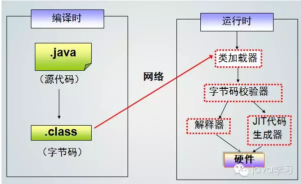
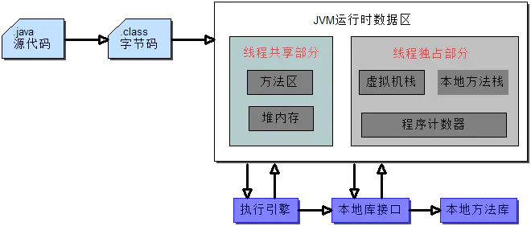

JVM是java语言最大的特点，java的优缺点也是缘于JVM技术。

JVM是一个可运行Java字节码的虚拟计算机系统。

它有一个**解释器组件**，可以实现Java字节码和计算机操作系统之间的通信。

还包括一组寄存器、一个栈、一个垃圾回收堆和一个存储方法域。

 JVM屏蔽了与具体操作系统平台相关的信息，使Java程序只需生成在Java虚拟机上运行的字节码，

就可以在多种平台上不加修改地运行。

这个也是java最大的特色跨平台性，也就是一处编写，处处运行。

JVM在执行字节码时，实际上最终还是把字节码解释成具体平台上的机器指令执行。

编译虚拟机的指令集与编译微处理器的指令集非常类似。

这就是java最受人批评的一个地方，运行在JVM上面当然没有直接运行在操作系统上快。

所以有人总是说java的运行速度比不上C语言。

Java中，类加载器把一个类装入JAVA虚拟机需要经过三个步骤来完成：

**装载**、**链接**、**初始化**，其中**链接又分来校验、准备、解析过程**

装载：查找和导入.class文件

链接：检查装入.class文件的正确性，然后，java虚拟机为变量分配内存，设置默认值

初始化：把符号引用变成直接引用。。。

# 装载过程

java虚拟机使用类装载器定位到相应的CLASS文件，然后读取这个CLASS文件（**一个线性二进制数据流**），将它传入java虚拟机中。

紧接着虚拟机提取其中的类型信息。

比如：该类的类名，方法名，变量名，修饰符，方法的返回类型等等。

还有一个重要的东西就是常量池。

（**常量池保存了该类型的所有常量，包括直接常量和对其他类型，字段，方法的符号引用**）

将这些信息保存在一个叫做**方法区**的地方。

最终形成CLASS类的实例，这个实例存放在内存的堆区。

它成为了java程序与内部数据结构之间的接口，程序要访问该类型的信息，

程序就调用该类型对应的CLASS实例对象的方法。

简而言之：这个过程就是把一个类型的二进制数据解析为方法区中的内部数据结构，并在堆上建立一个CLASS对象的过程。

# 链接过程

1)验证：确定类型符合java语言的语义，比如：final类不能有子类，final方法不能被覆盖，确保在类型和超类型之间没有不兼容的方法声明（比如两个方法拥有同样的名字，参数完全相同，但返回类型不同）。

2)准备：java虚拟机为类变量分配内存，设置默认值

3)解析：在类型的常量池中寻找类，接口，字段和方法的符合引用把这些符号引用替换成直接引用的过程。

# 初始化过程

可能会调用()方法，（这个方法只能够由java虚拟机调用）来初始化该类的静态变量。在调用这个方法前，必须确认该类的超类的() 方法已经被调用。

**JVM运行时数据区**：包含**线程共享**部分和**线程独占**部分。

**线程共享：**线程共同访问的内存数据空间，随着JVM（虚拟机）或者GC（垃圾回收）而创建和销毁。包含方法区和堆内存。

1、**方法区**：JVM用来存储加载的类信息、常量、静态变量、编译后的代码等数据。在JVM规范中，这是一个逻辑区，根据不同的虚拟机有不同的具体实现，如oracle的HotSpot的方法区，在java7中放在永久代，java8中放在元数据空间，并通过GC机制对这个区域进行管理。目前有三大Java虚拟机：HotSpot，oracle JRockit，IBM J9。

2、**堆内存**：存放对象的实例，在JVM启动时创建。可细分为老年代、新生代，垃圾回收器主要就是管理堆内存，如果满了就会出现OOM（OutOfMemoryError）。

**线程独占：**每个线程都会有自己独立的空间，随着线程的生命周期而创建和销毁。包含虚拟机栈、本地方法栈、程序计数器。

1、**虚拟机栈**：即虚拟机执行JAVA代码的栈，每个线程都会在这有一个私有空间。线程栈由多个栈帧（Stack Frame）组成，一个线程会执行一个或多个方法，一个方法对应一个栈帧。栈帧内容包括：局部变量表、操作数栈、动态链接、方法返回地址、附加信息等。栈内存默认最大是1M，超出则抛StackOverflowError。

2、**本地方法栈**：即虚拟机执行Native本地方法的栈，和虚拟机栈的主要区别是执行的方法不同。在虚拟机规范没有规定具体的实现，由不同的虚拟机厂商去实现。HotSpot虚拟机中虚拟机栈和本地方法栈的实现方式是一样的，超出大小后也会抛出StackOverflowError。

 3、**程序计数器**：记录当前线程执行字节码的位置，存储的是字节码指定地址，如果执行Native方法，则计数器值为空。每个线程在这都有一个私有空间，占用很少的内存空间。

CPU同一时间只会执行一条线程中的指令，JVM多线程会轮流切换并分配CPU执行时间，在线程切换后，需要通过程序计数器来回复正确的执行位置。

\1. 编译：javac Demo1.java

\2. 执行：java Demo1

\3. 反编译 javap –c Demo1.class

而我们所说的类加载过程即是指JVM虚拟机把.**class文件**中类信息加载进内存，并进行解析生成对应的**class对象**的过程。

举个通俗点的例子来说，JVM在执行某段代码时，遇到了class A， 然而此时内存中并没有class A的相关信息，于是**JVM就会到相应的class文件中去寻找class A的类信息，并加载进内存中，这就是我们所说的类加载过程。**

由此可见，JVM不是一开始就把所有的类都加载进内存中，而是只有第一次遇到某个**需要运行的类时才会加载**，且**只加载一次**。

参考资料

1、

https://www.cnblogs.com/weibanggang/p/11119410.html

2、Java的运行原理

https://www.cnblogs.com/o-andy-o/archive/2012/04/11/2442109.html