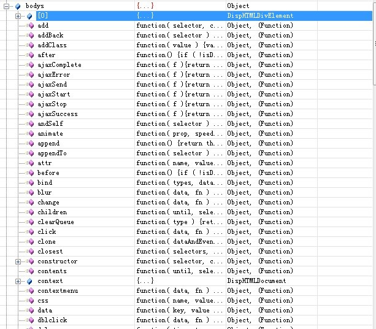

考虑到各个浏览器的原生js api的兼容性，大家一般都会在web项目里使用jquery这样的框架来进行网页开发。

jquery上手简单，但是要全面掌握并熟练运用也不容易。

# 原理

刚才我们说了，jquery将自己声明的变量全部都用外衣遮盖起来了，

而我们平时使用的Jquery和$，却是真真实实的全局变量，这个是从何而来，谜底就在jquery的某一行代码，一般是在文件的末尾。

```
window.jQuery = window.$ = jQuery;
```

jquery最核心的功能，就是选择器。

而选择器简单理解的话，其实就是在DOM文档中，寻找一个DOM对象的工具。

```
jQuery = function( selector, context ) {
        return new jQuery.fn.init( selector, context, rootjQuery );
    }
```

这里出现了jQuery.fn这样一个东西，它的由来可以在jquery的源码中找到，它其实代表的就是jQuery对象的原型。

```
jQuery.fn = jQuery.prototype;
jQuery.fn.init.prototype = jQuery.fn;
```

这两句话，

第一句把jQuery对象的原型赋给了fn属性，

第二句把jQuery对象的原型又赋给了init对象的原型。

也就是说，==init对象和jQuery具有相同的原型，==

**因此我们在上面返回的init对象，就与jQuery对象有一样的属性和方法。**

下面是LZ截取的一个jQuery对象的属性和方法截图，方法这里就不提了，

对于属性来说，我们最需要关注的只有一个属性，就是[0]属性，[0]其实就是原生的DOM对象。




很多时候，我们在jQuery和DOM对象之间切换时需要用到[0]这个属性。

从截图也可以看出，jQuery对象其实主要就是把原生的DOM对象存在了[0]的位置，

**并给它加了一系列简便的方法。**

这个索引0的属性我们可以从一小段代码简单的看一下它的由来，

下面是init方法中的一小段对DOMElement对象作为选择器的源码。

```
    // Handle $(DOMElement)
    if ( selector.nodeType ) {
        /*     可以看到，这里将DOM对象赋给了jQuery对象的[0]这个位置  */
        this.context = this[0] = selector;
        this.length = 1;
        return this;
    }
```

这一小段代码可以在jquery源码中找到，

它是处理传入的选择参数是一个DOM对象的情况。

可以看到，里面很明显的将jQuery对象索引0的位置以及context属性，都赋予了DOM对象。

代码不仅说明了这一点，也同时说明了，

**我们使用$(DOMElement)可以将一个DOM对象转换为jQuery对象，**

从而通过转换获得jQuery对象的简便方法。


# 简单实现

jquery的代码用了很多的技巧，读起来没有那么容易，我们可以先看自己来模拟一下jquery库。

下面这个代码就相当于一个最简单的jquery了。

```
(function(window) {
    var doc = window.document;
    //代码段二
    var JQuery = function(selector) {
        return new JClass(selector);
    };
    //代码段三
    JQuery.html = function(obj) {
        if(obj && obj.nodeType === 1) {
            return obj.innerHTML;
        }
    }
    //代码段一
    var JClass = function(selector) {
        if(selector.nodeType) {
            this.length = 1;
        } else if(selector.charAt(0) === '#') {
            this.length = 1;
            this[0] = doc.getElementById(selector.slice(1));
        } else if(typeof selector === 'string') {
            //如果传入的是字符串，假如全部是html标签，如p、div等。
            var nodes = doc.getElementsByTagName(selector);
            this.length = nodes.length;
            for(var i=0; i<nodes.length; i++) {
                this[i] = nodes[i];
            }

        } else {
            //上面都不是，那就不处理了
            this.length = 0;
        }
    }
    //代码段四
    JQuery.prototype.html = function() {
        if(this[0]) {
            return JQuery.html(this[0]);
        }
    }
    JClass.prototype = JQuery.prototype;
    //代码段五
    window.$ = window.JQuery = JQuery;
}(window));

```

我们把上面的代码保存为JQ.js。

然后写一个test.html文件，引用上面这个JQ.js文件。写代码如下。

```
<!DOCTYPE html>
<html>
<head>
    <meta charset="utf-8" />
    <meta http-equiv="X-UA-Compatible" content="IE=edge">
    <title>Page Title</title>
    <meta name="viewport" content="width=device-width, initial-scale=1">
    <script src="./JQ.js"></script>
</head>
<body>
    <div>
        <span id="result">xxx</span>
    </div>
    <div id="test">yyy</div>
    <script type="text/javascript">
        //alert($.html(document.getElementById("result")));
        console.log($("span").html());
    </script>
</body>
</html>
```

这个就实现了类似jquery的效果了。

我们分析一下JQ.js的5个代码段。

```
代码段一
	我们创建一个引用类型。
	JClass也是一个函数类型，也可以直接被调用，但是直接调用不是我们的目的。
	为了防止JClass被直接调用。我们不能把JClass直接暴露给开发人员。
	所以我们通过代码段二来构造JClass实例对象。
代码段二
	通过代码段二，开发人员无论是JQuery()还是new JQuery()，得到的都是一个JClass实例。
	这个就是我们的目的。
代码段三
	为了代码复用，我们一般会提供一些工具函数方便开发。
	既然JQuery是完全暴露给开发人员的，我们完全可以把这些工具方法作为JQuery的静态属性。
	我们当前只加了一个html方法，还可以扩展text、val等其他方法。
	对应$.xx 这种调用方式。
代码段四
	我们上面已经有了一些工具方法，
	为JClass实例对象创建公用方法。
	对应$("div").xx 这种调用方式。
代码段五
	给JQuery取个别名$，并作为全局变量暴露出来。
```


通过上面的模拟的jquery库，我们大概可以知道jquery的主要功能：

```
1、通过强大的选择器获得dom元素。
2、然后针对这些dom元素的日常操作封装成对应的方法。
3、同时jquery还为网页开发提供了一些工具类方法，例如each、ajax、extend等。
```

总的来说，jquery的知识点可以分为三大类：

```
1、jquery选择器。
2、jquery对象的操作，例如dom操作，表单操作。
3、jquery的工具方法。
4、jquery的插件编写。
```


jquery里的概念主要有3个：

```1
1、jquery
2、jquery对象。
3、dom对象。
```


dom对象：

```
很简单，定义了一套访问html文档对象的一套属性、方法和事件。
在没有jquery之前，我们通常直接操作dom，常用的api有getElementById等。
```

jquery：

```
其实就是一个函数。
准确来说，是jquery对象的工厂方法。
根据不同的参数来构造jquery对象。

jquery除了能够构造jquery对象，还有一些静态工具方法。

```

jquery对象：

```
是个类似数组的对象，里面存储了dom元素。
```


jquery如何判断某个元素为空？

```
//方法一
var o = $("div .class");
if (o.html() == null) {
  
}
//方法二
if(o.length == 0) {
  
}
```

jquery对象和dom对象如何转换？

```
var dom = document.getElementById("id");
var j_dom = $(dom);
for(var i=0; i<j_dom.length; i++) {
  var o = j_dom[i];
  //...
}
```


# 参考资料

1、JQuery原理介绍及学习方法

https://segmentfault.com/a/1190000003926465

2、js菜鸟进阶-jQuery源码分析(1)-基本架构

https://www.cnblogs.com/hrw3c/p/5304849.html

3、jquery原理的简单分析，让你扒开jquery的小外套。

https://www.cnblogs.com/zuoxiaolong/p/jquery1.html