cjson是C语言里进行cjson存取操作的库。


假设我们有这么一段json数据：

```
{
    "basic" :{
        "name": "teddy",
        "age": 27,
        "weight": 70.0
    },
    "habbits": [
        "basketball",
        "running"
    ]
}
```


```
#if CJSON_TEST
#include "cJSON.h"

char *cjson_data = "{\
    \"basic\" :{\
        \"name\": \"teddy\",\
        \"age\": 27,\
        \"weight\": 70.0\
    },\
    \"habbits\": [\
        \"basketball\",\
        \"running\"\
    ]\
}";

struct mybasic_t
{
    char name[32];
    int age;
    double weight;
};
struct myhabit_t 
{
    char habbit[2][32];
};

struct myinfo_t
{
    struct mybasic_t basic;
    struct myhabit_t habbits;
};
struct myinfo_t myinfo;

void cjson_test_read()
{
    cJSON *root, *basic, *habbits , *basic_name, *basic_age, *basic_weight;
    root = cJSON_Parse(cjson_data);
    basic = cJSON_GetObjectItem(root, "basic");
    basic_name = cJSON_GetObjectItem(basic, "name");
    memcpy(myinfo.basic.name, basic_name->valuestring, strlen(basic_name->valuestring));
    basic_age = cJSON_GetObjectItem(basic, "age");
    myinfo.basic.age = basic_age->valueint;
    
    basic_weight = cJSON_GetObjectItem(basic, "weight");
    myinfo.basic.weight = basic_weight->valuedouble;
    mylogd("%s:%d:%f", myinfo.basic.name,myinfo.basic.age,myinfo.basic.weight);

    habbits = cJSON_GetObjectItem(root, "habbits");
    int i=0;
    for(i=0; i<2; i++)
    {
        memcpy(myinfo.habbits.habbit[i], 
            cJSON_GetArrayItem(habbits, i)->valuestring, 
            strlen(cJSON_GetArrayItem(habbits, i)->valuestring));
        mylogd("habbits[%d]:%s", i, myinfo.habbits.habbit[i]);
    }
    
}


void cjson_test_write()
{
    
    cJSON *root, *basic, *habbits , *basic_name ,*basic_age;
    root = cJSON_CreateObject();
    basic = cJSON_CreateObject();
    cJSON_AddItemToObject(root, "basic", basic);
    basic_name = cJSON_CreateString("teddy");
    basic_age = cJSON_CreateNumber(27);
    cJSON_AddItemToObject(basic, "name", basic_name);
    cJSON_AddItemToObject(basic, "age", basic_age);
    cJSON_PrintUnformatted(root);
}


#endif

```


我看的是这个很轻量级的版本。

https://github.com/RT-Thread-packages/cJSON/archive/v1.0.2.zip

代码不多。

```
hlxiong@hlxiong-VirtualBox:~/work/study/cJSON-1.0.2$ tree
.
└── cJSON-1.0.2
    ├── cJSON.c
    ├── cJSON.h
    ├── cJSON_port.c
    ├── cJSON_util.c
    ├── cJSON_util.h
    ├── LICENSE
    ├── README.md
    └── SConscript
```

这个是rt-thread专用的。


关于delete

只需要对root对象进行delete就好了。不会有内存泄漏。

不能delete子节点。无论是放在delete root之前或之后，都会导致端错误。


测试数组

```
void test_array()
{
	char text[] = "\
	{\n \
	\"responses\":\n \
	[\n \
		{\n \
			\"header\": {\n \
				\"name\": \"aaa\"\n \
			},\n \
			\"payload\": {\n \
				\"timestamp\": 1\n \
			}\n \
		}, \
		{\n \
			\"header\": {\n \
				\"name\": \"bbb\"\n \
			},\n \
			\"payload\": {\n \
				\"timestamp\": 2\n \
			}\n \
		}\
	]\n \
	}";
	cJSON *root = cJSON_Parse(text);

	cJSON *responses = cJSON_GetObjectItem(root, "responses");
	int n = cJSON_GetArraySize(responses);
	printf("array size:%d\n", n);
	cJSON_Delete(root);
}
```

# 全局view

```mermaid
graph LR
    A[cJSON 库 v1.7.12] --> B[核心数据结构]
    A --> C[功能模块]
    A --> D[主要 API]

    %% 核心数据结构
    B --> B1[cJSON]
    B --> B2[cJSON_Hooks]
    B --> B3[parse_buffer]
    B --> B4[printbuffer]
    B --> B5[error]
    B --> B6[internal_hooks]

    B1 --> B1_1[type: int]
    B1 --> B1_2[valuestring: char*]
    B1 --> B1_3[valueint: int]
    B1 --> B1_4[valuedouble: double]
    B1 --> B1_5[string: char*]
    B1 --> B1_6[next: cJSON*]
    B1 --> B1_7[prev: cJSON*]
    B1 --> B1_8[child: cJSON*]

    B2 --> B2_1[malloc_fn: ]
    B2 --> B2_2[free_fn: ]

    B3 --> B3_1[content: unsigned char*]
    B3 --> B3_2[length: size_t]
    B3 --> B3_3[offset: size_t]
    B3 --> B3_4[depth: size_t]
    B3 --> B3_5[hooks: internal_hooks]

    B4 --> B4_1[buffer: unsigned char*]
    B4 --> B4_2[length: size_t]
    B4 --> B4_3[offset: size_t]
    B4 --> B4_4[depth: size_t]
    B4 --> B4_5[noalloc: cJSON_bool]
    B4 --> B4_6[format: cJSON_bool]
    B4 --> B4_7[hooks: internal_hooks]

    B5 --> B5_1[json: unsigned char*]
    B5 --> B5_2[position: size_t]

    B6 --> B6_1[allocate: ]
    B6 --> B6_2[deallocate: ]
    B6 --> B6_3[reallocate: ]

    %% 功能模块
    C --> C1[解析 ]
    C --> C2[生成 ]
    C --> C3[内存管理]
    C --> C4[对象操作]
    C --> C5[类型检查]
    C --> C6[比较与复制]

    C1 --> C1_1[cJSON_Parse]
    C1 --> C1_2[cJSON_ParseWithOpts]
    C1 --> C1_3[parse_value]
    C1 --> C1_4[parse_string]
    C1 --> C1_5[parse_number]
    C1 --> C1_6[parse_array]
    C1 --> C1_7[parse_object]

    C2 --> C2_1[cJSON_Print]
    C2 --> C2_2[cJSON_PrintUnformatted]
    C2 --> C2_3[cJSON_PrintBuffered]
    C2 --> C2_4[cJSON_PrintPreallocated]
    C2 --> C2_5[print_value]
    C2 --> C2_6[print_string]
    C2 --> C2_7[print_number]
    C2 --> C2_8[print_array]
    C2 --> C2_9[print_object]

    C3 --> C3_1[cJSON_InitHooks]
    C3 --> C3_2[cJSON_malloc]
    C3 --> C3_3[cJSON_free]
    C3 --> C3_4[cJSON_New_Item]
    C3 --> C3_5[cJSON_Delete]

    C4 --> C4_1[cJSON_Create<Type>]
    C4 --> C4_2[cJSON_AddItemTo<Object/Array>]
    C4 --> C4_3[cJSON_Get<Object/Array>Item]
    C4 --> C4_4[cJSON_DetachItem]
    C4 --> C4_5[cJSON_ReplaceItem]
    C4 --> C4_6[cJSON_InsertItemInArray]

    C5 --> C5_1[cJSON_Is<Type>]
    C5 --> C5_2[cJSON_GetStringValue]

    C6 --> C6_1[cJSON_Compare]
    C6 --> C6_2[cJSON_Duplicate]
    C6 --> C6_3[cJSON_Minify]

    %% 主要 API
    D --> D1[创建与销毁]
    D --> D2[解析与序列化]
    D --> D3[对象与数组操作]
    D --> D4[类型检查与辅助]

    D1 --> D1_1[cJSON_CreateNull]
    D1 --> D1_2[cJSON_CreateTrue]
    D1 --> D1_3[cJSON_CreateFalse]
    D1 --> D1_4[cJSON_CreateBool]
    D1 --> D1_5[cJSON_CreateNumber]
    D1 --> D1_6[cJSON_CreateString]
    D1 --> D1_7[cJSON_CreateRaw]
    D1 --> D1_8[cJSON_CreateArray]
    D1 --> D1_9[cJSON_CreateObject]
    D1 --> D1_10[cJSON_Delete]

    D2 --> D2_1[cJSON_Parse]
    D2 --> D2_2[cJSON_ParseWithOpts]
    D2 --> D2_3[cJSON_Print]
    D2 --> D2_4[cJSON_PrintUnformatted]
    D2 --> D2_5[cJSON_PrintBuffered]
    D2 --> D2_6[cJSON_PrintPreallocated]
    D2 --> D2_7[cJSON_Minify]

    D3 --> D3_1[cJSON_GetArraySize]
    D3 --> D3_2[cJSON_GetArrayItem]
    D3 --> D3_3[cJSON_GetObjectItem]
    D3 --> D3_4[cJSON_AddItemToArray]
    D3 --> D3_5[cJSON_AddItemToObject]
    D3 --> D3_6[cJSON_DetachItemFromArray]
    D3 --> D3_7[cJSON_DetachItemFromObject]
    D3 --> D3_8[cJSON_ReplaceItemInArray]
    D3 --> D3_9[cJSON_ReplaceItemInObject]

    D4 --> D4_1[cJSON_IsInvalid]
    D4 --> D4_2[cJSON_IsFalse]
    D4 --> D4_3[cJSON_IsTrue]
    D4 --> D4_4[cJSON_IsNull]
    D4 --> D4_5[cJSON_IsNumber]
    D4 --> D4_6[cJSON_IsString]
    D4 --> D4_7[cJSON_IsArray]
    D4 --> D4_8[cJSON_IsObject]
    D4 --> D4_9[cJSON_IsRaw]
    D4 --> D4_10[cJSON_Compare]
```




# int类型长度

cjson里，把int类型，只是32位的。

我看iflyos里，云端的时间戳是用int表示的。

这个还是会有溢出的风险的。

为什么JsonCpp里面为什么没有64位整数？Json起源于javascript，在js中数字的表示可能与高级语言中不一样， 如果一位数字32位表示不了那么js中应该一律都是用double表示， 所以说js中 大整数其实也是double， 这也就能解释为什么在jsoncpp中为什么没提供64为整数转化的方法。


# cJSON_IsReference

这个怎么使用的？

只在内部的create_reference函数里有置位这个flag。

对外的接口是：

```
cJSON_AddItemReferenceToArray
cJSON_AddItemReferenceToObject
```

我都没有使用过。

那么就是说，这个点我当前可以忽略。

那cjson对于字符串常量是怎么处理的？

例如cJSON_CreateString是怎么处理字符串常量的？是进行了一次strdup。

所以我上层调用就直接传递字符串常量就好了。

# json pointer

我看cjson的cJSON_Utils里有json pointer的函数：

```
CJSON_PUBLIC(cJSON *) cJSONUtils_GetPointer(cJSON * const object, const char *pointer);
```

这个是个什么概念呢？

JSON Pointer（JSON指针）是一种用于在JSON文档中定位特定值或元素的字符串表示方法。

它通常用于在JSON文档中进行导航，查找特定路径下的值或对象，

并支持对JSON文档进行操作。

JSON Pointer定义了一些特定的字符和符号来表示路径，以便准确定位JSON文档中的元素。

JSON Pointer使用斜杠（/）作为分隔符来表示层级关系，类似于文件路径。

此外，它还使用一些特殊字符来表示一些操作，例如：

- `/`：表示JSON文档的根级别。
- `/propertyName`：表示对象中名为"propertyName"的属性。
- `/index`：表示数组中的索引。
- `/-`：表示在数组中添加一个新元素。

以下是一些示例，以便更好地理解JSON Pointer的使用：

考虑以下JSON文档：

```json
{
  "person": {
    "name": "John",
    "age": 30,
    "address": {
      "street": "123 Main St",
      "city": "Exampleville"
    },
    "languages": ["English", "French"]
  }
}
```

- `"/person/name"`：指向"John"。
- `"/person/address/city"`：指向"Exampleville"。
- `"/person/languages/0"`：指向"English"。
- `"/person/languages/1"`：指向"French"。

JSON Pointer还支持一些特殊操作，例如：

- `"/person/name"` 的值为 "John"，可以用 `"/person/name" = "Jane"` 来修改为 "Jane"。
- `"/person/languages/-"` 表示在`languages`数组中添加一个新元素。

需要注意的是，JSON Pointer是一种用于定位JSON文档中特定元素的表示方法，并不直接执行实际的操作。在实际应用中，您可能需要使用编程语言的库或工具来解析JSON Pointer并进行相应的操作。

# *JSON Patch*介绍

JSON Patch 是一种用于在 JSON 文档中进行部分更新（patching）的格式和协议。

它允许你描述一系列操作，这些操作可以应用于现有的 JSON 文档，以便对其进行修改、添加、删除或替换。

JSON Patch 通常用于在不替换整个 JSON 文档的情况下，对其中的特定部分进行更改。

JSON Patch 定义了一组操作，每个操作都由一个 JSON 对象表示。

以下是 JSON Patch 支持的几种常见操作：

1. `add`：向 JSON 文档中添加一个新的值或对象。
2. `remove`：从 JSON 文档中移除一个值或对象。
3. `replace`：替换 JSON 文档中的一个值。
4. `move`：将一个值从一个位置移动到另一个位置。
5. `copy`：将一个值从一个位置复制到另一个位置。
6. `test`：测试 JSON 文档中的一个值是否匹配给定的值，用于验证。

每个操作都由一个操作类型字段（如 `add`、`remove` 等）和一些操作特定的字段组成，这些字段指定了操作要作用的位置以及操作所需的值。JSON Patch 中的操作按照顺序依次应用，从而生成最终的修改后的 JSON 文档。

以下是一个简单的 JSON Patch 示例，假设我们有以下 JSON 文档：

```json
{
  "name": "John",
  "age": 30,
  "address": {
    "street": "123 Main St",
    "city": "Exampleville"
  }
}
```

以下是一个 JSON Patch，它将在上述 JSON 文档上应用以下操作：

1. 添加 `{"country": "USA"}` 到 `address` 对象中。
2. 将 `age` 的值从 `30` 替换为 `31`。
3. 从 `address` 对象中删除 `city` 属性。

```json
[
  { "op": "add", "path": "/address/country", "value": "USA" },
  { "op": "replace", "path": "/age", "value": 31 },
  { "op": "remove", "path": "/address/city" }
]
```

应用上述 JSON Patch 操作后，最终的 JSON 文档将变为：

```json
{
  "name": "John",
  "age": 31,
  "address": {
    "street": "123 Main St",
    "country": "USA"
  }
}
```

JSON Patch 可以用于在 RESTful API 中进行部分更新，避免发送整个 JSON 文档，从而减少数据传输量和服务器端的处理负担。

它也被广泛用于一些 JSON 数据库、配置管理和数据同步等场景。

# 测试代码

这个项目的测试代码写得比较全面。值得学习一下。

# reference和const

在 cJSON 库（版本 1.7.12）中，`cJSON_IsReference` 和 `cJSON_StringIsConst` 是两个重要的标志位，定义在 `cJSON.h` 中，用于标记 `cJSON` 结构中的特殊属性。它们分别用于指示节点是否为引用以及字符串键是否为常量。以下是对这两个标志的详细用法说明，包括定义、作用、使用场景和注意事项。

---

### 1. `cJSON_IsReference` (256)
#### 定义
```c
#define cJSON_IsReference 256
```

#### 作用
`cJSON_IsReference` 是一个位标志，用于标记一个 `cJSON` 节点是否为**引用**类型。引用类型的节点并不拥有其内容的内存，而是指向已有 `cJSON` 结构或字符串的内存。这种机制避免了不必要的内存复制，提高了效率。

- **标志位置**：存储在 `cJSON` 结构的 `type` 字段中，通过位运算与节点类型（如 `cJSON_String`、`cJSON_Object` 等）组合。
- **用途**：主要用于以下场景：
  - 创建对现有 `cJSON` 节点的引用（如数组或对象），避免深拷贝。
  - 创建对常量字符串的引用，防止 cJSON 释放不属于它的内存。

#### 使用场景
1. **创建引用节点**：
   - 使用 `cJSON_CreateStringReference`、`cJSON_CreateObjectReference` 或 `cJSON_CreateArrayReference` 创建引用节点。
   - 示例：
     ```c
     const char *str = "example";
     cJSON *ref = cJSON_CreateStringReference(str);
     // ref->type = cJSON_String | cJSON_IsReference
     // ref->valuestring 指向 str，不会被 cJSON 释放
     ```
   - 这些函数设置 `cJSON_IsReference` 标志，确保节点仅引用外部内存。

2. **添加引用到数组或对象**：
   - 使用 `cJSON_AddItemReferenceToArray` 或 `cJSON_AddItemReferenceToObject` 添加引用节点。
   - 示例：
     ```c
     cJSON *array = cJSON_CreateArray();
     cJSON *item = cJSON_CreateString("test");
     cJSON_AddItemReferenceToArray(array, item);
     // 数组中的节点带有 cJSON_IsReference 标志
     ```

3. **内存管理**：
   - 当 `cJSON_IsReference` 标志被设置时，`cJSON_Delete` 不会释放 `valuestring` 或 `child` 指向的内存。
   - 示例：
     ```c
     cJSON *ref = cJSON_CreateStringReference("constant");
     cJSON_Delete(ref); // 不会释放 "constant" 的内存
     ```

#### 实现细节
- **标志检查**：在 `cJSON_Delete` 中，检查 `type & cJSON_IsReference`：
  ```c
  if (!(item->type & cJSON_IsReference) && (item->child != NULL)) {
      cJSON_Delete(item->child);
  }
  if (!(item->type & cJSON_IsReference) && (item->valuestring != NULL)) {
      global_hooks.deallocate(item->valuestring);
  }
  ```
  如果节点是引用类型，则跳过释放 `child` 和 `valuestring`。

- **创建引用**：`create_reference` 函数负责设置标志：
  ```c
  reference->type |= cJSON_IsReference;
  ```

#### 注意事项
- **内存责任**：引用节点的内存由调用者管理，`cJSON_Delete` 不会释放引用的内容。确保引用的内存（如字符串或子节点）在 cJSON 节点生命周期内有效。
- **避免误用**：不要手动修改 `valuestring` 或 `child` 的内容，除非明确知道它们不是引用。
- **性能优势**：引用机制减少了内存分配和拷贝，适合处理大型 JSON 结构或常量数据。

---

### 2. `cJSON_StringIsConst` (512)
#### 定义
```c
#define cJSON_StringIsConst 512
```

#### 作用
`cJSON_StringIsConst` 是一个位标志，用于标记 `cJSON` 节点的 `string` 字段（即对象的键名）是否为**常量字符串**。常量字符串通常是调用者提供的只读字符串（如字符串字面量），cJSON 不会尝试释放或修改它。

- **标志位置**：存储在 `cJSON` 结构的 `type` 字段中，通常与 `cJSON_Object` 或其他类型的节点结合。
- **用途**：防止 cJSON 释放或修改不属于它的键名内存。

#### 使用场景
1. **使用常量键名添加对象项**：
   - 使用 `cJSON_AddItemToObjectCS` 函数添加带有常量键名的项。
   - 示例：
     ```c
     cJSON *object = cJSON_CreateObject();
     cJSON *item = cJSON_CreateString("value");
     cJSON_AddItemToObjectCS(object, "key", item);
     // item->string 指向 "key"，type 包含 cJSON_StringIsConst
     ```
   - `cJSON_AddItemToObjectCS` 设置 `cJSON_StringIsConst` 标志，表示 `string` 是常量。

2. **内存管理**：
   - 在 `cJSON_Delete` 中，检查 `type & cJSON_StringIsConst`：
     ```c
     if (!(item->type & cJSON_StringIsConst) && (item->string != NULL)) {
         global_hooks.deallocate(item->string);
     }
     ```
     如果 `cJSON_StringIsConst` 被设置，`string` 不会被释放。

3. **避免动态分配**：
   - 使用常量键名可以避免为键名分配新内存，适合性能敏感场景。
   - 示例：
     ```c
     cJSON *object = cJSON_CreateObject();
     cJSON_AddStringToObject(object, "dynamic_key", "value"); // 动态分配键名
     cJSON_AddStringToObjectCS(object, "const_key", "value"); // 使用常量键名
     ```

#### 实现细节
- **标志设置**：在 `add_item_to_object` 函数中，`constant_key` 参数控制是否设置 `cJSON_StringIsConst`：
  ```c
  if (constant_key) {
      new_key = (char*)cast_away_const(string);
      new_type = item->type | cJSON_StringIsConst;
  } else {
      new_key = (char*)cJSON_strdup((const unsigned char*)string, hooks);
      new_type = item->type & ~cJSON_StringIsConst;
  }
  ```

- **警告**：`cJSON.h` 中明确警告：
  ```c
  /* WARNING: When this function was used, make sure to always check that (item->type & cJSON_StringIsConst) is zero before writing to `item->string` */
  ```
  这意味着在使用 `cJSON_AddItemToObjectCS` 后，不能直接修改 `item->string`，因为它可能指向只读内存。

#### 注意事项
- **只读内存**：`cJSON_StringIsConst` 标志表示 `string` 可能指向只读内存（如字符串字面量）。修改它会导致未定义行为。
- **使用场景**：仅在键名是静态常量（如 `"key"`）时使用 `cJSON_AddItemToObjectCS`。如果键名是动态生成的，使用 `cJSON_AddItemToObject`。
- **生命周期**：确保常量字符串的生命周期覆盖 cJSON 对象的整个使用周期。
- **性能优化**：使用常量键名可以减少内存分配，但在修改键名时需要格外小心。

---

### 代码示例
以下是一个综合示例，展示 `cJSON_IsReference` 和 `cJSON_StringIsConst` 的用法：

```c
#include <stdio.h>
#include "cJSON.h"

int main() {
    // 创建对象
    cJSON *object = cJSON_CreateObject();

    // 使用常量键名添加字符串（cJSON_StringIsConst）
    cJSON_AddStringToObjectCS(object, "const_key", "value1");
    
    // 使用动态键名添加字符串
    cJSON_AddStringToObject(object, "dynamic_key", "value2");

    // 创建引用字符串（cJSON_IsReference）
    const char *ref_str = "referenced_string";
    cJSON *ref_item = cJSON_CreateStringReference(ref_str);
    cJSON_AddItemToObject(object, "ref_key", ref_item);

    // 打印 JSON
    char *json_str = cJSON_Print(object);
    printf("JSON: %s\n", json_str);

    // 检查标志
    cJSON *item = cJSON_GetObjectItem(object, "const_key");
    if (item->type & cJSON_StringIsConst) {
        printf("const_key is a constant string\n");
    }

    item = cJSON_GetObjectItem(object, "ref_key");
    if (item->type & cJSON_IsReference) {
        printf("ref_key is a reference\n");
    }

    // 清理
    cJSON_free(json_str);
    cJSON_Delete(object);
    return 0;
}
```

**输出**：
```
JSON: {
    "const_key":    "value1",
    "dynamic_key":  "value2",
    "ref_key":      "referenced_string"
}
const_key is a constant string
ref_key is a reference
```

---

### 总结
- **`cJSON_IsReference`**：
  - 标记节点为引用类型，防止 cJSON 释放引用的内存。
  - 适用于字符串引用、对象引用和数组引用，优化内存使用。
  - 注意确保引用的内存有效。

- **`cJSON_StringIsConst`**：
  - 标记对象的键名为常量字符串，防止 cJSON 释放或修改。
  - 适合静态键名场景，减少内存分配。
  - 禁止直接修改带有该标志的 `string` 字段。

通过理解和正确使用这两个标志，你可以更高效地管理 cJSON 结构，特别是在处理大型 JSON 数据或性能敏感场景时。如果需要进一步的代码示例、特定场景分析或调试帮助，请告诉我！

# JSON 指针、补丁和合并补丁

指针：就是通过文件路径类似的方式来获取指定的节点。`cJSONUtils_GetPointer(root, "/users/0/name");`

补丁：就是修改一个节点的内容。

合并补丁：相当于取并集。

看下面的例子就都懂了。

```
#include <stdio.h>
#include "cJSON.h"
#include "cJSON_Utils.h"

int main() {
    // 解析 JSON
    const char *json_str = "{\"users\":[{\"name\":\"Alice\"},{\"name\":\"Bob\"}]}";
    cJSON *root = cJSON_Parse(json_str);

    // 使用 JSON 指针定位节点
    cJSON *name = cJSONUtils_GetPointer(root, "/users/0/name");
    printf("Pointer result: %s\n", name->valuestring); // 输出: Alice

    // 生成和应用补丁
    cJSON *from = cJSON_Parse("{\"data\":{\"x\":1}}");
    cJSON *to = cJSON_Parse("{\"data\":{\"x\":2}}");
    cJSON *patches = cJSONUtils_GeneratePatches(from, to);
    printf("Patches: %s\n", cJSON_Print(patches));
    // 输出: [{"op":"replace","path":"/data/x","value":2}]

    cJSON *patched = cJSON_Duplicate(from, 1);
    cJSONUtils_ApplyPatches(patched, patches);
    printf("Patched: %s\n", cJSON_Print(patched));
    // 输出: {"data":{"x":2}}

    // 应用合并补丁
    cJSON *target = cJSON_Parse("{\"a\":1,\"b\":2}");
    cJSON *patch = cJSON_Parse("{\"b\":null,\"c\":3}");
    target = cJSONUtils_MergePatch(target, patch);
    printf("Merged: %s\n", cJSON_Print(target));
    // 输出: {"a":1,"c":3}

    // 清理
    cJSON_Delete(root);
    cJSON_Delete(from);
    cJSON_Delete(to);
    cJSON_Delete(patches);
    cJSON_Delete(patched);
    cJSON_Delete(target);
    return 0;
}
```

# easyjson

要让 cJSON 的使用更加接近人的自然思维，我们需要设计一个封装层，隐藏底层的复杂性（如内存管理、标志位处理、指针操作等），并提供更直观、高级的接口。这种封装层应该：

1. **简化内存管理**：自动处理 `cJSON` 对象的创建和释放，避免手动调用 `cJSON_Delete`。
2. **提供直观的操作**：使用类似现代语言（如 Python、JavaScript）的语法或语义，降低学习曲线。
3. **支持链式调用**：允许流畅的操作，如 `obj.set("key").add("array", value)`。
4. **隐藏标志位细节**：如 `cJSON_IsReference` 和 `cJSON_StringIsConst`，让用户无需关心底层实现。
5. **提供类型安全**：通过封装类型检查和转换，减少运行时错误。
6. **支持 JSON 指针和补丁**：以更自然的方式操作嵌套数据或应用修改。

以下是一个基于 cJSON 的封装层设计，命名为 `EasyJSON`，它提供了一个更人性化的接口，结合了现代编程语言的习惯，并通过链式调用和自动内存管理简化操作。这个实现将作为代码工件提供，包含头文件和实现文件。

---

### 设计思路

1. **核心结构**：
   - 定义一个 `EasyJSON` 结构，封装 `cJSON` 指针，并添加内存管理标志。
   - 使用引用计数或标志位确保自动释放，避免内存泄漏。

2. **接口特点**：
   - **创建与解析**：通过 `ej_create_*` 函数创建对象、数组、字符串等，支持 JSON 字符串解析。
   - **访问与修改**：提供 `ej_get`、`ej_set`、`ej_append` 等函数，简化嵌套访问和修改。
   - **链式调用**：大多数修改函数返回 `EasyJSON*`，支持连续操作。
   - **JSON 指针支持**：通过 `ej_pointer` 函数直接访问或修改嵌套路径。
   - **补丁支持**：通过 `ej_apply_patch` 和 `ej_generate_patch` 简化补丁操作。
   - **序列化**：提供 `ej_to_string` 函数，生成格式化或非格式化的 JSON 字符串。

3. **内存管理**：
   - 使用 `ej_free` 显式释放，或通过标志位在对象销毁时自动释放。
   - 提供 `ej_take_ownership` 和 `ej_release_ownership` 控制内存所有权。

4. **类型安全**：
   - 提供 `ej_is_*` 函数检查类型，返回默认值（如 `NULL` 或 `0`）以避免崩溃。
   - 使用枚举（如 `EJType`）表示 JSON 类型，简化类型处理。

5. **错误处理**：
   - 返回状态码或默认值，记录错误信息（可选）。

---

### 代码工件

以下是 `EasyJSON` 的头文件和实现文件，包含核心功能和示例用法。

```c
#ifndef EASY_JSON_H
#define EASY_JSON_H

#include "cJSON.h"
#include "cJSON_Utils.h"

#ifdef __cplusplus
extern "C" {
#endif

/* JSON 类型枚举 */
typedef enum {
    EJ_INVALID,
    EJ_NULL,
    EJ_BOOL,
    EJ_NUMBER,
    EJ_STRING,
    EJ_ARRAY,
    EJ_OBJECT
} EJType;

/* EasyJSON 结构 */
typedef struct EasyJSON {
    cJSON *node;            /* 底层 cJSON 节点 */
    int owns_memory;        /* 是否拥有内存所有权 */
} EasyJSON;

/* 创建函数 */
EasyJSON *ej_create_object(void);
EasyJSON *ej_create_array(void);
EasyJSON *ej_create_null(void);
EasyJSON *ej_create_bool(int value);
EasyJSON *ej_create_number(double value);
EasyJSON *ej_create_string(const char *value);
EasyJSON *ej_parse(const char *json_str);

/* 释放函数 */
void ej_free(EasyJSON *ej);

/* 类型检查 */
EJType ej_type(const EasyJSON *ej);
int ej_is_null(const EasyJSON *ej);
int ej_is_bool(const EasyJSON *ej);
int ej_is_number(const EasyJSON *ej);
int ej_is_string(const EasyJSON *ej);
int ej_is_array(const EasyJSON *ej);
int ej_is_object(const EasyJSON *ej);

/* 获取值 */
int ej_get_bool(const EasyJSON *ej, int default_value);
double ej_get_number(const EasyJSON *ej, double default_value);
const char *ej_get_string(const EasyJSON *ej, const char *default_value);
EasyJSON *ej_get(const EasyJSON *ej, const char *key); /* 对象键 */
EasyJSON *ej_get_index(const EasyJSON *ej, int index); /* 数组索引 */
EasyJSON *ej_pointer(const EasyJSON *ej, const char *pointer); /* JSON 指针 */

/* 设置值 */
EasyJSON *ej_set(EasyJSON *ej, const char *key, EasyJSON *value); /* 对象 */
EasyJSON *ej_set_string(EasyJSON *ej, const char *key, const char *value);
EasyJSON *ej_set_number(EasyJSON *ej, const char *key, double value);
EasyJSON *ej_set_bool(EasyJSON *ej, const char *key, int value);
EasyJSON *ej_set_null(EasyJSON *ej, const char *key);

/* 数组操作 */
EasyJSON *ej_append(EasyJSON *ej, EasyJSON *value); /* 添加到数组 */
EasyJSON *ej_append_string(EasyJSON *ej, const char *value);
EasyJSON *ej_append_number(EasyJSON *ej, double value);
EasyJSON *ej_append_bool(EasyJSON *ej, int value);
EasyJSON *ej_append_null(EasyJSON *ej);

/* 删除 */
EasyJSON *ej_remove(EasyJSON *ej, const char *key); /* 从对象删除 */
EasyJSON *ej_remove_index(EasyJSON *ej, int index); /* 从数组删除 */

/* 序列化 */
char *ej_to_string(const EasyJSON *ej, int formatted);

/* 补丁操作 */
EasyJSON *ej_generate_patch(EasyJSON *from, EasyJSON *to);
int ej_apply_patch(EasyJSON *ej, EasyJSON *patch);

/* 内存所有权控制 */
void ej_take_ownership(EasyJSON *ej);
void ej_release_ownership(EasyJSON *ej);

#ifdef __cplusplus
}
#endif

#endif /* EASY_JSON_H */
```

```c
#include "easy_json.h"
#include <stdlib.h>
#include <string.h>

static void ensure_valid(EasyJSON *ej) {
    if (!ej || !ej->node) {
        ej->node = cJSON_CreateNull();
        ej->owns_memory = 1;
    }
}

static EasyJSON *wrap_cjson(cJSON *node, int owns_memory) {
    if (!node) return NULL;
    EasyJSON *ej = (EasyJSON *)malloc(sizeof(EasyJSON));
    if (!ej) {
        cJSON_Delete(node);
        return NULL;
    }
    ej->node = node;
    ej->owns_memory = owns_memory;
    return ej;
}

/* 创建函数 */
EasyJSON *ej_create_object(void) {
    return wrap_cjson(cJSON_CreateObject(), 1);
}

EasyJSON *ej_create_array(void) {
    return wrap_cjson(cJSON_CreateArray(), 1);
}

EasyJSON *ej_create_null(void) {
    return wrap_cjson(cJSON_CreateNull(), 1);
}

EasyJSON *ej_create_bool(int value) {
    return wrap_cjson(cJSON_CreateBool(value), 1);
}

EasyJSON *ej_create_number(double value) {
    return wrap_cjson(cJSON_CreateNumber(value), 1);
}

EasyJSON *ej_create_string(const char *value) {
    return wrap_cjson(cJSON_CreateString(value), 1);
}

EasyJSON *ej_parse(const char *json_str) {
    cJSON *node = cJSON_Parse(json_str);
    return wrap_cjson(node, 1);
}

/* 释放函数 */
void ej_free(EasyJSON *ej) {
    if (ej && ej->owns_memory && ej->node) {
        cJSON_Delete(ej->node);
    }
    if (ej) {
        free(ej);
    }
}

/* 类型检查 */
EJType ej_type(const EasyJSON *ej) {
    if (!ej || !ej->node) return EJ_INVALID;
    int type = ej->node->type & 0xFF;
    switch (type) {
        case cJSON_NULL: return EJ_NULL;
        case cJSON_True: case cJSON_False: return EJ_BOOL;
        case cJSON_Number: return EJ_NUMBER;
        case cJSON_String: return EJ_STRING;
        case cJSON_Array: return EJ_ARRAY;
        case cJSON_Object: return EJ_OBJECT;
        default: return EJ_INVALID;
    }
}

int ej_is_null(const EasyJSON *ej) { return ej_type(ej) == EJ_NULL; }
int ej_is_bool(const EasyJSON *ej) { return ej_type(ej) == EJ_BOOL; }
int ej_is_number(const EasyJSON *ej) { return ej_type(ej) == EJ_NUMBER; }
int ej_is_string(const EasyJSON *ej) { return ej_type(ej) == EJ_STRING; }
int ej_is_array(const EasyJSON *ej) { return ej_type(ej) == EJ_ARRAY; }
int ej_is_object(const EasyJSON *ej) { return ej_type(ej) == EJ_OBJECT; }

/* 获取值 */
int ej_get_bool(const EasyJSON *ej, int default_value) {
    if (ej_is_bool(ej)) return cJSON_IsTrue(ej->node) ? 1 : 0;
    return default_value;
}

double ej_get_number(const EasyJSON *ej, double default_value) {
    if (ej_is_number(ej)) return ej->node->valuedouble;
    return default_value;
}

const char *ej_get_string(const EasyJSON *ej, const char *default_value) {
    if (ej_is_string(ej)) return ej->node->valuestring;
    return default_value;
}

EasyJSON *ej_get(const EasyJSON *ej, const char *key) {
    if (!ej_is_object(ej)) return NULL;
    cJSON *node = cJSON_GetObjectItem(ej->node, key);
    return wrap_cjson(node, 0); /* 不拥有内存 */
}

EasyJSON *ej_get_index(const EasyJSON *ej, int index) {
    if (!ej_is_array(ej) || index < 0) return NULL;
    cJSON *node = cJSON_GetArrayItem(ej->node, index);
    return wrap_cjson(node, 0); /* 不拥有内存 */
}

EasyJSON *ej_pointer(const EasyJSON *ej, const char *pointer) {
    if (!ej || !ej->node) return NULL;
    cJSON *node = cJSONUtils_GetPointer(ej->node, pointer);
    return wrap_cjson(node, 0); /* 不拥有内存 */
}

/* 设置值 */
EasyJSON *ej_set(EasyJSON *ej, const char *key, EasyJSON *value) {
    ensure_valid(ej);
    if (!ej_is_object(ej)) {
        cJSON_Delete(ej->node);
        ej->node = cJSON_CreateObject();
    }
    cJSON *old = cJSON_DetachItemFromObject(ej->node, key);
    if (old) cJSON_Delete(old);
    cJSON_AddItemToObject(ej->node, key, value->node);
    value->owns_memory = 0; /* 转移所有权 */
    ej_free(value);
    return ej;
}

EasyJSON *ej_set_string(EasyJSON *ej, const char *key, const char *value) {
    EasyJSON *val = ej_create_string(value);
    return ej_set(ej, key, val);
}

EasyJSON *ej_set_number(EasyJSON *ej, const char *key, double value) {
    EasyJSON *val = ej_create_number(value);
    return ej_set(ej, key, val);
}

EasyJSON *ej_set_bool(EasyJSON *ej, const char *key, int value) {
    EasyJSON *val = ej_create_bool(value);
    return ej_set(ej, key, val);
}

EasyJSON *ej_set_null(EasyJSON *ej, const char *key) {
    EasyJSON *val = ej_create_null();
    return ej_set(ej, key, val);
}

/* 数组操作 */
EasyJSON *ej_append(EasyJSON *ej, EasyJSON *value) {
    ensure_valid(ej);
    if (!ej_is_array(ej)) {
        cJSON_Delete(ej->node);
        ej->node = cJSON_CreateArray();
    }
    cJSON_AddItemToArray(ej->node, value->node);
    value->owns_memory = 0; /* 转移所有权 */
    ej_free(value);
    return ej;
}

EasyJSON *ej_append_string(EasyJSON *ej, const char *value) {
    EasyJSON *val = ej_create_string(value);
    return ej_append(ej, val);
}

EasyJSON *ej_append_number(EasyJSON *ej, double value) {
    EasyJSON *val = ej_create_number(value);
    return ej_append(ej, val);
}

EasyJSON *ej_append_bool(EasyJSON *ej, int value) {
    EasyJSON *val = ej_create_bool(value);
    return ej_append(ej, val);
}

EasyJSON *ej_append_null(EasyJSON *ej) {
    EasyJSON *val = ej_create_null();
    return ej_append(ej, val);
}

/* 删除 */
EasyJSON *ej_remove(EasyJSON *ej, const char *key) {
    if (ej_is_object(ej)) {
        cJSON *old = cJSON_DetachItemFromObject(ej->node, key);
        if (old) cJSON_Delete(old);
    }
    return ej;
}

EasyJSON *ej_remove_index(EasyJSON *ej, int index) {
    if (ej_is_array(ej) && index >= 0) {
        cJSON *old = cJSON_DetachItemFromArray(ej->node, index);
        if (old) cJSON_Delete(old);
    }
    return ej;
}

/* 序列化 */
char *ej_to_string(const EasyJSON *ej, int formatted) {
    if (!ej || !ej->node) return NULL;
    return formatted ? cJSON_Print(ej->node) : cJSON_PrintUnformatted(ej->node);
}

/* 补丁操作 */
EasyJSON *ej_generate_patch(EasyJSON *from, EasyJSON *to) {
    if (!from || !to || !from->node || !to->node) return NULL;
    cJSON *patch = cJSONUtils_GeneratePatches(from->node, to->node);
    return wrap_cjson(patch, 1);
}

int ej_apply_patch(EasyJSON *ej, EasyJSON *patch) {
    if (!ej || !patch || !ej->node || !patch->node) return -1;
    return cJSONUtils_ApplyPatches(ej->node, patch->node);
}

/* 内存所有权控制 */
void ej_take_ownership(EasyJSON *ej) {
    if (ej) ej->owns_memory = 1;
}

void ej_release_ownership(EasyJSON *ej) {
    if (ej) ej->owns_memory = 0;
}
```

```c
#include <stdio.h>
#include "easy_json.h"

int main() {
    /* 创建对象并链式设置值 */
    EasyJSON *obj = ej_create_object()
        ->set_string("name", "Alice")
        ->set_number("age", 25)
        ->set_bool("active", 1);

    /* 创建嵌套数组 */
    EasyJSON *scores = ej_create_array()
        ->append_number(90)
        ->append_number(85)
        ->append_null();
    obj->set("scores", scores);

    /* 使用 JSON 指针访问和修改 */
    EasyJSON *name = ej_pointer(obj, "/name");
    printf("Name: %s\n", ej_get_string(name, "Unknown")); // 输出: Alice
    ej_free(name);

    /* 序列化 */
    char *json_str = ej_to_string(obj, 1);
    printf("JSON: %s\n", json_str);
    cJSON_free(json_str);

    /* 生成和应用补丁 */
    EasyJSON *obj2 = ej_parse("{\"name\":\"Bob\",\"age\":30}");
    EasyJSON *patch = ej_generate_patch(obj, obj2);
    json_str = ej_to_string(patch, 1);
    printf("Patch: %s\n", json_str);
    cJSON_free(json_str);

    ej_apply_patch(obj, patch);
    json_str = ej_to_string(obj, 1);
    printf("Patched JSON: %s\n", json_str);
    cJSON_free(json_str);

    /* 清理 */
    ej_free(patch);
    ej_free(obj2);
    ej_free(obj);
    return 0;
}
```

---

### 使用说明

1. **编译与链接**：
   - 确保已包含 `cJSON` 和 `cJSON_Utils` 库。
   - 编译命令示例：
     ```bash
     gcc -o example example.c easy_json.c cJSON.c cJSON_Utils.c
     ```

2. **输出示例**：
   运行 `example.c` 将产生类似以下输出：
   ```
   Name: Alice
   JSON: {
       "name": "Alice",
       "age": 25,
       "active": true,
       "scores": [90, 85, null]
   }
   Patch: [
       {"op":"replace","path":"/name","value":"Bob"},
       {"op":"replace","path":"/age","value":30},
       {"op":"remove","path":"/active"},
       {"op":"remove","path":"/scores"}
   ]
   Patched JSON: {
       "name": "Bob",
       "age": 30
   }
   ```

3. **关键特性**：
   - **链式调用**：如 `ej_create_object()->set_string("key", "value")`。
   - **自动内存管理**：`ej_set` 和 `ej_append` 自动转移所有权，`ej_free` 释放拥有内存的对象。
   - **类型安全**：`ej_get_*` 函数提供默认值，`ej_type` 检查类型。
   - **JSON 指针**：`ej_pointer` 简化嵌套访问。
   - **补丁支持**：`ej_generate_patch` 和 `ej_apply_patch` 封装了复杂操作。

---

### 优势与自然思维的契合

1. **直观性**：
   - 使用 `set`、`append` 等动词，类似 Python 的 `dict[key] = value` 或 JavaScript 的 `obj.key = value`。
   - JSON 指针通过路径字符串（如 `/key/subkey`）访问嵌套数据，符合 REST API 的习惯。

2. **简化的内存管理**：
   - 用户无需手动调用 `cJSON_Delete`，`EasyJSON` 结构通过 `owns_memory` 标志自动管理。
   - 链式调用和自动所有权转移减少了内存泄漏风险。

3. **现代语言风格**：
   - 链式调用模仿 jQuery 或 JavaScript 的流式 API。
   - 类型检查和默认值机制类似 Python 的 `dict.get(key, default)`。

4. **隐藏复杂性**：
   - 屏蔽了 `cJSON_IsReference` 和 `cJSON_StringIsConst` 等标志位的复杂性。
   - 封装了 JSON 补丁和指针的底层操作，用户只需提供路径和值。

5. **错误容忍**：
   - 无效操作（如访问不存在的键）返回 `NULL` 或默认值，不会崩溃。
   - 提供状态码（如 `ej_apply_patch` 的返回值）便于错误处理。

---

### 局限性与改进空间

1. **性能开销**：
   - 封装层引入了额外的结构体分配和释放，略增加开销。
   - **改进**：使用对象池或静态分配减少内存操作。

2. **功能覆盖**：
   - 当前未完全封装 `cJSON_Utils` 的合并补丁功能（如 `cJSONUtils_MergePatch`）。
   - **改进**：添加 `ej_merge_patch` 和 `ej_generate_merge_patch` 函数。

3. **错误信息**：
   - 当前仅返回状态码或默认值，缺乏详细错误描述。
   - **改进**：添加错误回调或日志机制，返回具体错误原因。

4. **扩展性**：
   - 当前不支持自定义类型或扩展操作。
   - **改进**：提供插件机制，允许用户定义新类型或操作。

---

### 下一步

如果你对这个封装层有具体需求（如添加合并补丁支持、优化性能、或集成到特定项目），可以告诉我，我可以：
- 扩展功能（如支持 `cJSONUtils_MergePatch`）。
- 提供更复杂的示例（如处理大型 JSON 文件）。
- 优化内存或性能（例如减少分配）。
- 帮助调试或集成到你的代码库。

请告诉我你的具体需求或改进建议！

# 参考资料

1、

http://www.fly63.com/article/detial/3770

2、jsoncpp 不能处理long类型数据

https://blog.csdn.net/chenlei0630/article/details/39644189

3、cJSON: 只能处理 utf-8 编码的 json

https://www.cnblogs.com/personnel/p/12365180.html