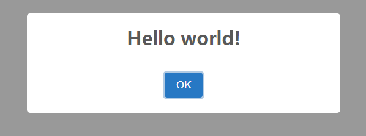
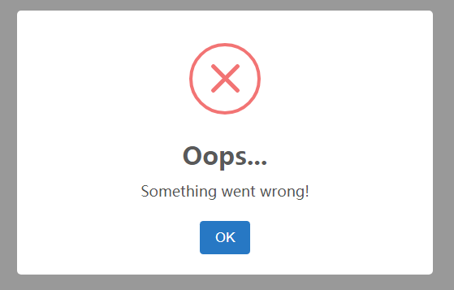

--

sweetalert2是一个漂亮的弹窗js库。

https://github.com/sweetalert2/sweetalert2

# helloworld

下面代码，主体是在vscode里，输入html:5 自动生成的。

```
<!DOCTYPE html>
<html lang="en">
<head>
	<meta charset="UTF-8">
	<meta name="viewport" content="width=device-width, initial-scale=1.0">
	<script src="https://cdn.jsdelivr.net/npm/sweetalert2@10"></script>
	<title>Document</title>
</head>
<body>
	<script>
		Swal.fire('Hello world!')
	</script>
</body>
</html>
```

我加的就2行，

这一行包含脚本。

```
<script src="https://cdn.jsdelivr.net/npm/sweetalert2@10"></script>
```

这一行进行弹窗

```
Swal.fire('Hello world!')
```

可以说非常简单了。

直接浏览器打开本地网页，就可以看到效果如下。



多加几个参数

```
Swal.fire('Oops...', 'Something went wrong!', 'error')
```

参数1：相当于title。

参数2：相当于content。

参数3：相当于类型。




你也可以传递一个对象作为参数

```

Swal.fire({
	title: '标题',
	text: '这里是内容哈哈哈哈哈哈',
	icon:  'warning',
	showCancelButton: true,
	confirmButtonText: '确定~~',
	cancelButtonText: '取消~~'
})
.then((result)=> {
	if(result.value) {
		Swal.fire({
			title: '确定',
			text: '你点了确定',
			icon: 'success'
		})
	} else if(result.dismiss === Swal.DismissReason.cancel) {
		Swal.fire({
			title: '取消',
			text: '你点了取消',
			icon: 'error'
		})
	}

})
```

这个就是基本用法了。够用了。


参考资料

1、

