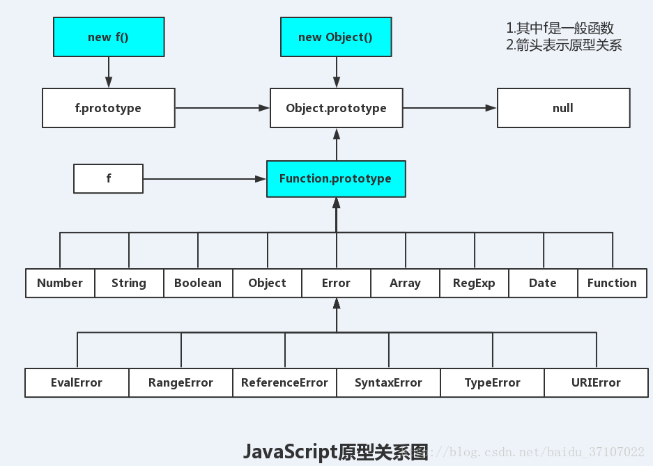

原型链的终点是null。


跟大部分面向对象的语言不同，js里没有引入类的概念。

但是js里大量使用了对象。

为了保证对象之间的联系，js引入了原型和原型链的概念。

在java里，创建一个对象是这么写的：

```
Foo foo = new Foo();
```

为了让js看起来像java，js也引入了new操作符。

```
var foo = new Foo();
```


看一个实例。

```
function Dog(name, color) {
  this.name = name;
  this.color = color;
  this.bark = function() {
    console.log("wangwang~");
  }
}
var dog1 = new Dog("dog1", "black");
var dog2 = new Dog("dog2", "white");
```

我们上面定义2条狗，一个黑的，一个白的。

它的bark方法是一样的。

其实是可以抽取出来的。如果不抽取出来，这样对象就要多占用一部分内存。

所以就引入了原型。

原型叫prototype。

```
对象.__proto__ === 类（函数）.prototype
```


我们提取Dog的原型。

```
function Dog(name, color) {
  this.name = name;
  this.color =color;
}
Dog.prototype.bark = function() {
  console.log("wangwang");
}
```

用原型链实现了继承关系。


js里的继承非常灵活，其中最常用的是组合继承。

```
function Dog(name, color) {
  this.name = name;
  this.color =color;
}
Dog.prototype.bark = function() {
  console.log("wangwang");
}
function Husky(name, color, weight) {
  Dog.call(this, name, color);
  this.weight = weight;
}
Husky.prototype = new Dog();
```


参考资料

1、一张图看透JavaScript原型关系：`__proto__`（对象原型）和prototype（函数原型）

https://blog.csdn.net/baidu_37107022/article/details/72461716

2、三分钟看完JavaScript原型与原型链

https://juejin.im/post/5a94c0de5188257a8929d837

3、如何理解JavaScript的原型和原型链？

http://web.jobbole.com/95606/

