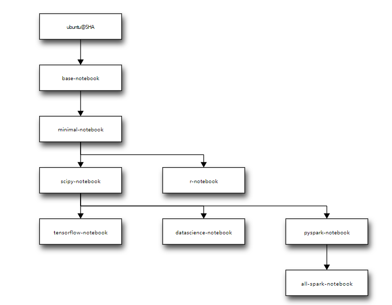

--

经常看到jupyter notebook这个东西。jupyter的字面含义是木星。

具体是用来做什么的呢？

主要是数据分析用的，本质上还是一个基于web的笔记软件。

应该是出报告很方便。

当前对我来说没有什么用。


在我的阿里云服务器上安装一个看看。

```
pip3 install jupyter
```

怎样进行访问呢？


我现在很有使用jupyter的必要，因为我要在一个阿里云服务器上进行python编程。


```
jupyter notebook --generate-config
```

现在访问显示”403 Forbidden“。


算了，放弃这种方式。

我现在就是要远程编辑服务器上的问题。希望可以使用ide来做。

vscode可以自己搭建服务端，然后通过浏览器来进行访问。

安装指定版本的nodejs。

```
sudo apt-get install nodejs
sudo apt-get install npm
sudo npm install npm -g
sudo npm install -g n
sudo n 12.13.1
```

安装yarn。

```
curl -sS https://dl.yarnpkg.com/debian/pubkey.gpg | sudo apt-key add -
echo "deb https://dl.yarnpkg.com/debian/ stable main" | sudo tee /etc/apt/sources.list.d/yarn.list
sudo apt update && sudo apt install yarn
```

安装c++组件。

```
sudo apt-get install libx11-dev libxkbfile-dev
sudo apt-get install libsecret-1-dev
sudo apt-get install fakeroot rpm
```

下载vscode代码到服务器上。

```
git clone https://github.com/microsoft/vscode.git
```

进行build操作。

```
cd vscode
yarn
```

这个需要等比较久。

build失败了。估计是服务器的性能太低了。

算了。也放弃这个。

看看coding的web ide行不行呢？

安装可道云看看。依赖NGINX、php、opcache。

用oneinstack-full这个，可以安装很多的网络包。根据提示选择我们需要的东西就可以了。

```
wget http://mirrors.linuxeye.com/oneinstack-full.tar.gz
```

安装依赖环境花了45分钟。

```
####################Congratulations########################
Total OneinStack Install Time: 45 minutes

Nginx install dir:              /usr/local/nginx

Tomcat install dir:             /usr/local/tomcat

Database install dir:           /usr/local/mysql
Database data dir:              /data/mysql
Database user:                  root
Database password:              XXX

PHP install dir:                /usr/local/php
Opcache Control Panel URL:      http://172.31.5.96/ocp.php

Pure-FTPd install dir:          /usr/local/pureftpd
Create FTP virtual script:      ./pureftpd_vhost.sh

phpMyAdmin dir:                 /data/wwwroot/default/phpMyAdmin
phpMyAdmin Control Panel URL:   http://172.31.5.96/phpMyAdmin

redis install dir:              /usr/local/redis

memcached install dir:          /usr/local/memcached

Index URL:                      http://172.31.5.96/
```

然后提示要重启系统。选择重启。

然后访问服务器ip。会得到界面。

```
Congratulations, OneinStack installed successfully!
OneinStack Linux+Nginx/Tengine+MySQL/MariaDB/Percona
+PHP+Pureftpd+phpMyAdmin+redis+memcached+jemalloc.
```

oneinstack安装的nginx是在usr/local下的。

配置文件有不少的修改。

网页个根目录是在/data/wwwroot/default下面。

把KODEXplorer目录拷贝到/data/wwwroot目录下。修改nginx里的配置根目录到这个目录。

然后就可以访问了。注意是拷贝，软连接的方式，会报403错误。

但是现在访问还是报错：网页上提示。

```
data 目录不存在!

(检查 DATA_PATH);
```

看kod代码目录下的config/config.php里有这样的注释：

```
在config目录下下，新建一个define.php。里面就下写下面这一行代码：
<?php define('DATA_PATH', '/your_data_dir');
```

还是出错。

提示下面的 ，按照这个操作。上面一句是关闭selinux。

```
[Error Code:1002] 目录权限错误！请设置程序目录及所有子目录为读写状态，
linux 运行如下指令：
su -c 'setenforce 0'

chmod -R 777 /data/wwwroot/KODExplorer/
```

这篇文章，提到了这个问题。这个是可道云的bug。

<http://bbs.kodcloud.com/d/547>

解决办法是先换成老版本的。

我用git tag查看。试了几个版本，发现3.46的是可以的。

网页上提示这个。

```
您可以用如下账号登录
管理员：admin/(在下面设置密码)
普通用户：demo/demo
游客用户：guest/guest
```

首先把密码改了。

然后进去就提示我要升级到4.40，升级后正常。

都有带一个桌面环境。体验非常好。


# 重新尝试搭建jupyter

<https://blog.csdn.net/hao5335156/article/details/80691401>

按照这篇文章来做。

有几点要注意的：

1、jupyter默认是用python3。所以在生成密码的时候，要python3进入交互界面来生成。

2、生成的密码，填入到配置文件的时候，要把sha1这个字符串也带上。

3、我的阿里云服务器，试了8080端口。8888端口都不行，我已经开放了对应的端口了的。

换到80端口上正常。

这个是为什么呢？

<https://blog.csdn.net/qq_38454977/article/details/88534776>

用iptables -L 查看一下当前的防火墙配置。

发现确实很多是没有放行的。

改iptables就可以了。

# docker方式安装jupyter

https://hub.docker.com/u/jupyter

https://jupyter-docker-stacks.readthedocs.io/en/latest/using/selecting.html

jupyter有各种stack。

基础的：

base-notebook：

是所有的stack的基础。包括了jupyter notebook server，conda，jupyter hub等package，

minimal-notebook

在base-notebook的基础上，增加了tex live、git、vi、nano、tzdata

r-notebook

集成了R语言的支持。

scipy-notebook

集成了科学计算相关的包。

tensorflow-notebook

集成了TensorFlow

datascience-notebook

pyspark-notebook

all-spark-notebook

层次关系



```
docker run -d -p 8888:8888 jupyter/tensorflow-notebook
```

# 支持C语言

https://blog.csdn.net/weixin_37543731/article/details/99254107

# 参考资料

1、数据分析为什么常用Jupyter而不是直接使用Python脚本或Excel?

https://www.zhihu.com/question/37490497

2、解决jupyter notebook问题：socket.error: [Errno 99] Cannot assign requested address

https://blog.csdn.net/qq_33266320/article/details/80949339

3、

<https://blog.csdn.net/liang890319/article/details/104766436>

4、kodexplorer安装

https://blog.csdn.net/weixin_33704234/article/details/91476964

5、

https://www.zhihu.com/question/59392251