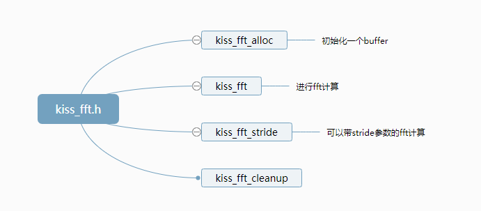

--

还是有必要掌握一个傅里叶变换的库，在tflite-micro里看到了kissfft。似乎是一个简单的库。

学习一下。

代码：

https://github.com/mborgerding/kissfft

kissfft有两套API，
一个是在kiss_fftr.h中

另一个在kiss_fft.h中

Basic API还是kiss_fft.h里的，kiss_fftr.h是在kiss_fft.h的基础上封装了一层。

1. fftAPI和fftrAPI不要混用
2. ifft后的实数结果只能使用nfft长度，而不能使用2*nfft长度。因为数据实际上是来自kiss_fft_cpx的，数据image部分占用了nfft长度，而且都为0.

接口还是很简单的。

代码也不多。就当成黑盒来用就好了。

参考资料

1、【kissfft】使用过程中的一些坑总结

https://blog.csdn.net/mimiduck/article/details/112201132