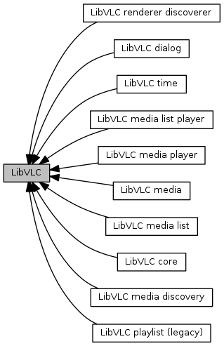

现在要在ffmpeg、gstreamer、libvlc这3个媒体库之中做出一个选择。

希望使用简单，功能够用，占用空间小。

因为我只是用来播放音频而已。希望越小越好。

当然代码也要容易写才好。

ffmpeg和gstreamer都写过。vlc完全没有接触过。

但是看到别人的方案使用了vlc作为播放器的方案，那么看看vlc是否可以满足我的需求 。

目前我是觉得gstreamer，库文件太多，占用空间相对较大。

ffmpeg编写代码非常琐碎，占用空间也比较大。


我先在我的笔记本上进行编译测试。

从rockchip的dl目录下，找到vlc的源码包。这样就不用去网上下载了。

源码包解压开后，有200M。也不少啊。

```
./configure --prefix=/home/teddy/tools/install/vlc --disable-lua
```

我是希望可以看到所有的编译出来的东西，所以指定自己的安装目录。

但是configure出错了。

看到是需要依赖ffmpeg的库。因为vlc的解码库是用的ffmpeg的。vlc专注在播放。

什么情况？如果需要ffmpeg的库，那使用libvlc，优势是什么？

再仔细看了下ffmpeg的库，加起来1M左右。

libvlc的，也是1M左右。

相关插件，4M左右。所有插件一共170个左右。这个规模跟gstreamer差不多了。

那就看看vlc的使用上，是不是比gstreamer要简单了。

```
./configure --prefix=/home/teddy/tools/install/vlc --disable-lua --disable-avcodec  --disable-swscale --disable-a52 
```

鉴于configure错误太多，一时之间难以解决。

我决定使用apt-get的方式进行安装。先学习用法再说。

````
sudo apt-get install libvlc-dev vlc
````

```
#include <vlc/vlc.h>
#include <unistd.h>

int main(int argc, char *argv[])
{
    libvlc_instance_t *inst;
    libvlc_media_player_t *mp;
    libvlc_media_t *m;

    libvlc_time_t length;
    int width;
    int height;
    int wait_time = 5000;

    //libvlc_time_t length;

    /* Load the VLC engine */
    inst = libvlc_new(0, NULL);

    m = libvlc_media_new_path(inst, "1.mp3");

    /* Create a media player playing environement */
    mp = libvlc_media_player_new_from_media(m);

    /* No need to keep the media now */
    libvlc_media_release(m);

    // play the media_player
    libvlc_media_player_play(mp);

    //wait until the tracks are created
    sleep(wait_time);
    length = libvlc_media_player_get_length(mp);
    width = libvlc_video_get_width(mp);
    height = libvlc_video_get_height(mp);
    printf("Stream Duration: %ds\n", length / 1000);
    printf("Resolution: %d x %d\n", width, height);
    //Let it play
    sleep(length - wait_time);

    // Stop playing
    libvlc_media_player_stop(mp);

    // Free the media_player
    libvlc_media_player_release(mp);

    libvlc_release(inst);

    return 0;
}
```

编译：

```
gcc test.c -lvlc
```

可以正常播放mp3文件。

分析一下上面的代码。

```
数据结构
	有3个：
	libvlc_instance_t
		一个libvlc实例。
	libvlc_media_t
		一个媒体文件，例如一个mp3文件。
	libvlc_media_player_t
		代表一个vlc媒体播放器。
		
上面3个结构体的分配和释放函数：
    libvlc_new
    libvlc_media_new_path：path代表打开文件。
    	libvlc_media_new_location:这个是打开协议地址。如果文件用file:///方式，也可以用这个打开。
    	如果是screen://，这个表示录屏。
    libvlc_media_player_new_from_media
    libvlc_media_player_release
    libvlc_media_release
    libvlc_release
操作函数：
	libvlc_media_player_play
	libvlc_media_player_pause
	libvlc_media_palyer_stop
```


vlc的src目录下，只有240个文件左右。不多。




总体来说，我觉得嵌入式上，vlc没有什么优势。
可能在pc上播放器开发，vlc有些用。
vlc相比与我自己用ffmpeg封装简单播放器，就显得比较复杂。
引入了太多我并不需要的东西。
我还得另外学习一套接口的使用。
而且引入的东西还比较复杂。
那我不如用mpd。


参考资料

1、最简单的基于libVLC的例子：最简单的基于libVLC的视频播放器

https://blog.csdn.net/leixiaohua1020/article/details/42363079

2、

https://www.videolan.org/developers/vlc/doc/doxygen/html/modules.html

