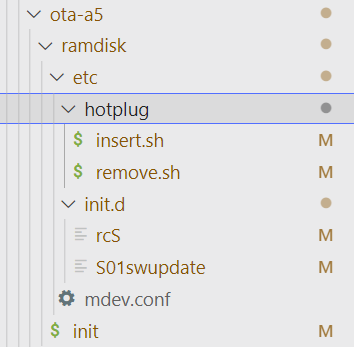

--

为什么需要initrd？

内核里没有编译根文件系统所在的介质的驱动，例如cd-rom。

就需要先用initrd，执行initrd的init进程，然后insmod cd-rom的驱动。挂载cd-rom。

然后切换到cd-rom上的真正文件系统的init上。


主要作用：

1、Linux发行版必备。

因为发行版需要适应各种不同的硬件，把所有的驱动都编译进内核是不现实的。

2、livecd必备。

3、制作Linux usb启动盘必须使用initrd。


**从本质上来说，就是为了应对存储介质的多样性和不确定性。**


initramfs从内核2.5版本才出现。比initrd要晚。

所以initramfs技术上肯定是有所进步的，不然它的出现就没有意义了。

**initramfs的根本上的不同，就是它跟内核被打包成一个文件了。**

该cpio格式的文件被链接进了内核中特殊的数据段.init.ramfs上，其中全局变量`__initramfs_start和__initramfs_end`分别指向这个数据段的起始地址和结束地址。内核启动时会对.init.ramfs段中的数据进行解压，然后使用它作为临时的根文件系统。


**linux对所有文件的读写都会在内存里做缓存，这样效率会高很多。**
ramfs直接利用了linux内核的高速缓存机制，做成一个大小可以动态变化的基于内存的文件系统。ramfs工作在vfs层，不能被格式化，可以创建多个，默认情况下，ramfs最多用到系统内存的一半。可以在编译内核的时候修改。

rootfs是一个特定的ramfs实例，始终存在于系统中，是系统的根。

initrd是一个被压缩过的小型根目录。系统启动时，initrd文件被载入到内存，内核然后把解压后的initrd挂载为根目录。然后执行/init脚本。在/init脚本里，再去挂载真正的根文件系统。
看内核里的代码，大概的流程是这样的。

```
start_kernel-->
	rest_init-->
		kernel_init-->
			kernel_init_freeable
				打开console设备。得到0/1/2这3个fd
				ramdisk_execute_command = "/init";
			执行ramdisk_execute_command
```


我们要得到initramfs的镜像文件，内核目录下的脚本可以完成：

```
./scripts/gen_initramfs_list.sh -o ramfs.gz ../ramfs/  
```

# initrd和initramfs

## 区别

1、原理不同。

initrd利用ramdisk技术，把内存的一部分实现为/dev/ram设备。然后把根目录挂载到/dev/ram上。从原理上讲，是一个真正的rootfs。需要指定在uboot参数里指定root=/dev/ram这样。


2、文件系统上的差异。

**initrd，用ext2格式的文件系统。**

initramfs，使用kernel直接支持的rootfs格式（有这种格式？）的文件系统。

3、initrd从内核2.4版本支持，initramfs从2.6版本开始支持。

## 优缺点

1、initramfs省去了创建/dev/ram、mount文件系统、切换根目录的过程。启动速度会更快。

initramfs处理也更加简单。

2、initramfs使用的是cpio包，会比较大。

# initramfs分类

1、独立文件。

例如我在/boot下可以看到：

```
-rw-r--r-- 1 root root  36M 1月  18 23:16 initrd.img-4.4.0-79-generic
```

2、集成到kernel image里。

靠全局变量`__initramfs_start`来找到。

内核配置需要指定这个：

```
CONFIG_INITRAMFS_SOURCE="/path/to/rootfs/"
```


```
#define INITRD_MINOR 250
```

```
CONFIG_BLK_DEV_INITRD=y
CONFIG_INITRAMFS_SOURCE=""
CONFIG_RD_GZIP=y
```

```
obj-$(CONFIG_BLK_DEV_INITRD)   += initramfs.o
obj-y                          += noinitramfs.o //这个里面就一个函数default_rootfs
```


boot分区自带recovery mode的ramdisk;

system分区包含了Android系统的rootfs;

启动中，如何选择加载boot分区的ramdisk还是system分区的rootfs呢？
答案是由kernel的命令行参数skip_initramfs来决定。

正常启动的时候，skip_initramfs这个是设置了的。

linux调用populate_rootf**s默认会并加载boot分区自带的ramdisk**（recovery），

但如果do_skip_initramfs被设置为1，则会调用default_rootfs生成一个极小的rootfs：

```
static int __init populate_rootfs(void)
{
	char *err;

	if (do_skip_initramfs) {
		if (initrd_start)
			free_initrd();
		return default_rootfs();//生成一个很小的rootfs。
	}
```

default_rootfs 这个函数很简单，就是做了三件事情：

```
1、创建目录/dev。权限755
2、创建节点/dev/console。
3、创建目录/root。权限700
```


# buildroot里使用initramfs

BR2_TARGET_ROOTFS_INITRAMFS

看看rdinit和root在内核中是如何被处理的，

如果bootargs设置了rdinit和root，

那么内核在启动阶段解析并分别赋给ramdisk_execute_command和saved_root_name。

```
static int __init rdinit_setup(char *str)
{
	unsigned int i;

	ramdisk_execute_command = str;
	/* See "auto" comment in init_setup */
	for (i = 1; i < MAX_INIT_ARGS; i++)
		argv_init[i] = NULL;
	return 1;
}
__setup("rdinit=", rdinit_setup);
```

当前S400的板子上的启动命令里有这些。

```
rootfstype=ramfs 
 root=/dev/ubi0_0 rootfstype=ubifs init=/sbin/init
```

从vm[linux](https://so.csdn.net/so/search?from=pc_blog_highlight&q=linux).lds.h文件可知，

ramfs根据CONFIG_BLK_DEV_INITRD定义是否使用。

INIT_RAM_FS存放ramfs相关内容，包括.init.ramfs和.init.ramfs.info两个段。


INITRAMFS_IMAGE从哪里来？需要查看/usr/目录下Makefile。

从Makefile中可知，以CONFIG_INITRAMFS_SOURCE对应的rootfs.cpio文件作为输入，调用gen_init_cpio和gen_initramfs_list.sh生成initramfs_data.cpio.gz文件。

然后INITRAMFS_IMAGE对应，/usr/initramfs_data.cpio$(suffix_y)文件。

最终通过.incbin将INITRAMFS_IMAGE编译到initramfs_data.o文件中，即对应.init.ramfs段。

ramfs作为init数据的一部分，位于`__init_begin和__init_end的末端`，在free_initmem()中被释放。

ramfs是以压缩包的形式存放在`__initramfs_start和__initramfs_size`之间，在kernel_init()-->kernel_init_freeable()-->do_basic_setup()-->populate_rootfs()中调用unpack_to_rootfs()中解压。


rootfs其实不是一种实际的文件系统，他根据实际情况可能使用ramfs或者tmpfs。

这里分析rootfs是如何对应ramfs，并且简单介绍ramfs。

下面来看看rootfs文件系统是如何挂载的？rootfs没有自己的固定类型，或者使用ramfs或者使用tmpfs。


BR2_TARGET_ROOTFS_INITRAMFS_LIST

这个变量在./fs/cpio/cpio.mk里被使用。


内核里有这样一个配置项

```
Initial RAM filesystem and RAM disk (initramfs/initrd) support 
```

在./init/Kconfig

help信息写着：initramfs是一个ramfs，被bootloader载入，在正常的启动流程之前，作为root来挂载。

主要是用来载入必要的模块，从而可以挂载真正的rootfs。

挂载了真正的rootfs后，之前的rootfs被move到一个目录下，然后被卸载掉。

initrd主要用来保持kernel不要编译进太多不需要的驱动，而把更多的驱动放在initrd里。

使用initrd的时候，系统的流程是这样的：

```
1、bootloader载入kernel和initrd。
2、kernel把initrd转成一个ram disk，然后把initrd占用的内存释放掉。
3、如果root device不是/dev/ram0，那么就会执行一个change_root的操作（这个是过时的）
4、如果root device是/dev/ram0，那么initrd就被挂载为root
5、执行/sbin/init。这个init可以是二进制，也可以看是脚本。
6、/sbin/init里，挂载真正的root
7、init使用pivot_root来切换root
8、init执行新的rootfs里的/sbin/init来执行真正的初始化流程。
9、initrd被移除。
```

跟boot相关的bootargs有

```
initrd=path
noinitrd
root=/dev/ram0
```


文档在Documentation/initrd.txt里。

如果同时使能了BLK_DEV_RAM，那么就会使能initrd。

Documentation/early-userspace/README

这个文档也要看看。


一般的来说，使用ramdisk并不是一件好事，

系统自己会更加有效的使用可用的内存；

但是，在启动或者制作启动盘时，

使用ramdisk可以很方便的装载软盘等设备上的映象(尤其是安装程序、启动过程中)，

因为在正真使用物理磁盘之前，必须要加载一些必要的模块，

比如文件系统模块，scsi驱动等

(可以参见我的initrd-x.x.x.img文件分析－制作安装程序不支持的根文件系统)。


# noinitrd

noinitrd

(仅当内核配置了选项 CONFIG_BLK_DEV_RAM和CONFIG_BLK_DEV_INITRD)

现在的内核都可以支持initrd了，

引导进程首先装载内核和一个初始化的ramdisk，

然后内核将initrd转换成普通的ramdisk，

也就是读写模式的根文件系统设备。

然后[linux](https://so.csdn.net/so/search?from=pc_blog_highlight&q=linux)rc执行，然后装载真正的根文件系统，之后ramdisk被卸载，最后执行启动序列，比如/sbin/init。

选项noinitrd告诉内核不执行上面的步骤，

即使内核编译了initrd，

**而是把initrd的数据写到 /dev/initrd，**

只是这是一个一次性的设备。


# load_ramdisk=N

如果N＝1，就加载ramdisk；如果N＝0，就不加载ramdisk；默认值为0。

# root dev

```
enum {
	Root_NFS = MKDEV(UNNAMED_MAJOR, 255),
	Root_RAM0 = MKDEV(RAMDISK_MAJOR, 0),
	Root_RAM1 = MKDEV(RAMDISK_MAJOR, 1),
	Root_FD0 = MKDEV(FLOPPY_MAJOR, 0),
	Root_HDA1 = MKDEV(IDE0_MAJOR, 1),
	Root_HDA2 = MKDEV(IDE0_MAJOR, 2),
	Root_SDA1 = MKDEV(SCSI_DISK0_MAJOR, 1),
	Root_SDA2 = MKDEV(SCSI_DISK0_MAJOR, 2),
	Root_HDC1 = MKDEV(IDE1_MAJOR, 1),
	Root_SR0 = MKDEV(SCSI_CDROM_MAJOR, 0),
};
```


initrd-x.x.x.img首先是一个用gzip压缩的文件，

因为内核里包含解压缩的代码，

这主要是为了制作启动盘，

因为启动盘只有1.44M，这个文件的原始大小

是2.9M左右，压缩后大概3、4百K。

这个文件使用mkinitrd命令产生。


先解压，在mount到某个目录下来查看里面的内容。

还可以查看里面的linuxrc脚本的内容。


buildroot里有这样的配置，默认是选配的

 remount root filesystem read-write during boot


# prepare_namespace

从设备文件路径名到处设备标识符，调用mount_root安装根文件系统

CONFIG_AMLOGIC_MODIFY   amlogic的修改用这个宏来包裹的。

```
void __init prepare_namespace(void)
{
	int is_floppy;
#ifdef CONFIG_AMLOGIC_MODIFY
	dev_t res = 0;
	int wait = 80; /* 8s max wait*/
#endif /* CONFIG_AMLOGIC_MODIFY */
```


# uboot配置使用initramfs

使用initramfs的内核启动参数

不需要”initrd=”和”root=”参数,

但是必须在initramfs中创建/init文件或者修改内核启动最后代码(init文件是软连接，指向什么? init -> bin/busybox，否则内核启动将会失败)

```
使用 initrd的内 核启动参数:
initrd=addr,0x400000 root=/dev/ram rw
```

使用initramfs的内核配置(使用initramfs做根文件系统): 

General setup  —>
[*] Initial RAM filesystem and RAM disk (initramfs/initrd) support
(/rootfs_dir) Initramfs source file(s)  //输入根文件系统的所在目录 


当前S400上是这样的内核配置

```
CONFIG_BLK_DEV_INITRD=y
CONFIG_INITRAMFS_SOURCE=""
```

在buildroot的配置里

```
BR2_TARGET_ROOTFS_INITRAMFS_LIST="board/amlogic/common/initramfs/initramfs-49/ramfslist-32-ubi-release"
BR2_TARGET_ROOTFS_CPIO_UIMAGE=y
```

BR2_TARGET_ROOTFS_INITRAMFS_LIST 为什么没有传递给内核呢？


看一个原始的buildroot的fs/cpio里的内容。

有一个init脚本。内容是这样

```
#!/bin/sh
# devtmpfs does not get automounted for initramfs
/bin/mount -t devtmpfs devtmpfs /dev

# use the /dev/console device node from devtmpfs if possible to not
# confuse glibc's ttyname_r().
# This may fail (E.G. booted with console=), and errors from exec will
# terminate the shell, so use a subshell for the test
if (exec 0</dev/console) 2>/dev/null; then
    exec 0</dev/console
    exec 1>/dev/console
    exec 2>/dev/console
fi

exec /sbin/init "$@"
```

cpio.mk里

```
define ROOTFS_CPIO_CMD
	cd $(TARGET_DIR) && \
	find . \
	| LC_ALL=C sort \
	| cpio $(ROOTFS_CPIO_OPTS) --quiet -o -H newc \
	> $@
endef
```

那就是把target下面的都打包到cpio里去了。

而amlogic的，会有一个blacklist，去掉不需要打包进去的内容。

去掉了大部分独立的可执行文件。去掉了一些动态库。但是我看把C库都去掉了。

这个就有点奇怪了。


这个目录下，有个ramdisk目录

```
buildroot/board/amlogic/common/ota/ramdisk$ tree
.
├── etc
│   ├── hotplug
│   │   ├── insert.sh
│   │   └── remove.sh
│   ├── init.d
│   │   ├── rcS
│   │   └── S01swupdate
│   └── mdev.conf
└── init
```

如果在buildroot里要单独编译得到ramdisk，执行

```
make rootfs-cpio-rebuild
```

就可以了。

```
Image Name:   
Created:      Wed Dec 22 17:24:05 2021
Image Type:   AArch64 Linux RAMDisk Image (uncompressed)
Data Size:    2818665 Bytes = 2752.60 KiB = 2.69 MiB
Load Address: 00000000
Entry Point:  00000000
```


参考资料

1、

https://blog.csdn.net/androidstar_cn/article/details/53165941

# buildroot cpio目录分析

使用initramfs的时候，会使用这个目录下的init脚本。

buildroot默认的fs/cpio/init非常简单：

```
#!/bin/sh
# devtmpfs does not get automounted for initramfs
/bin/mount -t devtmpfs devtmpfs /dev
exec 0</dev/console
exec 1>/dev/console
exec 2>/dev/console
exec /sbin/init "$@"
```

做的事情很简单：

1、挂载devtmpfs。

2、把/dev/console设置为stdin/stdout/stderr。

3、执行/sbin/init，这个就是软链接指向busybox。


cpio目录的配置项很简单，就本质上就是BR2_TARGET_ROOTFS_CPIO（bool类型，选配）和对应的压缩方式。

例如gzip方式：BR2_TARGET_ROOTFS_CPIO_GZIP

生成的命令是：

```
define ROOTFS_CPIO_CMD
	cd $(TARGET_DIR) && find . | cpio $(ROOTFS_CPIO_OPTS) --quiet -o -H newc > $@
endef
```

这个是把target目录都打包成initramfs了。太多了。

看看amlogic对这一块的改进。

增加了recovery的cpio。

用这个变量BR2_TARGET_ROOTFS_INITRAMFS_LIST，控制了cpio打包的文件有哪些，这就避免了打包所有文件的问题。

拷贝生成recovery和ota用途的target目录。

```
cp $(TARGET_DIR) $(TARGET_DIR)_recovery -fr
	cp $(TARGET_DIR) $(TARGET_DIR)_ota -fr
```

把buildroot\board\amlogic\common\ota\ota-a5\ramdisk\这个目录下的文件拷贝到`$(TARGET_DIR)_recovery `

这个ramdisk目录下，没有几个文件。



```
cp $(TOPDIR)/$(BR2_TARGET_ROOTFS_INITRAMFS_LIST) $(HOST_DIR)/bin/ramfslist-recovery
```

这个是把"board/amlogic/mesona5_av400/initramfs/ramfslist-32-ext2"文件拷贝到host目录下。

把buildroot\board\amlogic\common\ota\ota-a5\ramfslist-recovery-need 这个列表文件拷贝到host目录下。

然后打包一次recovery.cpio

```
cd $(TARGET_DIR)_recovery && cat $(HOST_DIR)/bin/ramfslist-recovery | grep -v "^#" | cpio --quiet -o -H newc > $(BINARIES_DIR)/recovery.cpio
```


init里最后这样进行switch_root。

```
#Check if $init exists and is executable
if [[ -x "/mnt/${init}" ]] ; then
    #Unmount all other mounts so that the ram used by
    #the initramfs can be cleared after switch_root
    umount /sys /proc /dev

    #Switch to the new root and execute init
    /bin/mount -t devtmpfs devtmpfs /mnt/dev
    exec 0</mnt/dev/console
    exec 1>/mnt/dev/console
    exec 2>/mnt/dev/console
    exec switch_root -c /dev/console /mnt "${init}"
fi
```

# buildroot/fs/tar

这个目录怎么理解呢？

```
>>>   Generating filesystem image rootfs.cpio
>>>   Generating filesystem image rootfs.ext2
>>>   Generating filesystem image rootfs.tar
```

当前也是有生成的。

mk文件里很简单

```
define ROOTFS_TAR_CMD
	(cd $(TARGET_DIR); find -print0 | LC_ALL=C sort -z | \
		tar $(TAR_OPTS) -cf $@ --null --xattrs-include='*' --no-recursion -T - --numeric-owner)
endef
```

就是打包得到一个tar文件。

当前我们实际上没有使用。


# android boot.img和recovery.img里的ramdisk分析

ramdisk.img会被打包到boot.img和recovery.img中（不是同一个ramdisk.img）.

ramdisk.img中比较重要的文件是"init","init.rc"，

其中init是system/core/init/init.c编译而来，

boot.img中ramdisk里的init.rc位于system/core/init/init.rc,

而recovery.img中ramdisk里的init.rc位于bootable/recovery/etc/init.rc。


kernel加载结束以后第一个进程是执行init，

init会解析init.rc文件，

并起相应的服务。

由此可以知道正常开机和进入recovery模式起的进程是不同的。


下面的代码位于bootable/recovery/etc/init.rc，

由此可知，进入recovery模式后会执行sbin/recovery，

此文件是bootable/recovery/recovery.cpp生成（可查看对应目录的Android.mk查看）。


```
如果命令行设置了skip_initramfs，则do_skip_initramfs会被设置为1。

linux调用populate_rootfs默认会并加载boot分区自带的ramdisk（recovery），但如果do_skip_initramfs被设置为1，则会调用default_rootfs生成一个极小的rootfs：
```

# ramdisk和initrd


# android的ramdisk


U-Boot启动参数：

setenv bootargs "root=/dev/ram rw initrd=0x31800000,16M console=tty0 console=ttySAC0,115200"

我看看我当前的系统


# /dev/console

其实这个就又回到了最为原始的问题，

那就是程序会假设自己的三个描述符(标准输入、标准输出、标准错误)都是可以信赖的，

作为用户态第一个启动的、和内核交互的init程序，

它的标准输入和输出是从哪里来的，如何确定呢？

这里直奔主题了，为什么直接提到init？

是因为如果init的确定了之后，所有派生的子进程直接集成就可以了，

这就是一个责任推诿的过程，

最后总得有个人来完成这个工作，

**这里来完成这个责任链的用户态终点就落在了init身上。**

事实上init也很无辜，

它也是假设自己的三个标准描述符始终是可用的，

所以问题转入内核，看一下内核是如何给init设置描述符的。

```
static int noinline init_post(void)
{
……
    if (sys_open((const char __user *) "/dev/console", O_RDWR, 0) < 0)
        printk(KERN_WARNING "Warning: unable to open an initial console.\n");

    (void) sys_dup(0);
    (void) sys_dup(0);
}
```

这里是打开了文件系统中指定的console设备，

把这个文件描述的设备作为init的文件描述符，

这样实现的优点就是相同的内容，

可以个根据文件系统的不同而订制不同的文件描述符，也就是可配置性强。


遗憾的是，这种设备并不是一个实体设备，同样是一个虚拟设备，也就是它指向了一些东西，

但是从这个设备本身无法确定是什么东西，

和大家常见的“有关部门”是一个性质的。

内核中对于这个设备是有特殊处理的，位于
linux-2.6.21\drivers\char\tty_io.c

为什么说它不确定，

因为它是通过console_device函数来获得系统中可用的一个tty设备驱动，

这个具体值是多少，就要根据内核配置了多少个可以做为控制台的设备，

也就是console_drivers链表中第一个device函数能够返回驱动的那个设备。

当然这里可能太随意了，男人不能说不行，女人不能说随便，所以这个不确定还是有些不妥。

内核为此提供了一个强制设置的方法，

就是通过内核启动参数console=来指定console使用某个确定的控制台，

例如使用第二个串口/dev/ttyS2。

这处理位置位于printk.c-：__setup("console=", console_setup);

这样在register_console中就会为这个console开小灶，让它排在console_drivers链表的最开始。


参考资料

1、

交互shell设置为/dev/console之后提示job control turned off(上)

https://blog.csdn.net/js_xj/article/details/42740471

# buildroot下的fs/initramfs用途

我们的方案，使用了initramfs，但是有好几个点感觉不是很确定。

1、kernel里只使能了INIT DEV

2、没有看到明确使能initramfs。

3、但是kernel/init/Makefile里，init dev的包含了initramfs.c的编译。

看kernel里kconfig里是这么写的说明

```
config BLK_DEV_INITRD
	bool "Initial RAM filesystem and RAM disk (initramfs/initrd) support"
	help
	  The initial RAM filesystem is a ramfs which is loaded by the
	  boot loader (loadlin or lilo) and that is mounted as root
	  before the normal boot procedure. It is typically used to
	  load modules needed to mount the "real" root file system,
	  etc. See <file:Documentation/admin-guide/initrd.rst> for details.

	  If RAM disk support (BLK_DEV_RAM) is also included, this
	  also enables initial RAM disk (initrd) support and adds
	  15 Kbytes (more on some other architectures) to the kernel size.

	  If unsure say Y.
```

BLK_DEV_RAM应该是要这个也使能，才说明使用initrd。

否则表示是initramfs。


# 一篇不错的教程

在早期的Linux系统中，

一般就只有软盘或者硬盘被用来作为Linux的根文件系统，

因此很容易把这些设备的驱动程序集成到内核中。

但是现在根文件系统 可能保存在各种存储设备上，

包括SCSI, SATA, U盘等等。

因此把这些设备驱动程序全部编译到内核中显得不太方便。

在Linux内核模块自动加载机制的介绍中，

我们看到利用udevd可以实现实现内核模 块的自动加载，

**因此我们希望根文件系统的设备驱动程序也能够实现自动加载。**

但是这里有一个矛盾，

udevd是一个可执行文件，在根文件系统被挂载前，是不 可能执行udevd的，

但是如果udevd没有启动，

那就无法自动加载根根据系统设备的驱动程序，

同时也无法在/dev目录下建立相应的设备节点。

为了解 决这个矛盾，于是出现了initrd(boot loader initialized RAM disk)。

initrd是一个被压缩过的小型根目录，

**这个目录中包含了启动阶段中必须的驱动模块，可执行文件和启动脚本。**

**包括上面提到的udevd，**

当 系统启动的时候，booload会把initrd文件读到内存中，然后把initrd的起始地址告诉内核。

**内核在运行过程中会解压initrd，**

**然后把 initrd挂载为根目录，**

**然后执行根目录中的/initrc脚本，**

您可以在这个脚本中运行initrd中的udevd，

让它来自动加载设备驱动程序以及 在/dev目录下建立必要的设备节点。

在udevd自动加载磁盘驱动程序之后，就可以mount真正的根目录，并切换到这个根目录中。

您可以通过下面的方法来制作一个initrd文件。

```
# dd if=/dev/zero of=initrd.img bs=4k count=1024 
# mkfs.ext2 -F initrd.img 
# mount -o loop initrd.img  /mnt 
# cp -r  miniroot/* /mnt 
# umount /mnt 
# gzip -9 initrd.img 
```

通过上面的命令，我们制作了一个4M的initrd，其中miniroot就是一个根目录。

最后我们得到一个名为initrd.img.gz的压缩文件。

利用initrd内核在启动阶段可以顺利的加载设备驱动程序，然而initrd存在以下缺点：

- initrd大小是固定的，例如上面的压缩之前的initrd大小是4M(4k*1024)，假设您的根目录(上例中的miniroot/)总大小仅仅是 1M，它仍然要占用4M的空间。如果您在dd阶段指定大小为1M，后来发现不够用的时候，必须按照上面的步骤重新来一次。
- initrd是一个虚拟的块设备，在上面的例子中，您可是使用fdisk对这个虚拟块设备进行分区。在内核中，对块设备的读写还要经过缓冲区管理模块，也 就是说，当内核读取initrd中的文件内容时，缓冲区管理层会认为下层的块设备速度比较慢，因此会启用预读和缓存功能。这样initrd本身就在内存 中，同时块设备缓冲区管理层还会保存一部分内容。 为了避免上述缺点，于是出现了initramfs，它的作用和initrd类似，您可以使用下面的方法来制作一个initramfs：

```
# find miniroot/ | cpio -c -o > initrd.img 
# gzip initrd.img 
```

这样得到的initrd.img大小是可变的，

它取决于您的小型根目录miniroot/的总大小，

由于首选使用cpio把根目录进行打包，

##  **因此这个initramfs又被称为cpio initrd.** 

在系统启动阶段，

bootload除了从磁盘上机制内核镜像bzImage之外，

还要加载initrd.img.gz，

然后把initrd.img.gz 的起始地址传递给内核。

能不能把这两个文件合二为一呢？

答案是肯定的，

在Linux 2.6的内核中，可以把initrd.img.gz链接到内核文件(ELF格式)的一个特殊的数据段中，这个段的名字为.init.ramfs。

其中全局 变量 `__initramfs_start和__initramfs_end`分别指向这个数据段的起始地址和结束地址。

内核启动时会对.init.ramfs段中的数据进行解压，然后使用它作为临时的根文件系统。

别看这个过程复杂，您只需要在make menuconfig中配置以下选项就可以了：

```
General setup  ---> 
    [*] Initial RAM filesystem and RAM disk (initramfs/initrd) support 
    (../miniroot/)    Initramfs source file(s) 
```

我们当前的配置是这样：

```
[*] Initial RAM filesystem and RAM disk (initramfs/initrd) support
()    Initramfs source file(s)                                    
[*]   Support initial ramdisk/ramfs compressed using gzip     
[*]   Support initial ramdisk/ramfs compressed using LZ4
```

其中../miniroot/就是我们的小型根目录。

这样就只需要一个内核镜像文件就可以了。

 内核在启动过程中，必须对以下几种情况进行处理：

- 如果.init.ramfs数据段大小不为0(initramfs_end - initramfs_start != 0)，就说明这是initrd集成在内核数据段中。并且是cpio的initrd.
- initrd是由bootloader加载到内存中的，这时bootloader会把起始地址和结束地址传递给内核，内核中的全局 initrd_start和initrd_end分别指向initrd的起始地址和结束地址。**现在内核还需要判断这个initrd是新式的cpio格式的 initrd还是旧的initrd.**

#### 临时的根目录rootfs的挂载

首选在内核启动过程，会初始化rootfs文件系统，**rootfs和tmpfs都是内存中的文件系统，其类型为ramfs**. 然后会把这个rootf挂载到根目录。 其代码如下：

```
[start_kernel() -> vfs_caches_init() -> mnt_init()] 
```


#### initrd的解压缩

在start_kernel()的最后，调用rest_init()，rest_init()会建立一个新的内核进程，并在这个内核进程中执行 kernel_init()函数，kernel_init()会调用populate_rootfs()来探测和解压initrd文件。这个函数需要处理 上面的几种initrd的情况。


```
[kernel_init() -> populate_rootfs()]

static int __init populate_rootfs(void)
{
        /* 如果__initramfs_end - __initramfs_start不为0，就说明这是和内核文件集成在一起的cpio的intrd。*/
        char *err = unpack_to_rootfs(__initramfs_start,
                         __initramfs_end - __initramfs_start, 0);
        if (err)
                panic(err);
#ifdef CONFIG_BLK_DEV_INITRD
        /* 如果initrd_start不为0，说明这是由bootloader加载的initrd， 
         * 那么需要进一步判断是cpio格式的initrd，还是老式块设备的initrd。
         */     
        if (initrd_start) {
#ifdef CONFIG_BLK_DEV_RAM
                int fd;
                /* 首先判断是不是cpio格式的initrd，也就是这里说的initramfs。*/
                printk(KERN_INFO "checking if image is initramfs...");

                /* 这里unpack_to_rootfs()的最后一个参数为1，表示check only，不会执行解压缩。*/
                err = unpack_to_rootfs((char *)initrd_start,
                        initrd_end - initrd_start, 1);
                if (!err) {
                        /* 如果是cpio格式的initrd，把它解压到前面挂载的根文件系统上，然后释放initrd占用的内存。*/
                        printk(" it is/n");
                        unpack_to_rootfs((char *)initrd_start,
                                initrd_end - initrd_start, 0);
                        free_initrd();
                        return 0;
                }
                
                /* 如果执行到这里，说明这是旧的块设备格式的initrd。
                 * 那么首先在前面挂载的根目录上创建一个initrd.image文件，
                 * 再把initrd_start到initrd_end的内容写入到/initrd.image中，
                 * 最后释放initrd占用的内存空间(它的副本已经保存到/initrd.image中了。)。
                 */

                printk("it isn't (%s); looks like an initrd/n", err);
                fd = sys_open("/initrd.image", O_WRONLY|O_CREAT, 0700);
                if (fd >= 0) {
                        sys_write(fd, (char *)initrd_start,
                                        initrd_end - initrd_start);
                        sys_close(fd);
                        free_initrd();
                }

        ......
        return 0;
}
rootfs_initcall(populate_rootfs);
```


经过populate_rootfs()函数的处理之后，

如果是cpio格式的initrd，

那么unpack_to_rootfs()函数已经把目录解 压缩到之前mount的根目录上面了。

但是如果是旧的块设备的initrd，

unpack_to_rootfs()函数解压缩后得到的是一个块虚拟的设备 镜像文件/initrd.image，

对于这种情况，还需要进一步处理才能使用。

接下来，kernel_init()就要处理这种情况。


参考资料

https://www.cnblogs.com/sky-heaven/p/13856545.html

# 参考资料

1、《Linux启动过程分析》之区别Initramfs与initrd

https://blog.csdn.net/tankai19880619/article/details/16885615

2、安卓8 Android O 进入recovery判断流程

https://blog.csdn.net/shangyexin/article/details/86565711

3、linux 内核 ramdisk,使用 RAMDISK的参数

https://blog.csdn.net/weixin_33387339/article/details/116642946

4、

https://www.cxybb.com/article/hellfly2000/1940267

5、

https://blog.csdn.net/u010783226/article/details/115752477

6、

https://blog.csdn.net/shangyexin/article/details/86565711

7、ramdisk initrd ramfs initramfs区别与联系

https://www.cnblogs.com/smartjourneys/articles/9515498.html

8、

https://source.android.com/docs/core/architecture/bootloader/partitions/ramdisk-partitions?hl=zh-cn

9、RAMDISK as rootfs

https://sites.google.com/site/myembededlife/Home/s3c2440/ramdisk-as-rootfs