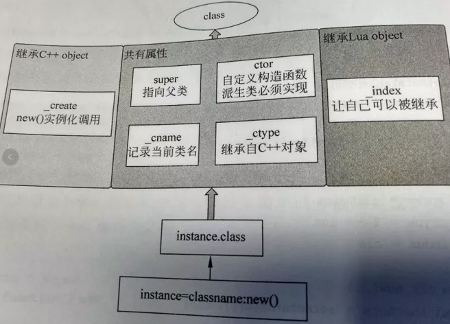

--

Lua的设计初衷并非意图构建完整的应用，

而是嵌入在应用程序中为应用提供灵活的扩展和定制功能，

所以Lua仅提供了基本的数学运算和字符串处理等函数库，

而并未涵盖程序设计的方方面面。

会让你惊讶的是，在面向对象概念已经泛滥的今天，

lua作为新兴脚本语言其甚至没有原生态的提供对面向对象的支持，

说简单点是lua没有class相关的关键字，其也不支持定义一个类，更别提多态了。


不过读者肯定注意到了上面那句话中的“原生态”三个字，

是的，原生态的lua中是没有类这个概念的。

不过lua提供的**table(表)这个强大的数据结构**

却赋予了程序员自行实现一个面向对象意义上的class的能力。

# coco2d-x的实现

先来看看coco2d-x 3.0所给出的官方的class的实现。

```lua
function class(classname, super)
    --superType获取父类类型，可以使nil、function以及table.
    local superType = type(super)
    local cls

    --如果父类既不是函数也不是table则说明父类为空
    if superType ~= "function" and superType ~= "table" then
        superType = nil
        super = nil
    end

    --如果父类的类型是函数或者是C对象
    if superType == "function" or (super and super.__ctype == 1) then
        -- inherited from native C++ Object
        cls = {}

        --如果父类是表则复制成员并且设置这个类的继承信息
        if superType == "table" then
            -- 从父类copy 字段
            print ("superTyper is table");
            for k,v in pairs(super) do cls[k] = v end
            cls.__create = super.__create
            cls.super    = super
        else  --如果是函数类型则设置构造方法并且设置ctor函数
            cls.__create = super
            cls.ctor = function() end
        end

        --设置类型的名称
        cls.__cname = classname
        cls.__ctype = 1

        --定义该类型的创建实例的函数为基类的构造函数后复制到子类实例
        --并且调用子数的ctor方法
        function cls.new(...)
            local instance = cls.__create(...)
            -- copy fields from class to native object
            for k,v in pairs(cls) do instance[k] = v end
            instance.class = cls
            instance:ctor(...)
            return instance
        end

    else
        --如果是继承自普通的lua表,则设置一下原型，并且构造实例后也会调用ctor方法
        -- inherited from Lua Object
        if super then
            cls = {}
            setmetatable(cls, {__index = super})
            cls.super = super
        else
            cls = {ctor = function() end}
        end

        cls.__cname = classname
        cls.__ctype = 2 -- lua
        cls.__index = cls

        function cls.new(...)
            local instance = setmetatable({}, cls)
            instance.class = cls
            instance:ctor(...)
            return instance
        end
    end

    return cls
end
```

创建对象时，可以通过className.new这种方式来创建，如

```lua
local MySpriteClass = class("MySpriteClass",cc.Sprite)

function MySpriteClass:ctor()

end

return MySpriteClass
```

mySpriteClass 实例创建

```
local mySprite = MySpriteClass.new(xxx.png)
```




classname.new()生成的instance包含一个class属性。

class指向了类原型，并具有`super,ctor,__cname和__ctype`  4个属性

继承C++的类，new方法使用`__create`函数来创建实例

继承lua类，new方法使用{ }来创建实例。

继承Lua的类，new方法使用{ }来创建实例。


lua中可以通过修改元表元方法来实现面向对象。

而table中的self相当于this。

lua中的table就是一种对象。

首先，table与对象一样可以拥有状态。

其次，table也与对象一样拥有**一个独立于其值的标识**（一个self）。

最后，table与对象一样具有**独立于创建者和创建地的生命周期**。


UserData(用户自定义类型)

意义：使用C语言编写的用于扩展Lua的新类型，方便使用脚本编写或者提高效率

**userdata：提供了一块原始的内存区域，用于存储任何东西**，在Lua中userdata没有任何预定义操作

生成:`void *lua_newuserdata(L,size) `根据指定大小分配一块内存，并将userdata压入栈中，最后返回这个内存块的地址


类

一个类就像是一个创建对象的模具。**我们可以利用`__index`元方法构造继承。**

当访问一个table中不存在的字段时，得到的结果为nil。

这是对的，但并非完全正确。

实际上，这些访问会促使解释器去查找一个叫`__index`的元方法。

如果没有这个元方法，那么访问结果如前述的为nil。

否则，就由这个元方法来提供最终结果。

在lua中，将`__index`元方法用于继承很普遍，**`__index`还可以是一个table。**


```
__add(a, b) --加法
__sub(a, b) --减法
__mul(a, b) --乘法
__div(a, b) --除法
__mod(a, b) --取模
__pow(a, b) --乘幂
__unm(a) --相反数
__concat(a, b) --连接
__len(a) --长度
__eq(a, b) --相等
__lt(a, b) --小于
__le(a, b) --小于等于
__index(a, b) --索引查询
__newindex(a, b, c) --索引更新（PS：不懂的话，后面会有讲）
__call(a, ...) --执行方法调用
__tostring(a) --字符串输出
__metatable --保护元表
```

# 云风的实现

```lua
local _class={}
function class(super)
    local class_type={}
    class_type.ctor     = false
    class_type.super    = super
    class_type.new      = 
        function(...)
            local obj={}
            do
                local create
                create = function(c,...)
                    if c.super then
                        create(c.super,...)
                    end
                    if c.ctor then
                        c.ctor(obj,...)
                    end
                end

                create(class_type,...)
            end
            setmetatable(obj,{ __index = _class[class_type] })
            return obj
        end
    local vtbl={}
    _class[class_type]=vtbl

    setmetatable(class_type,{__newindex=
        function(t,k,v)
            vtbl[k]=v
        end
    })
    
    if super then
        setmetatable(vtbl,{__index=
            function(t,k)
                local ret=_class[super][k]
                vtbl[k]=ret
                return ret
            end
        })
    end

    return class_type
end
return class
```

把上面文件保存为class.lua。

新建一个test.lua文件。

```lua
local class = require('class')
local base_type = class() -- 定义一个基类

function base_type:ctor(x)
    print("base_type ctor")
    self.x = x
end
function base_type:print_x()
    print(self.x)
end
function base_type:hello()
    print("hello base_type")
end

local test = class(base_type)
function test:ctor()
    print("test ctor")
end

function test:hello() -- 重载了hello函数
    print("hello test")
end

local a = test.new(1)
a:print_x()
a:hello()
```

执行lua test.lua

```
base_type ctor
test ctor
1
hello test
```


# 参考资料

1、lua中面向对象（class）实现探索（一）

https://blog.csdn.net/mywcyfl/article/details/37706085

2、

https://www.cnblogs.com/losophy/p/9521248.html