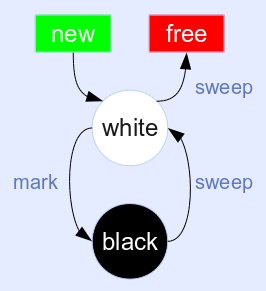
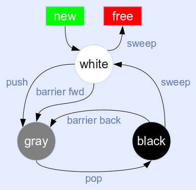

# 基本算法

lua的gc主要是使用了标记-清除（mark-sweep）算法。

从名字就可以看出，这个算法分为2个步骤：

* 标记。这个阶段，lua会从root节点开始遍历所有的对象。标记出所有的可达对象。
* 清除。这个阶段会回收没有被标记的对象。

下图是lua5.1之前采用的gc算法，缺点是gc过程不能被打断，所有会卡住主线程。

三色标记法

https://blog.csdn.net/qq_39124199/article/details/108065929

https://www.cnblogs.com/gangtie/p/12724295.html

# gc算法的改进

为了提高性能，lua从5.1版本开始，使用了增量式标记-清除算法。

这个算法把标记阶段又分为多个步骤。

使得gc可以可以在程序运行的间隙来完成。

这个改进减少了gc对程序运行的影响。

另外，lua还引入了三色标记法。

三色是指：白色、灰色、黑色。

用这三种颜色来表示对象的可回收状态。

## 三色标记法是怎么工作的

1、初始化阶段，所有的对象都是白色的，表示还没有被访问过。

2、标记阶段：从root集合开始（例如全局变量和函数栈里的对象），把这些对象标记为灰色。并且把他们引用的对象也标记为灰色。这个过程会持续到所有可达对象都被标记为灰色。

3、推进阶段：将所有的灰色对象标记为黑色，并将他们引用的对象标记为灰色。这个过程会重复，直到没有灰色对象可以被推进。

4、清理阶段：回收所有的白色对象。因为他们没有被用过。

## 三色标记法的优点

可以在不停止世界（STW）的前提下进行。也就说，gc的时候，程序可以继续运行（而传统的gc，会导致整个程序暂停，对性能有很大的影响）。

## 三色标记法的挑战和改进

如果在垃圾收集的过程中，创建了新的对象，它们可能被错误地标记为白色而被回收。

为了解决这个问题，lua使用了双重白色标记的策略。

新创建的白色，叫做当前白色。

清理阶段，之回收旧白色对象。

https://blog.csdn.net/initphp/article/details/88393885

# 参考资料

1、天工的回答

https://www.tiangong.cn/result/8f354f67-8627-4216-a86b-544b6a1ea369
