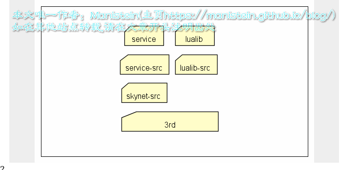
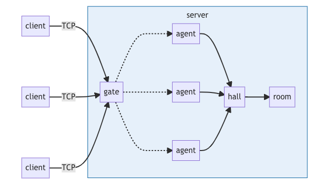
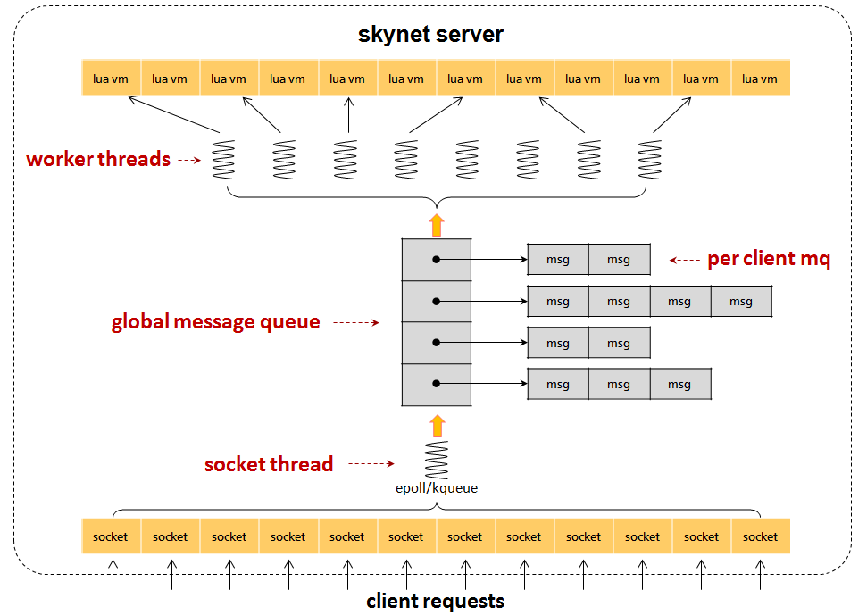
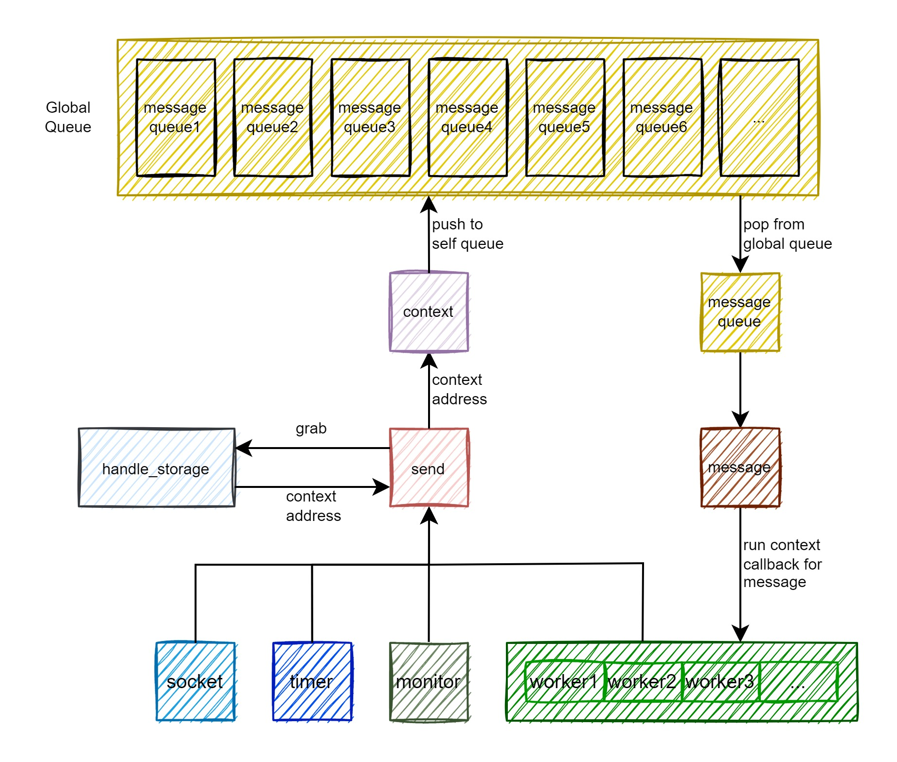

--

# 资源收集

skynet的中文资料确实不少，因为短小精悍，很多人研究，csdn上有很多人有系列文章进行分析的。

官方仓库的wiki还是最权威的。

https://github.com/cloudwu/skynet/wiki/Config

这个系列文章不错

https://www.cnblogs.com/RainRill/category/1144432.html

这篇文章对所有的lua代码的api进行了说明。

https://blog.csdn.net/m0_47428520/article/details/134089733

https://blog.csdn.net/lpl312905509/category_9921716.html


https://manistein.github.io/blog/post/server/skynet/skynet%E6%BA%90%E7%A0%81%E8%B5%8F%E6%9E%90/

这个系列18篇

https://blog.csdn.net/qq769651718/category_7480207.html


https://blog.csdn.net/zxm342698145/category_7547987.html


https://blog.csdn.net/u010601662/category_9902013.html

https://blog.csdn.net/qq_37715776/category_11027557.html


# 理解

我因为不是游戏行业的人，对游戏服务器的逻辑没有什么了解。

但是我看了一个简单的skynet 猜数字游戏后，觉得关键应该就是：

需要让所有的client之间有交互。

这个特性跟我的嵌入式领域的snapcast这个多房间音乐的应用有类似之处。

看看能不能用skynet来实现snapcast的逻辑。


# 简介

先看这个视频教程，有一个初步的了解。

https://www.bilibili.com/video/BV1C3411T7Qt


在之前的skynet目录结构的文章中，也已经提到。

skynet框架用C语言写的部分，主要是为了性能和可靠，

一些基础的服务是通过C语言来编写，

这部分功能不容易发生变动，需要精干的语言去编写实现后，再以后就调用即可。

外面的服务或者库，需要变动，或者开发效率要求较高，则用Lua语言代替。


skynet 是一个为网络游戏服务器设计的轻量框架，采用单进程，多线程架构。

skynet 由一个或多个进程构成，每个进程被称为一个 skynet 节点。

skynet可以形成集群，在配置表中，可以确定一个主节点和其他的副节点，一个进程为一个节点，节点之间的服务，通过消息进行传递。


这个是一个示例代码。

https://github.com/cloudwu/skynet-demo


总的代码还是没有那么复杂的，属于实战派的风格。


这里有个ppt介绍skynet

https://pan.baidu.com/s/1i3qp7b3

基于skynet的聊天室

https://github.com/forthxu/talkbox

# 架构分析



上面的目录基本遵循一个原则，就是上层允许调用下层，而下层不能直接调用上层的api，这样做层次清晰，不会出现你中有我，我中有你的高度耦合的情况存在。c层和lua层耦合的模块则包含在lualib-src中，这种模块划分更利于我们快速寻找对应模块。

大概可以了解skynet_module结构的作用了，也就是说一个符合规范的skynet c服务，应当包含create，init，signal和release四个接口，在该c服务编译成so库以后，在程序中动态加载到skynet_module列表中，这里通过dlopen函数来获取so库的访问句柄，并通过dlsym将so库中对应的函数绑定到函数指针中，

一个C服务，定义以上四个接口时，一定要以文件名作为前缀，然后通过下划线和对应函数连接起来，因为skynet加载的时候，就是通过这种方式去寻找对应函数的地址的，比如一个c服务文件名为logger，那么对应的4个函数名则为logger_create、logger_init、logger_signal、logger_release。


我们创建一个新的服务，首先要先找到对应服务的module，在创建完module实例并完成初始化以后，还需要创建一个skynet_context上下文，并将module实例和module模块和这个context关联起来，最后放置于skynet_context list中，一个个独立的沙盒环境就这样被创建出来了，下面来看主要的数据结构：


# 系列文章

先照着这个系列文章学习一下。

https://blog.csdn.net/qq769651718/category_7480207.html

## 编译代码

先下载代码搭建环境。

git clone了代码。

```
git clone https://github.com/cloudwu/skynet.git
cd skynet
make linux
```

需要clone的方式，因为依赖了一个git submodule，jemalloc。

make的时候，会先去把jemalloc的代码下载。

看了一下Makefile的写法，很简单实用的做法。

用的是gnu99的标准。

## 运行测试

启动example服务端：

```
./skynet ./examples/config
```

然后运行一个测试服务端。

client是lua脚本。我的系统已经安装了lua程序的。

但是当前skynet要求的是lua5.4的。

所以还是用skynet里自带的吧。

```
3rd/lua/lua ./examples/client.lua
```

可以正常连接通信。

## 写一个test.lua

就在examples目录下，新建一个test.lua。

# API分析


一个基于 skynet 框架开发的服务器，是由若干服务构成。

你可以将 skynet 看成一个类似操作系统的东西，

而服务则可以视为操作系统下的进程。

但实际上，单个 skynet 节点仅使用一个操作系统进程，服务间的通讯是在进程内完成的，

所以性能比普通的操作系统进程间通讯要高效的多。

skynet 框架是用 C 语言编写，所以它的服务也是用 C 语言开发。

但框架已经提供了一个叫做 snlua 的用 C 开发的服务模块，

它可以用来解析一段 Lua 脚本来实现业务逻辑。

也就是说，你可以在 skynet 启动任意份 snlua 服务，只是它们承载的 Lua 脚本不同。

这样，我们只使用 Lua 来进行开发就足够了。


**skynet 提供了一个叫做 skynet 的 lua 模块提供给 snlua 服务承载的 Lua 脚本使用。**

你只需要编写一个后缀为 .lua 的脚本文件，把文件名作为启动参数，启动 snlua 即可。（关于脚本路径的配置，见 [Config](https://link.zhihu.com/?target=https%3A//github.com/huanghan/skynet/wiki/Config)）

通常，你需要在脚本的第一行写上：

```c
local skynet = require "skynet"
```

注：skynet 这个模块不能在 skynet 框架之外使用，所以你用标准的 lua 解析器运行包含了 skynet 模块的代码会立即出错。

这是因为，每个 skynet 服务都依赖一个 `skynet_context` 的 C 对象，它是由 snlua 导入到 lua 虚拟机中的。


每个 skynet 服务，最重要的职责就是**处理别的服务发送过来的消息，以及向别的服务发送消息。**

每条 skynet 消息由五个元素构成。

1. **session** ：大部分消息工作在请求回应模式下。即，一个服务向另一个服务发起一个请求，而后收到请求的服务在处理完请求消息后，回复一条消息。session 是由发起请求的服务生成的，对它自己唯一的消息标识。回应方在回应时，将 session 带回。这样发送方才能识别出哪条消息是针对哪条的回应。session 是一个非负整数，当一条消息不需要回应时，按惯例，使用 0 这个特殊的 session 号。session 由 skynet 框架生成管理，通常不需要使用者关心。
2. **source** ：消息源。每个服务都由一个 32bit 整数标识。这个整数可以看成是服务在 skynet 系统中的地址。即使在服务退出后，新启动的服务通常也不会使用已用过的地址（除非发生回绕，但一般间隔时间非常长）。每条收到的消息都携带有 source ，方便在回应的时候可以指定地址。但地址的管理通常由框架完成，用户不用关心。
3. **type** ：消息类别。每个服务可以接收 256 种不同类别的消息。每种类别可以有不同的消息编码格式。有十几种类别是框架保留的，通常也不建议用户定义新的消息类别。因为用户完全可以利用已有的类别，而用具体的消息内容来区分每条具体的含义。框架把这些 type 映射为字符串便于记忆。最常用的消息类别名为 "lua" 广泛用于用 lua 编写的 skynet 服务间的通讯。
4. **messsage** ：消息的 C 指针，在 Lua 层看来是一个 lightuserdata 。框架会隐藏这个细节，最终用户处理的是经过解码过的 lua 对象。只有极少情况，你才需要在 lua 层直接操作这个指针。
5. **size** ：消息的长度。通常和 **message** 一起结合起来使用。


另外，有部分 API 只在搭建框架时用到，普通服务并不会使用。所以这些 API 被抽离出来放在 skynet.manager 模块中。需要使用时，需要先调用：

```c
require "skynet.manager"
```


为了兼容老代码，skynet.manager 共享 skynet 名字空间。require 这个模块后，这些额外的 API 依旧放在 skynet 下。而 `require "skynet.manager"` 的返回值同样是 skynet 名字空间。

这些额外的 API 列在下方，具体的解释放在后续的文字中：

- `skynet.launch` 启动一个 C 服务。
- `skynet.kill` 强行杀掉一个服务。
- `skynet.abort` 退出 skynet 进程。
- `skynet.register` 给自身注册一个名字。
- `skynet.name` 为一个服务命名。
- `skynet.forward_type` 将本服务实现为消息转发器，对一类消息进行转发。
- `skynet.filter` 过滤消息再处理。（注：filter 可以将 type, msg, sz, session, source 五个参数先处理过再返回新的 5 个参数。）
- `skynet.monitor` 给当前 skynet 进程设置一个全局的服务监控。


# 知乎上skynet的帖子

https://www.zhihu.com/topic/21686497/hot

# 开发一个猜数字的游戏

https://blog.csdn.net/Long_xu/article/details/128382106

规则：

满三个人开始游戏，游戏开始后不能退出，直到游戏结束。
系统会随机生成1-100 之间的数字，玩家依次猜规则内的数字。
玩家猜测正确，那么该玩家就输了；如果猜测错误，游戏继续。
直到有玩家猜测成功，游戏结束。



## agent服务接口

agent服务主要是用户。具有如下功能：

1. login：实现登录功能；断线重连。
2. ready：准备，转发到大厅，加入匹配队列。
3. guess：猜测数字，转发到房间。
4. help：列出所有操作说明。
5. quit：退出。

## room服务接口

room服务是一个游戏空间。具有如下功能：

1. start：初始化房间。
2. online：用户上线，如果用户在游戏中，告知游戏进度。
3. offline：用户下线，通知房间内其他用户。
4. guess：猜测数字，推动游戏进程。

## hall服务接口

hall服务类似《斗地主》的大厅。具有如下功能：

1. ready：加入匹配队列。
2. offline：用户掉线，需要从匹配队列移除用户。

## redis服务

用于保存玩家名称、密码、分数、游戏状态等信息。
开启redis服务，redis的键值对、数据结构操作在agent服务进行。

## gate服务接口

gate服务是网关，主要处理网络连接，也是游戏的入口函数文件。具有如下功能：

1. 绑定网络连接，推送信息到agent服务。
2. 进入redis服务。

## 编写skynet的config文件

编写的game代码放在app目录下。

## 游戏演示

（1）服务端：
先启动 redis，然后启动 skynet。

```text
redis-server redis.conf
./skynet/skynet config
```

（2）客户端：使用telnet。

```text
telnet <IP> 8888
```

# shareddata

在游戏开发中，需要用到大量且更新不频繁的配置数据，

而把业务拆分到多个服务后，

各个服务可能只用到其中的少部分数据，

此时每个服务加载所有数据会浪费大量内存。

sharedata模块就是为了解决这种需求设计的，

其原理是：

将共享lua数据存放到一个c结构里，

所有服务都共享这个c结构的内存块，

各个服务可以获取这个共享内存对象，

然后就可以像读取普通lua表一样读取数据。


https://www.cnblogs.com/RainRill/p/9019614.html

# skynet.uniqueservice 和 skynet.register功能区别是什么？

https://github.com/cloudwu/skynet/issues/169

register 是历史遗留物。推荐使用 uniqueservice.
如果谈区别，register 可以在 c 里调用，且不会切换出去。

另外一个不足道的区别，我们曾经因为 uniqueservice 对 service_mgr 的单点依赖，而在大量服务同时启动的时候造成瓶颈。但依旧推荐使用 uniqueservice


https://blog.csdn.net/CSDN_HZW/article/details/137603286

**在 Skynet 中，.service 是一个特殊的服务名称，用于管理服务的启动和销毁。**

这个服务不需要你在业务代码中显式地编写，

而是由 Skynet 框架内部自动管理的。

当你调用 skynet.uniqueservice(global, ...) 函数时，会向 .service 服务发送相应的消息，以请求创建一个新的服务实例。

具体来说：

如果 global 参数为 true，表示创建一个全局唯一的服务实例，那么会向 .service 发送 GLAUNCH 消息，由 .service 服务负责创建并返回一个全局唯一的服务实例。

如果 global 参数不为 true，表示创建一个普通的服务实例，那么会向 .service 发送 LAUNCH 消息，由 .service 服务负责创建并返回一个普通的服务实例。

.service 服务是 Skynet 框架内部的一个重要组成部分，负责管理服务的生命周期、调度和通信等功能。你不需要显式地与 .service 服务进行交互，而是通过 Skynet 提供的 API 接口来进行服务的创建、销毁和通信等操作。


newservice代码：

```
function skynet.newservice(name, ...)
	return skynet.call(".launcher", "lua" , "LAUNCH", "snlua", name, ...)
end
```

在 Skynet 中，.launcher 服务是负责启动新服务实例的组件之一。

当你调用 skynet.newservice(name, ...) 函数时，实际上是向 .launcher 服务发送了一个 LAUNCH 消息，请求启动一个新的服务实例。

具体来说，.launcher 服务接收到 LAUNCH 消息后，会根据指定的服务类型（这里是 "snlua"）和服务名称（name）来启动一个新的服务实例。

在启动新服务实例时，.launcher 服务会与 .service 服务配合工作，确保新服务实例的正常启动。

总的来说，.launcher 服务是 Skynet 框架中的一个重要组件，负责启动新的服务实例，并与 .service 服务配合协同工作，确保服务的正常启动和管理。

在业务代码中，你通常不需要直接与 .launcher 服务进行交互，而是通过 Skynet 提供的 API 接口来启动新的服务实例。

这两个接口都是用来启动一个服务，uniqueservice中是用来启动一个唯一的服务（是否是全局取决于global参数），即使是多次调用并传入相同的参数，也只会有一个唯一的服务实例；

而newservice启动一个服务，多次调用会创建多个服务实例。


# skynet.send()、skynet.call()、skynet.ret()分析

- skynet.send(addr,type,...)  //addr 可以是服务句柄也可以是别名  type消息类型  ... 参数 非阻塞 不需要应答

- skynet.call(addr,type,...) //阻塞 需要应答

- skynet.ret(msg,sz)  //回应消息


https://blog.csdn.net/lpl312905509/article/details/105696327


# skynet 配置中lua服务创建流程

众所周知，skynet必须配置启动脚本，比如说如下配置

```
thread=8
logger=nil
harbor=0
start="main"
lua_path="./skynet/lualib/?.lua;./skynet/lualib/?/init.lua;"
luaservice="./skynet/service/?.lua;./app/?.lua;"
lualoader="./skynet/lualib/loader.lua"
cpath="./skynet/cservice/?.so"
lua_cpath="./skynet/luaclib/?.so"
```

那么 start=“main” 就是skynet启动的第一个业务脚本。

那么这个脚本启动的流程是什么样的呢？

首先需要通过 c服务 snlua去加载 loader.lua 脚本，传递给 loader.lua脚本的参数为 bootstrap。


# skynet任务调度分析

没有做过游戏开发，凭着自己多年做电信服务器软件的经验和一些个人兴趣爱好瞎扯了一些。

电信服务器软件和游戏后台服务器软件有很多相似之处，

但两个领域也有很多重大差异，

可能很多在我看来很重要的问题在游戏开发中实际上无所谓。

skynet已经实际应用了一段时间，具体设计和实现应该都有特定的需求。

还是那句话，软件开发中可以争论对错，不过最终是好是坏还是由实际运行效果决定。

正因为没看到具体的应用场景，这里的总结只是拿一些服务器软件通用的原理姑且推之。


skynet代码中，handle的存取使用了读写锁，任务特定队列的访问使用了自旋锁，全局队列的访问使用了wait-free的免锁设计。

除了handle存取时多读少写，使用读写锁比较合适之外，

任务特定队列和全局队列的调度设计都有待改进。

系统中每处理一个消息时会涉及全局队列的一次出队列和一次入队列，

全局队列的使用非常频繁，

因此看起来wait-free的设计没什么问题。

但仔细分析后会发现，在系统比较繁忙时，wait-free设计会导致部分冲突线程出现没必要的等待。

将全局队列改为线程特定队列，入队列使用自旋锁而出队列不加锁，会提高多核使用效率。

任务特定队列只有一个并发消费者，使用FIFO的队列后，出队列不需要加锁。




https://www.iteye.com/blog/spartan1-2059120

# skynet的harbor是什么

当系统启动的时候，会得到一个提前分配好的节点id，我们称之为harbor id，这个id是集群用的，一个集群内可以启动很多个skynet节点，每个节点都会分配到唯一的id，一个节点（即一个进程）内有很多个服务，服务可以狭义地暂且理解为功能模块。

# handle是做什么的

https://wmf.im/p/skynet%E6%BA%90%E7%A0%81%E5%88%86%E6%9E%90%E5%85%ADhandle%E7%9A%84%E7%AE%A1%E7%90%86/

就是管理所有的skynet_context的。

每个 skynet 进程都有一个全局的 handle 管理器，

会在进程启动时被初始化。

它是个带有读写锁的结构，

因为大部分的操作都是查询操作，所以读写锁保证了查询的效率。

保存 handle的哈希→服务 键值对的 slot 是一个动态数组，不够了会扩容，初始长度是 4，每次扩容会在原长度上翻倍。

name 用来保存全部的 handle 和名字的对应关系，是一个有序的动态数组，按 handle_name 的 name 字段的字符顺序进行排序，初始长度是 2，每次扩容在原长度上翻倍。

```
struct handle_name {
    char *name;
    uint32_t handle;
};

struct handle_storage {
    struct rwlock lock; // 读写锁，因为读取的频率远远高于写入
    uint32_t harbor; // 本节点的 harbor id
    uint32_t handle_index; // 当前的索引值，会累加
    int slot_size; // slot 的长度
    struct skynet_context **slot; // 全部 ctx

    int name_cap; // 名字列表的容量
    int name_count; // 名字列表的总数
    struct handle_name *name; // 保存全部的名字
};

static struct handle_storage *H = NULL;

```

想要查询首先要注册数据。服务在创建的时候会调用 skynet_handle_register 为服务注册一个 handle 并且插入到 slot 中。

| `1 ` | `uint32_t skynet_handle_register(struct skynet_context *ctx)` |
| ---- | ------------------------------------------------------------ |
|      |                                                              |

# skynet和golang的并发比较

https://wmf.im/p/skynet-%E4%B8%8E-golang-%E5%B9%B6%E5%8F%91%E6%9C%BA%E5%88%B6%E6%AF%94%E8%BE%83/

## 这个图对skynet的架构描述太好了



# sknyet_env环境变量

env在skynet的作用是服务间共享的环境变量。常当作配置文件用。

提供的set，get接口，设置值只能是number，string，bool类型。

```
const char * skynet_getenv(const char *key);
void skynet_setenv(const char *key, const char *value);
```

实现原理
用一个lua栈缓存设置的key-value值。

有效范围就是一个skynet进程内部。

不同的skynet进程使用不同的配置文件，生成的env也可以不相同（你可以都用同一份config文件）

# test目录下的运行

也是先执行：

```
./skynet examples/config
```

然后在命令行里执行对应的test的名字就可以了，例如testecho

# config里main和bootstrap关系

bootstrap 是skynet启动的第一个服务(其实是第二个,第一个是logger,不过wiki上说是第一个).这里使用skynet框架中的snlua bootstrap.不需要修改.

**main 是bootstrap结束后启动的用户自定义服务,可以把这个main当做启动项.**

https://blog.csdn.net/qq_14903317/article/details/78866652


standalone = "0.0.0.0:2013"--如果把这个 skynet 进程作为主进程启动（skynet 可以由分布在多台机器上的多个进程构成网络），那么需要配置standalone 这一项，表示这个进程是主节点，它需要开启一个控制中心，监听一个端口，让其它节点接入。


# skynet 网络模块解析

是这些文件，各自的作用如下：

socket_server.h/c

网络连接管理器接口实现（对 skynet 服务透明，至此以下的内容并不依赖 skynet 本身）

socket_epoll.h socket_kqueue.h socket_poll.h

前两个文件是对 socket_poll.h 中声明的接口的实际定义，选择其中一种网络 io 事件通知机制进行搭配编译，epoll 用于 linux，kqueue 用于 mac

skynet_socket.h/c

中间件，提供给 skynet 服务使用的网络接口封装，隐藏了 socket_server 中的接口调用细节。（skynet 服务机制依赖该中间件，该中间件依赖 socket_server。

好处是，中间件提供的接口通常是稳定的，socket_server 内部的细节修改，例如 epoll/kqueue 的切换并不会对 skynet 的服务机制产生任何影响）

https://blog.csdn.net/bo_self_effacing/article/details/131988763


skynet 是可以启动多个节点，不同节点内的服务地址是相互唯一的。

服务地址是一个 32bit 整数，同一进程内的地址的高 8bit 相同。

这 8bit 区分了一个服务处于那个节点。

**每个节点中有一个特殊的服务叫做 harbor (港口) ，**

当一个消息的目的地址的高 8 位和本节点不同时，

消息被投递到 harbor 服务中，

它再通过 tcp 连接传输到目的节点的 harbor 服务中。


不同的 skynet 节点的 harbor 间是如何建立起网络的呢？

这依赖一个叫做 master 的服务。

这个 master 服务可以单独为一个进程，

也可以附属在某一个 skynet 节点内部（默认配置）。

**master 会监听一个端口（在 config 里配置为 standalone 项），**

每个 skynet 节点都会根据 config 中的 master 项去连接 master 。master 再安排不同的 harbor 服务间相互建立连接。

最终一个有 5 个节点的 skynet 网络大致是这样的：

# skynet找文件的过程

我启动skynet，然后随便输入stat，看到是按照这个顺序在查找。

```
stat

[:01000010] LAUNCH snlua stat

[:01000010] lua loader error : ./lualib/loader.lua:24: cannot open ./service/stat.lua: No such file or directory

cannot open ./test/stat.lua: No such file or directory

cannot open ./examples/stat.lua: No such file or directory

cannot open ./test/stat/init.lua: No such file or directory

stack traceback:

​	[C]: in function 'error'

​	./lualib/loader.lua:24: in main chunk

[:01000010] KILL self
```


# master_slave模式

skynet是支持在不同机器上协作的，之间通过TCP互连。

不过有两种模式可以选，

一种是master/slave模式，

一种是cluster模式，

这里说说master/slave模式。

skynet的master/slave模式

是一个master与多个slave的模式，

**master与每个slave相连，**

**每个slave又两两互连。**

master同时会充当一个中心节点的作用，用来协调各个slave的工作。

如果在config中，配置harbor = 0，那么skynet会工作带单节点模式下，其他参数(address、master、standalone)都不用设置。

如果在config中配置 harbor 为1-255中的数字，那么skynet会工作在多节点模式下，如果配置了 standalone， 那么此节点是中心节点。

只要是多节点模式， address 与 master 都需要配置，其中 address 为此节点的地址，供本节点监听， 

master 为外部中心节点的地址，供slave连接(或者供中心节点监听)


在我个人看来,master/slave最大的缺点在于不能很好的处理某个节点异常断开的情况。

但是相比于cluster，它可以依靠一条socket连接便可以在双方自由通信。

所以"官方"建议的是在不跨机房的机器中使用master/slave，在不同机房中或者跨互联网网络中使用cluster。(我觉得即便是不跨机房中，也要考虑异常断开情况，当然skynet有提供监控这种异常的手段，但是不可避免的还有一些额外工作要做。)


https://blog.csdn.net/jinxinliu1/article/details/80499476


# 系列学习

https://blog.csdn.net/qq769651718/category_7480207.html

## helloword

首先在skynet里，把examples/config拷贝一份，改名为myconfig。

把里面的start这个字段改为mytest。

然后在examples目录下新增一个mytest.lua文件。

```
local skynet = require "skynet"
skynet.start(
    function ()
        skynet.error("hello skynet")
    end
)

```

然后运行：

```
./skynet ./examples/myconfig
```

就可以看到下面的打印：

```
teddy@teddydeMacBook-Pro skynet % ./skynet ./examples/myconfig 
[:01000002] LAUNCH snlua bootstrap
[:01000003] LAUNCH snlua launcher
[:01000004] LAUNCH snlua cmaster
[:01000004] master listen socket 0.0.0.0:2013
[:01000005] LAUNCH snlua cslave
[:01000005] slave connect to master 127.0.0.1:2013
[:01000006] LAUNCH harbor 1 16777221
[:01000004] connect from 127.0.0.1:51392 4
[:01000004] Harbor 1 (fd=4) report 127.0.0.1:2526
[:01000005] Waiting for 0 harbors
[:01000005] Shakehand ready
[:01000007] LAUNCH snlua datacenterd
[:01000008] LAUNCH snlua service_mgr
[:01000009] LAUNCH snlua mytest
[:01000009] hello skynet
[:01000002] KILL self
```

## newservice

新建一个testnewservice.lua的文件。

```
local skynet = require "skynet"
skynet.start(function ()
    skynet.error("my new service")
    skynet.newservice("mytest")
    skynet.error("end of start")
end)

```

然后需要启动标准的skynet的example。

```
./skynet ./examples/config
```

这样是启动了examples/main.lua。

然后它的命令行是可以输入的，我们输入testnewservice，就会执行我们上面的testnewservice.lua文件的内容。我们在里面又启动了mytest.lua的内容，所以当前是打印了hello skynet的。

```
[:0100000f] Listen on 0.0.0.0:8888
[:01000009] Watchdog listen on 0.0.0.0:8888
[:01000009] KILL self
[:01000002] KILL self
testnewservice
[:01000010] LAUNCH snlua testnewservice
[:01000010] my new service
[:01000012] LAUNCH snlua mytest
[:01000012] hello skynet
[:01000010] end of start
```

newservice可以多次创建同一个服务。

## uniqueservice

全局唯一的服务等同于单例，即不管调用多少次创建接口，最后都只会创建一个此类型的服务实例，且全局唯一。

写一个testunique.lua文件

```
local skynet = require "skynet"
local args = {...}
if (#args == 0) then
    table.insert(args, "uniqueservice")
end

skynet.start(function ()
    local us 
    skynet.error("test unique service")
    if (#args == 2 and args[1] == "true") then
        us = skynet.uniqueservice(true, args[2])
    else
        us = skynet.uniqueservice(args[1])
    end
    skynet.error("uniqueservice handler:", skynet.address(us))
end)

```

再写一个uniqueservice.lua文件

```

local skynet = require "skynet"
skynet.start(function ()
    skynet.error("this is a uniqueservice")
end)

```

运行：

```
./skynet ./examples/config
```

在命令行里输入：

```
testunique
[:01000010] LAUNCH snlua testunique
[:01000010] test unique service
[:01000012] LAUNCH snlua uniqueservice
[:01000012] this is a uniqueservice
[:01000010] uniqueservice handler: :01000012
testunique
[:01000019] LAUNCH snlua testunique
[:01000019] test unique service
[:01000019] uniqueservice handler: :01000012
```

## queryservice

查询服务是否存在。

## 多节点启动

就是启动多个skynet进程。

开2个shell窗口，分别执行skynet命令就好。

重点是config文件需要改一下。

要一个master节点，多个slave节点的这种模式。

config1：

```
include "config.path"

-- preload = "./examples/preload.lua"   -- run preload.lua before every lua service run
thread = 2 
logger = nil
logpath = "."
harbor = 1      --表示每个节点编号
address = "127.0.0.1:2526"
master = "127.0.0.1:2013"
start = "console"   -- main script 只启动一个console.lua服务
bootstrap = "snlua bootstrap"   -- The service for bootstrap
standalone = "0.0.0.0:2013" --主节点才会用到这个，绑定地址
-- snax_interface_g = "snax_g"
cpath = root.."cservice/?.so"
-- daemon = "./skynet.pid"
```

config2：

```
include "config.path"

-- preload = "./examples/preload.lua"   -- run preload.lua before every lua service run
thread = 2 
logger = nil
logpath = "."
harbor = 2      --编号需要改
address = "127.0.0.1:2527"   --改一个跟config1不同的端口
master = "127.0.0.1:2013"   --主节点地址不变
start = "console"   -- main script
bootstrap = "snlua bootstrap"   -- The service for bootstrap
--standalone = "0.0.0.0:2013" --作为从节点，就注释掉这里
-- snax_interface_g = "snax_g"
cpath = root.."cservice/?.so"
-- daemon = "./skynet.pid"
```

## 服务别名

 每个服务启动之后，都有一个整形数来表示id，也可以使用字符串id来表示，例如：:01000010，其实就是把id：0x01000010转换成字符串。

 但是这个数字的表示方式会根据服务的启动先后顺序而变化，不是一个固定的值。如果想要方便的获取某个服务，那么可以通过给服务设置别名来。

在skynet中，服务别名可以分为两种：

一种是本地别名，本地别名只能在当前skynet节点使用，本地别名必须使用. 开头，例如：.testalias

一种是全局别名，全局别名可以在所有skynet中使用，全局别名不能以. 开头， 例如：testalias

Testalias.lua内容：

```
local skynet = require "skynet"
require "skynet.manager"
local harbor = require "skynet.harbor"

skynet.start(function ()
    local handle = skynet.newservice("mytest")
    skynet.name(".testalias", handle)
    skynet.name("testalias", handle)

    handle = skynet.localname(".testalias")
    skynet.error("localname .testalias handle", skynet.address(handle))
    
end)
```

## 服务调度

```
skynet.sleep(time) //单位是10ms
skynet.fork(func, ...)
skynet.yield()
skynet.wait()
skynet.wakeup(co)
skynet.timeout(time, func)
skynet.starttime()
skynet.now()
skynet.time()
```

testsleep.lua

```
local skynet = require "skynet"
skynet.start(function ()
    skynet.error("before sleep")
    local cur = skynet.now()
    skynet.sleep(300)
    skynet.error("after sleep, use time:", skynet.now()-cur)
end)
```

都通过标准的skynet，然后命令行里testsleep方式来调用测试。

testfork.lua

```
local skynet = require "skynet"

function task(timeout)
    skynet.error("fork co:", coroutine.running())
    skynet.error("begin sleep")
    skynet.sleep(timeout)
    skynet.error("sleep end")
end
skynet.start(function ()
    skynet.error("start co:", coroutine.running())
    skynet.fork(task, 300)
    skynet.error("fork end")
end)
```

可以看到在testfork启动后，consloe服务仍然可以接受终端输入的test，并且启动。

 以后如果遇到需要长时间运行，并且出现阻塞情况，都要使用skynet.fork在创建一个新的线程(协程)。

每次使用skynet.fork其实都是从协程池中获取未被使用的协程，

并把该协程加入到fork队列中，

等待一个消息调度，

然后会依次把fork队列中协程拿出来执行一遍，

执行结束后，会把协程重新丢入协程池中，

这样可以避免重复开启关闭协程的额外开销。

skynet.fork 创建的线程其实通过lua协程来实现的，即一个协程占用执行权后，其他的协程需要等待。

这一点可以通过下面的这个busytask.lua来测试验证。

```
local skynet = require "skynet"

function task(name)
    local i = 0
    skynet.error("name", "begin task")
    while i<100000000 do
        i = i+1
    end
    skynet.error("name", "end task", i)
end

skynet.start(function ()
    skynet.fork(task, "task1")
    skynet.fork(task, "task2")
end)
```

Testyield.lua 

通过使用skynet.yield() 然后同一个服务中的不同线程都可以得到执行权限。

```
local skynet = require "skynet"

function task(name)
    local i = 0
    skynet.error(name, "begin task")
    while i< 10000000 do
        i = i+1
        if i%5000000 == 0 then
            skynet.yield()
            skynet.error(name, "task yield")
        end
    end
    skynet.error(name, "end task", i)
end

skynet.start(function ()
    skynet.fork(task, "task1")
    skynet.fork(task, "task2")
end)
```

Testwakeup.lua

同一个服务的线程可以通过skynet.wait和skynet.wakeup来简单同步。

```
local skynet = require "skynet"
local cos = {}

function task1()
    skynet.error("task1 begin")
    skynet.error("task1 wait")
    skynet.wait()
    skynet.error("task1 end")
end

function task2()
    skynet.error("task2 begin")
    skynet.error("task2 wakeup task1")
    skynet.wakeup(cos[1])
    skynet.error("task2 end")
end

skynet.start(function ()
    cos[1] = skynet.fork(task1)
    cos[2] = skynet.fork(task2)
end)
```

需要注意的是：skynet.wakeup除了能唤醒wait线程，也可以唤醒sleep的线程

testtimeout.lua

skynet中的定时器，其实是通过给定时器线程注册了一个超时时间，并且占用了一个空闲协程，空闲协程也是从协程池中获取，超时后会使用空闲协程来处理超时回调函数。

```
local skynet = require "skynet"

function task()
    skynet.error("task", coroutine.running())
end

skynet.start(function ()
    skynet.error("start", coroutine.running())
    skynet.timeout(300, task)
end)
```


 上面的结果已经很明显了，开了两个协程分别执行task1、task2，task1断言后终止掉当前协程，不会再往下执行，但是task2还是能正常执行。skynet节点也没有挂掉，还是能正常运行。

 那么我们在处理skynet的错误的时候可以大胆的使用assert与error，并不需要关注错误。当然，一个好的服务端，肯定不能一直出现中断掉的协程。

## 本地服务间通信

skynet中的每一个服务都有一个独立的lua虚拟机，逻辑上服务之间是相互隔离的，那么你就不能使用传统意义上的LUA全局变量来进行服务间通信了。

 在skynet中服务之间可以通过skynet消息调度机制来完成通信。skynet中的服务是基于actor模型设计出来的，每个服务都可以接收消息，处理消息，发送应答消息。

 每条 skynet 消息由 6 部分构成：消息类型、session 、发起服务地址 、接收服务地址 、消息 C 指针、消息长度。

在 skynet 中消息分为多种类别，对应的也有不同的编码方式（即协议），消息类型的宏定义可以查看 skynet.h 中：

```
#define PTYPE_TEXT 0   
#define PTYPE_RESPONSE 1    //表示一个回应包
#define PTYPE_MULTICAST 2   //广播消息
#define PTYPE_CLIENT 3      //用来处理网络客户端的请求消息
#define PTYPE_SYSTEM 4      //系统消息
#define PTYPE_HARBOR 5      //跨节点消息
#define PTYPE_SOCKET 6    //套接字消息
#define PTYPE_ERROR 7     //错误消息，一般服务退出的时候会发送error消息给关联的服务
#define PTYPE_QUEUE 8
#define PTYPE_DEBUG 9
#define PTYPE_LUA 10   //lua类型的消息，最常用
#define PTYPE_SNAX 11  //snax服务消息

#define PTYPE_TAG_DONTCOPY 0x10000
#define PTYPE_TAG_ALLOCSESSION 0x20000
```

 上面的消息类型有多种，但是最常用的是PTYPE_LUA，对应到lua层，叫做lua消息 ，大部分服务一般使用这种消息，默认情况下，PTYPE_REPSONSE、PTYPE_ERROR、PTYPE_LUA三种消息类型已经注册（查看源码了解情况），如果想使用其他的消息类型，需要自己显示注册消息 类型。

当我们需要在一个服务中监听指定类型的消息，就需要在服务启动的时候先注册该类型的消息的监听，通常是在服务的入口函数 skynet.start 处通过调用 skynet.dispatch 来注册绑定：

```
--服务启动入口
skynet.start(function()
    --注册"lua"类型消息的回调函数
    skynet.dispatch("lua", function(session, address, ...)
        dosomething(...)
    end)
end)
```

 一旦注册成功，那么只要是发送给这个服务的消息是lua类型消息，那么都会调用我们注册的function进行处理。

例如testluamsg.lua：

## 组播

引入 multicast 模块后，你可以使用 skynet 的组播方案。你可以自由创建一个频道，并可以向其中投递任意消息。频道的订阅者可以收到投递的消息。

 你可以通过 new 函数来创建一个频道对象。你可以创建一个新频道，也可以利用已知的频道 id 绑定一个已有频道。

```
local channel = mc.new()  -- 创建一个频道，成功创建后，channel.channel 是这个频道的 id 。
local channel2 = mc.new {
  channel = channel.channel,  -- 绑定上一个频道
  dispatch = function (channel, source, ...) end,  -- 设置这个频道的消息处理函数
}
```

## socket网络服务

```lua
local socket = require "skynet.socket"

-- 建立一个tcp连接，返回一个数字id
socket.open(address, port)

socket.close(id)
socket.close_fd(id)
socket.shutdown(id)

socket.read(id, sz)
socket.readall(id)
socket.readline(id, sep)
--等待socket变得可读
socket.block(id)

socket.write(id, str)
socket.lwrite(id, str)

socket.listen(address, port)

socket.start(id, accept)

socket.start(id)

socket.abandon(id)

socket.warning(id, callback)

```

### 实现一个echo服务器

socketservice.lua

```
local skynet = require "skynet"
local socket = require "skynet.socket"

function echo(id, addr)
    socket.start(id)
    while true do
        local str = socket.read(id)
        if str then
            skynet.error("recv" .. str)
            socket.write(id, string.upper(str))
        else
            socket.close(id)
            skynet.error("addr" .. " disconnected")
            return
        end
    end
end
function accept(id, addr)
    skynet.error(addr .. " accepted")
    skynet.fork(echo, id, addr)
end
skynet.start(function ()
    local address = "0.0.0.0:8001"
    skynet.error("listen"..address)
    local id = socket.listen(address)
    assert(id)
    socket.start(id, accept)
end)
```

## socketChannel

在与外部服务交互式时，请求回应模式是最常用模式之一。通常的协议设计方式有两种。

每个请求包对应一个回应包，由 TCP 协议保证时序。

发起每个请求时带一个唯一 session 标识，在发送回应时，带上这个标识。这样设计可以不要求每个请求都一定要有回应，且不必遵循先提出的请求先回应的时序。

 对于第一种模式，用 skynet 的 Socket API 很容易实现，但如果在一个 coroutine 中读写一个 socket 的话，由于读的过程是阻塞的，这会导致吞吐量下降（前一个回应没有收到时，无法发送下一个请求，9.8我们就是这么设计的）。

 对于第二种模式，需要用 skynet.fork 开启一个新线程来收取回响应包，并自行和请求对应起来，实现比较繁琐，比如9.9中我们遇到的困惑。

 所以skynet 提供了一个更高层的封装：socket channel。

## 域名查询

在 skynet 的底层，当使用域名而不是 ip 时，由于调用了系统 api getaddrinfo ，有可能阻塞住整个 socket 线程（不仅仅是阻塞当前服务，而是阻塞整个 skynet 节点的网络消息处理）。虽然大多数情况下，我们并不需要向外主动建立连接。但如果你使用了类似 httpc 这样的模块以域名形式向外请求时，一定要关注这个问题。

 skynet 暂时不打算在底层实现非阻塞的域名查询。但提供了一个上层模块来辅助你解决 dns 查询时造成的线程阻塞问题。

local dns = require "skynet.dns"
 在使用前，必须设置 dns 服务器。

dns.server(ip, port) ： port 的默认值为 53 。如果不填写 ip 的话，将从 /etc/resolv.conf 中找到合适的 ip 。

dns.resolve(name, ipv6) : 查询 name 对应的 ip ，如果 ipv6 为 true 则查询 ipv6 地址，默认为 false 。如果查询失败将抛出异常，成功则返回 ip ，以及一张包含有所有 ip 的 table 。

dns.flush() : 默认情况下，模块会根据 TTL 值 cache 查询结果。在查询超时的情况下，也可能返回之前的结果。dns.flush() 可以用来清空 cache 。注意：cache 保存在调用者的服务中，并非针对整个 skynet 进程。所以，推荐写一个独立的 dns 查询服务统一处理 dns 查询。

## snax框架

12 snax框架
 snax 是一个方便 skynet 服务实现的简单框架。（简单是相对于 skynet 的 api 而言）

 使用 snax 服务先要在 Config 中配置 snax 用于路径查找。每个 snax 服务都有一个用于启动服务的名字，推荐按 lua 的模块命名规则，但目前不推荐在服务名中包含"点" （在路径搜索上尚未支持 . 与 / 的替换）。在启动服务时会按查找路径搜索对应的文件。

### Helloworld

simplesnax.lua

```
local skynet = require "skynet"
local snax = require "skynet.snax"

function init(...)
    skynet.error("snax server start", ...)
end

function exit(...)
    skynet.error("snax server stop", ...)
end
```


先进入skynet的命令行。输入：

```
snax simplesnax aa bb cc
[:01000010] LAUNCH snlua snaxd simplesnax
[:01000010] snax server start aa bb cc
```

## 网关服务

 skynet 提供了一个通用模板 lualib/snax/gateserver.lua 来启动一个网关服务器，通过 TCP 连接和客户端交换数据。

 TCP 基于数据流，但一般我们需要以带长度信息的数据包的结构来做数据交换。gateserver 做的就是这个工作，把数据流切割成包的形式转发到可以处理它的地址。

要测试这个，需要写2个lua文件。

先写mygateserver.lua

```
local skynet = require "skynet"
local gateserver = require "snax.gateserver"

local handler = {}

function handler.connect(fd, ipaddr)
    skynet.error("ipaddr:", ipaddr, "fd:", fd, "connect")
    gateserver.openclient(fd)
end
function handler.disconnect(fd)
    skynet.error("fd:", fd, "disconnected")
end
function handler.message(fd, msg, sz)
    skynet.error("recv msg from fd:",fd)
end
gateserver.start(handler)
```

然后写openmygateserver.lua来启动这个服务。

```
local skynet = require "skynet"
skynet.start(function ()
    skynet.error("server start")
    local gateserver = skynet.newservice("mygateserver")
    skynet.call(gateserver, "lua", "open", {
        port = 8002,
        maxclient=64,
        nodelay=true
    })
    skynet.error("gate server setup", 8002)
end)
```

服务启动:

```
openmygateserver
[:01000012] LAUNCH snlua openmygateserver
[:01000012] server start
[:01000019] LAUNCH snlua mygateserver
[:01000019] Listen on 0.0.0.0:8002
[:01000012] gate server setup 8002
[:01000019] ipaddr: 127.0.0.1:55276 fd: 9 connect
[:01000019] fd: 9 disconnected
```

客户端就netcat连接就行。

但是message回调是不会打印的。

因为gateserver对消息格式有要求的，我们随便发的字符串不符合要求，所以回调不会调用。

## 登陆服务

现在的网络游戏大部分是需要登录的，一般会有一个专门的登录服务来处理，登录服务要解决的问题：1、用户登录信息保密工作。2、实际登录点分配工作。

## msgserver

 snax.msgserver 是一个基于消息请求和回应模式的网关服务器模板。它基于 snax.gateserver 定制，可以接收客户端发起的请求数据包，并给出对应的回应。

 和 service/gate.lua 不同，用户在使用它的时候，一个用户的业务处理不基于连接。即，它不把连接建立作为用户登陆、不在连接断开时让用户登出。用户必须显式的登出系统，或是业务逻辑设计的超时机制导致登出。

## http服务

skynet 从 v0.5.0 开始提供了简单的 http 服务器的支持。skynet.httpd 是一个独立于 skynet 的，用于 http 协议解析的库，它本身依赖 socket api 的注入。使用它，你需要把读写 socket 的 API 封装好，注入到里面就可以工作。

 skynet.sockethelper 模块将 skynet 的 Socket API 封装成 skynet.httpd 可以接受的形式：阻塞读写指定的字节数、网络错误以异常形式抛出。


下面是一个简单的范例：testhttpd.lua


# 参考资料

1、

https://zhuanlan.zhihu.com/p/161865024

2、

这里面有张图不错。

https://domicat.me/2020/05/04/learn-skynet-framework/

http://forthxu.com/blog/usr/uploads/2014/07/1456960310.pdf

这篇文章就已经非常全面了。

https://toutiao.io/posts/u045z3/preview