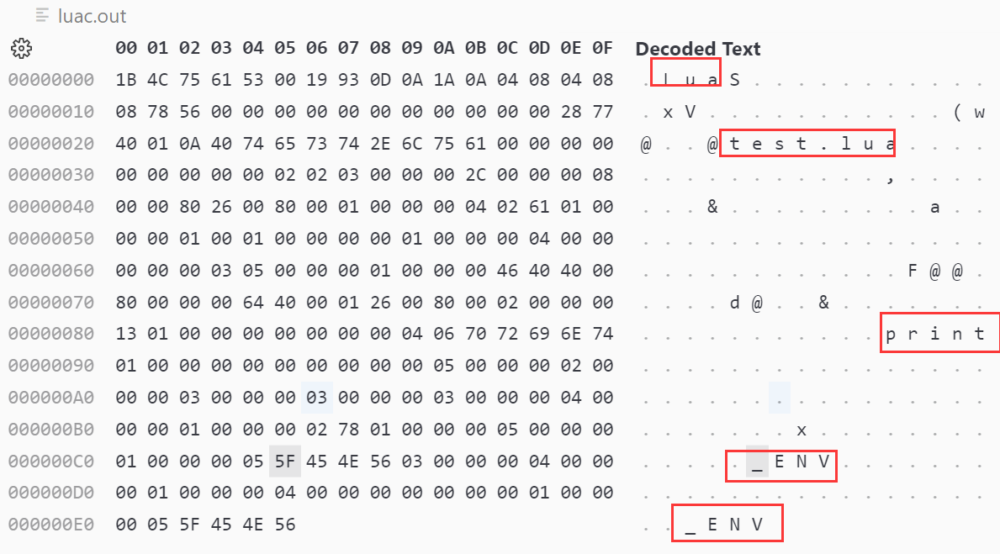

--

**Lua Byte Code加载是不是有以下疑问**

> - 1.Lua字节码由哪几部分组成？
> - 2.脚本源代码对应编译后二进制位置及字节码如何加载？
> - 3.如何来自定义文件格式？

Lua脚本编译二进制Chunk分为：

文件头和函数块。

所以本文主要从文件头检查和函数块填充来探索

编译之后的Lua字节码(opcode)是怎么给加载起来的？

以及二进制如何划分的？

二进制段位分别代表的含义？

是不是也有类似的疑问。

首先我们看如下Lua示例及二进制字节码：

```
function a()
  local x = 1
  print(x)
end
```

直接编译成二进制。

```
luac test.lua
```

不指定输出文件名，则默认生成的二进制文件是luac.out。



下面命令是查看字节码信息。

```
luac -p -l test.lua 
```


```
teddy@teddy-VirtualBox:~/work/test/c-test$ luac -p -l test.lua 

main <test.lua:0,0> (3 instructions at 0x561de072fc90)
0+ params, 2 slots, 1 upvalue, 0 locals, 1 constant, 1 function
        1       [4]     CLOSURE         0 0     ; 0x561de072fe90
        2       [1]     SETTABUP        0 -1 0  ; _ENV "a"
        3       [4]     RETURN          0 1

function <test.lua:1,4> (5 instructions at 0x561de072fe90)
0 params, 3 slots, 1 upvalue, 1 local, 2 constants, 0 functions
        1       [2]     LOADK           0 -1    ; 1
        2       [3]     GETTABUP        1 0 -2  ; _ENV "print"
        3       [3]     MOVE            2 0
        4       [3]     CALL            1 2 1
        5       [4]     RETURN   
```


通过实例并结合源码，将详细介绍Lua二进制文件头和函数块组织结构及对应位的含义。


Lua和其他的高级语言一样，

编译之后会有自己的文件格式来组织二进制数据。

例如Linux中的ELF文件描述格式是由文件头、代码区、全局数据区等组成。

Lua也有自己的文件头格式（文件类型、版本号、格式号、数据块、指令/数值size、Lua 整数/Lua 浮点数）

加载的时候交给虚拟机校验。

二进制块加载逻辑主要函数在lundump.c中luaU_undump函数中， 

我们以lua5.4.3版本为例，

luaU_undump是lua加载阶段f_parser函数如果是二进制文件调用的，文本文件解释部分后续再深入分析，本文接下来重点分析二进制

luaU_undump:


根据上边的代码，我们可以大概知道函数块的内容及加载解释顺序。

 函数块由upvalue大小、文件名、首行/最后行、参数个数、是否有可变参数、最大栈大小、字节码加载、常量加载、上值加载、闭包加载、调试信息加载等部分组成。


# 字节码格式

lua字节码指令是由4个字节32位组成, 

这时32是如何规划的，简单说那些位代表这个指令是 什么，那些位是操作数据，

这里通过一个案例来看看bytecode结构，然后再解释bytecode具 体的结构。


上面的源码生成指令可以看出来，

每一行是一个指令，每一行指令由5部分组成，

分别为： 

指令行号       源码行号             指令           操作数             指令描述 

通过上面的结果我们可以看出来，**每一个lua函数，lua都会生成一段指令块，**该指令块包含该 函数的内容指令。

**值得注意是lua源码会默认生成一个main function，该指令块主要包含lua的 执行过程。**


# 指令分类

四种指令：iABC iABx iAsBx iAx,

代码中定义：enum OpMode {iABC, iABx, iAsBx, iAx}; 

lua所有指令前6位是操作码opcode,

剩下组成部分如下：

```
Instructions can have the following fields:
	`A' : 8 bits
	`B' : 9 bits
	`C' : 9 bits
	'Ax' : 26 bits ('A', 'B', and 'C' together)
	`Bx' : 18 bits (`B' and `C' together)
	`sBx' : signed Bx
```

## 所有指令

这里的指令是5.2.1版本里面所有的指令都定义在lopcode.h头文件中定义，代码如下


# 参考资料

1、Lua字节码文件结构及加载过程

https://www.jianshu.com/p/ee12117b0ee3

2、lua 字节码(bytecode)

https://abaojin.github.io/2017/01/11/lua-vm-bytecode/

