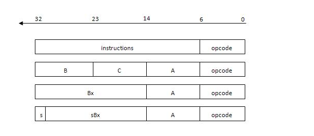

--

**Lua Byte Code加载是不是有以下疑问**

> - 1.Lua字节码由哪几部分组成？
> - 2.脚本源代码对应编译后二进制位置及字节码如何加载？
> - 3.如何来自定义文件格式？

Lua脚本编译二进制Chunk分为：

文件头和函数块。

所以本文主要从文件头检查和函数块填充来探索

编译之后的Lua字节码(opcode)是怎么给加载起来的？

以及二进制如何划分的？

二进制段位分别代表的含义？

是不是也有类似的疑问。

首先我们看如下Lua示例及二进制字节码：

```
function a()
  local x = 1
  print(x)
end
```

直接编译成二进制。

```
luac test.lua
```

不指定输出文件名，则默认生成的二进制文件是luac.out。


下面命令是查看字节码信息。

```
luac -p -l test.lua 
```


```
teddy@teddy-VirtualBox:~/work/test/c-test$ luac -p -l test.lua 

main <test.lua:0,0> (3 instructions at 0x561de072fc90)
0+ params, 2 slots, 1 upvalue, 0 locals, 1 constant, 1 function
        1       [4]     CLOSURE         0 0     ; 0x561de072fe90
        2       [1]     SETTABUP        0 -1 0  ; _ENV "a"
        3       [4]     RETURN          0 1

function <test.lua:1,4> (5 instructions at 0x561de072fe90)
0 params, 3 slots, 1 upvalue, 1 local, 2 constants, 0 functions
        1       [2]     LOADK           0 -1    ; 1
        2       [3]     GETTABUP        1 0 -2  ; _ENV "print"
        3       [3]     MOVE            2 0
        4       [3]     CALL            1 2 1
        5       [4]     RETURN   
```


通过实例并结合源码，将详细介绍Lua二进制文件头和函数块组织结构及对应位的含义。


Lua和其他的高级语言一样，

编译之后会有自己的文件格式来组织二进制数据。

例如Linux中的ELF文件描述格式是由文件头、代码区、全局数据区等组成。

Lua也有自己的文件头格式（文件类型、版本号、格式号、数据块、指令/数值size、Lua 整数/Lua 浮点数）

加载的时候交给虚拟机校验。

二进制块加载逻辑主要函数在lundump.c中luaU_undump函数中， 

我们以lua5.4.3版本为例，

luaU_undump是lua加载阶段f_parser函数如果是二进制文件调用的，文本文件解释部分后续再深入分析，本文接下来重点分析二进制

luaU_undump:


根据上边的代码，我们可以大概知道函数块的内容及加载解释顺序。

 函数块由upvalue大小、文件名、首行/最后行、参数个数、是否有可变参数、最大栈大小、字节码加载、常量加载、上值加载、闭包加载、调试信息加载等部分组成。


# 字节码格式

lua字节码指令是由4个字节32位组成, 

这时32是如何规划的，简单说那些位代表这个指令是 什么，那些位是操作数据，

这里通过一个案例来看看bytecode结构，然后再解释bytecode具 体的结构。


上面的源码生成指令可以看出来，

每一行是一个指令，每一行指令由5部分组成，

分别为： 

指令行号       源码行号             指令           操作数             指令描述 

通过上面的结果我们可以看出来，**每一个lua函数，lua都会生成一段指令块，**该指令块包含该 函数的内容指令。

**值得注意是lua源码会默认生成一个main function，该指令块主要包含lua的 执行过程。**


# 指令分类

四种指令：iABC iABx iAsBx iAx,

代码中定义：enum OpMode {iABC, iABx, iAsBx, iAx}; 

在lua中，用32位的unsigned int类型来表示一条指令操作码，32位值包含了6位的操作码和26位的指令字段两部分内容。

依据上面的枚举值，指令码目前有三种形式，即iABC，iABx，iAsBx，结构图如下：




lua所有指令前6位是操作码opcode,

剩下组成部分如下：（这部分是指令字段）

```
Instructions can have the following fields:
	`A' : 8 bits
	`B' : 9 bits
	`C' : 9 bits
	'Ax' : 26 bits ('A', 'B', and 'C' together)
	`Bx' : 18 bits (`B' and `C' together)
	`sBx' : signed Bx
```

对于指令字段A，B，C，有以下三种形式的取值来源：

```
/*
** R(x) - register
** Kst(x) - constant (in constant table)
** RK(x) == if ISK(x) then Kst(INDEXK(x)) else R(x)
*/
```

其中，用R来表示寄存器值，Kst表示常量表，RK表示可能是常量表或者寄存器。


是的，Lua 使用 6 个 bit 来表示操作码 (opcode)，所以操作码的总数最多是 64 条。这似乎有限，但实际上对于 Lua 语言的需求已经足够。让我们深入了解一下 Lua 虚拟机指令的构成以及为什么 64 条操作码足够用。

**1. Lua 指令格式**

Lua 的指令通常由 32 位组成，其中包含操作码和一些操作数。具体格式如下：

| 名称   | 位数  | 说明                       |
| ------ | ----- | -------------------------- |
| opcode | 6     | 操作码，决定执行的操作     |
| A      | 8     | 第一个操作数，一般是寄存器 |
| B或Bx  | 9或18 | 第二个操作数，寄存器或常量 |
| C或sBx | 9或18 | 第三个操作数，寄存器或常量 |

操作数根据指令类型不同，分为以下几种模式：

- iABC：操作码 + A + B + C
- iABx：操作码 + A + Bx
- iAsBx：操作码 + A + sBx

**2. 为什么 64 条操作码足够用**

Lua 虚拟机指令集设计简洁高效，操作码数量虽然看似有限，但完全可以满足需求。这是因为：

- Lua 是一种高层次脚本语言，不需要大量复杂的底层指令。
- 许多复杂的操作可以通过组合简单指令来实现。
- Lua 指令集经过精心设计，操作码的每一位都被充分利用。

以下是部分常用 Lua 操作码示例：

| 操作码 | 说明                                               |
| ------ | -------------------------------------------------- |
| MOVE   | 将寄存器 A 的值复制到寄存器 B                      |
| LOADK  | 将常量表中的值加载到寄存器 A                       |
| ADD    | 将寄存器 B 和寄存器 C 的值相加，结果存储到寄存器 A |
| JMP    | 跳转到指定位置                                     |
| CALL   | 调用函数                                           |
| RETURN | 返回函数结果                                       |

这些指令已经覆盖了大部分常见操作，满足了 Lua 虚拟机的执行需求。

总之，Lua 通过高效简洁的指令集设计，使用 6 位表示操作码并没有限制其功能，反而使得 Lua 虚拟机更加高效和易于维护。


# lua指令分析举例说明

好的，让我们通过一个具体的例子来分析 Lua 的指令。假设我们有如下简单的 Lua 代码：

```lua
local a = 1
local b = 2
local c = a + b
```

我们可以使用 Lua 的 `luac` 工具来编译这个脚本并使用 `-l` 选项查看生成的字节码指令。假设我们将这个代码保存为 `example.lua`，执行以下命令：

```bash
luac -l example.lua
```

输出可能类似于：

```
main <example.lua:0,0> (7 instructions at 0x1a16080)
0+ params, 3 slots, 1 upvalue, 3 locals, 3 constants, 0 functions
	1	[1]	LOADK    	0 -1	; 1
	2	[2]	LOADK    	1 -2	; 2
	3	[3]	MOVE     	2 0
	4	[3]	ADD      	2 0 1
	5	[3]	MOVE     	3 2
	6	[3]	RETURN   	0 1
```

让我们逐行分析这些指令：

1. **LOADK 0 -1** ：将常量 1 加载到寄存器 0 (`a = 1`)
   - `opcode`: LOADK (操作码)
   - `A`: 0 (寄存器)
   - `Bx`: -1 (常量表中的索引，指向常量 1)
  
2. **LOADK 1 -2** ：将常量 2 加载到寄存器 1 (`b = 2`)
   - `opcode`: LOADK
   - `A`: 1 (寄存器)
   - `Bx`: -2 (常量表中的索引，指向常量 2)
  
3. **MOVE 2 0** ：将寄存器 0 的值复制到寄存器 2 (`c = a`)
   - `opcode`: MOVE
   - `A`: 2 (目标寄存器)
   - `B`: 0 (源寄存器)
  
4. **ADD 2 0 1** ：将寄存器 0 和寄存器 1 的值相加，结果存储到寄存器 2 (`c = a + b`)
   - `opcode`: ADD
   - `A`: 2 (目标寄存器)
   - `B`: 0 (第一个操作数寄存器)
   - `C`: 1 (第二个操作数寄存器)
  
5. **MOVE 3 2** ：将寄存器 2 的值复制到寄存器 3 (实际上在这个例子中多余)
   - `opcode`: MOVE
   - `A`: 3 (目标寄存器)
   - `B`: 2 (源寄存器)
  
6. **RETURN 0 1** ：从函数返回，寄存器 0 保存返回值
   - `opcode`: RETURN
   - `A`: 0 (返回值的寄存器)
   - `B`: 1 (返回值的数量)

这些指令完成了以下操作：

1. 将常量 1 加载到寄存器 `a`。
2. 将常量 2 加载到寄存器 `b`。
3. 将寄存器 `a` 的值复制到 `c`。
4. 将 `a` 和 `b` 相加，结果存储到 `c`。
5. 返回值 (无具体返回值，这里为结束函数执行)。

通过分析这些指令，我们可以看到 Lua 虚拟机是如何高效地执行简单的 Lua 代码的。这些指令充分利用了寄存器和常量表，使得操作尽可能简洁和高效。


# 参考资料

1、Lua字节码文件结构及加载过程

https://www.jianshu.com/p/ee12117b0ee3

2、lua 字节码(bytecode)

https://abaojin.github.io/2017/01/11/lua-vm-bytecode/

