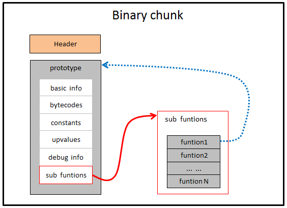

为了达到较高的执行效率，lua代码并不是直接被解释器执行的。

而是会先编译为字节码，然后再交给虚拟机运行。

lua代码成为chunk。

编译为字节码后，则叫做二进制chunk。

lua解释器可以直接执行lua代码，内部的虚拟机会自动先将它编译为字节码。

你也可以先用luac把lua代码编译为字节码，然后lua运行编译的字节码文件。

luac也还可以把字节码文件反编译为lua文件。用来分析。

常用的命令如下：

```
lua test.lua // 直接执行lua文件。
luac -o test.out test1.lua test2.lua //把多个lua文件编译为字节码文件。
lua -s -o test.out test.lua // 这个是编译时去掉调试符号。
luac -p test1.lua test2.lua //只是对lua文件进行语法检测。
```

luac是以函数为单位进行编译的。

每个函数对应一个prototype结构。下面简称proto。

proto包括6个部分：

1、函数基本信息。basic info。

2、字节码。

3、常量表。

4、upvalue表。

5、调试信息。debug info。

6、子函数原型列表。sub functions。



lua文件里的代码，可以没有一个包裹的函数。

因为lua在编译的时候，会把整个文件放到一个叫main的函数里。

并把main作为入口。

现在我们的hello.lua代码是这样：

```
print("hello")

function add(a,b)
	return a+b
end
```

用luac编译得到hello.out文件

```
luac -o hello.out hello.lua
```

为了跟文章的一致，我下载lua的git仓库。

然后切换到v5.3.5的tag上。

```
git clone https://github.com/lua/lua
cd lua
git checkout v5.3.5
make 
```

我当前是在macos下进行的编译。

makefile有个小错误。没有clang-3.8，改为clang就可以正常编译。

但是我发现很奇怪的现象，我的这份代码就是没有luac.c的文件。

也无法编译出来。

我到官网下载5.3.5的代码压缩包看看。

官网下载的代码还真不一样。

目录层次都不一样。这个就是有luac的。

```
make macosx
```

不用改东西，很顺利编译出来了。

```
./luac -o hello.out hello.lua
```


然后vscode安装hex编辑插件。

打开hello.out文件。

二进制chunk的格式并没有标准化。

也没有官方文档进行说明。

一切都要以代码为准。

二进制chunk也没有考虑跨平台的。

所以它的大小端是跟你的编译运行平台相关的。

二进制chunk也没有考虑版本兼容性的问题。

发现版本不匹配，就拒绝加载。

另外，二进制chunk也没用考虑紧凑性。

甚至于一段lua代码的二进制chunk比源代码还要大。

二进制chunk主要是为了速度考虑，体积不是重点。

关于二进制chunk头部的解释：

```
4个字节的签名：0x1B 第一个字节是esc的ascii码。
	紧接着的3个字节是Lua的ASCII码。
然后是一个字节的版本号。例如当前是0x53
然后是一个字节的格式号。当前是0x00
然后是6个字节的luacData。
	2个字节的0x1993，这个是lua1.0的发布年份。
	然后的4个字节依次是：0x0d（回车）、0x0a（换行）、0x1a（替换符）、0x0a（另一个换行符）
cintSize  0x04 表示int类型的size
sizeSize  0x08  表示size_t的size
instructionSize  0x04 
luaIntegerSize   0x08
luaNumberSize   0x08
luacInt    8个字节，表示一个int64，用来检测大小端。
luacNum    8个字节，一个float64，格式号
```


在 Lua 虚拟机中，Lua 字节码指令通过操作码（opcode）来定义每个指令的行为。每个操作码可以有多个参数，这些参数的使用方式由特定的标志（opArgN, opArgR, opArgK）定义。具体来说：

- `opArgN` (No argument): 参数未使用。
- `opArgR` (Register): 参数表示一个寄存器。
- `opArgK` (Constant or register): 参数可以表示一个常量或一个寄存器。

每个 Lua 字节码指令都有三个参数：A、B、C。标志定义了这些参数在指令中的角色。

举个例子，以 Lua 5.3 的指令集为例：

```c
#define OPABC(opcode,A,B,C) ((OpCode)(opcode<<6) | ((A) << 23) | ((B) << 9) | (C))
#define OPABx(opcode,A,Bx)  ((OpCode)(opcode<<6) | ((A) << 23) | ((Bx)<< 9))
#define OPAsBx(opcode,A,sBx) ((OpCode)(opcode<<6) | ((A) << 23) | (((sBx)+MAXARG_sBx) << 9))
```

这些宏定义了不同类型指令的编码方式。指令类型的定义会影响如何解释参数 B 和 C。

下面是一些具体指令的示例：

1. **MOVE指令**

   `MOVE A, B`

   将寄存器 R(B) 的值赋值给寄存器 R(A)。

   - `A` 和 `B` 都表示寄存器，所以参数类型是 `opArgR`。

2. **LOADK指令**

   `LOADK A, Bx`

   将常量 K(Bx) 的值赋值给寄存器 R(A)。

   - `A` 表示寄存器，所以参数类型是 `opArgR`。
   - `Bx` 表示常量，所以参数类型是 `opArgK`。

3. **LOADBOOL指令**

   `LOADBOOL A, B, C`

   将布尔值 B 放入寄存器 R(A)，如果 C 非零，则跳过下一条指令。

   - `A` 和 `B` 表示寄存器或布尔值，类型是 `opArgR` 或 `opArgN`。
   - `C` 未使用，所以类型是 `opArgN`。

这些参数类型在 `lopcodes.h` 文件中定义，如下所示：

```c
typedef enum {
  iABC, iABx, iAsBx, iAx
} OpMode;

#define opmode(m,b,c,mode) (((m)<<3) | ((b)<<2) | ((c)<<1) | (mode))

#define OpModeInfo \
  opmode(0, opArgR, opArgN, iABC) /* OP_MOVE */ \
  opmode(0, opArgK, opArgN, iABx) /* OP_LOADK */ \
  opmode(0, opArgR, opArgN, iABC) /* OP_LOADBOOL */ \
```

| 参数类型 | 描述                     |
| -------- | ------------------------ |
| `opArgN` | 参数未使用               |
| `opArgR` | 参数表示一个寄存器       |
| `opArgK` | 参数表示一个常量或寄存器 |

这些标志帮助 Lua 虚拟机在执行字节码时正确地解释指令参数，从而实现正确的指令操作。

希望这些信息对你理解 Lua 字节码的参数类型有所帮助！如果有更多具体问题，欢迎继续提问。

# 参考资料

1、深入理解Lua虚拟机

这篇非常好。很全面了。

https://www.cnblogs.com/kekec/p/11768935.html
