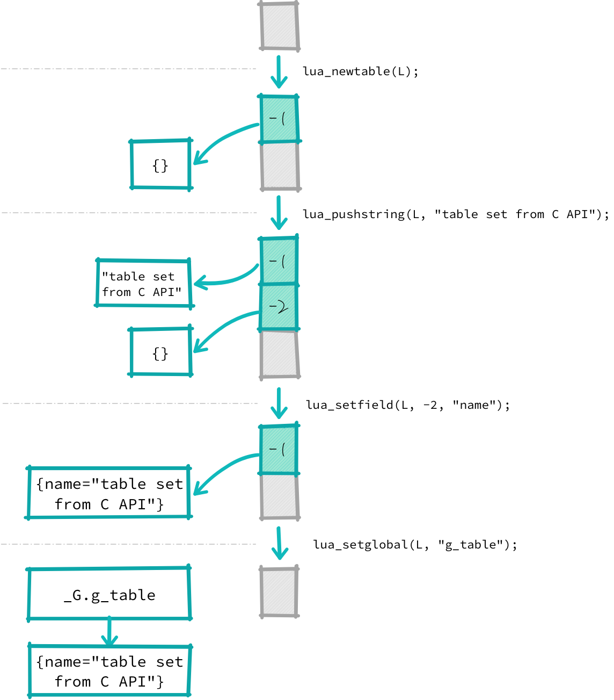

--

# 最好的内容

## 构建Lua解释器系列文章

这个系列写得很有深度很有价值，值得花上几个月的时候仔细研读。

https://manistein.github.io/blog/post/program/build-a-lua-interpreter/%E6%9E%84%E5%BB%BAlua%E8%A7%A3%E9%87%8A%E5%99%A8part1/

## lua细节

https://www.zhyingkun.com/markdown/luadetail/

这个作者的网站的文章可以都看看。

这个作者画图水平也是很高的。

lua知识点整理

https://www.drflower.top/posts/43f53d35/


# 对我比较有价值的学习代码

lite，一个lua写的编辑器。C负责渲染的性能部分，其余部分由lua实现。架构很好值得学习。实现了一套面向对象的写法。主要代码在lua。

https://github.com/rxi/lite/

distri.lua，一个网络通信框架。国人写的。我觉得不错。C代码和lua都一样多。是混合编程的学习材料。

https://github.com/sniperHW/distri.lua

这个也是极好的。一个国人写的web框架，资料齐全。重点学习这个。

https://github.com/cfadmin-cn/cfadmin

# 书籍

## 《Program in lua》

中文版叫《lua程序设计》

这里有在线版本。官方授权的。但是时间是2005年。针对的是lua5.0

https://www.centoschina.cn/uploads/file/20130903/13781389409335.pdf

这里有第四版的。2016年出版的，基于lua5.3

https://github.com/aisuhua/Books-2/blob/master/Programming.in.Lua%E7%AC%AC%E5%9B%9B%E7%89%88.pdf

云风《游戏之旅：我的编程感悟》。有关于lua的章节。

https://github.com/aisuhua/Books-2/blob/master/%E6%B8%B8%E6%88%8F%E4%B9%8B%E6%97%85-%E6%88%91%E7%9A%84%E7%BC%96%E7%A8%8B%E6%84%9F%E6%82%9F%20%E4%BA%91%E9%A3%8E%E8%91%97%20414%E9%A1%B5%2037.5M%20%E9%AB%98%E6%B8%85%E4%B9%A6%E7%AD%BE%E7%89%88.pdf

lua源码鉴赏，云风写的，基于lua5.2

https://github.com/aisuhua/Books-2/blob/master/lua%20%E6%BA%90%E7%A0%81%E9%89%B4%E8%B5%8F.pdf

## lua5.3参考手册

这个是云风大佬翻译的。

值得仔细研读。

https://www.runoob.com/manual/lua53doc/


这个手册更好一些，更加详细。

https://wizardforcel.gitbooks.io/lua-doc/content/6.html

# 网站

## lua-users

http://lua-users.org/wiki/

# 代码

## core_framework

这个是国人写的一个基于lua的web开发框架。

文档很齐全。作者的兴趣点跟我的很接近。很多东西值得学习。值得作为我学习lua的重点。

基于libev的。

而且项目具有实用性。

作者：

https://github.com/candymi

项目文档：

https://doc.cfadmin.cn/library/process.html

项目代码：

https://github.com/cfadmin-cn/cfadmin

作者qq群：

727531854


## lua本身的源代码

下面的test可以看看。


## lua写的lua repl

https://github.com/hoelzro/lua-repl

## 30log

https://github.com/Yonaba/30log

这个是一个30行lua代码实现的lua面向对象编程框架。

最开始版本是30行。后面不只了。

## lua和c混合编程

https://github.com/klgraham/lua-c-embedding

## binding to lua

http://lua-users.org/wiki/BindingCodeToLua

## 游戏

### 三国杀？

https://github.com/BeginnerSlob/TouhouTripleSha

### 饥荒

https://zhuanlan.zhihu.com/p/76494782


## distri.lua

https://github.com/sniperHW/distri.lua

这个仓库看起来不错。具体用途是什么？

https://github.com/sniperHW/distri.lua/blob/master/doc/tutorial.md 这里有写。

distri.lua是一个轻量级的lua网络应用框架,其主要设计目标是使用lua语言快速开发小型的分布式系统,网络游戏服务端程序,web应用等.

但是2015年就没有更新了。

使用的lua是5.3版本。代码还是可以读一下的。

## doitian的github

这里有几个实用的lua库，值得学习一下。作者是做游戏开发的。我是从他的一篇讲lua C API调用的文章找到他的github的。

https://github.com/doitian/lua-xi

## nodemcu

这里有很多实用的代码。

https://github.com/nodemcu/nodemcu-firmware


# lua-bindings

https://github.com/topics/lua-bindings

我关注其中的C语言的部分。

发现有libuv、curl、mosquitto、libmodbus、libusb等的绑定。

而且这些绑定库有个特点，就名字喜欢加一个moon的前缀。

以为lua在葡萄牙语里就是月亮的意思。

这是libevent的luabinding。

https://github.com/harningt/luaevent/


http://lua-users.org/wiki/LuaAddonsArchive


https://github.com/orangeduck/LuaAutoC

# 教程

lua脚本实战（这个至少让我知道在nginx这个场景lua是如何发挥作用的）

https://www.bilibili.com/video/BV1U54y1z7AH

skynet讲解

https://www.bilibili.com/video/BV1C3411T7Qt

## 这个不错，不是照本宣科

https://www.kancloud.cn/thinkphp/lua-guide/43811


# 思考文章

## Lua 为什么在游戏编程领域被广泛运用？

https://www.zhihu.com/question/21717567

## lua跟c++绑定

这篇文章非常好。

https://www.cnblogs.com/liao0001/p/9791087.html


公司主要用 skynet 和 cocos2d-x Lua 来开发游戏。两者都采用了嵌入 Lua 来开发。因为性能，要和原生代码交互等原因，需要在 Lua 和其它语言之间进行交互。最近做了挺多这样的工作，积累了一些心得，会陆续总结分享出来。


上面代码要求使用至少 Lua 5.1，否则 `luaL_newstate` 需要改成 `lua_open`, `luaL_openlibs` 要拆成单独的各个标准库加载方法比如 `luaopen_io`。

使用栈要注意，谁负责压入就要负责弹出，很多 Lua C API 出现错误都是栈操作不当引起的。

查看 C API 的文档重要一部分就是查看其对栈操作的约定。 以设置全局变量的 API `lua_setglobal` 为例

> ```
> void lua_setglobal (lua_State *L, const char *name);
> ```
>
> Pops a value from the stack and sets it as the new value of global name.

执行该方法需要把全局变量的值压入栈，**调用成功后会被自动弹出**。下面是使用的例子，注释中是等价的 Lua 代码。完整代码点击文件名查看。

下面的图片画得很好。很清晰明白。



上面的例子用到了 integer, float, boolean, string, table 等数据类型。Lua 和 C 之间还可以通过函数互调来共享逻辑。

C 中调用 Lua 方法或者其它 C 模块定义的方法可以使用 `lua_call` 或者 `lua_pcall`。

调用的栈约定是一致的，先把要调用的函数入栈，然后按顺序从第 1 个参数开始压入栈，有多个参数的话这个时候栈顶应该是最后一个参数。

然后使用 `lua_call` 或者 `lua_pcall`。

需要手动指定参数的个数和要保留的返回结果的个数。

和在 Lua 中方法调用相同，指定的个数小于实际返回结果个数的话，多余的被丢弃，指定的个数多于实际个数的话，多出来的赋值 nil。

**调用的函数没有出现错误的话，结果是一致的，函数和所有参数被弹出栈，指定数量的返回结果被依次压入栈，也就是最后一个返回结果会在栈顶。**


这篇文章的作者的github。

https://github.com/doitian


参考资料

https://blog.iany.me/zh/2017/02/lua-c-api-intro/

代码在这里：

https://doitian.coding.net/public/lua-c-api-intro/lua-c-api-intro/git/files

## 热更新

https://blog.gotocoding.com/archives/tag/lua-2

# 使用场景

## 作配置文件，取代xml、ini

哈哈，这个感觉有点大材小用了。

不过也确实可以。

不仅仅作为扩展脚本，也可以作为普通的配置文件，
代替XML,Ini等文件格式，并且更容易理解和维护。

但是从例子看，并不好用。远不及json方便直观。

感觉C和lua混合编程总是在输入栈顶的位置。这个不是很烦人，且容易搞错吗？

https://blog.csdn.net/losophy/article/details/9003473

# 大型项目

这个网关项目

https://github.com/Kong/kong

Love2D