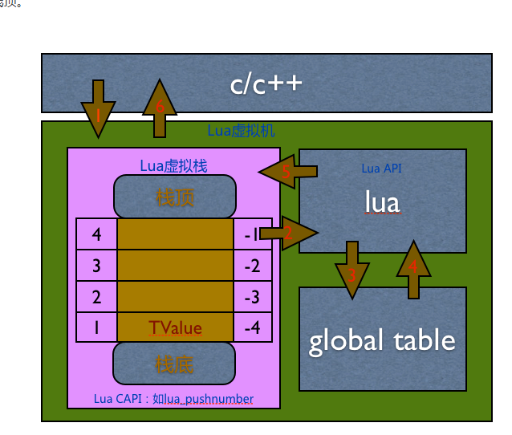

--

现在决定投入精力把lua掌握。

基础语法没有什么可看的。就从实际应用入手。

2个方向：

1、lua web开发。

2、lua gui开发。


做这一切之前，先搭建环境。

lua有没有官方的包管理机制？

先在ubuntu下安装lua吧。

提供了3个版本：5.1、5.2、5.3

那当然用最新的。

```
sudo apt install lua5.3 
```

那么这3个版本有什么明显的区别没有？

# 资源收集

H7 TOOL的方案，这个就是单片机加lua的方式，做得很强大。写法也很朴实。

这个是风格比较现代化的lua文档网站。

https://luavel.com/docs/


# lua发展历史

Lua 是一种轻量级、高效的脚本语言，最初由巴西里约热内卢天主教大学（Pontifical Catholic University of Rio de Janeiro）的一个研究小组开发。下面是 Lua 的发展历史：

1. 1993 年，Lua 诞生。最初的 Lua 是由 Roberto Ierusalimschy、Waldemar Celes 和 Luiz Henrique de Figueiredo 开发的。Lua 最初的目标是为**巴西工业界的嵌入式系统**提供一种灵活、轻量级的脚本语言。

2. 1996 年，Lua 发布了第一个公开版本 Lua 2.5。这个版本增加了很多新的特性，包括函数闭包、垃圾回收、协同程序等。

3. 1998 年，Lua 3.0 发布。这个版本增加了新的数据类型（如表）、更加灵活的函数调用、强化的垃圾回收等特性。

4. 2001 年，Lua 4.0 发布。这个版本加入了更多的语言特性，如元表、元方法、协议、面向对象编程等。

5. 2003 年，Lua 5.0 发布。这个版本加入了更强大的函数处理能力、更灵活的模块系统、更好的错误处理等特性。同时还加入了 Lua 语言的 JIT 编译器（LuaJIT）。

6. 2006 年，Lua 5.1 发布。这个版本加入了一些新的特性，如尾调用优化、局部变量声明等。

7. 2011 年，Lua 5.2 发布。这个版本增加了对 UTF-8 编码的原生支持、增强的错误处理、更强大的模块系统等。

8. 2015 年，Lua 5.3 发布。这个版本加入了更多的语言特性，如整数类型、无符号整数类型、正则表达式等。

9. 2019 年，Lua 5.4 发布。这个版本加入了更多的新特性，如新的整数类型、更灵活的元表处理、更好的错误处理等。

今天，Lua 仍然是一种流行的脚本语言，被广泛地应用于游戏开发、嵌入式系统、Web 开发等领域。Lua 的设计精简、易于学习和使用，同时也具有很高的性能和扩展性，这使得它成为了许多程序员的首选脚本语言之一。


# lua版本区别

Lua的版本差异确实是比较让人头疼的事情，

之前在移动端一直采用Android下使用LuaJit，

Ios下使用Lua5.1。

这次升级到Xlua（lua5.3版本）主要有两方面的原因：

一是ulua后续维护比价差，决定要升级到xlua，

另一方面是公司在上线检查中提示禁止Luajit的使用（一些Crash无法解决），当然顺便解决了bit64位问题。

5.2中抛弃module，建议使用require进行加载， 可能是考虑到Module定义对全局表的污染， 

Lua5.2开始取消了环境表的概念，取消setfenv/getfenv方法，增加了_Env来管理。


参考资料

1、这篇文章提到了不少干货

https://www.cnblogs.com/zsb517/p/6822870.html

2、从 Lua 5.2 迁移到 5.3

https://blog.codingnow.com/2015/01/lua_52_53.html

# lua5.3相比于lua5.2的改动

Lua 5.3 在许多方面都进行了改动和改进，以下是一些主要的变化：

1. **整数运算的改进：** Lua 5.3引入了整数的64位支持。这意味着Lua 5.3可以处理更大范围的整数，以及更高的精度计算。

2. **整数除法：** 在Lua 5.3中，整数除法（`//`）操作符被引入，用于执行整数除法，返回整数结果。

3. **无符号整数支持：** Lua 5.3引入了对无符号整数的支持，通过新增的无符号位操作（例如`&`，`|`，`~`，`<<`，`>>`）来实现。

4. **utf8库：** Lua 5.3引入了一个新的utf8库，用于处理UTF-8编码的字符串。这个库提供了一些有用的函数，比如计算字符串长度、迭代字符串中的字符等。

5. **goto语句的限制：** Lua 5.3限制了`goto`语句的使用，不允许跳转到函数内部的标签。这个变化旨在提高代码的可读性和可维护性。

6. **其他改进：** Lua 5.3还进行了一些其他方面的改进，包括对尾调用优化的改进、对`table`和`string`库的增强、对`load`函数的改进等等。

这些改变使得Lua 5.3在性能、功能和语言特性上都有所提升，为Lua语言的使用者提供了更好的编程体验。

# lua5.4相比于lua5.3的改动

Lua 5.4 带来了一系列的改动和改进，以下是一些主要的变化：

1. **新的语法和语言特性：**
   - Lua 5.4 引入了一些新的语法和语言特性，例如在函数参数列表中支持三点运算符（`...`）的使用，允许直接在函数定义中使用`::`语法声明局部标签等。

2. **UTF-8支持的增强：**
   - Lua 5.4 增强了对UTF-8编码的支持，引入了一些新的UTF-8相关的库函数，使得处理UTF-8字符串更加方便和高效。

3. **元表元方法的改进：**
   - Lua 5.4 对元表元方法进行了改进和扩展，包括新增了`__pairs`和`__ipairs`元方法，以及对`__index`和`__newindex`元方法的优化。

4. **虚拟机性能的提升：**
   - Lua 5.4 对虚拟机的性能进行了优化，改进了对函数调用和尾调用的处理，提高了Lua代码的执行效率。

5. **标准库的增强：**
   - Lua 5.4 对标准库进行了一些改进和扩展，包括对`table`、`string`、`math`等库的增强，使得标准库提供的功能更加丰富和强大。

6. **错误处理的改进：**
   - Lua 5.4 对错误处理进行了改进，引入了新的`lua_pcallk`和`lua_callk`函数，使得错误处理更加灵活和可靠。

7. **其他改进：**
   - Lua 5.4 还进行了一些其他方面的改进，包括对GC的优化、对debug库的增强、对模块加载器的改进等等。

这些改变使得 Lua 5.4 在性能、功能和语言特性上都有所提升，为 Lua 语言的使用者提供了更好的编程体验和更强大的工具支持。

# luarocks包管理

Luarocks 是一个 Lua 包管理器，

基于 Lua 语言开发，

提供一个命令行的方式来管理 Lua 包依赖、安装第三方 Lua 包等，

社区比较流行的包管理器之一，

另还有一个 LuaDist，

Luarocks 的包数量比 LuaDist 多，更细节的两者对比可参阅

http://notebook.kulchenko.com/zerobrane/lua-package-managers-luadist-luarocks-and-integration-with-zerobrane-studio

在谷歌上搜索lua包管理。看到的结果都是luarocks。那就选用这个吧。

怎么安装呢？

luarock的官网在这里：

https://luarocks.org/

官网推荐的安装方式就是通过源代码安装：

```
wget https://luarocks.org/releases/luarocks-3.9.1.tar.gz
```

要编译luarocks，需要安装lua的开发库。

```
sudo apt install liblua5.3-dev
```

然后configure、make、make install就可以。

验证一下luarocks安装是否有用。

```
# 安装一个luasocket的库
sudo luarocks install luasocket
```

然后在lua repl里执行：

```
require "socket"
```

但是我这里没有效果。还是提示找不到这个。

再安装一般，看到最后是打印了这个：

```
luasocket 3.1.0-1 is now installed in /home/teddy/luarocks-3.9.1/./lua_modules (license: MIT)
```

这个怎么是安装到我的当前路径呢？

不应该。

当前路径就当前路径吧。

那么看怎么把当前路径加入到lua的搜索path里。

这里有说怎么指定搜索路径的。

https://www.runoob.com/lua/lua-modules-packages.html

我再安装了一次。正常了。

```
luasocket 3.1.0-1 is now installed in /usr/local (license: MIT)
```

可以正常require了。


## 加载机制

对于自定义的模块，模块文件不是放在哪个文件目录都行，函数 require 有它自己的文件路径加载策略，它会尝试从 Lua 文件或 C 程序库中加载模块。

require 用于搜索 Lua 文件的路径是存放在全局变量 package.path 中，当 Lua 启动后，会以环境变量 LUA_PATH 的值来初始这个环境变量。如果没有找到该环境变量，则使用一个编译时定义的默认路径来初始化。

当然，如果没有 LUA_PATH 这个环境变量，也可以自定义设置，在当前用户根目录下打开 .profile 文件（没有则创建，打开 .bashrc 文件也可以），例如把 "~/lua/" 路径加入 LUA_PATH 环境变量里：


```
#LUA_PATH
export LUA_PATH="~/lua/?.lua;;"
```

文件路径以 ";" 号分隔，**最后的 2 个 ";;" 表示新加的路径后面加上原来的默认路径。**

这两种写法都是合法的。

```
require("<模块名>")
```

或者

```
require "<模块名>"
```

## luarocks用法

luarocks查看配置：

```
luarocks config
```


参考资料

1、

https://segmentfault.com/a/1190000003920034

# 进行web开发

现在lua和包管理都配置好了。

现在看看怎么跑一个lua web的HelloWorld。

Orbit

orbit是lua的mvc web框架。

使用`luarocks`搜索并安装`wsapi-xavante`，`wsapi-xavante`是支持Web服务API的Web服务器。

```
sudo luarocks install wsapi-xavante
```

会自动安装依赖的。

得到wsapi这个命令：

```
wsapi --help
```

https://keplerproject.github.io/wsapi/

wsapi是Lua WebSever API的缩写。

最近的版本是2014年的。这也太古老了吧。

看来这个方向在lua并不是热门。

安装：

```
sudo luarocks install kepler-xavante
```


这个后面研究一下openwrt的界面就好了。

https://www.jianshu.com/p/94342efd9467

# 进行gui开发

我就看lua widget的开发。

叫wxlua。

官网：

https://wxlua.sourceforge.net/

用luarocks安装是不行的。

```
Error: No results matching query were found for Lua 5.3.
```

那就可以引出下一个话题：lua怎么安装虚拟环境，就像pyvenv那样。

# lua多版本共存

安装luaver工具：

```
curl https://raw.githubusercontent.com/dhavalkapil/luaver/master/install.sh -o install.sh && . ./install.sh
```

执行命令后提示要手动把下面2行加到bashrc的最后。

```
[ -s ~/.luaver/luaver ] && . ~/.luaver/luaver
[ -s ~/.luaver/completions/luaver.bash ] && . ~/.luaver/completions/luaver.bash
```

luaver --help查看帮助信息。

命令还是非常简单清晰的。

我现在使用luaver安装5.1的版本。

```
luaver install 5.1
luaver use 5.1
```

lua查看一下，的确切换到5.1了。

```
teddy@teddy-VirtualBox:~$ lua
Lua 5.1  Copyright (C) 1994-2006 Lua.org, PUC-Rio
> 
```

# 在5.1的基础上安装wxlua

还需要用luaver来管理luarocks

```
luaver list-luarocks
```

当前是没有的。

```
luaver install-luarocks
```

这个要指定版本号。


实际上就是到这里去下载： https://luarocks.github.io/luarocks/releases/

看网页下，最新的是3.9.1。


```
luaver install-luarocks 3.9.1
```

使用：

```
luaver use-luarocks 3.9.1
```

可以看到已经切换了：

```
teddy@teddy-VirtualBox:~$ which luarocks
/home/teddy/.luaver/luarocks/3.9.1_5.1/bin/luarocks
```

安装luarocks

```
luarocks install wxlua
```

还是找不到。

搜索一下怎么安装wxlua。

https://github.com/pkulchenko/wxlua/blob/master/wxLua/docs/install.md

这样太麻烦了。

先不做吧。

1、

https://stackoverflow.com/questions/30362466/with-multiple-versions-of-lua-installed-is-it-possible-to-specify-which-one-luar


# lua代码初步分析

看一下lua的源代码。

就看lua5.3的。这个已经有一段时间了。应用应该比较广泛。

用source insight来读一下代码。

不过现在最新的版本是5.4的。

# 背景

Lua程序设计语言 是一个简洁、轻量、可扩展的脚本语言。Lua读作/’lua/（噜啊），是葡萄牙语中"Luna"（月亮）的意思。Lua是一种轻量语言，它的官方版本只包括一个精简的核心和最基本的库。这使得Lua体积小、启动速度快。它用标准ANSI C语言编写并以源代码形式开放，编译后仅仅一百余K，可以很方便的嵌入别的程式里。

Lua的目标是成为一个很容易嵌入其它语言中使用的语言。很多应用程序使用Lua作为自己的嵌入式脚本语言，以此来实现可配置性、可扩展性。这其中包括大话西游II、仙境传说、魔兽世界、战锤40k、博德之门、轩辕剑外传汉之云等。

# luadoc

看https://github.com/hoelzro/lua-repl 这个项目的提交记录。

看到提到了luadoc这个东西，是靠从注释里提取内容来生成文档。

# lua-repl

rockspec的内容，可以作为学习参考对象。

```
package = 'luarepl'
version = '0.1-1'
source  = {
    url = 'http://...'
}
description = {
  summary  = 'A reusable REPL component for Lua, written in Lua',
  homepage = 'https://github.com/hoelzro/lua-repl',
  license  = 'MIT/X11',
}
dependencies = {
  'lua >= 5.1'
}
build = {
  type = 'builtin',
  modules = {
    ['repl']         = 'repl/init.lua',
    ['repl.sync']    = 'repl/sync.lua',
    ['repl.console'] = 'repl/console.lua',
  },
  install = {
      bin = { 'rep.lua' },
  }
}
```

`['repl']         = 'repl/init.lua',`

这个模块目录的组织方式。

# json4lua

## luasocket

json4lua依赖了luasocket。

luasocket为什么没有官方内置支持？

没有必要内置。这样就太臃肿了。

代码：

https://github.com/lunarmodules/luasocket

# teal语言：带类型的lua

就相当于ts之于js。

https://github.com/teal-language/tl

# lua面向对象

## 点号和冒号的区别

点号后面跟属性，冒号后面跟方法。

调用时的 player.takeDamage(player, 20) 稍显不和谐（据说用术语叫做 DRY），

于是就要出动「冒号操作符」这个专门为此而生的语法糖了：

```
player:takeDamage(20)              --> 等同于 player.takeDamage(player, 20)
function player:takeDamage(amount) --> 等同于 function player.takeDamage(self, amount)
```

https://www.kancloud.cn/thinkphp/lua-guide/43811


在 Lua 中，冒号（`:`）和点号（`.`）都可以用于访问对象的成员，但它们之间有一些区别。

点号（`.`）用于访问对象的成员时，需要明确指定对象的名称。例如：

```lua
local person = {name = "Alice", age = 20}
print(person.name) -- 输出 "Alice"
```

上述代码中，我们定义了一个名为 `person` 的表，该表包含两个成员 `name` 和 `age`。然后，我们使用点号（`.`）来访问表中的 `name` 成员，输出其值。

冒号（`:`）用于调用对象的方法时，它会自动将对象本身作为第一个参数传递给方法。例如：

```lua
local person = {name = "Alice", age = 20}

function person:sayHello()
    print("Hello, my name is " .. self.name)
end

person:sayHello() -- 输出 "Hello, my name is Alice"
```

上述代码中，我们定义了一个名为 `person` 的表，该表包含两个成员 `name` 和 `age`，以及一个名为 `sayHello` 的方法。注意，该方法的定义中使用了冒号（`:`）来指定 `person` 表为方法的接收者。

然后，我们使用冒号（`:`）来调用 `sayHello` 方法，该方法会输出一个问候语，其中包含 `name` 成员的值。注意，我们不需要手动指定 `person` 表为方法的第一个参数，因为冒号（`:`）会自动将 `person` 表作为该方法的第一个参数传递给它。

**综上所述，冒号（`:`）和点号（`.`）都可以用于访问对象的成员，但冒号（`:`）主要用于调用对象的方法，并自动将对象本身作为第一个参数传递给方法。**

## 类

类的意义在于提取一类对象的共同点从而实现量产（我瞎扯的 >_<）。

同样木有 Class 概念的 Javascript 使用 prototype 实现面向对象，

**Lua 则通过 Metatable 实现与 prototype 类似的功能。**


## `self.__index = self `

这句的作用是什么？

顾名思义 Metatable 也是一个 Table，

可以通过在其中存放一些函数（称作 metamethod）从而修改一些默认的求值行为（如何显示为字符串、如何相加、如何连接、如何进行索引）。

Metatable 的 `__index` 域设置了「如何进行索引」的方法。

例如调用 foo.bar 时，如果在 foo 中没有找到名为 bar 的域时，

则会调用 Metatable：__index(foo, bar)。


Lua 查找一个表元素时的规则，其实就是如下 3 个步骤:

1.在表中查找，如果找到，返回该元素，找不到则继续
2.判断该表是否有元表，如果没有元表，返回 nil，有元表则继续。
3.判断元表有没有 `__index` 方法，如果 `__index `方法为 nil，则返回 nil；如果 `__index `方法是一个表，则重复 1、2、3；如果 __index 方法是一个函数，则返回该函数的返回值。


简单来说，就是为了保持住继承链。

下面写法正常。

```
local class = {}

function class:new()
    self.__index = self
    return setmetatable({}, self)
end

function class:say()
    print(11)
end

local o1 = class:new()
o1.say()

local o2 = o1:new() //通过o1来调用方法。
o2.say()
```

下面的写法则o2找不到say方法。

```
local class = {}
class.__index = class

function class:new()
    return setmetatable({}, self)
end

function class:say()
    print(11)
end

local o1 = class:new()
o1.say()

local o2 = o1:new()
o2.say()

```

## 继承

```lua
RMBPlayer = Player:create()
function RMBPlayer:broadcast(message)
	print(message)    
end
function RMBPlayer:takeDamage(amount)
	self.health = self.health - amount/(self.money/100)    
end
vip = RMBPlayer:create{money = 200}
vip:takeDamage(20)
vip:broadcast('haha')
```


参考资料

1、

https://blog.csdn.net/skillart/article/details/98346459

2、

https://blog.csdn.net/weixin_34301307/article/details/85976950

## 参考资料

https://www.runoob.com/lua/lua-object-oriented.html

https://www.kancloud.cn/thinkphp/lua-guide/43811

# 调试方法

Lua 提供了 debug 库用于提供创建我们自定义调试器的功能。Lua 本身并未有内置的调试器，但很多开发者共享了他们的 Lua 调试器代码。

# 文件io

lua处理文件io有两种模式：

1、简单模式，跟C语言一样。

2、完全模式。

简单模式适合在做一些简单的文件操作时使用。

在一些高级文件操作是，简单模式就无法满足了。

简单模式只处理一个文件。都以io为前缀。

```
file = io.open('1.txt', 'r')
-- 设置输入文件为file
io.input(file)
-- 打印读取出来的一行。
print(io.read())
-- 关闭文件
io.close(file)

-- 以append模式打开
file = io.open('1.txt', 'a')
-- 设置输出到file
io.output(file)
io.write('aaa')
io.close(file)

```

完全模式，以文件句柄为前缀。

```
file = io.open('1.txt', 'r')
print(file:read())
file:close()

```

# lua打开C库文件

Lua和C是很容易结合的，使用 C 为 Lua 写包。

与Lua中写包不同，C包在使用以前必须首先加载并连接，在大多数系统中最容易的实现方式是通过动态连接库机制。

Lua在一个叫loadlib的函数内提供了所有的动态连接的功能。

这个函数有两个参数:库的绝对路径和初始化函数。所以典型的调用的例子如下:


参考资料

1、

https://blog.csdn.net/ai5945fei/article/details/107839295

2、

这篇文章很详细了。

https://blog.csdn.net/qq_18138105/article/details/123631730


# require和dofile的区别

在lua中require和dofile都是用来加载和执行模块的，那么他们有什么不同呢？

在加载一个.lua文件的时候，require会先在package.loaded中查找此模块是否存在，如果存在则直接返回模块，如果不存在，则加载此模块。

dofile会对读入的模块编译执行，**每调用dofile一次，都会重新编译执行一次。**

require它的参数只是文件名，而dofile要求参数必须带上文件名的后缀。

https://blog.csdn.net/LF_2016/article/details/78272558

# lua函数

## 多个返回值

```
> s,e = string.find('hello world', 'world')
> s
7
> e
11
```

## 可变参数

跟C语言类似，用3个点表示函数有可变的参数。

lua把函数的参数放在一个叫arg的table里。

arg的内容，除了参数本身，还有1个自带的成员：n。表示参数个数。

例如我们实现一个接受可变参数的myprint函数。

```
function myprint(...)
    for i,v in ipairs{...} do
        print(v)
    end

end
myprint(1,2,3)
```


https://blog.csdn.net/fanyun_01/article/details/69063148

# 自己注册C函数到lua里

这个是从distri.ua里看到的。

```c
luaL_Reg lib[] = {
    {"GetSystTick", lua_getsystick},
    {"GetPid", lua_GetPid}
};
luaL_newlib(L, l);
```

有两种级别，一种是只是导出一个全局变量。一种是导出成模块。

导出成全局变量的方式简单一些

## 导出成全局变量

```c
#include "lua.h"
#include "lualib.h"
#include "lauxlib.h"
#include "mylualib.h"
#include "mylog.h"
#include <time.h>
char *os()
{
    return "Linux";
}

static int los(lua_State *L)
{
    lua_pushstring(L, os());
    return 1;
}
double now()
{
    struct timespec now = {};
    clock_gettime(CLOCK_REALTIME, &now);
    return now.tv_sec + now.tv_nsec * 1e-9;
}

static int lnow(lua_State *L)
{
    lua_pushnumber(L, now());
    return 1;
}
int main(void)
{
    lua_State *L = luaL_newstate();
    // 打开标准库
    luaL_openlibs(L);
    // 打开我的自定义库
    // luaopen_sys(L);
    luaL_Reg sys_libs[] = {
        {"os", los},
        {"now", lnow},
        {NULL, NULL}
    };
    luaL_newlib(L, sys_libs);
    lua_setglobal(L,"sys");//这句就是把sys导出成全局变量
    int ret = 0;
    ret = luaL_dofile(L, "./test-mylib.lua");
    if (ret) {
        myloge("execute lua file fail, %d", ret);
    }
    lua_close(L);
    return 0;
}
```

## 导出成模块

这样就可以的。

```
int luaopen_mycomplib(lua_State* L)
{
	const char *libName = "mycomplib";
	luaL_register(L, libName, mylibs);
	return 1;
}
```

不对，luaL_register这个是老版本的函数，

```
/* compatibility with old module system */
#if defined(LUA_COMPAT_MODULE)

LUALIB_API void (luaL_pushmodule) (lua_State *L, const char *modname,
                                   int sizehint);
LUALIB_API void (luaL_openlib) (lua_State *L, const char *libname,
                                const luaL_Reg *l, int nup);

#define luaL_register(L,n,l)	(luaL_openlib(L,(n),(l),0))

#endif
```

https://zilongshanren.com/post/lua-call-cpp-functions/

这篇文章有讲到方法。但是没有没有讲模块的。

注意：这里C函数参数里的Lua栈是私有的，每一个函数都有自己的栈。当一个c/c++函数把返回值压入Lua栈以后，该栈会自动被清空。

这个好像有讲模块的。

https://www.cnblogs.com/ring1992/p/6002890.html

但是还是luaL_register。

这个在新版本的替代函数是什么？

这里有提到一些。

https://wiki.gentoo.org/wiki/Lua/Porting_notes#luaL_openlib

Calls such as `luaL_openlib(L, name, lreg, x)` and `luaL_register(L, name, lreg)` should be carefully rewritten because a global table with the given name will be searched and possibly created. When possible, it should be rewritten to `luaL_setfuncs(L, lreg, 0)`.


Lua5.2 以后取消了这个接口，不过可以通过luaL_setfunc方法看来实现

```cpp
#undef luaL_register
#define luaL_register(L,n,f) \
	{ if ((n) == NULL) luaL_setfuncs(L,f,0); else luaL_newlib(L,f); }
#endif
```

luaL_newlib可以实现？

luaopen_sys，名字的前缀是固定的吗？

https://stackoverflow.com/questions/46517127/lua-c-api-add-number-to-new-lib


这里有一些例子。

https://cpp.hotexamples.com/examples/-/-/luaL_newlib/cpp-lual_newlib-function-examples.html

这里有一些库。

http://webserver2.tecgraf.puc-rio.br/~lhf/ftp/lua/

这个是5.3下面写C module的文章。这个应该可以。

http://m.blog.chinaunix.net/uid-21706718-id-5787226.html

### 规则

*luaopen_clibs* 函数必须满足命名规则，即固定前缀 *luaopen_ +*动态库名（不包含后缀*.so*）


这篇文章有说得有操作性。我最终参考这个实现了。

http://lua-users.org/lists/lua-l/2013-08/msg00123.html

代码是这样：

```
void init_lua_libs(lua_State* L)
{
    // 打开标准库
    luaL_openlibs(L);
    /* 注入lua搜索域 */
    lua_getglobal(L,"package");
	lua_getfield(L,-1,"preload");
	lua_pushcfunction(L,luaopen_sys);
	lua_setfield(L,-2,"sys");
    lua_pushcfunction(L,luaopen_timer);
	lua_setfield(L,-2,"timer");
}
```

这样就把自定义的sys和timer这2个C语言写的模块注册进去了。

可以这样正常require并使用。

```
local sys = require "sys"
print(sys.os())
local timer = require "timer"
print(timer.timer())
```


## 注入lua搜索域


## 参考资料

https://blog.csdn.net/Andy_93/article/details/79404515

# luaL_newmetatable

在通过lua绑定C++对象时，

常用的接口有以下几个

lua_register、

lua_getgloba/lua_setglobal、

lua_setfield(L, LUA_REGISTRYINDEX, "xxx")/lua_getfield(L, LUA_REGISTRYINDEX, "xxx")、

_G、

luaL_newmetatable/luaL_getmetatable，

他们调用过程中数据数据存放在哪里，对lua的底层数据结构有什么影响？

针对lua5.3.4，lua虚拟机针对每个进程有个lua_State私有数据，

而这些进程共享一个全局数据global_State。

global_State中有一个l_registry注册表，这是一个预定义出来的表，可以用来保存任何代码想保存的 Lua 值。 这个表可以用有效伪索引 `LUA_REGISTRYINDEX`来定位，当然全局数据也是放在里面。具体的l_registry结构如下：


如上图可以看到，

l_registry的index为1指向lua_State对象，

index为2指向global表，

而所有的库都是初始化到这个表中。

下面分情况说明一下：

- 当我们在lua中使用print或者io.open时，相当于是引用`l_registry[2] [“print”]和 l_registry[2][“io”][“open”]`元素
- 当我们在lua中定义全局函数print_tree时，相当于写入元素`l_registry[2`][“print_tree”]
- 当我们在代码中使用`_G.print_tree和print_tree`时，实际是引用`l_registry[2][“_G”][“print_tree”] 和 l_registry[2][“print_tree”]，`两者实际等价。因为`l_registry[2][“_G”] = l_registry[2]，`相当于引用自身。
- luaL_getmetatable/luaL_newmetatable是操作l_registry这个表。当我们使用luaL_getmetatable(L, tabname)进行查找时，实际是在查找l_register[tabname]是否存在。当调用luaL_newmetable(L, tabname)时首先判断l_register[tabname]是否存在，存在返回0.不存在就创建l_register[tabname] = {__name=tabname}，并返回1。**一种类型的C++对象，元表是一样的，可以共享元表定义，不用每个对象自己单独创建元表。所以使用luaL_newmetatable()会比较合适。**

```
通过上述的分析，可以很清楚的解释第2点的关系了：

l_registry[2]、_G、全局表几个概念等价
lua_register只是把c函数注册到全局table，即注册到l_registry[2]中
lua_setglobal和lua_getglobal只是修改和查询全局表，即l_registry[2]这个表
lua_setfield(L, LUA_REGISTRYINDEX, "xxx")/lua_getfield(L, LUA_REGISTRYINDEX, "xxx")只是修改更上层的l_registry这个表，可以用来保存C/C++代码想保存的lua值。
luaL_newmetatable/luaL_getmetatable底层调用lua_setfield(L, LUA_REGISTRYINDEX, "xxx")/lua_getfield(L, LUA_REGISTRYINDEX, "xxx")，修改l_registry这个表
```


参考资料

1、

这篇文章非常好。

https://www.cnblogs.com/liao0001/p/9791087.html


# upvalue是什么

lua与C的交互中,经常会遇到upvalues,那么什么是upvalue呢?

简单的说,upvalue就是**lua函数中引用到的外部变量**.这么说有两层意思:

1 他不是函数的局部变量,即在函数中没有用local修饰

2 **他不是[全局变量](https://so.csdn.net/so/search?q=全局变量&spm=1001.2101.3001.7020),即他在函数外部还是要用local修饰**

看下面例子就知道了

```
local upval = 123
local fun()
    upval = upval + 1  --upval就是函数fun的upvalue
    local var = 456    --不是upvalue
    global_val = 789   --也不是upvalue
end
```

在与C的交互中,可以用lua_getupvalue来获取upvalue的名字,并把它的值压栈,例如:

我们都知道，Lua里面的function实际上都是闭包（closure），

而upvalue便是它引用到的上下文变量（“引用到”三个字很关键），

业界一般又称为外部局部变量(external local variable），

如果要翻译的话，个人偏好翻译为“上文变量”。


如何获取和设置upvalue？这两个方法在[debug库](http://blog.csdn.net/ecidevilin/article/details/53048445)里（也就是说，正常编程的时候，非万不得已不要用，就算是万不得已，也尽量不要用）。


参考资料

https://blog.csdn.net/zxm342698145/article/details/79710179

https://blog.csdn.net/ecidevilin/article/details/77892113


# lua的#的作用

对字符串来说，#取字符串的长度，但对于table需要注意。

lua的table可以用数字或字符串等作为key， #号得到的是用**整数作为索引的最开始连续部分的大小**, 如果t[1] == nil, 即使t[5], t[6], t[7]是存在的，#t仍然为零。对于这类tb[1],tb[2]....才能获取到正确的长度。

因此，在平时开发过程中不建议使用#来直接获取table的元素个数。建议采用下面的封装方法，获取table的元素个数。注意，print(table.length(tab))，结果为2，记录的是非nil的元素。print(table.length(tab1))结果为3。

```
function table.length(t)
    local i = 0
    for k, v in pairs(t) do
        i = i + 1
    end
    return i
end
```

# 为什么lua函数有的可以省略括号


https://blog.csdn.net/Dionysos_lai/article/details/47974747

# lua的C语言接口用法举例

Lua 提供了 C 语言接口，使得开发者可以通过 C 语言来扩展 Lua 的功能，例如添加新的函数、类型、模块等。下面是一个简单的示例，演示了如何使用 Lua 的 C 语言接口来向 Lua 中注册一个 C 函数，并在 Lua 中调用它：

首先，我们创建一个 C 源文件 `mylib.c`：

```c
#include <lua.h>
#include <lauxlib.h>
#include <lualib.h>

// 定义一个 C 函数，该函数将两个数相加并返回结果
static int add(lua_State *L) {
    double a = luaL_checknumber(L, 1);
    double b = luaL_checknumber(L, 2);
    lua_pushnumber(L, a + b);
    return 1;  // 返回值的数量
}

// 注册函数到 Lua
static const struct luaL_Reg mylib[] = {
    {"add", add},  // 在 Lua 中注册名为 "add" 的函数，对应的 C 函数是 add
    {NULL, NULL}   // 结束标记
};

// 初始化函数，用于加载库
int luaopen_mylib(lua_State *L) {
    luaL_newlib(L, mylib);  // 创建一个新的 Lua 库
    return 1;  // 返回创建的库
}
```

然后，我们使用以下命令编译这个 C 源文件成为一个动态链接库 `mylib.so`：

```
gcc -Wall -shared -o mylib.so -fPIC mylib.c -llua
```

接着，我们可以在 Lua 中使用这个动态链接库：

```lua
-- 加载动态链接库
local mylib = require("mylib")

-- 调用 C 函数 add，并打印结果
print(mylib.add(10, 20))  -- 输出 30
```

在这个例子中，我们创建了一个名为 `add` 的 C 函数，它将两个参数相加并返回结果。然后我们将这个函数注册到 Lua 中，并在 Lua 中通过 `require` 加载这个 C 函数，最后通过 `mylib.add(10, 20)` 调用它并打印结果。

# lua_rawset作用

早在之前我们就讲述过，如果对一个表进行查找的时候，若表中不存在该值，则会查找该表的元表访问其原表`__index`字段来解决。

    而若对表输入一个不存在的值，则会查找该表的原表访问其原表`__newindex`字段来解决。
    
    而rawset & rawget则是绕过原表这一过程，直接把操作这个表相应的结论直接输出


```
lua_newtable(L);            //创建一个表格，放在栈顶
lua_pushstring(L,"mydata"); //压入key
lua_pushnumber(L,66);        //压入value
lua_settable(L,-3);         //弹出key,value，并设置到table里面去
			//原来这个是通过直接操作栈的位置来实现弹出的目的。弹出来，就相当于设置到lua里去了。
			//就像填入子弹，扣动扳机一样。
lua_pushstring(L,"subdata");//压入key
lua_newtable(L);            //压入value,也是一个table
lua_pushstring(L,"mydata"); //压入subtable的key
lua_pushnumber(L,53);
valuelua_settable(L,-3);    //弹出key,value,并设置到subtable
lua_settable(L,-3);         //这时候父table的位置还是-3,弹出key,value(subtable),
                            //并设置到table里去
lua_pushstring(L,"mydata2");//同上
lua_pushnumber(L,77);
lua_settable(L,-3);
return1;
//栈里就一个table其他都被弹掉了。如果要返回一个数组，
//用如下代码：(注意那个关于trick的注释，我在等官方的解释。
//经过验证，这个问题只在windows版本调用dll中方法的时候出现。WinCE正常)
lua_pushstring(L,"arri");
lua_newtable(L);
{
    //atrick:otherwisetheluaenginewillcrash.ThiselementisinvisibleinLuascript
    lua_pushnumber(L,-1);
    lua_rawseti(L,-2,0);
    for(int i=0; i<arri.size(); i++)
    {
        lua_pushnumber(L, arri);
        lua_rawseti(L, -2, i+1);
    }
}
lua_settable(L,-3);
```


https://blog.csdn.net/cooclc/article/details/115346937

# userdata的用法

在 Lua 中，Userdata 是一种特殊的数据类型，用于表示从 Lua 中传递给 C 语言的数据或从 C 语言传递给 Lua 的数据。Userdata 允许将自定义的 C 数据结构或对象封装在 Lua 中，并在 Lua 中对其进行操作。

以下是一些 Userdata 的用法示例：

1. 创建 Userdata：

   在 C 语言中，使用 `lua_newuserdata` 函数将自定义的 C 数据结构分配为 Userdata，并将其推送到 Lua 栈上。例如：

   ````c
   MyData* data = (MyData*)lua_newuserdata(L, sizeof(MyData));
   ```

2. 设置 Userdata 的元表：

   可以为 Userdata 设置元表（metatable），以定义 Userdata 对象的行为和操作。元表中可以包含特殊的方法，如 `__index`、`__newindex` 等。例如：

   ````c
   luaL_newmetatable(L, "MyData");
   lua_pushstring(L, "__index");
   lua_pushvalue(L, -2);  // 将元表复制到栈顶
   lua_settable(L, -3);   // 设置元表的 __index 字段
   ```

3. 将 Userdata 传递给 Lua：

   在 C 语言中，可以使用 `lua_pushuserdata` 将 Userdata 推送到 Lua 栈上，以便在 Lua 代码中使用。例如：

   ````c
   lua_pushuserdata(L, data);
   ```

4. 从 Lua 中获取 Userdata：

   在 Lua 代码中，可以使用 `userdata` 类型来表示 Userdata，并通过 `userdata` 类型的变量访问 Userdata 中的数据和方法。例如：

   ````lua
   local ud = ...  -- 从其他地方获取 Userdata
   ud:doSomething()  -- 调用 Userdata 中的方法
   ```

5. 在 C 中操作 Userdata：

   在 C 语言中，可以使用 `lua_touserdata` 函数获取 Lua 栈上的 Userdata，并对其进行操作。例如：

   ````c
   MyData* data = (MyData*)lua_touserdata(L, index);
   data->someField = 42;
   ```

这些示例展示了如何创建、设置元表、传递和操作 Lua Userdata。通过使用 Userdata，可以在 Lua 和 C 之间进行数据交互，并将自定义的 C 数据结构或对象封装为 Lua 中的类型，从而扩展 Lua 的功能。

# lua的元表

在 Lua 中，元表（metatable）是一种特殊的表，

用于定义某个值的特定行为。

每个值都可以有一个关联的元表，

这个元表中包含了一系列的元方法（metamethods），==用于重载 Lua 中的一些操作。==

元表通常通过 `setmetatable` 函数来设置，

通过 `getmetatable` 函数来获取。

当对一个值进行某些操作时，Lua 会首先检查该值是否有关联的元表，

如果有的话，Lua 会查找元表中对应的元方法来执行相应的操作。

以下是一些常见的元方法以及它们的作用：

- `__index`: 当试图访问一个表中不存在的索引时被调用。（就是get操作）
- `__newindex`: 当试图给一个表中不存在的索引赋值时被调用。（就是set操作）
- `__add`, `__sub`, `__mul`, `__div`, `__mod`, `__pow`: 用于重载算术操作符 `+`, `-`, `*`, `/`, `%`, `^`。
- `__eq`, `__lt`, `__le`: 用于重载比较操作符 `==`, `<`, `<=`。
- `__tostring`: 控制如何将对象转换为字符串。

通过定义元方法，可以灵活地改变 Lua 中各种操作的行为，使得 Lua 支持自定义类型、操作符重载等功能。元表的使用使得 Lua 在语言层面上更加灵活和强大，为用户提供了更多的编程可能性。

## 元表使用举例

当你想要自定义 Lua 中某种类型的行为时，就可以使用元表。以下是一个简单的例子，演示了如何使用元表来重载 Lua 中表的加法操作：

```lua
-- 创建两个表
local table1 = {10, 20, 30}
local table2 = {40, 50, 60}

-- 创建元表
local metaTable = {}

-- 定义元方法 __add，用于重载表的加法操作
metaTable.__add = function (t1, t2)
    local result = {}
    for i = 1, #t1 do
        result[i] = t1[i] + t2[i]
    end
    return result
end

-- 设置元表
setmetatable(table1, metaTable)
setmetatable(table2, metaTable)

-- 进行加法操作
local resultTable = table1 + table2

-- 输出结果
for i, v in ipairs(resultTable) do
    print(i, v)
end
```

在这个例子中，我们创建了两个表 `table1` 和 `table2`，然后创建了一个元表 `metaTable`。我们定义了元方法 `__add`，该方法接收两个参数 `t1` 和 `t2`，分别表示两个表。在 `__add` 方法中，我们遍历了两个表，并将对应位置的元素相加，然后将结果存入新的表 `result` 中并返回。

接着，我们使用 `setmetatable` 函数将 `metaTable` 设置为 `table1` 和 `table2` 的元表，这样就将加法操作重载到了这两个表上。

最后，我们进行加法操作 `table1 + table2`，得到了结果表 `resultTable`，并将其打印出来。

## 我在上面基础上，实现__tostring方法

```
local table1 = {10,20,30}
local table2 = {40,50,60}

local metaTable = {}

metaTable.__add = function(table1, table2) 
    local result = {}
    for i=1, #table1 do
        result[i] = table1[i] + table2[i]
    end    
    return result
end
metaTable.__tostring = function(table)
    local result = ""
    for i=1, #table do
        result = result.. table[i].. " "
    end
    return result
end
local table3 = {}
setmetatable(table1, metaTable)
setmetatable(table2, metaTable)
setmetatable(table3, metaTable)

print(table1)
print(table2)
table3 = table1 + table2
# setmetatable(table3, metaTable) # 如果没有这一行，那么打印table3调用不到__tostring的实现。
print(table3)

```

在你的代码中，`table3` 的赋值操作 `table3 = table1 + table2` 实际上将 `table3` 重新赋值为一个新的表，这个新表并没有与你定义的元表 `metaTable` 关联。因此，这个新表并不会调用 `metaTable.__tostring` 方法。

要让 `table3` 与 `metaTable` 关联，你可以在赋值之后再次使用 `setmetatable` 函数来设置它的元表，例如：

```lua
table3 = table1 + table2
setmetatable(table3, metaTable)
print(table3)  -- 这样会调用到 metaTable.__tostring 方法
```

通过在 `table3` 赋值后设置元表，你就能够确保它与 `metaTable` 关联，从而在打印时调用 `metaTable.__tostring` 方法。

# userdata的元表


https://blog.csdn.net/Kiritow/article/details/85012879

# 函数api对栈的影响

这里按字母次序列出了所有 C API 中的函数和类型。 每个函数都有一个这样的提示： [-o, +p, *x*]

对于第一个域，`o`， 指的是该函数会从栈上弹出多少个元素。

 第二个域，`p`， 指该函数会将多少个元素压栈。 

（**所有函数都会在弹出参数后再把结果压栈。**）

 `x|y` 这种形式的域表示该函数根据具体情况可能压入（或弹出） `x` 或 `y` 个元素；

 问号 '`?`' 表示 我们无法仅通过参数来了解该函数会弹出/压入多少元素 （比如，数量取决于栈上有些什么）。

 第三个域，`x`， 解释了该函数是否会抛出错误： '`-`' 表示该函数绝对不会抛出错误； '`e`' 表示该函数可能抛出错误； '`v`' 表示该函数可能抛出有意义的错误。

# lua栈操作

https://juejin.cn/post/7061031428602986527

## 虚拟栈交互流程

```
    /*1.创建一个state*/
	lua_State *L = luaL_newstate();
	
	/*2.入栈操作*/
	lua_pushstring(L, "I am Bob~"); 
	lua_pushnumber(L,2018);

	/*3.取值操作*/
	/*判断是否可以转为string*/
	if( lua_isstring(L,1)){ 	
                /*转为string并返回*/
		printf("%s",lua_tostring(L,1));	
	}
	if( lua_isnumber(L,2)){
		printf("%g ",lua_tonumber(L,2));
	}
```


### c调用lua

假设有一个game.lua的文件。

```
--game.lua
    name = "Bob"
    age = 18
    player = { name = "bob", sex = "boy"}
    function getCoin (curCoin,change)
        return curCoin+change
    end
```

```c
    lua_State *L = luaL_newstate();
    luaL_openlibs(L);
    luaL_dofile(L,"game.lua");
    //读取变量
    lua_getglobal(L,"name");   
    printf("name = %s",lua_tostring(L,-1));

    //读取数字
    lua_getglobal(L,"age"); 
    printf("age = %g ",lua_tonumber(L,-1));

    //读取表
    lua_getglobal(L, "player");
    //取表中元素
    lua_getfield(L, -1 ,"name");
    printf("player name = %s",lua_tostring(L,-1));
    lua_getfield(L,-2,"sex");//这里变成-2了，是因为栈顶已经被name的元素占据了。
    printf("player sex = %s",lua_tostring(L,-1));


    //取函数
    lua_getglobal(L,"getCoin");
    lua_pushnumber(L,5);
    lua_pushnumber(L,3);
    lua_pcall(L,2,1,0);//2-参数格式，1-返回值个数，调用函数，函数执行完，会将返回值压入栈中

    printf("5 + 3 = %g",lua_tonumber(L,-1));

    //关闭state
    lua_close(L);

```


`lua_getglobal(L,"name")`会执行两步操作：

1.将name放入虚拟栈中

2.由Lua去寻找变量name的值，并将变量name的值返回栈顶（替换虚拟栈中name为“Bob”）。


`lua_getfield(L,-1,"name")`会执行两步操作：

1.lua_pushstring(L,”name”) lua_pushstring可以把C中的字符串存放到Lua的虚拟栈里，栈顶现在是name。

2.lua_gettable(L,-2),table对象现在在索引为-2的栈中,因为栈顶-1现在是name。lua_gettable函数会从虚拟栈顶取得一个值，然后根据这个值name去table中寻找对应的值“bob”，最后把找到的值放到虚拟栈顶。



lua 将所有的全局变量/局部变量保存在一个常规表中，这个表一般被称为全局或者某个函数（闭包）的环境。

为了方便，lua 在创建最初的全局环境时，使用全局变量 _G 来引用这个全局环境。

lua5.0后基于寄存器的虚拟机，

**lua的编译器将local变量存储至寄存器，**

对local变量的操作就相当于直接对寄存器进行操作，对global变量的操作要先获取变量，然后才能对其进一步操作，

自然局部变量比全局变量快。

### lua调用c

1. 将C的函数包装成Lua环境认可的函数
2. 将包装好的函数注册到Lua环境中
3. 像使用普通Lua函数那样使用注册函数

包装函数要遵循规范:

```
typedef int (*lua_CFunction) (lua_State *L);
```


示例

```C

static int getMoney(lua_State *L)
{
    // 向函数栈中压入2个值
    lua_pushnumber(L, 915);
    lua_pushstring(L,"Bob");
    //这个函数的返回值则表示函数返回时有多少返回值被压入Lua栈。

    //Lua的函数是可以返回多个值的
    
    return 2;
}

//注册函数
lua_register(L,"getMoney",getMoney);

//在lua.h中有定义 lua_register分二步做的。

#define lua_register(L,n,f) (lua_pushcfunction(L, (f)), lua_setglobal(L, (n))) 
lua_pushcfunction(L, getMoney); //将函数放入栈中

lua_setglobal(L, "getMoney");   //设置lua全局变量getMoney
```

Lua中调用

```
 v1,v2 = getMoney()
 print(v1,v2)
```


参考资料

1、

https://chenanbao.github.io/2018/07/28/Lua%E8%99%9A%E6%8B%9F%E6%A0%88%E4%BA%A4%E4%BA%92%E6%B5%81%E7%A8%8B/

## 虚拟栈原理


参考资料

1、

https://chenanbao.github.io/2018/07/28/Lua%E8%99%9A%E6%8B%9F%E6%A0%88%E5%8E%9F%E7%90%86/

## 结合实例解释栈操作

当在 Lua 和 C 之间进行数据交互时，栈（stack）是一个重要的概念。栈是一个先进后出（LIFO）的数据结构，用于存储 Lua 值。

Lua 中的栈由 Lua 虚拟机维护，C 可以通过 Lua C API 来访问和操作栈上的值。下面通过一些示例来解释 Lua 和 C 之间的栈操作。

1. 在 C 中将值推送到 Lua 栈：

   ````c
   int number = 42;
   lua_pushinteger(L, number);
   ```

   上述代码将整数值 `42` 推送到 Lua 栈上。此时，栈顶就是刚刚推送的整数值。

2. 在 C 中从 Lua 栈中获取值：

   ````c
   int number = lua_tointeger(L, -1);
   ```

   上述代码从栈顶获取整数值，并将其存储在 C 中的 `number` 变量中。`-1` 表示栈顶元素的索引。

3. 在 Lua 中将值推送到 C 栈：

   ````lua
   local str = "Hello"
   local number = 123
   CFunction(str, number)
   ```

   在 Lua 中调用 C 函数 `CFunction`，并将字符串和数字作为参数传递给它。

4. 在 C 中获取 Lua 栈中的参数：

   ````c
   const char* str = lua_tostring(L, 1);
   int number = lua_tointeger(L, 2);
   ```

   在 C 函数 `CFunction` 中，通过 Lua C API 从栈中获取 Lua 参数。`1` 和 `2` 分别表示第一个和第二个参数在栈上的索引。

5. 在 C 中将结果返回给 Lua：

   ````c
   double result = 3.14;
   lua_pushnumber(L, result);
   return 1;
   ```

   在 C 函数中，将结果值 `3.14` 推送到 Lua 栈上，并通过返回值 `1` 表示返回了一个结果。

6. 在 Lua 中获取 C 函数的返回值：

   ````lua
   local result = CFunction("Hello", 123)
   ```
   
   在 Lua 中调用 C 函数 `CFunction` 并获取其返回值。

这些示例展示了如何在 Lua 和 C 之间进行栈操作。推送和获取值时，栈顶的位置非常重要，可以使用正数索引（从栈底开始）或负数索引（从栈顶开始）来访问栈上的元素。在进行栈操作时，需要注意栈的平衡，确保在函数调用结束时栈的状态正确。

## 更复杂一点的例子

当涉及到更复杂的栈操作时，一个常见的示例是从 Lua 中调用 C 函数，并在 C 函数中操作 Lua 栈上的值。以下是一个更复杂的示例，展示了 Lua 和 C 之间的多个栈操作：

Lua 代码：
```lua
-- 定义 Lua 函数
function luaFunction(a, b)
    local sum = cFunction(a, b)
    print("Sum:", sum)
    local result = cFunction2(a, b)
    print("Result:", result)
end
```

C 代码：
```c
// C 函数实现
int cFunction(lua_State* L) {
    int a = lua_tointeger(L, 1);
    int b = lua_tointeger(L, 2);
    int sum = a + b;

    // 将结果推送到 Lua 栈
    lua_pushinteger(L, sum);

    // 返回结果个数（1）
    return 1;
}

int cFunction2(lua_State* L) {
    int a = lua_tointeger(L, 1);
    int b = lua_tointeger(L, 2);
    int result = a * b;

    // 将结果推送到 Lua 栈
    lua_pushinteger(L, result);

    // 返回结果个数（1）
    return 1;
}

int main() {
    // 创建 Lua 环境并加载 Lua 脚本
    lua_State* L = luaL_newstate();
    luaL_openlibs(L);
    luaL_dofile(L, "script.lua");

    // 注册 C 函数给 Lua 使用
    lua_register(L, "cFunction", cFunction);
    lua_register(L, "cFunction2", cFunction2);

    // 在 Lua 中调用 Lua 函数
    lua_getglobal(L, "luaFunction");
    lua_pushinteger(L, 10);
    lua_pushinteger(L, 5);
    lua_call(L, 2, 0);

    // 关闭 Lua 环境
    lua_close(L);

    return 0;
}
```

在这个示例中，Lua 脚本定义了一个 Lua 函数 `luaFunction`，该函数调用了两个 C 函数 `cFunction` 和 `cFunction2`。

在 C 代码中，通过 `lua_register` 将 C 函数注册为全局函数，以供 Lua 使用。然后，通过 `lua_getglobal` 获取 `luaFunction` 函数，并将参数 `10` 和 `5` 推送到 Lua 栈上。最后，使用 `lua_call` 调用 Lua 函数，并在 C 函数中处理栈上的值。

C 函数 `cFunction` 和 `cFunction2` 分别从 Lua 栈上获取参数，执行相应的计算，并将结果推送回 Lua 栈中。Lua 函数 `luaFunction` 在调用这些 C 函数后，从 Lua 栈上获取结果并打印。

通过这个示例，展示了如何在 Lua 和 C 之间进行复杂的栈操作，包括从 Lua 调用 C 函数、在 C 函数中获取参数、将结果推送回 Lua 栈，并在 Lua 中获取结果。

## 其他栈操作

当然！除了在 Lua 和 C 之间传递参数和结果，还可以在栈上执行其他操作，如创建和操作表、访问全局变量等。以下是一些额外的栈操作示例：

1. 创建并操作 Lua 表：

   ````lua
   local myTable = {}  -- 创建一个空表
   myTable["key1"] = "value1"  -- 设置表中的键值对
   myTable.key2 = "value2"  -- 另一种设置键值对的方式
   local value = myTable.key1  -- 获取表中的值
   ```

   在 Lua 中，可以通过创建表并使用索引操作符 `[]` 或点号 `.` 来设置和获取表中的键值对。

   在 C 中，可以使用 Lua C API 的函数来创建和操作表：

   ````c
   lua_newtable(L);  // 创建一个空表并推送到栈上
   lua_pushstring(L, "key1");
   lua_pushstring(L, "value1");
   lua_settable(L, -3);  // 设置表中的键值对
   lua_pushstring(L, "key2");
   lua_pushstring(L, "value2");
   lua_settable(L, -3);
   lua_pushstring(L, "key1");
   lua_gettable(L, -2);  // 获取表中的值
   const char* value = lua_tostring(L, -1);
   ```

2. 访问全局变量：

   ````lua
   globalVar = "Hello"  -- 设置全局变量
   print(globalVar)  -- 访问全局变量并打印
   ```

   在 Lua 中，可以直接设置和访问全局变量。

   在 C 中，可以使用 Lua C API 的函数来设置和访问全局变量：

   ````c
   lua_pushstring(L, "Hello");
   lua_setglobal(L, "globalVar");  // 设置全局变量
   lua_getglobal(L, "globalVar");  // 获取全局变量的值
   const char* value = lua_tostring(L, -1);
   ```

3. 将函数推送到栈上并调用：

   ````lua
   local function myFunction(a, b)
       return a + b
   end
   
   local result = myFunction(10, 20)
   ```
   
   在 Lua 中，函数也可以被推送到栈上，并通过调用 `lua_call` 或 `lua_pcall` 来执行。
   
   在 C 中，可以使用 Lua C API 的函数来推送函数并调用：
   
   ````c
   lua_pushcfunction(L, myFunction);  // 推送 C 函数到栈上
   lua_pushinteger(L, 10);
   lua_pushinteger(L, 20);
   lua_call(L, 2, 1);  // 调用函数，并指定参数和返回值个数
   int result = lua_tointeger(L, -1);
   ```

这些示例展示了更多的栈操作，包括创建和操作 Lua 表、访问全局变量以及推送函数到栈上并调用。通过了解这些栈操作，你可以在 Lua 和 C 之间更灵活地进行数据交互和功能扩展。

## 官方文档的例子

下面的例子中，这行 Lua 代码等价于在宿主程序中用 C 代码做一些工作：

```
     a = f("how", t.x, 14)
```

这里是 C 里的代码：

```
     lua_getglobal(L, "f");                  /* function to be called */
     lua_pushliteral(L, "how");                       /* 1st argument */
     lua_getglobal(L, "t");                    /* table to be indexed */
     lua_getfield(L, -1, "x");        /* push result of t.x (2nd arg) */
     lua_remove(L, -2);                  /* remove 't' from the stack */
     lua_pushinteger(L, 14);                          /* 3rd argument */
     lua_call(L, 3, 1);     /* call 'f' with 3 arguments and 1 result */
     lua_setglobal(L, "a");                         /* set global 'a' */
```

注意上面这段代码是 *平衡* 的： 到了最后，堆栈恢复成原有的配置。 这是一种良好的编程习惯。

lua_remove不会留下空洞。


表示返回的结果的个数。

返回0表示没有参数返回，返回1表示返回一个结果。

许多 Lua C API 函数返回一个表示 Lua 对象的引用，通常是一个堆栈索引。这允许你在堆栈上操作 Lua 对象，例如将其推入堆栈或从堆栈中弹出。这种情况下，返回值不是一个错误码，而是表示函数的执行结果，你需要根据具体函数的文档来理解返回值的含义。


# local type = type写法的好处

可以减少一次到_G查表的过程。

# lua的注释规范

```lua
--- 测试用表
-- @class table
-- @name testTable
-- @field testA 测试字段A
-- @field testB 测试字段B
testTable =
{
    testA = nil,
    testB = nil,
}
--- 测试函数
-- @param a 参数a
-- @param b 参数b
-- @return 返回1
-- @usage testFun(1, 2)
-- @see testTable
function testFun(a, b)
    return 1

end
```


https://blog.csdn.net/caomx0125/article/details/79424608

# c和lua的性能差距

是30倍。

```
--[[
经过测试: 100万此编码/解码两者性能相差30倍, 正好是lua与C的性能差距.
]]
```

而python的典型值是100倍。

# 以C为主还是以lua为主

lua与c是很方便的交互的，

但是在实际的游戏项目中，我们首先必须确定的一个问题就是，

代码逻辑是以lua为主还是以c为主。

lua为主的游戏就是逻辑主要由lua负责，核心的对性能要求较高的逻辑则由c负责，游戏中的数据大多由lua负责。

c为主的游戏则是逻辑主要由c负责，lua只是负责简单的配置。


这两种方式都有优劣，对于实际游戏项目来说，个人认为，应该采用lua为主，c作为高性能核心的方式。

之所以这样选择，是因为游戏的逻辑变动很大，

我们需要快速的进行代码迭代，这个对于lua来说非常方便。

而对于核心引擎，因为变化不大，同时对性能要求较高，所以采用c是一个很好的选择。


在实际的游戏项目中，我们会遇到这样一个问题，

假设c提供的函数为 int func(int a, int b)，

如果这个函数要提供给lua使用，我们需要写一个对应的注册函数，如下:

```
int func_wrapper(lua_State* pState)
{
    int a = int(lua_tonumber(pState, 1));
    int b = int(lua_tonumber(pState, 2));
    int ret = func(a, b);
    lua_pushnumber(pState, ret);
    return 1;
}

lua_register(pState, func_wrapper, "func");

```

对于任意的c函数，我们需要写一个对应的wrapper用来注册给lua。

如果项目中只有几个c函数，那么无所谓，

但是如果需要注册给lua的c函数很多，

那么对于每一个c函数写一个wrapper，是一件很不现实的事情。

并且如果c函数的参数或者返回值有变化，我们同时需要修改对应的wrapper函数。

**基于上述原因，我们需要一套自动机制，能够将任意的c函数注册给lua使用。**

实际来说，我们需要提供一个函数，对于任意的c函数func，

我们只需要调用register(func, "func")，那么就能直接注册给lua使用。


https://blog.51cto.com/u_15469043/4893891

# 注册一个C函数到lua

用`lua_register`这个函数就可以了。

实际上是一个宏定义。

```
     #define lua_register(L,n,f) \
            (lua_pushcfunction(L, f), lua_setglobal(L, n))
```

# 5.1升级到5.3


https://www.cnblogs.com/zsb517/p/6822870.html

# LUA_PATH和LUA_CPATH

可以直接设置环境变量，例如在bashrc里设置：

```
## final ;; ensure that default path will be appended by Lua
export LUA_PATH="<path-to-add>;;"
export LUA_CPATH="./?.so;/usr/local/lib/lua/5.3/?.so;
                /usr/local/share/lua/5.3/?.so;<path-to-add>"
```


https://stackoverflow.com/questions/26446333/how-to-set-the-lua-path-and-lua-cpath-for-the-zerobrane-studio-in-linux


#  lua_pushliteral和lua_pushstring有何区别？

通常在push字符串字面值时使用lua_pushliteral,

在push字符串指针是使用lua_pushstring。  


原因是前者通过sizeof(字符串字面值)/sizeof(char)计算长度，而后者通过strlen计算长度。

 

因此前者只能push字符串字面值，但速度比后者快。

而后者既可push字符串字面值，也可push字符串指针。

```
const char *lua_pushliteral (lua_State *L, const char *s);
```

这个宏等价于 [`lua_pushstring`](https://www.jishuchi.com/read/lua-5.3/1981#lua_pushstring)，区别仅在于只能在 `s` 是一个字面量时才能用它。它会自动给出字符串的长度。


# lua的调试方法

官方提供的就是debug这个标准库。

这个是给lua增加gdb这样的支持，看起来不错。但是不是我现在需要的。

https://catbro666.github.io/posts/f9a188a7/


参考资料

1、

https://www.runoob.com/lua/lua-debug.html

# lua代码加载和热更新的方式

由于在游戏服务器的架构中，大部分的进程都是有状态的，

所以就非常依赖热更新。

Lua 方便的热更新是其得以在手游后端开发中大量使用的重要原因，

本篇来讲一下我了解过的 Lua 的一些代码加载和热更新方式。

## dofile

使用 dofile 进行代码加载是最简单粗暴的，

在进程启动的时候，直接将本进程所有要用到的脚本文件使用 dofile 加载进来。

如果需要重新加载，那么就对修改过的文件再次执行 dofile 重新加载一次。

但是这样加载有一个不好的地方，

就是每个文件都要对应的使用一个全局变量 Table 来进行保存，

而且如果这个 Table 被别的文件里使用 local 引用了，那么即使重新 dofile 加载一次，原来的引用还是保存了原先那个 Table 的地址。

## loadfile

使用 loadfile 加载文件，会得到一个中间函数，

**这个中间函数执行完**就跟直接调用 dofile 加载效果是一样的了。

**但是因为有了一个中间函数，就有一些操作的机会。**

可以使用 setfenv 将加载结果的函数放在一个新创建的 Table 中执行，

这样既解决了需要全局变量的问题，也解决了别的地方引用的问题。给出一个简单的实现方法。

## require

require 是 Lua 官方提供的加载模块的接口，

不仅可以加载 Lua 模块，也可以加载 C 模块。

**它加载过的模块会被放在 package.loaded 中**，对同一个模块第二次加载，不会重复加载，会直接返回旧的模块给调用者。


需要重新加载的时候需要首先将 package.loaded 中对应模块设为 nil，然后再次执行 require。

但是这样也有一个问题，那就是如果在某个地方使用 local 变量引用了 require 的结果，那么更新以后它引用的还是旧的模块。


参考资料

1、

https://wmf.im/p/lua-%E7%9A%84%E4%BB%A3%E7%A0%81%E5%8A%A0%E8%BD%BD%E5%92%8C%E7%83%AD%E6%9B%B4%E6%96%B0%E6%96%B9%E5%BC%8F/

# C语言调用lua文件并打印详细出错信息

```
lua_State *L = luaL_newstate();
luaL_openlibs(L);

lua_pushcfunction(L,traceback);
int r = luaL_loadfile(L,"test.lua");
//第四个参数表示将错误信息msg传入栈1所在的函数(错误处理函数)
r = lua_pcall(L,0,0,1);
if (r != LUA_OK)
	printf("call err\n%s\n", lua_tostring(L,-1));    
else
	printf("call succ\n");
```

traceback函数这么写：

```
static int traceback( lua_State *L)
{
    const char *msg = lua_tostring(L,-1);
    if (msg)
    {
        /*打印发生错误时的堆栈信息,msg是错误信息,附加到打印的堆栈最前端
        1是指从第一层开始回溯
        这个函数之后,lua_tostring(L,-1)即可获取完整的堆栈和错误信息.
        */
        luaL_traceback(L,L,msg,1);
    }
    else
    {
        lua_pushliteral(L,"no message");
    }
}
```


https://blog.csdn.net/GetterChange/article/details/52629471

# 对三元运算符的模拟

```
total>=128 and 128 or total
```

这个跟C语言里的：

```
total >=128 ? 128 : total
```

是等价的。

# lua延时

居然没有sleep这样的标准函数提供。

虽然我可以通过C来扩展。

# 协程用法

把协程就当成用户态线程来理解就好了。

相关概念进行一一对等。


Lua 协程是一种轻量级的线程，可以在同一个线程内部实现多个并发执行的任务。

==与操作系统线程不同，Lua 协程是由用户程序控制的，==

可以自由挂起（yield）和恢复（resume），并且共享同一个全局环境。

Lua 协程通过 `coroutine` 库提供支持。

主要的函数有 `coroutine.create()`、`coroutine.resume()`、`coroutine.yield()` 和 `coroutine.status()`。

1. `coroutine.create(func)`: 创建一个新的协程，传入一个函数作为参数。该函数将在新的协程中执行。
2. `coroutine.resume(co, ...)`: 启动或恢复一个协程的执行。传入一个协程及其参数，如果成功则返回 `true`，否则返回 `false` 加错误信息。
3. `coroutine.yield(...)`: 挂起当前协程的执行，并返回一些值给调用方。当 `coroutine.resume()` 调用该协程时，它会从 `yield` 的位置继续执行。
4. `coroutine.status(co)`: 返回协程的状态，可能的状态有 `"suspended"`、`"running"`、`"normal"` 和 `"dead"`。

下面是一个简单的示例，演示了如何使用 Lua 协程：

```lua
function foo()
    print("foo started")
    coroutine.yield()  -- 挂起协程
    print("foo resumed")
end

-- 创建协程
local co = coroutine.create(foo)

-- 启动协程
coroutine.resume(co)

-- 恢复协程
print(coroutine.status(co))  -- 输出 "suspended"
coroutine.resume(co)          -- 恢复协程
print(coroutine.status(co))  -- 输出 "dead"
```

在这个示例中，`foo` 函数是一个简单的协程，它会在 `yield` 处挂起，并在 `resume` 处继续执行。我们创建了一个协程 `co`，并通过 `coroutine.resume(co)` 启动它。然后，我们调用 `coroutine.resume(co)` 恢复协程的执行，并通过 `coroutine.status(co)` 查看协程的状态。

## coroutine.create(f)

create只有一个参数，就是一个function。这个相当于pthread_create函数。

返回的是一个协程对象。

```
local co = coroutine.create(function ()
    print('in coroutine')
    return 'coroutine return'
end)
print(co)
print(coroutine.resume(co))
```

输出是这样：

```
thread: 0x55b5fb1ec6c8
in coroutine
true    coroutine return
```

通过resume运行，返回2个值，

## coroutine.resume(co, [, val1, ...])

开始或者继续运行协程。

当第一次运行一个协程对象时，

他会从主函数出开始运行。

val1这些值会以参数的形式传入到处理函数里。

当一个协程被yield后，

```
local co = coroutine.create(function (input)
    print("input:"..input)
    local param1, param2 = coroutine.yield("yield")
    print("param1 is :"..param1)
    print("param2 is :"..param2)
    return "return"
end)
--第一次执行
print(coroutine.resume(co, "function input"))
print("this is main chunk")
--第二次执行
print(coroutine.resume(co, "aa", "bb"))
```


输出：

```
input:function input
true    yield     这个是coroutine.yield("yield")返回过来的。被第一个print打印出来。
this is main chunk
param1 is :aa
param2 is :bb
true    return
```

resume是在保护模式下运行，如果有任何错误发生。

lua是不会显示任何错误的。

而是返回false加错误msg。

同时这个协程的状态变成dead。

下面通过yield一个不存在的值来模拟一个错误。

```
local co = coroutine.create(function ()
    print('error test')
    coroutine.yield(aa.a)
end)
print(coroutine.resume(co))
print(coroutine.status(co))

```


```
error test
false   test/test.lua:3: attempt to index a nil value (global 'aa')
dead
```

# 协程的实际使用场景举例

Lua 协程在实际中有很多用途，以下是一些常见的使用场景：

1. **协作式多任务处理：** 协程可以用于实现协作式多任务处理，例如游戏中的 AI 控制、网络服务器中的请求处理等。通过协程，可以将不同的任务分解为多个协程，每个协程负责执行一部分任务，从而实现异步执行、并发处理。

2. **状态机：** 协程可以用于实现状态机，例如游戏中的角色状态、UI 界面状态等。每个状态对应一个协程，通过 `yield` 和 `resume` 在不同的状态之间切换，从而实现状态的管理和控制。

3. **事件驱动编程：** 协程可以用于实现事件驱动编程模型，例如异步 IO、定时器等。通过协程，可以在事件发生时挂起当前任务，并在事件处理完成后恢复执行，从而实现非阻塞式的事件处理。

4. **并发编程：** 协程可以用于实现并发编程，例如并行计算、任务调度等。通过协程，可以将复杂的任务分解为多个子任务，并行执行，从而提高程序的性能和效率。

5. **协程池：** 协程可以用于实现协程池，提高协程的复用率和性能。通过维护一组空闲的协程，并在需要时从池中获取协程执行任务，可以降低协程创建和销毁的开销，提高程序的性能。

总的来说，Lua 协程可以在各种需要异步处理、并发执行、状态管理等场景中发挥作用，通过合理地利用协程，可以提高程序的性能、简化代码逻辑，并实现更加灵活和高效的编程模式。

## 游戏中的角色状态，把这个用lua代码协程举例

在游戏开发中，角色的状态管理是一个常见的需求。例如，角色可能处于不同的状态，如站立、移动、攻击、受伤等，每个状态对应着不同的行为和动画。

下面是一个简单的示例，演示了如何使用 Lua 协程来管理游戏角色的状态：

假设我们有一个角色类 `Character`，其中定义了一些角色的行为函数，如 `stand()`、`move()`、`attack()`、`hurt()` 等。

```lua
-- character.lua

Character = {}

function Character:new(name)
    local obj = {
        name = name,
        state = coroutine.create(self.stand)  -- 默认状态为站立
    }
    setmetatable(obj, self)
    self.__index = self
    return obj
end

function Character:stand()
    print(self.name .. " is standing")
    coroutine.yield()
end

function Character:move()
    print(self.name .. " is moving")
    coroutine.yield()
end

function Character:attack()
    print(self.name .. " is attacking")
    coroutine.yield()
end

function Character:hurt()
    print(self.name .. " is hurt")
    coroutine.yield()
end

function Character:update()
    local status = coroutine.status(self.state)
    if status == "suspended" then
        coroutine.resume(self.state)
    elseif status == "dead" then
        print(self.name .. " state finished")
    end
end
```

然后我们可以在游戏逻辑中创建角色对象，并切换角色的状态：

```lua
-- main.lua

dofile("character.lua")

local player = Character:new("Player")

-- 站立状态
player:update()

-- 移动状态
player.state = coroutine.create(player.move)
player:update()

-- 攻击状态
player.state = coroutine.create(player.attack)
player:update()

-- 受伤状态
player.state = coroutine.create(player.hurt)
player:update()
```

在这个示例中，我们通过 Lua 协程来管理角色的状态。首先，我们创建了一个 `Character` 类，并定义了角色的不同状态对应的行为函数。然后，在游戏逻辑中，我们创建了一个角色对象 `player`，并切换了角色的状态。每次调用 `update` 方法时，会检查当前状态并根据情况调用相应的行为函数。通过使用 Lua 协程，我们可以方便地管理角色的状态，使得代码更加清晰和可维护。


# 另一个协程游戏场景举例

好的，下面是一个在游戏开发中使用 Lua 协程的示例。这个示例展示了如何使用协程来实现一个简单的游戏场景，其中玩家角色可以进行一系列动作，并且这些动作是按顺序执行的，具有时间间隔。

### 1. Lua 代码示例

```lua
-- 定义玩家角色
Player = {}
Player.__index = Player

function Player:new(name)
    local player = setmetatable({}, Player)
    player.name = name
    return player
end

function Player:moveTo(x, y)
    print(self.name .. " moves to (" .. x .. ", " .. y .. ")")
    coroutine.yield()
end

function Player:attack(target)
    print(self.name .. " attacks " .. target.name)
    coroutine.yield()
end

function Player:takeDamage(damage)
    print(self.name .. " takes " .. damage .. " damage")
    coroutine.yield()
end

-- 定义一个协程函数，表示玩家的动作序列
function playerActions(player, target)
    player:moveTo(10, 20)
    player:attack(target)
    target:takeDamage(15)
    player:moveTo(30, 40)
    player:attack(target)
    target:takeDamage(10)
end

-- 创建玩家和敌人角色
local player = Player:new("Hero")
local enemy = Player:new("Enemy")

-- 创建协程
local co = coroutine.create(function() playerActions(player, enemy) end)

-- 逐步执行协程
while coroutine.status(co) ~= "dead" do
    coroutine.resume(co)
    -- 在实际游戏中，这里可以是帧刷新或定时器间隔
    -- 例如: 等待一段时间、处理其他游戏逻辑等
end
```

### 2. 解释

- **Player 类**：
  - 定义了玩家角色的基本属性和行为，包括 `moveTo`（移动到指定位置）、`attack`（攻击目标）、`takeDamage`（受到伤害）等方法。
  - ==每个方法在执行时都会调用 `coroutine.yield()` 暂停协程，以便在下一次调用 `coroutine.resume()` 时继续执行。这模拟了游戏中的时间间隔或帧刷新。==

- **playerActions 函数**：
  - 定义了玩家的一系列动作，这些动作通过调用 `player:moveTo`、`player:attack` 等方法来执行。
  - 通过协程的 `yield` 和 `resume` 控制动作的顺序和间隔。

- **主程序**：
  - 创建玩家和敌人角色实例。
  - 使用 `coroutine.create` 创建协程，并将 `playerActions` 函数传入。
  - 使用 `coroutine.resume` 逐步执行协程中的动作。在实际游戏开发中，这里可以结合帧刷新或定时器来控制执行频率。

### 3. 实际应用场景

在实际的游戏开发中，可以使用类似的协程机制来实现以下功能：

- **复杂的 NPC 行为**：NPC 的移动、攻击、对话等行为可以按顺序和时间间隔执行。
- **动画和效果**：控制角色或物体的动画播放顺序，例如角色移动到某个位置后播放攻击动画。
- **任务和事件系统**：在特定条件下触发任务或事件，并按顺序执行相应的动作。

通过使用 Lua 协程，可以简化这些复杂行为的实现，使代码更易读、更易维护，同时提高了游戏的表现力和互动性。


## playerActions数据哪里来的

在实际的游戏开发中，`playerActions` 里的数据可能来自多种来源，包括用户的操作、AI（人工智能）系统的决策、脚本的预定义行为等。以下是一些常见的来源及其解释：

### 1. 用户操作数据

玩家的输入（如键盘、鼠标、触屏等）是游戏行为的主要驱动因素。玩家的操作通常通过事件系统捕获，然后传递给相关的游戏对象。例如：

```lua
function onUserInput(action)
    if action == "move" then
        player:moveTo(targetX, targetY)
    elseif action == "attack" then
        player:attack(target)
    end
end

-- 假设这是游戏循环的一部分
while true do
    local action = getUserInput()  -- 获取用户输入
    onUserInput(action)
end
```

### 2. AI 决策数据

对于 NPC 或敌人，行为数据通常由 AI 系统生成。AI 系统可以根据当前游戏状态、环境和目标来决定下一步的动作。例如：

```lua
function enemyAI(enemy)
    if enemy:canSee(player) then
        enemy:attack(player)
    else
        enemy:patrol()
    end
end

-- 假设这是游戏循环的一部分
while true do
    enemyAI(enemy)
end
```

### 3. 预定义脚本行为

有时，游戏行为是通过预定义的脚本来实现的，特别是在剧情驱动的游戏中。脚本可以指定一系列的动作和事件。例如：

```lua
function scriptedEvent()
    player:moveTo(10, 20)
    player:attack(enemy)
    enemy:takeDamage(15)
    player:moveTo(30, 40)
    player:attack(enemy)
    enemy:takeDamage(10)
end

-- 在特定事件触发时执行脚本
if eventTriggered then
    scriptedEvent()
end
```

### 综合示例

下面是一个更综合的示例，将用户操作、AI 决策和脚本行为结合在一起：

```lua
-- 定义玩家和敌人角色
local player = Player:new("Hero")
local enemy = Player:new("Enemy")

-- 用户输入处理函数
function onUserInput(action)
    if action == "move" then
        player:moveTo(targetX, targetY)
    elseif action == "attack" then
        player:attack(enemy)
    end
end

-- 敌人 AI 决策函数
function enemyAI(enemy)
    if enemy:canSee(player) then
        enemy:attack(player)
    else
        enemy:patrol()
    end
end

-- 脚本事件
function scriptedEvent()
    player:moveTo(10, 20)
    player:attack(enemy)
    enemy:takeDamage(15)
    player:moveTo(30, 40)
    player:attack(enemy)
    enemy:takeDamage(10)
end

-- 主游戏循环
while true do
    local action = getUserInput()  -- 获取用户输入
    onUserInput(action)  -- 处理用户输入

    enemyAI(enemy)  -- 处理敌人 AI

    if eventTriggered then
        scriptedEvent()  -- 处理脚本事件
    end

    -- 其他游戏逻辑，例如刷新帧、渲染等
end
```

在这个示例中：

- `onUserInput` 函数处理用户的操作，并根据输入调用相应的玩家行为。
- `enemyAI` 函数根据 AI 逻辑决定敌人的行为。
- `scriptedEvent` 函数定义了预定义的脚本行为，在特定事件触发时执行。

通过这种方式，可以灵活地结合用户输入、AI 决策和脚本行为，构建复杂而丰富的游戏场景。

# lua_tothread作用

在学习lua虚拟机与C交互过程中, 看到一个很令人奇怪的API,

 lua_tothread.

[lua官方手册](http://cloudwu.github.io/lua53doc/manual.html#lua_tothread)上只是说明lua_tothread的作用是将一个thread(coroutine)以lua_State的形式表示出来, 

但是总是搞不清这个API应该在什么情况下使用.


在调用luaL_newstate函数去创建一个lua虚拟机时, 

lua就会自动在这个状态中创建一个新thread(coroutine), 

这个线程被称为主线程. 

除了调用lua_close之外, 

这个主线程永远不会被回收.


在lua中每个coroutine都有一个lua_State与之关联, 

甚至于coroutine.create的返回值其实就是一个lua_State的指针, 

这一点可以从[实验](https://gist.github.com/findstr/c38da28d3a247448fb43)得到证实, 

所以lua_tothread的作用也就是与coroutine相关联的lua_State的指针返回.


参考资料

1、

https://blog.gotocoding.com/archives/345

# package.searchers[2]

在Lua内部，是通过searchers来区分不同的加载方式。

Lua一共有4种searchers，

**用来加载lua模块的和加载C模块的分别是第2个和第3个。**

第1个searcher叫做preload，

它使用`package.preload`这个内部table，根据加载模块的名称，去找到对应的加载函数来加载模块，例如：


参考资料

1、

https://zhuanlan.zhihu.com/p/346355282

# lua实现枚举类型


# lua_pcall

p表示protect，表示保护环境。

```
if (luaL_loadfile(L, fname) || // 读取文件，将内容作为一个函数压栈
    lua_pcall(L, 0, 0, 0))     // 执行栈顶函数，0个参数、0个返回值、无出错处理函数（出错时直接把错误信息压栈）
    error();
```


```
--test.lua
function test(x,y)
    return x + y
end
lua_loadfile(L,"test.lua");

--调用
lua_pushnumber(L,10);   --x 值入栈
lua_pushnumber(L,20);   --y 值入栈
lua_pcall(L,2,1,0);
```

如果没有错误此时栈顶的值为30

如果运行出错，lua_pcall会返回一个非零的结果,如果指定了错误处理函数会先调用错误处理函数，然后再将错误信息入栈，在将返回结果和错误信息入栈之前会先将函数和参数从栈中移除。错误处理函数必须在被调用函数和其他参数之前入栈


`lua_call` 和 `lua_pcall` 是 Lua API 中的两个函数，它们都用于调用 Lua 函数，但是它们的行为和用法有所不同。

`lua_call` 函数用于调用一个 Lua 函数，它的原型如下：

```c
void lua_call(lua_State *L, int nargs, int nresults);
```

其中，`L` 是 Lua 状态机指针；`nargs` 是传递给函数的参数数量；`nresults` 是期望从函数返回的结果数量。调用 `lua_call` 函数时，Lua 会从栈顶弹出 `nargs` 个参数，并将它们传递给函数。然后，Lua 会执行函数，并将返回值压入栈中，返回值的数量由 `nresults` 指定。如果函数执行过程中发生了错误，Lua 会将错误信息压入栈中，并返回一个错误码。

`lua_pcall` 函数与 `lua_call` 类似，也用于调用一个 Lua 函数，但是它提供了额外的错误处理功能，它的原型如下：

```c
int lua_pcall(lua_State *L, int nargs, int nresults, int msgh);
```

其中，`L` 是 Lua 状态机指针；`nargs` 是传递给函数的参数数量；`nresults` 是期望从函数返回的结果数量；`msgh` 是一个错误处理函数的索引。调用 `lua_pcall` 函数时，Lua 会从栈顶弹出 `nargs` 个参数，并将它们传递给函数。然后，Lua 会执行函数，并将返回值压入栈中，返回值的数量由 `nresults` 指定。如果函数执行过程中发生了错误，Lua 会调用指定的错误处理函数，并将错误信息压入栈中，然后返回一个错误码。如果没有指定错误处理函数，Lua 会将错误信息输出到标准错误流中。

总之，`lua_call` 和 `lua_pcall` 都用于调用 Lua 函数，但是 `lua_pcall` 提供了额外的错误处理功能，可以更好地控制错误信息和行为。在使用这两个函数时，需要注意参数和返回值的数量，以及错误处理机制。


## 指定错误处理函数

在使用 `lua_pcall` 函数时，可以通过第四个参数来指定错误处理函数。第四个参数是一个整数类型，表示栈中错误处理函数的位置。如果该参数为 0，表示不指定错误处理函数，Lua 会将错误信息输出到标准错误流中。如果该参数为正数，表示栈中错误处理函数的索引，如果该参数为负数，则表示从栈顶向下的索引。例如，如果栈中的第三个元素是错误处理函数，可以将该参数设置为 3。

下面是一个示例，演示如何指定错误处理函数：

```c
int my_error_handler(lua_State *L) {
    const char *msg = lua_tostring(L, -1);
    fprintf(stderr, "Error: %s\n", msg);
    return 1;
}

int main(int argc, char **argv) {
    lua_State *L = luaL_newstate();  // 创建 Lua 状态机
    luaL_openlibs(L);  // 打开 Lua 标准库

    // 加载 Lua 文件
    if (luaL_loadfile(L, "test.lua") != LUA_OK) {
        fprintf(stderr, "Failed to load file: %s\n", lua_tostring(L, -1));
        lua_close(L);
        return 1;
    }

    // 获取错误处理函数
    lua_pushcfunction(L, my_error_handler);
    int error_handler_index = lua_gettop(L);

    // 调用函数
    lua_getglobal(L, "add");  // 获取函数
    lua_pushnumber(L, 10);  // 压入参数 a
    lua_pushnumber(L, 20);  // 压入参数 b
    if (lua_pcall(L, 2, 1, error_handler_index) != LUA_OK) {  // 调用函数，并处理错误
        fprintf(stderr, "Failed to call function: %s\n", lua_tostring(L, -1));
        lua_close(L);
        return 1;
    }

    // 获取返回值
    double result = lua_tonumber(L, -1);
    printf("Result: %.2f\n", result);

    lua_close(L);  // 关闭 Lua 状态机
    return 0;
}
```

在上面的代码中，首先定义了一个名为 `my_error_handler` 的错误处理函数。当发生错误时，该函数会将错误信息输出到标准错误流中，**并返回 1 表示已经处理了错误**。然后，使用 `lua_pushcfunction` 函数将错误处理函数压入栈中，并获取其索引。在调用 `lua_pcall` 函数时，将错误处理函数的索引作为第四个参数传递。如果函数执行过程中发生错误，Lua 会调用指定的错误处理函数，并将错误信息压入栈中，然后返回一个错误码。

需要注意的是，错误处理函数必须满足一定的条件，例如必须返回一个整数类型的值表示处理结果，必须从栈顶获取错误信息等。在使用错误处理函数时，需要仔细阅读文档，并进行适当的测试。


## my_error_handler 返回值说明

在使用 `lua_pcall` 函数时，如果指定了错误处理函数，那么当函数执行过程中发生错误时，Lua 会调用指定的错误处理函数，并将错误信息压入栈中。错误处理函数必须从栈顶获取错误信息，并返回一个整数类型的值表示处理结果。这个返回值具体表示什么意义，取决于函数执行的上下文和使用场景。

在一般情况下，错误处理函数的返回值可以有以下几种：

- 如果返回 0，表示继续抛出错误（rethrow），将错误信息传递给上一级调用者处理。
- 如果返回非 0 的整数，表示错误已经被处理，Lua 不再将错误信息传递给上一级调用者，而是认为错误已经被处理掉了，继续执行后面的代码。
- 如果错误处理函数没有返回任何值，或者返回的值不是整数类型，Lua 会将返回值视为 1，表示错误已经被处理。

需要注意的是，错误处理函数的返回值只有在发生错误时才会被使用。如果函数执行过程中没有发生错误，错误处理函数不会被调用，返回值也不会被使用。因此，在编写错误处理函数时，需要考虑到错误处理函数的返回值可能会被忽略。

## 参考资料

1、

https://www.kancloud.cn/thinkphp/lua-guide/43808

2、

https://blog.csdn.net/u010782644/article/details/79641284


# setfenv

这个函数是用来设置环境的。

为什么需要这个函数？

因为我们在全局环境里设置变量的时候，很容易碰到名字冲突。

尤其是在使用某些库的时候。

会出现变量之间相互覆盖的情况。

这个时候，我们就需要一个非全局的环境来解决这个问题。

setfenv就是用来做这个事情的。

setfenv的原型是：

```
setfenv(f, table)
当参数1是一个函数的时候，表示设置这个函数的环境。
当参数1是一个数字的时候：
	为1时，表示当前函数。
	为2时，表示自己的上一层函数。
	为3时，表示自己上两层函数。
	为N时，依次类推。
```

所谓函数的环境，

一个环境就是一个table。

函数被限定为智能访问这个table里的东西。

看下面的代码：

```lua
newfenv = {}
setfenv(1, newfenv) -- 这个就是吧当前的env设置为一个空的table。
--里面找不到print函数的。所以下面的函数会报错。
print(1)
```

可以这样来继承已有的内容

```lua
a = 10
newfenv = {_G = _G}
setfenv(1, newfenv)
_G.print(1)
_G.print(_G.a)
_G.print(a) -- 这个会找不到，因为新的table是没有a，但是可以通过_G.a来访问
```

从上面看到，这个做法有一点不方便。

可以用metatable来改进一下。

```
newfenv = {}
setmetatable(newfenv, {__index = _G})
setfenv(1, newfenv)
print(1)
```

这样对于没有冲突的符号，直接访问就可以。

如果是有冲突的符号，那么通过`_G.xx`的方式来访问。

可以用getfenv(f)函数来查看函数的环境。默认是返回`_G`。


参考资料

1、

https://blog.csdn.net/u013517637/article/details/53999170


# 模块

lua的模块是由变量、函数等构成的table。

因此创建一个模块很简单。

就是创建一个table。

然后把需要export的变量、函数放进去，最后返回这个table就好了。

格式是这样的：

```lua
module = {} -- 定义一个名为module的模块
module.constant = "this is a constant" -- 定义常量
--定义一个函数
function module.func1()
	io.write("this is a public function")
end
local function module.func2()
   print("this is a private function") 
end

function module.func3()
    func2()
end

return module
```

加载模块：

```
require ("module")
或者
require "module"

更好的做法是，给个名字。
local m = require("module")
```

require的返回值，取决于导入的文件的返回值。

如果没有返回值，那么默认是返回true。

# lua写一个C语言模块

好的，下面是一个简单的示例，演示了如何使用 Lua C API 创建一个 C 模块，并提供对应的测试代码和 Makefile。

首先，我们创建一个名为 `mymodule.c` 的 C 文件，实现一个简单的函数 `add`，用于将两个数字相加：

```c
#include <lua.h>
#include <lauxlib.h>
#include <lualib.h>

static int add(lua_State *L) {
    double a = luaL_checknumber(L, 1);
    double b = luaL_checknumber(L, 2);
    lua_pushnumber(L, a + b);
    return 1;  // 返回值的数量
}

static const struct luaL_Reg mymodule[] = {
    {"add", add},  // 注册 add 函数
    {NULL, NULL}   // 结束标记
};

int luaopen_mymodule(lua_State *L) {
    luaL_newlib(L, mymodule);  // 创建一个新的 Lua 库
    return 1;  // 返回创建的库
}
```

然后，我们创建一个名为 `test.lua` 的 Lua 文件，用于测试我们的 C 模块：

```lua
-- test.lua

local mymodule = require("mymodule")

print(mymodule.add(10, 20))  -- 输出 30
```

最后，我们创建一个名为 `Makefile` 的 Makefile 文件，用于编译我们的 C 模块和测试代码：

```Makefile
CC = gcc
CFLAGS = -Wall -shared -fPIC

.PHONY: all clean

all: mymodule.so

mymodule.so: mymodule.c
    $(CC) $(CFLAGS) -o $@ $^ -llua

clean:
    rm -f mymodule.so
```

现在，我们可以在命令行中运行 `make` 来编译我们的 C 模块：

```bash
make
```

编译完成后，我们可以使用 Lua 来运行测试代码：

```bash
lua test.lua
```

运行结果将会输出 `30`，表示 C 模块的 `add` 函数正常工作。

## 碰到的问题和解决

首先是lua默认是静态的liblua.a文件。没有liblua.so文件。

这个需要修改lua的Makefile。

总的来说，lua的owner太佛系了。基本没有怎么做生态建设。

构建系统也只针对本机构建的简单情况。

都是大家自发的。

不过lua的应用场景也太分散了。

很难形成合力。


看起来编译失败了，错误提示表明 ld 在链接时遇到了一些问题。主要问题是 `/usr/local/lib/liblua.a` 中的一些符号不能被正确链接。

这可能是由于 `liblua.a` 是一个静态库文件，而我们正在尝试生成一个共享库文件 `mymodule.so`。静态库文件中的代码是在编译时被链接到可执行文件中的，因此其中的符号已经被解析了，但是生成共享库文件时，编译器需要重新解析符号，但其中的一些符号可能无法重新解析。

为了解决这个问题，我们需要重新编译 Lua 并确保使用 `-fPIC` 选项来生成位置无关的代码，这样才能生成共享库文件。我们可以尝试按照以下步骤重新编译 Lua：

1. 下载 Lua 源代码，并解压缩。

2. 进入 Lua 源代码目录，并执行以下命令重新配置并编译 Lua：

```bash
make linux MYCFLAGS=-fPIC
```

3. 编译完成后，在 Lua 源代码目录下会生成 `liblua.a` 静态库文件，以及 `liblua.so` 共享库文件。

4. 将生成的共享库文件复制到系统库目录中，或者在编译 C 模块时使用 `-L` 选项指定库文件路径。

5. 重新执行 `make` 命令编译 C 模块。

希望这能帮助你成功编译 C 模块。


在 Makefile 中，你可以使用以下命令将 `.o` 文件生成为 `.so` 共享库文件：

```Makefile
yourmodule.so: yourmodule.o
    $(CC) -shared -o $@ $^ $(LDFLAGS)
```

这个规则将会告诉 Make 工具如何从 `yourmodule.o` 目标文件生成 `yourmodule.so` 共享库文件。这里的 `$@` 表示目标文件名，`$^` 表示所有依赖文件（即 `.o` 文件）的列表。

你也可以添加额外的依赖项，例如其他的目标文件或库文件：

```Makefile
yourmodule.so: yourmodule.o otherfile.o
    $(CC) -shared -o $@ $^ $(LDFLAGS)
```

这个规则将会告诉 Make 工具在生成 `yourmodule.so` 之前先生成 `yourmodule.o` 和 `otherfile.o` 这两个目标文件。

这个错误通常发生在 Lua 找不到指定的共享库文件（`.so` 文件）。在你的情况中，Lua 试图加载 `mymodule` 模块，但在加载 `./mymodule.so` 文件时遇到了问题，因为它依赖于 Lua 的共享库文件 `liblua.so`，但无法找到。

要解决这个问题，你需要确保 Lua 的共享库文件 `liblua.so` 在系统中可用，并且可以被加载。你可以通过以下几种方法来解决这个问题：

1. **将 Lua 的共享库文件复制到合适的路径：** 将 `liblua.so` 文件复制到系统库目录中，通常是 `/usr/lib` 或 `/usr/local/lib`。你可以使用以下命令将它复制到 `/usr/lib`：

```bash
sudo cp /path/to/liblua.so /usr/lib
```

2. **设置 LD_LIBRARY_PATH 环境变量：** 在运行 Lua 脚本之前，设置 `LD_LIBRARY_PATH` 环境变量，将 Lua 的共享库文件所在的路径添加到其中。例如：

```bash
export LD_LIBRARY_PATH=/path/to/lua/lib:$LD_LIBRARY_PATH
```

3. **在运行 Lua 脚本时指定 Lua 共享库路径：** 在运行 Lua 脚本时，使用 `-L` 选项指定 Lua 共享库文件所在的路径。例如：

```bash
lua -L /path/to/lua/lib test.lua
```

请注意，`/path/to/lua/lib` 应该替换为你实际安装 Lua 的路径。完成以上操作后，重新运行你的 Lua 脚本，应该就能够成功加载 `mymodule` 模块了。


# 函数的本质

第六章 More About Functions 中说到我们平时在 Lua 中写的函数声明

```
function foo (x) return 2*x end
```

其实是一种语法糖，本质上我们可以把它写成如下代码：

```
foo = function (x) return 2*x end
```

于是也就可以说

- Lua 中的所有函数都是匿名函数，之前所谓「具名函数」只是保存了某个匿名函数的变量罢了。
- Lua 中的函数声明其实只是一个语句而已。

# lua标准库


# Lua 函数用法和它的"诡异"之处

Lua 函数调用时, 需要带括号(对于单个参数的函数,某些值不需要用括号, 如字符串, 表). 

```
例如
print("123")可以
print "1123" 也可以。
require "xx" 可以
require("xx") 也可以

函数调用必须带括号, 除了单个参数的函数, 并且参数类型为字符串, 表构造器时, 可以不带括号.
```

但是注意return是可以带括号也可以不带括号的.

这里重点说到括号, 因为括号和返回多值的函数关系很大, 也就是"诡异"的地方, 后面会举例.


**函数可以作为一个语句执行**, 那有点类似一个过程语言, 执行完的函数结果被抛弃掉.

例如 : 

print("abc") -- 这作为一个语句执行.

函数也可以在一个表达式中执行, 那么结果会被返回, 对于多值函数需要注意返回的值的个数.

例如 :

i = math.sin(123)  -- **这里的math.sin函数在表达式中, 所以结果返回**.


参考资料

1、

https://developer.aliyun.com/article/11384

# 把penlight库研究透

这个研究透了，lua的语法和应用就基本没有问题了。


# `_G`和`_ENV`关系

在 Lua 中，`_ENV` 是一个预定义的全局变量，用于存储当前环境的变量和函数。每个 Lua 块（例如函数、代码块或模块）都有一个独立的环境，其中包含了该块中定义的所有变量和函数。在运行 Lua 块时，Lua 会根据当前块的环境来查找变量和函数。

可以通过 `_ENV` 变量来访问和修改当前环境的变量和函数。在 Lua 5.1 及之前的版本中，可以使用全局函数 `setfenv` 和 `getfenv` 来更改和获取当前块的环境；在 Lua 5.2 及之后的版本中，可以使用 `_ENV` 变量来更改和获取当前块的环境。

下面是一个简单的例子，演示如何使用 `_ENV` 变量来访问和修改当前环境的变量和函数：

```lua
-- 定义一个全局变量
x = 10

-- 定义一个函数
function f()
    print(x)
end

-- 创建一个新的环境
local env = {x = 20}

-- 在新环境下运行函数
setfenv(f, env)
f() -- 输出 "20"

-- 更改当前块的环境
_ENV = env
print(x) -- 输出 "20"
```

上述代码中，我们先定义了一个全局变量 `x` 和一个函数 `f`，并将它们存储在默认的全局环境中。然后，我们创建了一个新的环境 `env`，其中定义了一个新的变量 `x`。在使用 `setfenv` 函数将函数 `f` 的环境设置为新环境后，我们调用函数 `f`，发现它输出了新环境中的变量 `x` 的值。接着，我们使用 `_ENV` 变量将当前块的环境更改为新环境，然后输出全局变量 `x` 的值，发现它也等于新环境中的变量 `x` 的值。

需要注意的是，使用 `_ENV` 变量来修改当前块的环境可能会导致命名冲突和作用域污染。因此，在使用 `_ENV` 变量时需要格外小心，确保不会引入错误或不必要的副作用。

# 

参考资料

1、

https://juejin.cn/post/6844904121862995981

# ipairs和pairs区别

`ipairs` 和 `pairs` 都是 Lua 中用于迭代表的函数，它们之间的区别在于迭代的方式不同。

`ipairs` 函数用于迭代数组，它会返回数组中的每一个元素。

具体来说，它会返回数组中的下标和对应的元素值。

使用 `ipairs` 函数迭代数组时，迭代顺序是从下标 1 开始，一直到最后一个下标。

下面是一个使用 `ipairs` 函数迭代数组的例子：

```lua
local array = {1, 2, 3, 4, 5}
for i, v in ipairs(array) do
    print(i, v)
end
```

上述代码中，我们定义了一个数组 `array`，然后使用 `ipairs` 函数迭代该数组。

在循环中，变量 `i` 表示当前元素的下标，变量 `v` 表示当前元素的值。

==`pairs` 函数用于迭代表中的键值对，它会返回表中的每一个键值对。==

具体来说，它会返回键和对应的值。使用 `pairs` 函数迭代表时，迭代顺序是不确定的，因为 Lua 中的表是无序的。

下面是一个使用 `pairs` 函数迭代表的例子：

```lua
local table = {name = "Alice", age = 20, city = "New York"}
for key, value in pairs(table) do
    print(key, value)
end
```

上述代码中，我们定义了一个表 `table`，然后使用 `pairs` 函数迭代该表。在循环中，变量 `key` 表示当前键的名称，变量 `value` 表示当前键对应的值。

综上所述，`ipairs` 和 `pairs` 是用于迭代表的函数，它们之间的区别在于迭代的方式不同。`ipairs` 用于迭代数组，返回数组中的元素和下标；`pairs` 用于迭代表，返回表中的键和对应的值。

# 定义一个class

在 Lua 中，没有显式的类（class）概念，但可以通过表（table）和元表（metatable）来实现类似于面向对象的编程。

下面是一个简单的例子，演示如何使用表和元表来实现一个类：

```lua
-- 定义一个类
local Person = {}

-- 定义该类的构造函数
function Person:new(name, age)
    local obj = {name = name, age = age}
    setmetatable(obj, self)
    self.__index = self
    return obj
end

-- 定义该类的方法
function Person:sayHello()
    print("Hello, my name is " .. self.name)
end

-- 创建一个该类的实例
local person = Person:new("Alice", 20)
person:sayHello() -- 输出 "Hello, my name is Alice"
```

上述代码中，我们定义了一个名为 `Person` 的表，该表包含一个构造函数 `new` 和一个方法 `sayHello`。注意，我们将 `Person` 表作为元表，并将 `self` 设置为其元表，以便实现继承和方法调用。

在构造函数 `new` 中，我们创建了一个新的表 `obj`，并将其设置为 `self` 的元表。然后，我们设置 `self.__index` 为 `self`，以便在 `obj` 中查找属性时可以继承 `self` 中的属性。最后，我们返回 `obj`，作为该类的一个实例。

在方法 `sayHello` 中，我们使用 `self` 来访问该实例的属性 `name`，并输出一条问候语。

最后，我们使用 `Person:new` 创建了一个该类的实例 `person`，并使用 `person:sayHello()` 调用了该实例的方法 `sayHello`。

需要注意的是，虽然 Lua 中没有显式的类概念，但我们可以通过表和元表的组合来实现类似于面向对象的编程。

# lua的self

在 Lua 中，`self` 是一个特殊的关键字，用于指代当前对象或当前方法的接收者。`self` 通常在方法定义中使用，以便在方法中访问对象的属性和方法。

下面是一个简单的例子，演示如何使用 `self` 来访问对象的属性和方法：

```lua
-- 定义一个类
local Person = {}

-- 定义该类的构造函数
function Person:new(name, age)
    local obj = {name = name, age = age}
    setmetatable(obj, self)
    self.__index = self
    return obj
end

-- 定义该类的方法
function Person:sayHello()
    print("Hello, my name is " .. self.name)
end

-- 创建一个该类的实例
local person = Person:new("Alice", 20)
person:sayHello() -- 输出 "Hello, my name is Alice"
```

上述代码中，我们定义了一个名为 `Person` 的表，该表包含一个构造函数 `new` 和一个方法 `sayHello`。在方法 `sayHello` 中，我们使用 `self` 来访问该实例的属性 `name`，并输出一条问候语。

需要注意的是，在定义方法时，我们使用冒号（`:`）来指定该方法的接收者为当前对象。在方法内部，我们可以使用 `self` 来访问对象的属性和方法，也可以使用点号（`.`）来访问对象的属性和方法，例如 `self.name` 和 `self:sayHello()` 都是合法的。

在构造函数中，我们将对象的元表设置为 `self`，以便在对象中查找属性时可以继承 `self` 中的属性。然后，我们将 `self.__index` 设置为 `self`，以便在对象中查找方法时可以继承 `self` 中的方法。

综上所述，`self` 是一个特殊的关键字，用于指代当前对象或当前方法的接收者。在方法定义中，我们可以使用冒号（`:`）来指定该方法的接收者为当前对象，并使用 `self` 来访问对象的属性和方法。


# 有没有使用lua作为插件系统的编辑器

是的，有许多编辑器都使用 Lua 作为插件系统，以实现各种扩展和定制功能。以下是其中一些编辑器：

1. TextAdept：这是一款轻量级的文本编辑器，使用 Lua 作为插件脚本语言，可以通过编写 Lua 脚本来实现自定义的功能和扩展，例如自动完成、代码折叠、语法高亮和代码片段等。

2. ZeroBrane Studio：这是一款专门为 Lua 开发者设计的集成开发环境（IDE），使用 Lua 作为插件脚本语言，可以通过编写 Lua 脚本来实现自定义的功能和扩展，例如调试、自动完成、代码片段和语法检查等。

3. Hammerspoon：这是一款强大的自动化工具，使用 Lua 作为脚本语言，可以通过编写 Lua 脚本来实现自动化的任务和应用程序控制，例如窗口管理、剪贴板管理、应用程序启动和停止等。

4. SciTE：这是一款开源的文本编辑器，使用 Lua 作为脚本语言，可以通过编写 Lua 脚本来实现自定义的功能和扩展，例如自动完成、代码折叠、语法高亮和代码片段等。

5. Adobe Lightroom：这是一款数字照片管理和处理软件，使用 Lua 作为插件脚本语言，可以通过编写 Lua 脚本来增强和扩展软件的功能，例如自定义滤镜、批量处理和导出等。

这些编辑器的成功证明了 Lua 作为插件脚本语言的优越性，通过使用 Lua 可以实现强大的扩展和定制功能。如果您是开发者或者需要使用编辑器进行定制和扩展，可以尝试使用这些编辑器，并编写 Lua 脚本来实现自定义的功能和扩展。

# LUA_MULTRET

`LUA_MULTRET` 是 Lua 中一个常量，它表示可以返回任意数量的返回值。具体来说，当在调用一个 Lua 函数时，将参数 `n` 设置为 `LUA_MULTRET`，就可以让该函数返回任意数量的返回值。例如，可以使用如下代码来调用一个 Lua 函数并获取其所有返回值：

```lua
function foo(...)
    return ...
end

local results = {foo(1, 2, 3, 4, 5)}
```

在上面的代码中，`foo` 函数使用了 `...` 语法，可以接收任意数量的参数，并将这些参数作为返回值返回。在调用 `foo` 函数时，将参数 `n` 设置为 `LUA_MULTRET`，就可以获取 `foo` 函数返回的所有返回值，并将它们存放在 `results` 数组中。

需要注意的是，在使用 `LUA_MULTRET` 时，需要保证接收返回值的栈空间足够，否则可能会导致栈溢出的问题。可以使用 `lua_checkstack` 函数增加栈的大小，以确保栈空间足够。

另外，需要注意的是，在使用 `LUA_MULTRET` 时，返回值数量是不确定的，因此需要在调用之前确定返回值的数量，并根据返回值的数量来决定如何处理返回值。可以使用 `lua_gettop` 函数来查询返回值的数量。

# **LUA_REGISTRYINDEX**

`LUA_REGISTRYINDEX` 是 Lua 中的一个预定义常量，**它表示全局注册表（registry）的索引**。

全局注册表是一个特殊的表，

**可以用于存储 Lua 程序中的任意类型的值，并且这些值不会被垃圾回收。**


具体来说，当我们需要在 Lua 程序中存储一些全局的数据，但是又不希望这些数据被垃圾回收时，可以将这些数据存储在全局注册表中。

可以使用 Lua API 中的 `lua_newtable` 函数创建一个新的表，并使用 `luaL_ref` 函数将该表的引用存储到全局注册表中。

之后，就可以使用该引用来获取该表，或者从该表中取出数据。

在 Lua 中，使用 `LUA_REGISTRYINDEX` 常量可以直接访问全局注册表，而不需要通过 Lua 栈来操作。

例如，可以使用如下代码向全局注册表中存储一个字符串变量：

```c
lua_pushstring(L, "Hello, world!");
int ref = luaL_ref(L, LUA_REGISTRYINDEX);
```

在上面的代码中，我们首先将一个字符串 `"Hello, world!"` 压入 Lua 栈中，然后使用 `luaL_ref` 函数将该字符串的引用存储到全局注册表中。

此时，栈中已经没有值了，我们可以使用 `LUA_REGISTRYINDEX` 常量来获取全局注册表，并使用上面的引用来获取该字符串：

```c
lua_rawgeti(L, LUA_REGISTRYINDEX, ref);
const char *str = lua_tostring(L, -1);
printf("%s\n", str);
```

在上面的代码中，我们使用 `lua_rawgeti` 函数从全局注册表中获取之前存储的字符串，然后使用 `lua_tostring` 函数将其转换为 C 字符串，并打印出来。

需要注意的是，全局注册表是一个全局的数据结构，因此应该尽量避免在其中存储大量的数据，以免影响程序的性能。

同时，由于全局注册表中的数据不会被垃圾回收，因此在使用完毕后，需要及时将其从全局注册表中移除，以避免内存泄漏。

可以使用 `luaL_unref` 函数将之前存储的引用从全局注册表中移除。

# lua_upvalueindex 

`lua_upvalueindex` 是 Lua 中的一个预定义常量，用于访问当前函数的上值（upvalue）。

在 Lua 中，一个函数可以访问其外部函数中定义的局部变量，这些局部变量被称为上值。在编写 C 函数并将其注册到 Lua 中时，可以使用 `lua_pushcclosure` 函数创建一个闭包，并将其作为一个函数对象返回给 Lua。在创建闭包时，需要将该闭包的上值存储在一个专门的表中，并将该表作为闭包的一部分存储在 Lua 栈中。

当 Lua 调用闭包时，可以使用 `lua_upvalueindex` 常量访问闭包的上值。具体来说，`lua_upvalueindex(i)` 表示闭包中第 `i` 个上值在栈中的索引位置。例如，如果一个闭包有两个上值，可以使用如下代码来获取它们的值：

```c
int upvalue1 = lua_tointeger(L, lua_upvalueindex(1));
const char *upvalue2 = lua_tostring(L, lua_upvalueindex(2));
```

在上面的代码中，我们使用 `lua_upvalueindex(1)` 和 `lua_upvalueindex(2)` 分别获取闭包中第一个和第二个上值在栈中的索引位置，并使用 `lua_tointeger` 和 `lua_tostring` 函数将它们转换为对应的 C 类型。

需要注意的是，当使用 `lua_upvalueindex` 访问闭包的上值时，需要保证当前栈顶的是闭包对象。可以使用 `lua_iscfunction` 函数来检查当前栈顶的值是否是一个闭包。如果不是闭包，使用 `lua_upvalueindex` 可能会导致程序崩溃。

下面是一个使用 `lua_upvalueindex` 的例子：

```c
// 定义一个 C 函数，并将其注册到 Lua 中
static int myfunc(lua_State *L) {
    int upvalue1 = lua_tointeger(L, lua_upvalueindex(1));
    printf("upvalue1 = %d\n", upvalue1);
    return 0;
}

int main() {
    lua_State *L = luaL_newstate();
    lua_pushinteger(L, 42);
    lua_pushcclosure(L, myfunc, 1);
    lua_setglobal(L, "myfunc");
    lua_getglobal(L, "myfunc");
    lua_call(L, 0, 0);
    lua_close(L);
    return 0;
}
```

在上面的代码中，我们定义了一个 C 函数 `myfunc`，并将其注册到 Lua 中。在 `myfunc` 函数内部，我们使用 `lua_upvalueindex(1)` 获取闭包的第一个上值，并使用 `lua_tointeger` 函数将其转换为整数类型，并打印出来。在 `main` 函数中，我们首先创建一个 Lua 状态机，并将整数值 `42` 压入栈中。然后，我们使用 `lua_pushcclosure` 函数创建一个闭包，并将其存储为全局变量 `myfunc`。之后，我们使用 `lua_getglobal` 函数获取 `myfunc` 全局变量，并使用 `lua_call` 函数调用它。在调用 `myfunc` 函数时，Lua 会将闭包对象压入栈中，从而使得 `lua_upvalueindex` 函数可以访问闭包的上值。最后，我们使用 `lua_close` 函数关闭 Lua 状态机，并释放内存。

# Lua 使用了 C 的 longjmp 机制来处理错误。

是的，Lua 在内部实现中使用了 C 的 `longjmp` 机制来处理错误。

具体来说，当 Lua 遇到一个错误时，它会通过 `longjmp` 跳转到一个事先设定的错误处理程序，

**从而避免了多层函数调用的返回过程。**

在 Lua 中，错误通常以字符串的形式表示，并通过 `lua_error` 函数抛出。

当调用 `lua_error` 函数时，Lua 会将错误信息压入栈中，并跳转到事先设定的错误处理程序。

这个错误处理程序通常是由 Lua 库提供的，但也可以由应用程序自己定义。

在错误处理程序中，可以通过 `lua_tolstring` 函数获取错误信息，并进行相应的处理。

需要注意的是，由于 `longjmp` 会跳过多层函数调用的返回过程，因此在错误处理程序中不能直接返回，否则会导致未定义的行为。

通常情况下，错误处理程序会通过 `longjmp` 跳转回某个安全点，从而继续执行程序。

在跳转回安全点之前，可能需要进行一些清理工作，例如释放资源、回滚事务等。

下面是一个简单的例子，演示了如何在 Lua 中抛出和处理错误：

```c
int my_lua_func(lua_State *L) {
    int x = luaL_checkinteger(L, 1);
    if (x < 0) {
        lua_pushstring(L, "x must be non-negative");
        return lua_error(L);
    }
    // do something with x
    return 0;
}

int main() {
    lua_State *L = luaL_newstate();
    luaL_openlibs(L);
    lua_pushcfunction(L, my_lua_func);
    lua_setglobal(L, "my_lua_func");
    int ret = luaL_dostring(L, "my_lua_func(-1)");
    if (ret != LUA_OK) {
        const char *errormsg = lua_tostring(L, -1);
        printf("Error: %s\n", errormsg);
        lua_pop(L, 1);
    }
    lua_close(L);
    return 0;
}
```

在上面的代码中，我们定义了一个 Lua 函数 `my_lua_func`，该函数接受一个整数参数 `x`，并检查其是否为非负数。

如果 `x` 是负数，我们使用 `lua_pushstring` 函数将错误信息压入栈中，并通过 `lua_error` 函数抛出错误。

在主函数中，我们使用 `luaL_dostring` 函数执行一个 Lua 代码，该代码调用了 `my_lua_func(-1)`，即传入了一个负数参数。

如果执行出错，我们通过 `lua_tostring` 函数获取错误信息，并打印出来。最后，我们使用 `lua_close` 函数关闭 Lua 状态机，并释放内存。

# lua协程的实现原理

Lua 内部使用 C 的 `longjmp` 机制让出一个协程。 

因此，如果一个 C 函数 `foo` 调用了一个 API 函数， 而这个 API 函数让出了（直接或间接调用了让出函数）。 

**由于 `longjmp` 会移除 C 栈的栈帧， Lua 就无法返回到 `foo` 里了。**


# C语言里调用lua

在C语言中调用Lua通常涉及以下步骤：

1. 创建Lua状态（Lua state）。
2. 加载Lua标准库和其他的Lua库（可选）。
3. 加载并执行Lua代码。
4. 在Lua中注册C函数（如果需要）。
5. 调用Lua函数。
6. 释放Lua状态。

下面是一个简单的示例，演示了如何在C语言中调用Lua：

```c
#include <stdio.h>
#include <lua.h>
#include <lauxlib.h>
#include <lualib.h>

int main() {
    // 创建Lua状态
    lua_State *L = luaL_newstate();
    
    // 加载Lua标准库
    luaL_openlibs(L);
    
    // 加载并执行Lua代码
    luaL_dostring(L, "function greet(name) return 'Hello, ' .. name end");

    // 在Lua中注册C函数
    lua_register(L, "printFromC", printFromC);
    
    // 调用Lua函数
    lua_getglobal(L, "greet");  // 获取全局函数 greet
    lua_pushstring(L, "Lua");   // 传递参数 "Lua"
    lua_call(L, 1, 1);          // 调用函数，传递一个参数，期望一个返回值
    
    // 读取并打印返回值
    const char *result = lua_tostring(L, -1);
    printf("%s\n", result);

    // 释放Lua状态
    lua_close(L);
    
    return 0;
}
```

在这个例子中，我们首先创建了一个Lua状态 `L`，然后加载了Lua标准库。接着，我们通过 `luaL_dostring` 函数执行了一段Lua代码，定义了一个名为 `greet` 的Lua函数。然后，我们使用 `lua_register` 函数将一个C函数 `printFromC` 注册到Lua中。接着，我们调用了Lua函数 `greet`，传递了一个参数 `"Lua"`，并读取了返回值并打印。最后，我们释放了Lua状态。

# C语言把lua当成参数配置文件来用

当将 Lua 当作参数配置文件时，通常的做法是在 Lua 脚本中定义一些变量、表和函数，这些内容描述了程序的配置信息，例如文件路径、网络设置、算法参数等等。下面是一个示例，演示了如何使用 Lua 配置文件来描述复杂的配置信息：

假设有一个名为 `config.lua` 的 Lua 配置文件，内容如下：

```lua
-- config.lua

-- 文件路径配置
file_paths = {
    input_file = "/path/to/input.txt",
    output_file = "/path/to/output.txt"
}

-- 网络设置配置
network_settings = {
    host = "localhost",
    port = 8080,
    timeout = 300
}

-- 算法参数配置
algorithm_params = {
    iterations = 1000,
    tolerance = 0.001
}

-- 函数定义
function greet(name)
    return "Hello, " .. name
end
```

然后，我们可以编写一个 C 程序，读取并解析 `config.lua` 文件，并获取其中的配置信息：

```c
#include <stdio.h>
#include <lua.h>
#include <lauxlib.h>
#include <lualib.h>

int main() {
    // 创建 Lua 状态
    lua_State *L = luaL_newstate();
    
    // 加载 Lua 标准库
    luaL_openlibs(L);
    
    // 读取 Lua 配置文件
    const char *filename = "config.lua";
    if (luaL_dofile(L, filename)) {
        fprintf(stderr, "Error loading file: %s\n", lua_tostring(L, -1));
        lua_close(L);
        return 1;
    }
    
    // 读取并打印配置信息
    printf("Input file: %s\n", lua_tostring(L, -1));
    lua_getglobal(L, "network_settings");
    lua_getfield(L, -1, "host");
    printf("Host: %s\n", lua_tostring(L, -1));
    lua_getfield(L, -2, "port");
    printf("Port: %d\n", lua_tointeger(L, -1));
    lua_getfield(L, -3, "timeout");
    printf("Timeout: %d\n", lua_tointeger(L, -1));
    lua_pop(L, 3);  // 弹出栈顶的三个值
    
    // 关闭 Lua 状态
    lua_close(L);
    
    return 0;
}
```

在这个示例中，我们使用 Lua 解析了 `config.lua` 文件，并通过 Lua API 获取了文件路径、网络设置等配置信息，并打印出来。这样，我们就可以在 C 程序中使用 Lua 配置文件来描述复杂的配置信息了。


## lua_getfield(L, -2, "port"); 这为什么是-2

在 Lua C API 中，`lua_getfield(L, idx, k)` 函数用于从表中获取字段值，并将其压入 Lua 栈中。其中 `idx` 表示表在 Lua 栈中的索引，`k` 是要获取的字段名。

在你提供的例子中，`lua_getfield(L, -2, "port")` 中的 `-2` 表示在 Lua 栈中索引为 -2 的位置的表。这个表通常是通过 `lua_getglobal(L, "network_settings")` 将全局变量 `network_settings` 压入 Lua 栈的。因此，`-2` 表示的是全局变量 `network_settings` 所在的位置。

因此，`lua_getfield(L, -2, "port")` 会从 `network_settings` 表中获取名为 "port" 的字段值，并将其压入 Lua 栈中。

# lauxlib.h里的api接口分类记忆

`lauxlib.h` 头文件中的 API 接口主要是辅助函数，用于 Lua C API 的一些扩展和辅助功能。这些函数通常用于更高级的 Lua C 编程，包括创建和操作 Lua 数据、加载 Lua 模块等。这些接口可以大致分为以下几个类别：

1. **栈操作函数：** 这些函数用于 Lua 栈的操作，包括值的压入和弹出、类型检查、栈大小调整等。例如：`luaL_checkstack()`、`luaL_argerror()`、`luaL_error()` 等。

2. **全局环境操作函数：** 这些函数用于获取和设置 Lua 全局环境。例如：`luaL_openlibs()`、`luaL_newstate()` 等。

3. **加载器函数：** 这些函数用于加载 Lua 模块和库。例如：`luaL_requiref()`、`luaL_dofile()`、`luaL_dostring()` 等。

4. **辅助函数：** 这些函数提供了一些辅助功能，例如字符串处理、类型转换、错误处理等。例如：`luaL_checkstring()`、`luaL_optinteger()`、`luaL_typename()` 等。

5. **注册函数：** 这些函数用于注册 C 函数到 Lua 中，从而可以在 Lua 中调用。例如：`luaL_register()`、`luaL_newmetatable()`、`luaL_setmetatable()` 等。

6. **缓冲区操作函数：** 这些函数用于创建和操作 Lua 缓冲区，用于处理大块数据。例如：`luaL_Buffer` 相关的函数。

7. **其他函数：** 还有一些其他的辅助函数，用于处理特定的任务，如读写文件、操作系统相关等。例如：`luaL_loadfile()`、`luaL_execresult()` 等。

这些函数提供了丰富的功能，可以让开发者更方便地使用 Lua C API 来扩展 Lua 的功能，实现更复杂的任务。

# lua binding的思考

绑定到 Lua 的最直接方法是使用 Lua C API。

C API 由两部分组成：基本 API （lua.h） 为 C 和 Lua 之间的所有交互提供原始函数，

而辅助库 （lauxlib.h） 为一些常见任务提供更高级别的函数。

默认情况下，Lua C API 几乎不对传递给它的参数进行健全性检查。

例如，传递不正确的堆栈索引可能会导致段错误或随机数据损坏。

应始终在任何调试版本中启用 API 检查。

您可以通过使用 选项 进行编译来执行此操作 `-DLUA_USE_APICHECK` 。

 `luaconf.h` 使用此 C 宏来定义 `luai_apicheck` 在各个位置调用 `assert()` （您也可以编辑此定义以执行可能更有用的事情）。

这些函数通过构建函数指针和名称表，然后调用 `luaL_register()` 来注册到 Lua 中。常量 `pi` 和 `huge` 是单独设置的。这个注册码被放置在一个名为 `luaopen_math()` 的函数中，该函数可以静态调用（例如从 linit.c）或动态调用（通过 Lua 的共享库加载机制通过 `require` ）。

```
static const luaL_Reg mathlib[] = {
    { "abs", math_abs },
    { "cos", math_cos },
    { "sin", math_sin },
    { NULL, NULL } };
    
LUALIB_API int luaopen_math(lua_State* L)
{
    luaL_register(L, LUA_MATHLIBNAME, mathlib);
    lua_pushnumber(L, PI);
    lua_setfield(L, -2, "pi");
    lua_pushnumber(L, HUGE_VAL);
    lua_setfield(L, -2, "huge");
    return 1;
}
```

http://lua-users.org/wiki/BindingCodeToLua


https://github.com/orangeduck/LuaAutoC

# LuaDist

LuaDist 是一个开源项目，旨在为 Lua 社区提供一站式的解决方案，

包括工具、库和应用程序的管理和分发。

它提供了一个集成的平台，使得用户可以轻松地获取、安装和管理 Lua 相关的工具和库，从而加快开发速度，提高代码质量。

LuaDist 主要包含以下几个方面的功能和特点：

1. **包管理系统：** LuaDist 提供了一个简单易用的包管理系统，允许用户从中央仓库中获取、安装和管理各种 Lua 工具和库。用户可以通过命令行工具或图形界面来进行操作，实现快速依赖解决和包更新。

2. **跨平台支持：** LuaDist 支持多种操作系统，包括 Linux、Windows、MacOS 等，以及多种架构，如 x86、x86_64、ARM 等，从而满足不同用户的需求。

3. **集成开发环境：** LuaDist 提供了一个集成的开发环境，包括编辑器、调试器、版本控制工具等，使得用户可以在一个统一的环境中进行 Lua 开发，并享受到自动化、智能化的开发体验。

4. **自动化构建和测试：** LuaDist 提供了自动化的构建和测试工具，可以帮助开发者快速构建和测试他们的 Lua 项目，确保代码质量和稳定性。

5. **社区支持：** LuaDist 是一个开放的社区项目，欢迎用户和开发者共同参与和贡献。用户可以通过邮件列表、论坛、社交媒体等渠道与其他开发者交流和分享经验。

总的来说，LuaDist 为 Lua 社区提供了一个完善的生态系统，为用户提供了丰富的工具和资源，帮助他们更轻松地开发、测试和部署 Lua 项目。


# buildroot里的lua package分析

让chatgpt帮我整理，做成表格。

| Lua 包                   | 简单说明                                                     |
| ------------------------ | ------------------------------------------------------------ |
| lua-ansicolors           | 提供 ANSI 颜色输出功能                                       |
| lua-argon2               | 提供 Argon2 密码哈希算法的功能                               |
| lua-argparse             | 提供命令行参数解析的功能                                     |
| lua-augeas               | 提供对 Augeas 配置文件处理工具的支持                         |
| lua-basexx               | 提供各种二进制转换功能的库                                   |
| lua-binaryheap           | 提供二进制堆（Binary Heap）的功能                            |
| lua-bit32                | 提供对 Lua 5.1 中 bit32 标准库的支持                         |
| lua-cffi                 | 提供对 LuaJIT FFI（Foreign Function Interface）的支持        |
| lua-cjson                | 提供对 JSON 格式的支持（CJSON）                              |
| lua-codegen              | 提供代码生成器                                               |
| lua-compat53             | 提供对 Lua 5.3 标准库的兼容性支持                            |
| lua-conciseserialization | 提供简洁的 Lua 序列化功能                                    |
| lua-coat                 | 提供面向对象编程的框架                                       |
| lua-coatpersistent       | 提供对持久化存储的支持                                       |
| lua-cqueues              | 提供 Lua 中的异步编程和事件驱动功能                          |
| lua-csnappy              | 提供 Snappy 压缩算法的功能                                   |
| lua-curl                 | 提供对 libcurl 的绑定                                        |
| lua-datafile             | 提供在 Lua 中加载数据文件的功能                              |
| lua-dkjson               | 提供对 JSON 格式的支持（Drafter-Keeper JSON）                |
| lua-ev                   | 提供对 libev 的绑定                                          |
| lua-expat                | 提供对 Expat XML 解析器的绑定                                |
| lua-expatutils           | 提供在 Lua 中使用 Expat XML 解析器的功能                     |
| lua-fifo                 | 提供 FIFO（First In First Out）队列的功能                    |
| lua-flu                  | 提供基于 LPeg 的格式化输出工具                               |
| lua-filesystem           | 提供对文件系统的访问功能                                     |
| lua-gd                   | 提供对 GD 图像库的绑定                                       |
| lua-http                 | 提供 HTTP 客户端和服务器功能                                 |
| lua-iconv                | 提供 Lua 中的字符编码转换功能                                |
| lua-inotify              | 提供对 Linux Inotify API 的支持                              |
| lua-jsonschema           | 提供 JSON Schema 校验的功能                                  |
| lua-lgdbm                | 提供对 GDBM（GNU 数据库管理系统）的绑定                      |
| lua-lightningmdb         | 提供对 LMDB（Lightning Memory-Mapped Database）的绑定        |
| lua-lpeg-patterns        | 提供 LPeg 模式的扩展                                         |
| lua-lsdbus               | 提供对 D-Bus 消息总线系统的绑定                              |
| lua-lunitx               | 提供单元测试框架的扩展                                       |
| lua-lunix                | 在 Lua 中调用 Unix 系统函数的库                              |
| lua-lyaml                | 提供对 YAML 格式的支持                                       |
| lua-mqtt                 | 提供 MQTT 客户端的功能                                       |
| lua-messagepack          | 提供 MessagePack 格式的支持                                  |
| lua-msgpack-native       | 提供 MessagePack 格式的支持（原生 Lua 实现）                 |
| lua-ossl                 | 提供 OpenSSL 的绑定                                          |
| lua-periphery            | 提供对外部硬件接口的功能                                     |
| lua-protobuf             | 提供 Protocol Buffers 的支持                                 |
| lua-rotas                | 提供路由功能的框架                                           |
| lua-sailor               | 提供 Web 应用框架                                            |
| lua-sdl2                 | 提供对 SDL2（Simple DirectMedia Layer）的绑定                |
| lua-silva                | 一个 Lua 模板引擎                                            |
| lua-stdlib               | 提供 Lua 的标准库                                            |
| lua-std-debug            | 提供用于调试的标准库                                         |
| lua-std-normalize        | 提供用于标准化的标准库                                       |
| lua-std-uuid             | 提供 UUID（Universally Unique Identifier）的生成             |
| lua-testmore             | 提供单元测试框架的功能                                       |
| lua-ubjson               | 提供对 UBJSON（Universal Binary JSON）格式的支持             |
| lua-utf8                 | 提供对 UTF-8 编码的支持                                      |
| lua-valua                | 提供对数据验证的功能                                         |
| lua-xlsxwriter           | 提供生成 Excel xlsx 文件的功能                               |
| lua-yaml                 | 提供对 YAML 格式的支持                                       |
| luabitop                 | 提供位运算的功能                                             |
| luadbi                   | 提供数据库访问的库                                           |
| luadbi-sqlite3           | 提供 Lua 中访问 SQLite3 数据库的功能（使用 luadbi）          |
| luajit                   | 提供 LuaJIT 解释器                                           |
| luajson                  | 提供对 JSON 格式的支持                                       |
| lualdap                  | 提供 LDAP（轻量级目录访问协议）的功能                        |
| lualogging               | 提供日志记录功能                                             |
| luaposix                 | 提供对 POSIX（Portable Operating System Interface）接口的绑定 |
| luasec                   | 提供对 OpenSSL 和 LuaSocket 的集成                           |
| luasql-sqlite3           | 提供 Lua 中访问 SQLite3 数据库的功能                         |
| luasocket                | 提供网络编程的功能                                           |
| luasql                   | 提供数据库访问的库                                           |
| luasyslog                | 提供系统日志功能                                             |


# lua变量作用域为什么是全局作用域

在Lua中，变量默认是全局作用域的，这与许多其他编程语言不同。全局变量在定义后可以在任何地方访问，直到显式删除或覆盖。这种设计有其历史和简单性方面的原因。以下是一些详细的解释和如何处理全局变量作用域的方法：

默认全局作用域的原因

1. **设计简洁性**：
   Lua的设计哲学是简单和小巧，使语言易于嵌入和学习。默认全局变量的行为符合这一理念，因为不需要额外的关键词来定义全局变量。

2. **灵活性**：
   在嵌入式脚本环境中，全局变量可以方便地共享数据和状态。

示例

```lua
-- 定义一个全局变量
a = 10

function test()
    print(a)  -- 访问全局变量
end

test()  -- 输出 10
```

在这个示例中，`a` 是一个全局变量，函数 `test` 可以直接访问它。

局部变量

如果希望定义局部变量，可以使用 `local` 关键字。局部变量只在定义它们的块或函数中可见。

```lua
function test()
    local a = 5  -- 定义一个局部变量
    print(a)     -- 访问局部变量
end

test()      -- 输出 5
print(a)    -- 访问全局变量，结果是 nil，因为没有全局变量 'a'
```

在这个示例中，`a` 是一个局部变量，只在 `test` 函数内可见。

局部变量的重要性

使用局部变量有助于：
- 避免命名冲突：局部变量不会与其他部分的变量冲突。
- 提高性能：局部变量的访问速度比全局变量快，因为它们存储在更接近CPU寄存器的位置。
- 增强代码可读性和可维护性：局部变量使变量的作用域更清晰，减少意外的副作用。

如何使用局部变量

1. **在函数中使用局部变量**：
   ```lua
   function add(x, y)
       local sum = x + y
       return sum
   end
   ```

2. **在块中使用局部变量**：
   ```lua
   do
       local temp = 20
       print(temp)  -- 只在这个块内可见
   end
   print(temp)  -- 结果是 nil，因为 'temp' 是局部变量
   ```

模块和局部环境

在大型项目中，通常使用模块和局部环境来避免全局变量的滥用。

1. **使用模块**：
   
   ```lua
   local M = {}
   
   M.var = 10
   
   function M.foo()
       return M.var
   end
   
   return M
   ```
   
   使用模块可以封装变量和函数，避免全局污染。
   
2. **使用局部环境**：
   
   ```lua
   local env = {}
   setmetatable(env, {__index = _G})
   setfenv(1, env)
   
   -- 现在所有的变量默认是局部的
   a = 5
   ```
   
   ==使用 `setfenv` 可以创建一个新的局部环境，使得在该环境下的所有变量默认是局部的。==

总结

- Lua默认将变量定义为全局变量以保持语言的简单性和灵活性。
- 可以使用 `local` 关键字来定义局部变量，避免全局作用域带来的问题。
- 使用模块和局部环境可以有效管理变量作用域，避免全局污染，提升代码的可维护性和性能。
=======


# C LUA 混合编程

这个思路不错的。


```C
#include <stdio.h>
#include <stdlib.h>
#include <string.h>
#include <stdarg.h>

#include "lua.h"
#include "lualib.h"
#include "lauxlib.h"

void error(lua_State *L, const char *fmt, ...)
{
    va_list argp;
    va_start(argp, fmt);
    vfprintf(stderr, fmt, argp);
    va_end(argp);
    lua_close(L);
    exit(EXIT_FAILURE);
}

static void stackDump(lua_State *L)
{

}

void call_va(lua_State *L, const char *func, const char *sig, ...)
{
    va_list vl;
    int narg;
    int nres;
    va_start(vl, sig);
    lua_getglobal(L, func);
    for (narg=0; *sig; narg++) {
        luaL_checkstack(L, 1, "too many arguments");
        switch(*sig++) {
            case 'd':
                lua_pushnumber(L, va_arg(vl, double));
                break;
            case 'i':
                lua_pushinteger(L, va_arg(vl, int));
                break;
            case 's':
                lua_pushstring(L, va_arg(vl, char *));
                break;
            case '>':
                goto endargs;
            default:
                error(L, "invalid option (%c)\n", *(sig - 1));
        }
    }
endargs:
    nres = strlen(sig);
    if (lua_pcall(L, narg, nres, 0) != 0) {
        error(L, "error calling '%s':%s \n", func, lua_tostring(L, -1));
    }
    nres = -nres;
    int isnum;
    double dn;
    int in;
    const char *s;
    while (*sig) {
        switch (*sig++)
        {
        case 'd':
            
            dn  = lua_tonumberx(L, nres, &isnum);
            if (!isnum) {
                error(L, "wrong result type\n");
            }
            *va_arg(vl, double *) = dn;
            break;
        case 'i':
            
            in = lua_tointegerx(L, nres, &isnum);
            if (!isnum) {
                error(L, "wrong result type\n");
            }
            *va_arg(vl, int *) = in;
            break;
        case 's':
            s = lua_tostring(L, nres);
            if (s == NULL) {
                error(L, "wrong result type\n");
            }
            *va_arg(vl, const char **) = s;
            break;
        
        default:
            error(L, "invalid option (%c) \n", *(sig - 1));
            break;
        }
        nres ++;
    }
    va_end(vl);
}

int main(int argc, char const *argv[])
{
    printf("hello lua\n");
    lua_State *L = luaL_newstate();
    luaL_openlibs(L);
    int x = 3, y= 4, z;
    char *s1 = "this is test line";
    char *s = "and next line";
    char *new_str;
    printf("%s %d\n", __func__, __LINE__);
    if (luaL_dofile(L, './lua_func.lua')) {
        printf("%s %d\n", __func__, __LINE__);
        error(L, "can not run lua file %s\n", lua_tostring(L, -1));
    }
    printf("%s %d\n", __func__, __LINE__);
    call_va(L, "add", "ii>i", x, y, &z);
    lua_pop(L, -1);
    printf("z is:%d\n", z);
    stackDump(L);
    lua_close(L);
    return 0;
}

```


https://my.oschina.net/yumm007/blog/1797989

# macos下安装lua

If you need to have lua@5.3 first in your PATH, run:

```
 echo 'export PATH="/usr/local/opt/lua@5.3/bin:$PATH"' >> /Users/teddy/.bash_profile
```

For compilers to find lua@5.3 you may need to set:

```
 export LDFLAGS="-L/usr/local/opt/lua@5.3/lib"

 export CPPFLAGS="-I/usr/local/opt/lua@5.3/include"
```


For pkg-config to find lua@5.3 you may need to set:

```
 export PKG_CONFIG_PATH="/usr/local/opt/lua@5.3/lib/pkgconfig"
```

# 在真实的项目中是怎么在C语言中嵌入lua，以c为主还是lua为主？

在真实的项目中，C 和 Lua 的集成方式通常取决于项目的需求和设计目标。一般来说，有两种主要方式来嵌入 Lua：

1. **以 C 为主，嵌入 Lua**：
   - **用途**：这种方法通常用于需要高性能和底层控制的项目，其中 C 或 C++ 是主要编程语言，而 Lua 被用作脚本语言来提供灵活性和可扩展性。
   - **示例**：游戏开发中，游戏引擎通常用 C++ 编写，而游戏逻辑和配置用 Lua 编写。这样开发者可以快速迭代和调试游戏逻辑，而不需要重新编译整个引擎。
   - **实现方式**：
     1. **初始化 Lua 环境**：在 C 代码中创建一个 Lua 状态。
     2. **加载并执行 Lua 脚本**：从文件或字符串加载 Lua 脚本，并在 C 代码中执行。
     3. **绑定 C 函数到 Lua**：通过注册 C 函数，使它们可以在 Lua 中调用。
     4. **数据交换**：在 C 和 Lua 之间传递数据。

   ```c
   #include <lua.h>
   #include <lualib.h>
   #include <lauxlib.h>
   
   int main() {
       lua_State *L = luaL_newstate();  // 创建一个新的 Lua 状态
       luaL_openlibs(L);                // 打开标准库
   
       // 加载并执行 Lua 文件
       if (luaL_loadfile(L, "script.lua") || lua_pcall(L, 0, 0, 0)) {
           printf("Error: %s\n", lua_tostring(L, -1));
           return -1;
       }
   
       lua_close(L);  // 关闭 Lua 状态
       return 0;
   }
   ```

2. **以 Lua 为主，嵌入 C**：
   - **用途**：这种方法通常用于需要高灵活性和快速开发的项目，其中 Lua 是主要编程语言，而 C 用于实现性能关键或复杂的功能。
   - **示例**：嵌入式系统或插件系统中，Lua 被用作主要脚本语言，而 C 库提供底层操作和扩展功能。
   - **实现方式**：
     1. **编写 C 库**：实现需要的功能并暴露给 Lua。
     2. **编写 Lua 脚本**：使用这些 C 库函数，并进行主要的程序控制和逻辑处理。
     3. **集成 C 库到 Lua**：通过 Lua 的 `require` 或直接注册，使 Lua 能够调用 C 库函数。

   ```c
   // C 库文件 mylib.c
   #include <lua.h>
   #include <lauxlib.h>
   
   static int my_function(lua_State *L) {
       lua_pushstring(L, "Hello from C");
       return 1;  // 返回一个结果
   }
   
   static const struct luaL_Reg mylib[] = {
       {"my_function", my_function},
       {NULL, NULL}
   };
   
   int luaopen_mylib(lua_State *L) {
       luaL_newlib(L, mylib);
       return 1;
   }
   ```

   ```lua
   -- Lua 脚本文件 script.lua
   local mylib = require "mylib"
   print(mylib.my_function())  -- 输出 "Hello from C"
   ```

### 总结

- **以 C 为主，嵌入 Lua**：适用于需要高性能和底层控制的项目，Lua 用于实现灵活的脚本逻辑。
- **以 Lua 为主，嵌入 C**：适用于需要高灵活性和快速开发的项目，C 用于实现性能关键或复杂的功能。

实际项目中，选择哪种方式取决于具体需求。例如，在游戏开发中，通常以 C++ 为主，嵌入 Lua；而在嵌入式系统中，可能以 Lua 为主，嵌入 C 库以进行底层操作。

# lua游戏编程


https://blog.csdn.net/m0_65012566/article/details/137640317


# c调用lua

本篇主要讲解下c如何调用Lua的，即c作为宿主语言，Lua为附加语言。

c和Lua之间是通过Lua堆栈交互的，基本流程是：

把元素入栈——从栈中弹出元素——处理——把结果入栈。

关于Lua堆栈介绍以及Lua如何调用c参考其他两篇。

## 加载运行脚本

在c中加载运行Lua脚本的流程通常是，luaL_newstate、luaL_openlibs、luaL_loadfile、lua_pcall

```
#include "lua.h"
#include "lualib.h"
#include "lauxlib.h"

int main(int argc, char const *argv[])
{
    lua_State *L = luaL_newstate();
    luaL_openlibs(L);
    int ret = luaL_loadfile(L, "c2lua.lua");
    if (ret != LUA_OK) {
        char *err = lua_tostring(L, -1);
        printf("load error:%s\n", err);
        lua_close(L);
        return 0;
    }
    ret = lua_pcall(L, 0, 0, 0);
    if (ret != LUA_OK) {
        char *err = lua_tostring(L, -1);
        printf("error %s\n", err);
        lua_close(L);
        return -1;
    }
    lua_close(L);
    return 0;
}

```

## 操作lua全局变量


```
#include "lua.h"
#include "lualib.h"
#include "lauxlib.h"

void test_global(lua_State *L)
{
    lua_getglobal(L, "var");
    int var = lua_tonumber(L, -1);
    printf("var = %d\n", var);
    lua_pushnumber(L, 10);
    lua_setglobal(L, "var");
    lua_pushstring(L, "c str");
    lua_setglobal(L, "var2");
    lua_getglobal(L, "f");
    lua_pcall(L, 0, 0, 0);
}

int main(int argc, char const *argv[])
{
    lua_State *L = luaL_newstate();
    luaL_openlibs(L);
    int ret = luaL_loadfile(L, "c2lua.lua");
    if (ret != LUA_OK) {
        char *err = lua_tostring(L, -1);
        printf("load error:%s\n", err);
        lua_close(L);
        return 0;
    }
    lua_pcall(L,0,0,0);
    test_global(L);
    lua_close(L);
    return 0;
}

```

## 调用lua中的函数

通过lua_pcall这个api在保护模式下调用一个Lua函数

```
int lua_pcall (lua_State *L, int nargs, int nresults, int msgh);
```

nargs是函数参数的个数，nresults是函数返回值的个数。

约定：调用前需要依次把函数，nargs个参数（从左向右）压栈（此时最后一个参数在栈顶位置），然后函数和所有参数都出栈，并调用指定的Lua函数。

如果调用过程没有发生错误，会把nresults个结果（从左向右）依次压入栈中（此时最后一个结果在栈顶位置），并返回成功LUA_OK。

**如果发生错误，lua_pcall会捕获它，把唯一返回值（错误信息）压栈，然后返回特定的错误码。**

此时，如果设置msgh不为0，则会指定栈上索引msgh指向的位置为错误处理函数，然后以错误信息作为参数调用该错误处理函数，最后把返回值作为错误信息压栈。

### lua stack top查看


```
#define TOP() printf("%s %d top:%d\n", __func__, __LINE__, lua_gettop(L))
void test_function(lua_State *L)
{
    TOP();
    lua_getglobal(L, "f1");
    TOP();
    lua_pcall(L, 0, 0,0);
    TOP();
    lua_getglobal(L, "f2");
    TOP();
    lua_pushnumber(L, 100);
    TOP();
    lua_pushnumber(L, 10);
    TOP();
    lua_pcall(L, 2, 2, 0);
    TOP();
    lua_getglobal(L, "f3");
    TOP();
    char *str = "c";
    lua_pushstring(L, str);
    TOP();
    lua_pcall(L, 1, 1, 0);
    TOP();
}
```

打印：

```
teddy@teddydeMBP lua % ./test
test_function 8 top:0
test_function 10 top:1
this is f1
test_function 12 top:0
test_function 14 top:1
test_function 16 top:2
test_function 18 top:3
test_function 20 top:2
test_function 22 top:3
test_function 25 top:4
test_function 27 top:3
```

这个跟我想的是一样的。

## 操作lua中的table

对表的操作主要有查找t[k]、赋值t[k]=v以及遍历表。

```
//c2lua.lua
t = {1, 2, ["a"] = 3, ["b"] = {["c"] = 'd'}}
int lua_getfield (lua_State *L, int index, const char *k);
```

查找，把t[k]的值压栈，t为栈上索引index指向的位置，跟Lua一样该api可能触发"index"事件对应的元方法，等价于lua_pushstring(L,const char*k)和lua_gettable(L, int index)两步，所以通常用lua_getfield在表中查找某个值。

```
void lua_setfield (lua_State *L, int index, const char *k);
```

 赋值，等价于t[k]=v，将栈顶的值(v)出栈，其中t为栈上索引index指向的位置，跟Lua一样该api可能触发“newindex”事件对应的元方法。需先调用lua_pushxxx(L,v)将v入栈，再调用lua_setfield赋值。

```
#include "lua.h"
#include "lualib.h"
#include "lauxlib.h"

#define TOP() printf("%s %d top:%d\n", __func__, __LINE__, lua_gettop(L))

void dump_table(lua_State *L, int index)
{
    if (lua_type(L, index) != LUA_TTABLE) {
        return;
    }
    lua_pushnil(L);//nil 入栈，相当于从表的第一个元素开始遍历
    while (lua_next(L, index) != 0) {
        printf("%s - %s\n", lua_typename(L, lua_type(L, -2)), lua_typename(L, lua_type(L, -1)));
        lua_pop(L, 1);
    }
}
void test_table(lua_State *L)
{
    TOP();
    lua_getglobal(L, "t");
    TOP();
    lua_getfield(L, 1, "a");
    TOP();
    printf("t.a:%d\n", lua_tointeger(L, -1));
    lua_getfield(L, 1, "b");
    lua_getfield(L, -1, "c");

    lua_settop(L, 1);//把栈的位置设置为1，则当前栈里只剩下 t 
    lua_pushnumber(L, 10);
    lua_setfield(L, 1, "a");//t.a = 10
    TOP();
    lua_pushstring(L, "hello aaa");
    lua_setfield(L, 1, "e");//t.e = "hello aaa"
    dump_table(L, 1);

}
int main(int argc, char const *argv[])
{
    lua_State *L = luaL_newstate();
    luaL_openlibs(L);
    int ret = luaL_loadfile(L, "c2lua.lua");
    if (ret != LUA_OK) {
        char *err = lua_tostring(L, -1);
        printf("load error:%s\n", err);
        lua_close(L);
        return 0;
    }
    lua_pcall(L,0,0,0);
    test_table(L);
    lua_close(L);
    return 0;
}

```


# lua调用c

本篇主要讲解Lua是如何调用c的，Lua是宿主语言，c是附加语言，关于c如何调用Lua参考其他两篇。

Lua调用c有几种不同方式，这里只讲解最常用的一种：

将c模块编译成so库，然后供Lua调用。

```
gcc mylib.c -fPIC -shared -o mylib.so -I/usr/local/include/
```

约定：

c模块需提供luaopen_xxx接口，xxx与文件名必须一致，比如"mylib"；

还需提供一个注册数组（55-60行），该数组必须命名为luaL_Reg，每一项是{lua函数名，c函数名}，最后一项是{NULL, NULL}；

通过luaL_newlib创建新的表入栈，然后将数组中的函数注册进去，这样Lua就可以调用到。


Lua文件里，需将so库加入cpath路径里，通过require返回栈上的表，Lua就可以调用表中注册的接口，比如，add、sub、avg等

Lua调用c api的过程：Lua将api需要的参数入栈——c提取到参数——处理——c将结果入栈——Lua提取出结果

```
#include <lua.h>
#include <lauxlib.h>
#include <lualib.h>

#define TYPE_BOOLEAN 1
#define TYPE_NUMBER 2
#define TYPE_STRING 3

static int ladd(lua_State *L)
{
    double a = luaL_checknumber(L, -2);
    double b  = luaL_checknumber(L, -1);
    lua_pushnumber(L, a+b);
    return 1;
}
static int lsub(lua_State *L)
{
    double a = luaL_checknumber(L, -2);
    double b  = luaL_checknumber(L, -1);
    lua_pushnumber(L, a-b);
    return 1;
}

static int lavg(lua_State *L)
{
    double avg = 0.0;
    int n = lua_gettop(L);
    printf("top:%d\n", n);
    if (n == 0) {
        lua_pushnumber(L, 0);
        return 1;
    }
    int i;
    for (i=1; i<=n; i++) {//注意这里是1开始。
        avg += luaL_checknumber(L, i);
    }
    avg = avg/n;
    lua_pushnumber(L, avg);
    return 1;
}

static int fn(lua_State *L )
{
    int type = lua_type(L, -1);
    printf("type:%d\n",type);
    if (type == LUA_TBOOLEAN) {
        lua_pushvalue(L, lua_upvalueindex(TYPE_BOOLEAN));
    } else if (type == LUA_TNUMBER) {
        lua_pushvalue(L, lua_upvalueindex(TYPE_NUMBER));
    } else if (type == LUA_TSTRING) {
        lua_pushvalue(L, lua_upvalueindex(TYPE_STRING));
    }
    return 1;
}

int luaopen_mylib(lua_State *L)
{
    luaL_Reg l[] = {
        {"add", ladd},
        {"sub", lsub},
        {"avg", lavg},
        {NULL, NULL},
    };
    luaL_newlib(L, l);
    lua_pushliteral(L, "BOOLEAN");
    lua_pushliteral(L, "NUMBER");
    lua_pushliteral(L, "STRING");
    lua_pushcclosure(L, fn, 3);
    lua_setfield(L, -2, "fn");
    return 1;
}

```

测试用的lua代码：

```
package.cpath = "./?.so"
local mylib = require("mylib")

local a, b = 1.0, 2.0
print(mylib.add(a,b), mylib.sub(a,b))
print(mylib.avg())
print(mylib.avg(1,2,3,4))
print(mylib.fn(true), mylib.fn(10), mylib.fn("abc"))

```


# 统计一个进程里的lua虚拟机个数

统计一个进程中的Lua虚拟机个数，可以通过遍历进程内存中的Lua状态（Lua state）结构体来实现。下面是一个简要的方案：

**1. 在C代码中嵌入Lua**

首先，我们需要一个C程序，该程序包含一个或多个Lua虚拟机（lua_State）。

**2. 使用调试工具（如GDB）**

使用GDB（GNU调试器）来检查内存中的Lua虚拟机实例。

**示例代码**

```c
#include <stdio.h>
#include <lua.h>
#include <lualib.h>
#include <lauxlib.h>

int main() {
    lua_State *L1 = luaL_newstate();
    luaL_openlibs(L1);

    lua_State *L2 = luaL_newstate();
    luaL_openlibs(L2);

    // 防止程序立即退出，以便有时间使用GDB检查
    getchar();

    lua_close(L1);
    lua_close(L2);
    return 0;
}
```

**3. 编译并运行**

```sh
gcc -o luatest luatest.c -llua
./luatest
```

**4. 使用GDB进行调试**

```sh
gdb ./luatest
```

在GDB中，使用以下命令查找`lua_State`实例：

```sh
(gdb) info proc mappings
(gdb) x/1000x <memory_address_range>
```

可以通过分析`info proc mappings`输出中的内存地址范围来找到可能的`lua_State`实例。

**5. 编写脚本自动化检测**

可以编写一个GDB脚本，自动化查找`lua_State`结构体。

```sh
(gdb) define find_lua_states
>    set $addr = <starting_address>
>    while $addr < <ending_address>
>        if (*(int*)$addr == 0x1B4C616C)  # 0x1B4C616C是Lua标识符
>            printf "Found lua_State at: %p\n", $addr
>        end
>        set $addr += <size_of_pointer>
>    end
>end
```

执行自定义脚本：

```sh
(gdb) source find_lua_states
```

这样，GDB将遍历指定的内存区域，查找`lua_State`实例，并打印它们的内存地址。

**总结**

上述方法通过GDB调试工具和特定的内存地址查找，实现统计进程中的Lua虚拟机个数。这个过程需要对C语言和调试工具有一定的了解。

# lua打开一个动态库

```
/* prefix for open functions in C libraries */
#define LUA_POF		"luaopen_"

/* separator for open functions in C libraries */
#define LUA_OFSEP	"_"
```

这个就是规定了动态库的入口函数要是：

```
luaopen_xxx_yyy 
```

这样的格式，这样导出到lua空间的模块名字就是xxx.yyy。

这里把下划线替换为点的：

```
modname = luaL_gsub(L, modname, ".", LUA_OFSEP);
```

# lua的保护模式具体是指什么

Lua 的保护模式是指在执行 Lua 代码时使用的一种机制，用于捕获和处理运行时错误，从而防止程序崩溃。Lua 提供了两种主要的保护模式函数：`pcall`（protected call）和 `xpcall`（extended protected call）。这两种函数都可以用于执行 Lua 代码，并在出现错误时进行捕获和处理。

### 1. `pcall`（protected call）

`pcall` 函数用于以保护模式调用函数。如果被调用的函数运行时发生错误，`pcall` 会捕获错误，并返回错误信息，而不会导致整个程序崩溃。`pcall` 的返回值包括一个布尔值（表示调用是否成功）和函数的返回值或错误消息。

**用法**：

```lua
local status, result = pcall(function()
    -- 可能会出错的代码
    local a = 10 / 0  -- 这里会产生一个错误
    return a
end)

if status then
    print("成功，结果是：" .. result)
else
    print("出错了，错误信息是：" .. result)
end
```

### 2. `xpcall`（extended protected call）

`xpcall` 与 `pcall` 类似，但它允许指定一个错误处理函数。当错误发生时，`xpcall` 会调用这个错误处理函数，并传递错误信息。

**用法**：

```lua
local function errorHandler(err)
    return "错误发生了：" .. err
end

local status, result = xpcall(function()
    -- 可能会出错的代码
    local a = 10 / 0  -- 这里会产生一个错误
    return a
end, errorHandler)

if status then
    print("成功，结果是：" .. result)
else
    print(result)  -- 错误处理函数的返回值
end
```

### 3. 实际应用

在实际应用中，保护模式非常有用，特别是在处理不受信任的输入或调用外部代码时。例如：

**示例：加载并执行用户提供的脚本**：

```lua
local function loadUserScript(script)
    local chunk, err = load(script)
    if not chunk then
        return false, "脚本加载失败：" .. err
    end

    local status, result = pcall(chunk)
    if not status then
        return false, "脚本执行失败：" .. result
    end

    return true, result
end

local userScript = "return 10 / 0"  -- 用户提供的脚本，这里会产生错误
local success, message = loadUserScript(userScript)
if success then
    print("脚本执行成功，结果是：" .. message)
else
    print(message)
end
```

### 4. 保护模式的优势

- **错误隔离**：防止单个错误导致整个程序崩溃。
- **灵活的错误处理**：允许自定义错误处理逻辑。
- **提高鲁棒性**：在处理不受信任的输入或外部代码时尤为重要。

通过使用 `pcall` 和 `xpcall`，Lua 提供了一种简洁而有效的机制来增强程序的稳定性和健壮性，使开发者能够更好地控制和处理运行时错误。

# 遍历打印_G

```
for key, value in pairs(_G) do
    print(key, type(value), value)
end
```

# getfenv 分析

`getfenv` 是 Lua 中的一个函数，用于获取函数或当前环境的环境表。在 Lua 5.1 中，`getfenv` 可以用于多种用途，包括修改函数的运行环境。环境表是一个表，保存了函数可以访问的所有全局变量。

从 Lua 5.2 开始，`getfenv` 被废弃，并被 `_ENV` 机制取代，但了解 `getfenv` 仍然很有用，特别是对于需要维护旧版 Lua 代码的开发者。

### `getfenv` 用法

`getfenv` 可以接受一个参数，该参数可以是一个函数或一个数字。如果不提供参数，`getfenv` 将返回当前函数的环境。

以下是一些示例，展示了如何使用 `getfenv`：

#### 示例 1：获取当前环境

```lua
local env = getfenv()
for key, value in pairs(env) do
    print(key, value)
end
```

这个示例将遍历并打印当前环境中的所有键值对。`getfenv` 没有参数时，默认返回调用该函数的当前环境。

#### 示例 2：获取指定函数的环境

```lua
function testFunction()
    print("Hello, world!")
end

local env = getfenv(testFunction)
for key, value in pairs(env) do
    print(key, value)
end
```

这个示例将获取并打印 `testFunction` 的环境。

#### 示例 3：修改函数的环境

```lua
function testFunction()
    print(myVar)
end

local newEnv = { myVar = "Hello, Lua!" }
setfenv(testFunction, newEnv)  -- 设置函数的环境

testFunction()  -- 输出: Hello, Lua!
```

这个示例创建了一个新的环境表 `newEnv`，并使用 `setfenv` 将 `testFunction` 的环境设置为 `newEnv`。当 `testFunction` 执行时，它将在新的环境中查找变量 `myVar`。

### `getfenv` 的实际应用

==在实际应用中，`getfenv` 和 `setfenv` 经常用于创建沙箱环境，以限制函数的访问权限。==下面是一个沙箱环境的示例：

```lua
-- 沙箱环境表，只允许访问部分全局变量
local sandboxEnv = {
    print = print,
    pairs = pairs,
    ipairs = ipairs,
}

-- 用户定义的脚本
local userScript = [[
    print("Inside sandbox")
    print(_G)  -- 尝试访问全局表（将会失败）
]]

-- 加载用户脚本
local chunk = load(userScript, "userScript", "t", sandboxEnv)

-- 在沙箱环境中执行脚本
if chunk then
    local status, err = pcall(chunk)
    if not status then
        print("Error executing user script:", err)
    end
else
    print("Error loading user script")
end
```

在这个示例中，`sandboxEnv` 是一个沙箱环境表，仅包含允许访问的全局变量。`load` 函数用于加载用户脚本，并指定沙箱环境。通过 `pcall` 以保护模式执行脚本，以捕获和处理可能的错误。

### 现代 Lua 中的环境管理（Lua 5.2 及更高版本）

从 Lua 5.2 开始，`getfenv` 和 `setfenv` 被废弃，取而代之的是 `_ENV` 机制。以下是使用 `_ENV` 的等效示例：

```lua
function testFunction()
    print(myVar)
end

local newEnv = { myVar = "Hello, Lua!" }
local f = function() return testFunction() end
setfenv(f, newEnv)
f()
```

`_ENV` 是一个局部变量，可以通过修改它来改变环境。虽然 `getfenv` 和 `setfenv` 在现代 Lua 中不再推荐使用，但理解它们的工作原理对维护旧代码仍然有帮助。

# _ENV说明

在 Lua 5.2 及更高版本中，`_ENV` 变量被引入用于环境管理，替代了 `getfenv` 和 `setfenv`。`_ENV` 是一个局部变量，代表当前环境表。通过修改 `_ENV`，可以改变代码的全局变量访问环境。

### 使用 `_ENV` 的示例

#### 示例 1：基本用法

```lua
local function printVariables()
    print(a, b)
end

-- 默认环境
a = 10
b = 20
printVariables()  -- 输出: 10 20

-- 修改环境
local newEnv = { a = 100, b = 200 }
setmetatable(newEnv, { __index = _G })  -- 让新环境继承默认全局变量

local function withNewEnv(func, env)
    local oldEnv = _ENV
    _ENV = env
    func()
    _ENV = oldEnv
end

withNewEnv(printVariables, newEnv)  -- 输出: 100 200
```

在这个示例中，函数 `printVariables` 默认使用全局环境中的变量 `a` 和 `b`。通过 `withNewEnv` 函数，可以在新环境中执行 `printVariables`，从而使其访问 `newEnv` 中的 `a` 和 `b`。

#### 示例 2：沙箱环境

沙箱环境是一种常见的使用场景，用于限制脚本的全局变量访问权限。

```lua
-- 定义一个沙箱环境，只允许访问部分全局变量
local sandboxEnv = {
    print = print,
    pairs = pairs,
    ipairs = ipairs,
    tonumber = tonumber,
    tostring = tostring,
}

-- 用户脚本
local userScript = [[
    print("Inside sandbox")
    print(_ENV)  -- 打印当前环境表
    if _G then
        print("This should not be printed")
    else
        print("Global environment is inaccessible")
    end
]]

-- 将用户脚本加载到沙箱环境中
local chunk = load(userScript, "userScript", "t", sandboxEnv)

-- 执行脚本
if chunk then
    local status, err = pcall(chunk)
    if not status then
        print("Error executing user script:", err)
    end
else
    print("Error loading user script")
end
```

在这个示例中，`sandboxEnv` 是一个沙箱环境表，用户脚本只能访问该表中的定义（例如 `print`、`pairs` 等）。用户脚本尝试访问 `_G` 会失败，因为沙箱环境中没有定义 `_G`。

### _ENV 机制的优势

- **更灵活**：可以通过局部变量 `_ENV` 动态修改当前环境，而无需使用全局函数 `setfenv` 和 `getfenv`。
- **更安全**：限制脚本的全局变量访问，防止恶意或错误的代码影响全局状态。
- **更简洁**：通过局部变量 `_ENV` 直接修改环境，更直观易懂。

### 综合示例

以下是一个综合示例，展示如何在实际应用中使用 `_ENV`：

```lua
-- 定义玩家类
Player = {}
Player.__index = Player

function Player:new(name)
    local player = setmetatable({}, Player)
    player.name = name
    player.health = 100
    return player
end

function Player:attack(target)
    print(self.name .. " attacks " .. target.name)
    target.health = target.health - 10
end

-- 创建玩家和敌人
local player = Player:new("Hero")
local enemy = Player:new("Enemy")

-- 沙箱环境，只允许访问部分函数
local sandboxEnv = {
    print = print,
    Player = Player,
    player = player,
    enemy = enemy,
}

-- 用户脚本
local userScript = [[
    print("Player health:", player.health)
    player:attack(enemy)
    print("Enemy health:", enemy.health)
]]

-- 将用户脚本加载到沙箱环境中
local chunk = load(userScript, "userScript", "t", sandboxEnv)

-- 执行脚本
if chunk then
    local status, err = pcall(chunk)
    if not status then
        print("Error executing user script:", err)
    end
else
    print("Error loading user script")
end
```

这个示例展示了如何使用 `_ENV` 创建一个沙箱环境，限制用户脚本的访问范围，确保脚本只能操作被允许的变量和函数。这种方法在游戏开发、脚本引擎、插件系统等场景中非常实用。

# lua_KFunction具体作用

在 Lua 中，`lua_KFunction` 是一个用于实现协同程序（coroutines）和异步操作的函数类型。这种函数类型特别在编写需要等待某些异步事件完成的非阻塞代码时非常有用。

`lua_KFunction` 是在 Lua 5.3 及更高版本中引入的。它允许 C 函数在 Lua 虚拟机中以协同程序的方式运行，从而使得长时间运行的任务可以被挂起并恢复，而不会阻塞 Lua 虚拟机的其他操作。

### 具体作用

`lua_KFunction` 主要用于以下场景：

1. **协同程序支持**：允许 C 函数在 Lua 协同程序中挂起和恢复。
2. **异步编程**：通过挂起和恢复机制，实现异步操作，避免阻塞 Lua 虚拟机。

### 基本用法

为了使用 `lua_KFunction`，需要理解以下几个关键概念：

- **挂起函数**：当 C 函数需要挂起时，使用 `lua_yieldk` 挂起当前协同程序。
- **恢复函数**：当协同程序被恢复时，`lua_KFunction` 被调用来继续执行挂起的任务。

### 示例代码

下面是一个简单的示例，展示如何使用 `lua_KFunction` 实现一个异步操作的协同程序。

#### C 代码示例

```c
#include <lua.h>
#include <lauxlib.h>
#include <lualib.h>

// 异步操作的回调函数类型
typedef struct {
    lua_KContext ctx;
    lua_KFunction k;
} AsyncCallback;

// 模拟异步操作的函数
static int async_operation(lua_State *L) {
    lua_pushliteral(L, "result");
    return lua_yieldk(L, 1, 0, async_operation_cont);
}

// 异步操作完成后的回调函数
static int async_operation_cont(lua_State *L, int status, lua_KContext ctx) {
    lua_pushliteral(L, "completed");
    return 2;  // 返回两个结果 "result" 和 "completed"
}

// Lua 中调用异步操作的接口
static int start_async_operation(lua_State *L) {
    // 启动异步操作
    return async_operation(L);
}

// 注册模块
int luaopen_async(lua_State *L) {
    luaL_Reg lib[] = {
        {"start", start_async_operation},
        {NULL, NULL}
    };
    luaL_newlib(L, lib);
    return 1;
}
```

#### Lua 代码示例

```lua
local async = require("async")

-- 启动协同程序
local co = coroutine.create(function()
    local result, status = async.start()
    print(result)  -- 输出 "result"
    print(status)  -- 输出 "completed"
end)

-- 恢复协同程序，开始异步操作
coroutine.resume(co)
```

### 解释

1. **C 代码部分**：
    - `async_operation`：这是一个模拟异步操作的函数。当调用 `lua_yieldk` 时，协同程序会挂起，并将控制权返回给 Lua 虚拟机。
    - `async_operation_cont`：这是异步操作完成后的回调函数，当协同程序恢复时被调用。它继续执行并返回操作结果。
    - `start_async_operation`：这是供 Lua 脚本调用的接口，启动异步操作。

2. **Lua 代码部分**：
    - 使用 `coroutine.create` 创建协同程序。
    - 使用 `coroutine.resume` 恢复协同程序并开始异步操作。异步操作完成后，协同程序会再次恢复，并输出结果。

通过这种方式，`lua_KFunction` 实现了非阻塞的异步操作，使得长时间运行的任务可以被挂起和恢复，而不会阻塞 Lua 虚拟机的其他操作。这对于需要处理异步事件或长时间运行任务的应用程序非常有用。

# 待整理

https://www.cnblogs.com/sevenyuan/p/4511808.html


# 参考资料

https://blog.csdn.net/qq_42317817/article/details/120666327
luajit还是比较有用的。
https://luajit.org/ext_buffer.html
lua与c++的完全交互解析
https://www.cnblogs.com/wellbye/archive/2013/05/03/3052880.html
https://www.cnblogs.com/wellbye/archive/2013/05/01/3025277.html
这篇非常好。

