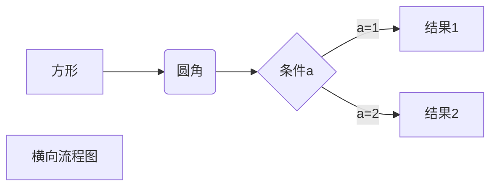
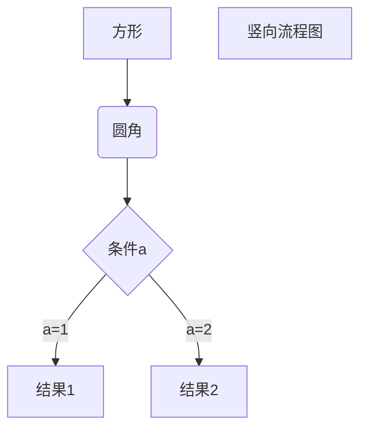
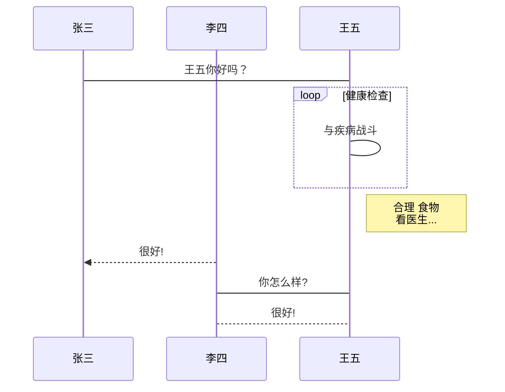
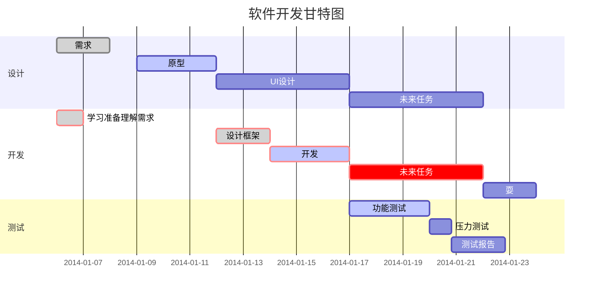

--

使用mermaid语言进行描述。

只需要给代码块选择使用mermaid语言进行解析就好。

流程图







```flow
st=>start: 开始框
op=>operation: 处理框
cond=>condition: 判断框(是或否?)
sub1=>subroutine: 子流程
io=>inputoutput: 输入输出框
e=>end: 结束框
st->op->cond
cond(yes)->io->e
cond(no)->sub1(right)->op
```


```sequence
对象A->对象B: 对象B你好吗?（请求）
Note right of 对象B: 对象B的描述
Note left of 对象A: 对象A的描述(提示)
对象B-->对象A: 我很好(响应)
对象A->对象B: 你真的好吗？
```


```sequence
Title: 标题：复杂使用
对象A->对象B: 对象B你好吗?（请求）
Note right of 对象B: 对象B的描述
Note left of 对象A: 对象A的描述(提示)
对象B-->对象A: 我很好(响应)
对象B->小三: 你好吗
小三-->>对象A: 对象B找我了
对象A->对象B: 你真的好吗？
Note over 小三,对象B: 我们是朋友
participant C
Note right of C: 没人陪我玩
```







**Mermaid[1]** 是一种简单的类似 Markdown 的脚本语言，通过 JavaScript 编程语言，将文本转换为图片。因此，真正实现画图功能的并不是 Typora 本身，它只是内置了对 Mermaid 的支持。

语法解释：`->>` 代表实线箭头，`-->>` 则代表虚线。


# flow的语法

定义元素的语法是

```dart
元素ID=>元素类型: 展示文字
```

- 注意`元素类型`和`展示文字`中间有一个空格，这个空格是必须有的，否则会出错。

1.元素ID在连接各个元素时会用到。

2.元素类型包括以下几种：


```
startID=>start: 开始框
inputoutputID=>inputoutput: 输入输出框
operationID=>operation: 操作框
conditionID=>condition: 条件框
subroutineID=>subroutine: 子流程
endID=>end: 结束框

startID->inputoutputID->operationID->conditionID
conditionID(no)->subroutineID
conditionID(yes)->endID
```


连接元素

1.通过ID引用元素，再用`->`连接各个元素，可以不断连缀，也可以分开连接，如上例中的：

```php
startID->inputoutputID->operationID->conditionID(yes)->endID
```

也可以写成：

```
startID->inputoutputID
inputoutputID->operationID
operationID->conditionID
conditionID(yes)->endID
```


2.条件框的连接有些特殊，需要添加`(yes)`或者`(no)`，表示`是`和`否`的分支。例如

3.连接线有上下左右四个方向，如果需要指定连接线连接到某一特定方向，在连接线开始的元素后面添加方向即可，方向包括：

```swift
(top)
(bottom)
(left)
(right)
```

每条连接线方向默认为(bottom)。

例如：设置连接线方向为向左：

```php
start=>start: 开始
operation1=>operation: 操作框1
operation2=>operation: 操作框2
end=>end: 结束
start->operation1(left)->operation2->end
```

# 参考资料

1、

https://www.runoob.com/note/47651

2、

https://zhuanlan.zhihu.com/p/172635547

3、

这个对mermaid的语法进行了比较好的讲解，不错。

https://snowdreams1006.github.io/write/mermaid-flow-chart.html

4、

https://code.z01.com/doc/mdflow.html

5、

https://www.jianshu.com/p/f28c94cf1204