--

使用mermaid语言进行描述。

只需要给代码块选择使用mermaid语言进行解析就好。

流程图

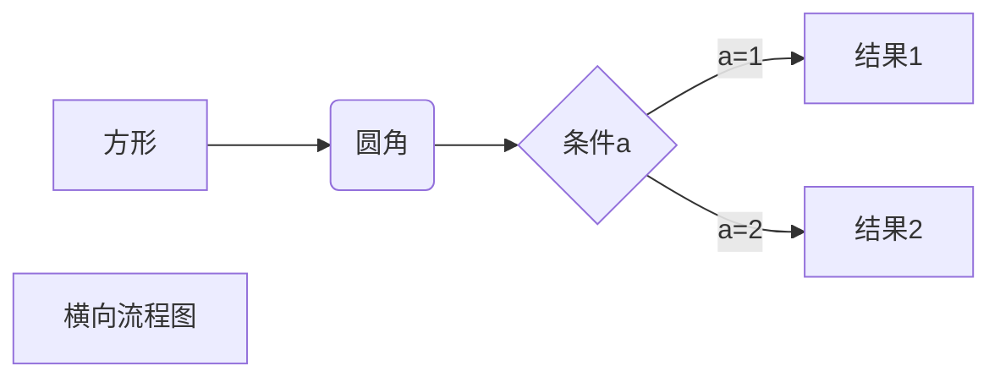


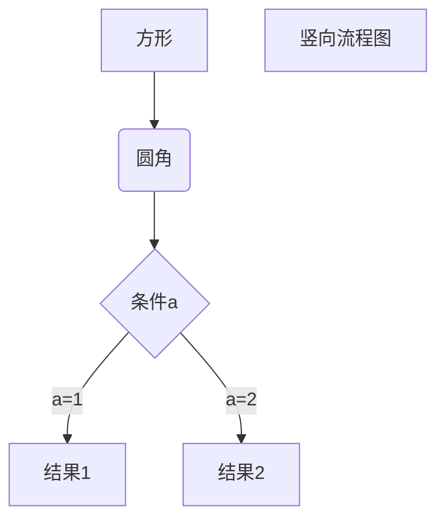


```flow
st=>start: 开始框
op=>operation: 处理框
cond=>condition: 判断框(是或否?)
sub1=>subroutine: 子流程
io=>inputoutput: 输入输出框
e=>end: 结束框
st->op->cond
cond(yes)->io->e
cond(no)->sub1(right)->op
```


```sequence
对象A->对象B: 对象B你好吗?（请求）
Note right of 对象B: 对象B的描述
Note left of 对象A: 对象A的描述(提示)
对象B-->对象A: 我很好(响应)
对象A->对象B: 你真的好吗？
```


```sequence
Title: 标题：复杂使用
对象A->对象B: 对象B你好吗?（请求）
Note right of 对象B: 对象B的描述
Note left of 对象A: 对象A的描述(提示)
对象B-->对象A: 我很好(响应)
对象B->小三: 你好吗
小三-->>对象A: 对象B找我了
对象A->对象B: 你真的好吗？
Note over 小三,对象B: 我们是朋友
participant C
Note right of C: 没人陪我玩
```


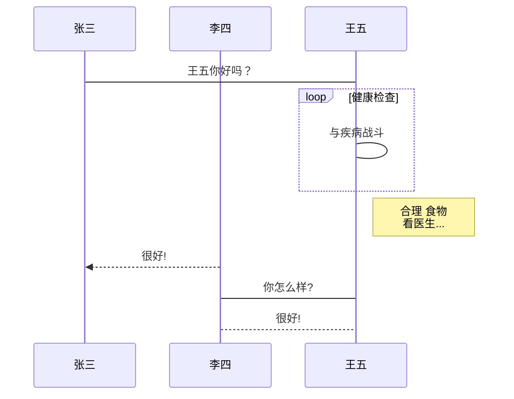

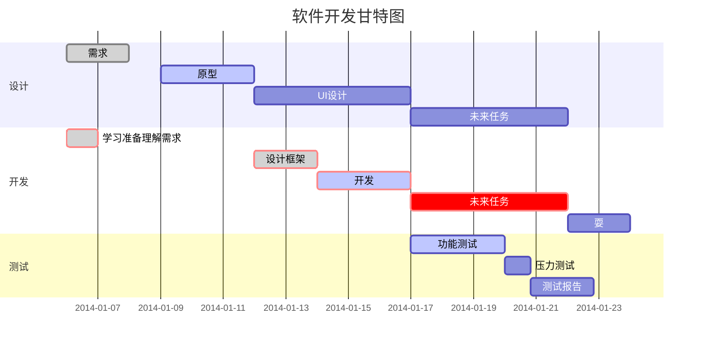


**Mermaid[1]** 是一种简单的类似 Markdown 的脚本语言，通过 JavaScript 编程语言，将文本转换为图片。因此，真正实现画图功能的并不是 Typora 本身，它只是内置了对 Mermaid 的支持。

语法解释：`->>` 代表实线箭头，`-->>` 则代表虚线。


# flow的语法

定义元素的语法是

```dart
元素ID=>元素类型: 展示文字
```

- 注意`元素类型`和`展示文字`中间有一个空格，这个空格是必须有的，否则会出错。

1.元素ID在连接各个元素时会用到。

2.元素类型包括以下几种：


```
startID=>start: 开始框
inputoutputID=>inputoutput: 输入输出框
operationID=>operation: 操作框
conditionID=>condition: 条件框
subroutineID=>subroutine: 子流程
endID=>end: 结束框

startID->inputoutputID->operationID->conditionID
conditionID(no)->subroutineID
conditionID(yes)->endID
```


连接元素

1.通过ID引用元素，再用`->`连接各个元素，可以不断连缀，也可以分开连接，如上例中的：

```php
startID->inputoutputID->operationID->conditionID(yes)->endID
```

也可以写成：

```
startID->inputoutputID
inputoutputID->operationID
operationID->conditionID
conditionID(yes)->endID
```


2.条件框的连接有些特殊，需要添加`(yes)`或者`(no)`，表示`是`和`否`的分支。例如

3.连接线有上下左右四个方向，如果需要指定连接线连接到某一特定方向，在连接线开始的元素后面添加方向即可，方向包括：

```swift
(top)
(bottom)
(left)
(right)
```

每条连接线方向默认为(bottom)。

例如：设置连接线方向为向左：

```php
start=>start: 开始
operation1=>operation: 操作框1
operation2=>operation: 操作框2
end=>end: 结束
start->operation1(left)->operation2->end
```

# mermaid布局算法

### Mermaid 布局算法概述

在 Mermaid 中，有两种主要的布局算法可供选择：

#### 1. Dagre（默认布局）
- **简介**：Dagre 是 Mermaid 长期以来使用的经典布局算法。
- **优点**：
  - 提供良好的简洁性和视觉清晰度。
  - 适合大多数图表，特别是流程图和结构图。
- **适用场景**：当你需要快速生成简单且易于理解的图表时，Dagre 是一个理想选择。

#### 2. ELK（Eclipse Layout Kernel）
- **简介**：ELK 是一种更高级的布局算法，适用于需要更复杂布局的用户。
- **优点**：
  - 提供更优化的排列，减少重叠，提高可读性。
  - 更适合大型或复杂的图表。
- **使用要求**：ELK 不包含在默认的 Mermaid 配置中，需要在集成 Mermaid 时额外添加支持。

### 总结
选择合适的布局算法取决于你的图表复杂性和可读性需求。如果你的图表较简单，Dagre 是一个很好的选择；而对于更复杂的图表，ELK 提供了更强大的优化能力。


# 流程图基本符号

会用下面的的就够用了。

```
[]
()
([])
[[]]
[()]
(())
>]
{}
{{}}
[//]
[\\]
[/\]
[\/]
((()))

---
-->
===
==>
-.-
-.->

subgraph aaa
end
```

各个节点，就相当于变量声明。

先把变量声明都写完。后面括号里的内容，相当于变量的值。

然后再写连线关系。相当于逻辑。

subgraph，相当于函数。

可以写一个简单的例子。就用方框和直线箭头这2个元素，够用了。

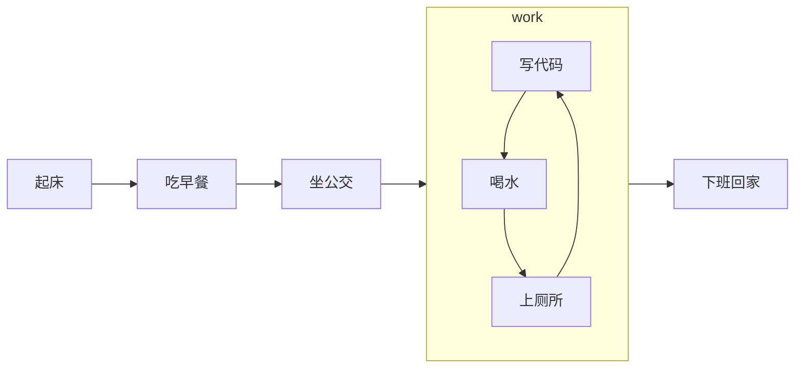

不过条件分支还是需要的。注意这里||后面只能有一个空格，多了空格也不行。

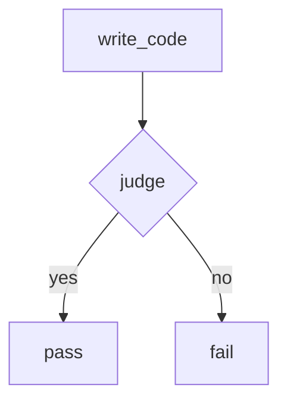

# 时序图

关键词有这些

```
sequenceDiagram 图的声明。

paticipant  参与者，默认就是。明确写的时候，可以指定出场顺序。
	可以指定别名。
	participant A as Alice 这样后面就可以用A来表示Alice了。
actor  图形上是一个小人。

box 分组，end关键词作为结束。

Note right of Alice  这个是添加一个小贴士。在Alice的右边。
Note over Alice,Bob  一个小贴士，横跨这2个参与者。

loop xxx 指定一个循环。
end

线条
->> 默认的实线箭头。
-->> 虚线箭头。
-)  箭头是空心的实线箭头。表示异步。
```

上面的够用了。其余的比较复杂。不实用。

# 状态图

```
stateDiagram-v2  -v2可以不写。
[*] 起点和终点

定义一个节点
aa: this is aa
冒号后面是节点的文字描述，如果不写，那么就是以aa为文字描述。

描述一个转换过程
例如aa到bb，写上过程是“change”
aa --> bb: change

子状态。相当于函数一样。
state xx {

}
子状态可以嵌套。


分支
<<XX>>

--> 箭头  一行只能写一个箭头。

```

# 甘特图

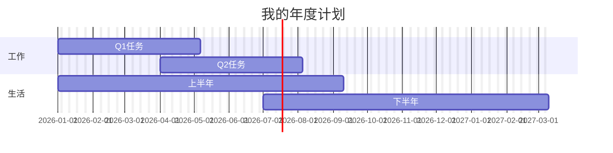

# %%这部分配置

在 Mermaid 中，`%%` 用于添加注释或配置指令。它通常用于代码块的开头，帮助用户对图表进行自定义设置或解释。

### 用法示例

#### 1. 添加注释

你可以使用 `%%` 来添加注释，这些注释不会影响图表的渲染。

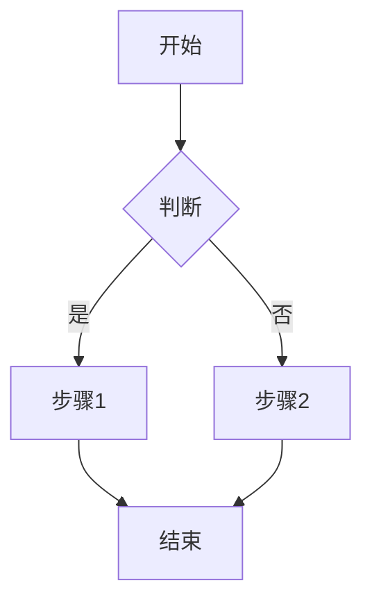

#### 2. 配置指令

在某些情况下，`%%` 后面可以跟随配置指令，以调整图表的属性。例如，设置主题或布局。

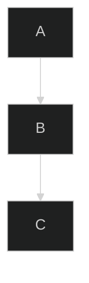

### 总结

- **注释**：使用 `%%` 添加注释，便于代码说明。
- **配置指令**：可以在图表开头使用 `%%` 来设置主题、布局等选项。

如果你需要更多具体的配置示例或帮助，请告诉我！

# 常见的配置项

在 Mermaid 中，可以通过配置项来定制图表的外观和行为。以下是一些常见的配置项：

### 1. 主题配置
你可以设置图表的主题，常见的主题有 `default`、`dark` 和 `forest`。

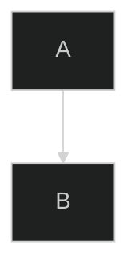

### 2. 流程图配置
可以调整流程图的曲线类型和方向。

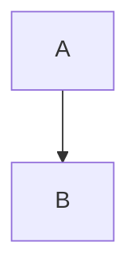

### 3. 底部链接
可以添加底部链接以更好地引导用户。


### 4. 节点样式
可以自定义节点的样式，改变颜色、形状等。

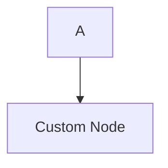

### 5. 边的样式
可以自定义边的样式，例如颜色、线型等。

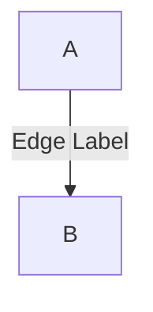

### 6. 图表尺寸
你可以设置图表的默认尺寸。


### 7. 启用/禁用功能
可以启用或禁用某些功能，如悬停提示和缩放。

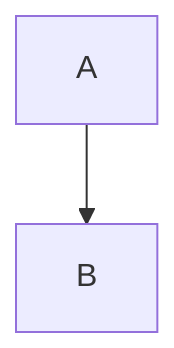

### 总结
这些配置项可以帮助你定制 Mermaid 图表的外观和行为，以满足特定需求。如果你有特定的配置需求或问题，欢迎随时询问！

# 使用style单独修改指定节点的样式

这一点对我来说很有用。

对于关键节点，我想要改一下颜色。

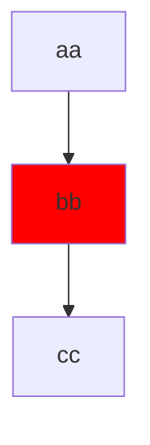


# chatgpt来写

https://chatgpt.com/g/g-1IRFKwq4G-mermaid-chart-diagrams-and-charts

https://mermaid.nodejs.cn/syntax/flowchart.html

# 参考资料

1、

https://www.runoob.com/note/47651

2、

https://zhuanlan.zhihu.com/p/172635547

3、

这个对mermaid的语法进行了比较好的讲解，不错。

https://snowdreams1006.github.io/write/mermaid-flow-chart.html

4、

https://code.z01.com/doc/mdflow.html

5、

https://www.jianshu.com/p/f28c94cf1204