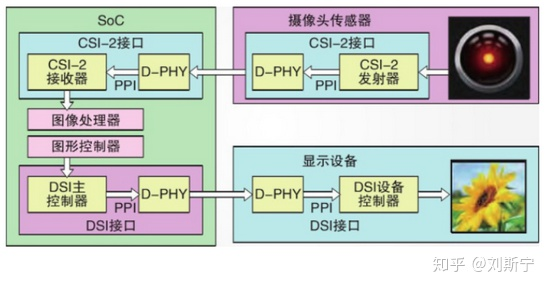
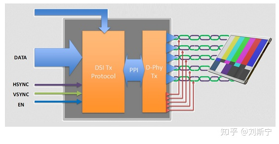

--

移动产业需要一个标准的，强大的，可扩展的，低功耗，

且支持移动设备的多种成像解决方案的摄像机接口。

在摄像机领域，传感器与单片机之间的接口标准有很多，

如UART、I2C、I2S、SPI、SDIO等串行接口，

同时也有用于传感器和显示器的DVP等并行接口。

多种不同的接口标准增加了产品设计的复杂性。

另外，并行接口通常需要涉及10路以上信号，

而与显示相关的应用则更是多达20路。

繁多的信号增加了布线的困难，

限制了信号的频率和传输距离，

同时也制约了产品的小型化能力，所以已经逐渐被新技术淘汰。

近些年来，接口技术的发展方向主要是低压、高速、串行、小型化，

以满足移动市场对产品成本、体积、重量、功耗、性能和可靠性等方面的苛刻需求。

MIPI (Mobile Industry Processor Interface) 联盟是2003年由ARM, Nokia, ST ,TI等公司成立的一个联盟组织，

**目的是把手机内部的接口如摄像头、显示屏接口、射频/基带接口等标准化，**

从而减少手机设计的复杂程度和增加设计灵活性。

MIPI并不是一个单一的接口或协议，而是包含了一套协议和标准。

MIPI联盟下面有不同的工作组，

分别定义了一系列的手机内部接口标准，

比如摄像头接口CSI、

显示接口DSI、

射频接口DigRF、

麦克风 /喇叭接口SLIMbus等。

统一接口标准的好处是手机厂商根据需要可以从市面上灵活选择不同的芯片和模组，

更改设计和功能时更加快捷方便。

下图展示了MIPI联盟在移动设备领域所推出的各种技术标准。

MIPI是一个比较新的标准，

其规范也在不断修改和改进，

目前比较成熟的接口应用有CSI（摄像头接口）和DSI（显示接口），

分别针对Camera或Display应用，

都有复杂的协议结构。

MIPI CSI-2 和 MIPI CSI-3 是MIPI 摄像机接口最初标准的升级版本，

这两个版本都在持续演进中。

两个版本都具有高级的架构设计，

为开发人员，制造商和最终的消费者提供更多选择和更大的价值，

同时保持标准接口的优势。

下图说明了CSI和DSI设备的典型应用场景。

CSI/DSI的物理层（PHY Layer）由专门的工作组负责制定，

在目前公布的协议中有三类基于摄像头的接口，

分别是D-PHY，C-PHY和M-PHY接口。

参考资料

1、Understanding MIPI Interface

https://zhuanlan.zhihu.com/p/100476927