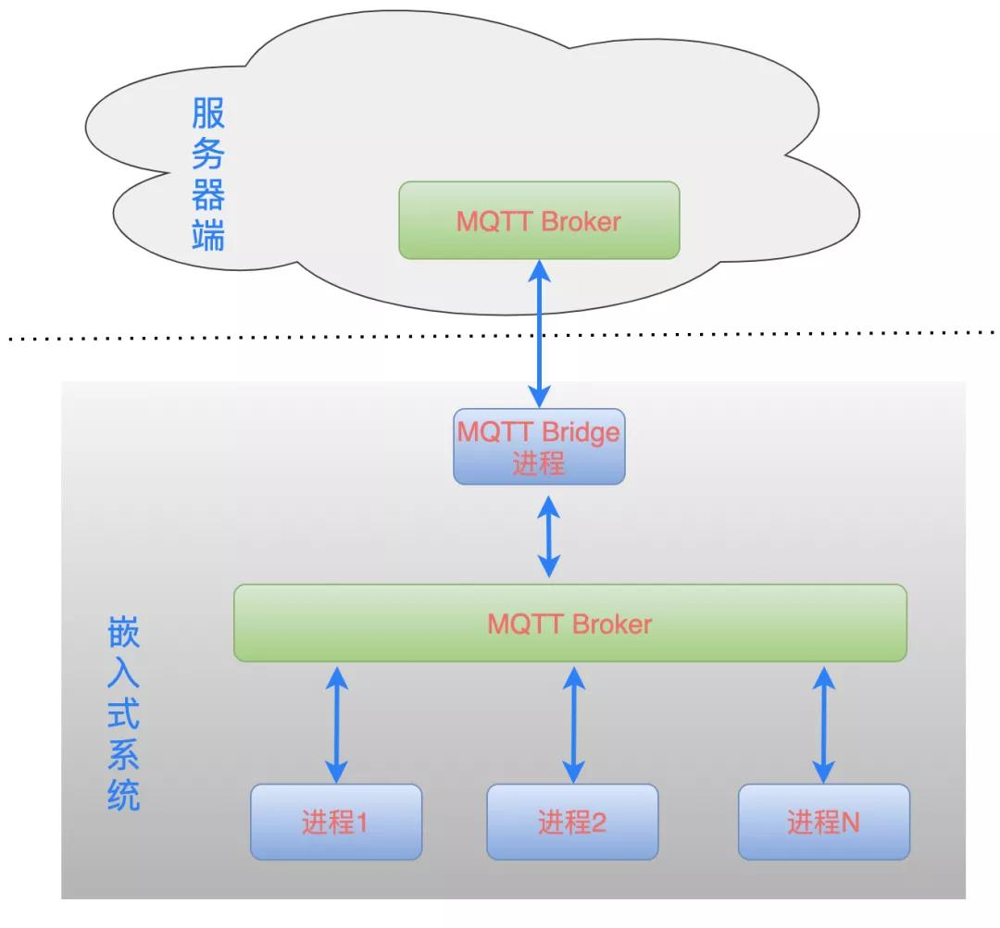

--

我对于使用dbus作为系统总线，觉得非常繁琐复杂。

我希望可以用json格式来组织消息，各个通信组件之间可以自由随意相互发送消息。

我觉得mqtt的订阅发布模式很好。有很大的自由度。

现在看看能不能把它设计成一个可用的嵌入式Linux本地消息总线来使用。

我对于效率的要求没有那么高，通信的数据量也没有那么大。

这个思路是行得通的。

现在就要先找一个嵌入式可用的mqtt broker

看buildroot里已经集成了mosquitto。

这个当然可以用。

所以就是在本地运行一个mosquitto。

在刚才描述的嵌入式系框架设计中，每一个进程都是运行在本地的，所有的消息也都是在系统内进行收发。那么，如果需要把数据传输到云端、或者需要从云端接收一些控制指令，又该如何设计呢?

加入一个 **MQTT Bridge 桥接模块即可**!也就是再增加一个进程，这个进程同时连接到云端的 MQTT Broker 和本地的 MQTT Broker，通信模型如下：

MQTT Bridge 接收到云端发来的指令时，转发到本地的消息总线上;

MQTT Bridge 接收到本地的消息时，转发到云端的消息总线上。

mqtt bridge用哪个开源的呢？

Mosquitto broker 可以被配置为一个 MQTT bridge 桥，连接着两个 MQTT broker。

通常的做法是连接边缘 MQTT brokers 到一个中心/远程的 MQTT 网络。

当你配置一个 broker 为 bridge 时，它就成为了一个 MQTT 客户，可以订阅/发布消息给另一个broker，并且它自己依赖 **mosquitto.conf** 配置文件。

# 参考资料

1、

这个系列倒是跟我的想法有些契合。看看。用户是“道哥分享”。

https://iot.ofweek.com/2021-03/ART-132209-11000-30487804.html

这篇非常好，图画得很直观。

https://mp.ofweek.com/iot/a756714071157

这个是道哥的cnblog地址

https://www.cnblogs.com/sewain/

2、mqtt应用于进程间通信实例分享

https://juejin.cn/post/6984070002320080910

3、

https://www.51cto.com/article/645702.html

4、

https://www.wandouip.com/t5i76527/

5、

https://www.cnblogs.com/zhenqichai/p/mosquitto-bridge-configuration.html