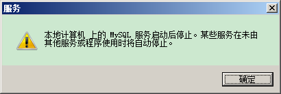

1

到这里下载。

http://mirrors.sohu.com/mysql/MySQL-8.0/

搜索msi。找到windows安装包。

安装到D:/mysql目录。

然后配置环境变量。

```
MYSQL_HOME  D:\mysql
往PATH里添加  D:\mysql\bin
```

然后需要安装mysql服务。

执行命令：

```
mysqld -install
```

这样就可以在服务里了看到mysql服务了。


右键选择启动。但是提示失败。



看mysql目录下，有没有一个data目录，如果有，删掉它。然后重新新建空的data目录。

执行初始化：

```
mysqld --initialize-insecure --user=mysql
```

这个会在data目录下生成一些文件。

然后注册mysql服务。

```
mysqld --install mysql 
```

启动服务：

```
net start mysql
```

现在就可以启动成功了。

然后用就可以连接mysql了。

```
mysql -u root -p
```

默认密码是空的。


下载压缩包版本的看看。

当前msi版本的安装后，没有my.ini文件。

现在不知道怎么改编码。

压缩包版本的也没有。

还是参考菜鸟教程的来做。


my.ini放到d:\mysql目录下。

```
[client]
# 设置mysql客户端默认字符集
default-character-set=utf8
 
[mysqld]
# 设置3306端口
port = 3306
# 设置mysql的安装目录
basedir=d:\\mysql
# 设置 mysql数据库的数据的存放目录，MySQL 8+ 不需要以下配置，系统自己生成即可，否则有可能报错
# datadir=C:\\web\\sqldata
# 允许最大连接数
max_connections=20
# 服务端使用的字符集默认为8比特编码的latin1字符集
character-set-server=utf8
# 创建新表时将使用的默认存储引擎
default-storage-engine=INNODB
```


参考资料

1、Windows下安装MySQL详细教程

https://www.cnblogs.com/yunlongaimeng/p/12558638.html

2、【错误解决】本地计算机上的mysql服务启动停止后,某些服务在未由其他服务或程序使用时将自动停止

https://blog.csdn.net/qq_26525215/article/details/53424152

3、

https://www.runoob.com/mysql/mysql-install.html

4、Mysql8.0版本修改密码命令行（windows）

https://www.jianshu.com/p/d8396c41d440