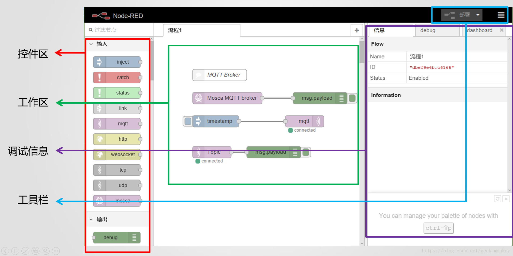
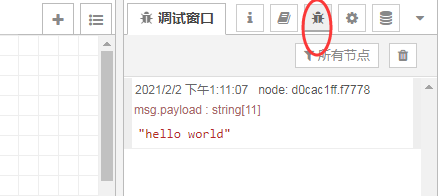
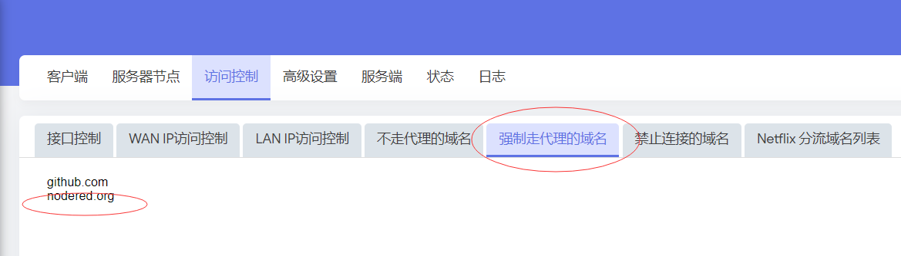
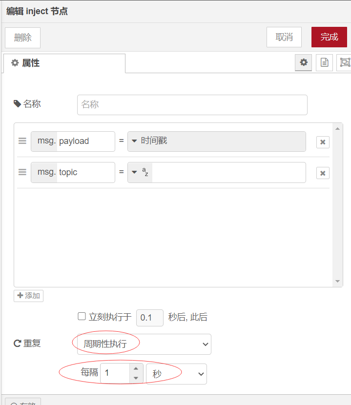
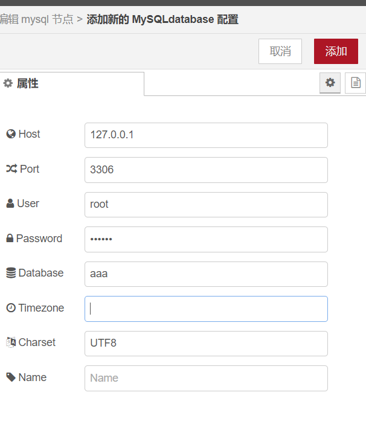
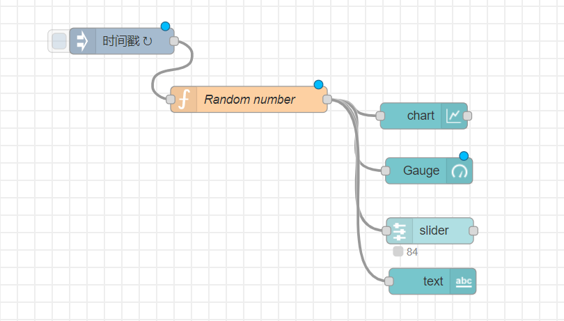
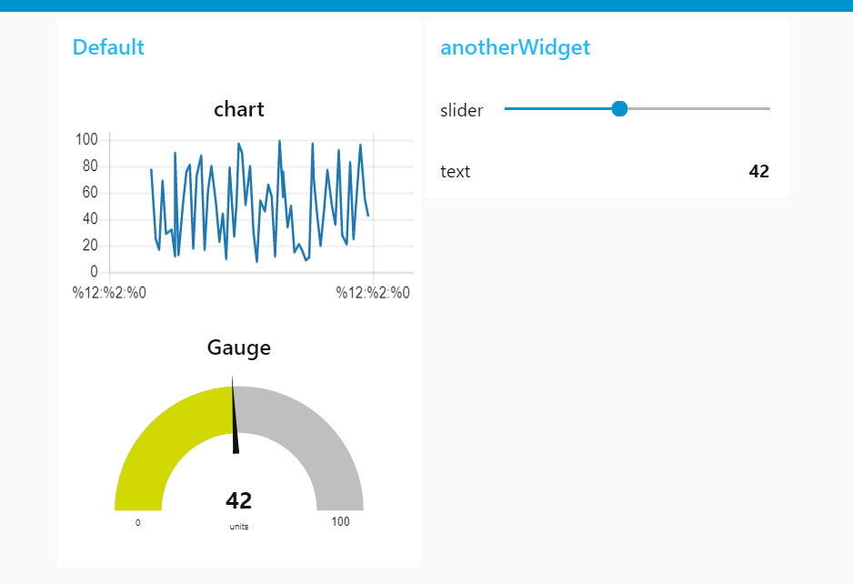

1


https://www.bilibili.com/video/BV1s7411p7dj


现在对express掌握了。在寻找各种express应用的时候，发现node-red就是基于express的。

那么正好，我可以把node-red深入学习一下。

官网：https://nodered.org/


Node-RED是一种编程工具，用于以新颖有趣的方式将硬件设备、API和在线服务连接在一起。

它提供了一个基于浏览器的编辑器，

使您可以轻松地使用设计器中的各种节点将流连接在一起，

只需单击即可将其部署到其运行，

简洁高效的完成一个服务的部署。


轻量级运行时基于Node.js构建，

充分利用了其事件驱动的非阻塞模型。

这使得它非常适合在低成本的硬件（如Raspberry Pi）上的网络边缘以及云中运行。


在Node-RED中创建的流使用JSON存储，可以轻松导入和导出以与他人共享。


node-red技术在搭建具备网络与图形化功能的上位机、编程入门方面有很强的先天优势，

也可以拿来做物联网资源的扩展，或与树莓派搭配做网关功能。


node-red也是属于低代码平台的一种。


Node-Red是IBM公司开发的一个可视化的编程工具。

它允许程序员通过组合各部件来编写应用程序。

这些部件可以是

硬件设备(如：Arduino板子)、

Web API(如：WebSocket in和WebSocket out)、

功能函数(如：range)

或者在线服务(如：email)。 

Node-Red提供基于网页的编程环境。

通过拖拽已定义node到工作区并用线连接node创建数据流来实现编程。

程序员通过点击‘Deploy’按钮实现一键保存并执行。

程序以JSON字符串的格式保存，方便用户分享、修改。 

Node-Red基于Node.js，它的执行模型和Node.js一样，也是事件驱动非阻塞的。

理论上，**Node.js的所有模块都可以被封装成Node-Red的一个或几个node。**

# QQ群

776817275

本群创建于2018/12/8:  本群为ioBroker & Node-Red & Home Assistant & Homekit & 米家等玩转智能家居非商业交流群。本群宗旨为智能家居玩家交流群，无任何商业活动，商家和发广告者请不要申请加入。

# 使用场景

https://nodered.top/ha/caiyun/

应该是给非专业人士用的吧。


几年前就从树莓派，arduino 等创客教程中看到了Node-RED。

只知道它是IBM 公司的一个开源项目-基于数据流(dataflow)的可视化编程工具。

网上的许多文章和例子大都是树莓PI，arduino的node-RED/ IoT 例子，

这给我造成 Node-RED 是个小玩意的印象。

并没有太多地留意和深入地学习。

直到最近，发现许多大公司的产品都支持Node-RED，

比如西门子公司的IoT2000，

研华公司的WISE PaaS 网关，

美国OPTO Groov EPIC等设备中都安装了Node-RED，

表明它在工业物联网和控制中已经广泛应用了。

Node-RED 和Docker，MQTT，InFluxDB 等术语同时出现在许多网络文章中。

Node-RED 并不只是业余爱好者的编程工具。

它俨然成为工业物联网，设备和云端数据流控制的有力工具，

在工业物联网，边缘计算和云端都具有专业的应用场景。 


使用Node-RED 可以不编写任何程序，使用Web 浏览器界面进行可视化编写数据流控制程序。

提高了物联网终端设备的编程效率。

而厂家的工作就是要为客户编写各种Node 和flow 库。


同样地，Node-RED 也可以部署在云端，

或者边缘设备上，

实现云端应用的可始化编程。

下面是一个典型的应用架构。

Node-RED 主要用于物联网数据的格式转换和预处理。

并将数据存储到实时数据库influxDB 中，最后Grafana 可视化显示。


Node-RED 的强大之处在于众多公司和个人已经开发了大量的Node-RED库，在Node-RED 网站上可以找到大量的节点（目前可以看到有3124 个节点）。

可以用来自己做一个物联网平台。还是可以做得非常好的。


# 安装运行

安装

```
npm i -g node-red
```

运行

```
teddy@thinkpad:~/work/test/websocket-test$ node-red
2 Feb 11:41:56 - [info] 

Welcome to Node-RED
===================

2 Feb 11:41:56 - [info] Node-RED version: v1.2.7
2 Feb 11:41:56 - [info] Node.js  version: v10.22.0
2 Feb 11:41:56 - [info] Linux 4.15.0-128-generic x64 LE
2 Feb 11:41:57 - [info] Loading palette nodes
2 Feb 11:42:05 - [info] Settings file  : /home/teddy/.node-red/settings.js
2 Feb 11:42:05 - [info] Context store  : 'default' [module=memory]
2 Feb 11:42:05 - [info] User directory : /home/teddy/.node-red
2 Feb 11:42:05 - [warn] Projects disabled : editorTheme.projects.enabled=false
2 Feb 11:42:05 - [info] Flows file     : /home/teddy/.node-red/flows_thinkpad.json
2 Feb 11:42:05 - [info] Creating new flow file
2 Feb 11:42:05 - [warn] 

---------------------------------------------------------------------
Your flow credentials file is encrypted using a system-generated key.

If the system-generated key is lost for any reason, your credentials
file will not be recoverable, you will have to delete it and re-enter
your credentials.

You should set your own key using the 'credentialSecret' option in
your settings file. Node-RED will then re-encrypt your credentials
file using your chosen key the next time you deploy a change.
---------------------------------------------------------------------

2 Feb 11:42:06 - [info] Starting flows
2 Feb 11:42:06 - [info] Started flows
2 Feb 11:42:06 - [info] Server now running at http://127.0.0.1:1880/

```

从上面可以得到的信息：

1、配置文件在~/.node-red/settings.js里。

2、默认上下文是存放在内存里，应该是可以配置存到磁盘里的。

3、运行在1880端口上。





数据流的编辑界面由四部分组成。

最左边是已定义的各种node的列表，我们称之为控件区；

中间是一个工作区，

用户可以拖放node到工作区来创建node的实例，

Node-Red为每个node实例赋予了唯一的ID，

通过双击node实例来编辑单个实例，

通过连接node的in和out创建数据流，

node实例会记录out口连线的信息，每条线会记录目标node实例的信息；

最右边是debug node的输出区及node的帮助信息显示区。

右上角有‘Deploy’（或者“部署”）按钮，用来把编写的程序保存到本地并执行。 


数据流的执行：

通过读取用户编辑的数据流信息，

可以知道node的类型及可编辑部分的值，

据此来创建node的可执行实例；

通过读取编辑时连线的信息，

可以得到可执行实例间的数据关系，

实例间的数据发送和接受是利用Node.js的event模块实现的。 


注意：

在Node-Red的根目录下，

可以通过执行‘node red.js’运行Node-RED。

Node-Red编辑完成的数据流默认保存在`flows_XX.json`，

可以通过执行`‘node red.js flows_.json’，`

在不启动浏览器的情况下执行已经编辑完成的程序，

这个在实际部署的时候非常有用。

# HelloWorld

启动node-red以后，

在浏览器中，

将控件区内的输入节点“inject”与输出节点“debug”，

使用鼠标左键拖入工作区内。 

感觉有点画电路原理图的意思。

又有点gstreamer里pipe控件的意思。

双击控件，可以修改控件的信息，包括类型。

例如，我们上面放进来的是inject节点，默认是时间戳类型，我们可以修改为文字类型。



切换到调试窗口。点击inject控件的触发按钮，就可卡因看到这里打印了我们给控件填写的hello world被打印出来了。


# 基本概念

Node-RED本身只包含了一些核心的基本节点，但还有大量来自于Node-RED项目和广大社区的其他节点可以使用。

你可以在[Node-RED代码库](http://flows.nodered.org/)或[npm仓库](https://www.npmjs.com/browse/keyword/node-red)中寻找所需要的节点。


Node-RED是一种基于流的编程工具，

其基于流的程序设计是由J. Paul Morrison在20世纪70年代发明的，

它将应用程序的行为描述为网络黑匣子(Node-RED中称为“节点”)。

其中每个节点都有一个定义明确的目的；

它被赋予一些数据，

完成对数据的处理之后传递数据。

网络负责节点之间的数据流。

它是一种非常适合于可视化表示的模型，

并使其更容易为更广泛的用户所访问。

如果有人可以将一个问题分解成离散的步骤，

他们可以查看一个流并了解它正在做什么，

而不必理解每个节点中的代码行。


Node-RED是由基于Node.js的运行环境组成，

您可以将Web浏览器指向该运行时来访问流编辑器。

在浏览器中，

您可以通过将节点从调色板拖到工作区中并将它们连接在一起，

以开始创建应用程序。

只需单击一次，即可将应用程序部署回运行它的运行环境。

其中的节点由两个文件组成：JavaScript文件和html文件

- JavaScript文件定义了节点的功能
- html文件定义了节点的属性和外观（编辑对话框和帮助文本）

通常来讲，在节点的目录下还需一个package.json文件

用于将所有文件打包成NPM模块，用以在Node-RED中安装、运行。


Nodered还支持快速导入导出流程的功能。流程以JSON格式输入或输出，可以轻松地与他人分享。

直接把这个代码拷贝，在node-red里点击导入，直接粘贴。

https://github.com/watson-developer-cloud/node-red-labs/blob/master/basic_examples/discovery/Discovery-Flows.json

但是会提示watson-discovery-v1是未知节点类型。

因为这个是ibm自己定义的节点。


# 正式环境

在我的树莓派4上搭建环境，就作为家庭的物联网控制中心。

树莓派运行的SuLingGG的openwrt系统。

使用docker来运行。后续可以把1880端口映射到外网。这样就可以在外网实时控制了。

```
docker run -d -p 1880:1880 -v node_red_data:/root/node-red-dir --restart always --name mynodered nodered/node-red
```


这里是一些ibm的例子。

https://github.com/watson-developer-cloud/node-red-labs

# 搭建天气预报

这个小项目的目标是通过API请求 

获取OpenWeatherMap的基础天气信息

和WAQI的空气质量信息, 

并将这些信息存入MySQL数据库, 

并从前端展示出来. 

展示Node-RED在可视化编程和UI界面快速构建方面的强大能力.


Node-RED每个flow是通过一个msg对象进行传递数据的. 

所以这里我们在`init`节点生成一个msg对象, 

来替代Node-RED本身生成的msg对象(这样可以更加方便添加键值对).

https://github.com/bing-zhub/WeatherNode


准备工作

先要获得一个openweathermap的一个token。

需要到网站上注册。

https://home.openweathermap.org/users/sign_up

注册有问题。

挂着梯子会提示：

```
reCAPTCHA verification failed, please try again.
```

不挂梯子又上不去。

我可以自己模拟数据吧。不用这个真实数据。

# mysql使用

现在需要在openwrt里安装mysql的docker。

为了加快安装的速度，在梯子里配置nodered.org强制走代理。

因为我查了一下，node-red模块安装，不是走npm的registry的。

这样速度明显就上来了。




为下面的测试准备一些测试数据。

在mysql命令行里，执行：

```
create database test;
use test;
create table aaa(id int primary key auto_increment, name char(20));
insert into aaa values (null,'allen');

mysql> select * from aaa;
+----+-------+
| id | name  |
+----+-------+
|  1 | allen |
+----+-------+
1 row in set (0.00 sec)
```


https://www.cloudhadoop.com/2018/07/how-to-read-data-from-mysql-in-node-red.html

这个是node-red里mysql的入门例子。

放入4个节点，从左到右依次是：

1、inject。配置为重复触发。每1s自动触发一次。



2、函数节点。这个里面就执行select查询。

里面写的内容：

```
msg.topic = "select * from aaa;"
return msg;
```

3、mysql节点配置。



4、debug节点。这个就是console打印。

点击部署。

报错了。

```
2021/2/9 上午11:06:15node: mysql
msg : string[22]
"Database not connected"
```

仔细研究了一下，有这么几点需要改一下。

```
1、我的数据库写错了。数据库名字是test。表名是aaa。我把数据库名字错写成了aaa。
2、连接的地址，不能是127.0.0.1。写成172.17.0.4这个地址。可以正常读取到数据。
```


# node-red-dashboard

Node-red基于JS，

这是前端技术的“三驾马车”之一。

前端技术主要负责界面呈现，

与用户交互等等，很多炫酷的特效都是前端呈现的。

Node-red技术有这样的“基因”，界面当然不会差劲。

它只需要一个控件就可以实现一个页面

Node-red支持自定义节点，当然也就支持自定义图形化的节点。

也有优秀的开发者把自己建立的图形化节点无偿分享。

这里给出一个股票界面的例子，让大家看一看优秀的node-red界面能做到什么样子。 

搜索node-red-dashboard进行安装。

把下面这篇文章里的代码进行导入。

https://blog.csdn.net/armcsdn/article/details/104255871



然后访问：http://192.168.1.3:1880/ui/

就可以看到界面效果了。




# 参考资料

1、Node-RED:1 - 简介

<https://www.jianshu.com/p/be1c98280c71>

2、使用nodered操作数据库

<https://www.ctolib.com/topics-141718.html>

3、ibm官网教程

https://developer.ibm.com/zh/components/node-red/tutorials/

4、node-red的入门教程集合

https://bbs.iobroker.cn/t/topic/1165

5、中文文档

https://nodered.top/

6、

https://nodered.17coding.net

7、yummy说电子的node-red系列文章

挺不错的。

https://blog.csdn.net/geek_monkey/category_7744078.html

8、Node-RED 的工业应用场景

https://blog.csdn.net/yaojiawan/article/details/88626832

9、

https://www.jianshu.com/p/13d20c2b6652