1

代码在这里：

https://github.com/cnodejs/nodeclub

# 本地运行

先在本地跑起来。

把config.default.js拷贝为config.js。

修改里面的host为：192.168.1.102 ，因为我是在Linux笔记本上运行，而在windows上的浏览器进行访问。这样操作方便一点，Linux笔记本操作不方便。

安装依赖

```
npm i
```

这样就把package.json里的包都安装了。

需要把mongod和redis-server都启动。默认的配置就好。

需要mongo命令行里新建一个名为node_club_dev的数据库。

然后运行：

```
node app.js
```

就可以正常访问了。

github的oauth先不管，我们把注册的做一下。

这个需要发送邮件，所以需要把config.js里的邮件配置改一下。

我就用163邮箱的配置。

点击注册

从数据库里查看。

```
> use node_club_dev
switched to db node_club_dev
> show collections
messages
replies
topiccollects
topics
users
```

目前注册了一个用户。

```
> db.users.find()
{ "_id" : ObjectId("5febe72e659c096ee9897039"), "is_block" : false, "score" : 0, "topic_count" : 0, "reply_count" : 0, "follower_count" : 0, "following_count" : 0, "collect_tag_count" : 0, "collect_topic_count" : 0, "active" : false, "receive_reply_mail" : false, "receive_at_mail" : false, "create_at" : ISODate("2020-12-30T02:34:22.364Z"), "update_at" : ISODate("2020-12-30T02:34:22.376Z"), "name" : "teddyxiong53", "loginname" : "teddyxiong53", "pass" : "$2a$10$M3eTUlzzS/iuwDL9pB/Pq.0PB4ALbiASXpo3JD4VmzHa3Lv./qNWG", "email" : "1073167306@qq.com", "avatar" : "http://www.gravatar.com/avatar/efa2a90d4561bb6a540a46dc8ebb6dee?size=48", "accessToken" : "bacd1b85-5b42-47f4-bdee-de1724810a67", "__v" : 0 }
> 
```

现在邮件总是没有发出来。

奇怪了。我前几天在nextcloud还设置了。可以正常发送邮件的。

我各种配置都试过了。还是不行。

换qq邮箱的吧。

也是不行。

我单独测试nodemailer看看。


nodemailer支持的邮件smtp服务商。

https://nodemailer.com/smtp/well-known/

用下面的代码，可以从163发到qq。

```
'use strict';

const nodemailer = require('nodemailer');

let transporter = nodemailer.createTransport({
  // host: 'smtp.ethereal.email',
  service: '163', // 使用了内置传输发送邮件 查看支持列表：https://nodemailer.com/smtp/well-known/
  port: 465, // SMTP 端口
  secureConnection: true, // 使用了 SSL
  auth: {
    user: 'teddyxiong53@163.com',
    // 这里密码不是qq密码，是你设置的smtp授权码
    pass: 'XXX',
  }
});

let mailOptions = {
  from: '"JavaScript之禅" <teddyxiong53@163.com>', // sender address
  to: '1073167306@qq.com', // list of receivers
  subject: 'Hello', // Subject line
  // 发送text或者html格式
  // text: 'Hello world?', // plain text body
  html: '<b>Hello world?</b>' // html body
};

// send mail with defined transport object
transporter.sendMail(mailOptions, (error, info) => {
  if (error) {
    return console.log(error);
  }
  console.log('Message sent: %s', info.messageId);
  // Message sent: <04ec7731-cc68-1ef6-303c-61b0f796b78f@qq.com>
});

```

我把这个代码放到config.js里。还是不能正常发出邮件。

看了一下代码，要吐血。居然在打开debug的时候，不发邮件。

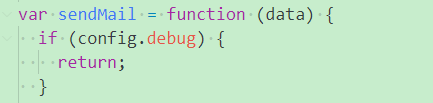

把这个return注释掉。就可以收到邮件了。

激活链接是这样：

```
http://192.168.1.102/active_account?key=3534992b8147695ea0353a9ed946c538&name=teddyxiong53
```

但是这个地址访问返回503错误。

知道了。是因为需要加上:3000这个端口号。生成的链接里没有端口号。

手动加上就可以正常激活了。

可以正常浏览发帖了。

总体风格是比较简洁的。可以改造成自己的博客的。

有点v2ex的风格。

评论里可以相互@操作。

在config.js里，可以配置admin。admin可以对其他发的帖子进行操作。

把github登陆配置一下。

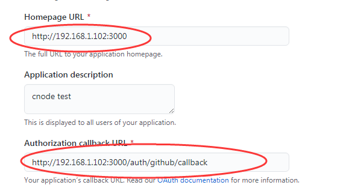

流程很顺利。但是碰到一点不常见的小问题。

问题是这样的：

```
1、我当前已经注册了teddyxiong53这个名字。
2、我用github来授权登陆。但是我的github名字也是teddyxiogn53.
这样就登陆失败了。
```

我先到数据库里，手动删掉teddyxiong53这个用户。

再用github进行登陆。就正常了。

search是靠谷歌来进行的。所以需要让谷歌可以索引本站。

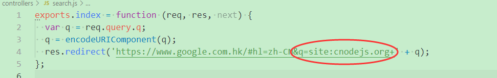


# ejs-mate

```
var express = require('express')
var path= require('path')
var config = require('./config')
var _ = require('lodash')
var app =express()
var staticDir = path.join(__dirname, 'mypublic')

app.use('/public', express.static(staticDir))

app.set('views', path.join(__dirname, 'myviews'))

app.set('view engine', 'html')
app.engine('html', require('ejs-mate'))
_.extend(app.locals, {
    config: config//如果有数据要传递给模板，这样传递过去。
})
app.locals._layoutFile = 'layout.html';//这一行是关键。html框架就写在这个里面，其他的都是继承了这个，在这个基础上调整。

app.get('/', function(req,res) {
    res.render('index')
})
app.listen(9090, '0.0.0.0')
```

https://www.npmjs.com/package/ejs-mate

当前是用html模板，配合ejs-mate。

ejs-mate提供了partial、layout、block这3个函数。

**母版页中的“<%-body%>”是子页面的占位**

```
<%- partial('sidebar') %>
```

这样是对应包含一个sidebar.html文件。


除了全部和精华这2个tab的固定的，其余的tab是在config.js里配置的。

```
  // 版块
  tabs: [
    ['share', '分享'],
    ['ask', '问答'],
    ['job', '招聘'],
  ],
```

所以这个用来做个人博客系统，其实也可以。


# mvc

m：放mongoose模型相关。

v：放ejs、html文件。

c：放function(req, res, next)函数


# 消息实现

怎么把@xx的内容，处理成消息？


# 部署到服务器

打算练习一下vue、微信小程序、uniapp这3个东西。

所以把服务器部署到服务器上。

域名用这个：

cnode.only4u.tech

宝塔新建这个网站。

然后设置反向代理。指向：http://localhost:3000 

可以访问到。

把github登陆配置一下。

配置了，但是登陆会出错。不知道是不是因为服务器无法访问github导致。

把通过github登陆禁用掉。

想要关闭掉debug。

但是有问题。

make build过不了。

所以，暂时先保留debug的。

需要把config.js里的host改成域名。不然激活邮件无法使用。

现在跑起来。功能正常。

放一些数据进去。作为测试数据。

就放3个诗人，李白、杜甫、白居易的。

每个人三首诗，分别放在分享、问答、招聘这3个板块。

都尽量简单的。

```
李白
	赠汪伦
	静夜思
	望庐山瀑布
杜甫
	绝句：两个黄鹂
	山行：远上寒山石径斜
	江畔独步寻花：黄四娘家花满蹊
白居易
	赋得古原草送别 
	暮江吟
	忆江南
	
杜甫对李白的3首诗都进行评论和收藏操作。
管理员teddyxiong53
对李白的赠汪伦进行加精。对静夜思进行置顶。对望庐山瀑布进行block锁定。
把李白设置为star。
```

注册3个账号。

用我自己的邮箱系统。

```
libai@only4u.tech
dufu@only4u.tech
baijuyi@only4u.tech
```

数据都设置好了。

# vue来做前端

把这个代码取下来。

https://github.com/shinygang/Vue-cnodejs

```
npm i
npm run dev
```

然后访问：http://ip:8020 ，就可以访问的cnode网站的内容。

靠的是这样的代码来访问服务端的。

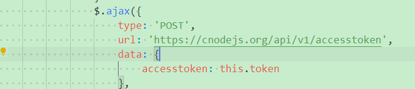

这个iconfont.css是从iconfont.cn网站，挑选图片生成的。具体方法我已经知道了。

所以不要管里面的细节。

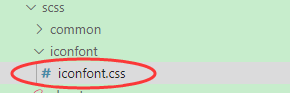

自己来写一遍。

```
vue init webpack vue-cnode
```

生成的build和config目录差不多。

主要就是写src目录下的东西。


这个是另外一种实现方式，对比一下。

https://github.com/lzxb/vue-cnode

这个使用了vuet来替代vuex做状态管理。但是vuet已经不再维护了。

这种个人项目麻烦就在于，说不维护就不维护了。还是官方的靠谱一点。

这个是一个练习项目。有多种实现。可以看看。

https://github.com/shuiRong/VueCnodeJS

这个是mpvue版本的

https://github.com/jaxQin/mpvue-cnode

微信小程序版本

https://github.com/coolfishstudio/wechat-webapp-cnode

又一个版本，可以学习不同的风格

https://github.com/beilunyang/cnodejs-vue

先把上面这些代码看一下。


## VueCnodeJS

https://github.com/shuiRong/VueCnodeJS


~~这个效果不太好。主要是css写得简单了。而且功能也不完整，没有用户登陆的功能。只是简单查看。~~

~~使用了elementui。~~

就是因为简单，所以对我进行学习是很有用的。

我照着这个写了一遍。提取一个简单程序的模板。

这个代码里还有带vuex的版本。看起来不错。

也可以自己写一遍。

还有nuxt.js版本。也值得看看。

### 基础版本

这样来import本地的，使用@符号。跟./有什么不一样？

```
import tab from '@/utils/tab'
```

对于时间字符串，使用了moment。

```
import moment from 'moment'
moment.locale('zh-cn')
Vue.prototype.$moment = moment
```

使用axios来读取数据。

没有使用vuex。

数据直接存到data里。

使用elementui的步骤：

在main.js里，引入：

```
import './plugins/element.js'
```

element.js里，是这样的内容：

```
import {
  Button,
  Card,
    Message,
  MessageBox,
} from 'element-ui'

Vue.use(Button)
Vue.use(Card)
Vue.prototype.$message = Message
Vue.prototype.$confirm = MessageBox
```

只用了3个views界面：Home、Topic、User。

Home就是对应文章列表。

Topic，就是文章详情。

User就是用户信息。

在Home.vue里，对created和destroyed钩子函数进行了实现。

```
在created里，添加对滚动事件的监听，这样滚动到最后的时候，就会自动读取新的数据。
window.addEventListener('scroll', this.scrollMethod);
在destroyed里，移除了这个监听。
window.removeEventListener('scroll', this.scrollMethod);
```

Home的构成：

上面的导航栏，是el-tabs。

```
<el-tabs v-model="tab" @tab-click="tabChanged">
      <el-tab-pane label="全部" name="all">
        <Content :list="list" />
      </el-tab-pane>
```

使用了Content这个component 。

照着这个写一遍。

尽量不引用外部css。自己写css部分，也尽量，看看默认样式效果怎么样。

### vuex版本

这个界面比较简陋。

没有views目录，直接就在routes里进行组装component。

给component还起了名字。

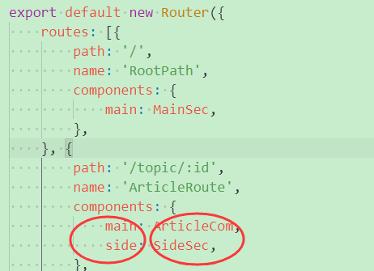

特别的地方就是，引入了vuex。

而且这里，分了多个文件来做。

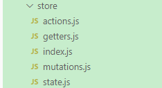

在index.js里

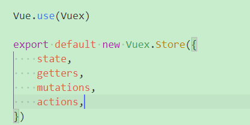

## mpvue-cnode

https://github.com/jaxQin/mpvue-cnode


# 写uniapp客户端

界面就跟VudeCnodeJS一样，采用侧滑抽屉。不用下面的tabbar

这样可以保证阅读面积最大，比较适合这种文章类的应用。

这里是抽屉的演示。

https://hellouniapp.dcloud.net.cn/pages/extUI/drawer/drawer

这种风格其实也可以。

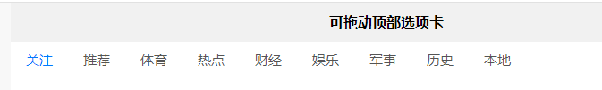

先做抽屉的。

新建项目cnode-uniapp。

从hello里拷贝common目录的uni.css和util.js到我的工程。

那就还需要static目录下的uni.ttf文件。

components下的uni开头的组件都拷贝过来，避免总是出错再去补充。

现在侧滑抽屉有了。但是是通过按钮点击出来的，应该要让侧滑也可以。

这一步也可以保证在手机上可以运行。

滑动居然官方没有，需要自己判断。

触摸事件是有的，然后判断坐标就好了。

现在要加上一个header。

大概是这样，左边的3杠，可以调出抽屉，中间是cnode的图片，右边可以放收到的消息，使用badge

放一个信封图标就好。

```
三    cnode     消息
```

这样的一个导航栏，看看怎么做。

```html
uni-nav-bar
```

还是需要至少3个page。

一个是显示所有的文章。

一个是显示文章详情，一个是显示用户详情。

在文章详情页，导航栏的左上角要改成返回键，而且这个页面的滑动也要做为返回。

用uni-nav-bar，有点问题，就是标题长度，会影响左边和右边的布局位置。

就是下面这样。

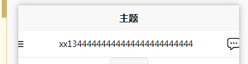


我对uni-nav-bar进行简单的修改，

可以到这个效果。是我想要的。

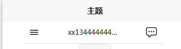

修改方法，方框内是我修改的。

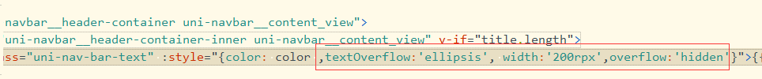

但是，如果标题没有，那么右边的消息图标位置会移动。

这个放到后面再完善。现在不管。

接下来，可以写抽屉的内容。

```
xxx/请登录（如果登录了，显示头像）
	登录是跳转到登录界面
	已经登录，则是跳转到用户详情页。
全部
精华
分享
问答
招聘
```

采用向下滑动，然后读取新数据的方式，这样才符合现代app的风格。

用分页的方式，则显得比较古老。

现在加了登陆功能，需要引入vuex。

参考VueCnodeJS的vuex版本代码来写。

新建一个store目录。一个index.js文件，另外4个js文件：state.js、getters.js、mutations.js、actions.js。

先只把userInfo放到里面。先只放loginname和avatar_url。

统一都叫Topic，不要叫Article，这样跟服务端的名称统一。

现在vuex的加进来了。也看懂了。

把文章的内容也都放到vuex里。


uni-app 如何判断/获取 左滑右滑上滑下滑 等手势事件。

https://ask.dcloud.net.cn/article/38074

uni-app导航栏开发指南

https://ask.dcloud.net.cn/article/34921

NavBar 导航栏

https://ext.dcloud.net.cn/plugin?id=52


# form-data方式post不行

我在postman里测试post token，form-data方式不行。

x-www-form-urlencoded可以。

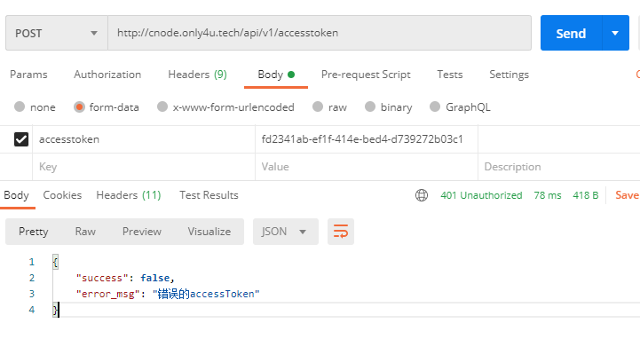

这篇文章提到了类似的问题。

https://stackoverflow.com/questions/30651484/req-body-not-populating-with-form-data

大概意思是说，

对form使用了错误的enctype。

express默认不支持multipart。

提交表单要这样

```
form(method='post', action='/signup', enctype='application/x-www-form-urlencoded')
```


用fiddler抓包，使用form-data的request是这样

```
POST http://cnode.only4u.tech/api/v1/accesstoken HTTP/1.1
User-Agent: PostmanRuntime/7.26.8
Accept: */*
Cache-Control: no-cache
Postman-Token: 63564e9d-b62e-4144-a511-23e7ba85c2f2
Host: cnode.only4u.tech
Accept-Encoding: gzip, deflate, br
Connection: keep-alive
Content-Type: multipart/form-data; boundary=--------------------------429117788169361456270128
Content-Length: 202

----------------------------429117788169361456270128
Content-Disposition: form-data; name="accesstoken"

fd2341ab-ef1f-414e-bed4-d739272b03c1
----------------------------429117788169361456270128--
```

回复的内容

```
HTTP/1.1 401 Unauthorized
Server: nginx
Date: Thu, 14 Jan 2021 05:21:26 GMT
Content-Type: application/json; charset=utf-8
Content-Length: 52
Connection: close
X-Powered-By: Express
X-Frame-Options: SAMEORIGIN
Vary: X-HTTP-Method-Override, Accept-Encoding
Access-Control-Allow-Origin: *
ETag: W/"34-Ipg/b7c0i/CkUKPzHtcmqjN1t34"
X-Response-Time: 3.577ms

{"success":false,"error_msg":"错误的accessToken"}
```

看看x-www-url-encoded的方式

request

```
POST http://cnode.only4u.tech/api/v1/accesstoken HTTP/1.1
User-Agent: PostmanRuntime/7.26.8
Accept: */*
Cache-Control: no-cache
Postman-Token: 6322b0e0-d830-4f85-b83d-14af6fe8afe0
Host: cnode.only4u.tech
Accept-Encoding: gzip, deflate, br
Connection: keep-alive
Content-Type: application/x-www-form-urlencoded
Content-Length: 48

accesstoken=fd2341ab-ef1f-414e-bed4-d739272b03c1
```

回复

```
HTTP/1.1 200 OK
Server: nginx
Date: Thu, 14 Jan 2021 05:26:04 GMT
Content-Type: application/json; charset=utf-8
Content-Length: 153
Connection: close
X-Powered-By: Express
X-Frame-Options: SAMEORIGIN
Vary: X-HTTP-Method-Override, Accept-Encoding
Access-Control-Allow-Origin: *
ETag: W/"99-cbhneqF9+I6CDLY7iIg1u52t5lk"
X-Response-Time: 3.060ms
Expires: Thu, 14 Jan 2021 17:26:04 GMT
Cache-Control: max-age=43200
Cache-Control: no-cache

{"success":true,"loginname":"teddyxiong53","avatar_url":"//gravatar.com/avatar/efa2a90d4561bb6a540a46dc8ebb6dee?size=48","id":"5ff2e6d6bd93ea18b7e0fe3c"}
```


那么现在问题就变成，express解析form-data的问题。

目前服务端是不打算动的，不解析这种就不解析。

还是想办法改客户端的请求方式。

仔细看了一下，发现是我写错了变量名导致的。

```
export const login = (data) => {
	console.log("data:", data)
	return request({
		url: "/accesstoken",
		method: 'post',
		params: data //之前把params写错了param，结果当然是没有传递数据过去。
	})
}
```

# 时间友好实现

moment是一个比较常用的库。

```
  date = moment(date);

  if (friendly) {
    return date.fromNow();
  } else {
    return date.format('YYYY-MM-DD HH:mm');
  }
```

# node-uuid

有2个接口，一个是v1()（基于时间戳），一个是v4()（基于随机数）

一般使用v1的。这样可以保证唯一性。

# loader

这个是jacksontian写的node静态资源加载器。

分为两种模式，线上模式和线下模式。

线上模式：输出合并和压缩后的地址。

线下模式：输出原始的文件地址。

好几年没有更新了。代码并不多，就一个文件loader.js。不到200行。

逻辑也很简单，就是相当于宏展开的意思。

主要提供的价值，就是方便在开发模式和生产模式的无缝切换。

当前make build会失败。是因为fs.writeFile的第三个参数是一个回调，没有提供。我给一个空函数就好了。

这执行的命令是：

```
@./node_modules/loader-builder/bin/builder views .
```

builder后面2个参数：

参数1：view所在的目录。

参数2：输出目录。

这个打开后，响应速度的确是非常明显的提示。


## loader-builder

用于Loader的构建器。

构建器用于扫描制定目录的视图文件，

将Loader语法的调用提取出来，生成资源文件的关系映射。

同时还对`.less`、`.styl`、`.coffee`、`.es`格式的文件进行编译，

将其转换为普通的`.js`、`.css`文件。

同时还会将编译好的文件通过`uglify`/`cleancss`进行压缩。

对同一个Loader标签下的js和css文件，还会将其combo成一个文件，并计算出hash。

# 自己简写服务端

发现写ejs容易出错。安装这个工具看看。

```
npm install -g ejs-lint
```

使用

```
ejslint 1.html
```

可以检测出一部分问题。但是不能检测所有问题。

当前检测不报错，但是运行报错。

先写layout.html。然后把注册功能相关的东西做了。

不断修改重启node app.js，然后我觉得nodemon的确是非常有必要的。

安装nodemon。

```
npm install -g nodemon
```

现在就不能实时保存了。实时保存导致nodemon频繁重启程序，没有必要。

手动保存。

修改html的，不能导致nodemon重启。

css有的没有生效，是less文件里的没有生效。

因为我没有安装loader-connect。不报错。但是也没有效果。

也是jacksontian写的。

还是要自己动手来写，不然这些点，只是看代码的话，根本注意不到。

接下来就是写数据库相关的。

注册功能完成。

现在再加上登录功能。

登录就要用到session。把cookie-parser、express-session、connect-redis都用起来吧。

还需要单独安装redis的node包。不然会报错：

```
 A client must be directly provided to the RedisStore
```

安装单独的redis node包。

```
npm i -s redis
```

还是报错。

那就可能是版本导致的。

现在写法改了。

```
store: new RedisStore({
        client: redis.createClient(config.redis_port, config.redis_host)
    }),
```

登录功能完成。

接下来实现topic。

先实现写topic的。这样才能插入数据。


测试碰到的问题就是，需要登录的场景，重启程序后，登录就失效了。

怎么提高这种场景的测试效率？


现在登录没有起作用。

登录后，auth.userRequired还是通不过。

因为我当前的authUser函数还是留空的。

代码里倒是有这样的mock_user，但是怎么操作呢？

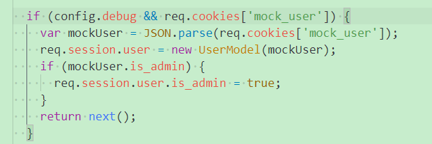

需要把测试代码看一下。

测试代码没有必要，很繁琐，还不如直接测试。

其实重启node app.js，cookie都还在的。

之前我有的地方把session单词写错了。所以不符合预期。

现在发布主题可以了。

接下来就在主页把主题读取显示出来。

现在用户信息卡片这里，总是不行。

partial的第二个参数可以这么用？

```
<%- partial('user/card',{ object: typeof(user) === 'undefined' ? current_user : user, as: 'user' }) %>
```

原版的ejs-mate是2.3.0的，我的是3.0.0的。

看了一下partial函数，的确有大的改动。

导致上面的写法，无法把current_user当成user传递到card这个模板里。

现在的partial函数，只接收一个参数了。

把ejs-mate降级。降级后的确就可以了。

从这里可以看出，还是完全自己手写，不然这种问题，就不容易碰到。


现在score是显示undefined的。

可能是没有给默认值导致的。

是的。


# 测试代码分析

看Makefile里怎么进行测试的。

make test执行的

```
1、安装需要的包。
2、如果没有config.js文件，则cp config.default.js config.js
3、如果没有public/upload目录，创建这个目录。
4、NODE_ENV=test ./node_modules/mocha/bin/mocha --report spec -r should -r test/env --timeout 10000 $(TESTS)
$(TESTS)是把test目录下*.test.js文件都搜索出来的。
```

测试代码也是非常繁琐。

# 采用了这套框架的其他网站

https://www.vue-js.com/

这个vue论坛，使用这套程序搭建的。可用看看改了些什么。可用参考着改。

# 关于这套系统的缺点

由于之前用nodeclub搭建的论坛比较简单，可用性比较差，

尤其在权限控制上粒度太高，

只有管理员和普通用户的区别，

如果全公司使用，可能有些板块是部门内部的板块不便开放给其他部门，

或者有些板块可以对公司外开放，再或者帖子中上传附件的功能，nodeclub只支持上传图片，需要借助七牛云，

这些功能其实通过修改nodeclub的源码都可以实现，但是我真的没时间写。

在之前用nodeclub搭建论坛的时候调研过nodebb，

发现nodebb的代码很复杂，

并且在我机器上搭建测试了一下发现有点卡顿，

和简洁轻便的nodeclub相比我还是选择了nodeclub。

但是这次不同了，nodebb社区不断的更新迭代以及生态环境下多种插件的支持

使得nodebb增加新功能的时候变得非常简单。

并且经过了多个版本的迭代，nodebb已经很稳定，并且想vue的论坛、青云论坛都在使用nodebb进行搭建。


参考资料

nodeclub迁移至nodebb

https://www.codeleading.com/article/89763983571/

# 参考资料

1、Express框架-母版ejs-mate

https://blog.csdn.net/weixin_41933298/article/details/88392689

