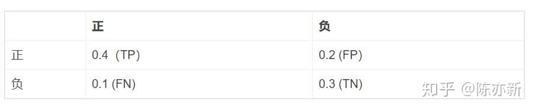

--

首先，要背住的几个概念就是：accuracy,precision,recal, TP,FP,TN,FN

- TP:true positive。预测是正确的正样本
- FP:false positive。预测是错误的正样本
- TN：true negative。预测是正确的负样本
- FP:false positive。预测是错误的负样本

图中的TP，FP等是一个比例，假设总共有100个样本，有40个是TP，有20个是FP……(不过混淆矩阵一般不用除以总样本数量)

对应上面的例子，可以得到Accuracy=0.7。

**【准确率Accuracy的弊端】**

准确率作为我们最常用的指标，当出现样本不均衡的情况时，并不能合理反映模型的预测能力。例如测试数据集有90%的正样本，10%的负样本，假设模型预测结果全为正样本，这时准确率为90%，然而模型对负样本没有识别能力，此时高准确率不能反映模型的预测能力。

## **精确率Precision**

**表示预测为正的样本中，实际的正样本的数量。**

## **召回率Recall**

**Recall表示实际为正的样本被判断为正样本的比例**

## **F1 score**

Precision和Recall是一对矛盾的度量，一般来说，Precision高时，Recall值往往偏低；而Precision值低时，Recall值往往偏高。

当分类置信度高时，Precision偏高；

分类置信度低时，Recall偏高。

为了能够综合考虑这两个指标，F-measure被提出（Precision和Recall的加权调和平均），即：

F1-score适用于二分类问题，对于多分类问题，将二分类的F1-score推广，有Micro-F1和Macro-F1两种度量。

参考资料

1、

https://zhuanlan.zhihu.com/p/166022017