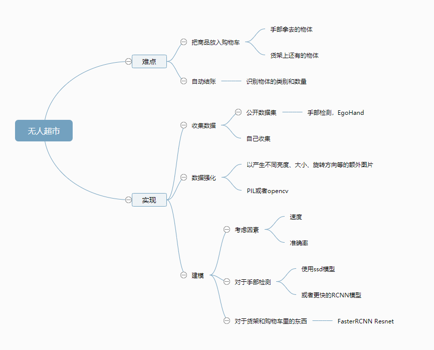

--

RCNN将CNN方法引入目标检测领域， 大大提高了目标检测效果，可以说改变了目标检测领域的主要研究思路，

RCNN算法分为4个步骤

1. 候选区域生成： 一张图像生成1K~2K个候选区域 （采用Selective Search 方法）
2. 特征提取： 对每个候选区域，使用深度卷积网络提取特征 （CNN）
3. 类别判断： 特征送入每一类的SVM 分类器，判别是否属于该类
4. 位置精修： 使用回归器精细修正候选框位置

经过R-CNN和Fast RCNN的积淀，Ross B. Girshick在2016年提出了新的Faster RCNN，在结构上，Faster RCNN已经将特征抽取(feature extraction)，proposal提取，bounding box regression(rect refine)，classification都整合在了一个网络中，使得综合性能有较大提高，在检测速度方面尤为明显。

Faster R-CNN的训练，是在已经训练好的model（如VGG_CNN_M_1024，VGG，ZF）的基础上继续进行训练。实际中训练过程分为6个步骤：

1. 在已经训练好的model上，训练RPN网络，对应stage1_rpn_train.pt
2. 利用步骤1中训练好的RPN网络，收集proposals，对应rpn_test.pt
3. 第一次训练Fast RCNN网络，对应stage1_fast_rcnn_train.pt
4. 第二训练RPN网络，对应stage2_rpn_train.pt
5. 再次利用步骤4中训练好的RPN网络，收集proposals，对应rpn_test.pt
6. 第二次训练Fast RCNN网络，对应stage2_fast_rcnn_train.pt

随着科学技术的发展,越来越多的场景都逐渐实现了自动化或半自动化。

新零售的背景下,自动化零售近年来也受到了广泛的关注。

传统的识别方法有条码识别和RFID射频识别。

然而条码识别需要人工辅助,自动化程度低。

RFID由于布置成本高,没有普及开来。

通过人工智能技术和计算机视觉方法,自动化地识别顾客购买的商品,成为重要的研究课题。

如何在非限制条件下,对可旋转、多视角、少量数据标注的商品识别是目前研究的重点和难点。

本文针对超市商品图像识别问题,其主要工作内容如下:

1.对于单个商品的识别,在实际场景下,图像包含大范围的背景且没有商品位置的标注;而且数据采集消耗成本大,训练图像仅有少量训练样本;此外,与通用物体识别不同,商品对象角度是不确定的,识别的难度更大。

本文针此问题,提出了一种候选区域标注算法,

仅需要公开数据集训练,即可对商品图像生成有误差的预标注。

同时结合增强样本方法,生成不同角度的样本,并通过迁移学习对商品识别进行再训练,

**使模型具有旋转不变性,实现商品的识别。**

实验结果表明,通过所提出的候选区域标注算法,使得商品识别达到了 86.6%的top-1准确率和94.34%的top-3准确率。

可以简单理解faster R-CNN为RPN和fast R-CNN的结合，通过RPN代替SS提取候选区域，加快了运行速度。

2016年年末，Amazon无人超市横空出世。

在这家无人超市，店内的相机能够自动追踪你拿取的商品；

完成购物后，你无需排队等候收银，只用直接走出超市。

难点一：把商品加入购物车

超市里的智能货架需要能够追踪到客户拿走了什么商品。我们可以用两个物品识别模型来实现这个功能，一个用来跟踪手部动作以获取被拿起的物品。另一个独立模型则用于检测货架的空间。请看下面的动画，同时使用两个模型可以大大降低误判。

难点二：自动结账

无人超市的需要解决的另一难点是，实现摄像头对物品的一次性识别，这样我们就不需要在结账的时候一件一件物品地扫描过机了。

直接通过购物车里的摄像头检测所买的物品，在你走出超市的那一刻就自动结帐。这个不要太酷哦！

为此，我们需要建立另一个识别模型，用以检测识别物品的种类以及数量。请看下面的动画（即使物品只有部分可见仍能被准确识别出来）。

7月份，阿里巴巴无人超市“淘咖啡”亮相杭州，模式上，与Amazon go无人超市类似。消费者只需在进入商店时扫码并确认身份，挑选自己中意的产品装进购物袋，然后直接走出商店即可完成购买，无需排队，无需等待结账。

要匹配顾客和商品的 ID，首先要确定人和商品的定位。

关于人的定位，可以用到追踪系统。

手机的 GPS、wifi、蓝牙也可以提供较准确丰富的位置信息。

关于商品的定位，红外、重量感应、相机、商品和货架初始的位置都是已知的，可以推测出来。

例如，通过隔板，将同类商品分在不同的网格种，每个网格对应不同的红外或重量感应器，可以知道被拿取或放回商品的位置。

通过人和商品的位置匹配，连接了“什么商品”“被谁”两个因素。

因为成本和技术问题，位置精度是一个很大的问题，再加上这个定位人和商品位置的方案本身的缺陷，顾客和商品的匹配误差较大。

例如，顾客 A 站在商品 A 前，顾客 B 站在商品 B 前，顾客 A 伸手去拿商品 B，这种情况系统是无法准确判断的。

当然可以由顾客确认，但是这仅仅是无力的补救措施。

**之前有人提到过 Amazon Go 可能利用多角度的完整的人体姿态识别来定位匹配人—动作—商品的关系。**

这种方法的关键是**摄像头需要很好的视野和足够的摄像头。**

从宣传视频来看， Amazon Go 的货架设计使得最低层和中间层是无法获取足够好的视野，可能的解决方式是依靠对面货架和天花板的摄像头。

Amazon Go 的货架构造非常重要，只要再提供一份货架结构图或者实物图就可以进一步推测实施方案。

货架结构包括是否每层都有设想头，承载商品的承重面的形状及尺寸，特殊开口和螺丝位置等。

- **阿里淘咖啡：**相比Amazon多了一道结算门，可以肯定的是当前一定使用RFID。至于有没有使用机器视觉技术，技术负责人多马在采访中表示，商品识别技术目前还比较敏感，涉及到专利申请，在文后的附件中添加了预测处当前可能应用的技术。在结算门方面提高了结算阻力，体验方面该项弱于亚马逊。但是此刻牺牲些体验提高最基本的风控这样的选择还是比较准确的。
- **Amazon Go：**是无人零售市场中最早尝试的一家，并且亚马逊在无人商店技术方面和范围经济的成本控制上，都有很大的优势。Amazon Go采用的计算机视觉技术、传感器、图像分析和深度学习技术，和其开发无人驾驶汽车的一样。在应用于无人零售店时，只需针对性进行开发和优化而已，增加的研发成本相对较低。但是在应用上，上文也有提及，视觉技术无法识别更加复杂的场景，这样无疑提高了风险。

无人超市虽然表面上节省了导购和收银的人力成本，但是多了技术研发和移动支付的部署，以及必要的硬件设备和特别的装修，另外还有品牌营销、商品补货、整理货架、保洁等工作仍然需要人来做，换句话说，无人零售店并不是完全取代人工，只是降低了一部分人工成本。有个投资者做过测算缤果时光这样的无人商店假如有100万的货物，80万都是硬成本，只有5万是人工成本和租金。可见人工成本所占的比例。所以即使实现无人销售的成本，单个无人零售店难以普遍推广，需要形成一个规模效应才能迎来低成本时代。而且，在用户体验方面，上货速度影响顾客使用感受。

而之所以推测骨骼分析，不是现阶段较成熟的图像分割技术（即把捕捉对象的边缘分割出来，从而去识别对象的行为），是因为后者存在一个问题，就是当店里人数一多，摄像头就容易抓瞎：假如十几个人同时在抢购同一款商品；或者几个人手交叉着去拿各自想要的商品，对图像分割来说，非常容易出现混乱。

# coco数据集

COCO的 全称是Common Objects in COntext，

是微软团队提供的一个可以用来进行图像识别的数据集。

MS COCO数据集中的图像分为训练、验证和测试集。

COCO通过在Flickr上搜索80个对象类别和各种场景类型来收集图像，

其使用了亚马逊的Mechanical Turk（AMT）。

COCO数据集的80个类别—YoloV3算法采用的数据集

 当在ImageNet竞赛停办后，

COCO竞赛就成为是当前目标识别、检测等领域的一个最权威、最重要的标杆，

也是目前该领域在国际上唯一能汇集Google、微软、Facebook以及国内外众多顶尖院校和优秀创新企业共同参与的大赛。 
该数据集主要解决3个问题：

目标检测，目标之间的上下文关系，目标的2维上的精确定位。

COCO数据集有91类，虽然比ImageNet和SUN类别少，但是每一类的图像多，

这有利于获得更多的每类中位于某种特定场景的能力，对比PASCAL VOC，其有更多类和图像。

**COCO目标检测挑战** 

- COCO数据集包含20万个图像；
- 80个类别中有超过50万个目标标注,它是最广泛公开的目标检测数据库；
- 平均每个图像的目标数为7.2，这些是目标检测挑战的著名数据集。

在这篇文章中，我们会进一步地了解这些用在目标检测中的算法，

首先要从RCNN家族开始，例如RCNN、Fast RCNN和[Faster RCNN](https://link.zhihu.com/?target=http%3A//mp.weixin.qq.com/s%3F__biz%3DMzI3ODkxODU3Mg%3D%3D%26mid%3D2247485360%26idx%3D1%26sn%3D6681da44c88874cd6f43a8567beaba4b%26chksm%3Deb4ee373dc396a65d0ca507d048f9b6527c5a86287607e4a6cc991ee2a8526039cf1a329e2e5%26scene%3D21%23wechat_redirect)。

在本系列接下来的文章中我们会谈到更高级的算法，例如YOLO、SSD等等。

SSD有人说是faster RCNN和YOLO的结合体，是有道理的。

首先说SSD的贡献，它的贡献在于它利用了多层网络特征，而不仅仅是FC7。

那么为什么说它像YOLO呢，这主要是因为，SSD还是借鉴了detection转化为regression的机制，而说它像faster RCNN是因为借鉴了anchor的机制，只不过它的anchor不是每个位置的精调，是跟YOLO一样画网格，然后在网格上产生anchor，由于利用了多层特征，anchor的scale每层都不同，因此产生了较多的超参数，增加了训练难度。

所以说，三种算法在实际应用中faster RCNN鲁棒性会可能会强一些，但是鱼与熊掌不可兼得，速度也会较慢。

1、RCNN- 将CNN引入目标检测的开山之作

https://zhuanlan.zhihu.com/p/23006190

2、无人超市目标检测算法的选型

https://blog.51cto.com/yixianwei/2086347

3、

http://cnki.cqgmy.edu.cn/KCMS/detail/detail.aspx?filename=1018088382.nh&dbcode=CMFD&dbname=CMFD2019

4、

https://blog.csdn.net/weixin_38734534/article/details/111130012

5、

https://cloud.tencent.com/developer/article/1134661

6、

http://www.woshipm.com/evaluating/844631.html

7、

https://blog.csdn.net/qq_41185868/article/details/82939959

8、

https://zhuanlan.zhihu.com/p/46963225

9、

https://blog.csdn.net/lanmengyiyu/article/details/79680022