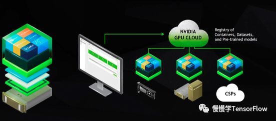

--

ngc是NVIDIA GPU Cloud的缩写。

**“**Nvidia GPU Cloud 真正实现了个人电脑、工作环境、云端环境的大统一，能节省大量搭基础环境的时间**”**

NVIDIA GPU Cloud(简称 NGC)是面向深度学习和科学计算优化的 GPU 加速云平台，包括 NGC 容器、registry 以及平台软件。

注意该“云平台”并不是传统意义上的“云”(AWS，Azure，阿里云之类向用户提供软硬件基础设施并获得利润的厂商)，

而是 Nvidia  向所有 GPU 用户(无论是大厂还是创业公司，无论是科研院所还是个人爱好者)提供的免费的、**针对深度学习优化过的容器镜像**，

目的是帮助 Nvidia GPU 用户快速搭建深度学习环境、尽可能高效利用手头硬件的计算能力(顺带多卖些 GPU，提高用户粘性)。

上图左侧最底层是一台 DGX 服务器(焕发着象征土豪专属的金色光泽)，向上为操作系统，驱动，Docker 引擎等软件栈，

最上面几层将 CUDA、cuDNN、TF/Caffe/MXNet/PyTorch…… 封装在一个集装箱中，即为 Docker 容器。

右侧则表明该容器可以运行在消费级 GPU(比如我手头的 GTX 1080)、私有云(比如公司的 GPU 服务器)、公有云 GPU 实例(比如 AWS G3)上。

这些镜像不仅种类多样，涵盖主流 DL 框架，而且更新很频繁，基本每个月都会发布新版本镜像。以 TensorFlow 镜像为例，其镜像发布记录如下图：

可见内置了运行 TensorFlow 训练的所有必备软件，能轻松运行在单机单卡、单机多卡、多机多卡环境。

目前 NGC 只支持 Pascal、Volta、Turing 架构 GPU，也就是设备版本号必须大于等于 6.0(可以运行 CUDA deviceQuery 查询设备版本号)。我使用的 GTX 1080，设备版本号为 6.1，满足该条件。

安装 nvidia-docker

Nvidia 利用容器来开发、测试、评测、部署深度学习框架和 HPC 应用，为此专门为 docker 开发了 runtime 以更好地支持 Nvidia GPU，即为 nvidia-docker。

参考资料

1、

https://blog.csdn.net/weixin_31077125/article/details/112519899